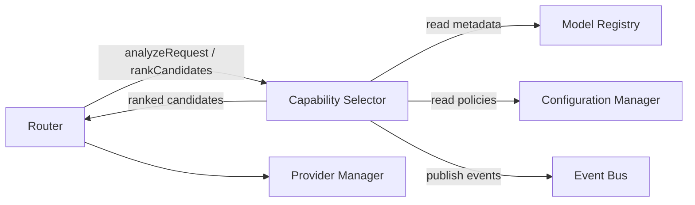
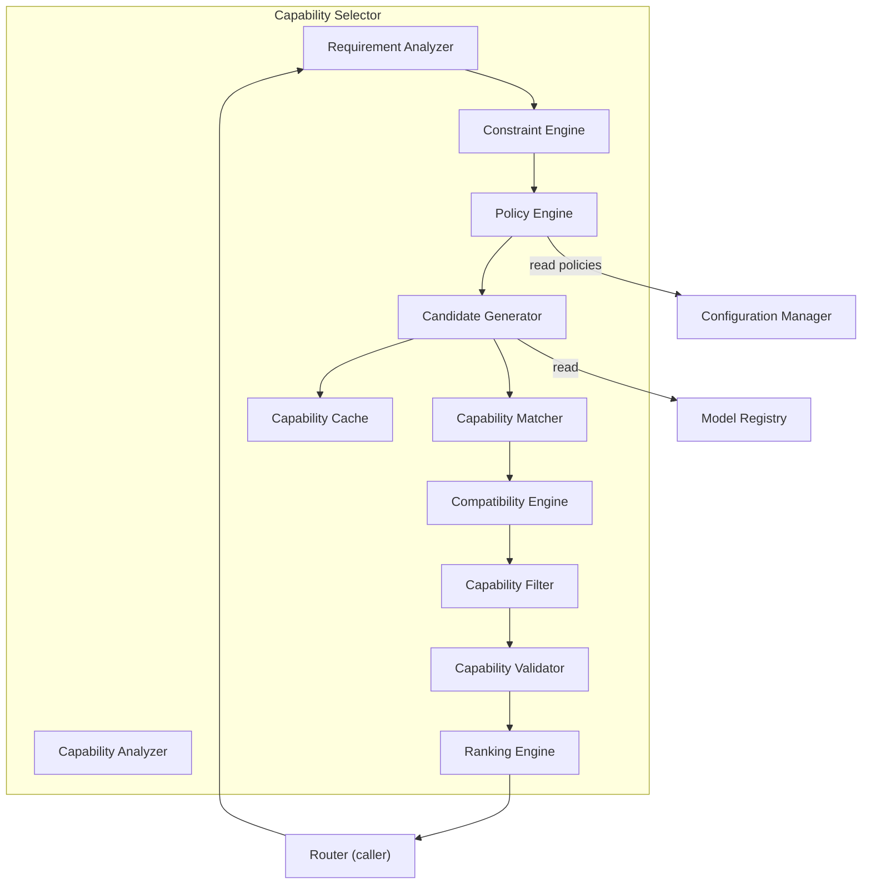
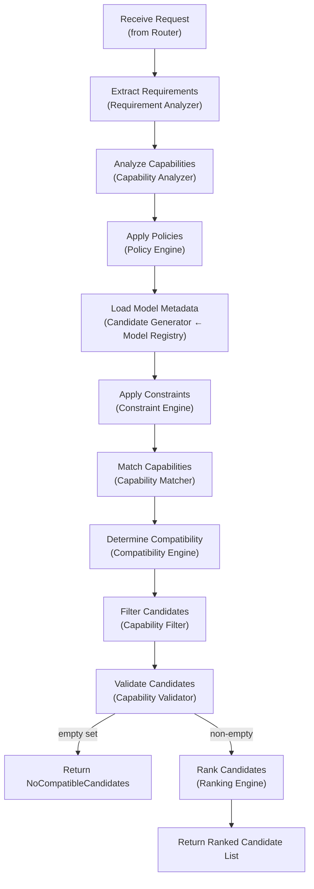
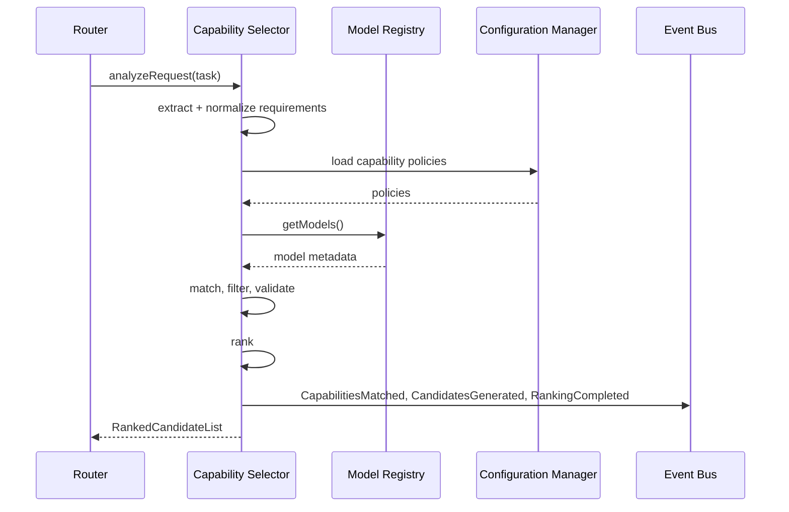
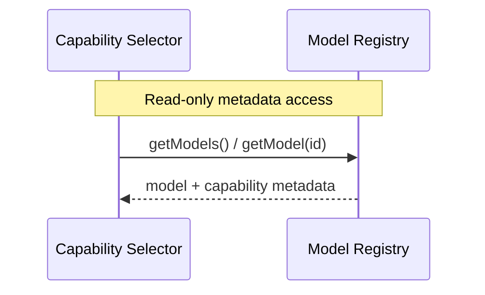
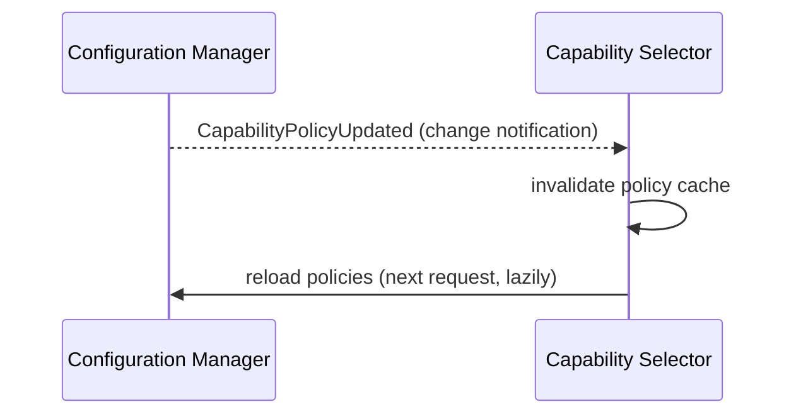
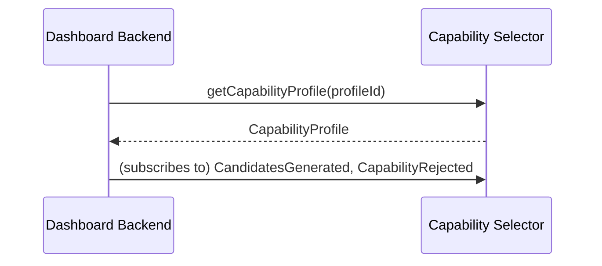
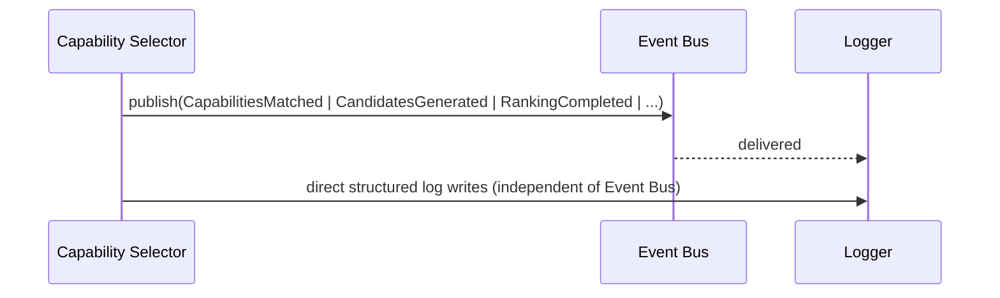

You are reviewing the FINAL version of the Capability Selector Module Design Document (MDD) for a production-grade Hybrid AI Development Platform.

IMPORTANT

This is the FINAL architecture review.

The architecture has already been finalized.

DO NOT redesign the Capability Selector.

DO NOT rewrite existing sections.

DO NOT simplify explanations.

DO NOT change responsibilities.

DO NOT modify the capability analysis pipeline.

DO NOT change requirement analysis.

DO NOT modify capability matching.

DO NOT change ranking behavior.

DO NOT modify capability policies.

DO NOT modify public interfaces.

DO NOT change lifecycle.

DO NOT modify folder structure.

DO NOT introduce new architectural patterns.

DO NOT introduce new modules.

DO NOT renumber sections.

Only perform the refinements below.

==========================================================
OBJECTIVE
==========================================================

The Capability Selector architecture is complete.

The objective is to strengthen governance, operational guidance, enterprise readiness, maintainability, and long-term evolution while preserving the existing architecture.

==========================================================
1. ADD

Architectural Constraints
==========================================================

Append a section titled:

## Architectural Constraints

Document immutable architectural rules.

Include constraints similar to:

• Capability Selector never performs routing.

• Capability Selector never executes providers.

• Capability Selector never communicates with provider SDKs.

• Capability Selector never performs planning.

• Capability Selector never performs orchestration.

• Capability Selector never performs browser automation.

• Capability Selector never retrieves memory.

• Capability Selector never reviews AI output.

• Capability Selector never validates AI responses.

• Capability Selector never performs retries.

• Capability Selector never performs fallback.

• Capability Selector never calculates execution cost.

• Capability Selector never monitors provider health.

• Capability Selector never modifies Model Registry metadata.

• Capability Selector never makes the final model selection.

• Router remains the sole owner of routing decisions.

Clearly explain these are mandatory architectural rules.

==========================================================
2. ADD

Architectural Decision Records
==========================================================

Append:

## Architectural Decision Records (ADR)

Include concise ADRs.

Suggested entries:

ADR-001 Capability-Based Selection

ADR-002 Advisory Ranking

ADR-003 Router Owns Final Selection

ADR-004 Metadata-Driven Analysis

ADR-005 Stateless Analysis Pipeline

ADR-006 Configuration-Driven Policies

ADR-007 Explainable Ranking

ADR-008 Read-Only Model Registry Access

ADR-009 Event-Driven Notifications

ADR-010 Strategy-Based Ranking

Each ADR should include:

• Decision

• Context

• Alternatives Considered

• Rationale

• Consequences

==========================================================
3. ADD

Capability Catalog Governance
==========================================================

Document governance for:

Capability ownership

Capability evolution

Capability versioning

Capability approval

Capability deprecation

Capability compatibility

Capability documentation

Capability naming conventions

==========================================================
4. ADD

Capability Versioning Policy
==========================================================

Document:

Capability catalog versioning

Capability profile versioning

Policy versioning

Schema compatibility

Backward compatibility

Forward compatibility

Breaking changes

Migration strategy

==========================================================
5. ADD

Ownership Matrix
==========================================================

Document ownership boundaries.

Capability Selector owns:

• Requirement analysis

• Capability analysis

• Capability matching

• Constraint evaluation

• Candidate generation

• Capability filtering

• Compatibility evaluation

• Candidate ranking

• Capability policies (consumption only)

Model Registry owns:

• Model metadata

• Metadata validation

• Metadata lifecycle

Router owns:

• Final model selection

• Routing strategy

• Retry strategy

• Fallback

Provider Manager owns:

• Provider execution

• Streaming

• Cost calculation

Configuration Manager owns:

• Capability catalog

• Policies

• Ranking configuration

Explain ownership never overlaps.

==========================================================
6. ADD

Processing Guarantees
==========================================================

Document guarantees.

Examples:

Every request produces deterministic analysis.

Every candidate receives one compatibility evaluation.

Every rejected candidate includes rejection reasons.

Every ranked candidate includes score breakdown.

Every analysis is fully explainable.

Every result is reproducible.

Every analysis is stateless.

==========================================================
7. ADD

Capability Identity Model
==========================================================

Document identifiers.

Include:

requestId

requirementId

capabilityId

profileId

candidateId

modelId

providerId

policyId

correlationId

traceId

spanId

Explain identifier relationships.

==========================================================
8. ADD

Operational Limits
==========================================================

Document configurable limits.

Include:

Maximum capabilities per request

Maximum capability profiles

Maximum constraints

Maximum candidates

Maximum ranking depth

Maximum policy count

Maximum analysis timeout

Maximum cache size

Maximum concurrent analyses

State all limits are configuration driven.

==========================================================
9. ADD

Observability Standards
==========================================================

Document telemetry.

Capture:

requestId

requirementId

candidateCount

filteredCount

rankedCount

analysisLatency

matchingLatency

rankingLatency

cacheHitRate

policyCount

degradedMode

Explain support for diagnostics and monitoring.

==========================================================
10. ADD

Capability Compatibility Governance
==========================================================

Document:

Compatibility ownership

Compatibility rules

Dependency rules

Mutual exclusion rules

Constraint governance

Capability validation

Rule evolution

Conflict resolution

==========================================================
11. ADD

Ranking Governance
==========================================================

Document:

Weight ownership

Weight evolution

Ranking strategy versioning

Tie-breaking rules

Score normalization

Deterministic ordering

Explainability requirements

Future strategy replacement

==========================================================
12. ADD

Failure Recovery Guarantees
==========================================================

Document recovery principles.

Examples:

Cache failures never affect correctness.

Policy failures use cached policies.

Registry failures degrade gracefully.

Ranking failures fall back deterministically.

Analysis failures never corrupt state.

Recovery remains deterministic.

==========================================================
13. ADD

Security Governance
==========================================================

Expand security documentation.

Include:

Capability integrity

Policy integrity

Ranking integrity

Configuration protection

Override governance

Audit requirements

Read-only metadata access

Administrative approval

==========================================================
14. ADD

Future Scalability Considerations
==========================================================

Document future expansion.

Include:

Distributed capability caches

Regional capability catalogs

Parallel ranking

Distributed analysis

Capability federation

Marketplace capability catalogs

AI-assisted capability analysis

Distributed policy evaluation

Explain these are future enhancements and do not alter the current architecture.

==========================================================
GENERAL REQUIREMENTS
==========================================================

Do NOT redesign the Capability Selector.

Do NOT modify the capability analysis pipeline.

Do NOT modify requirement analysis.

Do NOT modify capability matching.

Do NOT modify compatibility evaluation.

Do NOT modify ranking logic.

Do NOT modify capability policies.

Do NOT modify public interfaces.

Do NOT modify lifecycle.

Do NOT modify folder structure.

Do NOT introduce new modules.

Do NOT rewrite existing sections.

Preserve writing style.

Preserve numbering.

Preserve formatting.

Only append enterprise governance, operational standards, architectural constraints, and long-term maintainability guidance.

After these refinements, the Capability Selector Module Design Document should be considered finalized and require no further architectural modifications before implementation.# Module Design Document (MDD)
## Capability Selector

**Version:** 1.0
**Status:** Draft for engineering review
**Companion to:** SDD v1.0, API Specification v1.0, Database Design Document v1.0, Orchestrator Core MDD, Event Bus MDD, Request Manager MDD, Provider Manager MDD, Provider Plugin System MDD, Model Registry MDD

---

## 1. Executive Summary

### Purpose
The Capability Selector is a pure **analysis engine**. Given a task's requirements and the current model metadata held by the Model Registry, it determines which models are *capable* of doing the work, and produces a ranked, advisory candidate list. It does not decide which one gets used — that decision belongs exclusively to the Router.

### Responsibilities
Requirement analysis, capability matching, constraint/policy enforcement, candidate generation, and advisory ranking — nothing else. It reads model metadata; it never writes it. It never calls a provider, a model, or the Router's own decision logic.

### Role
The Capability Selector is the platform's **capability-to-model translation layer**. Every other module that needs to reason about "which models can do X" — chiefly the Router — depends on this module rather than re-implementing capability matching logic themselves. This is the concrete mechanism behind the SDD's capability-based routing principle (SDD §11): the Router asks "what can do this?", and the Capability Selector is the module that answers.

### Architecture Position

The Capability Selector sits **between** the Model Registry (data source) and the Router (decision maker), never touching Provider Manager or any provider directly.

---

## 2. Goals

### Primary Goals
- Deterministically and correctly identify every model whose declared capabilities satisfy a task's stated requirements.
- Produce an advisory ranking of capable candidates using transparent, explainable scoring — never a black box.
- Remain entirely provider-agnostic and metadata-driven: adding a new provider, model, or capability type requires zero source-code change.

### Secondary Goals
- Provide clear, structured rejection reasons for models that were excluded, to aid debugging and future dashboard display.
- Support organization/operator-defined capability policies without code changes (§12).
- Keep analysis latency low enough to sit comfortably on the Router's synchronous decision path.

### Future Goals
- Capability learning (adjusting scoring weights based on observed outcomes, coordinated with the Learning Layer).
- AI-based matching for fuzzy/semantic requirement interpretation.
- Marketplace capability plugins contributed by third parties.

### Non-Goals
- This module never executes a model, calls a provider SDK, performs retries/fallback, makes the final routing decision, plans tasks, manages memory, reviews output, calculates cost in absolute currency terms (it reads cost metadata as a ranking input only), tracks usage, monitors health, normalizes responses, stores model metadata, or implements routing strategy. All of these belong to other modules per the platform's module boundaries (see §4).

---

## 3. Responsibilities

### Must Have
- Extract structured requirements (mandatory + optional capabilities, constraints) from a task request.
- Load current model metadata from the Model Registry (read-only) for candidate evaluation.
- Apply capability policies (mandatory rules, organization rules, overrides) from Configuration Manager.
- Match each candidate model's declared capabilities against the extracted requirements.
- Filter out non-compatible models (missing mandatory capability, violates a hard constraint, blocked by policy).
- Score and rank the remaining candidates using a transparent, explainable algorithm.
- Return a ranked candidate list with per-candidate rejection/inclusion reasoning to the calling Router.
- Publish capability-analysis lifecycle events.

### Should Have
- Cache recent capability-analysis results for identical/similar requirement sets to reduce repeated Model Registry reads (§19).
- Expose a capability-profile introspection interface for the future Dashboard Backend.

### Future Responsibilities
- Capability learning feedback loop.
- Support for third-party/marketplace-contributed capability definitions.
- AI-assisted semantic requirement interpretation.

---

## 4. Scope

### Owns
Capability Analysis, Capability Matching, Requirement Analysis, Capability Rules, Capability Validation, Capability Ranking, Candidate Generation, Capability Compatibility, Capability Constraints, Capability Filtering, Capability Scoring, Capability Policies, Capability Profiles.

### Does Not Own
Execution, Provider Selection, Provider Communication, Provider SDKs, Retry, Fallback, Streaming, Planning, Memory, Browser Automation, Review, Business Logic (beyond capability logic itself), Cost Calculation (absolute pricing computation), Usage Tracking, Health Monitoring, Response Normalization, Model Metadata Storage (it reads, never writes, the Model Registry), Routing Strategy (the Router's ranking-to-decision translation, retry/failover ordering, etc.).

### Collaborates With
| Module | Nature of collaboration |
|---|---|
| Model Registry | Read-only source of model/capability metadata |
| Router | Primary consumer — calls this module, consumes its ranked output, makes the final decision |
| Provider Manager | No direct interaction (receives the Router's decision, not this module's output) |
| Provider Plugin System | No direct interaction |
| Configuration Manager | Source of capability policies (§12) |
| Event Bus | Publishes capability lifecycle events |
| Logger | Receives structured logs |
| Dashboard Backend | Consumes capability-profile introspection data (read-only, via this module's public interface) |

---

## 5. Internal Architecture



### 5.1 Requirement Analyzer
- **Purpose**: Turn a task's raw request payload into a structured `RequirementSet`.
- **Responsibilities**: extract mandatory vs. optional capability tags, detect explicit constraints (e.g., `minContextWindow`, `maxCostPerToken`), detect priority hints (e.g., "prefer low latency").
- **Inputs**: task request (from Router, originating from Planner's task annotation per SDD §11).
- **Outputs**: `RequirementSet { mandatory[], optional[], constraints{}, priorityHints{} }`.
- **Dependencies**: none external — pure transformation logic.
- **Lifecycle**: stateless, invoked once per `analyzeRequest` call.

### 5.2 Capability Analyzer
- **Purpose**: Resolve raw capability tags against the controlled Capability Model (§7), expanding aliases and validating known-ness.
- **Responsibilities**: normalize capability names, resolve capability dependencies (e.g., "function_calling" implies "structured_output" support in some capability profiles), flag unknown capability tags.
- **Inputs**: `RequirementSet`.
- **Outputs**: normalized `RequirementSet` with resolved capability identifiers.
- **Dependencies**: Capability Model definitions (versioned, config-loaded — see §7).
- **Lifecycle**: stateless.

### 5.3 Constraint Engine
- **Purpose**: Evaluate hard numeric/boolean constraints independent of capability tags (context window minimums, cost ceilings, locality requirements).
- **Responsibilities**: parse constraint expressions from the `RequirementSet`; expose a `satisfies(model, constraints): bool` evaluation used later by the Compatibility Engine.
- **Inputs**: `RequirementSet.constraints`, candidate model metadata.
- **Outputs**: per-candidate boolean satisfaction result + reason.
- **Dependencies**: none external.
- **Lifecycle**: stateless.

### 5.4 Policy Engine
- **Purpose**: Apply operator/organization-defined capability policies (§12) on top of raw requirement matching.
- **Responsibilities**: load active policies from Configuration Manager; apply mandatory rules (e.g., "never select a model without `privacy` capability for this project"), optional rules, and override rules.
- **Inputs**: `RequirementSet`, policy set.
- **Outputs**: an amended `RequirementSet` (policies may add mandatory capabilities or exclude specific models/providers outright) plus a policy-exclusion list.
- **Dependencies**: Configuration Manager port.
- **Lifecycle**: stateless per call; policy set is cache-refreshed on `CapabilityPolicyUpdated`.

### 5.5 Candidate Generator
- **Purpose**: Produce the initial candidate pool from the Model Registry before fine-grained matching.
- **Responsibilities**: query Model Registry for all models, apply a coarse pre-filter (availability, health, provider policy exclusions from §5.4) to avoid wasting matching effort on obviously ineligible models.
- **Inputs**: amended `RequirementSet`, Model Registry snapshot (via Capability Cache when fresh, §5.11).
- **Outputs**: `CandidatePool[]` (unfiltered-by-capability but availability-eligible models).
- **Dependencies**: Model Registry port, Capability Cache.
- **Lifecycle**: stateless, one call per analysis.

### 5.6 Capability Matcher
- **Purpose**: Compare each candidate's declared capabilities against the `RequirementSet`'s mandatory/optional tags.
- **Responsibilities**: exact tag matching, capability-dependency-aware matching (via Capability Analyzer's resolved dependencies), partial/optional-capability scoring input.
- **Inputs**: `CandidatePool[]`, normalized `RequirementSet`.
- **Outputs**: per-candidate `MatchResult { mandatorySatisfied: bool, optionalSatisfiedCount, missingCapabilities[] }`.
- **Dependencies**: none external.
- **Lifecycle**: stateless.

### 5.7 Compatibility Engine
- **Purpose**: Combine Capability Matcher results with Constraint Engine results into a single compatibility verdict per candidate.
- **Responsibilities**: a candidate is "compatible" only if `mandatorySatisfied` is true **and** all hard constraints are satisfied.
- **Inputs**: `MatchResult[]`, Constraint Engine results.
- **Outputs**: `CompatibilityResult[] { candidateId, compatible: bool, reasons[] }`.
- **Dependencies**: Capability Matcher, Constraint Engine (composed, not called independently by callers).
- **Lifecycle**: stateless.

### 5.8 Capability Filter
- **Purpose**: Reduce the candidate pool to only compatible candidates.
- **Responsibilities**: apply `CompatibilityResult.compatible === true`; retain rejection reasons for rejected candidates for observability (§16).
- **Inputs**: `CompatibilityResult[]`.
- **Outputs**: `FilteredCandidates[]` + `RejectedCandidates[]` (with reasons).
- **Dependencies**: none external.
- **Lifecycle**: stateless.

### 5.9 Capability Validator
- **Purpose**: Final sanity validation before ranking — catches malformed metadata, contradictory policy states, or an empty result set.
- **Responsibilities**: verify `FilteredCandidates[]` entries have complete metadata required for ranking (§11); if the filtered set is empty, produce a structured "no compatible candidates" result rather than an exception.
- **Inputs**: `FilteredCandidates[]`.
- **Outputs**: validated candidate set, or an explicit `NoCompatibleCandidates` result.
- **Dependencies**: none external.
- **Lifecycle**: stateless.

### 5.10 Ranking Engine
- **Purpose**: Score and order validated candidates (§11).
- **Responsibilities**: compute per-candidate scores from capability match strength, constraint satisfaction margin, and Model Registry performance/cost/reliability metadata; sort descending.
- **Inputs**: validated candidate set, `RequirementSet.priorityHints`, ranking policy (from Configuration Manager, distinct from capability policy).
- **Outputs**: `RankedCandidateList[]`.
- **Dependencies**: Configuration Manager port (ranking weights), none else.
- **Lifecycle**: stateless.

### 5.11 Capability Cache
- **Purpose**: Reduce redundant Model Registry reads and repeated analysis for identical/near-identical requirement sets.
- **Responsibilities**: cache Model Registry snapshots (short TTL, invalidated on Model Registry change notification); optionally cache full analysis results keyed by a normalized `RequirementSet` hash.
- **Inputs/Outputs**: internal only.
- **Dependencies**: Cache storage domain (DDD §4.6).
- **Lifecycle**: always reconstructable from the Model Registry — a cache miss or flush never produces incorrect results, only added latency.

---

## 6. Capability Selection Lifecycle





---

## 7. Capability Model

The Capability Model is the controlled vocabulary this module matches against — shared with the Model Registry (which stores it per model) and the Router (which never interprets it directly, only consumes this module's output).

**Base capability tags** (extensible, not exhaustive — see Future Expansion §23):
`text_generation`, `vision`, `audio`, `speech`, `embeddings`, `tool_calling`, `function_calling`, `structured_output`, `json_mode`, `streaming`, `image_generation`, `reasoning`, `long_context`, `code_generation`, `multimodal`, plus any `custom:*` namespaced tag for provider- or organization-specific capabilities.

**Capability Definitions**: each tag has a definition record — `{ id, displayName, description, dependsOn[] }` — loaded from a versioned, config-driven capability catalog (not hardcoded in source), enabling new capabilities to be introduced by data change alone.

**Capability Profiles**: a named, reusable bundle of capability requirements (e.g., a `"coding-assistant"` profile bundling `code_generation` + `long_context` + `tool_calling`), resolvable by name in a request instead of listing every tag individually — reduces duplication across callers and is itself a Configuration Manager-managed artifact.

**Capability Compatibility**: two capabilities are "compatible" for a single request if neither is declared mutually exclusive in the catalog (e.g., a hypothetical `offline_only` capability being incompatible with a `cloud_only` constraint) — this is a data-declared relationship, not code logic, evaluated generically by the Compatibility Engine.

**Capability Dependencies**: a capability may declare `dependsOn` other capabilities (e.g., `function_calling` `dependsOn: [structured_output]`); the Capability Analyzer (§5.2) expands these transitively when normalizing a `RequirementSet`, ensuring a request for `function_calling` implicitly also requires `structured_output` unless explicitly overridden.

---

## 8. Requirement Analysis

- **Request Analysis**: the Requirement Analyzer inspects the task payload's declared `requiredCapabilities[]` (per SDD §11) plus any capability-profile references, plus request-level `routingPreferences` (ASD §4) that imply constraints (e.g., `privacy: true` implies a `local_execution` mandatory capability).
- **Capability Extraction**: tags are extracted verbatim from the task, then normalized/expanded via the Capability Analyzer (§5.2/§7 dependencies).
- **Constraint Detection**: numeric/boolean constraints (`minContextWindow`, `maxCostPerToken`, `maxLatencyMs`) are parsed separately from capability tags, since they require the Constraint Engine's own evaluation logic rather than tag matching.
- **Mandatory Requirements**: capabilities/constraints that, if unmet, exclude a model entirely (compatibility = false).
- **Optional Requirements**: capabilities that influence ranking (§11) but do not exclude a candidate if absent.
- **Priority Detection**: `routingPreferences` hints (e.g., `maxLatencyMs` present and low → latency-priority) are surfaced to the Ranking Engine as `priorityHints`, not treated as hard constraints unless explicitly marked mandatory.
- **Custom Requirements**: any `custom:*` namespaced tag or organization-specific constraint flows through the same pipeline unchanged — the Requirement Analyzer never special-cases custom tags, preserving the provider/capability-agnostic design goal.

---

## 9. Capability Matching

- **Exact Matching**: mandatory tag must appear verbatim (post-normalization) in the candidate's declared capability set.
- **Partial Matching**: optional tags are matched independently and counted (`optionalSatisfiedCount`) rather than requiring all-or-nothing.
- **Weighted Matching**: each optional tag may carry a configurable weight (from ranking policy, §11) reflecting its importance for a specific profile or request.
- **Constraint Matching**: handled separately by the Constraint Engine (§5.3), not by tag comparison — a numeric constraint (`contextWindow >= 32000`) is evaluated as an inequality, not a tag lookup.
- **Profile Matching**: if the request references a named Capability Profile (§7), it is expanded into its constituent tags before matching begins — matching logic itself never needs to know profiles exist.
- **Compatibility Matching**: cross-capability exclusion rules (§7 Capability Compatibility) are checked after individual tag matching, as a final compatibility gate.
- **Capability Rules**: declarative, data-driven rules (not code) evaluated generically by the Constraint/Compatibility Engines — e.g., "if `vision` is required and the candidate is `local_execution` only, require `minContextWindow >= 8000`" — expressed as configuration, enabling new rules without code changes.

---

## 10. Candidate Generation

- **Candidate Discovery**: the Candidate Generator queries the Model Registry for the full current model set (via cache when fresh).
- **Capability Filtering**: the first-pass filter excludes models missing *any* mandatory capability tag outright, before the more expensive constraint/compatibility evaluation runs — an optimization, not a separate correctness step (final compatibility is still determined by §5.7).
- **Constraint Filtering**: models failing hard constraints (§5.3) are excluded from the pool passed to ranking.
- **Compatibility Filtering**: models failing declared cross-capability exclusion rules (§7) are excluded.
- **Ranking Preparation**: the surviving candidate set is annotated with all data the Ranking Engine needs (match strength, constraint satisfaction margin, Model Registry performance/cost/reliability fields) so the Ranking Engine itself performs no additional data fetching.

---

## 11. Ranking Engine

**Note**: the ranking produced by this module is **advisory only**. Final provider/model selection belongs exclusively to the Router (SDD §11); this module never makes that decision.

**Scoring inputs** (all sourced from Model Registry metadata per DDD §12, plus this module's own match analysis):

| Input | Source | Contribution |
|---|---|---|
| Capability Score | This module (Capability Matcher) | Proportion of optional capabilities satisfied, weighted per §9 |
| Compatibility Score | This module (Compatibility Engine) | Binary gate already applied by filtering; residual score reflects *margin* (e.g., how far above a minimum context window the candidate is) |
| Constraint Satisfaction | This module (Constraint Engine) | Normalized margin score per constraint (closer-to-exact-minimum scores lower than generous headroom, if `priorityHints` favor efficiency; the reverse if not) |
| Performance Metadata | Model Registry (latency estimate) | Inversely weighted if `priorityHints` favors low latency |
| Availability Metadata | Model Registry (health, availability) | Excluded entirely if unavailable (handled in Candidate Generator pre-filter, §10); health degradation reduces score without excluding |
| Pricing Metadata | Model Registry (cost per token) | Inversely weighted if `priorityHints` or a mandatory constraint favors low cost |
| Reliability Metadata | Model Registry / Learning Layer-derived advisory fields (DDD §12 Reasoning/Coding scores) | Additive, advisory weight — never a hard gate, consistent with DDD §24's explicit design decision |
| Context Window | Model Registry | Scored by margin above any `minContextWindow` constraint, and independently valued if `long_context` was an optional (not mandatory) capability |
| Reasoning Capability | Model Registry advisory score | Weighted if `reasoning` was requested as optional or the task profile implies reasoning-heavy work |

**Scoring algorithm (conceptual)**: a weighted sum —

```
score = (w_capability * capabilityScore)
      + (w_compatibility * compatibilityMarginScore)
      + (w_performance * performanceScore)
      + (w_cost * costScore)
      + (w_reliability * reliabilityScore)
```

— where weights (`w_*`) come from the active ranking policy (Configuration Manager, distinct from capability policy in §12), and each component score is normalized to a common `[0,1]` range before combination, so no single metadata field can dominate purely due to unit-scale differences (e.g., raw latency milliseconds vs. a 0–1 capability match ratio).

**Output**: `RankedCandidateList[] { candidateId, modelId, providerId, score, scoreBreakdown{}, matchReasons[] }` — the `scoreBreakdown` is included specifically so the Router (and, transitively, the Dashboard) can explain *why* a candidate ranked where it did, satisfying the "transparent, explainable" design goal (§2).

---

## 12. Capability Policies

- **Policy Definitions**: declarative records `{ id, scope (system/project), type (mandatory/optional/override), rule }` stored/managed by Configuration Manager, read (never written) by this module.
- **Capability Rules**: the data-driven rule expressions referenced in §9 — declarative conditions evaluated generically, not hardcoded per rule.
- **Mandatory Rules**: policies that add to or intersect with a request's mandatory capability set (e.g., "all requests in Project X mandatorily require `privacy`").
- **Optional Rules**: policies that adjust optional-capability weighting for ranking without excluding any candidate.
- **Custom Policies**: organization- or project-specific rules expressed in the same declarative schema as built-in rules — no structural distinction, preserving extensibility.
- **Organization Policies**: policies scoped above the Project level (system-wide), evaluated first, with Project-level policies able to further restrict (never loosen) them — a Project cannot override a system mandatory rule to make it optional, only add further mandatory constraints, preventing privilege escalation via project-level config.
- **Override Rules**: an explicit, narrowly-scoped mechanism (e.g., an operator-issued temporary override record) that can loosen an Organization Policy — distinct from ordinary Project policy, requiring elevated configuration access (§18) and always logged to the Audit Log (§16).

---

## 13. Public Interfaces

### 13.1 `analyzeRequest(task): RequirementSet`
- **Purpose**: Entry point performing §8 (Requirement Analysis) in isolation — usable by the Router or, for introspection, the Dashboard Backend.
- **Inputs**: task/request object with `requiredCapabilities[]`, `routingPreferences`, optional `capabilityProfile` reference.
- **Outputs**: normalized, policy-amended `RequirementSet`.
- **Validation**: capability tags must resolve against the known Capability Model catalog (§7) or be a well-formed `custom:*` tag.
- **Errors**: `UnknownCapability` (if strict-mode config rejects unrecognized tags rather than passing them through), `InvalidRequirement` (malformed constraint expression).

### 13.2 `matchCapabilities(requirementSet, candidatePool): CompatibilityResult[]`
- **Purpose**: Run the Capability Matcher + Compatibility Engine (§5.6–§5.7) directly, primarily for testing/introspection or advanced Router use.
- **Inputs**: `RequirementSet`, an explicit candidate pool (bypassing the Candidate Generator's Model Registry fetch, useful for the Router pre-filtering a smaller set itself in advanced scenarios).
- **Outputs**: `CompatibilityResult[]`.
- **Validation**: candidate pool entries must have well-formed capability metadata.
- **Errors**: `MissingMetadata` (a candidate record is incomplete).

### 13.3 `generateCandidates(requirementSet): CandidatePool[]`
- **Purpose**: Run Candidate Generation (§10) in isolation.
- **Inputs**: `RequirementSet`.
- **Outputs**: `CandidatePool[]`.
- **Validation**: none beyond a well-formed `RequirementSet`.
- **Errors**: `RegistryFailure` (Model Registry unreachable).

### 13.4 `rankCandidates(filteredCandidates, priorityHints): RankedCandidateList[]`
- **Purpose**: Run the Ranking Engine (§11) directly.
- **Inputs**: validated candidate set, `priorityHints`.
- **Outputs**: `RankedCandidateList[]`.
- **Validation**: candidates must already be compatibility-filtered (this method does not re-validate compatibility).
- **Errors**: `RankingFailure` (e.g., ranking policy unavailable/malformed).

### 13.5 `validateRequirements(requirementSet): ValidationResult`
- **Purpose**: Standalone validation of a requirement set without running full analysis — used for early feedback (e.g., API-layer request validation, or Dashboard "will this profile work" checks).
- **Inputs**: `RequirementSet` or raw capability tag list.
- **Outputs**: `{ valid: bool, issues[] }`.
- **Validation**: checks tag validity, constraint well-formedness, and mandatory/optional consistency (a tag cannot be both).
- **Errors**: none thrown — issues are returned in the result, since this is explicitly a validation-reporting interface.

### 13.6 `getCapabilityProfile(profileId): CapabilityProfile`
- **Purpose**: Introspection interface for the Dashboard Backend and for Router/debugging use.
- **Inputs**: `profileId`.
- **Outputs**: the resolved `CapabilityProfile` definition (§7).
- **Validation**: `profileId` must exist.
- **Errors**: `ProfileNotFound`.

**End-to-end convenience interface**: `analyzeRequest` → `generateCandidates` → `matchCapabilities` → `rankCandidates` are also composed into a single top-level call (`selectCapabilities(task): RankedCandidateList[]`) for the common case, so the Router does not need to orchestrate the five-step pipeline itself for standard requests — the granular interfaces above exist for testing, introspection, and advanced Router use cases.

---

## 14. Events

| Event | Publisher | Subscribers | Payload | Trigger | Retry Behaviour |
|---|---|---|---|---|---|
| `CapabilitiesMatched` | Capability Matcher (via module event publisher) | Logger, Learning Layer | `{ requestId, candidateCount, mandatorySatisfiedCount }` | After matching completes | None — fire-and-forget, logged on publish failure |
| `CandidatesGenerated` | Candidate Generator | Logger, Dashboard Backend | `{ requestId, poolSize }` | After candidate pool assembled | None |
| `RankingCompleted` | Ranking Engine | Router (status correlation), Logger, Learning Layer | `{ requestId, rankedCount, topCandidateId, topScore }` | After ranking finishes | None |
| `RequirementValidated` | Requirement Analyzer / `validateRequirements` | Logger | `{ requestId, valid, issueCount }` | After validation | None |
| `CapabilityRejected` | Capability Filter | Logger, Dashboard Backend, Learning Layer | `{ requestId, candidateId, reasons[] }` | Per rejected candidate | None |
| `CapabilityPolicyUpdated` | Policy Engine (subscribing to Configuration Manager's own change notification and re-publishing a capability-scoped event) | Capability Cache (self, to trigger policy cache invalidation), Logger, Dashboard Backend | `{ policyId, scope, changeType }` | Configuration Manager reports a capability-policy change | None |
| `CapabilityCacheRefreshed` | Capability Cache | Logger | `{ cacheType, entryCount, refreshedAt }` | On Model Registry change notification triggering a cache rebuild | None |

All events in this module are **non-blocking, fire-and-forget** publications — consistent with the platform-wide Event Bus policy (SDD §18) that a publish failure is isolated and never affects the caller's result.

---

## 15. Error Handling

| Failure | Handling |
|---|---|
| Unknown Capability | Default (non-strict) mode: pass through as an opaque tag, matched only against candidates declaring the identical unknown tag (permissive, future-proof); strict mode (config-toggle): reject with `UnknownCapability` |
| Missing Metadata | Candidate excluded from ranking with a `MissingMetadata` rejection reason (§5.9 Capability Validator) rather than failing the whole analysis |
| Invalid Requirement | `InvalidRequirement` returned immediately from `analyzeRequest`/`validateRequirements`, no partial analysis attempted |
| Constraint Conflict (e.g., a policy mandates a capability the request explicitly excludes) | Mandatory policy rules always win over request preferences (§12 Organization Policies precedence) — this is documented behavior, not an error, but is logged at `warning` level for visibility |
| Policy Failure (Configuration Manager unreachable) | Analysis proceeds using the last successfully cached policy set (§5.11), with a `degraded` flag on the result; if no cached policy set exists at all (cold start), the call fails with `PolicyUnavailable` since operating with zero policy context is unsafe |
| Registry Failure (Model Registry unreachable) | If a cached snapshot exists, proceed in `degraded` mode using stale data with a `staleData` flag; if no cache exists, fail with `RegistryFailure` — never silently return an empty candidate list, which would be indistinguishable from a genuine "no compatible models" result |
| Ranking Failure (ranking policy malformed) | Fall back to an unweighted default scoring (equal weights across all inputs) with a `degradedRanking` flag, rather than failing the whole call — a request should still get a usable, if less finely-tuned, ranked list |

**Recovery Strategy**: this module holds no durable state of its own beyond caches (§5.11), so recovery after a restart is simply a cold cache that repopulates on first use — no reconciliation logic is needed.

---

## 16. Logging

| Log type | Content |
|---|---|
| Analysis Logs | `RequirementSet` extraction results (normalized tags, constraints) |
| Matching Logs | Per-candidate match results, at debug granularity (mandatory/optional satisfaction detail) |
| Ranking Logs | Score breakdowns per candidate at debug granularity; top-N summary at info granularity |
| Validation Logs | `validateRequirements` outcomes and issues |
| Policy Logs | Which policies were applied, including override-rule usage (always logged, per §12) |
| Audit Logs | Override-rule invocations specifically, with the acting principal from `authContext`, regardless of debug mode — this category is never suppressed |

All log lines carry `requestId` and `correlationId`, consistent with the platform-wide convention (DDD §17).

---

## 17. Monitoring

- **Capability Requests**: count of `analyzeRequest`/`selectCapabilities` calls per minute.
- **Matching Accuracy**: proportion of requests producing at least one compatible candidate vs. `NoCompatibleCandidates` — a sustained rise in the latter is an operational signal (e.g., a capability policy is too restrictive, or the Model Registry is missing expected models).
- **Cache Hit Rate**: Capability Cache hit/miss ratio for both Model Registry snapshots and (if enabled) full-analysis result caching.
- **Ranking Performance**: time spent in the Ranking Engine per call.
- **Analysis Time**: end-to-end `selectCapabilities` latency, broken down by pipeline stage (§6).
- **Registry Access**: Model Registry read call count and latency, to distinguish this module's own overhead from Model Registry's.
- **Policy Usage**: count of mandatory/optional/override rule applications, specifically surfaced for override-rule frequency (an unusually high override rate is worth alerting on).

---

## 18. Security

- **Policy Integrity**: capability policies are read-only from this module's perspective; any policy mutation happens exclusively through Configuration Manager's own authorized write path (DDD §19), never through this module.
- **Capability Integrity**: the Capability Model catalog (§7) is similarly read-only here — this module never redefines what a capability means, only consumes the definition.
- **Access Control**: override-rule application (§12) requires the calling context's `authContext` to carry elevated configuration privilege, checked before the Policy Engine honors an override — enforced consistently with the Security Layer's platform-wide access model (SDD §20).
- **Auditability**: every override-rule application is unconditionally audit-logged (§16), independent of debug-mode settings.
- **Configuration Protection**: this module never caches policy data beyond its documented TTL/invalidation trigger (§5.11), avoiding a stale-privilege-escalation window where a revoked override rule continues to apply longer than intended.

---

## 19. Performance

- **Capability Cache**: Model Registry metadata snapshot, refreshed on `CapabilityCacheRefreshed` trigger (change-notification-driven, not purely time-based) to keep the hot path fast without serving badly stale data.
- **Metadata Cache**: capability catalog and policy set cached with the same invalidation-on-change pattern (§14 `CapabilityPolicyUpdated`).
- **Parallel Matching**: candidate matching (§5.6) is embarrassingly parallel across candidates and is executed concurrently up to a configured concurrency ceiling, since each candidate's match evaluation has no dependency on any other candidate's result.
- **Lazy Loading**: full candidate metadata (all fields) is only loaded for candidates that survive the coarse pre-filter (§5.5), not for the entire Model Registry contents on every call.
- **Incremental Updates**: the Capability Cache updates incrementally on a Model Registry change notification (single model added/updated/removed) rather than a full cache flush and rebuild, where the underlying cache technology supports partial invalidation.
- **Memory Optimization**: cached data is bounded to currently-enabled/available models — deprecated/disabled models are evicted from the hot cache (they remain queryable from the Model Registry directly if ever needed, just not held in this module's fast-path cache).
- **Fast Lookup**: capability tag matching uses set-membership operations (O(1) average per tag) rather than list scanning, given the bounded, known vocabulary size of the Capability Model.

---

## 20. Interaction With Other Modules



```mermaid
sequenceDiagram
    participant Rt as Router
    participant CS as Capability Selector
    Rt->>CS: selectCapabilities(task)
    CS-->>Rt: RankedCandidateList
    Note over Rt: Router performs final selection;<br/>Capability Selector's role ends here
```







---

## 21. Folder Structure

```
capability-selector/
  application/
    requirement-analyzer/     # §5.1
    capability-analyzer/      # §5.2
    constraint-engine/        # §5.3
    policy-engine/            # §5.4
    candidate-generator/      # §5.5
    capability-matcher/       # §5.6
    compatibility-engine/     # §5.7
    capability-filter/        # §5.8
    capability-validator/     # §5.9
    ranking-engine/           # §5.10
    capability-cache/         # §5.11
    select-capabilities/      # composed end-to-end pipeline (§13 convenience interface)
  domain/
    entities/                  # RequirementSet, CandidatePool, CompatibilityResult,
                                # RankedCandidateList, CapabilityProfile
    capability-catalog/        # versioned capability definitions + dependency graph (§7)
    ports/                     # ModelRegistryPort (read-only), ConfigPort, EventBusPort, LoggerPort, CachePort
  infrastructure/
    policy-change-listener/     # subscribes to Configuration Manager change notifications
  config/
    schema.*                    # capabilitySelector.* config schema (ranking weights, policies, strict mode)
  tests/
    unit/
    integration/
    contract/
    performance/
```

Each folder maps 1:1 to a §5 component or a §13 interface, preserving the document-to-code traceability convention established in prior MDDs.

---

## 22. File Responsibilities

| File (conceptual) | Purpose | Public API | Private Logic | Dependencies |
|---|---|---|---|---|
| `requirement-analyzer.*` | §5.1 | `analyzeRequest` (partial) | Tag/constraint extraction | — |
| `capability-analyzer.*` | §5.2 | (internal) | Normalization, dependency expansion | capability-catalog |
| `constraint-engine.*` | §5.3 | (internal) | Constraint evaluation | — |
| `policy-engine.*` | §5.4 | (internal) | Policy application, precedence rules (§12) | ConfigPort |
| `candidate-generator.*` | §5.5 | `generateCandidates` | Coarse pre-filter | ModelRegistryPort, CapabilityCache |
| `capability-matcher.*` | §5.6 | (internal, exposed via `matchCapabilities`) | Tag matching | capability-catalog |
| `compatibility-engine.*` | §5.7 | (internal) | Verdict combination | capability-matcher, constraint-engine |
| `capability-filter.*` | §5.8 | (internal) | Filtering + rejection reasoning | — |
| `capability-validator.*` | §5.9 | (internal) | Final sanity checks | — |
| `ranking-engine.*` | §5.10 | `rankCandidates` | Scoring algorithm (§11) | ConfigPort |
| `capability-cache.*` | §5.11 | (internal) | TTL/invalidation logic | CachePort, ModelRegistryPort |
| `select-capabilities.*` | Composed pipeline | `selectCapabilities` | Orchestrates §5.1–§5.10 in sequence | all of the above |
| `ports/model-registry-port.*` | Contract | `getModels`, `getModel` | — | — |

---

## 23. Testing Strategy

- **Unit Tests**: each §5 component tested in isolation with mocked inputs — Requirement Analyzer's extraction correctness, Capability Analyzer's dependency expansion, Constraint Engine's inequality evaluation, Ranking Engine's scoring math.
- **Capability Tests**: exhaustive coverage of the base capability vocabulary (§7) plus representative `custom:*` tags, verifying normalization and dependency expansion.
- **Matching Tests**: exact/partial/weighted matching correctness across mandatory and optional tag combinations.
- **Ranking Tests**: scoring determinism (same inputs always produce the same score/order) and correct weighting behavior when `priorityHints` shift emphasis (e.g., verifying a low-latency hint measurably changes ranking order vs. a cost-priority hint on the same candidate set).
- **Constraint Tests**: boundary conditions (`contextWindow` exactly at a `minContextWindow` threshold, cost exactly at a ceiling).
- **Integration Tests**: full `selectCapabilities` pipeline against an in-memory Model Registry test-double and Configuration Manager test-double, covering the full lifecycle (§6) end to end.
- **Performance Tests**: analysis latency under a large synthetic Model Registry (thousands of models) to validate the parallel-matching and caching strategy (§19) actually holds up at scale.
- **Stress Tests**: concurrent `selectCapabilities` calls under load, verifying no shared-state corruption given the module's stateless design.
- **Regression Tests**: golden-file style tests locking in ranking output for a fixed representative set of requests/candidates, to catch unintended scoring-algorithm drift across changes.

---

## 24. Future Expansion

- **Custom Capability Plugins**: new capability definitions are added to the versioned capability catalog (§7, §21) as data, requiring no change to the Capability Analyzer/Matcher logic, which operate generically over whatever catalog is loaded.
- **Organization Policies**: already supported structurally (§12) — new policy types are additive records in the same declarative schema.
- **Capability Learning**: a future subscriber relationship where the Learning Layer feeds back into the Ranking Engine's weight configuration (via Configuration Manager, not a direct code dependency) — the Ranking Engine already treats weights as externally supplied (§11), so this requires no structural change here.
- **AI-Based Matching**: could be introduced as an alternative implementation of the Capability Matcher port (e.g., a semantic-similarity matcher swapped in behind the same interface) — since the Compatibility Engine and downstream stages depend only on the `MatchResult` shape, not the matching algorithm's internals.
- **Dynamic Capability Profiles**: profiles are already Configuration Manager-managed data (§7); "dynamic" profile generation (e.g., a Dashboard UI composing a profile on the fly) requires no change here, only a new profile record.
- **Custom Ranking Algorithms**: the Ranking Engine's scoring function is designed as a pluggable weighted-sum evaluator; a fundamentally different algorithm can be introduced as an alternate `RankingStrategy` implementation behind the same `rankCandidates` interface, selected via configuration.
- **Marketplace Capabilities**: third-party capability definitions follow the same `custom:*` namespacing and catalog-entry pattern as any other custom capability — no special-cased marketplace logic needed in this module.

All of the above are additive to data (catalog entries, policy records, configuration) or to swappable strategy implementations behind existing ports — never a modification of the core pipeline logic in §5–§11, satisfying the Open/Closed requirement.

---

## 25. Risks

| Risk | Category | Mitigation |
|---|---|---|
| Capability catalog drifting out of sync with what the Model Registry/Provider Plugins actually declare | Consistency | Capability Validator (§5.9) flags candidates with metadata referencing unknown/undefined capability tags rather than silently ignoring them |
| Ranking weights becoming an opaque tuning knob nobody understands over time | Maintenance | `scoreBreakdown` in every ranked result (§11) keeps scoring explainable and debuggable at all times, not just at initial design time |
| Parallel matching (§19) introducing nondeterministic ordering in edge cases (e.g., tied scores) | Consistency | Ranking Engine applies a deterministic tie-break (e.g., by `modelId` lexical order) after primary scoring, independent of matching execution order |
| Policy precedence rules (§12) being misconfigured such that a Project policy inadvertently loosens an Organization mandatory rule | Security / Correctness | Precedence is structurally enforced (intersection-only for Project-level mandatory rules, §12) rather than left to policy-authoring discipline |
| Cache staleness serving outdated capability data after a Model Registry update | Consistency | Change-notification-driven invalidation (§19) rather than pure TTL, minimizing the staleness window |
| Large Model Registry (thousands of models) causing analysis latency to grow beyond the Router's acceptable synchronous budget | Scalability / Performance | Coarse pre-filtering (§5.5) before expensive matching, parallel matching (§19), and caching combine to keep the hot path bounded; performance tests (§23) explicitly validate this at scale |
| Unknown-capability handling (permissive pass-through default, §15) accidentally allowing a typo'd capability tag to silently match nothing and produce misleadingly "compatible" results | Correctness | `CapabilityRejected` events and rejection-reason logging (§14, §16) make a systematically-zero-match unknown tag visible in monitoring (§17 Matching Accuracy) even without strict mode enabled |

---

## 26. Design Decisions

| Decision | Rationale | Alternatives Considered | Trade-off |
|---|---|---|---|
| Ranking is advisory-only; final selection strictly belongs to the Router | Matches the explicit architectural mandate (this module's brief, SDD §11) and keeps a single, auditable decision point for routing | Capability Selector making the final pick itself | Would collapse two distinct concerns (capability analysis vs. routing strategy/failover) into one module, recreating the coupling the platform architecture explicitly avoids |
| Capability catalog and policies are entirely data-driven (Configuration Manager-owned), not hardcoded | Directly satisfies the "unlimited capabilities... without source-code modification" requirement | Hardcoded capability enum in source | A data-driven catalog costs a small amount of validation complexity (§5.9, §15) but is the only design meeting the stated extensibility goal |
| Compatibility is a binary gate (filter) while capability/optional-tag satisfaction is a continuous score (rank) | Keeps "can this model do the job at all" cleanly separate from "how good a fit is it," mirroring the Router's own two-phase mental model (filter-then-rank, SDD §11) | Single blended score with no hard filtering | A blended approach risks surfacing a technically-incompatible model near the top of a ranked list, which is unacceptable for a capability-gating module |
| Weighted-sum scoring with per-component normalization, rather than a black-box learned model | Explainability is a stated primary goal (§2); a weighted sum is fully auditable via `scoreBreakdown` | ML-based ranking model | Deferred to Future Expansion (§24 AI-Based Matching) as an alternate pluggable strategy, not the default, since explainability is prioritized for the initial production release |
| Organization policies can only be tightened, never loosened, by Project-level policy (§12) | Prevents privilege escalation via project-level configuration, consistent with the platform's Security Layer posture (SDD §20) | Allowing Project policies unrestricted override | Removes some Project-level flexibility, judged an acceptable trade-off given the security implications of an unrestricted override path |
| Degraded-mode operation (stale cache) preferred over hard failure when Model Registry or Configuration Manager is briefly unreachable | Keeps the Router's synchronous path resilient to transient infrastructure blips, per the platform-wide "fail narrow, not wide" policy (SDD §18) | Hard failure on any dependency unavailability | Risks briefly ranking against slightly stale data; mitigated by explicit `degraded`/`staleData` flags so the Router (and logs) always know when this occurred |

---

## 27. Diagrams (Consolidated Reference)

**Component Diagram** — see §5.
**Capability Analysis Diagram / Matching Flow Diagram / Ranking Flow Diagram / Lifecycle Diagram** — see §6.
**Sequence Diagrams** — see §6 and §20.
**Folder Structure Diagram** — see §21.

---

## 28. Architectural Constraints

The following constraints are mandatory and immutable. They define the boundary of the Capability Selector and preserve the architectural separation of concerns already established in this document.

- Capability Selector never performs routing.
- Capability Selector never executes providers.
- Capability Selector never communicates with provider SDKs.
- Capability Selector never performs planning.
- Capability Selector never performs orchestration.
- Capability Selector never performs browser automation.
- Capability Selector never retrieves memory.
- Capability Selector never reviews AI output.
- Capability Selector never validates AI responses.
- Capability Selector never performs retries.
- Capability Selector never performs fallback.
- Capability Selector never calculates execution cost.
- Capability Selector never monitors provider health.
- Capability Selector never modifies Model Registry metadata.
- Capability Selector never makes the final model selection.
- Router remains the sole owner of routing decisions.

These rules are architectural invariants. They are not implementation preferences and must not be weakened by configuration, policy, or operational shortcuts.

---

## 29. Architectural Decision Records (ADR)

The following ADRs capture the governing architectural choices for the Capability Selector while preserving the existing module boundaries.

### ADR-001 Capability-Based Selection
- **Decision**: Capability Selector analyzes requirements against declared capabilities and produces an advisory candidate set.
- **Context**: The platform requires provider-agnostic capability reasoning that can evolve with new models and capability definitions.
- **Alternatives Considered**: Hardcoded model heuristics; direct provider-specific selection logic; router-side capability evaluation.
- **Rationale**: Capability-based analysis centralizes model fit reasoning in a single analysis engine and keeps routing concerns separate.
- **Consequences**: The module becomes reusable, explainable, and data-driven, but it must remain advisory rather than decisive.

### ADR-002 Advisory Ranking
- **Decision**: Ranking is advisory and expresses relative suitability rather than final execution choice.
- **Context**: A ranked list is useful for the Router, but the Router must retain authority over final selection.
- **Alternatives Considered**: Absolute ranking as a final decision; score-only output without explainability.
- **Rationale**: Advisory ranking preserves modularity and supports transparent decision support for routing.
- **Consequences**: The Router must interpret ranking with strategy, policy, and runtime context.

### ADR-003 Router Owns Final Selection
- **Decision**: The Router is the sole component responsible for the final model selection.
- **Context**: Routing requires runtime context, latency, health, failover, and execution strategy that are outside the Capability Selector's purpose.
- **Alternatives Considered**: Capability Selector making the final selection; shared decision logic in multiple modules.
- **Rationale**: Clear ownership prevents architectural overlap and preserves a single decision point.
- **Consequences**: Capability Selector output remains a decision aid, not a runtime execution authority.

### ADR-004 Metadata-Driven Analysis
- **Decision**: Capability analysis is driven by metadata supplied by the Model Registry and configuration managed by Configuration Manager.
- **Context**: The platform requires extensibility without source-code changes for new models and capabilities.
- **Alternatives Considered**: Hardcoded capability rules; embedded model knowledge inside the selector.
- **Rationale**: A metadata-driven model supports rapid evolution and lowers maintenance overhead.
- **Consequences**: Validation and governance become more important because correctness depends on the quality of metadata and configuration.

### ADR-005 Stateless Analysis Pipeline
- **Decision**: Each analysis is stateless and derived from request data, catalog data, policies, and metadata.
- **Context**: The module must support concurrent execution and avoid shared-state corruption.
- **Alternatives Considered**: Stateful analysis context; long-lived analysis objects with mutable session state.
- **Rationale**: Stateless processing improves determinism, scalability, and testability.
- **Consequences**: The module must rely on explicit inputs and immutable processing context.

### ADR-006 Configuration-Driven Policies
- **Decision**: Capability policies are configuration-driven and consumed as data rather than hardcoded logic.
- **Context**: Policy evolution must be possible without code changes and without cross-module coupling.
- **Alternatives Considered**: Embedded policy code in the module; direct policy logic in the Router.
- **Rationale**: Configuration-driven policies support enterprise governance, approvals, and controlled evolution.
- **Consequences**: Policy correctness depends on configuration integrity and version control.

### ADR-007 Explainable Ranking
- **Decision**: Ranking output must be explainable and include structured score breakdowns.
- **Context**: Enterprise operators and developers must understand why a specific candidate is ranked above another.
- **Alternatives Considered**: Opaque ranking scores; black-box ML ranking with no traceability.
- **Rationale**: Explainability supports diagnostics, governance, and operator trust.
- **Consequences**: Ranking logic must remain transparent and deterministic by design.

### ADR-008 Read-Only Model Registry Access
- **Decision**: The Capability Selector uses the Model Registry in read-only mode only.
- **Context**: The selector must analyze metadata without modifying platform state.
- **Alternatives Considered**: Write access to update registry state; direct model management logic inside the selector.
- **Rationale**: Read-only access preserves ownership boundaries and avoids unintended metadata mutation.
- **Consequences**: Metadata updates are handled by the Model Registry lifecycle, while the selector remains a consumer.

### ADR-009 Event-Driven Notifications
- **Decision**: Analysis results and state transitions are emitted as events through the Event Bus when appropriate.
- **Context**: Observability, diagnostics, and downstream integration require asynchronous notification without direct coupling.
- **Alternatives Considered**: Direct synchronous callbacks between modules; logging-only observability.
- **Rationale**: Event-driven notifications support loose coupling and operational monitoring.
- **Consequences**: Consumers must tolerate eventual delivery semantics and event schema discipline.

### ADR-010 Strategy-Based Ranking
- **Decision**: Ranking behavior is implemented through versioned strategies selected by configuration.
- **Context**: Ranking requirements may evolve over time without changing the core analysis pipeline.
- **Alternatives Considered**: Single hardcoded scoring function; embedded strategy logic inside every caller.
- **Rationale**: Strategy-based ranking enables controlled evolution, testing, and future replacement.
- **Consequences**: Strategy replacement must preserve deterministic ordering and explainability requirements.

---

## 30. Capability Catalog Governance

Capability governance ensures that capability definitions remain correct, understandable, and evolvable without compromising the current architecture.

- **Capability ownership**: Each capability definition has a designated owner responsible for correctness, usage semantics, and approval status.
- **Capability evolution**: Capability changes must be additive or versioned; behavior changes must not silently alter existing semantics.
- **Capability versioning**: Each capability definition and its associated profile usage must be versioned to preserve compatibility expectations.
- **Capability approval**: New capabilities and major changes require explicit approval before they can be consumed by production policies or ranking logic.
- **Capability deprecation**: Deprecated capabilities must remain identifiable and must not be removed abruptly without migration guidance.
- **Capability compatibility**: Compatibility rules must be governed centrally and applied consistently across matching and filtering.
- **Capability documentation**: Every capability must have clear documentation describing purpose, constraints, dependencies, and expected usage.
- **Capability naming conventions**: Capability names must be stable, namespace-aware, descriptive, and consistent with the catalog schema.

---

## 31. Capability Versioning Policy

Capability versioning is a governance mechanism for preserving compatibility while allowing controlled evolution.

- **Capability catalog versioning**: The capability catalog is versioned as a whole, and catalog changes must be traceable to an explicit version.
- **Capability profile versioning**: Capability profiles are versioned independently so that profile changes can be validated and rolled back safely.
- **Policy versioning**: Policy definitions are versioned so that ranking and filtering behavior remain reproducible over time.
- **Schema compatibility**: New schema versions must preserve compatibility with existing consumers unless a breaking change is explicitly approved.
- **Backward compatibility**: Existing clients must continue to interpret prior catalog, profile, and policy versions correctly.
- **Forward compatibility**: Newer consumers must tolerate older versions when possible and degrade gracefully where strict schema assumptions are not met.
- **Breaking changes**: Breaking changes require explicit governance review, migration guidance, and versioned rollout.
- **Migration strategy**: Migration from one version to another must preserve determinism and must provide a defined path for existing configurations and metadata.

---

## 32. Ownership Matrix

Responsibility boundaries are explicit and non-overlapping. The Capability Selector is an analysis engine only; other modules own runtime and lifecycle responsibilities.

| Domain | Primary Owner | Responsibilities |
|---|---|---|
| Requirement analysis | Capability Selector | Extracting structured requirements and constraints from a request |
| Capability analysis | Capability Selector | Normalizing, expanding, and interpreting capability data |
| Capability matching | Capability Selector | Comparing declared capabilities to request requirements |
| Constraint evaluation | Capability Selector | Applying hard constraints and compatibility checks |
| Candidate generation | Capability Selector | Producing the initial set of capable candidates |
| Capability filtering | Capability Selector | Rejecting incompatible candidates and recording reasons |
| Compatibility evaluation | Capability Selector | Determining whether a candidate satisfies the capability-based compatibility rules |
| Candidate ranking | Capability Selector | Producing advisory ordering and score breakdowns |
| Capability policies (consumption only) | Capability Selector | Reading and applying policies from configuration |
| Model metadata | Model Registry | Owning model metadata, validation, and lifecycle |
| Metadata validation | Model Registry | Ensuring metadata is well-formed and internally consistent |
| Metadata lifecycle | Model Registry | Creating, updating, retiring, and removing metadata records |
| Final model selection | Router | Making the final execution decision |
| Routing strategy | Router | Determining runtime routing behavior and policy application |
| Retry strategy | Router | Defining retry behavior and recovery behavior |
| Fallback | Router | Defining fallback behavior for runtime execution |
| Provider execution | Provider Manager | Executing providers and streaming responses |
| Streaming | Provider Manager | Managing provider streaming semantics |
| Cost calculation | Provider Manager | Calculating execution cost for runtime operations |
| Capability catalog | Configuration Manager | Owning the catalog and its versioned definitions |
| Policies | Configuration Manager | Owning policy definitions and precedence rules |
| Ranking configuration | Configuration Manager | Owning ranking weights and strategy configuration |

Ownership never overlaps. The Capability Selector never owns runtime execution, metadata lifecycle, or final selection authority.

---

## 33. Processing Guarantees

The Capability Selector provides a deterministic and auditable analysis experience for every request.

- Every request produces deterministic analysis.
- Every candidate receives one compatibility evaluation.
- Every rejected candidate includes rejection reasons.
- Every ranked candidate includes a score breakdown.
- Every analysis is fully explainable.
- Every result is reproducible.
- Every analysis is stateless.
- Every analysis output is traceable to the input request and governing policy state.

These guarantees support operator trust, regression testing, and long-term maintainability.

---

## 34. Capability Identity Model

The Capability Selector operates over a consistent set of identifiers that connect requests, requirements, capabilities, candidates, and runtime context.

- **requestId**: Unique identifier for the originating request.
- **requirementId**: Identifier for a specific requirement or requirement set extracted from the request.
- **capabilityId**: Identifier for a capability definition within the capability catalog.
- **profileId**: Identifier for a capability profile used to evaluate a specific requirement context.
- **candidateId**: Identifier for a candidate model produced during analysis.
- **modelId**: Identifier for the underlying model represented by the candidate.
- **providerId**: Identifier for the provider associated with the candidate model.
- **policyId**: Identifier for a policy record or policy rule applied during evaluation.
- **correlationId**: Identifier linking a request to related analysis, events, and downstream diagnostics.
- **traceId**: Identifier for distributed tracing across processing stages.
- **spanId**: Identifier for an individual processing span within an analysis execution.

These identifiers form a hierarchical relationship: a request contains one or more requirements, each requirement may reference one or more capabilities and profiles, and each analysis produces candidate records that resolve to model and provider identities. Trace and correlation identifiers connect the full lifecycle for diagnostics and monitoring.

---

## 35. Operational Limits

The Capability Selector must operate within explicitly configurable operational limits to ensure predictable behavior under load and under changing catalog size.

- Maximum capabilities per request
- Maximum capability profiles
- Maximum constraints
- Maximum candidates
- Maximum ranking depth
- Maximum policy count
- Maximum analysis timeout
- Maximum cache size
- Maximum concurrent analyses

All limits are configuration driven. They may be tuned for deployment and environment needs, but they must remain bounded and observable.

---

## 36. Observability Standards

The Capability Selector must emit structured telemetry that supports diagnostics, monitoring, and operational review.

Required telemetry fields include:

- requestId
- requirementId
- candidateCount
- filteredCount
- rankedCount
- analysisLatency
- matchingLatency
- rankingLatency
- cacheHitRate
- policyCount
- degradedMode

Telemetry must be emitted in a consistent format and must support both real-time monitoring and post-hoc diagnostics. Observability requirements include the ability to inspect why a candidate was filtered, how it was ranked, whether cached data was used, and whether analysis executed in a degraded mode due to dependency availability.

---

## 37. Capability Compatibility Governance

Compatibility governance ensures that capability compatibility is interpreted consistently and evolves in a controlled manner.

- **Compatibility ownership**: Compatibility semantics are owned by the platform architecture and implemented through the Capability Selector, while the underlying metadata remains owned by the Model Registry.
- **Compatibility rules**: Compatibility must be expressed through explicit, versioned rules that are applied consistently during filtering and evaluation.
- **Dependency rules**: Capability dependencies must be declared and evaluated according to the same catalog semantics used elsewhere in the platform.
- **Mutual exclusion rules**: Mutually exclusive capabilities must be treated as explicit constraints and must not be inferred implicitly.
- **Constraint governance**: Hard constraints must be reviewed and approved when they affect selection outcomes or policy behavior.
- **Capability validation**: Validation must prevent undefined, malformed, or inconsistent capability declarations from silently influencing analysis.
- **Rule evolution**: Compatibility rules evolve through versioned governance and must remain explainable to operators.
- **Conflict resolution**: When rules conflict, the system must resolve them deterministically through policy precedence and documented conflict handling.

---

## 38. Ranking Governance

Ranking governance ensures that the advisory ranking remains explainable, deterministic, and evolvable over time.

- **Weight ownership**: Ranking weights are owned by Configuration Manager and must be versioned and reviewed.
- **Weight evolution**: Weight changes must be explicit, documented, and testable to avoid unintended ranking drift.
- **Ranking strategy versioning**: Ranking strategies are versioned so that changes can be introduced and compared safely.
- **Tie-breaking rules**: Tied candidates must be ordered deterministically using a documented precedence rule.
- **Score normalization**: Scoring components must be normalized consistently so the ranking output remains comparable across requests and environments.
- **Deterministic ordering**: The same input conditions must produce the same ordering and score breakdown.
- **Explainability requirements**: Every ranked candidate must expose enough detail to explain its score contribution.
- **Future strategy replacement**: Alternate ranking strategies may replace existing strategies through configuration and versioned rollout without changing the surrounding pipeline.

---

## 39. Failure Recovery Guarantees

The Capability Selector must degrade safely and deterministically when dependencies or data sources are temporarily unavailable.

- Cache failures never affect correctness.
- Policy failures use cached policies.
- Registry failures degrade gracefully.
- Ranking failures fall back deterministically.
- Analysis failures never corrupt state.
- Recovery remains deterministic.
- Failure behavior must remain explainable and observable through event and telemetry output.

The design goal is to fail narrowly, preserve analysis integrity, and avoid introducing nondeterministic behavior into selection outcomes.

---

## 40. Security Governance

Security governance is required to preserve the integrity and trustworthiness of capability analysis in production environments.

- **Capability integrity**: Capability definitions and associated metadata must not be altered outside approved governance processes.
- **Policy integrity**: Policies must be protected from unauthorized modification and must be versioned and auditable.
- **Ranking integrity**: Ranking weights and strategy configuration must be protected from tampering that could bias outcomes.
- **Configuration protection**: Configuration data governing capability analysis must be protected and accessible only through approved administrative channels.
- **Override governance**: Overrides must be explicit, auditable, and subject to approval where they alter default behavior.
- **Audit requirements**: Capability analysis inputs, policy usage, and ranking outputs must be auditable for compliance and operational review.
- **Read-only metadata access**: The selector must continue to rely on read-only metadata access to prevent unauthorized mutation of platform state.
- **Administrative approval**: Changes to capability definitions, policies, and ranking configuration require appropriate administrative approval before production use.

---

## 41. Future Scalability Considerations

The current architecture remains unchanged. The following items are explicit future enhancements and do not alter the existing design.

- **Distributed capability caches**: Caching can be expanded to distributed storage for larger deployment footprints.
- **Regional capability catalogs**: Regional or domain-specific catalogs can be introduced without changing the selector's core responsibilities.
- **Parallel ranking**: Ranking may be parallelized across candidate subsets when operational load warrants it.
- **Distributed analysis**: Analysis workloads may be distributed across nodes while preserving the same deterministic outputs.
- **Capability federation**: External catalog sources may be federated in the future as additional data providers.
- **Marketplace capability catalogs**: Third-party catalogs may be integrated through the same metadata and policy conventions used by the current catalog.
- **AI-assisted capability analysis**: Future analysis enhancements may use AI-assisted interpretation behind the current interfaces, provided they remain compatible with the existing pipeline semantics.
- **Distributed policy evaluation**: Policy evaluation may be distributed in future environments while maintaining the current governance model.

These enhancements are additive and are intended to improve scale and flexibility without changing the current module architecture or lifecycle.

---

*End of document.*
