# Configuration Manager Module Design Document (MDD)

**Module:** Configuration Manager
**Platform:** Hybrid AI Development Platform
**Document Type:** Module Design Document (MDD)
**Status:** Implementation-Ready
**Version:** 1.0
**Date:** July 2026

**Upstream source-of-truth documents:** PRD · Software Architecture & Design Document (SAD) · API Specification · Database Design Document · Orchestrator Core MDD · Event Bus MDD · Request Manager MDD · Provider Manager MDD · Provider Plugin System MDD · Model Registry MDD · Capability Selector MDD · Router MDD · Memory Manager MDD · Knowledge Base MDD · Knowledge Comparison Engine MDD · Planner MDD · Task Queue MDD · Review Engine MDD · Validation Engine MDD · Browser Automation MDD · Browser Automation Engine Plugin System MDD

---

## Table of Contents

1. Executive Summary
2. Goals
3. Responsibilities
4. Scope
5. Internal Architecture
6. Public Interfaces
7. Internal Workflow
8. State Management
9. Events
10. Dependencies
11. Configuration
12. Error Handling
13. Logging
14. Monitoring
15. Security
16. Performance
17. Data Flow
18. Interaction With Other Modules
19. Folder Structure
20. File Responsibilities
21. Testing Strategy
22. Future Expansion
23. Risks
24. Design Decisions
25. Diagrams

---

## 1. Executive Summary

### 1.1 Purpose

The Configuration Manager is the single source of runtime configuration for the entire Hybrid AI Development Platform. Every other module — the Orchestrator Core, Planner, Task Queue, Router, Provider Manager, Model Registry, Capability Selector, Memory Manager, Knowledge Base, Review Engine, Validation Engine, Browser Automation, and their respective plugin systems — reads its operating parameters, policies, feature flags, and secret references from the Configuration Manager rather than from environment variables, hard-coded values, or ad-hoc local files.

It exists so that "how the platform is configured to behave right now" is a single, versioned, validated, auditable fact, rather than a set of independently-managed settings scattered across every module — and so that changing behavior (a routing policy weight, a memory retention window, a feature flag) never requires a code change or a full redeployment of the module whose behavior is changing.

### 1.2 Responsibilities

At the highest level, the Configuration Manager:

- Loads all system configuration at startup from one or more configured sources, merges profile and environment overrides, and validates the result before it is ever handed to a consumer.
- Produces immutable, versioned configuration snapshots — every module always reads a specific, internally-consistent snapshot, never a partially-updated in-flight state.
- Supports runtime configuration updates and hot reload, publishing new snapshots and lifecycle events without requiring consuming modules to restart.
- Resolves layered overrides (global default → environment → organization/tenant → namespace/project) deterministically.
- Resolves secret references to actual secret values through a Secret Provider, without ever persisting or logging the resolved secret itself.
- Publishes a complete configuration lifecycle event stream so consuming modules can react to changes without polling.
- Supports rollback to a previously known-good version when a newly activated configuration proves unhealthy.

### 1.3 Architectural Role

The Configuration Manager is a **pure configuration lifecycle authority** — it loads, validates, resolves, versions, distributes, and governs configuration. It contains **no business logic of any kind**: it does not decide how a task should be routed, how memory should be retained, or how a review should be scored — it only supplies the *values* that the modules owning those decisions use to make them. This is the same "orchestration/authority layer without domain logic" pattern established by the Memory Manager (orchestrates storage without storing) and the Router (orchestrates routing decisions without executing them) — here applied to configuration itself.

### 1.4 Module Boundaries

The Configuration Manager's boundary is drawn precisely at the edge of *supplying values*. It never reaches into a consuming module to apply a value on that module's behalf (no direct state mutation of other modules — Section 4.2), never executes anything conditioned on a configuration value (that evaluation belongs to the consuming module), and never stores or manages any business entity (tasks, memories, knowledge, reviews). Every other module depends on the Configuration Manager; the Configuration Manager depends on none of them.

### 1.5 Architecture Position

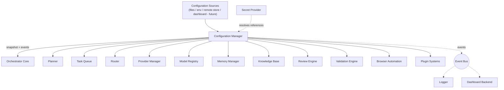

The Configuration Manager sits **above and outside** the request-execution pipeline — no request flows through it. Every other module consults it (directly via its public interface, or indirectly via cached/subscribed snapshots) as a dependency, never as a step in the Orchestrator Core's request lifecycle.

---

## 2. Goals

### 2.1 Primary Goals

- Be the single source of runtime configuration for every module on the platform.
- Load all system configuration during startup, before any consuming module begins accepting requests.
- Validate configuration before activation — an invalid configuration is never distributed to consumers.
- Support profile-based configuration (e.g. `development`, `staging`, `production`) and environment overrides layered on top of profile defaults.
- Support hot reload and runtime configuration updates without requiring consuming-module restarts.
- Provide immutable configuration snapshots, so a consumer's view of configuration is always internally consistent for the duration it holds a given snapshot reference.
- Manage configuration versioning, including the ability to roll back to a previous version.
- Publish a complete configuration lifecycle event stream.
- Distribute configuration to dependent modules through defined interfaces, never through direct state access.

### 2.2 Secondary Goals

- Support multi-tenant configuration with namespace/project-level overrides layered above organization and environment defaults.
- Support feature flags as a first-class, independently toggleable configuration category.
- Support policy configuration (the actual policy *values* consumed by the Router, Memory Manager, and Task Queue's respective Policy Engines — never the policy *evaluation logic* itself, which remains owned by each consuming module).
- Support plugin configuration, supplied opaquely to the relevant Plugin System per the pattern established in the Provider Plugin System MDD and the Browser Automation Engine Plugin System MDD.
- Support secure secret references, resolved without ever exposing raw secret values through logs, snapshots, or events.

### 2.3 Non-Goals

The Configuration Manager must never:

- Execute workflows, perform routing, manage providers, manage browser execution, manage memory, manage knowledge, perform validation, or perform review — every one of these belongs to the respective owning module; the Configuration Manager only supplies the configuration values those modules use.
- Execute plugins — plugin *execution* belongs to the relevant Plugin System; the Configuration Manager only supplies plugin *configuration*.
- Directly modify module state — a consuming module always pulls (or is pushed, via event + pull) configuration; the Configuration Manager never reaches into another module to set a value.
- Contain business rules or persist business entities of any kind.

### 2.4 Design Constraints

- Must follow Clean Architecture, Hexagonal Architecture, SOLID, Dependency Inversion, Event-Driven Architecture, and Enterprise Modular Monolith principles, consistent with every other module in this platform's architecture.
- Must be stateless except for the immutable configuration snapshots it holds/serves — no other in-process mutable state is permitted (Section 8).
- Must depend only on ports (interfaces), never on concrete infrastructure implementations, mirroring the Hexagonal boundary pattern used throughout this platform's MDDs.
- Must never expose secrets directly through any public interface, log, event payload, or snapshot serialization.
- Must never couple to the implementation details of any consuming module — it knows configuration *namespaces* (Section 11), never the internal logic that interprets them.

### 2.5 Future Goals

- Support fully remote and distributed configuration synchronized across a multi-region deployment.
- Support a dashboard-based configuration management UI (read/write), building on the same public interfaces defined here.
- Support AI-assisted configuration optimization (e.g. suggesting policy weight adjustments) as an external advisory input, never as an autonomous configuration-writing capability without explicit activation.

---

## 3. Responsibilities

### 3.1 Must Have

| # | Responsibility |
|---|---|
| M1 | Load all configuration sources at startup and produce a fully merged, validated initial snapshot before signaling readiness. |
| M2 | Validate every configuration change — at startup and at runtime — before it is ever activated or distributed. |
| M3 | Merge profile defaults, environment overrides, organization/tenant overrides, and namespace/project overrides deterministically, in a fixed, documented precedence order (Section 7.5). |
| M4 | Produce and serve immutable, versioned configuration snapshots (Section 8.2) — never a mutable, in-place-editable configuration object. |
| M5 | Support hot reload: detect or receive a configuration change, validate it, and — only if valid — activate a new snapshot and notify consumers, without requiring any consumer to restart. |
| M6 | Support runtime rollback to any prior retained version. |
| M7 | Resolve secret references to actual values via the Secret Provider port at the point of consumption, never persisting resolved secrets in a snapshot that is logged or serialized to disk. |
| M8 | Publish the full configuration lifecycle event set (Section 9) for every meaningful state transition. |
| M9 | Expose configuration to consumers exclusively through defined public interfaces (Section 6) — never through shared mutable memory or direct field access. |
| M10 | Maintain a complete, immutable version history sufficient to support audit and rollback. |

### 3.2 Should Have

| # | Responsibility |
|---|---|
| S1 | Cache resolved configuration per consumer/namespace to avoid redundant resolution work on repeated reads of an unchanged snapshot. |
| S2 | Support consumer registration/subscription so modules can be notified of relevant configuration changes rather than polling. |
| S3 | Provide configuration health monitoring, distinguishing "loaded and valid" from "loaded but degraded" (e.g. a non-critical source unreachable, falling back to last-known-good for that source). |
| S4 | Provide masked, audit-safe representations of configuration (with secret values redacted) for logging, dashboard display, and diagnostics. |

### 3.3 Future Responsibilities

| # | Responsibility |
|---|---|
| F1 | Synchronize configuration across a distributed, multi-region Configuration Manager deployment. |
| F2 | Accept and apply configuration writes originating from a future Dashboard Backend UI, subject to the same validation/versioning/audit pipeline as any other configuration change. |
| F3 | Support dynamic, externally-computed feature-flag targeting rules (e.g. percentage rollout, cohort targeting) as a pluggable Feature Flag Manager strategy. |

---

## 4. Scope

### 4.1 What This Module Owns

Configuration Lifecycle · Configuration Loading · Configuration Validation · Configuration Resolution · Configuration Versioning · Configuration Snapshots · Profile Management · Environment Override Management · Secret Reference Resolution (delegation to the Secret Provider port, not secret storage) · Feature Flag Values · Policy Value Configuration (values only, never evaluation logic) · Plugin Configuration (values only, never plugin execution) · Configuration Distribution · Configuration Governance · Configuration Audit · Configuration Health Monitoring · Hot Reload Coordination · Configuration Rollback.

### 4.2 What It Never Owns

| Concern | Owning Module |
|---|---|
| Workflow execution | Orchestrator Core / Task Queue |
| Routing decisions | Router |
| Provider management / execution | Provider Manager |
| Browser execution | Browser Automation |
| Memory management | Memory Manager |
| Knowledge management | Knowledge Base |
| Validation logic/execution | Validation Engine |
| Review logic/execution | Review Engine |
| Plugin execution | Respective Plugin Systems (Provider Plugin System, Browser Automation Engine Plugin System, etc.) |
| Direct modification of another module's in-process state | No module — every module owns and mutates only its own state |
| Business rules of any kind | Respective owning modules |
| Business entity persistence (tasks, memories, knowledge, reviews) | Respective owning modules (Task Queue, Memory Manager, Knowledge Base, Review Engine) |

### 4.3 Other Module Responsibilities (For Context, Not Owned Here)

- **Secret storage and rotation** — owned by the Secret Provider (an external system, e.g. a secrets manager); the Configuration Manager only holds *references* and resolves them at read time via a port.
- **Policy evaluation logic** — owned by each consuming module's own Policy Engine (e.g. the Router MDD's Policy Engine, the Memory Manager MDD's Memory Policy Engine, the Task Queue MDD's Policy Engine); the Configuration Manager supplies only the configured *values* those engines evaluate against.
- **Plugin capability validation** — owned by the respective Plugin System (e.g. Provider Plugin System); the Configuration Manager supplies plugin configuration but does not validate plugin *capability* semantics, only configuration *schema* (Section 12).

---

## 5. Internal Architecture

The Configuration Manager is composed of twenty internal components, each independently testable and wired via Dependency Injection, consistent with Clean/Hexagonal Architecture. Application-layer components depend only on interfaces (ports); concrete configuration sources, secret providers, and persistence backends are infrastructure adapters.

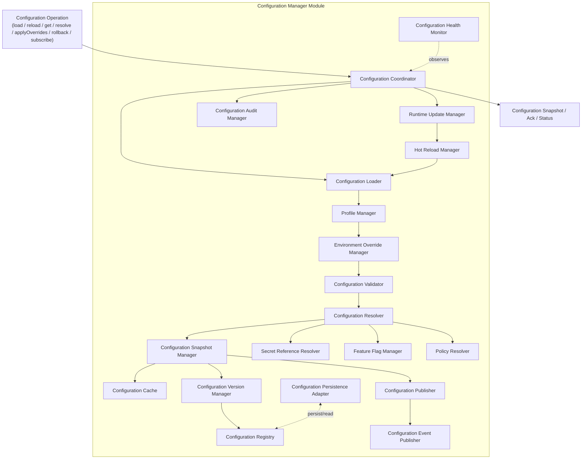

### 5.1 Configuration Coordinator

**Purpose:** The single entry point and top-level conductor for every Configuration Manager public operation, analogous to the Queue Manager (Task Queue MDD) and Memory Coordinator (Memory Manager MDD).

**Responsibilities:** Receive a normalized operation request, sequence the appropriate internal components (Load → Merge → Validate → Resolve → Snapshot → Publish), and assemble the final result.

**Interfaces:** Consumed by the public interface layer (Section 6); consumes every other internal component below.

**Dependencies:** All other internal components.

**Internal communication:** Direct method calls to sequenced components; no component below calls back into the Coordinator except to report completion/failure of its stage.

**Lifecycle:** Instantiated once per Configuration Manager instance; invoked once per operation.

### 5.2 Configuration Loader

**Purpose:** Read raw configuration from every configured source.

**Responsibilities:** Load from files, environment variables, and (future) remote configuration stores, producing a set of raw, unmerged configuration fragments tagged by source and precedence tier.

**Interfaces:** `load(sources) -> RawConfigFragment[]`.

**Dependencies:** Configuration source adapters (infrastructure layer, Section 19).

**Internal communication:** Invoked by the Configuration Coordinator at startup and on every reload trigger; hands its output to the Profile Manager.

**Lifecycle:** Invoked once at startup, and once per reload cycle thereafter.

### 5.3 Configuration Validator

**Purpose:** Validate a fully merged (but not yet resolved) configuration candidate against the platform's configuration schema (Section 11) before it is permitted to proceed to resolution.

**Responsibilities:** Schema validation (types, required fields, allowed value ranges/enums per namespace), cross-field consistency checks, and structured error reporting on failure.

**Interfaces:** `validate(mergedConfig) -> ValidationResult`.

**Dependencies:** The configuration schema definitions (versioned alongside this module, Section 19).

**Internal communication:** Invoked by the Configuration Coordinator after Profile/Environment merge and before Resolution; a failed validation halts the pipeline — no partially-validated configuration ever reaches the Resolver.

**Lifecycle:** Invoked on every load and every runtime update candidate.

### 5.4 Configuration Resolver

**Purpose:** Produce the final, fully-resolved configuration value set from a validated merged configuration — including secret resolution, feature flag evaluation-input resolution, and policy value resolution.

**Responsibilities:** Coordinate the Secret Reference Resolver, Feature Flag Manager, and Policy Resolver to turn every reference/placeholder in the merged configuration into a concrete value.

**Interfaces:** `resolve(validatedConfig, context) -> ResolvedConfiguration`.

**Dependencies:** Secret Reference Resolver, Feature Flag Manager, Policy Resolver.

**Internal communication:** Invoked by the Configuration Coordinator after successful validation; hands its output to the Snapshot Manager.

**Lifecycle:** Invoked on every load/reload/runtime-update cycle, and additionally on-demand for consumer-specific resolution context (e.g. namespace-scoped resolution, Section 6.6).

### 5.5 Configuration Registry

**Purpose:** The authoritative in-memory (backed by the Persistence Adapter) catalog of registered configuration namespaces, their schemas, and their current/historical values.

**Responsibilities:** Track which namespaces exist, their declared schema version, and provide the Validator and Resolver with schema/namespace lookups.

**Interfaces:** `registerNamespace(schema)`, `getNamespaceSchema(namespace)`.

**Dependencies:** Configuration Persistence Adapter.

**Internal communication:** Consulted by the Validator (schema lookup) and the Snapshot Manager (namespace enumeration for snapshot construction).

**Lifecycle:** Long-lived; namespaces are typically registered at startup (one per consuming module, declared in that module's own configuration schema contribution) and rarely change thereafter, though the architecture permits runtime namespace registration for future plugin-contributed configuration.

### 5.6 Configuration Cache

**Purpose:** Accelerate repeated reads of an unchanged snapshot, particularly namespace-scoped or consumer-scoped resolved views.

**Responsibilities:** Cache resolved configuration views keyed by (snapshot version, namespace, resolution context), invalidated wholesale whenever a new snapshot is activated (never partially invalidated, since snapshots are immutable — Section 8.2).

**Interfaces:** Internal read-through cache, not directly exposed publicly.

**Dependencies:** None beyond the Snapshot Manager's version-activation signal.

**Internal communication:** Consulted by the public `getConfiguration()`/`resolveConfiguration()` path before falling through to a fresh resolution.

**Lifecycle:** Entries live for the lifetime of the snapshot version they were computed against; flushed entirely on new-version activation.

### 5.7 Configuration Snapshot Manager

**Purpose:** Construct and serve immutable configuration snapshots — the platform's core configuration consistency guarantee.

**Responsibilities:** Assemble a fully resolved configuration state into a single immutable `ConfigurationSnapshot` object, hand it to the Version Manager for version assignment, and serve the currently active snapshot (or a specific historical version) to callers.

**Interfaces:** `createSnapshot(resolvedConfig) -> ConfigurationSnapshot`, `getActiveSnapshot()`, `getSnapshot(version)`.

**Dependencies:** Configuration Version Manager, Configuration Registry.

**Internal communication:** Invoked by the Configuration Coordinator as the final step of load/reload/runtime-update; notifies the Configuration Publisher once a new snapshot is activated.

**Lifecycle:** A snapshot, once created, is never mutated; superseded snapshots are retained per retention policy (Section 8.6) for rollback and audit purposes.

### 5.8 Configuration Version Manager

**Purpose:** Own the version identity and history of configuration snapshots.

**Responsibilities:** Assign a monotonically increasing version identifier to each new snapshot, maintain the version history (Section 8.3), and support rollback by resolving a target version back to its retained snapshot.

**Interfaces:** `assignVersion(snapshot) -> VersionedSnapshot`, `getVersionHistory()`, `getVersion(versionId)`.

**Dependencies:** Configuration Persistence Adapter (durable version history).

**Internal communication:** Invoked by the Snapshot Manager on every new snapshot; invoked by the Runtime Update Manager's rollback path to retrieve a target version.

**Lifecycle:** Long-lived; the version history itself is durable and outlives any single Configuration Manager process instance.

### 5.9 Profile Manager

**Purpose:** Apply profile-based configuration (e.g. `development`, `staging`, `production`) as the first layer of override on top of global defaults.

**Responsibilities:** Select the active profile (from startup configuration/environment), merge the profile's declared overrides onto the base configuration fragments produced by the Loader.

**Interfaces:** `applyProfile(baseConfig, profileName) -> ProfileMergedConfig`.

**Dependencies:** Configuration Loader (source of profile-specific fragments).

**Internal communication:** Invoked immediately after the Loader, before the Environment Override Manager, establishing the fixed precedence order documented in Section 7.5.

**Lifecycle:** Invoked on every load/reload cycle.

### 5.10 Environment Override Manager

**Purpose:** Apply environment-variable-sourced overrides as the second layer, above profile defaults.

**Responsibilities:** Read environment-variable overrides (mapped to configuration namespace paths per a documented naming convention) and merge them onto the profile-merged configuration.

**Interfaces:** `applyEnvironmentOverrides(profileMergedConfig) -> EnvMergedConfig`.

**Dependencies:** Environment variable source adapter (infrastructure layer).

**Internal communication:** Invoked after the Profile Manager, before Validation.

**Lifecycle:** Invoked on every load/reload cycle.

### 5.11 Secret Reference Resolver

**Purpose:** Resolve secret *references* (opaque pointers embedded in configuration values, e.g. `secretRef://provider-api-key`) to actual secret values, exclusively at the point of resolution, never persisting the resolved value in any durable or logged form.

**Responsibilities:** Detect secret-reference-shaped values during resolution, call out to the Secret Provider port to resolve them, and substitute the resolved value into the in-memory `ResolvedConfiguration` only — never into anything written to the Persistence Adapter, Audit Manager, or Event Publisher.

**Interfaces:** `resolveSecretReferences(config) -> ConfigWithResolvedSecrets` (internal only — never exposed on the public interface surface).

**Dependencies:** Secret Provider (external port, Section 10).

**Internal communication:** Invoked exclusively by the Configuration Resolver; its output never flows into the Snapshot Manager's persisted representation without secret values first being re-masked (Section 15.1) for anything that touches durable storage or logs.

**Lifecycle:** Invoked on every resolution; secret values resolved this way are held only in the in-memory resolved snapshot served to authorized consumers, with a bounded lifetime matching the snapshot's own.

### 5.12 Feature Flag Manager

**Purpose:** Own feature flag definitions and their resolved boolean/variant values for a given resolution context.

**Responsibilities:** Store flag definitions (default value, targeting rules if any — Section 3.3, F3), and resolve a flag's effective value for a given namespace/tenant context during Configuration Resolution.

**Interfaces:** `resolveFlags(context) -> FeatureFlagValues`.

**Dependencies:** Configuration Registry (flag definitions are a configuration namespace like any other, `featureFlags.*` — Section 11).

**Internal communication:** Invoked by the Configuration Resolver as one of its three resolution sub-steps (alongside Secret Reference Resolver and Policy Resolver).

**Lifecycle:** Invoked on every resolution.

### 5.13 Policy Resolver

**Purpose:** Resolve the configured *values* for policies owned by consuming modules (e.g. the Router's routing policy weights, the Memory Manager's retention policy definitions, the Task Queue's retry policy parameters) — never the evaluation logic itself.

**Responsibilities:** Read policy-value configuration from the relevant namespace (`routing.*`, `memory.*`, etc.) and hand back a structured value set the consuming module's own Policy Engine will evaluate against.

**Interfaces:** `resolvePolicyValues(namespace, context) -> PolicyValueSet`.

**Dependencies:** Configuration Registry.

**Internal communication:** Invoked by the Configuration Resolver; distinct from and unaware of any consuming module's policy *evaluation* logic, preserving the module boundary described in Section 4.3.

**Lifecycle:** Invoked on every resolution.

### 5.14 Runtime Update Manager

**Purpose:** Own the entry point for configuration changes that occur after startup — both externally triggered (a new source value detected) and explicitly requested (an operator/dashboard-initiated update or rollback).

**Responsibilities:** Accept a runtime update or rollback request, drive it through the same Load/Merge/Validate/Resolve/Snapshot pipeline as startup (reusing the Configuration Coordinator's sequencing, never a separate parallel code path), and coordinate with the Hot Reload Manager for propagation.

**Interfaces:** `applyRuntimeUpdate(changeSet)`, `rollback(targetVersion)`.

**Dependencies:** Configuration Coordinator, Hot Reload Manager, Configuration Version Manager.

**Internal communication:** Entry point for `reloadConfiguration()` and `rollbackConfiguration()` (Section 6).

**Lifecycle:** Invoked on-demand — external trigger (source change detected), operator action, or rollback request.

### 5.15 Hot Reload Manager

**Purpose:** Coordinate the propagation of a newly activated snapshot to registered consumers without requiring their restart.

**Responsibilities:** On new-snapshot activation, notify subscribed consumers (Section 6.8, `subscribe()`) via the Configuration Event Publisher, and track propagation/acknowledgment where a consuming module's contract requires confirmed receipt (e.g. for consumers whose correctness depends on atomically adopting the new snapshot, such as the Router's active Routing Policy set).

**Interfaces:** `propagate(snapshot)`, `awaitAcknowledgment(snapshot, consumers)` (best-effort, non-blocking beyond a configured timeout — Section 12.8).

**Dependencies:** Configuration Publisher, Configuration Event Publisher.

**Internal communication:** Invoked by the Snapshot Manager immediately after a new snapshot is activated.

**Lifecycle:** Invoked once per hot-reload cycle.

### 5.16 Configuration Publisher

**Purpose:** Make the active snapshot available for direct pull-based retrieval (`getConfiguration()`, `getSnapshot()`) independent of the push-based event notification the Hot Reload Manager drives.

**Responsibilities:** Serve the currently active `ConfigurationSnapshot` (or a specific version) to any authorized caller, backed by the Configuration Cache for repeated reads.

**Interfaces:** `getActive() -> ConfigurationSnapshot`, `getVersion(versionId) -> ConfigurationSnapshot`.

**Dependencies:** Configuration Snapshot Manager, Configuration Cache.

**Internal communication:** Backs the public `getConfiguration()`/`getSnapshot()` interfaces (Section 6) directly.

**Lifecycle:** Stateless per call; always serves whatever the Snapshot Manager currently holds as active.

### 5.17 Configuration Event Publisher

**Purpose:** Publish the configuration lifecycle event set (Section 9) to the Event Bus.

**Responsibilities:** Translate internal lifecycle transitions (load complete, validation failed, snapshot created, version activated, rollback started/completed, health changed) into the platform's standard event envelope and publish them.

**Interfaces:** `publish(event)`.

**Dependencies:** Event Bus (external port).

**Internal communication:** Invoked by nearly every other component at its respective lifecycle milestone (Validator on failure, Snapshot Manager on creation, Version Manager on activation, Runtime Update Manager on rollback start/complete, Health Monitor on health change).

**Lifecycle:** Stateless; invoked per event.

### 5.18 Configuration Persistence Adapter

**Purpose:** The sole component with a durable-storage dependency for configuration source-of-record data (version history, namespace registry, audit trail) — every other component reaches durable state through it, never directly.

**Responsibilities:** Persist version history, registered namespace schemas, and audit records; serve reads for the Version Manager and Registry.

**Interfaces:** `persist(record)`, `read(query)`.

**Dependencies:** A durable storage backend (infrastructure adapter, Section 19) — per the Database Design Document.

**Internal communication:** Invoked by the Configuration Registry, Version Manager, and Audit Manager.

**Lifecycle:** Long-lived; the only component whose backing store outlives any single Configuration Manager process instance.

### 5.19 Configuration Health Monitor

**Purpose:** Track and expose the operational health of the configuration subsystem itself — distinct from any business-module health.

**Responsibilities:** Monitor source reachability (e.g. a remote configuration store or Secret Provider being unreachable), track reload success/failure rates, and publish `ConfigurationHealthChanged` when the aggregate health state changes.

**Interfaces:** `getHealth() -> ConfigurationHealthStatus`.

**Dependencies:** Configuration Loader (source reachability signals), Configuration Coordinator (reload outcome signals).

**Internal communication:** Read-only observer; never influences the load/validate/resolve pipeline's outcome directly, only reports on it.

**Lifecycle:** Continuously active background aggregation.

### 5.20 Configuration Audit Manager

**Purpose:** Maintain an immutable, complete audit trail of every configuration change — who/what triggered it, what changed, and the validation/activation outcome.

**Responsibilities:** Record every load, validation result, snapshot activation, rollback, and runtime update with full correlation detail, using secret-masked representations exclusively (Section 15.1).

**Interfaces:** `recordAuditEntry(entry)`.

**Dependencies:** Configuration Persistence Adapter.

**Internal communication:** Invoked by the Configuration Coordinator at each pipeline stage transition.

**Lifecycle:** Invoked on every meaningful state transition; audit records are retained per the platform's audit retention policy independent of configuration version retention (Section 8.6).

---

## 6. Public Interfaces

### 6.1 `loadConfiguration()`

- **Purpose:** Perform the full startup load pipeline (Load → Profile Merge → Environment Override → Validate → Resolve → Snapshot).
- **Inputs:** None (reads from configured sources); optionally an explicit source-set override for testing/bootstrapping.
- **Outputs:** The initial `ConfigurationSnapshot` and its assigned version.
- **Validation:** Full schema validation (Section 5.3); a failure here is fatal to startup — the platform must not start with unvalidated configuration.
- **Error Conditions:** `ConfigurationSourceUnavailableError`, `ConfigurationValidationError`, `ProfileNotFoundError`.
- **Side Effects:** Publishes `ConfigurationLoaded`, `ConfigurationValidated`, `ConfigurationSnapshotCreated`, `ConfigurationVersionActivated`, `ConfigurationPublished`.

### 6.2 `reloadConfiguration()`

- **Purpose:** Re-run the load pipeline at runtime (triggered externally or on a configured polling interval for sources that support it), producing a new snapshot only if the result differs from and validates successfully against the current active snapshot.
- **Inputs:** None (or an explicit `changeSet` for targeted runtime updates — see `applyOverrides()`, Section 6.7).
- **Outputs:** The new `ConfigurationSnapshot` and version, or a no-op result if nothing changed.
- **Validation:** Same as `loadConfiguration()`.
- **Error Conditions:** Same as `loadConfiguration()`, plus `ConfigurationReloadInProgressError` (reload calls are serialized, never concurrent, per instance — see Section 19.1's cross-instance coordination note).
- **Side Effects:** Publishes `ConfigurationReloaded` on success, `ConfigurationValidationFailed` on failure (in which case the previously active snapshot remains active — Section 12.2).

### 6.3 `getConfiguration(namespace)`

- **Purpose:** Retrieve the currently active, resolved configuration for a given namespace.
- **Inputs:** `namespace` (e.g. `routing.policies`), optional resolution `context` (tenant/project scope).
- **Outputs:** The resolved configuration value set for that namespace, with any secret references resolved if the caller is authorized (Section 15.2).
- **Validation:** Namespace must be registered (Section 5.5); caller authorization for secret-bearing namespaces.
- **Error Conditions:** `NamespaceNotFoundError`, `AccessDeniedError`.
- **Side Effects:** None (read-only); served from the Configuration Cache where possible.

### 6.4 `getSnapshot(version)`

- **Purpose:** Retrieve a specific configuration snapshot, active or historical.
- **Inputs:** `version` (optional — omitted means "active").
- **Outputs:** The full `ConfigurationSnapshot` object (secret-masked unless the caller is authorized).
- **Validation:** Version must exist in retained history (Section 8.6).
- **Error Conditions:** `VersionNotFoundError` (if the requested version has been purged per retention policy).
- **Side Effects:** None.

### 6.5 `getVersion()`

- **Purpose:** Retrieve metadata about the currently active version (identifier, activation timestamp, activating change summary) without the full configuration payload.
- **Inputs:** None.
- **Outputs:** `VersionMetadata`.
- **Validation:** None.
- **Error Conditions:** None beyond standard availability.
- **Side Effects:** None.

### 6.6 `resolveConfiguration(namespace, context)`

- **Purpose:** Perform an on-demand, context-scoped resolution (e.g. namespace + tenant + project) distinct from the cached general `getConfiguration()` path, for callers needing a precise override-resolution result (e.g. the Dashboard Backend inspecting effective configuration for a specific project).
- **Inputs:** `namespace`, resolution `context` (tenant, project, or other override-layer identifiers).
- **Outputs:** The fully layered, resolved configuration value set for that exact context.
- **Validation:** Namespace registered; context well-formed.
- **Error Conditions:** `NamespaceNotFoundError`, `InvalidContextError`.
- **Side Effects:** None (read-only, though it may populate the Configuration Cache for that specific context key).

### 6.7 `applyOverrides(changeSet)`

- **Purpose:** Apply a targeted runtime configuration change (e.g. an operator toggling a feature flag, or an automated policy adjustment from a future AI-assisted configuration advisory) without a full source reload.
- **Inputs:** `changeSet` — a structured, namespace-scoped set of value changes, plus the requesting identity (for audit).
- **Outputs:** The new `ConfigurationSnapshot` and version if validation succeeds.
- **Validation:** Full schema validation of the resulting merged configuration (the change is validated in the context of the full current configuration, not in isolation); authorization check for the requesting identity against the target namespace.
- **Error Conditions:** `ConfigurationValidationError`, `AccessDeniedError`, `NamespaceNotFoundError`.
- **Side Effects:** Publishes `ConfigurationUpdated`, `ConfigurationSnapshotCreated`, `ConfigurationVersionActivated`; records an `ConfigurationAuditManager` entry attributing the change to the requesting identity.

### 6.8 `registerConsumer(consumerId, namespaces)`

- **Purpose:** Register a module as a consumer interested in specific configuration namespaces, enabling targeted `subscribe()` notification and, where the consumer contract requires it, acknowledgment tracking (Section 5.15).
- **Inputs:** `consumerId`, list of `namespaces` of interest.
- **Outputs:** Registration confirmation.
- **Validation:** Namespaces must be registered; `consumerId` uniqueness (re-registration updates the existing registration rather than erroring).
- **Error Conditions:** `NamespaceNotFoundError`.
- **Side Effects:** None beyond the registration record.

### 6.9 `subscribe(consumerId, callback_or_channel)`

- **Purpose:** Establish the push-notification channel a registered consumer receives configuration lifecycle events on (in practice, this is the standard Event Bus subscription pattern — this interface exists to document the consumer-facing contract explicitly, since configuration change propagation correctness matters platform-wide).
- **Inputs:** `consumerId`, delivery channel reference (Event Bus topic/subscription per the Event Bus MDD's standard pattern).
- **Outputs:** Subscription confirmation.
- **Validation:** `consumerId` must be registered via `registerConsumer()` first.
- **Error Conditions:** `ConsumerNotRegisteredError`.
- **Side Effects:** None beyond the subscription record.

### 6.10 `validate(candidateConfig)`

- **Purpose:** Validate a candidate configuration without activating it — used for pre-flight checks (e.g. a Dashboard Backend UI validating an operator's proposed change before submission via `applyOverrides()`).
- **Inputs:** `candidateConfig` (full or partial, namespace-scoped).
- **Outputs:** `ValidationResult` (valid/invalid + structured error detail).
- **Validation:** N/A — this *is* the validation operation; never mutates active state.
- **Error Conditions:** None (returns a result object rather than throwing, since "invalid" is an expected, non-exceptional outcome for this interface).
- **Side Effects:** None.

### 6.11 `publishConfiguration(snapshot)`

- **Purpose:** Internal-facing interface (exposed for testability and for the Runtime Update Manager's use, not intended for general external callers) that performs the final activation + distribution step once a snapshot has passed validation and resolution.
- **Inputs:** A validated, resolved `ConfigurationSnapshot`.
- **Outputs:** Activation confirmation.
- **Validation:** The snapshot must have originated from a completed Validate→Resolve pipeline run (enforced by requiring a pipeline-issued token/reference, not a raw caller-constructed snapshot).
- **Error Conditions:** `InvalidSnapshotProvenanceError`.
- **Side Effects:** Publishes `ConfigurationPublished`, `ConfigurationVersionActivated`; triggers Hot Reload Manager propagation.

### 6.12 `rollbackConfiguration(targetVersion)`

- **Purpose:** Revert the active configuration to a previously retained version.
- **Inputs:** `targetVersion`.
- **Outputs:** The re-activated `ConfigurationSnapshot` (a new version identifier is assigned to the rollback activation itself — Section 8.4 — rather than simply reusing the old version's identifier, preserving a forward-only version history).
- **Validation:** Target version must exist in retained history; the target version's configuration is re-validated against the *current* schema (a rollback to an old version whose schema has since evolved incompatibly is rejected, not silently applied).
- **Error Conditions:** `VersionNotFoundError`, `RollbackValidationError` (schema-incompatible target).
- **Side Effects:** Publishes `ConfigurationRollbackStarted`, then `ConfigurationRollbackCompleted` (or a `ConfigurationValidationFailed` + rollback-aborted outcome if re-validation fails); triggers Hot Reload Manager propagation on success.

### 6.13 `refresh()`

- **Purpose:** A lightweight, consumer-facing convenience interface equivalent to `getConfiguration()`/`getSnapshot()` but semantically signaling "give me the latest, bypass any client-side staleness assumption" — primarily used by consumers recovering from a missed event notification (Section 12.9) to resynchronize.
- **Inputs:** Optional `namespaces` filter.
- **Outputs:** The current active, resolved configuration for the requested scope.
- **Validation:** Same as `getConfiguration()`.
- **Error Conditions:** Same as `getConfiguration()`.
- **Side Effects:** None.

---

## 7. Internal Workflow

### 7.1 Startup

1. The Configuration Coordinator invokes `loadConfiguration()`.
2. The Configuration Loader reads raw fragments from every configured source.
3. The Profile Manager merges the active profile's overrides onto the base fragments.
4. The Environment Override Manager merges environment-variable overrides on top.
5. The Configuration Validator validates the fully merged candidate; startup halts with a fatal error if validation fails (Section 12.1) — the platform must never start on invalid configuration.
6. The Configuration Resolver resolves secret references, feature flags, and policy values.
7. The Snapshot Manager constructs the immutable initial `ConfigurationSnapshot`.
8. The Version Manager assigns version `1` (or the next sequential version if the Persistence Adapter already holds history from a prior process lifetime).
9. The Configuration Publisher activates the snapshot; the Event Publisher emits the full startup event sequence (Section 6.1).
10. The Configuration Manager signals readiness; only after this point may other modules complete their own startup sequences that depend on configuration.

### 7.2 Configuration Loading, Validation, and Resolution

Detailed component-level behavior for these stages is documented in Sections 5.2–5.4; the sequencing is fixed and identical for both startup (`loadConfiguration()`) and runtime reload (`reloadConfiguration()`), which is a deliberate design decision (Section 24) to avoid two divergent code paths for what is conceptually the same pipeline.

### 7.3 Profile Merge and Environment Overrides

See Sections 5.9–5.10. The precedence order (Section 7.5) is fixed and non-configurable — a design choice to keep override behavior predictable and auditable rather than itself configurable (which would risk configuration-about-configuration complexity).

### 7.4 Snapshot Creation and Distribution

See Sections 5.7, 5.15, 5.16. Snapshot creation is always immediately followed by version assignment and then either startup-readiness signaling (first snapshot) or Hot Reload Manager propagation (subsequent snapshots) — a snapshot is never created and left unpublished except in the `validate()` (6.10) dry-run path, which never reaches the Snapshot Manager at all.

### 7.5 Override Precedence Order

The fixed, documented precedence (highest wins) is:

```
Namespace/Project Override
  > Organization/Tenant Override
    > Environment Override
      > Profile Default
        > Global Default
```

This order is enforced identically regardless of *which* interface triggered the merge (startup load, reload, or `applyOverrides()`), and is documented here as the single authoritative statement of precedence referenced throughout this document (Sections 5.9, 5.10, 11, 24).

### 7.6 Hot Reload

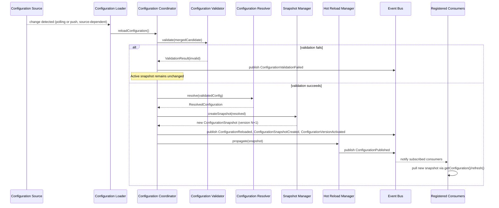

### 7.7 Rollback

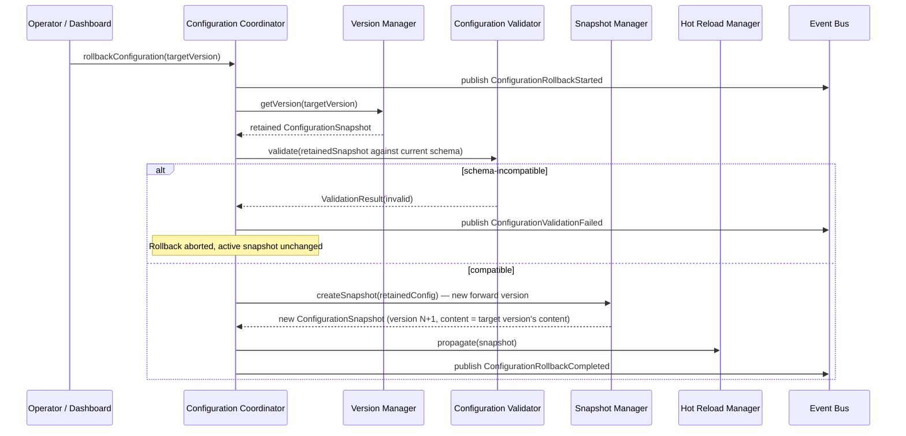

### 7.8 Shutdown

On graceful shutdown, the Configuration Coordinator stops accepting new load/reload/update operations, allows any in-flight validation/resolution pipeline run to complete or abort cleanly, and ensures the Persistence Adapter has flushed any pending audit/version writes before the process exits — consistent with the stateless-service shutdown pattern established in the Router, Memory Manager, and Task Queue MDDs (no in-flight consumer request is ever left holding a reference to a snapshot that becomes unavailable, since snapshots are immutable and independently retained by the Persistence Adapter, not only in the shutting-down process's memory).

---

## 8. State Management

### 8.1 Configuration Lifecycle States

A configuration **candidate** (the object flowing through the pipeline) moves through: `Loading → Merging → Validating → Resolving → Snapshotting → Activating → Active`, or `Validating → Rejected` on failure.

A configuration **version** (once activated) moves through: `Active → Superseded` (when a newer version activates) `→ Retained` (held per retention policy) `→ Purged` (retention window elapsed), or `Active → Superseded → Retained → Restored` (if selected as a rollback target, which produces a *new* forward version rather than reactivating the old one in place — Section 8.4).

### 8.2 Snapshots

A `ConfigurationSnapshot` is an immutable value object: once constructed by the Snapshot Manager, none of its fields are ever modified. Any change — even a single feature-flag toggle — produces an entirely new snapshot with a new version identifier. This immutability is the mechanism by which the platform guarantees every consumer's view of configuration is internally consistent: a consumer holding snapshot version 42 never observes a partial mix of version 42 and version 43 values.

### 8.3 Version Lifecycle

Versions are strictly monotonically increasing and forward-only. The Version Manager never reuses or decrements a version identifier. Version metadata (Section 6.5) records activation timestamp, the triggering operation (`startup`, `reload`, `applyOverrides`, `rollback`), and (for `applyOverrides`/`rollback`) the requesting identity.

### 8.4 Rollback Semantics

Rollback (Section 7.7) does not "travel back in time" to reactivate an old version identifier — it creates a new version whose *content* matches the target version, re-validated against the current schema. This preserves the forward-only version history invariant and ensures the Audit Manager's trail always reads as a linear sequence of activations, never a branching or reversible one.

### 8.5 Recovery

If the Configuration Manager process restarts, it does not need to re-run the full external-source load pipeline to recover its version history — the Persistence Adapter's durable version history is the source of truth for "what was active," and the Snapshot Manager re-activates the last-known-active version from persisted history immediately on restart, then optionally triggers a fresh `loadConfiguration()` reconciliation pass to detect any source-level changes that occurred while the instance was down.

### 8.6 Persistence and Retention

Every activated version is persisted durably via the Configuration Persistence Adapter. Retention policy (itself a configuration namespace, `system.configManager.retention`, Section 11) determines how many historical versions (or how long a time window) are retained before a version becomes eligible for purge; audit records (Section 5.20) are retained independently and typically for a longer duration, per platform audit policy, even after the corresponding version itself has been purged.

### 8.7 Synchronization (Multi-Instance)

See Section 19.1 — in a horizontally scaled deployment, version activation is coordinated through the shared Persistence Adapter backend (the durable version history is the single source of truth every instance reconciles against), not through direct inter-instance communication.

### 8.8 State Diagram

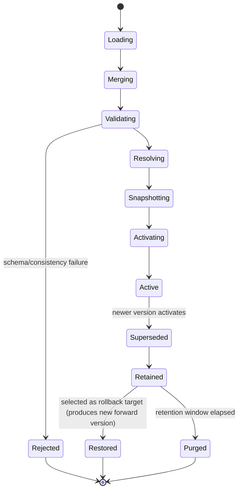

---

## 9. Events

| Event | Publisher | Consumers | Payload | Trigger | Failure Behavior |
|---|---|---|---|---|---|
| `ConfigurationLoaded` | Configuration Loader (via Event Publisher) | Logger, Dashboard Backend, Configuration Health Monitor | `{ sourceCount, loadedAt }` | Fired when all sources have been read (before merge/validation). | Not retried; a source-read failure is reported via `ConfigurationHealthChanged`, not by withholding this event for successfully-read sources. |
| `ConfigurationValidated` | Configuration Validator (via Event Publisher) | Logger, Dashboard Backend | `{ candidateId, valid: true }` | Fired on successful validation. | N/A (the failure counterpart is `ConfigurationValidationFailed`). |
| `ConfigurationValidationFailed` | Configuration Validator | Logger, Dashboard Backend, Alerting, Configuration Health Monitor | `{ candidateId, errors: [...] }` | Fired on any validation failure (startup, reload, applyOverrides, rollback). | Not retried; the pipeline halts and the active snapshot (if any) remains unchanged. |
| `ConfigurationSnapshotCreated` | Snapshot Manager | Logger, Dashboard Backend, Configuration Cache (invalidation) | `{ version, namespaceCount }` | Fired when a new immutable snapshot object is constructed, before activation. | Not retried. |
| `ConfigurationVersionActivated` | Version Manager | Logger, Dashboard Backend, all registered Consumers (via Hot Reload Manager) | `{ version, activatedAt, trigger: "startup"|"reload"|"applyOverrides"|"rollback" }` | Fired when a snapshot becomes the active version. | Not retried. |
| `ConfigurationPublished` | Configuration Publisher | Logger, Dashboard Backend, all registered Consumers | `{ version }` | Fired once the newly active snapshot is available for retrieval via the public interfaces. | Not retried. |
| `ConfigurationReloaded` | Runtime Update Manager | Logger, Dashboard Backend | `{ previousVersion, newVersion }` | Fired on successful completion of a `reloadConfiguration()` cycle that produced a new version. | Not retried; a no-change reload does not fire this event. |
| `ConfigurationUpdated` | Runtime Update Manager (via `applyOverrides()`) | Logger, Dashboard Backend, Configuration Audit Manager | `{ version, changedNamespaces, requestedBy }` | Fired on successful `applyOverrides()`. | Not retried. |
| `ConfigurationRollbackStarted` | Runtime Update Manager | Logger, Dashboard Backend, Alerting | `{ currentVersion, targetVersion, requestedBy }` | Fired immediately when `rollbackConfiguration()` begins. | Not retried. |
| `ConfigurationRollbackCompleted` | Runtime Update Manager | Logger, Dashboard Backend, all registered Consumers | `{ newVersion, restoredFromVersion }` | Fired when rollback validation and activation succeed. | Not retried; a failed rollback instead publishes `ConfigurationValidationFailed` with no corresponding completion event. |
| `ConfigurationHealthChanged` | Configuration Health Monitor | Logger, Dashboard Backend, Alerting | `{ previousHealth, currentHealth, reason }` | Fired when aggregate configuration-subsystem health transitions (e.g. a source becomes unreachable, or recovers). | Not retried. |
| `ConfigurationSnapshotExpired` | Configuration Snapshot Manager (retention sweep) | Logger, Dashboard Backend | `{ version, purgedAt }` | Fired when a retained version is purged per retention policy (Section 8.6). | Not retried. |

---

## 10. Dependencies

| Dependency | Nature | Notes |
|---|---|---|
| **Configuration Storage** | Infrastructure port (Configuration Persistence Adapter, Section 5.18) | Backs version history, namespace registry, and audit trail; per the Database Design Document. |
| **Event Bus** | Infrastructure port (Configuration Event Publisher, Section 5.17) | Every lifecycle event (Section 9) is published here; the Configuration Manager also subscribes to no inbound events from other modules — it is upstream of everything, never reactive to another module's events. |
| **Security Layer** | Infrastructure port | Supplies authentication/authorization primitives consumed by the Access Control checks in Sections 6.3, 6.7, 6.9, and 15.2; the Configuration Manager does not implement identity/auth itself. |
| **Plugin Registries** | Read-only consumers of this module, not a dependency of it | The Provider Plugin System and Browser Automation Engine Plugin System *consume* `plugins.*` configuration (Section 11) from the Configuration Manager; the relationship is one-directional. |
| **Logger** | Infrastructure port | Receives all structured logs (Section 13). |
| **Dashboard** | Consumer, future read/write client | Reads configuration/version/audit data via the standard public interfaces (Section 6); future write access (Section 3.3, F2) goes through the same `applyOverrides()`/`validate()` pipeline as any other caller — no privileged bypass path. |
| **Secret Provider** | Infrastructure port (consumed by the Secret Reference Resolver, Section 5.11) | An external secrets-management system; the Configuration Manager never stores secret values itself, only references. |

**No business module dependencies.** The Configuration Manager does not call, subscribe to, or otherwise depend on the Orchestrator Core, Planner, Task Queue, Router, Provider Manager, Model Registry, Capability Selector, Memory Manager, Knowledge Base, Review Engine, Validation Engine, or Browser Automation. The dependency direction is strictly inbound (they depend on it), never outbound from it to them.

---

## 11. Configuration

The Configuration Manager manages configuration organized into namespaces. Each namespace is registered (Section 5.5) with a schema; the table below documents the platform's standard namespace catalog. New namespaces can be registered by any module without modifying Configuration Manager source, per the Open/Closed extensibility pattern used throughout this platform (Section 22).

| Namespace | Purpose | Default | Validation | Constraints | Notes |
|---|---|---|---|---|---|
| `system.*` | Platform-wide operational settings (log level, health-check intervals, retention windows). | Environment-appropriate defaults (e.g. `info` log level in production). | Enum/range checks per sub-key. | `system.configManager.retention` governs Section 8.6 behavior. | Owned/consumed by cross-cutting infrastructure, not any single business module. |
| `providers.*` | Registered AI provider connection details and per-provider tuning (excluding secrets, which are `secretRef://`-prefixed values within this namespace). | Empty (must be explicitly configured per environment). | Schema per Provider Plugin System's declared configuration contract. | Provider credentials are always secret references, never raw values (Section 15.1). | Consumed by Provider Manager / Provider Plugin System. |
| `models.*` | Model Registry seed/override data (pricing, region, capability tags) where not sourced dynamically. | Empty. | Schema per Model Registry MDD's metadata fields. | — | Consumed by Model Registry. |
| `routing.*` | Router policy values (weights, precedence-band configuration, constraints). | Balanced-routing defaults (per Router MDD Section 8). | Weight sums, valid policy IDs. | Precedence band structure itself is fixed (Router MDD 9.4) — only weights/contents within bands are configurable here. | Consumed by Router's Policy Resolver / Policy Engine. |
| `memory.*` | Memory Manager retention/expiration/priority policy values, provider registration configuration. | Per Memory Manager MDD Section 10 defaults. | Retention duration formats, valid visibility enums. | — | Consumed by Memory Manager. |
| `knowledge.*` | Knowledge Base configuration (source priorities, indexing behavior toggles). | Empty/module defaults. | Schema per Knowledge Base MDD. | — | Consumed by Knowledge Base. |
| `review.*` | Review Engine iteration caps, quality-dimension weighting. | Per platform PRD defaults (e.g. max review iterations). | Positive-integer caps. | — | Consumed by Review Engine. |
| `validation.*` | Validation Engine rule-set toggles and thresholds. | Module defaults. | Schema per Validation Engine MDD. | — | Consumed by Validation Engine. |
| `browser.*` | Browser Automation timeouts, viewport defaults, sandboxing toggles. | Module defaults. | Schema per Browser Automation MDD. | — | Consumed by Browser Automation. |
| `plugins.*` | Opaque, plugin-specific configuration blocks, keyed by plugin ID. | Empty per plugin until registered. | Schema validated against each plugin's self-declared configuration contract at registration time (delegated, not owned, by the Configuration Manager — Section 4.3). | Configuration Manager validates *shape* only; plugin systems validate semantic correctness. | Consumed by Provider Plugin System, Browser Automation Engine Plugin System, and any future plugin host. |
| `security.*` | Access control policy references, tamper-detection toggles. | Restrictive defaults. | — | Never includes raw credentials. | Consumed by the Security Layer and this module's own Section 15 mechanisms. |
| `logging.*` | Log level, structured-log format toggles, sampling rates. | `info` level, standard format. | Enum checks. | — | Consumed by Logger. |
| `dashboard.*` | Dashboard Backend display preferences, refresh intervals. | Module defaults. | — | — | Consumed by Dashboard Backend. |
| `featureFlags.*` | Feature flag definitions and default values (Section 5.12). | All flags default `false`/off unless explicitly enabled. | Boolean or declared variant enum. | Targeting-rule extensions (Section 3.3, F3) layer on top without schema change. | Consumed platform-wide by any module checking a flag. |
| `profiles.*` | Profile definitions themselves (`development`, `staging`, `production`, and any custom profile) and their override sets. | Three standard profiles pre-registered. | Profile name uniqueness. | New profiles addable via configuration, no code change. | Consumed internally by the Profile Manager (Section 5.9). |

Each namespace entry's schema additionally declares, per field: type, whether it is secret-reference-eligible, whether it is override-layerable (namespace/project-scoped) or global-only, and its default value — enforced uniformly by the Configuration Validator (Section 5.3) regardless of which namespace it belongs to.

---

## 12. Error Handling

| Failure Condition | Detection Point | Recovery Strategy |
|---|---|---|
| **Startup Failures** | `loadConfiguration()` pipeline, any stage | Fatal — the platform does not start. Full error detail (source, stage, validation errors) is logged and surfaced to the deployment/orchestration layer for operator visibility. No partial/degraded startup is permitted. |
| **Validation Failures** (runtime) | Configuration Validator, during `reloadConfiguration()`, `applyOverrides()`, or `rollbackConfiguration()` | Non-fatal — the pipeline halts for that operation only, the previously active snapshot remains active and continues serving all consumers, and `ConfigurationValidationFailed` is published with structured detail. |
| **Merge Failures** | Profile Manager / Environment Override Manager (e.g. a type conflict between a profile default and an environment override for the same key) | Treated as a Validation Failure — surfaced through the same `ConfigurationValidationFailed` path with a merge-conflict-specific error code, never silently resolved by arbitrary precedence guessing beyond the fixed order in Section 7.5. |
| **Override Failures** (`applyOverrides()`) | Configuration Validator, applied against the full merged context | Same as Validation Failures; additionally, an authorization failure (Section 6.7) is reported as `AccessDeniedError` distinctly from a schema validation failure, so callers can distinguish "you're not allowed" from "the value is wrong." |
| **Rollback Failures** | Configuration Validator (schema-incompatible target version) | The rollback is aborted before any new version is created; the active snapshot is unchanged; `ConfigurationValidationFailed` is published in place of `ConfigurationRollbackCompleted`. |
| **Snapshot Failures** | Snapshot Manager (e.g. Persistence Adapter unavailable during version assignment) | The candidate configuration is fully validated and resolved but cannot be durably versioned — the operation fails closed (no snapshot is activated in-memory without a corresponding durable version record), preserving the invariant that every active snapshot has a persisted version history entry. |
| **Secret Resolution Failures** | Secret Reference Resolver (Secret Provider unreachable, or a referenced secret does not exist) | The resolution stage fails for the affected namespace; depending on configured severity (a namespace can be marked `critical` or `degradable`), this either fails the entire pipeline run (critical) or falls back to the last-known-good resolved value for that specific reference only (degradable), with the degraded state reflected in `ConfigurationHealthChanged`. |
| **Hot Reload Failures** | Hot Reload Manager (a consumer fails to acknowledge propagation within the configured timeout, for consumers whose contract requires acknowledgment) | The new version is still activated platform-wide (a slow/unresponsive consumer does not block activation for everyone else); the specific consumer's failure to acknowledge is logged and surfaced via `ConfigurationHealthChanged`, and that consumer is expected to self-recover via `refresh()` on its own reconnection/retry logic. |

**General Recovery Principle:** The Configuration Manager fails closed for anything that would risk activating an invalid or unversioned configuration (startup, snapshot durability), and fails open — preserving the last-known-good active snapshot — for anything that fails during an *attempted* runtime change (reload, override, rollback), since an attempted-but-failed update should never degrade a platform that was previously running correctly.

### 12.1 Retry Strategy

Source-read failures during Loading (Section 5.2) are retried with exponential backoff up to a configured limit before being treated as a fatal startup failure or a degraded-health runtime condition (for reload); the Configuration Manager does not retry validation failures (a fixed invalid input does not become valid by retrying) or authorization failures.

---

## 13. Logging

| Log Category | Content | Level |
|---|---|---|
| **Startup Logs** | Source enumeration, load duration, initial version assigned. | INFO |
| **Validation Logs** | Validation outcome per pipeline run, structured error detail on failure. | INFO (pass) / WARN (fail) |
| **Version Logs** | Every version activation, its trigger, and requesting identity where applicable. | INFO |
| **Reload Logs** | Reload trigger source, outcome, version delta. | INFO |
| **Audit Logs** | Immutable record of every configuration-affecting operation with full correlation and identity detail, secret-masked (Section 15.1). | AUDIT (separate, non-rotating stream) |
| **Security Logs** | Authorization checks and their outcomes for configuration read/write operations, secret-reference resolution attempts (never resolved values). | INFO / WARN on denial |
| **Performance Logs** | Pipeline stage latency (load, validate, resolve, snapshot) per run. | DEBUG |

All logs correlate by `version` (once assigned) and, for runtime-triggered operations, a per-operation correlation ID, emitted through the shared Logger interface.

---

## 14. Monitoring

| Metric | Description |
|---|---|
| **Health** | Aggregate configuration-subsystem health (Section 5.19), per-source reachability breakdown. |
| **Metrics — Configuration Size** | Total namespace count, total resolved value count, snapshot serialized size. |
| **Latency** | Pipeline stage latency distribution (load/validate/resolve/snapshot), end-to-end reload latency. |
| **Snapshot Count** | Currently retained snapshot count, versus retention policy limit. |
| **Reload Count** | Reload attempts, successes, failures, per time window. |
| **Failure Rate** | Validation failure rate, secret-resolution failure rate. |
| **Rollback Count** | Rollback attempts and outcomes, per time window — a sustained elevated rollback rate is itself an operational signal worth alerting on. |
| **Cache Statistics** | Configuration Cache hit rate, eviction rate (Section 16.1). |

---

## 15. Security

### 15.1 Secret Management

Secret values are never persisted by the Configuration Manager in any durable store it owns (Persistence Adapter, audit records) and never included in any log or event payload — only secret *references* are persisted/logged. Resolved secret values exist exclusively in the in-memory `ResolvedConfiguration` served to an authorized consumer, for the lifetime of that consumer's held snapshot reference.

### 15.2 Encrypted Configuration

Configuration at rest (in the Persistence Adapter's backing store) is encrypted per the platform's standard data-at-rest policy; this is a deployment/infrastructure characteristic of the chosen storage backend, consistent with how the Memory Manager MDD treats encryption-at-rest as a provider-level, not orchestration-level, concern.

### 15.3 Permission Model / Access Control

Every read of a namespace containing secret-reference-eligible fields requires the caller to be authorized for that namespace (Section 6.3), checked against the Security Layer port (Section 10). Write operations (`applyOverrides()`, `rollbackConfiguration()`) require elevated authorization, distinct from read authorization, and are always attributed to a specific requesting identity for audit purposes.

### 15.4 Auditability

Every configuration-affecting operation — successful or failed — is recorded by the Configuration Audit Manager (Section 5.20) in a secret-masked, immutable form, sufficient to reconstruct the full history of "what changed, when, by whom, and with what outcome" for any point in the platform's operation.

### 15.5 Tamper Detection

The Configuration Persistence Adapter's durable version history includes an integrity check (e.g. a content hash per version) so that any out-of-band modification to persisted configuration data (bypassing the Configuration Manager's own write path) can be detected on next read, surfaced as a `ConfigurationHealthChanged` critical event rather than silently trusted.

### 15.6 Sensitive Value Masking

Any representation of configuration intended for logging, dashboard display to a non-privileged viewer, or general diagnostics passes through a masking transform that replaces resolved secret values (and, per namespace schema declaration, any other field marked sensitive) with a fixed redaction marker before leaving the Configuration Manager's trust boundary.

---

## 16. Performance

| Technique | Design |
|---|---|
| **Caching** | The Configuration Cache (Section 5.6) serves repeated reads of an unchanged snapshot without re-running resolution; invalidated wholesale on new-version activation. |
| **Immutable Snapshots** | Because snapshots never mutate, they can be freely shared (by reference) across concurrent readers with no locking required on the read path — a direct performance consequence of the immutability design decision (Section 24). |
| **Concurrent Readers** | Any number of consumers can call `getConfiguration()`/`getSnapshot()` concurrently against the same active snapshot with no contention, since reads never block on or interfere with a concurrent reload's in-progress pipeline (the old snapshot remains fully valid and served until the new one atomically supersedes it). |
| **Memory Usage** | Bounded by the retention policy (Section 8.6) on retained snapshot count; superseded snapshots beyond the retention window are purged from memory (and, per policy, from durable storage) rather than accumulating unboundedly. |
| **Lazy Loading** | Namespace-scoped resolution (`resolveConfiguration()`, Section 6.6) computes context-specific overrides on demand rather than eagerly resolving every possible tenant/project context combination at snapshot-creation time. |
| **Hot Reload Efficiency** | The Hot Reload Manager's propagation is event-driven (push notification triggers a consumer's own pull), not a broadcast of the full configuration payload to every consumer — consumers fetch only the namespaces they've registered interest in (Section 6.8). |

---

## 17. Data Flow

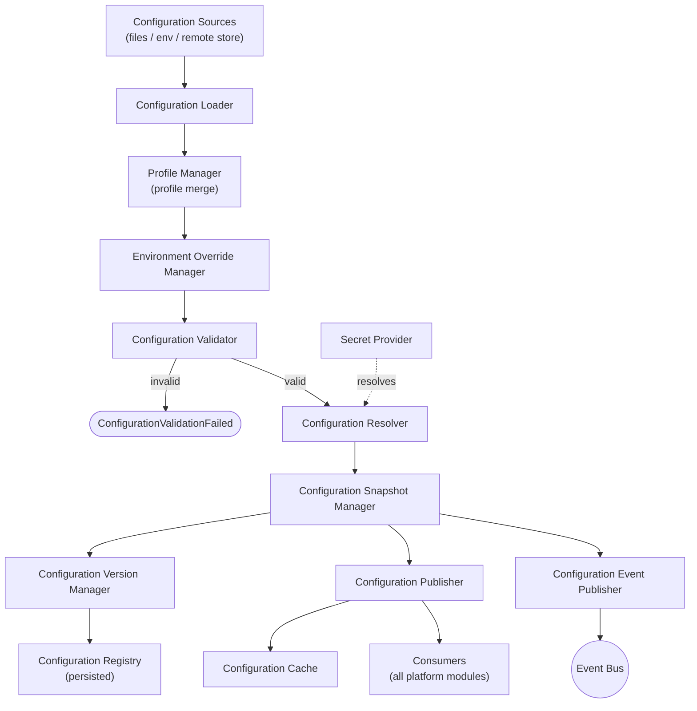

Configuration flows strictly one direction — from sources, through the pipeline, to consumers. No consuming module writes back into this flow except through the explicit `applyOverrides()`/`rollbackConfiguration()` entry points (Section 6), which re-enter the same pipeline from the Validator stage onward rather than bypassing it.

---

## 18. Interaction With Other Modules

### 18.1 Orchestrator Core

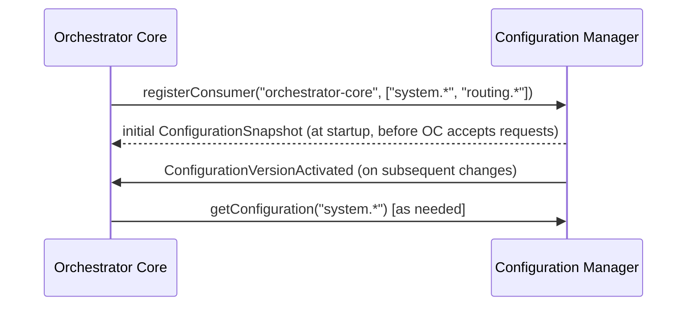

### 18.2 Planner

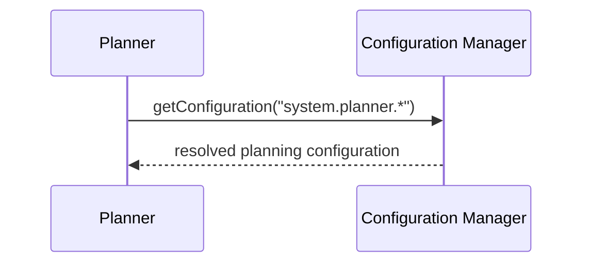

### 18.3 Router

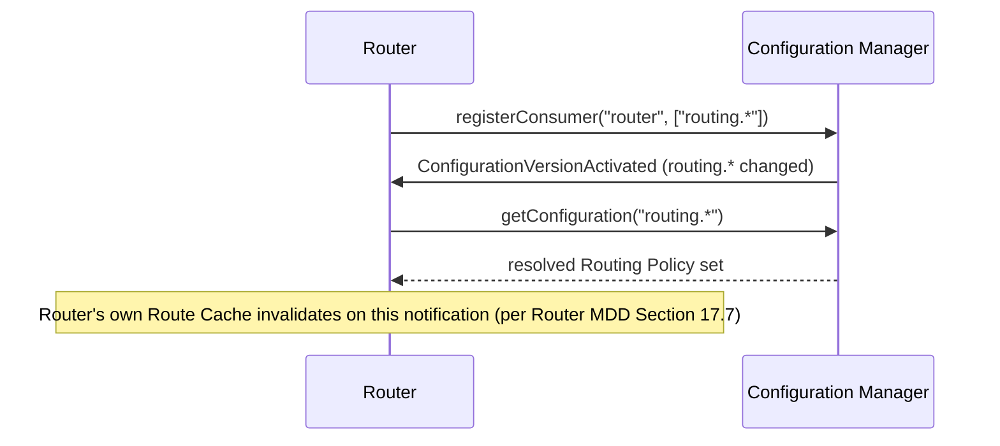

### 18.4 Provider Manager / Model Registry

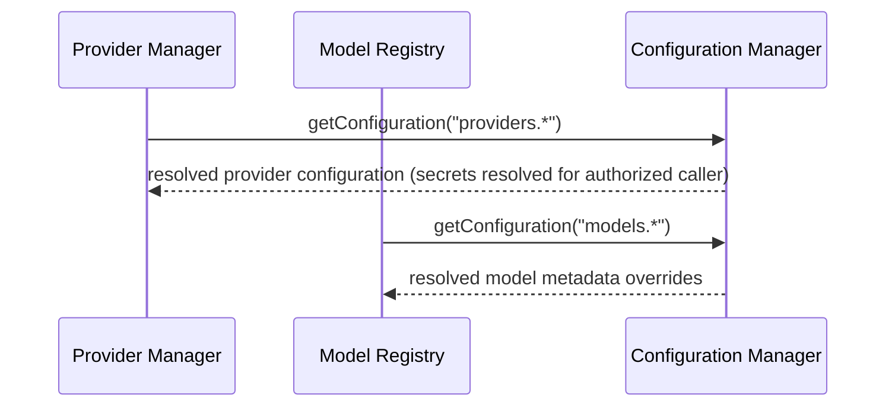

### 18.5 Memory Manager

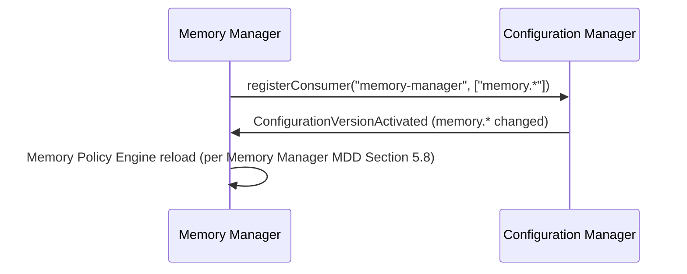

### 18.6 Knowledge Base / Review Engine / Validation Engine / Browser Automation

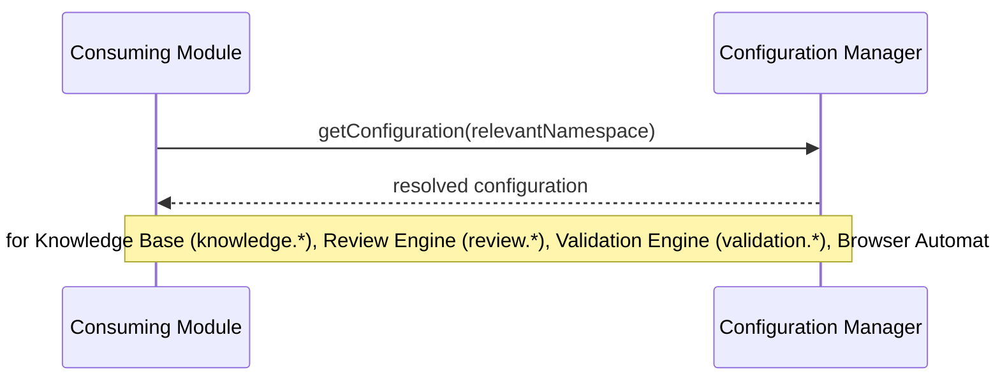

### 18.7 Task Queue

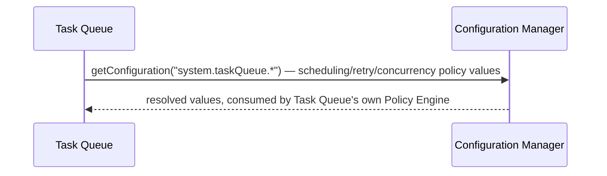

### 18.8 Plugin Systems

```mermaid
sequenceDiagram
    participant PPS as Provider Plugin System
    participant CM as Configuration Manager
    PPS->>CM: getConfiguration("plugins.<pluginId>")
    CM-->>PPS: opaque plugin configuration block
    Note over PPS,CM: Configuration Manager validates shape only; PPS validates semantic correctness
```

### 18.9 Dashboard Backend

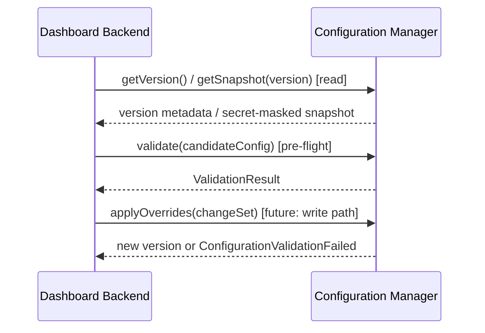

### 18.10 Logger

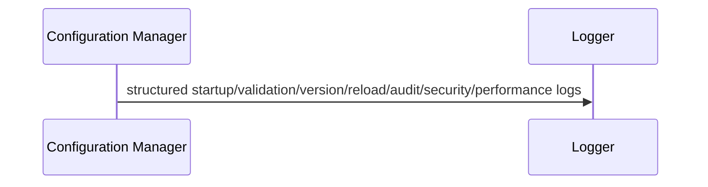

---

## 19. Folder Structure

```
configuration-manager/
├── domain/
│   ├── configuration-snapshot.ts       # Immutable snapshot value object (Section 8.2)
│   ├── configuration-version.ts        # Version metadata model
│   ├── namespace-schema.ts             # Namespace/schema contract (Section 11)
│   ├── feature-flag.ts                 # Feature flag definition model
│   └── audit-entry.ts                  # Audit record model
│
├── application/
│   ├── configuration-coordinator/
│   │   └── configuration-coordinator.ts # Section 5.1 — top-level conductor
│   ├── loader/
│   │   └── configuration-loader.ts     # Section 5.2
│   ├── validator/
│   │   └── configuration-validator.ts  # Section 5.3
│   ├── resolver/
│   │   └── configuration-resolver.ts   # Section 5.4
│   ├── registry/
│   │   └── configuration-registry.ts   # Section 5.5
│   ├── cache/
│   │   └── configuration-cache.ts      # Section 5.6
│   ├── snapshot-manager/
│   │   └── configuration-snapshot-manager.ts # Section 5.7
│   ├── version-manager/
│   │   └── configuration-version-manager.ts # Section 5.8
│   ├── profile-manager/
│   │   └── profile-manager.ts          # Section 5.9
│   ├── environment-override-manager/
│   │   └── environment-override-manager.ts # Section 5.10
│   ├── secret-reference-resolver/
│   │   └── secret-reference-resolver.ts # Section 5.11
│   ├── feature-flag-manager/
│   │   └── feature-flag-manager.ts     # Section 5.12
│   ├── policy-resolver/
│   │   └── policy-resolver.ts          # Section 5.13
│   ├── runtime-update-manager/
│   │   └── runtime-update-manager.ts   # Section 5.14
│   ├── hot-reload-manager/
│   │   └── hot-reload-manager.ts       # Section 5.15
│   ├── publisher/
│   │   └── configuration-publisher.ts  # Section 5.16
│   ├── health-monitor/
│   │   └── configuration-health-monitor.ts # Section 5.19
│   └── audit-manager/
│       └── configuration-audit-manager.ts # Section 5.20
│
├── infrastructure/
│   ├── sources/
│   │   ├── file-source-adapter.ts      # Configured file-based source
│   │   ├── env-source-adapter.ts       # Environment-variable source
│   │   └── remote-source-adapter.ts    # Future remote/distributed source (Section 22)
│   ├── persistence/
│   │   └── configuration-persistence-adapter.ts # Section 5.18
│   ├── secret-provider/
│   │   └── secret-provider-client.ts   # Port implementation for the external Secret Provider
│   ├── event-publisher/
│   │   └── configuration-event-publisher.ts # Section 5.17
│   └── security/
│       └── access-control-client.ts    # Port implementation for the Security Layer
│
├── interfaces/
│   ├── configuration-manager.interface.ts # Public interface contracts (Section 6)
│   ├── configuration-source.interface.ts  # Port every source adapter implements
│   └── secret-provider.interface.ts       # Port the Secret Reference Resolver depends on
│
├── plugins/
│   └── custom-sources/                 # Drop-in directory for organization-specific configuration sources
│
├── config/
│   └── namespace-schemas/              # Registered namespace schema definitions (Section 11), one file per namespace
│       ├── system.schema.yaml
│       ├── providers.schema.yaml
│       ├── routing.schema.yaml
│       ├── memory.schema.yaml
│       └── ... (one per namespace)
│
└── tests/
    ├── unit/
    ├── validation/
    ├── resolution/
    ├── hot-reload/
    ├── rollback/
    ├── concurrency/
    ├── security/
    ├── performance/
    └── regression/
```

**Design rationale for this structure:** mirrors the `domain/ → application/ → infrastructure/ → interfaces/ → plugins/ → config/ → tests/` convention established across every prior MDD in this platform (Router, Memory Manager, Task Queue), for consistency across the codebase and to keep onboarding cost low for engineers moving between modules.

---

## 20. File Responsibilities

| File / Directory | Purpose | Public API | Private Logic | Dependencies |
|---|---|---|---|---|
| `configuration-coordinator.ts` | Pipeline sequencing | None directly public (backs Section 6 interfaces) | Stage-sequencing logic, error-propagation | Every other `application/` component |
| `configuration-loader.ts` | Raw source reads | `load()` | Source iteration, retry-on-read-failure (Section 12.1) | `infrastructure/sources/*` |
| `configuration-validator.ts` | Schema/consistency checks | `validate()` (also backs public `validate()`, Section 6.10) | Schema-matching engine | `config/namespace-schemas/*` |
| `configuration-resolver.ts` | Reference/value resolution | `resolve()` | Sub-step orchestration (secret/flag/policy) | Secret Reference Resolver, Feature Flag Manager, Policy Resolver |
| `configuration-registry.ts` | Namespace catalog | `registerNamespace()`, `getNamespaceSchema()` | Namespace indexing | `configuration-persistence-adapter.ts` |
| `configuration-cache.ts` | Read acceleration | None public (internal only) | Cache key derivation, TTL/invalidation | Snapshot version-activation signal |
| `configuration-snapshot-manager.ts` | Immutable snapshot construction | `createSnapshot()`, backs `getSnapshot()` | Snapshot object construction | Version Manager, Registry |
| `configuration-version-manager.ts` | Version identity/history | `assignVersion()`, `getVersionHistory()`, backs `getVersion()` | Monotonic version assignment | Persistence Adapter |
| `profile-manager.ts` | Profile merge | `applyProfile()` | Profile-fragment lookup and merge | Loader output |
| `environment-override-manager.ts` | Env merge | `applyEnvironmentOverrides()` | Env-var-to-namespace-path mapping | `env-source-adapter.ts` |
| `secret-reference-resolver.ts` | Secret substitution | None public (internal only, invoked by Resolver) | Reference-pattern detection, Secret Provider calls | `secret-provider-client.ts` |
| `feature-flag-manager.ts` | Flag resolution | `resolveFlags()` | Targeting-rule evaluation (future) | Registry (`featureFlags.*`) |
| `policy-resolver.ts` | Policy value resolution | `resolvePolicyValues()` | Namespace-scoped value extraction | Registry |
| `runtime-update-manager.ts` | Runtime change entry point | Backs `reloadConfiguration()`, `applyOverrides()`, `rollbackConfiguration()` | Change-set application, rollback target retrieval | Coordinator, Hot Reload Manager, Version Manager |
| `hot-reload-manager.ts` | Propagation coordination | `propagate()` | Consumer notification, acknowledgment tracking | Publisher, Event Publisher |
| `configuration-publisher.ts` | Snapshot serving | Backs `getConfiguration()`, `getSnapshot()` | Cache-first read path | Snapshot Manager, Cache |
| `configuration-health-monitor.ts` | Subsystem health | Backs internal health queries | Health-state aggregation | Loader, Coordinator signals |
| `configuration-audit-manager.ts` | Audit trail | None public (internal only) | Secret-masked record construction | Persistence Adapter |

---

## 21. Testing Strategy

| Test Category | Coverage |
|---|---|
| **Unit Tests** | Every component in Section 5 tested in isolation with mocked dependencies. |
| **Integration Tests** | Full pipeline (Load → Merge → Validate → Resolve → Snapshot → Publish) exercised against realistic multi-source configurations. |
| **Contract Tests** | Every registered namespace schema validated against representative valid/invalid payloads; plugin configuration shape-validation contract tested against the Provider Plugin System's and Browser Automation Engine Plugin System's declared schemas. |
| **Failure Tests** | Each failure mode in Section 12 exercised explicitly (source unavailable, validation failure, merge conflict, secret resolution failure, snapshot persistence failure). |
| **Performance Tests** | Pipeline stage latency and cache hit-rate measured under representative namespace/consumer counts. |
| **Security Tests** | Secret values verified never to appear in logs, audit records, or non-authorized read responses; masking transform tested exhaustively. |
| **Hot Reload Tests** | End-to-end reload propagation verified to reach all registered consumers, including the timeout/degraded-acknowledgment path (Section 12). |
| **Rollback Tests** | Rollback to a valid prior version, and rejection of rollback to a schema-incompatible version, both verified. |
| **Concurrency Tests** | Multiple simultaneous readers against an active snapshot verified for correctness with no locking-related degradation; concurrent `reloadConfiguration()` calls verified to serialize correctly (Section 6.2) rather than race. |

---

## 22. Future Expansion

| Future Capability | Extension Mechanism |
|---|---|
| **Remote Configuration** | New `remote-source-adapter.ts` implementing the existing `configuration-source.interface.ts` port (Section 19) — no core pipeline change. |
| **Distributed Configuration** | Extension of the Persistence Adapter and Version Manager to a distributed consensus-backed store, transparent to every other component since they interact only through the existing ports. |
| **Cluster Synchronization** | Built on the same shared-Persistence-Adapter reconciliation pattern already used for multi-instance coordination (Section 19.1). |
| **Multi-Region** | Independent Configuration Manager deployment groups per region, federated the same way other platform modules approach multi-region (see Memory Manager MDD Section 19.4, Task Queue MDD Section 19.4) — an explicit extension, not assumed by the base design. |
| **Dashboard** | Already supported structurally via the standard public interfaces (Section 6, Section 18.9); a dashboard UI is purely a new consumer, requiring no Configuration Manager change. |
| **Configuration APIs** | The public interfaces (Section 6) are already the stable API surface; a REST/GraphQL facade is an additional infrastructure-layer adapter in front of them, not a redesign. |
| **Policy Engine (external, advisory)** | An external system proposing policy-value changes would call `validate()` then `applyOverrides()` like any other caller — no privileged integration path needed. |
| **Dynamic Feature Flags** | Section 3.3, F3 — targeting-rule strategies registered the same way custom policies are registered in the Router/Memory Manager/Task Queue MDDs. |
| **AI-Assisted Configuration Optimization** | An advisory input that proposes a `changeSet` for `applyOverrides()`/`validate()` — never an autonomous write path, preserving the same validation/audit guarantees for every change regardless of origin. |

---

## 23. Risks

| Category | Risk | Mitigation |
|---|---|---|
| **Complexity** | The layered override model (profile → environment → organization → namespace) can become difficult to reason about as override count grows. | Fixed, non-configurable precedence order (Section 7.5) plus `resolveConfiguration()`'s context-scoped diagnostic view (Section 6.6) let operators inspect exactly what layer produced a given effective value. |
| **Configuration Drift** | Multiple Configuration Manager instances (Section 19) could theoretically diverge if the shared Persistence Adapter backend is not strongly consistent. | Version activation is gated on a successful durable write (Section 12, Snapshot Failures); instances reconcile against the same durable version history rather than maintaining independent authoritative state. |
| **Version Conflicts** | Two near-simultaneous `applyOverrides()`/`reloadConfiguration()` calls could race. | Reload/update operations are serialized per the Runtime Update Manager (Section 6.2); the Version Manager's monotonic assignment guarantees a deterministic winner without silent data loss (the losing operation's changes are surfaced as a conflict, not silently dropped — future enhancement to support automatic re-merge is tracked under Section 22). |
| **Secret Leakage** | A masking-transform bug could expose a resolved secret in a log or dashboard view. | Secret Reference Resolver output is architecturally isolated (Section 5.11) — only the in-memory `ResolvedConfiguration` served to an authorized consumer ever holds resolved values; masking tests (Section 21) specifically assert secrets never appear in any persisted or logged representation. |
| **Stale Snapshots** | A consumer that misses a `ConfigurationVersionActivated` event (e.g. due to a transient Event Bus issue) could operate on a stale snapshot indefinitely. | `refresh()` (Section 6.13) gives consumers an explicit resynchronization path; Configuration Health Monitor tracks acknowledgment gaps (Section 12, Hot Reload Failures) for operator visibility. |
| **Concurrent Updates** | Simultaneous operator and automated (future AI-assisted) changes to the same namespace. | Namespace-scoped authorization plus the same serialized-update guarantee as Version Conflicts above; every change is individually attributed and audited (Section 15.4), making conflicting intent visible even where it cannot be fully automatically reconciled. |
| **Invalid Overrides** | A namespace/project-level override that is individually valid but produces an inconsistent merged result. | Validation always runs against the *fully merged* candidate (Section 7.5), never against an override in isolation, so cross-field/cross-layer inconsistency is always caught before activation. |

---

## 24. Design Decisions

| Decision | Alternatives Considered | Trade-offs | Why Chosen |
|---|---|---|---|
| Configuration Manager contains zero business logic — only lifecycle, validation, resolution, distribution, governance | Allow the Configuration Manager to also own some policy *evaluation* (e.g. compute the Router's effective routing score directly) | Owning evaluation logic would blur the line between "supplying values" and "making decisions," directly violating the Non-Goals in the source requirements and creating the same inappropriate coupling risk called out in the Router and Memory Manager MDDs' design-decision sections regarding their own internal routing components. | Strict separation keeps every consuming module's domain logic entirely within that module, with the Configuration Manager supplying only the inputs — consistent with this platform's consistent "orchestration without domain logic" pattern. |
| Startup and runtime reload share one identical pipeline (Load → Merge → Validate → Resolve → Snapshot → Publish) | Separate, independently-optimized code paths for startup vs. runtime reload | A separate runtime path could in principle be faster (skip re-reading unchanged sources), but risks the two paths silently diverging in validation/merge behavior over time — a correctness risk judged worse than the performance cost. | One pipeline, always identical in behavior regardless of trigger, guarantees a reload can never produce a result that startup load would have rejected, or vice versa. |
| Configuration snapshots are strictly immutable, with every change producing a new version | In-place mutation of a shared configuration object, protected by locking for concurrent readers | In-place mutation is more memory-efficient for large configurations but reintroduces exactly the consistency risk (a reader observing a partially-updated state) this design exists to eliminate, and requires read-side locking that immutable snapshots avoid entirely (Section 16). | Immutability trades some memory overhead (retained historical versions, bounded by retention policy) for a strong, simple consistency guarantee and lock-free concurrent reads — judged the correct trade-off given how many modules depend on configuration correctness simultaneously. |
| Rollback creates a new forward version rather than reactivating an old version identifier in place | Allow the Version Manager to "rewind" to a prior version identifier directly | Rewinding produces a non-monotonic, effectively branching version history, complicating audit reconstruction ("was version 12 the original activation, or a later rollback to it?") and reload/subscription logic that assumes strictly increasing versions. | A forward-only version history, where rollback is "activate a new version whose content matches an old one," keeps every consumer's and every audit tool's assumption of monotonic versioning universally true, at the cost of the version *number* not directly indicating configuration lineage without consulting the `restoredFromVersion` metadata field. |
| Fixed, non-configurable override precedence order (namespace > organization > environment > profile > global) | Make precedence itself configurable per-organization | Configurable precedence sounds flexible but creates a second-order configuration-about-configuration problem: understanding "what wins" would require knowing both the values *and* the currently configured precedence rules, compounding the Complexity risk (Section 23) rather than mitigating it. | A single fixed order that is always true, documented once (Section 7.5) and referenced everywhere, is a deliberate simplicity-over-flexibility trade-off, mirroring the Router MDD's analogous choice of a fixed five-band precedence model over a fully configurable one (Router MDD Section 24). |
| Plugin configuration validated for shape only by the Configuration Manager, semantic correctness delegated to the owning Plugin System | Have the Configuration Manager validate plugin configuration semantics directly, using plugin-supplied validation functions | Executing plugin-supplied validation code inside the Configuration Manager would violate its "never execute plugins" non-goal and introduce an untrusted-code execution surface into a module every other module depends on for correctness. | Shape-only validation keeps the Configuration Manager's own guarantees (schema correctness) intact without taking on execution risk; the owning Plugin System validates semantics using its own execution boundary, consistent with the Provider Plugin System MDD's and Browser Automation Engine Plugin System MDD's own sandboxing designs. |

---

## 25. Diagrams

### 25.1 Component Diagram

*(See Section 5 for the full component diagram.)*

### 25.2 Sequence Diagram

*(See Section 7.6 — Hot Reload — and Section 7.7 — Rollback — for the primary sequence diagrams; see Section 18 for per-module interaction sequence diagrams.)*

### 25.3 State Diagram

*(See Section 8.8 for the full configuration lifecycle/version state diagram.)*

### 25.4 Data Flow Diagram

*(See Section 17 for the full data flow diagram.)*

### 25.5 Class Diagram

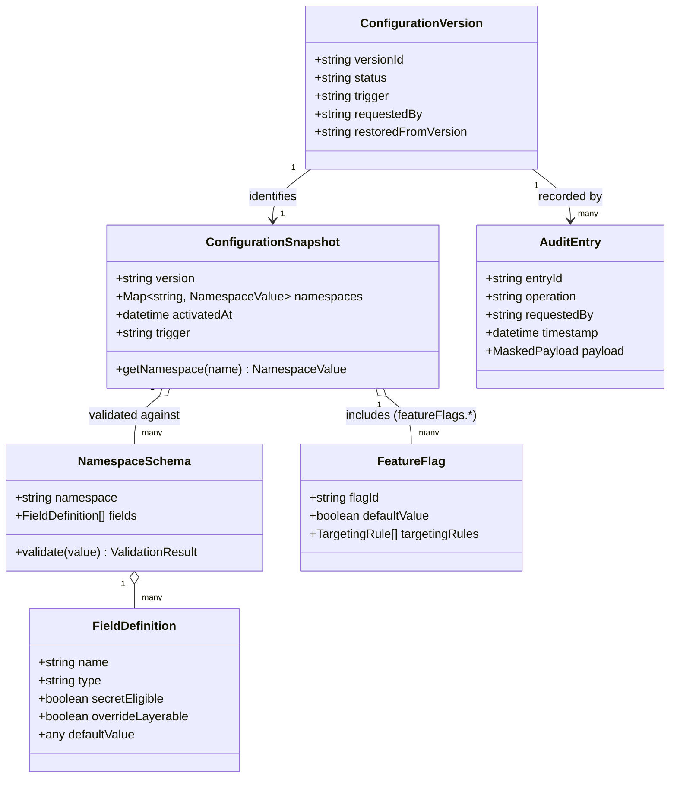

### 25.6 Folder Structure Diagram

*(See Section 19 for the full annotated folder tree.)*

---

*End of Configuration Manager Module Design Document.*
