# Module Design Document (MDD)
## Dashboard Backend

**Version:** 1.0
**Status:** Draft for engineering review
**Companion to:** SDD v1.0, API Specification v1.0, Database Design Document v1.0, and all prior module MDDs (Orchestrator Core, Request Manager, Planner, Task Queue, Router, Provider Manager, Event Bus, Configuration Manager, Logger, Learning Layer, Memory Manager, Knowledge Base, Review Engine, Validation Engine, Browser Automation, Git Manager)

---

## 1. Executive Summary

### Purpose
The Dashboard Backend is the platform's **administration and control-plane API**. It is not the dashboard UI — it is the secure, aggregated API surface that a future web dashboard, mobile administration app, or automation script calls to observe and administer the platform: health, metrics, logs, events, configuration, providers, plugins, model registry, routing policies, learning insights, memory/knowledge statistics, review/validation metrics, Git status, and audit records.

### Responsibilities
Administrative API surface, operational status/health/metrics aggregation, RBAC-gated administrative workflows (configuration updates, provider/plugin reloads), audit exposure — and nothing about *how* any underlying module does its work. It reads from and, for a narrow set of administrative actions, writes through every other module's own public interface; it owns no business logic and no domain state of its own beyond dashboard-session/administrative-request bookkeeping.

### Architectural Role
The Dashboard Backend is a **read-heavy aggregation and control layer** sitting above every other module, calling exclusively through their public interfaces (never their internals), and exposing a unified, authenticated, authorized administrative API. It is architecturally analogous to an API Gateway specialized for operations/administration rather than end-user traffic — it composes, it never originates business logic.

### Module Boundaries
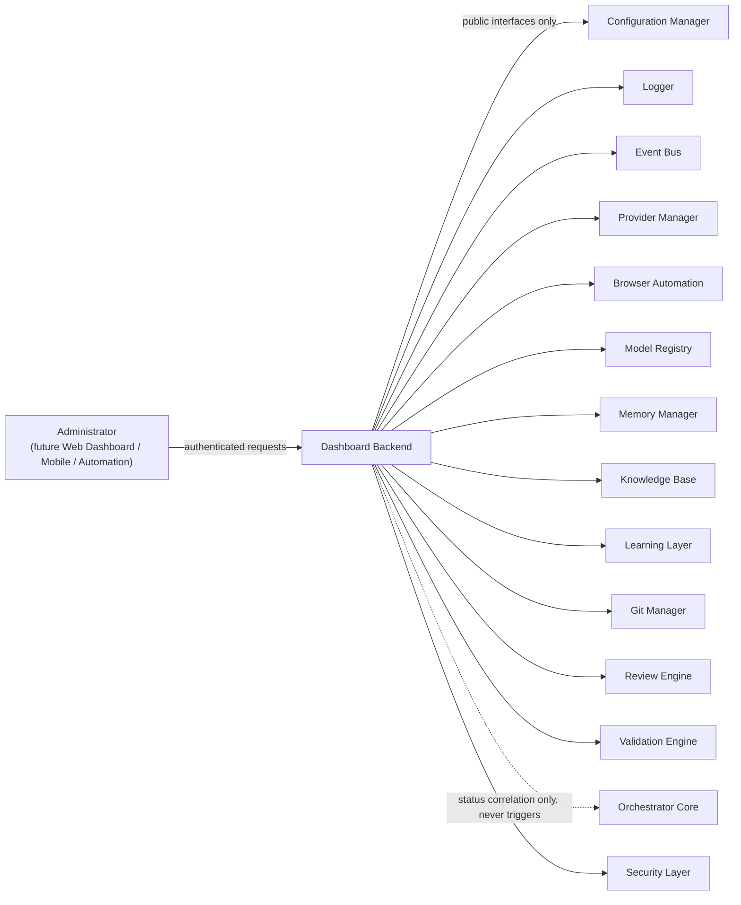

---

## 2. Goals

### Primary Goals
- Provide a complete, authenticated, authorized administrative API surface: platform status, health, metrics, logs, events, configuration read/write, provider/plugin management, browser pool visibility, model registry visibility, routing policy visibility, learning insights, memory/knowledge statistics, review/validation metrics, Git repository status, audit records.
- Enforce RBAC and multi-tenant isolation on every administrative operation.
- Remain a pure aggregation/composition layer — every piece of information exposed is fetched through an owning module's public interface, never duplicated or reimplemented.

### Secondary Goals
- Support future automation APIs (scripted administration) using the identical authenticated interface as human administrators.
- Provide low-latency aggregated views (platform status, health) via caching without compromising data freshness guarantees administrators depend on.
- Lay the API foundation for a future web dashboard and mobile administration app without assuming either exists yet.

### Non-Goals
- The Dashboard Backend never executes orchestration, routing, provider execution, planning, validation, or review. It never manages memory or knowledge directly (only through Memory Manager's/Knowledge Base's own interfaces). It never bypasses module interfaces, never accesses repositories directly, never implements business rules, and never duplicates module logic. It is an API aggregation and administration layer only.

### Design Constraints
- Must call every other module exclusively through that module's already-published public interface (§6 of each module's own MDD) — no exceptions, no "just this once" direct repository access.
- Must enforce authentication and authorization on every single administrative operation, with no unauthenticated read path beyond a minimal public health-check endpoint (mirroring the platform's `GET /health`, ASD §2).
- Must degrade gracefully when an underlying module is unavailable — a Provider Manager outage must not take down the entire dashboard, only the provider-specific views (§12).

### Future Goals
- WebSocket/event-streaming live dashboards (§22).
- Multi-region control-plane aggregation.
- Administrative scripting/automation API tier with its own service-token authentication path (mirrors ASD §6 Service Tokens).

---

## 3. Responsibilities

### Must Have
- Expose authenticated, authorized read APIs for: platform status, health (aggregate and per-module), metrics, logs, events, configuration, providers, plugins, browser pools, model registry, routing policies, learning insights, memory statistics, knowledge statistics, review metrics, validation metrics, Git repository status, audit records.
- Expose authenticated, authorized write APIs for the narrow set of legitimate administrative mutations: configuration updates (via Configuration Manager), provider reload, plugin reload — every mutation delegated entirely to the owning module's own public write interface, never performed directly by this module.
- Enforce RBAC on every operation (§15).
- Enforce multi-tenant/organization isolation on every aggregated view, consistent with the platform-wide namespace-scoping pattern (Knowledge Base MDD §19, DDD §19).
- Publish dashboard/administrative lifecycle events.
- Aggregate health/status from every dependent module into a single platform-status view, tolerating partial module unavailability (§12).

### Should Have
- Cache aggregated views (status, health, metrics) with short TTL to bound load on underlying modules from frequent dashboard polling.
- Support pagination and streaming for large result sets (logs, events, audit records) consistent with the platform-wide pagination convention (ASD §2, DDD §10).
- Provide notification delivery for significant administrative events (e.g., a configuration change notification to other connected administrators).

### Future Responsibilities
- WebSocket-based live-update push, superseding polling-based aggregation for connected dashboard clients.
- Administrative scripting/automation API tier.
- Multi-region/cluster administration aggregation.

---

## 4. Scope

### Owns
Administrative API, Operational API, Management API, Dashboard API, Platform status aggregation, Health aggregation, Metrics aggregation, Audit API (exposure — not the underlying audit log storage, which lives with each owning module per the platform-wide audit-logging convention), Authentication integration (delegates to Security Layer, does not implement auth itself), Authorization enforcement (RBAC policy application at this module's API boundary), Administrative workflows (the *sequencing* of a multi-step admin action, e.g., "reload provider" = validate → call Provider Manager → confirm → notify — never the underlying reload logic itself).

### Never Owns
Orchestration, Planning, Routing, Provider execution, Browser execution, Review, Validation, Memory storage, Knowledge storage, Configuration logic (the rules governing what a valid configuration *is* belong to Configuration Manager; this module only reads/writes through its interface), Business workflows.

### Other Module Responsibilities (explicit separation)
| Module | Owns instead |
|---|---|
| Configuration Manager | Configuration schema, validation, versioning, hot-reload — Dashboard Backend only calls `getConfiguration`/`updateConfiguration` through Configuration Manager's own public interface |
| Logger | Log storage and structured log schema — Dashboard Backend only queries via Logger's read interface |
| Event Bus | Event delivery mechanics — Dashboard Backend subscribes as a consumer like any other module, and publishes its own dashboard-domain events, but never operates the bus itself |
| Learning Layer | Learning signal aggregation/promotion logic — Dashboard Backend only reads exposed insights |
| Provider Manager | Actual provider execution, retry/failover, health computation — Dashboard Backend only reads status and calls `reloadProvider` through Provider Manager's own interface |
| Browser Automation | Actual browser pool execution — Dashboard Backend only reads pool status |
| Model Registry | Model/capability data ownership — Dashboard Backend only reads |
| Memory Manager | Memory orchestration — Dashboard Backend only reads statistics |
| Knowledge Base | Knowledge persistence — Dashboard Backend only reads statistics/metrics, never calls `storeKnowledge`/`deleteKnowledge` directly |
| Git Manager | Repository coordination — Dashboard Backend only reads status/history, never calls commit/merge/rollback operations (no legitimate administrative use case for this module to mutate repository state) |

---

## 5. Internal Architecture

```mermaid
flowchart TB
    subgraph DB["Dashboard Backend"]
        DAC["Dashboard API Controller"]
        AdC["Administration Coordinator"]
        HA["Health Aggregator"]
        MA["Metrics Aggregator"]
        SA["Status Aggregator"]
        ConfAPI["Configuration API"]
        ProvAPI["Provider Management API"]
        PlugAPI["Plugin Management API"]
        BrAPI["Browser Management API"]
        MRAPI["Model Registry API"]
        RPAPI["Routing Policy API"]
        MemAPI["Memory API"]
        KAPI["Knowledge API"]
        LAPI["Learning API"]
        GAPI["Git API"]
        AudAPI["Audit API"]
        UMAPI["User Management API"]
        RBACm["RBAC Manager"]
        SessM["Session Manager"]
        NotifM["Notification Manager"]
        DEP["Dashboard Event Publisher"]
        DCache["Dashboard Cache"]
        DHM["Dashboard Health Monitor"]
    end
    Admin["Administrator client"] --> DAC
    DAC --> SessM
    DAC --> RBACm
    DAC --> AdC
    AdC --> HA
    AdC --> MA
    AdC --> SA
    AdC --> ConfAPI
    AdC --> ProvAPI
    AdC --> PlugAPI
    AdC --> BrAPI
    AdC --> MRAPI
    AdC --> RPAPI
    AdC --> MemAPI
    AdC --> KAPI
    AdC --> LAPI
    AdC --> GAPI
    AdC --> AudAPI
    AdC --> UMAPI
    HA --> DCache
    MA --> DCache
    SA --> DCache
    ConfAPI --> CFG["Configuration Manager (external)"]
    ProvAPI --> PM["Provider Manager (external)"]
    PlugAPI --> PPS["Provider Plugin System (external)"]
    BrAPI --> BA["Browser Automation (external)"]
    MRAPI --> MR["Model Registry (external)"]
    RPAPI --> RT["Router (external)"]
    MemAPI --> MM["Memory Manager (external)"]
    KAPI --> KB["Knowledge Base (external)"]
    LAPI --> LL["Learning Layer (external)"]
    GAPI --> GM["Git Manager (external)"]
    AdC --> NotifM
    NotifM --> DEP
    DEP --> EB["Event Bus (external)"]
    AdC --> DHM
```

### 5.1 Dashboard API Controller
- **Purpose**: The single external-facing entry point for every administrative request.
- **Responsibilities**: request parsing, delegating authentication to Session Manager, delegating authorization to RBAC Manager, routing the authorized request to the Administration Coordinator.
- **Inputs**: raw administrative HTTP request.
- **Outputs**: response payload or structured error.
- **Dependencies**: Session Manager, RBAC Manager, Administration Coordinator.
- **Lifecycle**: stateless, one call per request.

### 5.2 Administration Coordinator
- **Purpose**: Sequence multi-step administrative workflows (e.g., "reload provider" = validate request → call Provider Management API → await confirmation → publish event → notify).
- **Responsibilities**: orchestrate calls to the appropriate domain-specific API component (§5.6–§5.16) and to Notification Manager/Dashboard Event Publisher; contains no business logic itself, only sequencing.
- **Inputs**: authorized request from Dashboard API Controller.
- **Outputs**: aggregated/composed response.
- **Dependencies**: all domain-specific API components, Notification Manager, Dashboard Health Monitor.
- **Lifecycle**: stateless per call.

### 5.3 Health Aggregator
- **Purpose**: Compose per-module health into a single platform-status view.
- **Responsibilities**: call each dependent module's own `health()`-shaped interface (per the pattern established across every module MDD, e.g., Orchestrator Core §6.3-equivalent, Git Manager §6.18); tolerate partial unavailability, marking unreachable modules `unknown` rather than failing the whole aggregation.
- **Inputs**: none (or a module-filter).
- **Outputs**: `PlatformHealth { overall, perModule[] }`.
- **Dependencies**: every dependent module's health interface, Dashboard Cache.
- **Lifecycle**: stateless per call; results cached with short TTL (§16).

### 5.4 Metrics Aggregator
- **Purpose**: Compose metrics exposed by each module's own monitoring interface (per every module MDD's §Monitoring section) into unified dashboard views.
- **Responsibilities**: fetch and normalize metrics from each module; never compute or derive new business metrics itself (a metric this module wants that isn't already exposed by an owning module is a signal to add it to that module's own Monitoring section, not to compute it here).
- **Inputs**: metric query scope (module, time range).
- **Outputs**: normalized metrics payload.
- **Dependencies**: every dependent module's metrics-exposing interface, Dashboard Cache.
- **Lifecycle**: stateless per call.

### 5.5 Status Aggregator
- **Purpose**: Compose a higher-level "platform status" view distinct from raw health (e.g., "3 active administrators, 42 in-flight requests, provider mix summary") by combining Health Aggregator and Metrics Aggregator output with a small amount of presentation-level composition.
- **Responsibilities**: assemble `getPlatformStatus()`'s response shape.
- **Inputs**: none.
- **Outputs**: `PlatformStatus`.
- **Dependencies**: Health Aggregator, Metrics Aggregator.
- **Lifecycle**: stateless per call.

### 5.6 Configuration API
- **Purpose**: Read/write configuration exclusively through Configuration Manager's own interface.
- **Responsibilities**: forward `getConfiguration`/`updateConfiguration` calls; apply RBAC checks specific to configuration mutation (elevated privilege required, §15).
- **Inputs/Outputs**: pass-through to/from Configuration Manager, with this module's own authorization layer applied first.
- **Dependencies**: Configuration Manager port.
- **Lifecycle**: stateless per call.

### 5.7 Provider Management API
- **Purpose**: Expose provider status and forward reload requests to Provider Manager.
- **Responsibilities**: `getProviders`, `reloadProvider` — thin delegation with authorization applied.
- **Dependencies**: Provider Manager port.
- **Lifecycle**: stateless per call.

### 5.8 Plugin Management API
- **Purpose**: Expose plugin status and forward reload requests to the Provider Plugin System.
- **Responsibilities**: `getPlugins`, `reloadPlugin`.
- **Dependencies**: Provider Plugin System port.
- **Lifecycle**: stateless per call.

### 5.9 Browser Management API
- **Purpose**: Expose Browser Automation pool status.
- **Responsibilities**: `getBrowserPools` — read-only, no administrative mutation of browser pools exposed at this layer (no legitimate need identified; browser pool sizing is a Configuration Manager-owned setting, reachable via the Configuration API instead).
- **Dependencies**: Browser Automation port.
- **Lifecycle**: stateless per call.

### 5.10 Model Registry API
- **Purpose**: Expose Model Registry contents.
- **Responsibilities**: `getModelRegistry` — read-only.
- **Dependencies**: Model Registry port.
- **Lifecycle**: stateless per call.

### 5.11 Routing Policy API
- **Purpose**: Expose Router's active routing policies/capability-selector configuration for visibility.
- **Responsibilities**: `getRoutingPolicies` — read-only; policy *authoring* remains exclusively Configuration Manager's write path, reachable (if needed) via the Configuration API, not a Router-specific write method here.
- **Dependencies**: Router port (read-only status/policy-summary interface).
- **Lifecycle**: stateless per call.

### 5.12 Memory API
- **Purpose**: Expose Memory Manager statistics.
- **Responsibilities**: `getMemory` — aggregate statistics only (counts, sizes, hit rates); never raw memory *content* retrieval through this module (that would blur the line into a memory-management capability this module explicitly never owns, §2/§4).
- **Dependencies**: Memory Manager port (statistics-exposing interface).
- **Lifecycle**: stateless per call.

### 5.13 Knowledge API
- **Purpose**: Expose Knowledge Base statistics.
- **Responsibilities**: `getKnowledge` — aggregate statistics (document counts, storage usage per DDD §16 Knowledge Count/Storage Usage monitoring), not content browsing/editing (a future Dashboard UI's knowledge-browsing feature, if built, would still go through Knowledge Base's own `searchKnowledge`/`retrieveKnowledge` interfaces — this module may expose a thin pass-through for that read path, but never mutates).
- **Dependencies**: Knowledge Base port.
- **Lifecycle**: stateless per call.

### 5.14 Learning API
- **Purpose**: Expose Learning Layer insights.
- **Responsibilities**: `getLearning` — read-only aggregated insight views.
- **Dependencies**: Learning Layer port.
- **Lifecycle**: stateless per call.

### 5.15 Git API
- **Purpose**: Expose Git Manager repository status/history.
- **Responsibilities**: read-only calls to Git Manager's `getStatus`/`getHistory`/`health` (Git Manager MDD §6) — no commit/merge/rollback exposed here, consistent with §4's explicit non-ownership of repository mutation.
- **Dependencies**: Git Manager port.
- **Lifecycle**: stateless per call.

### 5.16 Audit API
- **Purpose**: Expose audit records aggregated from every module's own audit-logging output (per each module MDD's §Security "Auditability" section).
- **Responsibilities**: `getAuditLog` — query/filter/paginate audit records; this module does not generate audit entries about *other* modules' operations (each module logs its own audit trail per its own MDD), it only exposes a unified query surface over Logger's audit-log storage.
- **Dependencies**: Logger port (audit-log query interface).
- **Lifecycle**: stateless per call.

### 5.17 User Management API
- **Purpose**: Administer dashboard users/administrators (distinct from platform end-users) and their role assignments.
- **Responsibilities**: CRUD for administrator accounts and role assignments, delegated to the Security Layer's identity store — this module coordinates the workflow, the Security Layer owns identity/credential storage.
- **Dependencies**: Security Layer port.
- **Lifecycle**: stateless per call.

### 5.18 RBAC Manager
- **Purpose**: Enforce role-based access control on every administrative operation.
- **Responsibilities**: resolve an authenticated administrator's roles/permissions; evaluate whether the requested operation is permitted, factoring in tenant/organization scope.
- **Inputs**: `authContext`, requested operation.
- **Outputs**: `AuthorizationResult { allowed: bool, reason? }`.
- **Dependencies**: Security Layer port (role/permission data), Configuration Manager (RBAC policy configuration, §11 `rbac.*`).
- **Lifecycle**: stateless per call; role/permission data cached (§16).

### 5.19 Session Manager
- **Purpose**: Manage dashboard/administrative session lifecycle, distinct from the platform's end-user Session entity (DDD §6.2) — an administrative session governs a dashboard client's authenticated connection, not an AI chat conversation.
- **Responsibilities**: create/validate/expire dashboard sessions; delegate actual credential verification to the Security Layer.
- **Inputs**: authentication credentials or session token.
- **Outputs**: `DashboardSession` / authentication failure.
- **Dependencies**: Security Layer port.
- **Lifecycle**: session-scoped state persisted via a repository port (§8).

### 5.20 Notification Manager
- **Purpose**: Deliver administrative notifications (e.g., "configuration changed by another admin") to connected dashboard clients.
- **Responsibilities**: compose notification payloads for significant administrative events; hand off to Dashboard Event Publisher for delivery.
- **Inputs**: administrative event.
- **Outputs**: none directly (delegates to Dashboard Event Publisher).
- **Dependencies**: Dashboard Event Publisher.
- **Lifecycle**: stateless per call.

### 5.21 Dashboard Event Publisher
- **Purpose**: Translate Dashboard Backend operations into Event Bus events (§9) and, in the future, WebSocket push messages (§22).
- **Responsibilities**: map every completed administrative operation to its corresponding event and payload.
- **Dependencies**: Event Bus port.
- **Lifecycle**: stateless per call.

### 5.22 Dashboard Cache
- **Purpose**: Cache aggregated health/status/metrics views to bound load on underlying modules.
- **Responsibilities**: TTL-based caching with explicit short expiry (administrators expect near-real-time data, so TTLs here are deliberately shorter than typical platform caches, §16).
- **Dependencies**: Cache storage domain (DDD §4.6).
- **Lifecycle**: always reconstructable from source modules.

### 5.23 Dashboard Health Monitor
- **Purpose**: Monitor this module's own health and its connectivity to every dependent module, feeding the platform-wide `GET /health` aggregation as well as this module's own `DashboardHealthChanged` event.
- **Responsibilities**: periodic connectivity checks to dependent module interfaces.
- **Dependencies**: every dependent module's port.
- **Lifecycle**: background/scheduled.

---

## 6. Public Interfaces

### 6.1 `getPlatformStatus(): PlatformStatus`
- **Purpose**: High-level platform status view.
- **Inputs**: `authContext`.
- **Outputs**: `PlatformStatus { health, activeAdmins, requestVolume, providerSummary, ... }`.
- **Validation**: `authContext` must carry a valid dashboard-read permission.
- **Error Conditions**: `Unauthenticated`, `Unauthorized`.
- **Side Effects**: none (read-only); may populate Dashboard Cache.

### 6.2 `getHealth(moduleFilter?): PlatformHealth`
- **Purpose**: Aggregate platform/module health.
- **Inputs**: optional `moduleFilter`, `authContext`.
- **Outputs**: `PlatformHealth`.
- **Validation**: authorization check.
- **Error Conditions**: `Unauthorized`.
- **Side Effects**: none.

### 6.3 `getMetrics(query): MetricsResult`
- **Purpose**: Retrieve aggregated metrics.
- **Inputs**: `query { module?, metricNames?, timeRange? }`, `authContext`.
- **Outputs**: `MetricsResult`.
- **Validation**: `timeRange` bounds must be reasonable (policy-configured max range to prevent excessive retrieval, §23); authorization check.
- **Error Conditions**: `Unauthorized`, `InvalidQuery`, `RangeTooLarge`.
- **Side Effects**: none.

### 6.4 `getLogs(query): LogQueryResult`
- **Purpose**: Query logs via Logger's read interface.
- **Inputs**: `query { correlationId?, level?, component?, timeRange?, cursor? }`, `authContext`.
- **Outputs**: paginated `LogQueryResult`.
- **Validation**: authorization check (log access may itself be a distinct, more sensitive permission than general dashboard read, §15).
- **Error Conditions**: `Unauthorized`, `InvalidQuery`.
- **Side Effects**: none.

### 6.5 `getEvents(query): EventQueryResult`
- **Purpose**: Query historical events via Event Bus's/Event Storage's read interface (DDD §16).
- **Inputs**: `query { eventType?, sessionId?, timeRange?, cursor? }`, `authContext`.
- **Outputs**: paginated `EventQueryResult`.
- **Validation**: authorization check.
- **Error Conditions**: `Unauthorized`, `InvalidQuery`.
- **Side Effects**: none.

### 6.6 `getConfiguration(scope): Configuration`
- **Purpose**: Read current configuration.
- **Inputs**: `scope { namespace?, projectId? }`, `authContext`.
- **Outputs**: `Configuration` (secrets redacted, per Configuration Manager's own convention, DDD §10/§19).
- **Validation**: authorization check.
- **Error Conditions**: `Unauthorized`.
- **Side Effects**: none.

### 6.7 `updateConfiguration(scope, changes): Configuration`
- **Purpose**: Apply a configuration change, delegated entirely to Configuration Manager's own `PATCH /v1/config`-equivalent interface (ASD §2.6).
- **Inputs**: `scope`, `changes`, `authContext`.
- **Outputs**: updated `Configuration`.
- **Validation**: elevated authorization check (configuration mutation is a higher-privilege operation than any read, §15); schema validation is performed by Configuration Manager itself, not duplicated here.
- **Error Conditions**: `Unauthorized`, `ConfigurationConflict` (schema violation surfaced from Configuration Manager, §12), `ImmutableField`.
- **Side Effects**: Configuration Manager applies the change; `ConfigurationUpdated` published; Notification Manager notifies other connected administrators.

### 6.8 `getProviders(): Provider[]`
- **Purpose**: List provider status.
- **Inputs**: `authContext`.
- **Outputs**: `Provider[]` (per Provider Manager MDD's own status shape).
- **Validation**: authorization check.
- **Error Conditions**: `Unauthorized`.
- **Side Effects**: none.

### 6.9 `reloadProvider(providerId): ReloadResult`
- **Purpose**: Trigger a provider reload via Provider Manager's own interface.
- **Inputs**: `providerId`, `authContext`.
- **Outputs**: `ReloadResult { success, providerId }`.
- **Validation**: elevated authorization check; `providerId` must exist.
- **Error Conditions**: `Unauthorized`, `ProviderNotFound`, `ReloadFailure` (propagated from Provider Manager).
- **Side Effects**: Provider Manager performs the reload; `ProviderReloaded` published.

### 6.10 `getPlugins(): Plugin[]` / `reloadPlugin(pluginId): ReloadResult`
- **Purpose**: Symmetric to §6.8/§6.9, for the Provider Plugin System.
- **Inputs/Outputs/Validation/Errors/Side Effects**: identical pattern, delegated to Provider Plugin System.

### 6.11 `getBrowserPools(): BrowserPoolStatus[]`
- **Purpose**: Expose Browser Automation pool status.
- **Inputs**: `authContext`.
- **Outputs**: `BrowserPoolStatus[]`.
- **Validation**: authorization check.
- **Error Conditions**: `Unauthorized`.
- **Side Effects**: none.

### 6.12 `getModelRegistry(): Model[]`
- **Purpose**: Expose Model Registry contents.
- **Inputs**: `authContext`, optional filter.
- **Outputs**: `Model[]`.
- **Validation**: authorization check.
- **Error Conditions**: `Unauthorized`.
- **Side Effects**: none.

### 6.13 `getRoutingPolicies(): RoutingPolicySummary`
- **Purpose**: Expose active routing/capability policy configuration for visibility.
- **Inputs**: `authContext`.
- **Outputs**: `RoutingPolicySummary`.
- **Validation**: authorization check.
- **Error Conditions**: `Unauthorized`.
- **Side Effects**: none.

### 6.14 `getLearning(): LearningInsights`
- **Purpose**: Expose Learning Layer aggregated insights.
- **Inputs**: `authContext`.
- **Outputs**: `LearningInsights`.
- **Validation**: authorization check.
- **Error Conditions**: `Unauthorized`.
- **Side Effects**: none.

### 6.15 `getKnowledge(): KnowledgeStatistics` / `getMemory(): MemoryStatistics`
- **Purpose**: Expose aggregated Knowledge Base / Memory Manager statistics.
- **Inputs**: `authContext`.
- **Outputs**: statistics payload (counts, storage usage, per DDD §16/§21 monitoring fields).
- **Validation**: authorization check.
- **Error Conditions**: `Unauthorized`.
- **Side Effects**: none.

### 6.16 `getAuditLog(query): AuditQueryResult`
- **Purpose**: Query audit records.
- **Inputs**: `query { actor?, action?, timeRange?, cursor? }`, `authContext`.
- **Outputs**: paginated `AuditQueryResult`.
- **Validation**: authorization check (audit access is itself a distinct, sensitive permission, §15).
- **Error Conditions**: `Unauthorized`, `InvalidQuery`.
- **Side Effects**: this call itself is audit-logged (`AuditRequested`, §9) — auditing who queried the audit log.

### 6.17 `authenticate(credentials): DashboardSession`
- **Purpose**: Authenticate an administrator, establishing a dashboard session.
- **Inputs**: `credentials` (delegated verification to Security Layer).
- **Outputs**: `DashboardSession { sessionId, expiresAt }`.
- **Validation**: credential format; delegated verification.
- **Error Conditions**: `AuthenticationFailed`.
- **Side Effects**: session created; `AdminAuthenticated` published.

### 6.18 `authorize(authContext, operation): AuthorizationResult`
- **Purpose**: Standalone authorization check, usable by any component in §5 before performing its own delegated call.
- **Inputs**: `authContext`, `operation`.
- **Outputs**: `AuthorizationResult`.
- **Validation**: `authContext` must reference a valid, non-expired session.
- **Error Conditions**: `SessionExpired`.
- **Side Effects**: `AdminAuthorized` (or a denial-logged equivalent) published.

### 6.19 `health(): HealthResult`
- **Purpose**: This module's own health, for the platform `GET /health` aggregation.
- **Inputs**: none.
- **Outputs**: `HealthResult { status, dependentModuleConnectivity[] }`.
- **Validation**: none.
- **Error Conditions**: none thrown.
- **Side Effects**: none.

---

## 7. Internal Workflow

### 7.1 Authentication
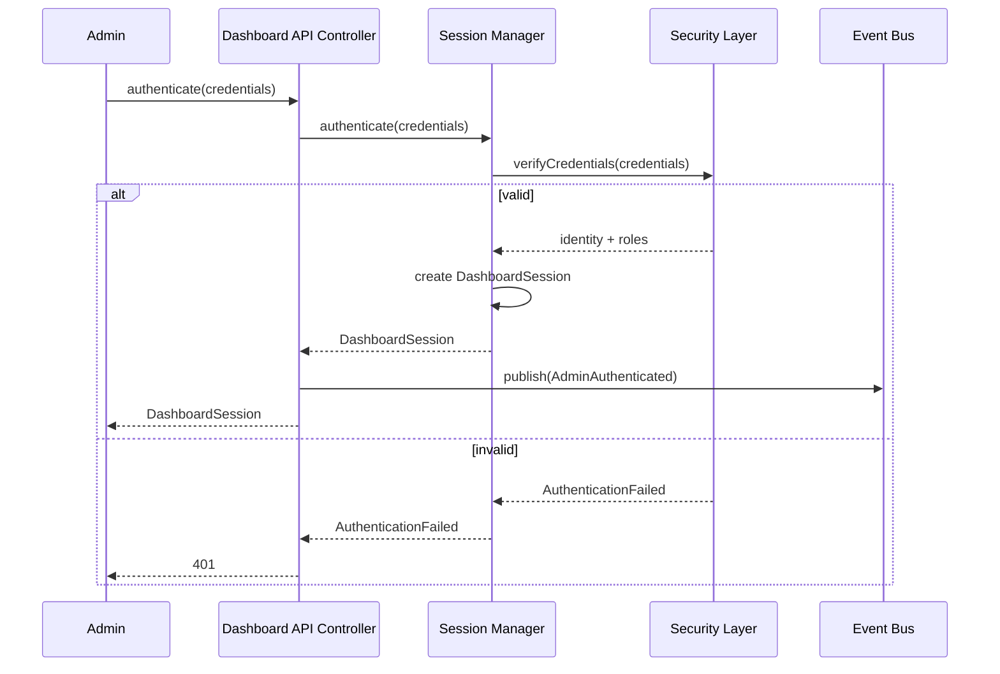

### 7.2 Authorization
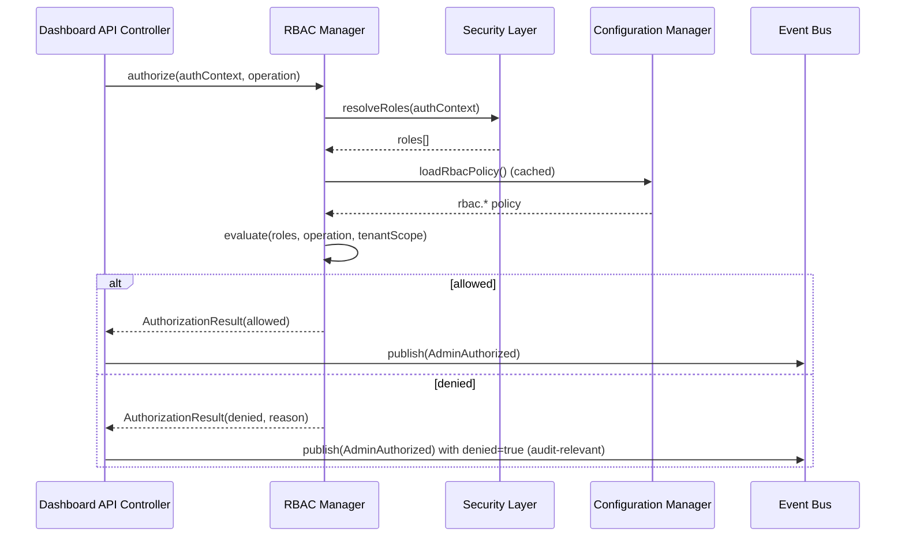

### 7.3 Request Routing / Aggregation / Response Generation
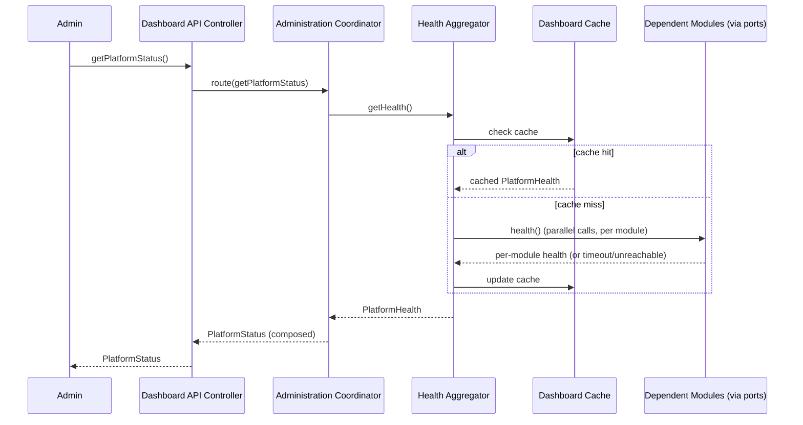

### 7.4 Configuration Update
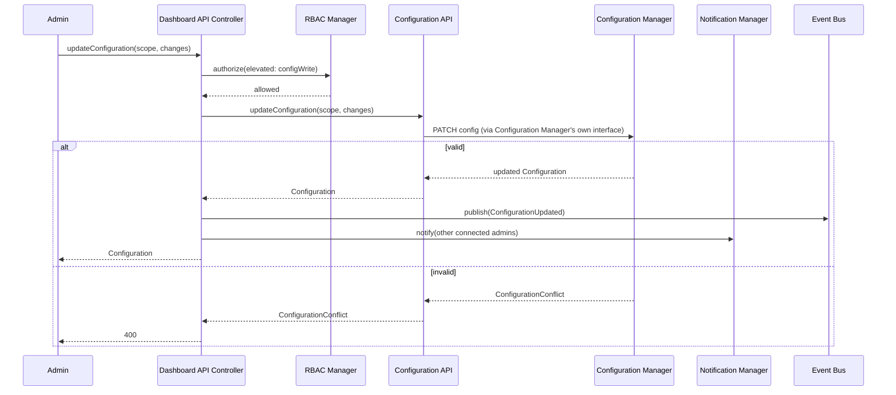

### 7.5 Provider Reload
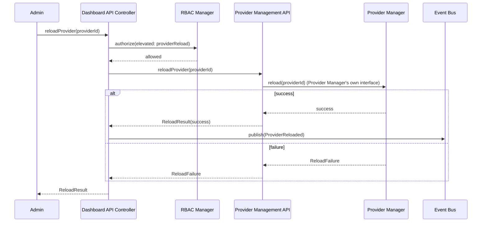

### 7.6 Plugin Reload
Identical pattern to §7.5, substituting Plugin Management API / Provider Plugin System.

### 7.7 Health Collection
Covered by §7.3 (Health Aggregator's parallel per-module calls with cache-fallback).

### 7.8 Metrics Aggregation
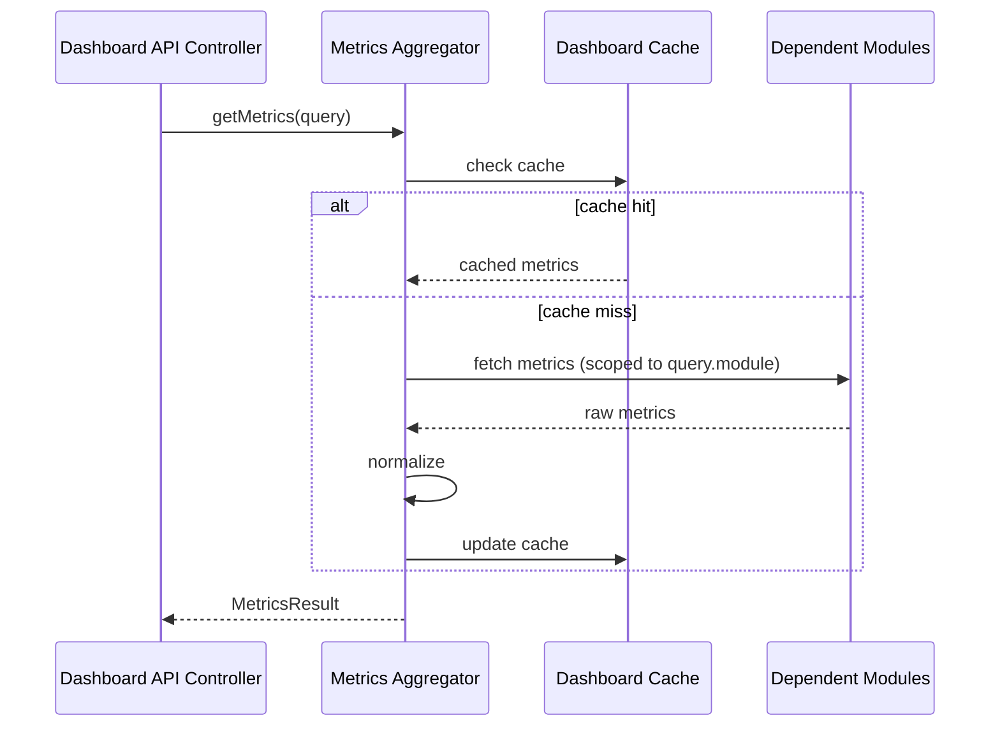

### 7.9 Audit Logging
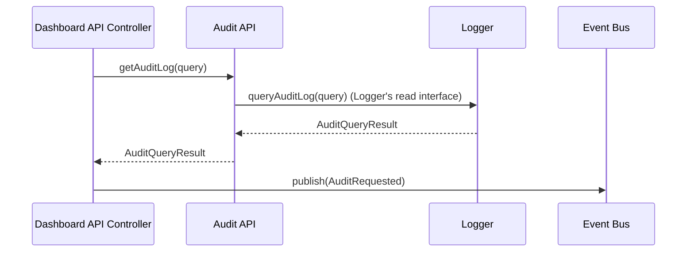

### 7.10 Shutdown
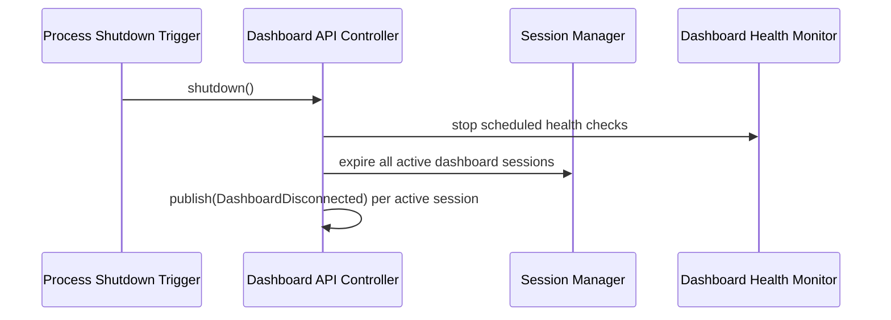

---

## 8. State Management

### Dashboard Session Lifecycle
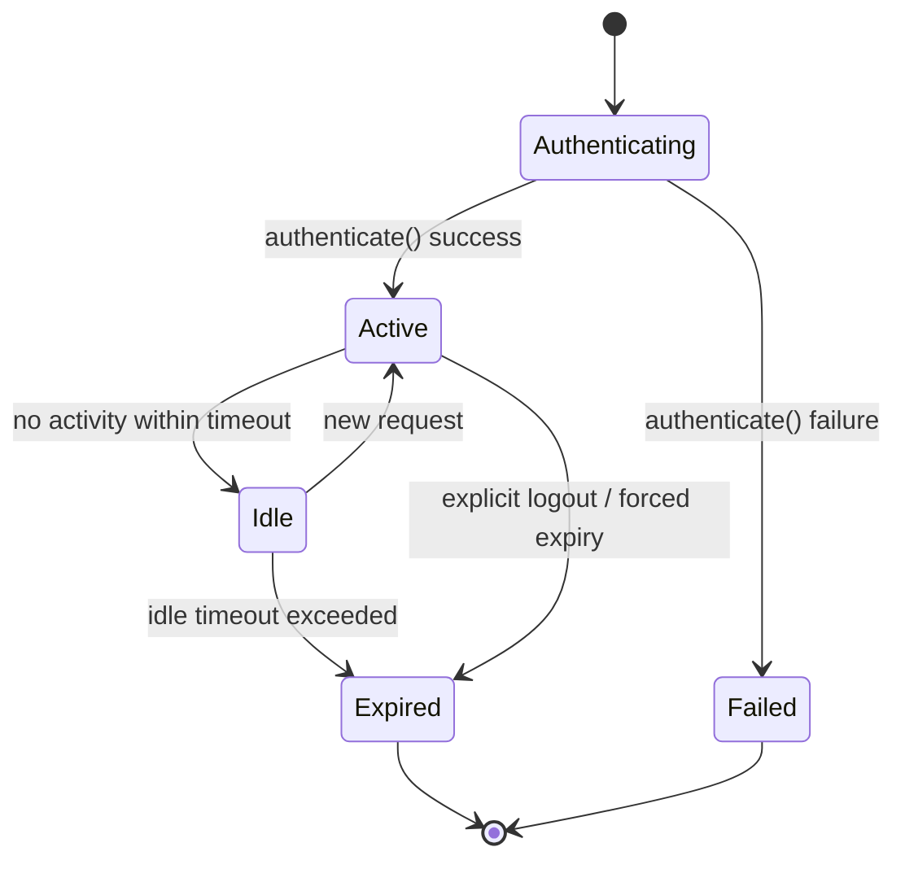

### Administrative Request Lifecycle
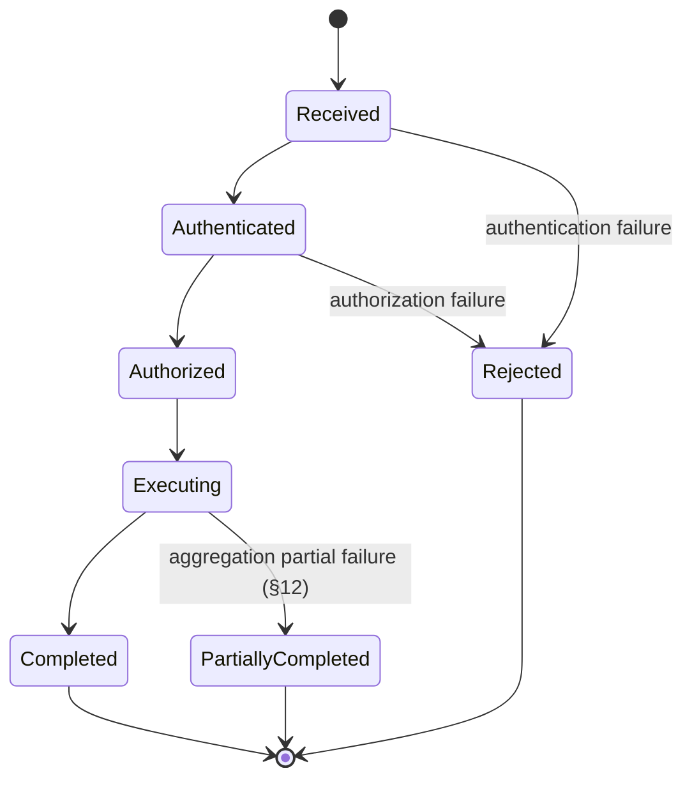

### Cache Lifecycle
Standard TTL-based: `Empty → Populated → Stale (TTL expired) → Refreshed | Evicted`. Always reconstructable from source modules (§16) — never the authoritative source of any data.

### Notification Lifecycle
`Queued → Delivered (to connected clients) → Acknowledged (future WebSocket read-receipt, §22) | Expired (undelivered, TTL-bound, for polling-based clients that never reconnect in time)`.

### Recovery
This module holds durable state only for `DashboardSession` records (via a repository port) and administrative-action audit trail entries (delegated to Logger, not stored locally); a restart rebuilds Dashboard Cache lazily and requires administrators to re-authenticate if their session store is process-local (mitigated by using a shared/distributed session store per §18 Scalability considerations, consistent with Request Manager MDD §8's identical session-durability pattern).

### Synchronization
Each administrative request is handled independently; no cross-request locking is needed at this module's layer, since it owns no domain data requiring consistency guarantees beyond what each underlying module already provides for its own writes (e.g., Configuration Manager's own optimistic concurrency, DDD §8).

---

## 9. Events

| Event | Publisher | Consumers | Payload | Trigger | Failure Behavior |
|---|---|---|---|---|---|
| `DashboardConnected` | Session Manager (via Dashboard Event Publisher) | Logger, Notification Manager (self, for presence-aware notification) | `{ dashboardSessionId, userId }` | Session established | Non-blocking |
| `DashboardDisconnected` | Session Manager | Logger | `{ dashboardSessionId }` | Session expiry/logout | Non-blocking |
| `AdminAuthenticated` | Dashboard API Controller | Logger, Audit consumers | `{ userId, dashboardSessionId }` | Successful authentication | Non-blocking |
| `AdminAuthorized` | RBAC Manager | Logger, Audit consumers | `{ userId, operation, allowed, reason? }` | Every authorization check (both allowed and denied — denials are audit-significant) | Non-blocking |
| `ConfigurationUpdated` | Administration Coordinator (relaying Configuration Manager's own change) | Logger, Notification Manager, other connected dashboard sessions | `{ scope, changedBy, changeSummary }` | Successful `updateConfiguration` | Non-blocking |
| `ProviderReloaded` | Administration Coordinator | Logger, Dashboard clients | `{ providerId, success }` | `reloadProvider` completion | Non-blocking |
| `PluginReloaded` | Administration Coordinator | Logger, Dashboard clients | `{ pluginId, success }` | `reloadPlugin` completion | Non-blocking |
| `MetricsCollected` | Metrics Aggregator | Logger | `{ module, metricCount, durationMs }` | `getMetrics` completion | Non-blocking |
| `HealthUpdated` | Health Aggregator | Logger, Dashboard clients | `{ overall, changedModules[] }` | Health status change detected since last check | Non-blocking |
| `DashboardNotification` | Notification Manager | Connected dashboard clients (future WebSocket, §22) | `{ notificationId, type, message }` | Any significant administrative event | Non-blocking |
| `AuditRequested` | Audit API | Logger (meta-audit: auditing who accessed audit data) | `{ userId, query }` | Every `getAuditLog` call | Non-blocking |
| `DashboardHealthChanged` | Dashboard Health Monitor | Logger, platform `GET /health` aggregation | `{ status, previousStatus, unreachableModules[] }` | Scheduled health check detects a change | Non-blocking |

All events fire-and-forget, isolated per subscriber, consistent with the platform-wide Event Bus policy (SDD §18).

---

## 10. Dependencies

This module depends **exclusively on the public interfaces** of:

| Module | Purpose of dependency |
|---|---|
| Configuration Manager | Configuration read/write, RBAC policy source |
| Logger | Log/audit query |
| Event Bus | Publish dashboard events, subscribe to platform events for notification triggers |
| Provider Manager | Provider status, reload |
| Browser Automation | Browser pool status |
| Model Registry | Model registry visibility |
| Memory Manager | Memory statistics |
| Knowledge Base | Knowledge statistics |
| Learning Layer | Learning insights |
| Git Manager | Repository status/history |
| Security Layer | Authentication, authorization role resolution, identity store for User Management API |
| Metrics System (the platform's metrics-collection infrastructure underlying every module's own Monitoring section) | Raw metrics source for Metrics Aggregator |

**Never accesses repositories or implementation classes directly** — every single data point exposed by this module traces back to a call against one of the above modules' already-published public interfaces (§6 of each respective MDD), with zero exceptions.

---

## 11. Configuration

| Namespace | Option (examples) | Default | Validation | Constraints / Notes |
|---|---|---|---|---|
| `dashboard.*` | `dashboard.enabled` | `true` | boolean | master toggle |
| `admin.*` | `admin.sessionIdleTimeoutMs` | 1800000 (30 min) | positive integer | mirrors Request Manager MDD §11's session-timeout pattern, applied to administrative sessions instead |
| `authentication.*` | `authentication.mode` | `"apiKey"` | enum: `apiKey`/`oauth`/`serviceToken` | mirrors ASD §6 authentication modes |
| `authorization.*` | `authorization.defaultDeny` | `true` | boolean | fail-closed posture — an operation with no matching RBAC rule is denied, never allowed by default |
| `notifications.*` | `notifications.enabled` | `true` | boolean | toggles Notification Manager delivery |
| `cache.*` | `cache.healthTtlMs` | 5000 | positive integer, deliberately short | administrators expect near-real-time health |
| `cache.*` | `cache.metricsTtlMs` | 15000 | positive integer | slightly longer, metrics are less time-critical than health |
| `metrics.*` | `metrics.maxTimeRangeMs` | 2592000000 (30 days) | positive integer | caps `getMetrics`/`getLogs`/`getAuditLog` query range to bound retrieval cost (§23) |
| `health.*` | `health.moduleTimeoutMs` | 3000 | positive integer | per-module health-check timeout before marking `unknown` (§12) |
| `audit.*` | `audit.retentionQueryMaxDays` | 90 | positive integer | how far back `getAuditLog` may query without an elevated override |
| `api.*` | `api.paginationDefaultLimit` | 50 | positive integer | consistent with platform-wide pagination convention |
| `rbac.*` | `rbac.roles` | (config-defined role → permission mapping) | schema-validated | the actual RBAC policy data — see §15 |
| `rateLimit.*` | `rateLimit.requestsPerMinutePerAdmin` | 300 | positive integer | prevents a single administrator (or compromised session) from overwhelming underlying modules via aggregated polling |

**Profiles**: `development` relaxes rate limits and shortens session timeouts for faster iteration; `production` enforces the full policy set.

**Environment variables**: `DASHBOARD_ENABLED`, `DASHBOARD_AUTH_MODE`, `DASHBOARD_RATE_LIMIT_PER_MINUTE`.

**Future Dashboard Integration**: this module *is* itself the future dashboard's backend — its own configuration is naturally exposed through the Configuration API (§5.6) for self-administration, with the obvious safeguard that changes to `rbac.*`/`authorization.*` always require the highest privilege tier (§15).

---

## 12. Error Handling

| Failure | Handling |
|---|---|
| Authentication failure | `AuthenticationFailed`, `401`-mapped, no session created |
| Authorization failure | `Unauthorized`, `403`-mapped, `AdminAuthorized(allowed:false)` published for audit visibility |
| Aggregation failure (one module unreachable during a multi-module aggregation, e.g., `getPlatformStatus`) | That module's contribution is marked `unknown`/`unavailable` in the response; the overall call still succeeds with a `partial: true` flag — never an all-or-nothing failure for a read-only aggregation, consistent with this module's tolerance-for-partial-unavailability design goal (§2) |
| Module unavailable (a direct single-module call, e.g., `getProviders` when Provider Manager itself is down) | `ModuleUnavailable`, surfaced distinctly from `Unauthorized`/`InvalidQuery`, with the underlying module name in the error detail for administrator diagnosis |
| Configuration conflict | Propagated verbatim from Configuration Manager's own `ConfigurationConflict`/schema-violation response (ASD §2.6) — this module never reinterprets or masks the underlying validation detail |
| Provider reload failure | Propagated verbatim from Provider Manager's own reload-failure detail |
| Plugin reload failure | Propagated verbatim from Provider Plugin System's own reload-failure detail |
| Timeout (a dependent module call exceeding `health.moduleTimeoutMs` or an equivalent per-call timeout) | Treated identically to Module Unavailable for aggregation purposes (marked `unknown`, does not fail the whole call) |
| **Recovery Strategy** | This module holds minimal durable state (dashboard sessions only, §8); recovery is primarily about Dashboard Cache reconstruction (automatic, lazy) and session re-establishment (mitigated via a shared session store, §18) |
| **Retry Strategy** | No automatic retry for read aggregation calls (a failed/timed-out module contribution is simply marked unavailable, not retried within the same request — the next poll will naturally retry); administrative *write* operations (configuration update, reload) are never auto-retried by this module, mirroring Git Manager MDD §12's identical no-blind-retry rationale for operations with side effects |
| **Fallback Strategy** | Dashboard Cache serves the last-known-good value for a read view when the live aggregation call fails entirely, clearly flagged as `stale` with a timestamp, rather than returning nothing |

---

## 13. Logging

| Log type | Content |
|---|---|
| Administrative operations | Every `Administration Coordinator`-routed call, `userId`/`dashboardSessionId` correlated |
| Authentication | Every `authenticate()` attempt (success and failure) |
| Authorization | Every `authorize()` check (allowed and denied) — denials always logged regardless of debug mode |
| Configuration changes | Every `updateConfiguration` call, with before/after summary (not full secret values) |
| Provider management | Every `reloadProvider` call and outcome |
| Plugin management | Every `reloadPlugin` call and outcome |
| Dashboard requests | General request/response logging at info level, full payload at debug level only |
| Audit | Meta-audit of audit-log access itself (`AuditRequested`) |
| Performance | Aggregation latency per `getPlatformStatus`/`getMetrics` call, broken down by contributing module |
| Security | Rate-limit violations, repeated authentication failures (potential credential-stuffing signal) |

All log lines carry `userId`, `dashboardSessionId`, `requestId`, `correlationId`, `traceId`, `spanId` per the platform-wide standardized metadata set (Enterprise Dashboard Standards, below).

---

## 14. Monitoring

- **Metrics**: dashboard requests/sec, active administrators (concurrent sessions), API latency (p50/p95/p99), aggregation latency (broken down by contributing module — critical for isolating which underlying module is slow), cache hit rate, failed requests, authentication failures, authorization failures, notification delivery success rate, module availability (per-module reachability over time, feeding capacity/reliability trends).
- **Health Monitoring**: Dashboard Health Monitor's per-module connectivity checks (§5.23) feed both this module's own `health()` response and the platform-wide `GET /health` aggregation.
- **Alerts**: elevated authentication-failure rate (credential-stuffing signal), elevated authorization-denial rate (misconfigured RBAC or a probing actor), sustained module unavailability, aggregation latency regression.

---

## 15. Security

- **RBAC**: every operation in §6 has an associated required permission, resolved against the administrator's roles (`rbac.*` config, §11); default-deny posture (§11 `authorization.defaultDeny`) — an operation with no explicit permission grant is never implicitly allowed.
- **Authentication**: delegated entirely to the Security Layer (this module never stores or verifies credentials itself), supporting the same authentication modes described in the ASD (§6): API keys, OAuth (future), service tokens (future automation API, §22).
- **Authorization**: enforced at the Dashboard API Controller boundary before any request reaches the Administration Coordinator — no component downstream of the controller ever needs to re-check authorization for the same request (single enforcement point, consistent with the platform-wide pattern of centralizing access checks rather than scattering them, e.g., Knowledge Base MDD §17).
- **Session management**: dashboard sessions are distinct from platform end-user sessions (§5.19); idle-timeout and explicit-logout expiry (§8).
- **CSRF protection**: standard anti-CSRF token requirement for any state-mutating dashboard operation reached via a browser-based future web dashboard client (§22) — API-key/service-token-authenticated automation clients are exempt, consistent with standard CSRF-applies-to-cookie-based-auth practice.
- **Rate limiting**: per-administrator request-rate limits (§11 `rateLimit.*`) protect underlying modules from being overwhelmed by aggregated dashboard polling, especially at scale (many concurrent administrators).
- **Audit logging**: every authentication, authorization decision (including denials), configuration change, and administrative mutation is unconditionally audit-logged (§13), plus meta-audit of audit-log access itself (§9 `AuditRequested`).
- **Permission validation**: RBAC Manager validates not just "does this role have this permission" but also tenant/organization scope — an administrator scoped to Organization A can never read or mutate Organization B's data through this module, mirroring the platform-wide namespace-isolation principle (Knowledge Base MDD §17, DDD §19).
- **Sensitive data masking**: configuration secrets are always redacted in `getConfiguration` responses (consistent with Configuration Manager's own redaction convention, DDD §10/§19); this module never un-redacts what an underlying module has already chosen to redact.
- **Tenant isolation**: every aggregated view (metrics, logs, events, statistics) is implicitly scoped to the requesting administrator's authorized tenant/organization/project set — cross-tenant aggregation is never silently permitted, only available to a distinct, explicitly-elevated "platform operator" role if the deployment configures one.
- **Administrative approval workflows**: high-impact operations (e.g., a `reset`-mode Git rollback trigger, if ever exposed here — currently explicitly not exposed per §4/§5.15) are designed to support a future two-person-approval workflow extension without a structural change, by virtue of every mutating operation already flowing through a single, well-defined Administration Coordinator sequencing point where an approval-gate step could be inserted.

---

## 16. Performance

- **Caching**: Dashboard Cache (§5.22) with deliberately short, view-specific TTLs (§11) — health cached shortest, metrics slightly longer, since administrators' tolerance for staleness differs by view type.
- **Aggregation optimization**: Health Aggregator and Metrics Aggregator issue per-module calls in parallel (not sequentially), bounding total aggregation latency to roughly the slowest single module's response time rather than the sum of all modules' response times.
- **Lazy loading**: detailed per-item data (e.g., full log line content, full audit record detail) is not included in list/summary views by default — summary views return references, full detail is fetched via a distinct call, mirroring the DDD §18 lazy-loading pattern.
- **Pagination**: cursor-based pagination for logs, events, and audit records (§6.4, §6.5, §6.16), consistent with the platform-wide convention (DDD §10) — offset pagination is never used given the potentially large underlying volume (DDD §21 millions/billions-scale data).
- **Streaming updates**: current design is polling-based (client calls `getHealth`/`getMetrics` on an interval); WebSocket/event-streaming live updates are explicitly deferred to Future Expansion (§22) rather than built into the initial design, keeping the initial implementation simpler while the architecture (Dashboard Event Publisher, §5.21) already anticipates the extension.
- **Concurrent administrators**: this module's stateless-per-request design (aside from session state, §8) means concurrent administrators impose load proportional to their aggregate request rate, bounded by per-administrator rate limiting (§15) — no shared mutable state creates contention between concurrent administrator sessions.
- **Scalability**: horizontally scalable like every other stateless platform module (mirrors Request Manager MDD §16, Review Engine MDD §18) given a shared session store and shared Dashboard Cache backend.
- **Memory usage**: this module holds no large in-memory datasets — every aggregation is computed fresh (or served from the shared Dashboard Cache) per request, never accumulated in process memory beyond a single request's scope.

---

## 17. Data Flow

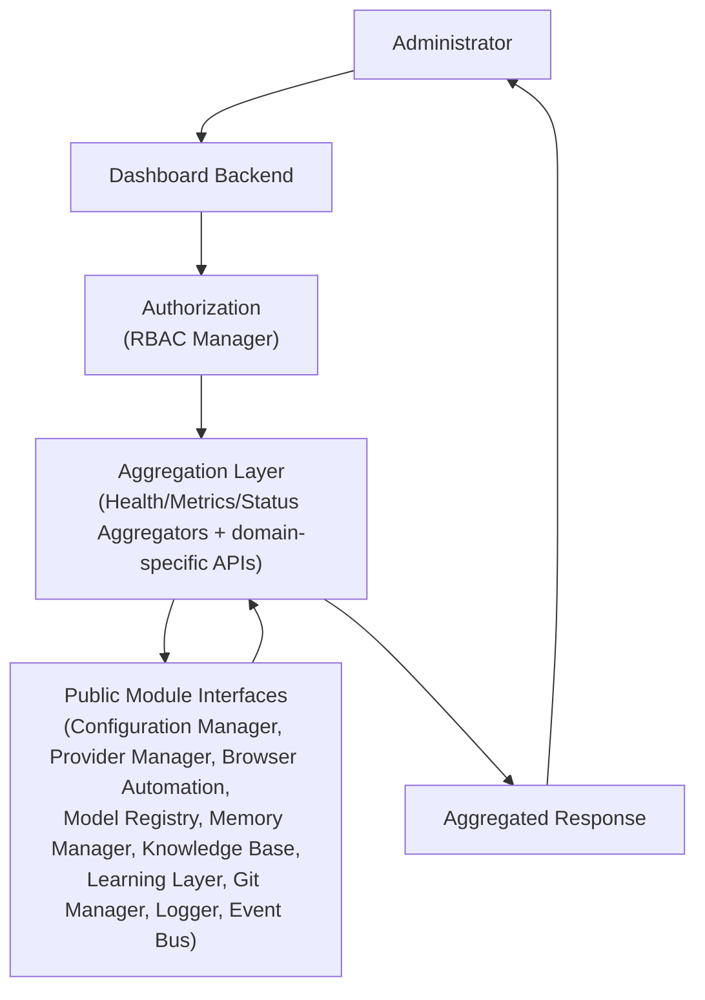

This mirrors the exact stage sequence specified: Administrator → Dashboard Backend → Authorization → Aggregation Layer → Public Module Interfaces → Aggregated Response.

---

## 18. Interaction With Other Modules

The Dashboard Backend interacts **only through public interfaces** with every dependent module. Representative interaction patterns (full call shapes already specified per §6/§7):

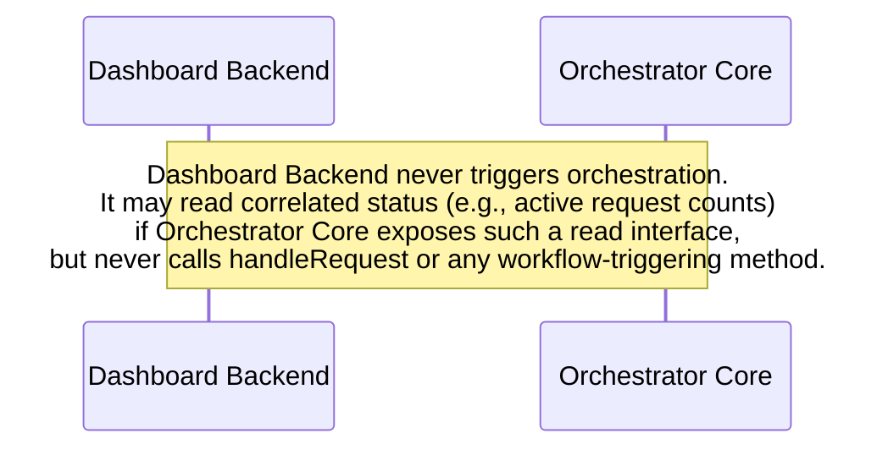

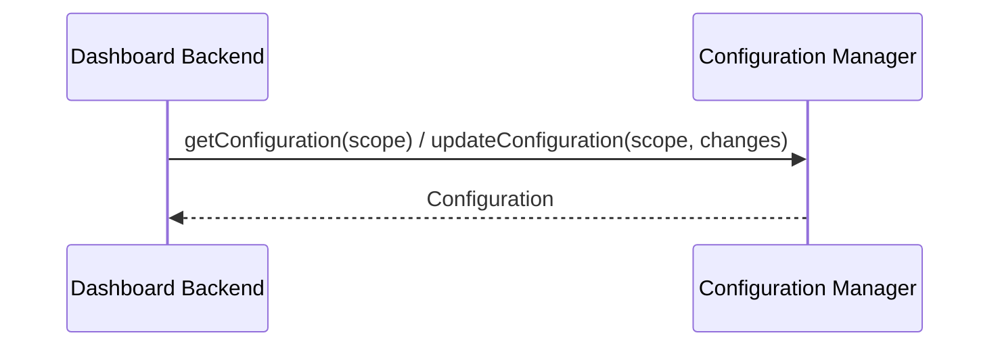

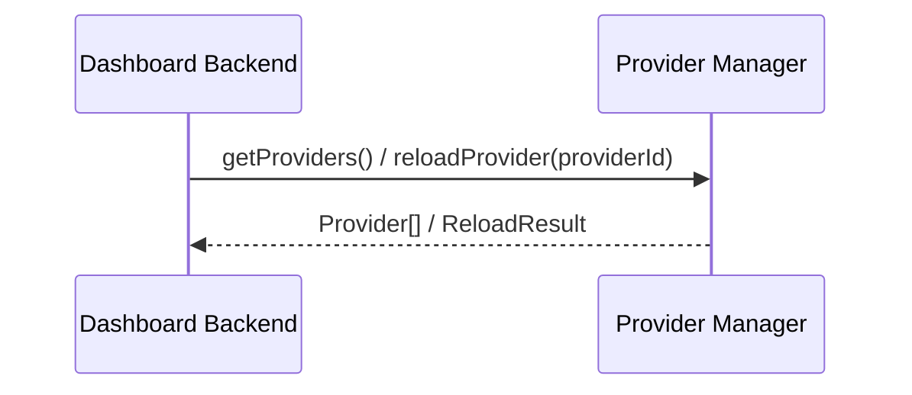

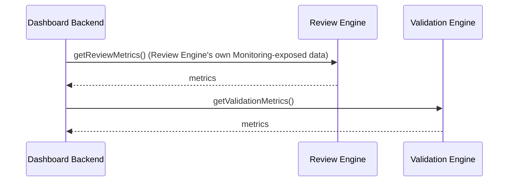

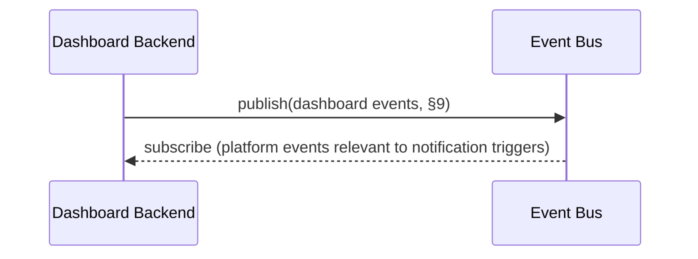

**Boundary statement**: it must never bypass module boundaries — every single interaction above is a call against an already-published public interface documented in that module's own MDD, with zero direct repository, cache, or internal-component access.

---

## 19. Folder Structure

```
dashboard-backend/
  application/
    dashboard-api-controller/       # §5.1
    administration-coordinator/      # §5.2
    health-aggregator/                # §5.3
    metrics-aggregator/                # §5.4
    status-aggregator/                  # §5.5
    configuration-api/                   # §5.6
    provider-management-api/              # §5.7
    plugin-management-api/                 # §5.8
    browser-management-api/                 # §5.9
    model-registry-api/                      # §5.10
    routing-policy-api/                       # §5.11
    memory-api/                                # §5.12
    knowledge-api/                              # §5.13
    learning-api/                                # §5.14
    git-api/                                      # §5.15
    audit-api/                                     # §5.16
    user-management-api/                            # §5.17
    rbac-manager/                                    # §5.18
    session-manager/                                  # §5.19
    notification-manager/                              # §5.20
    dashboard-event-publisher/                          # §5.21
    dashboard-cache/                                      # §5.22
    dashboard-health-monitor/                              # §5.23
  domain/
    entities/                    # DashboardSession, AuthorizationResult, PlatformStatus, PlatformHealth
    ports/
      configuration-manager-port/
      logger-port/
      event-bus-port/
      provider-manager-port/
      browser-automation-port/
      model-registry-port/
      memory-manager-port/
      knowledge-base-port/
      learning-layer-port/
      git-manager-port/
      security-layer-port/
      metrics-system-port/
      dashboard-session-repository-port/
      cache-port/
  infrastructure/
    rate-limiter/                  # §15/§11 rateLimit.* enforcement
  config/
    schema.*                        # dashboard.*, admin.*, authentication.*, authorization.*,
                                     # notifications.*, cache.*, metrics.*, health.*, audit.*, api.*, rbac.*, rateLimit.*
  tests/
    unit/
    integration/
    contract/
    authentication/
    authorization/
    api/
    aggregation/
    performance/
    security/
    recovery/
```

---

## 20. File Responsibilities

| File (conceptual) | Purpose | Public API | Private Logic | Dependencies |
|---|---|---|---|---|
| `dashboard-api-controller.*` | §5.1 | all of §6 | request parsing, delegation | SessionManager, RBACManager, AdministrationCoordinator |
| `administration-coordinator.*` | §5.2 | (internal) | multi-step workflow sequencing | every domain-specific API component below |
| `health-aggregator.*` | §5.3 | (internal, exposed via `getHealth`) | parallel per-module health calls, partial-failure tolerance | every module port, DashboardCache |
| `metrics-aggregator.*` | §5.4 | (internal, exposed via `getMetrics`) | metric normalization | every module port, DashboardCache |
| `status-aggregator.*` | §5.5 | (internal, exposed via `getPlatformStatus`) | composition | HealthAggregator, MetricsAggregator |
| `configuration-api.*` | §5.6 | `getConfiguration`, `updateConfiguration` | thin delegation | ConfigurationManagerPort |
| `provider-management-api.*` | §5.7 | `getProviders`, `reloadProvider` | thin delegation | ProviderManagerPort |
| `plugin-management-api.*` | §5.8 | `getPlugins`, `reloadPlugin` | thin delegation | ProviderPluginSystemPort |
| `browser-management-api.*` | §5.9 | `getBrowserPools` | thin delegation | BrowserAutomationPort |
| `model-registry-api.*` | §5.10 | `getModelRegistry` | thin delegation | ModelRegistryPort |
| `routing-policy-api.*` | §5.11 | `getRoutingPolicies` | thin delegation | RouterPort |
| `memory-api.*` | §5.12 | `getMemory` | thin delegation | MemoryManagerPort |
| `knowledge-api.*` | §5.13 | `getKnowledge` | thin delegation | KnowledgeBasePort |
| `learning-api.*` | §5.14 | `getLearning` | thin delegation | LearningLayerPort |
| `git-api.*` | §5.15 | Git status/history read methods | thin delegation | GitManagerPort |
| `audit-api.*` | §5.16 | `getAuditLog` | query composition | LoggerPort |
| `user-management-api.*` | §5.17 | admin user CRUD | delegation | SecurityLayerPort |
| `rbac-manager.*` | §5.18 | `authorize` | permission evaluation | SecurityLayerPort, ConfigurationManagerPort |
| `session-manager.*` | §5.19 | `authenticate` | session lifecycle | SecurityLayerPort, DashboardSessionRepositoryPort |
| `notification-manager.*` | §5.20 | (internal) | notification composition | DashboardEventPublisher |
| `dashboard-event-publisher.*` | §5.21 | (internal) | event mapping | EventBusPort |
| `dashboard-cache.*` | §5.22 | (internal) | TTL/invalidation | CachePort |
| `dashboard-health-monitor.*` | §5.23 | `health` | scheduled connectivity checks | every module port |

---

## 21. Testing Strategy

- **Unit Tests**: each §5 component in isolation — RBAC Manager's permission evaluation logic, Health Aggregator's partial-failure tolerance, Dashboard Cache TTL behavior.
- **Integration Tests**: full request flows (§7) against test-double implementations of every dependent module's port.
- **Contract Tests**: verify this module calls every dependent module's public interface exactly as that module's own MDD specifies — since this module has zero tolerance for interface drift given its explicit "public interfaces only" mandate.
- **Authentication Tests**: valid/invalid credential flows, session expiry, re-authentication.
- **Authorization Tests**: exhaustive RBAC rule coverage — every role/operation/tenant-scope combination relevant to the deployed policy set, plus the default-deny fail-closed behavior explicitly verified for undefined combinations.
- **API Tests**: schema conformance for every public interface (§6) request/response shape.
- **Aggregation Tests**: partial-module-unavailability scenarios verified to produce `partial: true` results rather than total failure (§12).
- **Performance Tests**: aggregation latency under many concurrent administrators and many dependent modules, validating the parallel-call strategy (§16).
- **Security Tests**: rate-limit enforcement, CSRF protection (for the future web-dashboard client path), tenant-isolation boundary verification (an Org A admin genuinely cannot read Org B data).
- **Recovery Tests**: process restart with active dashboard sessions, verifying session re-establishment via the shared session store and Dashboard Cache reconstruction.

---

## 22. Future Expansion

- **Web dashboard**: this module's entire API surface (§6) is already the complete backend contract a future web UI would consume — no backend change required to add a UI, only a new frontend client.
- **Mobile administration**: identical API surface, a different client — the authentication modes (§15) already anticipate token-based mobile-friendly auth.
- **Remote management / Cluster administration / Multi-region control plane**: this module's stateless-per-request design (§16 Scalability) already supports horizontal scaling; multi-region aggregation is an additive Status/Health Aggregator capability (aggregating across regional Dashboard Backend instances) rather than a structural change.
- **Multi-tenant administration**: already a first-class design property (§15 Tenant isolation) — a "platform operator" cross-tenant role is an additive RBAC configuration entry, not a code change.
- **Live dashboards / WebSocket/event streaming**: Dashboard Event Publisher (§5.21) is already the architectural seam — adding a WebSocket push transport alongside the existing Event Bus publication is additive, not a redesign.
- **Automation APIs**: the same authenticated interface (§6) already serves this use case; a dedicated service-token authentication mode (§11 `authentication.mode: serviceToken`) is the only addition needed.
- **Administrative scripting**: a natural consequence of the Automation API above — no further architectural work required.

All of the above are additive to existing interfaces/configuration, never a modification of the core aggregation/delegation pattern established in §5–§7, satisfying the Open/Closed requirement consistent with every other module MDD in this platform.

---

## 23. Risks

| Risk | Category | Mitigation |
|---|---|---|
| Excessive privilege exposure (a role accidentally granted broader access than intended) | Security | Default-deny RBAC posture (§11, §15) means any missing/misconfigured rule fails safe (denies), not open |
| Unauthorized configuration changes | Security | Elevated authorization tier specifically for `updateConfiguration`/`reloadProvider`/`reloadPlugin` (§7.4, §7.5), distinct from general read permissions |
| Aggregation bottlenecks (a slow module dragging down every aggregated view that includes it) | Performance | Parallel per-module calls with a bounded per-module timeout (§11 `health.moduleTimeoutMs`) prevent one slow module from stalling the whole aggregation |
| Module unavailability cascading into dashboard unavailability | Architecture / Reliability | Partial-failure tolerance is a first-class design property (§12), not an afterthought — this module's own availability is deliberately decoupled from any single dependent module's availability |
| Dashboard Backend becoming tightly coupled to internals (a future engineer reaching past a module's public interface "just this once" for a needed field) | Architecture / Maintenance | Contract Tests (§21) specifically catch interface-boundary violations; the "public interfaces only" mandate is stated explicitly and repeatedly throughout this document (§4, §10, §18) as a load-bearing constraint |
| Information leakage (cross-tenant data exposure, secret exposure in configuration views) | Security | Tenant isolation (§15) and secret redaction (§15, inherited from Configuration Manager's own convention) enforced structurally, not left to individual API component discipline |
| Large-scale metrics/log/audit retrieval overwhelming underlying storage | Performance / Scalability | `metrics.maxTimeRangeMs` and cursor-based pagination (§11, §16) bound query cost; this mirrors the platform-wide DDD §18 performance strategy applied at this module's aggregation boundary |

---

## 24. Design Decisions

| Decision | Rationale | Alternatives Considered | Trade-off |
|---|---|---|---|
| Dashboard Backend calls every dependent module exclusively through its public interface, with zero direct repository/internal access, even at the cost of some duplicated read-shaping logic | This is the single most important architectural property of this module — an administration layer with backdoor access to internals would undermine every other module's own encapsulation guarantees | Direct repository access for read-heavy aggregation views, for performance | Rejected outright — the performance cost of going through public interfaces is bounded and manageable (§16 parallel aggregation, caching), while the architectural cost of a backdoor is unbounded and platform-wide |
| Partial-failure tolerance for read aggregation, but zero tolerance (no partial-success) for write operations (configuration update, reloads) | Reads benefit from "some data is better than none"; writes must never partially apply in a way that leaves ambiguous state — this asymmetry is intentional | Uniform all-or-nothing behavior for both reads and writes | A uniform policy would either make routine dashboard viewing overly fragile (any one module hiccup blanks the whole dashboard) or risk unsafe partial writes — the asymmetric policy matches each operation type's actual risk profile |
| Dashboard sessions modeled as a distinct entity from platform end-user Sessions (DDD §6.2) | An administrative session and an AI-chat conversation session are semantically unrelated; conflating them would force irrelevant fields onto one or both entities | Reusing the platform Session entity for administrative access too | A single Session entity would need to awkwardly support two very different lifecycles and permission models; a distinct `DashboardSession` keeps both clean, mirroring Request Manager MDD's own Session/Request separation rationale (Request Manager MDD §24) |
| No streaming/WebSocket support in the initial design, despite being an obvious eventual need | Keeps the initial implementation's surface area smaller and fully testable with standard request/response patterns; the Dashboard Event Publisher (§5.21) is deliberately positioned as the seam for this extension | Building WebSocket support into v1 | Slightly less real-time responsiveness initially (polling-based), in exchange for a simpler, more thoroughly-testable initial module and a clean, already-anticipated extension path (§22) |
| RBAC policy precedence and default-deny posture modeled identically to the platform's other policy-governed modules (Review Engine, Validation Engine, Capability Selector, Git Manager) | Consistency across every access-control decision point in the platform reduces cognitive and operational overhead, and default-deny is the only safe posture for an administration/control-plane API specifically | An independently-designed RBAC model unique to this module | None significant — the underlying problem (who can do what, scoped to what tenant) is structurally identical to already-solved cases, and this module's elevated sensitivity (it can *mutate* configuration and trigger reloads) makes reusing a proven, audited pattern especially valuable |

---

## 25. Diagrams (Consolidated Reference)

**Component Diagram** — see §5.
**Sequence Diagram** — see §7, §18.
**State Diagram** — see §8.
**Data Flow Diagram** — see §17.
**Class Diagram (conceptual)**
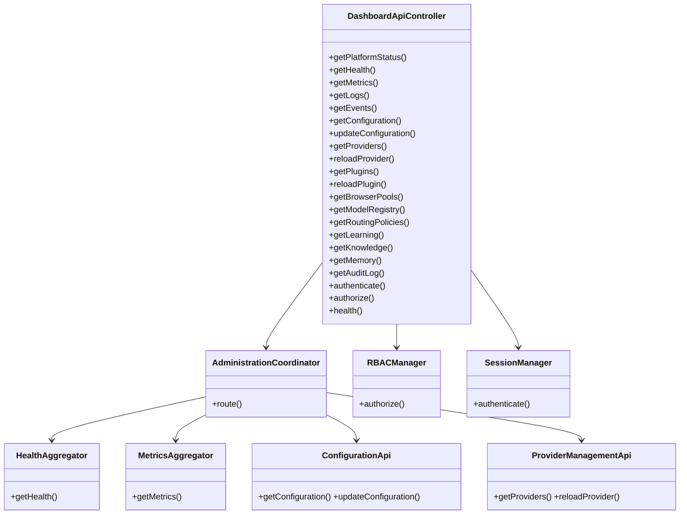
**Folder Structure Diagram** — see §19.

---

## Enterprise Dashboard Standards

Every entity and operation in this module supports the platform's standardized identifiers: `dashboardSessionId`, `adminSessionId`, `requestId`, `userId`, `roleId`, `organizationId`, `tenantId`, `projectId`, `correlationId`, `traceId`, `spanId`. These flow through every event (§9) and log line (§13) uniformly.

The module exposes, exclusively through existing module APIs (never direct access): platform health, module health, metrics, logs, events, configuration, providers, plugins, browser pools, routing policies, learning insights, Git status, audit records.

---

## Architectural Constraints (Explicit Statement)

- The Dashboard Backend **is a control plane, not a business plane** — it administers and observes; it never participates in the platform's actual AI-orchestration request/response path.
- It **never contains orchestration logic** — no component in §5 sequences AI provider calls, planning, or routing decisions.
- It **never bypasses public module interfaces** — every data point and every mutation flows through an already-published interface from another module's own MDD (§10, §18).
- It **never accesses repositories directly** — no component in this module holds a direct dependency on Operational Storage, Knowledge & Memory Storage, Artifact Storage, or any other DDD storage domain; all access is mediated by the owning module.
- It **never executes provider, browser, planner, or routing logic** — it reads status from and, for a narrow set of operations, triggers reloads/updates through Provider Manager, Browser Automation, Planner-adjacent, and Router-adjacent interfaces, but never performs their work itself.
- **All state mutations occur through the owning module's public API** — this module's own Administration Coordinator (§5.2) is a pure sequencing layer with zero independent write capability to any other module's domain data.
- **It aggregates and exposes operational information without duplicating business logic** — every aggregation/normalization step in §5.3/§5.4 reshapes data for presentation, it never recomputes a business decision an owning module has already made.

---

*End of document.*
