# Module Design Document (MDD)
## Git Manager

**Version:** 1.0
**Status:** Draft for engineering review
**Companion to:** SDD v1.0, API Specification v1.0, Database Design Document v1.0, and all prior module MDDs (Orchestrator Core, Request Manager, Planner, Task Queue, Router, Provider Manager, Event Bus, Configuration Manager, Logger, Memory Manager, Knowledge Base, Review Engine, Validation Engine, Browser Automation)

---

## 1. Executive Summary

### Purpose
The Git Manager is the platform's **version control orchestration layer**. It is not a Git library wrapper — it coordinates repository operations (init, status, branch, commit, merge, tag, stash, rollback, snapshot) through an abstract Git Provider interface, exposing a stable, provider-independent contract to every other module that needs repository awareness or repository-affecting actions.

### Responsibilities
Repository lifecycle management, branch/commit/tag/merge/stash/rollback coordination, workspace inspection, diff/history generation, repository context for AI modules, policy-driven commit workflows — and nothing about *what* changes should be made to files, *whether* a change is good, or *when* orchestration should trigger a Git operation.

### Architectural Role
The Git Manager sits beside Memory Manager, Knowledge Base, and Browser Automation as a **capability provider** invoked by orchestration-level modules (primarily the Orchestrator Core and, indirectly, the Planner via task annotations) — it never initiates orchestration itself, never decides *when* to commit, and never edits file content. It is a coordination and abstraction layer over Git operations, not a decision-maker about repository content.

### Module Boundaries
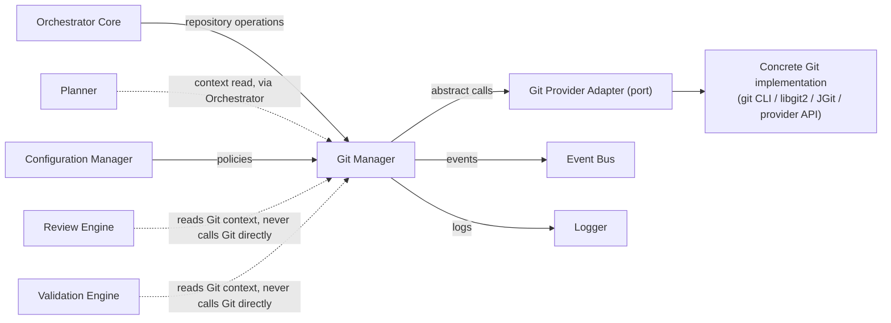

---

## 2. Goals

### Primary Goals
- Provide a complete repository abstraction: every Git concept (repository, branch, commit, tag, merge, stash, snapshot) is exposed as a stable domain entity and operation, independent of the underlying Git implementation.
- Manage the full repository lifecycle: initialize, open, inspect, mutate (commit/branch/merge/tag), snapshot, roll back, close.
- Support policy-driven commit workflows (e.g., mandatory commit message format, mandatory pre-commit validation gate references) without embedding business/workflow logic in this module.
- Publish a complete Git lifecycle event catalog so other modules (Memory Manager, Dashboard Backend, Learning Layer) can react to repository changes without polling.
- Remain provider-independent: swapping the underlying Git implementation (git CLI, libgit2, JGit, Dulwich, Rugged, or a hosted provider's API) requires zero change to any component above the Git Provider Adapter port.

### Secondary Goals
- Provide repository context (current branch, dirty-file list, recent commit summary) to AI modules (Planner, Memory Manager) as read-optimized, cache-friendly data.
- Support diff generation and change tracking at both file and repository granularity.
- Support workspace validation (detect corruption, uncommitted-state conflicts) before risky operations.

### Non-Goals
- The Git Manager never performs planning, routing, provider (AI model) execution, browser automation, memory management, knowledge management, code review, or code validation. It never executes Git CLI commands directly from business logic (all Git execution happens behind the Git Provider Adapter port). It never contains workflow logic (deciding *when* to commit is an orchestration decision, not this module's). It never owns project state (Project entity lifecycle belongs to the DDD's Project-owning module) — it owns *repository* state, a related but distinct concept.

### Design Constraints
- Must depend only on the Git Provider Interface (port) for actual Git operations — never on a specific library or CLI directly.
- Must be safe under concurrent access to the same repository (multiple callers requesting status/operations against one workspace).
- Must treat repository state as independent of business/orchestration state — a Git Manager restart must never lose or corrupt repository data, since the repository itself (via the provider adapter) is the source of truth, not this module's in-memory state.

### Future Goals
- Multi-repository and monorepo support (§22).
- Remote Git provider integrations (GitHub, GitLab, Azure DevOps, Bitbucket) as additional adapter implementations.
- Signed commits, protected branches, Git hooks, pull request integration, AI-assisted commit message generation, repository federation.

---

## 3. Responsibilities

### Must Have
- Initialize and open repositories, registering them in a Repository Registry for lookup by other modules.
- Provide repository status (current branch, dirty files, staged/unstaged changes) and diffs (working tree, staged, commit-to-commit).
- Coordinate commit creation, including policy-driven validation of commit metadata (message format, required references) before delegating to the provider adapter.
- Coordinate branch lifecycle: create, checkout, delete, list.
- Coordinate merge operations, including conflict detection and structured conflict reporting (not resolution — resolution is a business decision made by whatever caller requested the merge).
- Coordinate tag creation and listing.
- Coordinate stash operations (save/apply/drop).
- Coordinate rollback operations (revert to a prior commit/snapshot) with safety checks (§12).
- Provide repository history (commit log) with pagination.
- Support repository snapshots (a named, restorable point-in-time reference distinct from a commit — see §8).
- Validate workspace integrity before risky operations (merge, rollback, snapshot restore).
- Publish the full Git lifecycle event catalog (§9).

### Should Have
- Cache repository status/diff results with short TTL and change-triggered invalidation (§16).
- Support policy-based commit workflows referencing external validation gate results (e.g., "block commit unless the associated Task's Validation Report passed") — the Git Manager reads and enforces the policy reference, it does not itself perform validation.
- Support incremental workspace scanning for large repositories (§16).

### Future Responsibilities
- Multi-repository coordination within a single logical project (monorepo-aware operations).
- Remote provider operations (push/pull/PR creation) via additional adapter implementations.
- AI-assisted commit message generation (as an optional policy-invoked enrichment, not a core responsibility).

---

## 4. Scope

### Owns
Repository coordination, Repository state (as reflected by the provider, cached read-side by this module), Branch lifecycle, Commit lifecycle, Tag lifecycle, Diff orchestration, Workspace inspection, Repository metadata, Git event publication, Repository policies (enforcement — not authoring, which is Configuration Manager's).

### Never Owns
Code generation, Code review, Validation (structural or quality), Planning, Routing, Provider (AI model) execution, File editing (the Git Manager coordinates commits of changes that already exist on disk — it never writes file content itself), Business workflows.

### Other Module Responsibilities (explicit separation)
| Module | Owns instead |
|---|---|
| Orchestrator Core | Decides *when* to invoke a Git Manager operation as part of a workflow stage; owns the orchestration sequencing, not this module |
| Planner | Owns task objectives that may *reference* expected repository changes; never calls Git Manager directly (reads Git context only via Orchestrator Core-mediated calls, per §18) |
| Review Engine | Reads Git context (e.g., diff content as evidence, §Review Engine MDD §5.6 Evidence Collector) for its own quality assessment; never performs Git operations itself |
| Validation Engine | Reads Git context (e.g., contract validation against expected file changes) for its own correctness verification; never performs Git operations itself |
| Memory Manager | May store repository context (current branch, recent commit summary) as part of session/project memory; the Git Manager provides that context, Memory Manager decides whether/how to remember it |
| Knowledge Base | Unrelated — no direct interaction; a "Git Metadata" artifact type exists in the DDD (§15) for large diff bodies referenced by Review/Validation, populated via Artifact Storage, not via a Knowledge Base call from this module |
| Configuration Manager | Owns the authored policy definitions (commit message format, required gates); the Git Manager only reads and enforces them |

---

## 5. Internal Architecture

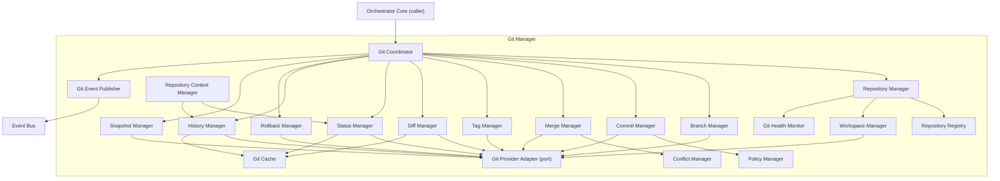

### 5.1 Git Coordinator
- **Purpose**: Single orchestration point for every public-interface call (§6); sequences calls to the appropriate manager component.
- **Responsibilities**: request routing, cross-component sequencing (e.g., a commit workflow touching Workspace Manager → Policy Manager → Commit Manager → Git Event Publisher).
- **Interfaces**: implements all of §6.
- **Dependencies**: every other component in this module.
- **Internal communication**: direct synchronous calls to injected components; delegates event emission to Git Event Publisher.
- **Lifecycle**: stateless, one execution context per call.

### 5.2 Repository Manager
- **Purpose**: Own repository initialization, opening, closing, and registration.
- **Responsibilities**: coordinate Repository Registry entries; delegate actual repository-level provider calls to the Git Provider Adapter.
- **Inputs**: repository path/identifier, initialization options.
- **Outputs**: `Repository` entity (§8/§9).
- **Dependencies**: Repository Registry, Workspace Manager, Git Provider Adapter, Git Health Monitor.
- **Lifecycle**: stateless per call; the `Repository` entity it produces is what carries state, not this component.

### 5.3 Repository Registry
- **Purpose**: In-process lookup table of currently-open repositories, keyed by `repositoryId`.
- **Responsibilities**: register/deregister repositories; resolve a `repositoryId` to its handle for other components.
- **Inputs**: `repositoryId`, `Repository` handle.
- **Outputs**: `Repository` handle on lookup.
- **Dependencies**: none external (in-memory registry, reconstructable from durable repository-path configuration on restart — see §8 Recovery).
- **Lifecycle**: stateful for the process's lifetime, but never the authoritative source of repository *content* (the provider/filesystem is).

### 5.4 Repository Context Manager
- **Purpose**: Assemble the read-optimized "repository context" bundle (current branch, dirty-file summary, recent commit summary) consumed by AI modules (Planner, Memory Manager, via Orchestrator Core).
- **Responsibilities**: compose Status Manager + History Manager output into a single, cache-friendly context object.
- **Inputs**: `repositoryId`.
- **Outputs**: `RepositoryContext { branch, dirtyFiles[], recentCommits[] }`.
- **Dependencies**: Status Manager, History Manager, Git Cache.
- **Lifecycle**: stateless per call.

### 5.5 Workspace Manager
- **Purpose**: Inspect and validate the on-disk workspace associated with a repository.
- **Responsibilities**: scan for uncommitted changes, detect workspace corruption (e.g., a `.git` directory in an inconsistent state), validate workspace readiness before risky operations (§12).
- **Inputs**: `repositoryId`.
- **Outputs**: `WorkspaceValidationResult { valid: bool, issues[] }`.
- **Dependencies**: Git Provider Adapter.
- **Lifecycle**: stateless per call; supports incremental scanning (§16) for large repositories.

### 5.6 Branch Manager
- **Purpose**: Coordinate branch lifecycle operations.
- **Responsibilities**: create, checkout, delete, list branches; enforce policy-driven branch-name/protection rules (read from Policy Manager).
- **Inputs**: `repositoryId`, branch name, source ref.
- **Outputs**: `Branch` entity / operation confirmation.
- **Dependencies**: Git Provider Adapter, Policy Manager.
- **Lifecycle**: stateless per call.

### 5.7 Commit Manager
- **Purpose**: Coordinate commit creation.
- **Responsibilities**: validate commit metadata against Policy Manager rules (message format, required references such as `taskId`/`requestId`); delegate the actual commit operation to the Git Provider Adapter.
- **Inputs**: `repositoryId`, commit message, author metadata, staged-change reference, policy context (`taskId`, `sessionId`, etc.).
- **Outputs**: `Commit` entity (with `commitId`) or `CommitRejected` result.
- **Dependencies**: Git Provider Adapter, Policy Manager, Workspace Manager (pre-commit workspace check).
- **Lifecycle**: stateless per call.

### 5.8 Merge Manager
- **Purpose**: Coordinate merge operations.
- **Responsibilities**: initiate a merge via the provider adapter; detect and structurally report conflicts (via Conflict Manager) rather than resolving them.
- **Inputs**: `repositoryId`, source branch, target branch, merge strategy hint.
- **Outputs**: `MergeResult { success: bool, mergeId, conflicts[]? }`.
- **Dependencies**: Git Provider Adapter, Conflict Manager, Workspace Manager (pre-merge validation).
- **Lifecycle**: stateless per call.

### 5.9 Tag Manager
- **Purpose**: Coordinate tag creation and listing.
- **Responsibilities**: create annotated/lightweight tags per policy; list tags with filtering.
- **Inputs**: `repositoryId`, tag name, target ref, message (if annotated).
- **Outputs**: `Tag` entity.
- **Dependencies**: Git Provider Adapter.
- **Lifecycle**: stateless per call.

### 5.10 Diff Manager
- **Purpose**: Generate diffs (working tree, staged, commit-to-commit).
- **Responsibilities**: compute/request diffs via the provider adapter; format results into the platform's normalized diff shape (independent of provider-native diff formatting).
- **Inputs**: `repositoryId`, diff scope (working/staged/commit range).
- **Outputs**: `Diff { files[], summary }`.
- **Dependencies**: Git Provider Adapter, Git Cache.
- **Lifecycle**: stateless per call.

### 5.11 Status Manager
- **Purpose**: Provide current repository status.
- **Responsibilities**: query the provider adapter for branch/dirty-file state; cache results with short TTL.
- **Inputs**: `repositoryId`.
- **Outputs**: `RepositoryStatus { branch, staged[], unstaged[], untracked[] }`.
- **Dependencies**: Git Provider Adapter, Git Cache.
- **Lifecycle**: stateless per call.

### 5.12 History Manager
- **Purpose**: Provide commit history with pagination.
- **Responsibilities**: query the provider adapter for commit log; support cursor-based pagination (consistent with the platform-wide pagination convention, ASD §2/DDD §10).
- **Inputs**: `repositoryId`, pagination cursor, filter (branch, path, author).
- **Outputs**: `Commit[]`, page info.
- **Dependencies**: Git Provider Adapter, Git Cache.
- **Lifecycle**: stateless per call.

### 5.13 Rollback Manager
- **Purpose**: Coordinate rollback (revert to a prior commit or snapshot).
- **Responsibilities**: validate rollback safety (Workspace Manager check, no uncommitted conflicting changes) before delegating to the provider adapter; support both "revert commit" (new commit undoing changes) and "reset to" (destructive, requires elevated confirmation) modes.
- **Inputs**: `repositoryId`, target ref (commit or snapshot), mode (`revert`/`reset`).
- **Outputs**: `RollbackResult { rollbackId, mode, newHeadRef }`.
- **Dependencies**: Git Provider Adapter, Workspace Manager, Snapshot Manager (if rolling back to a snapshot).
- **Lifecycle**: stateless per call.

### 5.14 Snapshot Manager
- **Purpose**: Create and restore named, point-in-time repository snapshots — a Git Manager-level concept distinct from a raw commit (a snapshot may capture uncommitted workspace state too, not just committed history).
- **Responsibilities**: capture a snapshot (commit ref + optional workspace-state capture); restore a snapshot (checkout + optional workspace-state reapplication).
- **Inputs**: `repositoryId`, snapshot name/label.
- **Outputs**: `Snapshot` entity (`snapshotId`) / restore confirmation.
- **Dependencies**: Git Provider Adapter, Workspace Manager.
- **Lifecycle**: stateless per call; snapshot metadata persisted via Operational Storage (repository entity, distinct from the Git object store itself).

### 5.15 Policy Manager
- **Purpose**: Resolve and enforce repository policies (commit message format, required references, branch protection, merge requirements) — the Git-domain analog of the Review Engine's/Validation Engine's Policy Engine/Policy Validator, following the identical precedence pattern already established platform-wide.
- **Responsibilities**: load policies from Configuration Manager; apply precedence (organization → project → repository-specific); expose a `checkPolicy(operation, context): PolicyResult` used by Commit/Branch/Merge Managers.
- **Inputs**: operation type, operation context.
- **Outputs**: `PolicyResult { allowed: bool, violations[] }`.
- **Dependencies**: Configuration Manager port.
- **Lifecycle**: stateless per call; policy cache refreshed on policy-change notification.

### 5.16 Conflict Manager
- **Purpose**: Structurally report merge conflicts without resolving them.
- **Responsibilities**: parse provider-reported conflict markers/state into the platform's normalized `Conflict` shape.
- **Inputs**: raw provider conflict output.
- **Outputs**: `Conflict[] { filePath, conflictType, ours, theirs }`.
- **Dependencies**: none external.
- **Lifecycle**: stateless per call.

### 5.17 Git Event Publisher
- **Purpose**: Translate Git Manager operations into Event Bus events (§9).
- **Responsibilities**: map every completed operation to its corresponding event and payload.
- **Inputs**: operation result.
- **Outputs**: none directly (publishes to Event Bus).
- **Dependencies**: Event Bus port.
- **Lifecycle**: stateless per call.

### 5.18 Git Cache
- **Purpose**: Cache status/diff/history results with short TTL and invalidation on workspace-changing operations.
- **Responsibilities**: TTL-based caching, explicit invalidation triggered by Commit/Branch/Merge/Rollback Manager completions.
- **Inputs/Outputs**: internal only.
- **Dependencies**: Cache storage domain (DDD §4.6).
- **Lifecycle**: always reconstructable from the provider adapter — a cache miss never produces incorrect results, only added latency.

### 5.19 Git Health Monitor
- **Purpose**: Monitor provider adapter reachability/repository health (e.g., filesystem accessibility, remote connectivity if applicable).
- **Responsibilities**: periodic health checks; feed `RepositoryHealthChanged` events.
- **Inputs**: `repositoryId`.
- **Outputs**: health status.
- **Dependencies**: Git Provider Adapter.
- **Lifecycle**: background/scheduled, independent of individual request-response cycles.

### 5.20 Git Provider Adapter (Port)
- **Purpose**: The Hexagonal Architecture boundary abstracting the concrete Git implementation from every component above it.
- **Responsibilities**: define the full contract (init, status, diff, branch, commit, merge, tag, stash, log, rollback) that any concrete Git implementation adapter must satisfy.
- **Inputs/Outputs**: implementation-agnostic Git operation contracts.
- **Dependencies**: none (it is the boundary itself).
- **Lifecycle**: interface definition, implemented by swappable adapters (git CLI adapter, libgit2 adapter, JGit adapter, hosted-provider-API adapter, etc.) — none of which are depended upon directly by any component in §5.1–§5.19.

---

## 6. Public Interfaces

### 6.1 `initializeRepository(path, options): Repository`
- **Purpose**: Create a new Git repository at the given path.
- **Inputs**: filesystem `path`, `options { defaultBranch?, initialCommit? }`.
- **Outputs**: `Repository` entity with `repositoryId`.
- **Validation**: `path` must be writable and not already an initialized repository (unless `force` is explicitly set).
- **Error Conditions**: `PathNotWritable`, `RepositoryAlreadyExists`.
- **Side Effects**: creates `.git` structure via provider adapter; registers in Repository Registry; publishes `RepositoryInitialized`.

### 6.2 `openRepository(path): Repository`
- **Purpose**: Open (register) an existing repository.
- **Inputs**: filesystem `path`.
- **Outputs**: `Repository` entity.
- **Validation**: `path` must contain a valid Git repository (verified via Workspace Manager).
- **Error Conditions**: `RepositoryNotFound`, `WorkspaceCorrupted`.
- **Side Effects**: registers in Repository Registry; publishes `RepositoryOpened`.

### 6.3 `getRepository(repositoryId): Repository`
- **Purpose**: Look up an already-open repository.
- **Inputs**: `repositoryId`.
- **Outputs**: `Repository` entity.
- **Validation**: existence in Repository Registry.
- **Error Conditions**: `RepositoryNotFound`.
- **Side Effects**: none.

### 6.4 `getStatus(repositoryId): RepositoryStatus`
- **Purpose**: Retrieve current repository status.
- **Inputs**: `repositoryId`.
- **Outputs**: `RepositoryStatus`.
- **Validation**: repository must be open.
- **Error Conditions**: `RepositoryNotFound`, `RepositoryLocked`.
- **Side Effects**: publishes `StatusUpdated` if status changed since last known state (change-detected, not on every call).

### 6.5 `getDiff(repositoryId, scope): Diff`
- **Purpose**: Retrieve a diff for the given scope.
- **Inputs**: `repositoryId`, `scope { type: working|staged|commitRange, ref?, fromRef?, toRef? }`.
- **Outputs**: `Diff`.
- **Validation**: refs, if supplied, must resolve.
- **Error Conditions**: `RepositoryNotFound`, `InvalidRef`.
- **Side Effects**: none (read-only).

### 6.6 `getHistory(repositoryId, options): Commit[]`
- **Purpose**: Retrieve paginated commit history.
- **Inputs**: `repositoryId`, `options { branch?, path?, author?, cursor?, limit? }`.
- **Outputs**: `Commit[]`, page info.
- **Validation**: `branch`, if supplied, must exist.
- **Error Conditions**: `RepositoryNotFound`, `BranchNotFound`.
- **Side Effects**: none.

### 6.7 `createBranch(repositoryId, name, sourceRef): Branch`
- **Purpose**: Create a new branch.
- **Inputs**: `repositoryId`, `name`, `sourceRef`.
- **Outputs**: `Branch` entity.
- **Validation**: `name` must satisfy Policy Manager naming rules; `sourceRef` must resolve; `name` must not already exist.
- **Error Conditions**: `RepositoryNotFound`, `InvalidBranchName`, `BranchAlreadyExists`, `PolicyViolation`.
- **Side Effects**: publishes `BranchCreated`; invalidates Git Cache status/history entries.

### 6.8 `checkoutBranch(repositoryId, name): void`
- **Purpose**: Switch the working tree to a branch.
- **Inputs**: `repositoryId`, `name`.
- **Outputs**: none (void on success).
- **Validation**: workspace must be clean or the operation explicitly forced (per policy); branch must exist.
- **Error Conditions**: `BranchNotFound`, `WorkspaceNotClean`, `PolicyViolation`.
- **Side Effects**: publishes `BranchCheckedOut`; invalidates Git Cache.

### 6.9 `mergeBranch(repositoryId, source, target): MergeResult`
- **Purpose**: Merge one branch into another.
- **Inputs**: `repositoryId`, `source`, `target`.
- **Outputs**: `MergeResult`.
- **Validation**: both branches must exist; Workspace Manager pre-merge check.
- **Error Conditions**: `BranchNotFound`, `WorkspaceNotClean`, `MergeConflict` (returned as a structured result, not necessarily an exception — see §12).
- **Side Effects**: publishes `MergeStarted`, then `MergeCompleted` or `MergeConflictDetected`; invalidates Git Cache.

### 6.10 `createCommit(repositoryId, message, context): Commit`
- **Purpose**: Create a commit from currently-staged changes.
- **Inputs**: `repositoryId`, `message`, `context { taskId?, sessionId?, authorIdentity }`.
- **Outputs**: `Commit` entity with `commitId`.
- **Validation**: Policy Manager check (message format, required references); staged changes must exist.
- **Error Conditions**: `NoStagedChanges`, `PolicyViolation` (returned as `CommitRejected`, §9), `RepositoryLocked`.
- **Side Effects**: publishes `CommitCreated` or `CommitRejected`; invalidates Git Cache; updates History Manager's cached log head.

### 6.11 `createTag(repositoryId, name, targetRef, message?): Tag`
- **Purpose**: Create a tag.
- **Inputs**: `repositoryId`, `name`, `targetRef`, optional `message` (annotated tag).
- **Outputs**: `Tag` entity.
- **Validation**: `targetRef` must resolve; `name` must not already exist.
- **Error Conditions**: `InvalidRef`, `TagAlreadyExists`.
- **Side Effects**: publishes `TagCreated`.

### 6.12 `rollback(repositoryId, targetRef, mode): RollbackResult`
- **Purpose**: Roll back to a prior commit or snapshot.
- **Inputs**: `repositoryId`, `targetRef`, `mode: revert|reset`.
- **Outputs**: `RollbackResult`.
- **Validation**: `targetRef` must resolve; `reset` mode requires elevated `authContext` confirmation (destructive, §15).
- **Error Conditions**: `InvalidRef`, `AccessDenied` (reset without elevation), `RollbackFailure`.
- **Side Effects**: publishes `RollbackStarted`, then `RollbackCompleted`; invalidates Git Cache.

### 6.13 `stash(repositoryId, message?): StashResult`
- **Purpose**: Stash current uncommitted changes.
- **Inputs**: `repositoryId`, optional `message`.
- **Outputs**: `StashResult { stashId }`.
- **Validation**: uncommitted changes must exist.
- **Error Conditions**: `NoChangesToStash`.
- **Side Effects**: invalidates Git Cache status.

### 6.14 `restore(repositoryId, stashId): void`
- **Purpose**: Apply/restore a previously created stash.
- **Inputs**: `repositoryId`, `stashId`.
- **Outputs**: none (void on success), or a structured conflict result if the restore produces conflicts (via Conflict Manager).
- **Validation**: `stashId` must exist.
- **Error Conditions**: `StashNotFound`, `RestoreConflict`.
- **Side Effects**: invalidates Git Cache status.

### 6.15 `snapshot(repositoryId, label): Snapshot`
- **Purpose**: Create a named, restorable point-in-time snapshot.
- **Inputs**: `repositoryId`, `label`.
- **Outputs**: `Snapshot` entity with `snapshotId`.
- **Validation**: workspace validation (Workspace Manager) prior to capture.
- **Error Conditions**: `WorkspaceCorrupted`, `SnapshotFailure`.
- **Side Effects**: publishes `SnapshotCreated`.

### 6.16 `validateWorkspace(repositoryId): WorkspaceValidationResult`
- **Purpose**: Standalone workspace integrity check.
- **Inputs**: `repositoryId`.
- **Outputs**: `WorkspaceValidationResult`.
- **Validation**: this *is* the validation.
- **Error Conditions**: none thrown (issues returned in the result).
- **Side Effects**: none.

### 6.17 `registerRepository(path, metadata): Repository`
- **Purpose**: Register a repository's association with a Project (per DDD §6.15 Git Snapshot / repository metadata linkage) without necessarily opening it immediately.
- **Inputs**: `path`, `metadata { projectId, namespace }`.
- **Outputs**: `Repository` entity (status `registered`, not yet `open`).
- **Validation**: `projectId` must reference a valid, non-archived Project.
- **Error Conditions**: `ProjectNotFound`, `PathAlreadyRegistered`.
- **Side Effects**: persists registration metadata to Operational Storage.

### 6.18 `health(repositoryId?): HealthResult`
- **Purpose**: Report Git Manager / specific-repository health, backing the platform `GET /health` aggregation.
- **Inputs**: optional `repositoryId` (omitted = overall module health).
- **Outputs**: `HealthResult { status, details }`.
- **Validation**: none.
- **Error Conditions**: none thrown.
- **Side Effects**: none.

**Note**: `publishEvents()` from the original interface sketch is not exposed as a standalone public interface — event publication is an internal side effect of every operation above (§9), not a separately-invokable action, consistent with this module never allowing callers to bypass its coordination logic to reach the Event Bus directly.

---

## 7. Internal Workflow

### 7.1 Repository Initialization
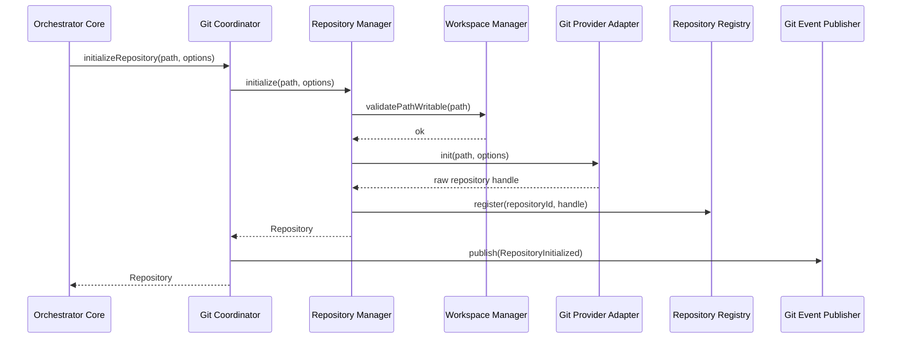

### 7.2 Repository Loading (Open)
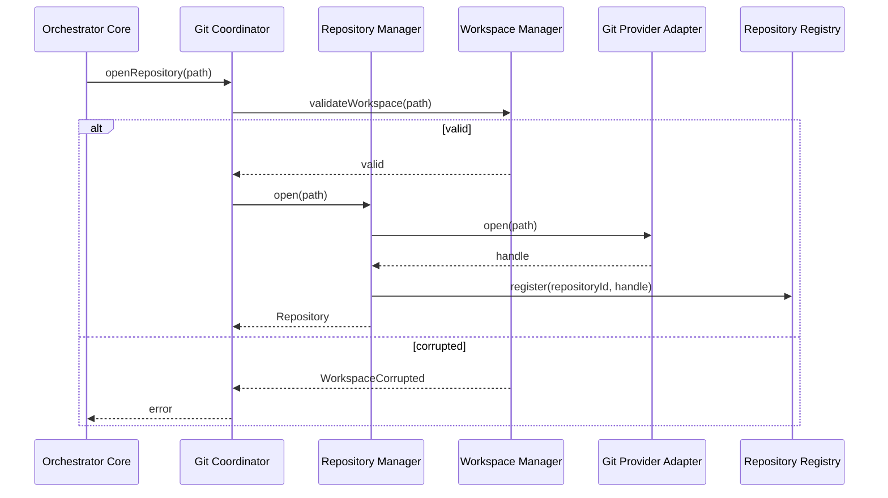

### 7.3 Workspace Scan / Status Refresh
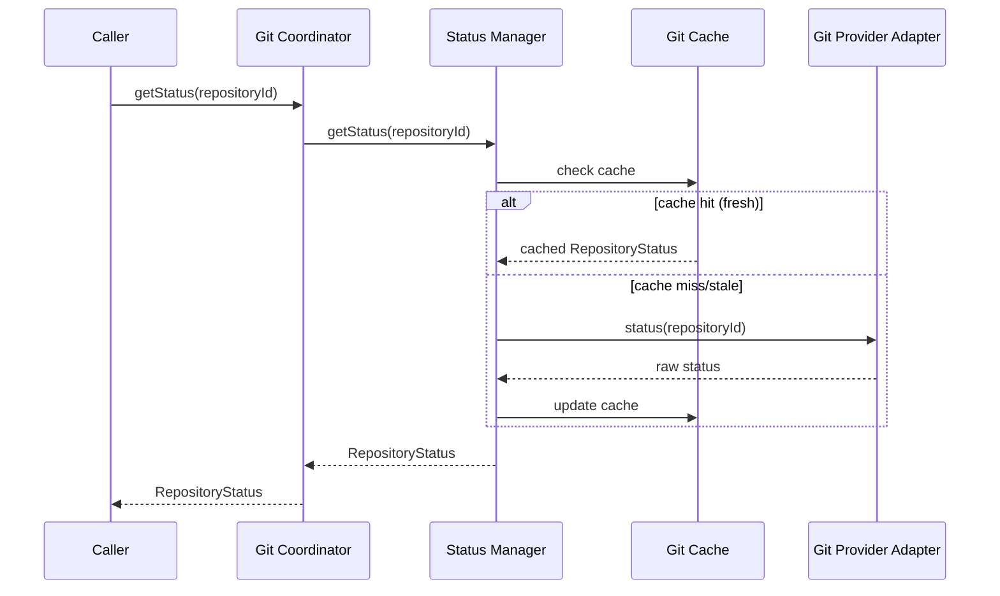

### 7.4 Commit Workflow
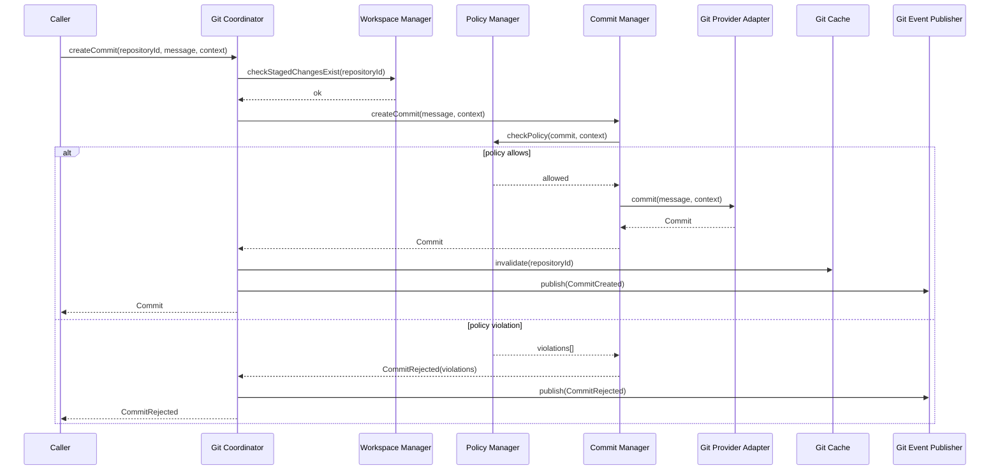

### 7.5 Branch Workflow
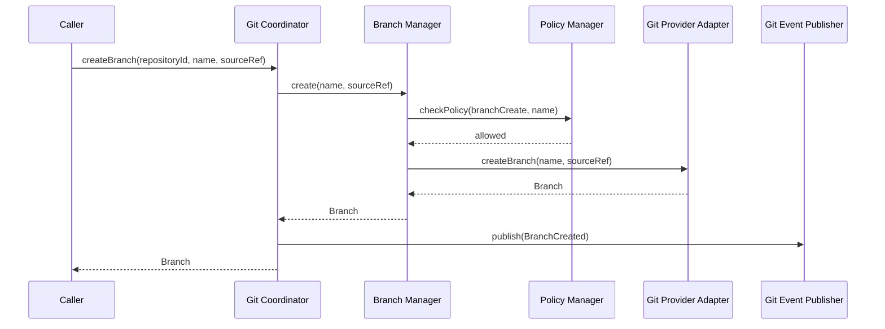

### 7.6 Merge Workflow
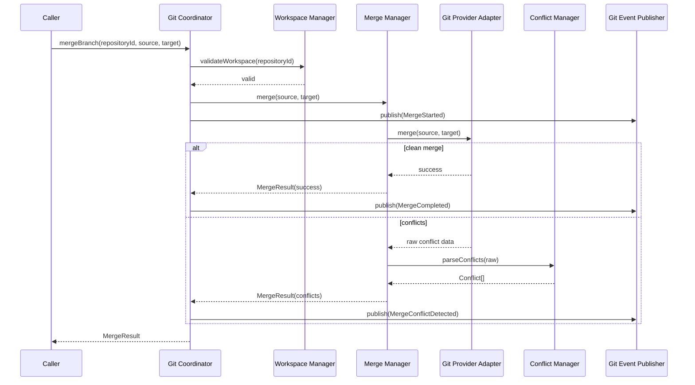

### 7.7 Rollback Workflow
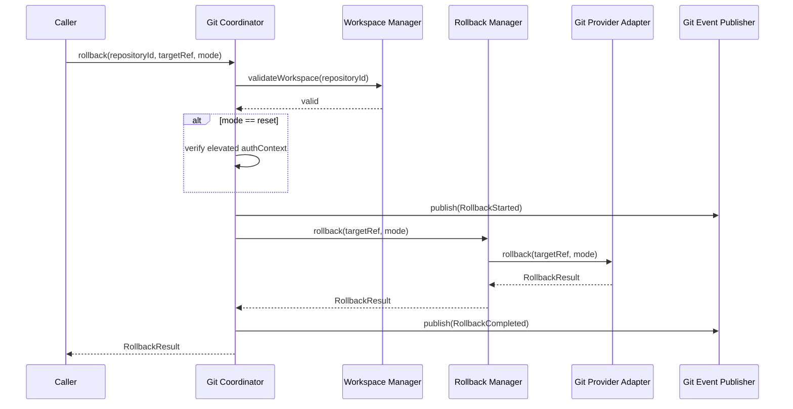

### 7.8 Snapshot Workflow
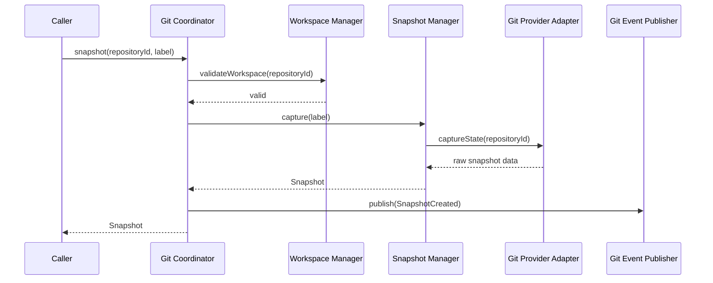

### 7.9 Shutdown
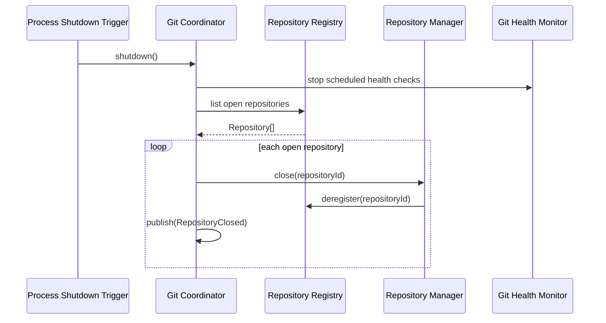

---

## 8. State Management

### Repository Lifecycle
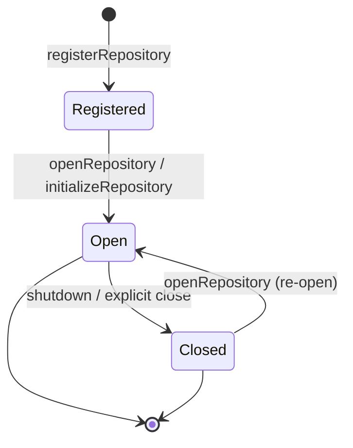

### Workspace Lifecycle
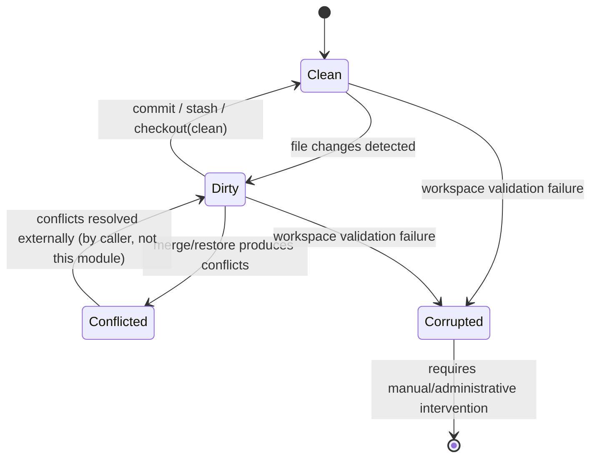

### Branch Lifecycle
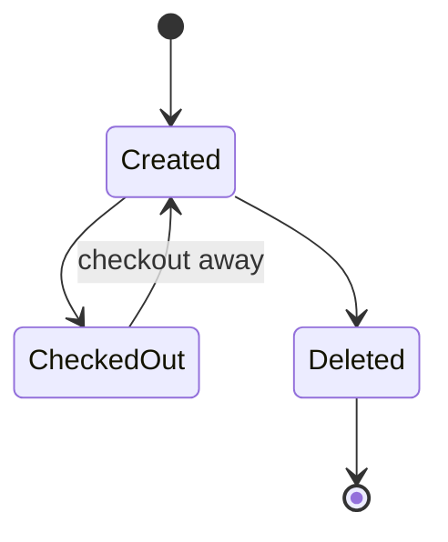

### Commit Lifecycle
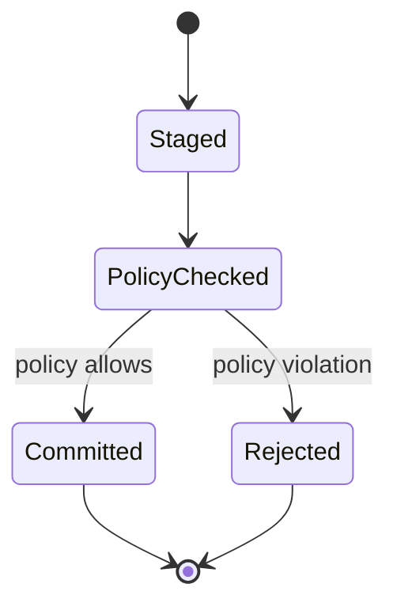
(Once `Committed`, a commit is immutable per Git's own object model — this module never mutates a commit, only creates new ones, including for rollback via `revert` mode.)

### Merge Lifecycle
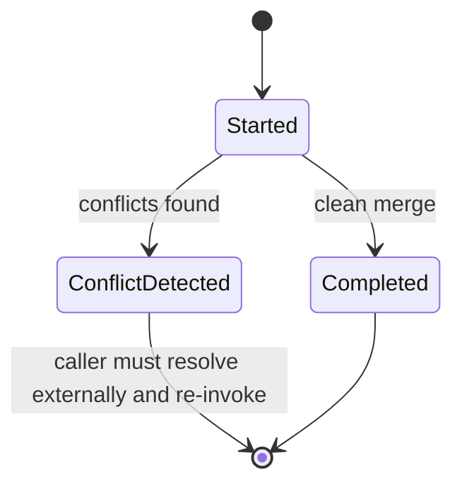

### Snapshot Lifecycle
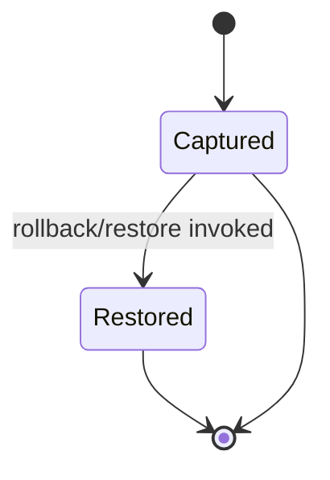

### Recovery
The Repository Registry (§5.3) is in-memory and rebuilt on restart from durable repository-registration metadata (Operational Storage, per `registerRepository`) — a restart never loses the actual Git repository content (owned by the filesystem/provider), only the process-local registry of *which repositories are currently open*, which is cheaply reconstructed by re-opening each registered repository on demand or at startup.

### Synchronization
Concurrent operations against the *same* `repositoryId` are serialized by the Git Provider Adapter's own locking semantics (most Git implementations natively serialize working-tree-mutating operations); the Git Manager's Repository Manager additionally applies an in-process advisory lock per `repositoryId` to prevent two concurrent callers within this module's own process from racing (e.g., simultaneous `checkoutBranch` and `createCommit`), surfacing a `RepositoryLocked` error to the losing caller rather than allowing undefined interleaving.

---

## 9. Events

| Event | Publisher | Consumers | Payload | Trigger | Failure Behavior |
|---|---|---|---|---|---|
| `RepositoryInitialized` | Git Event Publisher (via Repository Manager) | Logger, Dashboard Backend | `{ repositoryId, path, projectId? }` | `initializeRepository` success | Non-blocking |
| `RepositoryOpened` | Git Event Publisher | Logger, Memory Manager (context awareness), Dashboard Backend | `{ repositoryId, path }` | `openRepository` success | Non-blocking |
| `RepositoryClosed` | Git Event Publisher | Logger, Dashboard Backend | `{ repositoryId }` | shutdown / explicit close | Non-blocking |
| `WorkspaceChanged` | Git Event Publisher (via Status Manager change detection) | Memory Manager, Dashboard Backend | `{ repositoryId, changedFiles[] }` | `getStatus` detects a change since last known state | Non-blocking |
| `StatusUpdated` | Git Event Publisher | Logger | `{ repositoryId, branch, dirtyCount }` | Same trigger as `WorkspaceChanged`, distinct payload granularity | Non-blocking |
| `BranchCreated` | Git Event Publisher | Logger, Dashboard Backend | `{ repositoryId, branchName, sourceRef }` | `createBranch` success | Non-blocking |
| `BranchDeleted` | Git Event Publisher | Logger, Dashboard Backend | `{ repositoryId, branchName }` | branch deletion success | Non-blocking |
| `BranchCheckedOut` | Git Event Publisher | Memory Manager, Logger | `{ repositoryId, branchName }` | `checkoutBranch` success | Non-blocking |
| `CommitCreated` | Git Event Publisher | Memory Manager, Review Engine (evidence trigger), Logger, Dashboard Backend, Learning Layer | `{ repositoryId, commitId, taskId?, message }` | `createCommit` success | Non-blocking |
| `CommitRejected` | Git Event Publisher | Logger, Dashboard Backend | `{ repositoryId, violations[] }` | Policy Manager rejection | Non-blocking |
| `MergeStarted` | Git Event Publisher | Logger, Dashboard Backend | `{ repositoryId, mergeId, source, target }` | `mergeBranch` entry | Non-blocking |
| `MergeCompleted` | Git Event Publisher | Logger, Dashboard Backend, Learning Layer | `{ repositoryId, mergeId }` | Clean merge | Non-blocking |
| `MergeConflictDetected` | Git Event Publisher | Logger, Dashboard Backend, Orchestrator Core (correlation) | `{ repositoryId, mergeId, conflicts[] }` | Conflicts found | Non-blocking |
| `RollbackStarted` | Git Event Publisher | Logger, Dashboard Backend | `{ repositoryId, rollbackId, targetRef, mode }` | `rollback` entry | Non-blocking |
| `RollbackCompleted` | Git Event Publisher | Logger, Dashboard Backend, Learning Layer | `{ repositoryId, rollbackId, newHeadRef }` | Rollback success | Non-blocking |
| `SnapshotCreated` | Git Event Publisher | Logger, Dashboard Backend | `{ repositoryId, snapshotId, label }` | `snapshot` success | Non-blocking |
| `SnapshotRestored` | Git Event Publisher | Logger, Dashboard Backend | `{ repositoryId, snapshotId }` | Snapshot restore success | Non-blocking |
| `TagCreated` | Git Event Publisher | Logger, Dashboard Backend | `{ repositoryId, tagId, name, targetRef }` | `createTag` success | Non-blocking |
| `HistoryUpdated` | Git Event Publisher | Memory Manager, Dashboard Backend | `{ repositoryId, headRef }` | Any operation advancing the commit log (commit, merge, rollback) | Non-blocking |
| `RepositoryHealthChanged` | Git Health Monitor | Logger, Dashboard Backend (health aggregation) | `{ repositoryId, status, previousStatus }` | Scheduled health check detects a change | Non-blocking |

All events are fire-and-forget, isolated per subscriber, consistent with the platform-wide Event Bus policy (SDD §18).

---

## 10. Dependencies

| Dependency | Type | Why it exists |
|---|---|---|
| Configuration Manager | Internal module (port) | Source of repository/commit/branch/merge/policy configuration (§11) |
| Event Bus | Internal module (port) | Publishing the full Git lifecycle event catalog (§9) |
| Logger | Internal module (port) | Structured logging (§13) |
| Security Layer | Internal module (port) | Credential isolation for remote authentication, elevated-access checks for destructive operations (§15) |
| Git Provider Interface (port) | Domain port, this module's own boundary | The sole means of performing actual Git operations — see §5.20 |
| Operational Storage (Repository/Snapshot metadata) | Infrastructure (repository port) | Durable registration/snapshot metadata persistence, independent of the Git object store itself |
| Cache | Infrastructure | Status/diff/history caching (§16) |

**Never depends directly on**: Git CLI, libgit2, JGit, Dulwich, Rugged, or any hosted provider's SDK — every one of these is a candidate *implementation* of the Git Provider Interface port (§5.20), never a direct dependency of any component in §5.1–§5.19.

---

## 11. Configuration

| Namespace | Option (examples) | Default | Validation | Constraints / Notes |
|---|---|---|---|---|
| `git.*` | `git.providerAdapter` | `"cli"` | must reference a registered adapter implementation | selects which Git Provider Adapter implementation is active (§5.20, §22) |
| `repositories.*` | `repositories.maxOpenPerProcess` | 100 | positive integer | caps Repository Registry size per instance, for resource planning |
| `workspace.*` | `workspace.corruptionCheckOnOpen` | `true` | boolean | whether `openRepository` runs a full Workspace Manager validation before returning |
| `commits.*` | `commits.messageFormat` | `"^\\[.+\\] .{10,}"` (example convention: `[ref] description`) | valid regex | enforced by Policy Manager for every `createCommit` call unless the policy is overridden per project |
| `commits.*` | `commits.requireTaskReference` | `true` | boolean | if true, `context.taskId` is mandatory metadata for every commit |
| `branches.*` | `branches.protectedPatterns` | `["main", "release/*"]` | array of glob patterns | branches matching these patterns require elevated `authContext` for `checkoutBranch`-with-write-intent or direct commit (future protected-branch enforcement, §22) |
| `merge.*` | `merge.defaultStrategy` | `"recursive"` (or provider-appropriate default) | must be a strategy the active adapter supports | passed through to the Git Provider Adapter |
| `rollback.*` | `rollback.resetRequiresElevation` | `true` | boolean | gates `mode: reset` behind elevated `authContext` (§6.12, §15) |
| `snapshots.*` | `snapshots.retentionCount` | 20 | positive integer | maximum snapshots retained per repository before oldest are pruned (non-destructive to commit history — only the Snapshot Manager's own metadata) |
| `policies.*` | `policies.organizationOverrideRequiresElevation` | `true` | boolean | mirrors the platform-wide override-rule access-control pattern (Review Engine MDD §17 / Capability Selector MDD §18) |
| `providers.*` | `providers.remote.enabled` | `false` | boolean | gates future remote-provider operations (§22) — disabled by default until a remote adapter is configured |
| `hooks.*` | `hooks.preCommitPolicyGateRef` | `null` | optional reference to a Validation Report requirement | if set, Commit Manager's Policy Manager check additionally requires the referenced gate to have passed (policy-driven commit workflow, §3) |

**Profiles**: `development` relaxes `commits.messageFormat` and disables `rollback.resetRequiresElevation` for faster local iteration; `production` enforces the full policy set above.

**Environment variables**: `GIT_PROVIDER_ADAPTER`, `GIT_COMMITS_REQUIRE_TASK_REFERENCE`, `GIT_ROLLBACK_RESET_REQUIRES_ELEVATION`.

**Future Dashboard Integration**: all options live under their respective namespaces, editable through the existing Configuration Manager `PATCH /v1/config` path with no additional plumbing.

---

## 12. Error Handling

| Failure | Handling |
|---|---|
| Repository not found | `RepositoryNotFound`, returned immediately, no operation attempted |
| Repository locked | In-process advisory lock contention (§8 Synchronization) → `RepositoryLocked`, caller may retry; this module does not auto-retry on the caller's behalf (consistent with the platform's general "caller owns retry" posture, e.g., Request Manager MDD §12) |
| Merge conflict | **Not treated as an error** — returned as a structured `MergeResult { conflicts[] }` (§6.9, §9 `MergeConflictDetected`), since a conflict is an expected, first-class outcome of a merge attempt, not a module failure |
| Commit rejected | **Not treated as an error** — returned as a structured `CommitRejected` result (§6.10, §9), since a policy violation is an expected, first-class outcome, not a module failure |
| Rollback failure | Genuine provider-level failure (e.g., target ref unreachable, filesystem error) → `RollbackFailure`, no partial rollback state left (Git Provider Adapter operations are expected to be atomic at the single-operation level; this module does not implement its own compensating rollback-of-a-rollback) |
| Provider failure | Any Git Provider Adapter call failing (timeout, process crash, filesystem error) → wrapped into a standard `GitProviderError` taxonomy before crossing back into this module's components, mirroring the Provider Manager MDD's identical provider-error-wrapping pattern for platform-wide consistency |
| Snapshot failure | Workspace corruption detected mid-capture → `SnapshotFailure`, no partial/corrupt snapshot metadata persisted |
| Workspace corruption | Detected by Workspace Manager (§5.5) before any risky operation proceeds — corruption blocks the requested operation with `WorkspaceCorrupted` rather than attempting it and risking further damage |
| **Recovery Strategy** | This module's own state (Repository Registry) is always reconstructable (§8 Recovery); actual repository data durability is the Git object store's own responsibility (outside this module, via the provider adapter), consistent with the design constraint that repository state is independent of this module's process lifecycle |
| **Retry Strategy** | No automatic retry within this module for any operation — Git operations are not blindly idempotent-safe to retry (a retried commit could double-commit if the first attempt actually succeeded but the response was lost), so retry decisions are explicitly left to the caller, who has the context to check current repository state before retrying |
| **Rollback Strategy** | `rollback()` (§6.12) is the module's *product* feature for undoing repository changes, not an internal error-recovery mechanism; internally, this module never auto-rolls-back a failed operation — a failed commit simply leaves the workspace in its pre-commit staged state, requiring no compensating action |

---

## 13. Logging

| Log type | Content |
|---|---|
| Repository operations | init/open/close, with `repositoryId`, `path` |
| Branch operations | create/checkout/delete, with `branchName` |
| Commit operations | commit attempts (accepted and rejected), with `commitId`/violation detail |
| Merge operations | merge start/completion/conflict, with `mergeId` |
| Rollback | rollback attempts, mode, target ref |
| Workspace changes | status-change detections, corruption detections |
| Policy violations | every `PolicyResult.allowed: false` outcome, always logged regardless of debug mode (audit-relevant) |
| Performance | operation latency per Git Provider Adapter call |
| Audit | destructive operations (`reset`-mode rollback, elevated-access branch operations), unconditionally logged |

All log lines carry `repositoryId` and, where applicable, `branchId`/`commitId`/`tagId`/`snapshotId`/`mergeId`/`rollbackId`, plus `requestId`/`sessionId`/`projectId`/`correlationId`/`traceId`/`spanId` per the platform-wide standardized metadata set (see Enterprise Git Standards, below).

---

## 14. Monitoring

- **Metrics**: repositories (open count), commits (rate, rejection rate), merges (rate, conflict rate), conflicts (count, resolution-pending duration — noting resolution itself is external to this module), rollbacks (rate, mode breakdown), branch switches (rate), diff generation latency, repository scan duration, workspace refresh rate.
- **Health Monitoring**: Git Health Monitor (§5.19) periodic checks feed the platform `GET /health` aggregation; per-repository health surfaced via `health(repositoryId)` (§6.18).
- **Alerts**: elevated commit-rejection rate (may indicate a misconfigured policy), elevated merge-conflict rate, repository health degradation, workspace-corruption detection (always alert-worthy).

---

## 15. Security

- **Repository permissions**: filesystem-level access control is enforced by the underlying OS/provider, not reimplemented by this module; this module's own `authContext` checks (§6.12 `reset` mode, branch protection) are an *additional* layer above filesystem permissions, not a replacement.
- **Credential isolation**: any remote authentication credentials (future remote-provider adapters, §22) are held exclusively by the Security Layer's secret store and injected into the relevant Git Provider Adapter implementation at call time — never logged, never held in this module's own components.
- **Remote authentication**: out of scope for the initial local/CLI-adapter implementation; the port contract (§5.20) is defined broadly enough to accommodate token/SSH-key-based remote auth in a future adapter without a port redesign.
- **Secret protection**: commit content is never scanned for secrets by this module (that is Security Validator/Validation Engine territory if configured); this module's own operational logs are secret-redacted per the platform-wide Logger convention.
- **Commit signature support**: the Git Provider Adapter port includes an optional signing-key parameter on `createCommit`/`createTag`, deferred to future adapter implementations that support GPG/SSH commit signing (§22) — the port shape anticipates this without requiring it today.
- **Audit logging**: destructive operations (`reset` rollback, branch deletion, snapshot restore) are unconditionally audit-logged (§13).
- **Workspace validation**: performed before every risky operation (§5.5, §12) as a security-adjacent integrity safeguard, not just a correctness one — a corrupted workspace could otherwise mask malicious tampering.
- **Safe rollback**: `revert` mode (non-destructive, new commit) is the default; `reset` mode (destructive, history-rewriting) requires explicit elevated confirmation (§6.12, §11).
- **Tamper detection**: Workspace Manager's corruption checks (§5.5) and Git's own content-addressable object model (external to this module, but load-bearing) together provide the platform's primary tamper-evidence mechanism for repository content.

---

## 16. Performance

- **Repository caching**: Git Cache (§5.18) caches status/diff/history with short TTL, invalidated explicitly on every workspace-mutating operation (commit, branch, merge, rollback) rather than relying on TTL expiry alone for correctness-sensitive reads.
- **Incremental scanning**: Workspace Manager (§5.5) supports incremental (changed-files-only) scanning for large repositories rather than a full-tree walk on every status check, where the underlying provider adapter supports it.
- **Diff optimization**: Diff Manager requests scoped diffs (specific path/range) rather than always computing a full repository diff, and caches recent diff results.
- **History caching**: History Manager caches recent commit-log pages, invalidated on `HistoryUpdated`-triggering operations.
- **Parallel repository support**: multiple distinct repositories are fully independent — operations against `repositoryId` A never block operations against `repositoryId` B (only same-repository operations are serialized, §8 Synchronization).
- **Concurrent operations**: read-only operations (status, diff, history) against the same repository may proceed concurrently with each other; only workspace-mutating operations acquire the advisory lock (§8).
- **Lazy loading**: large diff/history bodies are returned by reference where the underlying content is large (mirroring the DDD §18 lazy-loading pattern for Artifacts) rather than always fully materialized.
- **Memory usage**: Repository Registry entries are lightweight handles, not full repository content mirrors — actual Git object data stays with the provider/filesystem, never duplicated into this module's process memory beyond what a single in-flight operation requires.

---

## 17. Data Flow

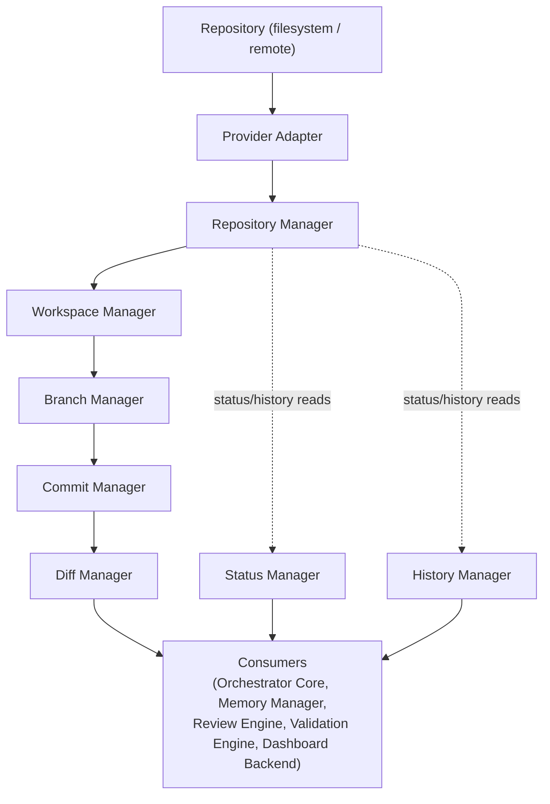

This mirrors the exact stage sequence requested (Repository → Provider Adapter → Repository Manager → Workspace Manager → Branch Manager → Commit Manager → Diff Manager → Consumers), with Status Manager and History Manager shown as parallel read-side branches feeding the same consumer set.

---

## 18. Interaction With Other Modules

```mermaid
sequenceDiagram
    participant OC as Orchestrator Core
    participant GM as Git Manager
    OC->>GM: createCommit(repositoryId, message, context)
    GM-->>OC: Commit / CommitRejected
    Note over OC,GM: Orchestrator Core decides WHEN to commit;<br/>Git Manager only executes the coordination
```

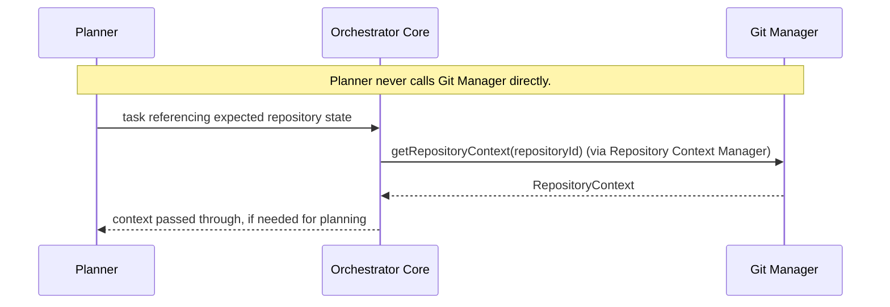

```mermaid
sequenceDiagram
    participant MM as Memory Manager
    participant GM as Git Manager
    GM-->>MM: (via Event Bus) RepositoryOpened, BranchCheckedOut, CommitCreated, HistoryUpdated
    MM->>GM: getRepositoryContext(repositoryId) (on demand, for context hydration)
    GM-->>MM: RepositoryContext
```

```mermaid
sequenceDiagram
    participant KB as Knowledge Base
    participant GM as Git Manager
    Note over KB,GM: No direct interaction.
```

```mermaid
sequenceDiagram
    participant RvE as Review Engine
    participant GM as Git Manager
    RvE->>GM: getDiff(repositoryId, scope) (as evidence source)
    GM-->>RvE: Diff
    Note over RvE: Review Engine uses the diff as Evidence (Review Engine MDD §5.6);<br/>Git Manager makes no quality judgment
```

```mermaid
sequenceDiagram
    participant VE as Validation Engine
    participant GM as Git Manager
    VE->>GM: getDiff(repositoryId, scope) / getStatus(repositoryId)
    GM-->>VE: Diff / RepositoryStatus
    Note over VE: Validation Engine uses this as contract-validation context;<br/>Git Manager makes no correctness judgment
```

```mermaid
sequenceDiagram
    participant CFG as Configuration Manager
    participant GM as Git Manager
    CFG-->>GM: policy/config change notification
    GM->>GM: invalidate Policy Manager cache
```

```mermaid
sequenceDiagram
    participant GM as Git Manager
    participant EB as Event Bus
    participant LOG as Logger
    GM->>EB: publish(RepositoryOpened | CommitCreated | ...)
    EB-->>LOG: delivered
```

**Boundary statement**: the Git Manager communicates only through its own public interfaces (§6) and the Git Provider Adapter port (§5.20) — it never bypasses these boundaries, and no other module ever reaches past this module's public interface to touch a Git implementation directly.

---

## 19. Folder Structure

```
git-manager/
  application/
    git-coordinator/              # §5.1
    repository-manager/            # §5.2
    repository-registry/            # §5.3
    repository-context-manager/      # §5.4
    workspace-manager/                # §5.5
    branch-manager/                    # §5.6
    commit-manager/                     # §5.7
    merge-manager/                       # §5.8
    tag-manager/                          # §5.9
    diff-manager/                          # §5.10
    status-manager/                         # §5.11
    history-manager/                         # §5.12
    rollback-manager/                         # §5.13
    snapshot-manager/                          # §5.14
    policy-manager/                             # §5.15
    conflict-manager/                            # §5.16
    git-event-publisher/                          # §5.17
    git-cache/                                     # §5.18
    git-health-monitor/                             # §5.19
  domain/
    entities/                       # Repository, Branch, Commit, Tag, Merge, Snapshot, Diff, Conflict (§8/§9)
    ports/
      git-provider-adapter-port/     # §5.20 — the Hexagonal boundary to concrete Git implementations
      config-port/
      event-bus-port/
      logger-port/
      security-port/
      repository-metadata-port/       # Operational Storage, registration/snapshot metadata
      cache-port/
  infrastructure/
    provider-adapters/
      git-cli-adapter/                 # concrete implementation using system git CLI
      libgit2-adapter/                  # concrete implementation using libgit2 bindings
      jgit-adapter/                      # concrete implementation using JGit (JVM environments)
      remote-provider-adapters/           # §22 — GitHub/GitLab/Azure DevOps/Bitbucket, future
    policy-change-listener/            # subscribes to Configuration Manager change notifications
  config/
    schema.*                           # git.*, repositories.*, workspace.*, commits.*, branches.*, merge.*,
                                        # rollback.*, snapshots.*, policies.*, providers.*, hooks.* (§11)
  tests/
    unit/
    integration/
    contract/
    repository/
    merge/
    conflict/
    rollback/
    performance/
    concurrency/
    recovery/
```

---

## 20. File Responsibilities

| File (conceptual) | Purpose | Public API | Private Logic | Dependencies |
|---|---|---|---|---|
| `git-coordinator.*` | §5.1 | all of §6 | Cross-component sequencing | every component below |
| `repository-manager.*` | §5.2 | (internal) | init/open/close coordination | RepositoryRegistry, WorkspaceManager, GitProviderAdapterPort, GitHealthMonitor |
| `repository-registry.*` | §5.3 | (internal) | in-memory lookup table | — |
| `repository-context-manager.*` | §5.4 | (internal, exposed as `getRepositoryContext`) | context bundle assembly | StatusManager, HistoryManager, GitCache |
| `workspace-manager.*` | §5.5 | `validateWorkspace` (partial, via coordinator) | scan/corruption detection | GitProviderAdapterPort |
| `branch-manager.*` | §5.6 | `createBranch`, `checkoutBranch` (via coordinator) | branch policy enforcement | GitProviderAdapterPort, PolicyManager |
| `commit-manager.*` | §5.7 | `createCommit` (via coordinator) | commit policy enforcement | GitProviderAdapterPort, PolicyManager, WorkspaceManager |
| `merge-manager.*` | §5.8 | `mergeBranch` (via coordinator) | merge coordination | GitProviderAdapterPort, ConflictManager, WorkspaceManager |
| `tag-manager.*` | §5.9 | `createTag` (via coordinator) | tag creation | GitProviderAdapterPort |
| `diff-manager.*` | §5.10 | `getDiff` (via coordinator) | diff normalization | GitProviderAdapterPort, GitCache |
| `status-manager.*` | §5.11 | `getStatus` (via coordinator) | status caching | GitProviderAdapterPort, GitCache |
| `history-manager.*` | §5.12 | `getHistory` (via coordinator) | pagination | GitProviderAdapterPort, GitCache |
| `rollback-manager.*` | §5.13 | `rollback` (via coordinator) | revert/reset coordination | GitProviderAdapterPort, WorkspaceManager, SnapshotManager |
| `snapshot-manager.*` | §5.14 | `snapshot` (via coordinator) | capture/restore | GitProviderAdapterPort, WorkspaceManager |
| `policy-manager.*` | §5.15 | (internal) | precedence resolution | ConfigPort |
| `conflict-manager.*` | §5.16 | (internal) | conflict parsing | — |
| `git-event-publisher.*` | §5.17 | (internal) | event mapping | EventBusPort |
| `git-cache.*` | §5.18 | (internal) | TTL/invalidation | CachePort |
| `git-health-monitor.*` | §5.19 | `health` (via coordinator) | scheduled health checks | GitProviderAdapterPort |
| `ports/git-provider-adapter-port.*` | Contract | full Git operation contract | — | — |
| `infrastructure/provider-adapters/git-cli-adapter.*` | Concrete adapter | (implements port) | shells out to system git safely, never invoked by business logic directly | git CLI |

---

## 21. Testing Strategy

- **Unit Tests**: each §5 component in isolation — Policy Manager's precedence resolution, Conflict Manager's parsing correctness, Repository Registry's lookup behavior.
- **Integration Tests**: full workflows (§7) against a real (test-fixture) local Git repository via the `git-cli-adapter`.
- **Contract Tests**: every concrete Git Provider Adapter implementation (git-cli, libgit2, JGit) run against an identical conformance suite, verifying interchangeability (mirrors Knowledge Base MDD §23's identical storage-adapter conformance-testing rationale).
- **Repository Tests**: init/open/close lifecycle correctness across edge cases (empty repo, existing repo, corrupted repo).
- **Merge Tests**: clean-merge and conflict-producing scenarios, verifying structured `MergeResult` correctness.
- **Conflict Tests**: Conflict Manager's parsing across varied conflict-marker formats.
- **Rollback Tests**: both `revert` and `reset` modes, including elevated-access enforcement for `reset`.
- **Performance Tests**: status/diff/history latency on large synthetic repositories (many files, deep history).
- **Concurrency Tests**: simultaneous operations against the same `repositoryId` correctly serialized (§8 Synchronization), simultaneous operations against different `repositoryId`s correctly parallel.
- **Recovery Tests**: process restart with previously-open repositories, verifying Repository Registry reconstruction (§8 Recovery) without data loss.

---

## 22. Future Expansion

- **Multiple repositories / Monorepos**: the Repository Registry and every manager component already operate per-`repositoryId` with no single-repository assumption; monorepo-aware operations (e.g., scoped sub-path status) are additive to Workspace Manager/Diff Manager, not a structural change.
- **Distributed repositories**: a future distributed/replicated Git backend is a concern of the concrete Git Provider Adapter implementation, invisible above the port (§5.20).
- **Remote Git providers** (GitHub, GitLab, Azure DevOps, Bitbucket): implemented as additional Git Provider Adapter implementations (§19 `remote-provider-adapters/`) with credential handling via the Security Layer (§15) — no core-component change.
- **Signed commits**: the port contract already anticipates an optional signing parameter (§15) — enabling it is an adapter-level capability addition.
- **Protected branches**: additive Policy Manager rules (§11 `branches.protectedPatterns` is the initial hook for this) — no structural change.
- **Git hooks**: the `hooks.*` configuration namespace (§11) is the designed extension point — a future hook-invocation component would sit alongside Commit/Merge Manager, invoked as an additional Policy Manager-adjacent step, without altering the core commit/merge sequencing.
- **Pull request integration**: a natural extension of the remote-provider adapters above — PR creation/status becomes new Git Provider Adapter operations, with a corresponding new public interface method and event, following the exact same additive pattern as every other operation in this module.
- **AI-assisted commit generation**: introduced as an optional enrichment step invoked by the *caller* (e.g., Orchestrator Core requesting a generated message from an AI module before calling `createCommit`) — this module never generates commit messages itself, preserving its non-goal boundary (§2) around content generation.
- **Repository federation**: multiple Git Manager instances or repository sources unified behind a future federation layer that calls each instance's existing public interfaces — no change to this module's own contract.

---

## 23. Risks

| Risk | Category | Mitigation |
|---|---|---|
| Concurrent same-repository operations racing despite the advisory lock (e.g., a crash leaving a stale lock) | Technical | Locks are process-scoped with a timeout/TTL, never held indefinitely; a stale lock is automatically reclaimed after the configured timeout, logged as a warning |
| Repository corruption (external causes — disk failure, manual `.git` tampering) | Data Integrity | Workspace Manager's pre-operation validation (§5.5, §12) catches corruption before this module attempts further mutating operations, preventing compounding damage |
| Merge conflicts left unresolved indefinitely, blocking downstream orchestration | Workflow / Operational | `MergeConflictDetected` (§9) is surfaced to Orchestrator Core for correlation, making stalled conflicts visible in monitoring (§14) rather than silently blocking |
| Partial rollbacks (a `reset` operation interrupted mid-way by a process crash) | Data Integrity | Git Provider Adapter operations are treated as atomic at the single-call level (§12); this module never implements a multi-step rollback sequence that could be left partially applied — a single `reset` call either fully applies or the provider reports failure with no change |
| Credential leakage (future remote-provider adapters) | Security | Credentials never held by this module's own components (§15) — always injected at the adapter boundary from the Security Layer's secret store, never logged |
| Large repositories degrading status/diff/history performance | Performance / Scalability | Incremental scanning, caching, and lazy loading (§16) are first-class design elements, not afterthoughts, specifically to address this risk |
| Provider incompatibilities (different Git implementations behaving subtly differently for the same logical operation) | Maintenance | Contract Tests (§21) run an identical conformance suite against every adapter, catching behavioral drift before it reaches production — identical mitigation strategy to Knowledge Base MDD §25's storage-adapter risk |

---

## 24. Design Decisions

| Decision | Rationale | Alternatives Considered | Trade-off |
|---|---|---|---|
| Git Provider Adapter as a single unifying port covering init/status/diff/branch/commit/merge/tag/stash/log/rollback, rather than separate ports per operation category | Keeps every component in §5 implementation-agnostic behind one boundary, directly enabling "provider independence" and "future remote repository providers" without a port redesign | Separate smaller ports per operation family | A single broad port is a larger contract to design well up front, but avoids fragmenting the provider-swap story across many independently-versioned ports |
| Merge conflicts and commit rejections modeled as structured results, not exceptions | These are expected, common, first-class outcomes of the operations that produce them — treating them as exceptions would force every caller into exception-handling for routine control flow | Throwing exceptions for conflicts/rejections | Structured results are slightly more verbose for callers to check, but make the expected-vs-exceptional distinction explicit and force callers to handle the common case deliberately |
| No automatic retry for any Git operation within this module | Git operations are not safely blind-retryable (risk of double-commit or inconsistent state if a "failed" call actually partially succeeded); the caller has better context to verify state before retrying | Built-in retry/backoff | Slightly more responsibility pushed to callers, but avoids a class of subtle double-application bugs that a naive retry layer could introduce |
| `revert` as the default rollback mode, `reset` gated behind elevated access | Protects against accidental destructive history rewriting by default, consistent with the platform-wide "soft/reversible by default, destructive requires deliberate elevated action" pattern already established in Knowledge Base MDD §26 (soft-delete default) | `reset` as default | Slightly more friction for legitimate destructive-rollback use cases, judged acceptable given the severity of an accidental history rewrite |
| Repository Registry kept in-process/in-memory (not a durable primary store) with only *registration metadata* persisted durably | Actual repository content durability is the Git object store's own responsibility; duplicating that in this module's own storage would be redundant and risk divergence from the actual source of truth | Fully durable repository-state mirror in Operational Storage | A purely in-memory registry requires reconstruction on restart (§8 Recovery), but this is cheap and avoids the far worse risk of a duplicated, potentially-stale repository-state store |
| Policy Manager precedence model deliberately copied from the platform's established pattern (Capability Selector MDD §12, Review Engine MDD §11, Validation Engine MDD §9) | Consistency across every policy-governed module reduces cognitive and operational overhead, and this pattern is already proven across three prior modules | An independently-designed Git-specific policy model | None significant — the underlying problem (organization vs. project precedence, audited overrides) is identical in shape to the already-solved cases |

---

## 25. Diagrams (Consolidated Reference)

**Component Diagram** — see §5.
**Sequence Diagram** — see §7, §18.
**State Diagram** — see §8.
**Data Flow Diagram** — see §17.
**Class Diagram (conceptual)**
```mermaid
classDiagram
    class GitCoordinator {
        +initializeRepository()
        +openRepository()
        +getRepository()
        +getStatus()
        +getDiff()
        +getHistory()
        +createBranch()
        +checkoutBranch()
        +mergeBranch()
        +createCommit()
        +createTag()
        +rollback()
        +stash()
        +restore()
        +snapshot()
        +validateWorkspace()
        +registerRepository()
        +health()
    }
    class RepositoryManager { +initialize() +open() +close() }
    class WorkspaceManager { +validateWorkspace() +scan() }
    class BranchManager { +create() +checkout() +delete() }
    class CommitManager { +createCommit() }
    class MergeManager { +merge() }
    class PolicyManager { +checkPolicy() }
    class GitProviderAdapterPort { <<interface>> +init() +status() +diff() +branchOps() +commit() +merge() +tag() +stash() +log() +rollback() }

    GitCoordinator --> RepositoryManager
    GitCoordinator --> WorkspaceManager
    GitCoordinator --> BranchManager
    GitCoordinator --> CommitManager
    GitCoordinator --> MergeManager
    CommitManager --> PolicyManager
    BranchManager --> PolicyManager
    RepositoryManager --> GitProviderAdapterPort
    BranchManager --> GitProviderAdapterPort
    CommitManager --> GitProviderAdapterPort
    MergeManager --> GitProviderAdapterPort
```
**Folder Structure Diagram** — see §19.

---

## Enterprise Git Standards

Every entity and operation in this module supports the platform's standardized metadata set for correlation and auditability: `repositoryId`, `workspaceId`, `branchId`, `commitId`, `tagId`, `snapshotId`, `mergeId`, `rollbackId`, `requestId`, `sessionId`, `projectId`, `correlationId`, `traceId`, `spanId`. These flow through every event (§9) and log line (§13) uniformly.

The module supports, as first-class design properties rather than bolted-on features:
- **Immutable commit history** — this module never mutates a commit once created; rollback always creates new history (`revert`) or is an explicitly elevated, audited destructive action (`reset`).
- **Repository health monitoring** — via Git Health Monitor (§5.19), feeding platform-wide health aggregation.
- **Policy-driven commits** — via Policy Manager (§5.15) and the `hooks.*`/`commits.*` configuration namespaces (§11).
- **Rollback safety** — Workspace Manager validation before every rollback, `revert`-by-default, elevated access for `reset`.
- **Repository abstraction** — the Git Provider Adapter port (§5.20) is the sole and complete abstraction boundary.
- **Provider independence** — proven by Contract Tests (§21) running an identical conformance suite across every adapter implementation.
- **Multi-repository readiness** — every component operates per-`repositoryId` with no single-repository assumption anywhere in §5.
- **Auditability** — immutable history, unconditional audit logging of destructive/override operations (§13, §15), and the full standardized metadata set above.
- **Event-driven repository lifecycle** — the complete event catalog (§9) covers every state-changing operation, letting every other module react without polling.

---

## Architectural Constraints (Explicit Statement)

- The Git Manager **never edits files directly** — it coordinates commits of changes that already exist on disk; file content creation/modification is the responsibility of whatever module or process produced those changes (outside this module's scope, §4).
- The Git Manager **never generates code** — no code-generation logic exists anywhere in §5.
- The Git Manager **never performs planning or orchestration** — it is invoked by the Orchestrator Core; it never decides *when* a Git operation should occur (§2 Non-Goals, §4).
- The Git Manager **never bypasses Git provider interfaces** — every actual Git operation, in every component in §5, passes through the Git Provider Adapter port (§5.20); no component holds a direct dependency on a Git implementation.
- **Business modules never call Git implementations directly** — every caller (Orchestrator Core, Review Engine, Validation Engine, Memory Manager) interacts exclusively with this module's public interfaces (§6), never with the Git Provider Adapter or any concrete adapter.
- **Git implementations are replaceable through adapters** — proven architecturally by the port/adapter separation (§5.20, §19, §22) and operationally by Contract Tests (§21).
- **Repository state is managed independently of business state** — the Repository Registry and Git object store are entirely separate from Project/Task/Session state (DDD §6.1/§6.3/§6.5); this module's own process lifecycle never affects repository content durability (§8 Recovery, §24).

---

*End of document.*
