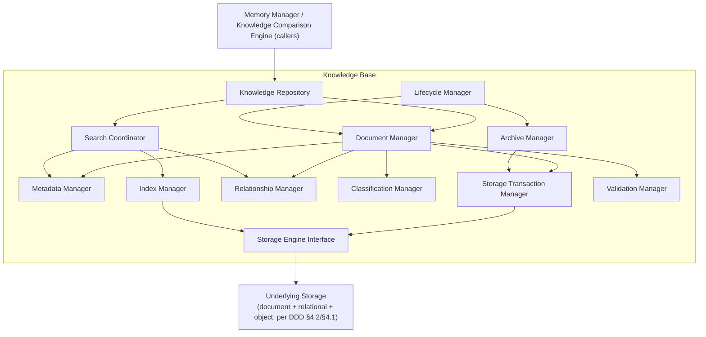
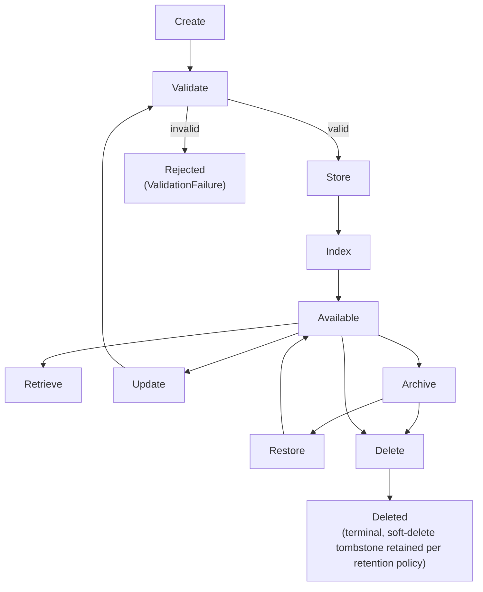
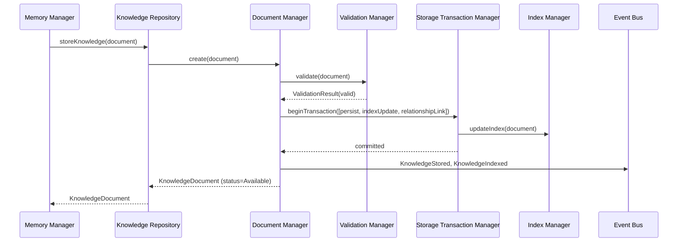
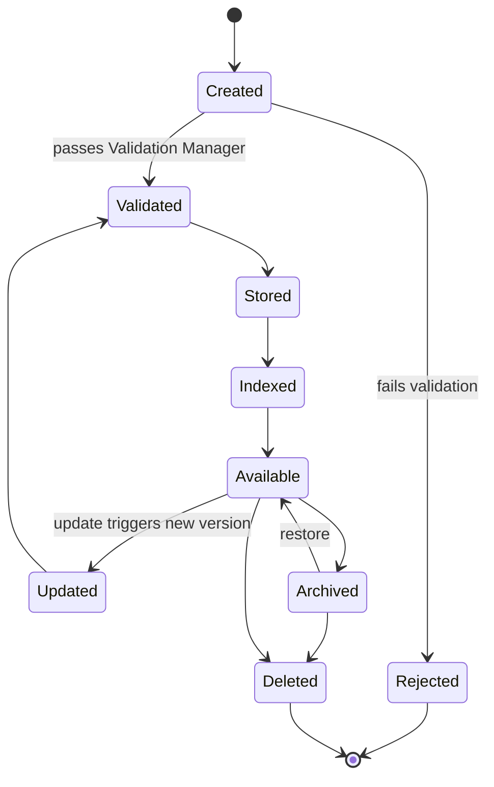
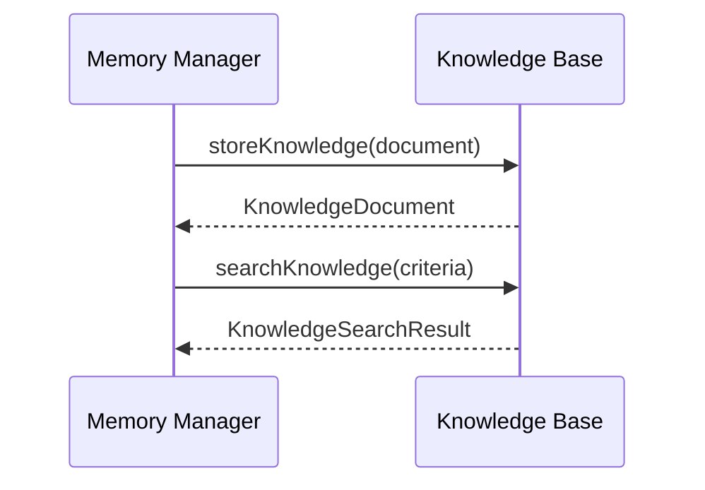
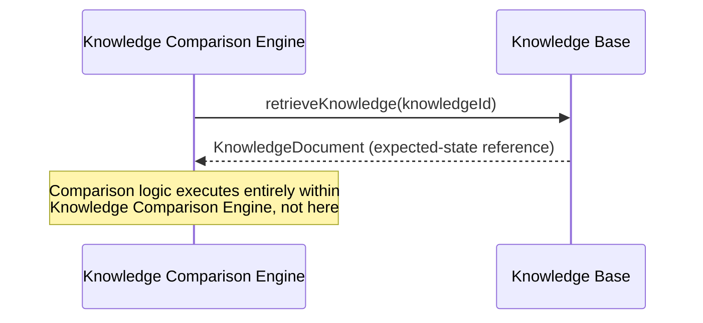
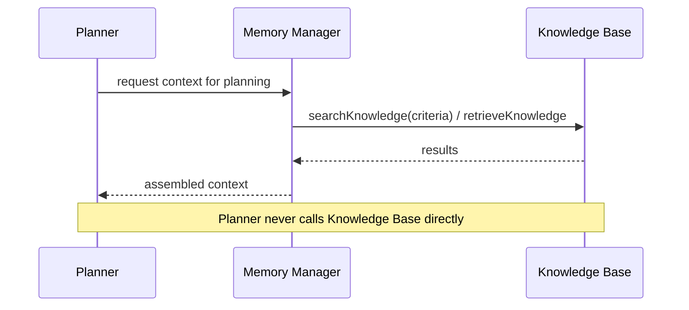
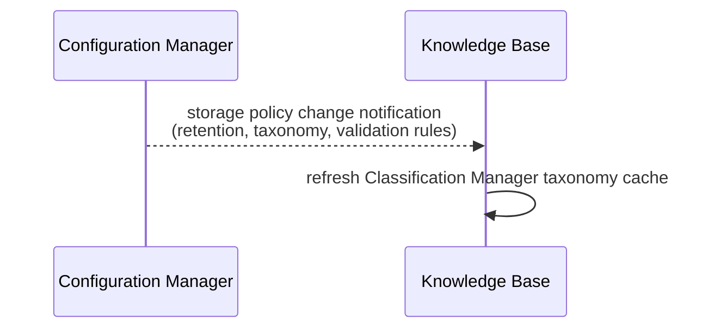
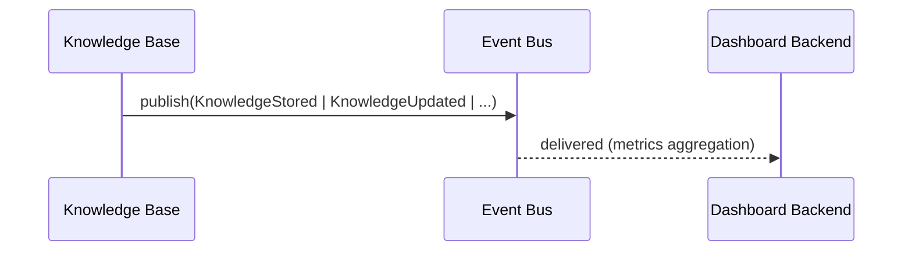

# Module Design Document (MDD)
## Knowledge Base

**Version:** 1.0
**Status:** Draft for engineering review
**Companion to:** SDD v1.0, API Specification v1.0, Database Design Document v1.0, Orchestrator Core / Event Bus / Request Manager / Provider Manager / Provider Plugin System / Model Registry / Capability Selector / Router / Memory Manager MDDs

---

## 1. Executive Summary

The Knowledge Base is the platform's **persistent knowledge storage service**. It stores, organizes, indexes, retrieves, versions, archives, and deletes Knowledge Entities — including documents, entities, concepts, facts, decisions, procedures, episodes, reflections, rules, patterns, learning artifacts, and ontology nodes — as durable project knowledge (DDD §6.17, §14). It is a storage layer, not a reasoning layer: it never decides what knowledge to load into a conversation, never generates embeddings, never runs similarity search algorithms, and never compares one piece of knowledge against another.

It exists because knowledge persistence — durable storage with organization, indexing, versioning, and lifecycle management — is a distinct, substantial concern from *memory orchestration* (deciding what context to hydrate, when, and how much — the Memory Manager's job) and from *knowledge comparison* (evaluating expected vs. actual state — the Knowledge Comparison Engine's job, per SDD §6.14). Collapsing these into one module would mix a storage concern with two very different reasoning concerns, violating separation of concerns.

Within the complete architecture, the Knowledge Base sits behind the Memory Manager (its primary caller) and beside — never beneath — the Knowledge Comparison Engine and Planner, both of which read from it. It exposes only storage-shaped operations (store, retrieve, search, version, archive, delete) through abstract interfaces; every module that needs knowledge *content* goes through those interfaces and never touches underlying storage directly.

```mermaid
flowchart LR
    MM["Memory Manager"] -->|store/retrieve| KB["Knowledge Base"]
    KCE["Knowledge Comparison Engine"] -->|read| KB
    PL["Planner"] -->|read (via Memory Manager)| KB
    CFG["Configuration Manager"] -->|storage policies| KB
    KB -->|events| EB["Event Bus"]
    KB -->|logs| LOG["Logger"]
    DB["Dashboard Backend"] -->|metrics| KB
```

---

## 2. Goals

### Primary Goals
- Provide durable, consistent, versioned storage for Knowledge Entities at enterprise/hyperscale volume (§19), while preserving the existing document API and document support.
- Provide rich retrieval — lookup, metadata/tag/relationship/collection/namespace search, filtering, sorting, pagination — without performing any semantic/similarity reasoning itself.
- Guarantee data integrity (checksums, transactional writes, consistency guarantees) across the full knowledge lifecycle.
- Remain a pure storage service: zero embedding generation, zero AI reasoning, zero comparison logic, zero orchestration decisions.

### Secondary Goals
- Support flexible knowledge organization (collections, namespaces, projects, categories, hierarchies, relationships, tags) without hardcoding any specific taxonomy.
- Support immutable version history with rollback, enabling safe iteration on knowledge content.
- Expose storage health/usage metrics for the Dashboard Backend.

### Non-Goals
- Memory orchestration (Memory Manager), execution, planning, knowledge comparison (Knowledge Comparison Engine), AI reasoning, embedding generation, vector similarity algorithms, provider communication/SDKs, business logic beyond storage rules, prompt engineering, model selection, routing, browser automation, review, cost calculation, usage tracking (beyond storage-usage metrics, which is a monitoring concern, not a billing one).

### Future Goals
- Distributed/federated Knowledge Bases across regions and organizations (§23).
- Pluggable storage engines and tiered/cold storage (§23).
- Storage-level plugin architecture for custom knowledge types.

---

## 3. Responsibilities

### Must Have
- Create, validate, and persist Knowledge Entities with full metadata (§7), including Documents, Entities, Concepts, Facts, Decisions, Procedures, Episodes, Reflections, Rules, Design Patterns, Architecture Patterns, Learning Artifacts, and Ontology Nodes.
- Index knowledge for non-semantic retrieval (metadata, tag, relationship, collection, namespace lookups, graph identifiers) — semantic/embedding-based indexing is explicitly out of scope (owned by whatever module generates and queries embeddings, per Memory Manager MDD).
- Enforce knowledge versioning: every content change creates a new immutable version, never an in-place overwrite (consistent with DDD §8 Versioning convention).
- Support the full lifecycle: create → validate → store → index → available → retrieve → update → archive → restore → delete (§6).
- Provide transactional guarantees for multi-step storage operations (e.g., a store-plus-relationship-link-plus-graph-metadata operation either fully succeeds or fully rolls back).
- Enforce storage-level validation (schema conformance, checksum integrity, duplicate detection, provenance/confidence completeness where required) independent of any content-quality judgment (which is not this module's concern).
- Publish storage lifecycle events for every state-changing operation.

### Should Have
- Support bulk operations (batch store/retrieve/delete) for efficient large-scale ingestion.
- Support streaming retrieval for large result sets, avoiding full-materialization of large query results in memory.
- Provide background/asynchronous indexing for non-blocking writes at scale.

### Future Responsibilities
- Distributed storage federation across multiple physical clusters/regions.
- Storage-engine plugin architecture (§23).
- Automated tiered storage (hot/warm/cold/archive) migration.

---

## 4. Scope

### Owns
Knowledge Storage, Knowledge Persistence, Knowledge Retrieval, Knowledge Indexing (structural/metadata indexing — not semantic/vector indexing), Knowledge Metadata, Knowledge Versioning, Knowledge Organization, Knowledge Classification, Knowledge Relationships, Knowledge Collections, Knowledge Entities, Knowledge Documents, Knowledge Records, Knowledge Archiving, Knowledge Lifecycle, Knowledge Search (structural search — not similarity search), Knowledge Integrity, Knowledge Validation (structural/schema validation — not content-quality validation), Storage Transactions.

### Does Not Own
Memory Orchestration (Memory Manager), Execution, Planning, Knowledge Comparison (Knowledge Comparison Engine), AI Reasoning, Embedding Generation, Vector Similarity Algorithms, Provider Communication, Provider SDKs, Business Logic beyond storage rules, Prompt Engineering, Model Selection, Routing, Browser Automation, Review, Cost Calculation, Usage Tracking (beyond raw storage-usage metrics as a monitoring signal).

### Collaborates With
| Module | Nature of collaboration |
|---|---|
| Memory Manager | Primary caller — orchestrates *what* to store/retrieve and *when*; this module only executes the storage operation itself |
| Knowledge Comparison Engine | Read-only consumer of stored knowledge for comparison purposes |
| Planner | Read-only consumer, indirectly (typically via Memory Manager's context hydration, not a direct call — see §20) |
| Provider Manager | No interaction |
| Configuration Manager | Supplies storage policies (retention, validation rules, indexing strategy) |
| Event Bus | Publishes storage lifecycle events |
| Logger | Receives structured logs |
| Dashboard Backend | Consumes storage metrics (read-only) |

**Critical boundary**: the Knowledge Base communicates with the Memory Manager exclusively through this module's own abstract public interfaces (§12) — it never depends on Memory Manager internals, and Memory Manager never reaches into this module's storage internals directly.

---

## 5. Internal Architecture



### 5.1 Knowledge Repository
- **Purpose**: The module's single external-facing coordination point — implements the public interfaces (§12) and delegates to the appropriate internal manager.
- **Responsibilities**: request routing to Document Manager (writes/lifecycle) or Search Coordinator (reads/search); no business logic of its own beyond delegation.
- **Inputs**: public interface calls.
- **Outputs**: results from the delegated manager.
- **Dependencies**: Document Manager, Search Coordinator.
- **Lifecycle**: stateless, one call per invocation.

### 5.2 Document Manager
- **Purpose**: Owns the create/update/delete/lifecycle-transition workflow for a single Knowledge Entity, including Documents and other knowledge types.
- **Responsibilities**: coordinate Validation Manager, Metadata Manager, Classification Manager, Relationship Manager, and Storage Transaction Manager to perform a complete, atomic knowledge-entity operation.
- **Inputs**: knowledge-entity content + metadata (create/update) or entity ID (delete/lifecycle transition).
- **Outputs**: the resulting `KnowledgeDocument` entity (§7) or a structured error.
- **Dependencies**: Validation Manager, Metadata Manager, Classification Manager, Relationship Manager, Storage Transaction Manager, Lifecycle Manager.
- **Lifecycle**: stateless, one call per knowledge-entity operation.

### 5.3 Metadata Manager
- **Purpose**: Owns the structured metadata fields of a Knowledge Entity (§7) independent of content body.
- **Responsibilities**: validate metadata field types/constraints, apply defaults, merge custom metadata.
- **Inputs**: raw metadata payload.
- **Outputs**: normalized metadata object.
- **Dependencies**: none external.
- **Lifecycle**: stateless.

### 5.4 Index Manager
- **Purpose**: Maintain structural indexes (metadata field indexes, tag indexes, collection/namespace indexes, graph identifiers) enabling fast non-semantic retrieval.
- **Responsibilities**: update indexes on every store/update/delete/archive transition; support background/asynchronous indexing for bulk operations (§18).
- **Inputs**: knowledge-entity metadata + lifecycle event.
- **Outputs**: none directly (index state is internal); queried by Search Coordinator.
- **Dependencies**: Storage Engine Interface.
- **Lifecycle**: stateless per call; index state itself is durable, held in the Storage Engine.

**Explicit exclusion**: the Index Manager maintains *structural* indexes only — B-tree/inverted-index-style lookups on discrete fields (type, tag, namespace, collection, relationship). It does **not** maintain or query vector/embedding indexes; semantic indexing is entirely outside this module's boundary, owned by whatever module generates embeddings (Memory Manager's dependency chain, per DDD §6.19 and the Memory Manager MDD).

### 5.5 Relationship Manager
- **Purpose**: Owns knowledge-to-knowledge relationships (§8) — supersedes-version links, cross-references, parent/child hierarchy links.
- **Responsibilities**: create/validate/query relationship edges; prevent invalid relationships (e.g., a cycle in a supersedes chain).
- **Inputs**: relationship declarations (source ID, target ID, relationship type).
- **Outputs**: relationship graph edges, queryable by Search Coordinator.
- **Dependencies**: Storage Engine Interface.
- **Lifecycle**: stateless per call.

### 5.6 Classification Manager
- **Purpose**: Owns category/type/namespace/project classification of Knowledge Entities.
- **Responsibilities**: validate a knowledge entity's declared category/type/namespace against the configured classification taxonomy (Configuration Manager-supplied, not hardcoded); support hierarchical category lookups.
- **Inputs**: classification fields from a knowledge entity.
- **Outputs**: validated classification, or a rejection reason.
- **Dependencies**: Configuration Manager port (taxonomy definitions).
- **Lifecycle**: stateless.

### 5.7 Storage Engine Interface
- **Purpose**: The Hexagonal Architecture port abstracting the actual underlying storage technology (document store, relational store, object store — per DDD §4.2) from every other component in this module.
- **Responsibilities**: define the CRUD/query contract that any concrete storage adapter must implement; no component in this module ever calls a storage technology's native driver directly except through this interface.
- **Inputs/Outputs**: storage-technology-agnostic read/write/query operations.
- **Dependencies**: none (it is the boundary itself).
- **Lifecycle**: interface definition, implemented by swappable adapters (§19, §23).

### 5.8 Storage Transaction Manager
- **Purpose**: Guarantee atomicity for multi-step storage operations.
- **Responsibilities**: wrap a Document Manager operation (e.g., store content + update metadata index + create a relationship edge) in a single transactional boundary; roll back all steps on any failure.
- **Inputs**: a sequence of storage operations to execute atomically.
- **Outputs**: success (all applied) or failure (none applied).
- **Dependencies**: Storage Engine Interface (must support the underlying technology's transaction primitives, or this manager's own compensating-action rollback for storage technologies without native multi-document transactions — see §9).
- **Lifecycle**: stateless per call, scoped to a single logical operation.

### 5.9 Archive Manager
- **Purpose**: Owns the archive/restore lifecycle transitions (§6, §11).
- **Responsibilities**: move a knowledge entity to archived status (soft, retrievable) and, on restore, reverse it; coordinate with tiered-storage migration where configured (§18, §23).
- **Inputs**: entity ID + archive/restore command.
- **Outputs**: updated entity status.
- **Dependencies**: Storage Transaction Manager, Lifecycle Manager.
- **Lifecycle**: stateless per call.

### 5.10 Validation Manager
- **Purpose**: Structural/integrity validation only — schema conformance, checksum verification, duplicate detection, and required provenance/confidence completeness for knowledge entities.
- **Responsibilities**: validate a knowledge entity against the Knowledge Model schema (§7) before any write; compute/verify checksums; detect exact-duplicate content within the same scope (namespace/collection).
- **Inputs**: raw knowledge-entity payload.
- **Outputs**: `ValidationResult { valid: bool, issues[] }`.
- **Dependencies**: none external.
- **Lifecycle**: stateless.

**Explicit exclusion**: this manager never judges content *quality* or *correctness* — that is Review Engine / Knowledge Comparison Engine territory, entirely outside this module.

### 5.11 Lifecycle Manager
- **Purpose**: Enforce the legal state machine for a Knowledge Entity's lifecycle (§6).
- **Responsibilities**: validate every requested transition against the defined lifecycle graph; reject illegal transitions.
- **Inputs**: entity ID, current status, requested transition.
- **Outputs**: updated status, or `IllegalLifecycleTransition` error.
- **Dependencies**: none external.
- **Lifecycle**: stateless.

### 5.12 Search Coordinator
- **Purpose**: The single entry point for all read/search operations (§10), composing Index Manager, Metadata Manager, and Relationship Manager queries.
- **Responsibilities**: translate a `searchKnowledge` request into the appropriate combination of index lookups; apply filtering, sorting, pagination; support streaming result delivery for large result sets.
- **Inputs**: search criteria (metadata filters, tags, relationships, collection/namespace scope, pagination params).
- **Outputs**: `KnowledgeSearchResult { items[], pageInfo, totalCount }` or a stream handle.
- **Dependencies**: Index Manager, Metadata Manager, Relationship Manager, Storage Engine Interface.
- **Lifecycle**: stateless per call.

---

## 6. Knowledge Lifecycle





### State Diagram


---

## 7. Knowledge Model

| Field | Explanation |
|---|---|
| `knowledgeId` | Opaque UUID primary key, per platform-wide convention (DDD §8) |
| `kind` | Knowledge type: `document`, `entity`, `concept`, `fact`, `decision`, `procedure`, `episode`, `reflection`, `rule`, `designPattern`, `architecturePattern`, `learningArtifact`, `ontologyNode`, or a future extension |
| `title` | Human-readable title or display name |
| `type` | Controlled vocabulary (architectureDoc, prd, codingStandard, businessRule, decision, learnedRule, designPattern, documentation, custom:*) — extensible via Configuration Manager taxonomy (§5.6), not hardcoded |
| `entityType` | Optional entity classification for entity-style knowledge (e.g., service, component, module, pattern, rule, person, concept) |
| `category` | Finer-grained classification within a type, operator/organization-defined |
| `namespace` | Top-level isolation boundary above Project (§8) — supports multi-tenant/organization separation |
| `owner` | Identity of the creating principal (user, service, or `system`/Learning-Layer-derived) |
| `project` | FK-equivalent reference to the owning Project (DDD §6.1) |
| `collection` | A named grouping within a namespace/project (§8) — many-to-many with knowledge entities |
| `aliases[]` | Alternate names or identifiers for entities, concepts, and ontology nodes |
| `properties{}` | Structured entity properties or domain-specific attributes |
| `relationships[]` | Typed edges to other knowledge entities (`depends_on`, `implements`, `extends`, `belongs_to`, `references`, `derived_from`, `generated_by`, `uses`, `mentions`, `duplicates`, `contradicts`, `causes`, `blocks`, `fixes`, `resolves`, `supports`, `invalidates`, `summarizes`, `explains`, `teaches`, `requires`, `part_of`, `member_of`, `version_of`, plus legacy `supersedes`, `relatedTo`, `childOf`) — owned by Relationship Manager |
| `tags[]` | Free-form, operator-defined labels for flexible cross-cutting search |
| `metadata{}` | Structured, schema-validated fields specific to `type` (e.g., a `decision` type might carry `decidedBy`, `decidedAt`) |
| `provenance` | Structured provenance payload (`createdBy`, `generatedBy`, `importedFrom`, `gitCommit`, `planner`, `reviewEngine`, `browser`, `vision`, `learningLayer`, `human`, `ai`, `migration`, `externalSource`, `verificationSource`) |
| `confidence` | Confidence and trust metadata (`confidenceScore`, `trustScore`, `humanVerified`, `aiVerified`, `conflictScore`, `qualityScore`, `completenessScore`) |
| `temporalMetadata` | Temporal state (`firstSeen`, `lastSeen`, `lastAccessed`, `validFrom`, `validUntil`, `deprecatedAt`, `archivedAt`, `expiresAt`, `usageCount`) |
| `health` | Health flags (`healthy`, `deprecated`, `conflicting`, `archived`, `superseded`, `incomplete`, `brokenReferences`, `needsReview`) |
| `quality` | Quality indicators (`completeness`, `consistency`, `coverage`, `freshness`, `verification`, `trust`, `confidence`, `popularity`) |
| `links` | Obsidian-style references (`wikiLinks`, `backlinks`, `aliases`, `bidirectionalReferences`, `namedLinks`, `referenceIndex`) |
| `graphMetadata` | Graph properties (`nodeId`, `degree`, `centrality`, `relationshipCount`, `connectedComponents`, `importance`, `embeddingReference`, `timeline`) |
| `semanticStorageReferences` | Storage-only references to embeddings/chunks/vector indexes (`embeddingId`, `embeddingProvider`, `embeddingVersion`, `chunkIds`, `chunkReferences`, `externalVectorIndexReference`) |
| `analytics` | Knowledge usage and popularity fields (`accessFrequency`, `referenceCount`, `popularity`, `usageTrend`, `hotKnowledge`, `coldKnowledge`, `knowledgeGrowth`) |
| `governance` | Governance metadata for ontology, taxonomy, entity, relationship, schema, and certification processes |
| `version` | Monotonically increasing integer per knowledge lineage; each update creates a new version (§11) |
| `status` | Lifecycle status per §6 (Created/Validated/Stored/Indexed/Available/Archived/Deleted) |
| `visibility` | Access scope (private/project/organization/public-within-platform) — consumed by the Security Layer (§17) for access control, enforced by this module at the storage-query boundary |
| `retentionPolicy` | Reference to a Configuration Manager-defined retention rule governing archive/delete timing (§17) |
| `source` | Legacy provenance field preserved for compatibility; resolves to the richer `provenance` object in newer payloads |
| `createdDate` | Immutable creation timestamp |
| `updatedDate` | Timestamp of the most recent version |
| `archivedDate` | Nullable, set when transitioning to Archived |
| `checksum` | Content-hash for integrity verification (§5.10, §17) |
| `customMetadata{}` | Fully open-ended key-value extension point for organization- or plugin-specific fields not covered by the base schema — the concrete mechanism enabling "unlimited" future metadata needs without schema migration |

This schema mirrors and extends the DDD's `Knowledge Document` entity (§6.17) while treating Documents as one supported knowledge type within a broader knowledge-entity storage model.

### 7.1 Knowledge Taxonomy
- The Knowledge Base stores a taxonomy layer for controlled vocabulary, domain classification, and knowledge categories without changing the module's storage responsibilities.
- Supported taxonomy concepts include `knowledgeSpace`, `knowledgeDomain`, `knowledgeLibrary`, `knowledgePack`, `knowledgeSet`, and organization-defined taxonomic nodes.

### 7.2 Knowledge Ontology
- The model supports ontology concepts such as `Entity Type`, `Relationship Type`, `Taxonomy`, `Vocabulary`, `Schema`, `Domain Model`, and `Concept Hierarchy`.
- Ontology definitions are persisted as metadata and relationship structures, enabling future AI and graph-driven systems to share a consistent conceptual vocabulary.

### 7.3 Knowledge Graph Model
- The Knowledge Base stores graph structure as a first-class concern: nodes, edges, graph properties, relationship metadata, graph versioning, timeline metadata, and graph identifiers.
- Graph storage is a persistence capability only; the module does not perform graph reasoning or semantic inference.

### 7.4 Entity Model
- First-class storage support is provided for entities with `entityType`, `aliases`, `properties`, `references`, `relationships`, `provenance`, and `confidence`.
- Entities can represent services, components, modules, decisions, rules, architecture patterns, or any other domain concept the platform needs to persist.

### 7.5 Relationship Model
- Relationship support is expanded beyond simple document links to include `depends_on`, `implements`, `extends`, `belongs_to`, `references`, `derived_from`, `generated_by`, `uses`, `mentions`, `duplicates`, `contradicts`, `causes`, `blocks`, `fixes`, `resolves`, `supports`, `invalidates`, `summarizes`, `explains`, `teaches`, `requires`, `part_of`, `member_of`, and `version_of`.
- Relationship metadata remains stored by the Relationship Manager, while the Knowledge Base preserves the typed graph structure for future graph-aware consumers.

### 7.6 Provenance Model
- Provenance is modeled as a structured object rather than a single plain text field, supporting `createdBy`, `importedFrom`, `planner`, `reviewEngine`, `browser`, `git`, `learningLayer`, `human`, `ai`, `migration`, `externalSource`, and `verificationSource` history.
- This enables enterprise-grade traceability without moving any reasoning or extraction responsibility into the Knowledge Base.

### 7.7 Confidence Model
- The Knowledge Base stores confidence and trust signals including `confidenceScore`, `trustScore`, `humanVerified`, `aiVerified`, `conflictScore`, `qualityScore`, and `completenessScore`.
- These fields prepare the module for future AI extraction, review workflows, and downstream trust-aware retrieval.

### 7.8 Temporal Knowledge
- The model supports time-aware knowledge state via `firstSeen`, `lastSeen`, `lastAccessed`, `validFrom`, `validUntil`, `deprecatedAt`, `archivedAt`, `expiresAt`, and `usageCount`.
- This supports temporal reasoning and lifecycle-aware knowledge management without making the module responsible for inference.

### 7.9 Obsidian Linking Support
- Storage support is provided for wiki links, backlinks, aliases, bidirectional references, and named references.
- This preserves linking structure for knowledge graph consumers without introducing editing or authoring behavior.

### 7.10 Knowledge Health
- Every persisted knowledge object may carry health signals such as `healthy`, `deprecated`, `superseded`, `archived`, `conflicting`, `incomplete`, `brokenReferences`, and `needsReview`.
- Health is stored as metadata and surfaced to downstream consumers without turning the Knowledge Base into a reasoning or review engine.

### 7.11 Knowledge Quality
- Knowledge quality metrics are stored as first-class metadata: `completeness`, `consistency`, `coverage`, `freshness`, `verification`, `trust`, `confidence`, and `popularity`.
- Quality data supports enterprise governance and future knowledge-curation workflows.

### 7.12 Graph Metadata
- Graph metadata is persisted for each node/edge, including `nodeId`, `degree`, `centrality`, `relationshipCount`, `connectedComponents`, `importance`, `embeddingReference`, and `timeline`.
- This makes knowledge graphs queryable and inspectable without introducing graph reasoning logic into the module.

### 7.13 Semantic Storage References
- The Knowledge Base stores references to embeddings and semantic indexes without generating or querying them itself.
- Supported reference data includes `embeddingId`, `embeddingProvider`, `embeddingVersion`, `chunkIds`, `chunkReferences`, and `externalVectorIndexReference`.

### 7.14 Knowledge Analytics
- Analytics metadata is stored for access frequency, reference count, popularity, usage trend, hot knowledge, cold knowledge, and growth metrics.
- These values support dashboards and future knowledge intelligence pipelines without making the Knowledge Base an analytics engine.

### 7.15 Ontology Governance
- Governance metadata is stored for taxonomy evolution, ontology governance, relationship governance, entity governance, schema evolution, knowledge certification, and metadata governance.
- The Knowledge Base remains a storage platform for governance metadata rather than a policy engine.

---

## 8. Knowledge Organization

- **Collections**: named, many-to-many groupings of knowledge entities within a namespace/project — the primary user-facing organizational unit (e.g., "Onboarding Docs," "API Design Decisions").
- **Namespaces**: the top-level isolation boundary, above Project — supports multi-tenant/multi-organization deployments (§19) where a namespace may correspond to an entire organization or a major platform area.
- **Projects**: as defined in the DDD (§6.1) — the primary scoping boundary for most platform entities; a namespace may contain many Projects.
- **Categories**: a classification dimension orthogonal to Collections — answers "what kind of knowledge is this" rather than "which curated group does it belong to."
- **Knowledge Spaces / Domains / Libraries / Packs / Sets**: supported as higher-order knowledge collections for enterprise knowledge management, each stored as a first-class organizational construct.
- **Taxonomies / Controlled Vocabularies**: persisted as ontology and metadata structures, enabling consistent classification and governance across the platform.
- **Hierarchies**: supported via the Relationship Manager's relationship types (`childOf`, `part_of`, `member_of`, `belongs_to`), allowing categories, collections, concepts, and ontology nodes to nest arbitrarily deep without a fixed schema depth limit.
- **Relationships**: typed graph edges (§5.5, §7) — the general mechanism underlying hierarchies, version lineage (`supersedes`), and cross-references (`relatedTo`).
- **Folders**: not a first-class Knowledge Base concept — represented, if needed by a client, as a Collection or a hierarchy edge; avoids introducing a second, redundant organizational primitive.
- **Labels / Tags**: free-form, low-ceremony organizational metadata (§7 `tags[]`) — distinct from Categories (structured, taxonomy-validated) in that tags require no upfront schema definition, supporting ad-hoc organization.

---

## 9. Storage

- **Storage Interface**: the Storage Engine Interface (§5.7) is the sole boundary through which any storage technology is accessed — no other component performs raw storage I/O.
- **Storage Transactions**: the Storage Transaction Manager (§5.8) provides atomicity for multi-step operations; where the underlying storage technology lacks native multi-document transactions (common for some document/object stores at scale), it implements a compensating-action (saga-style) rollback instead, documented per adapter.
- **Storage Validation**: performed by the Validation Manager (§5.10) *before* any write reaches the Storage Engine Interface — invalid data never reaches durable storage.
- **Storage Consistency**: writes are strongly consistent within a single logical knowledge entity (a reader immediately after a successful write sees the new version); cross-entity consistency (e.g., a Collection's knowledge-count reflecting a just-added entity) is eventually consistent by design, favoring write availability at scale (§19) — this trade-off is made explicit in §25.
- **Graph Storage**: the module stores nodes, edges, metadata, graph properties, graph versioning, and timeline information as part of the knowledge payload without performing graph reasoning.
- **Read Operations**: single-entity lookup by ID, graph traversal queries, and search operations via the Search Coordinator (§10).
- **Write Operations**: create (new knowledge entity), each going through Validation → Transaction → Index.
- **Update Operations**: never mutate an existing version in place — every update creates a new immutable version (§11) linked via a `supersedes` relationship; the entity's "current" pointer advances.
- **Delete Operations**: soft-delete by default (tombstone retained per retention policy, §17), with a separate hard-delete capability gated by elevated configuration (for compliance-driven permanent erasure).
- **Storage Metadata**: the module stores compression, encryption, storage tier, replication, checksum history, retention class, storage cost, and region metadata as part of its operational envelope.
- **Semantic Storage References**: the module persists references to embedding providers, embedding versions, chunk identifiers, chunk references, and external vector-store indices without generating or querying embeddings itself.
- **Bulk Operations**: batch variants of store/retrieve/delete accepting arrays of inputs, processed within bounded-size transactional batches (configurable) to avoid single oversized transactions.

---

## 10. Retrieval

- **Lookup**: direct `knowledgeId` retrieval — the fastest path, bypassing the Search Coordinator's query-composition logic.
- **Metadata Search**: filter by any structured `metadata{}` field, `type`, `category`, `visibility`, `source`, `kind`, `entityType`, `provenance`, `confidence`, and `health`.
- **Tag Search**: filter by one or more `tags[]`, with configurable AND/OR semantics.
- **Relationship Search**: traverse relationship edges (e.g., "all entities that this one depends on," "all children of this category node") via the Relationship Manager.
- **Graph Search**: query node/edge structure, graph identifiers, relationship metadata, and graph timelines without performing reasoning or inference.
- **Collection Search**: filter by Collection membership.
- **Namespace Search**: filter by Namespace (with implicit enforcement that a caller can only search within namespaces their `authContext` permits, per §17).
- **Filtering**: composable filter predicates combining any of the above dimensions.
- **Sorting**: by any indexed field (`createdDate`, `updatedDate`, `title`, relevance-neutral since this module performs no semantic ranking).
- **Pagination**: cursor-based (not offset-based) to remain performant at hyperscale volume (§19) — offset pagination degrades badly over billions of records.
- **Streaming Retrieval**: for very large result sets (e.g., a bulk export or a Learning Layer full-namespace scan), the Search Coordinator returns a stream handle rather than materializing the full result set, per the "Should Have" goal in §3.

**Explicit exclusion**: none of the above retrieval mechanisms perform semantic/similarity ranking — that is the responsibility of whatever module owns embedding-based retrieval (outside this module's boundary, consistent with the "never performs similarity search" mandate).

---

## 11. Versioning

- **Version History**: every update creates a new version row/entity linked to its predecessor via a `supersedes` relationship (§5.5); the full lineage is always queryable.
- **Immutable Versions**: once created, a version's content and metadata-at-that-version are never modified — only superseded.
- **Rollback**: implemented as creating a *new* version whose content matches a prior version (never as deleting intervening versions) — preserving a complete, honest history rather than rewriting it.
- **Snapshots**: a named, pinned reference to a specific version (e.g., "the state of this knowledge entity as of Project Milestone X") — a lightweight metadata record pointing at a specific version ID, not a content duplication.
- **Branching**: supported at the relationship level — two knowledge entities may both declare `supersedes` from the same parent version, representing a fork; this module records the graph faithfully but does not itself resolve or judge branches (that is a content-authoring concern outside this module).
- **Merging**: not a Knowledge Base operation — a "merge" is realized as a new version whose content was produced by an external authoring process (human or Learning Layer) and stored as a normal update; this module has no merge-conflict-resolution logic of its own.
- **Version Semantics**: the module stores version metadata for `major`, `minor`, `patch`, `branch`, `mergeHistory`, `lineage`, `supersededChain`, and `fork` without performing semantic merge resolution.
- **Retention**: version history retention (how many/how long old versions are kept before eligible for hard-deletion) is governed by the knowledge entity's `retentionPolicy` field (§7), itself a Configuration Manager-defined rule (§17).

---

## 12. Public Interfaces

### 12.1 `storeKnowledge(document): KnowledgeDocument`
- **Purpose**: Create a new Knowledge Entity (or a new version of an existing one, if `knowledgeId` is supplied — see §11). Documents remain fully supported and continue to be stored through the same API.
- **Inputs**: content, `kind`, `type`, `category`, `namespace`, `project`, `collection?`, `tags[]?`, `metadata{}?`, `visibility`, `retentionPolicy?`, `source`, plus optional `entityType`, `aliases[]`, `properties{}`, `relationships[]`, `provenance`, `confidence`, `temporalMetadata`, `health`, `quality`, `links`, `graphMetadata`, `semanticStorageReferences`, `analytics`, and `governance`.
- **Outputs**: the created `KnowledgeDocument` with assigned `knowledgeId`, `version`, `checksum`, `status: Available`.
- **Validation**: full Validation Manager pass (§5.10) — schema conformance, checksum computation, duplicate detection within scope, and structural validation of new knowledge-entity fields.
- **Errors**: `ValidationFailure`, `DuplicateKnowledge`, `NamespaceNotFound`, `ProjectNotFound`.
- **Side Effects**: persists the knowledge entity; updates indexes; publishes `KnowledgeStored`, `KnowledgeIndexed`, and `KnowledgeVersionCreated` if this is an update.

### 12.2 `retrieveKnowledge(knowledgeId, version?): KnowledgeDocument`
- **Purpose**: Direct lookup by ID, optionally a specific historical version.
- **Inputs**: `knowledgeId`, optional `version` (defaults to current).
- **Outputs**: the `KnowledgeDocument`.
- **Validation**: existence check; `visibility`/`authContext` access check.
- **Errors**: `KnowledgeNotFound`, `AccessDenied`, `VersionNotFound`.
- **Side Effects**: none (read-only).

### 12.3 `updateKnowledge(knowledgeId, changes): KnowledgeDocument`
- **Purpose**: Create a new version of an existing document.
- **Inputs**: `knowledgeId`, changed fields (content and/or metadata).
- **Outputs**: the new `KnowledgeDocument` version.
- **Validation**: full Validation Manager pass on the merged result; `VersionConflict` check (§14) if the caller's assumed base version is stale.
- **Errors**: `KnowledgeNotFound`, `ValidationFailure`, `VersionConflict`, `AccessDenied`.
- **Side Effects**: new version persisted; old version's "current" pointer superseded; indexes updated; `KnowledgeUpdated`, `KnowledgeVersionCreated` published.

### 12.4 `deleteKnowledge(knowledgeId, hard?: bool): void`
- **Purpose**: Soft-delete (default) or hard-delete (elevated access required) a document.
- **Inputs**: `knowledgeId`, `hard` flag.
- **Outputs**: none (void on success).
- **Validation**: existence check; elevated-access check if `hard: true`.
- **Errors**: `KnowledgeNotFound`, `AccessDenied` (hard delete without elevated privilege).
- **Side Effects**: soft-delete: status → `Deleted`, tombstone retained per retention policy; hard-delete: permanent removal from storage and indexes; `KnowledgeDeleted` published either way, with a `hard: bool` field in the payload.

### 12.5 `archiveKnowledge(knowledgeId): KnowledgeDocument`
- **Purpose**: Transition a document to `Archived` status.
- **Inputs**: `knowledgeId`.
- **Outputs**: updated `KnowledgeDocument`.
- **Validation**: Lifecycle Manager legality check (must currently be `Available`).
- **Errors**: `KnowledgeNotFound`, `IllegalLifecycleTransition`.
- **Side Effects**: status update; possible tiered-storage migration trigger (§18); `KnowledgeArchived` published.

### 12.6 `restoreKnowledge(knowledgeId): KnowledgeDocument`
- **Purpose**: Transition a document from `Archived` back to `Available`.
- **Inputs**: `knowledgeId`.
- **Outputs**: updated `KnowledgeDocument`.
- **Validation**: Lifecycle Manager legality check (must currently be `Archived`).
- **Errors**: `KnowledgeNotFound`, `IllegalLifecycleTransition`.
- **Side Effects**: status update; reverse tiered-storage migration if applicable; `KnowledgeRestored` published.

### 12.7 `searchKnowledge(criteria): KnowledgeSearchResult`
- **Purpose**: Structural/metadata search per §10.
- **Inputs**: filter criteria, sort order, pagination cursor, `stream?: bool`.
- **Outputs**: `KnowledgeSearchResult { items[], pageInfo, totalCount }` or a stream handle if `stream: true`.
- **Validation**: criteria well-formedness; `visibility`/`authContext` scoping applied automatically, not left to the caller.
- **Errors**: `InvalidSearchCriteria`.
- **Side Effects**: none.

### 12.8 `listCollections(namespace, project?): Collection[]`
- **Purpose**: Enumerate Collections within a scope.
- **Inputs**: `namespace`, optional `project`.
- **Outputs**: `Collection[]` with document counts.
- **Validation**: `authContext` scoping.
- **Errors**: `NamespaceNotFound`, `AccessDenied`.
- **Side Effects**: none.

### 12.9 `validateKnowledge(document): ValidationResult`
- **Purpose**: Standalone validation without persisting — useful for client-side/pre-flight checks (e.g., a future Dashboard editor validating before save).
- **Inputs**: a candidate document payload.
- **Outputs**: `ValidationResult { valid, issues[] }`.
- **Validation**: this *is* the validation.
- **Errors**: none thrown (issues returned in the result).
- **Side Effects**: none.

---

## 13. Events

| Event | Publisher | Subscribers | Payload | Trigger | Retry Behaviour |
|---|---|---|---|---|---|
| `KnowledgeStored` | Document Manager | Memory Manager, Logger, Dashboard Backend, Learning Layer | `{ knowledgeId, version, namespace, project, type }` | Successful `storeKnowledge` (new document) | Fire-and-forget, non-blocking |
| `KnowledgeUpdated` | Document Manager | Memory Manager, Logger, Dashboard Backend | `{ knowledgeId, newVersion, previousVersion }` | Successful `updateKnowledge` | Non-blocking |
| `KnowledgeDeleted` | Document Manager | Memory Manager, Logger, Dashboard Backend, Learning Layer | `{ knowledgeId, hard: bool }` | Successful `deleteKnowledge` | Non-blocking |
| `KnowledgeArchived` | Archive Manager | Logger, Dashboard Backend | `{ knowledgeId, archivedDate }` | Successful `archiveKnowledge` | Non-blocking |
| `KnowledgeRestored` | Archive Manager | Logger, Dashboard Backend | `{ knowledgeId }` | Successful `restoreKnowledge` | Non-blocking |
| `KnowledgeValidated` | Validation Manager | Logger | `{ knowledgeId?, valid, issueCount }` | Every validation pass (store, update, or standalone `validateKnowledge`) | Non-blocking |
| `KnowledgeIndexed` | Index Manager | Logger, Dashboard Backend | `{ knowledgeId, indexType, durationMs }` | Index write completion (foreground or background) | Non-blocking |
| `KnowledgeVersionCreated` | Document Manager | Memory Manager, Logger, Learning Layer | `{ knowledgeId, version, supersedes }` | New version created (initial store or update) | Non-blocking |

All events are fire-and-forget, isolated per subscriber, consistent with the platform-wide Event Bus policy (SDD §18) — a publish or subscriber failure never blocks or fails the originating storage operation.

---

## 14. Error Handling

| Failure | Handling |
|---|---|
| Storage Failure (underlying storage technology write error) | Storage Transaction Manager rolls back the full logical operation; error surfaced to caller as `StorageFailure`, no partial state persisted |
| Validation Failure | Rejected before any write occurs (§9 Storage Validation); returned as `ValidationFailure` with structured `issues[]` |
| Version Conflict (concurrent update against a stale base version) | Detected via optimistic concurrency (version-check-on-write, per DDD §8); rejected as `VersionConflict`, caller must re-fetch current version and retry — no auto-merge |
| Consistency Failure (a background index update fails after the primary write succeeded) | The document itself remains `Available` (primary write is authoritative); the affected index is marked stale and a background repair job re-attempts indexing — a document is never made unavailable due to a secondary index failure |
| Missing Knowledge | `KnowledgeNotFound`, distinct from `AccessDenied` (§17) — though the two may be intentionally conflated in the external API response to avoid namespace-existence leakage, per standard access-control practice |
| Corrupt Metadata (checksum mismatch on read) | Flagged as `IntegrityFailure`, document returned with a `corrupted: true` marker rather than silently serving bad data; triggers an integrity-alert (§16) |
| Duplicate Knowledge | Detected by the Validation Manager (§5.10) within the same namespace/collection scope at store time; returned as `DuplicateKnowledge` with a reference to the existing document, letting the caller decide whether to update instead |
| Recovery Strategy | This module holds no non-durable critical state; recovery after a crash mid-transaction relies entirely on the Storage Transaction Manager's atomicity guarantee (§5.8/§9) — a crash mid-write leaves either the fully-committed or fully-rolled-back state, never a partial one |

---

## 15. Logging

| Log type | Content |
|---|---|
| Storage Logs | Every store/update/delete/archive/restore operation, with `knowledgeId`, `version`, outcome |
| Retrieval Logs | Lookup/search calls at info level (aggregate) and debug level (full criteria) |
| Transaction Logs | Storage Transaction Manager begin/commit/rollback events, with duration |
| Validation Logs | Validation Manager outcomes, including rejected-document issues |
| Search Logs | Search Coordinator query shape (filters used, result count, latency) |
| Audit Logs | Hard-delete operations, visibility/access-denial events, retention-policy-triggered deletions — always logged regardless of debug mode |

All log lines carry `knowledgeId` (where applicable) and `correlationId`, per the platform-wide convention (DDD §17).

---

## 16. Monitoring

- **Knowledge Count**: total knowledge entities by namespace/project/type/status, for capacity and usage visibility.
- **Storage Usage**: bytes consumed per namespace/project, tracked against configured quotas (§17).
- **Retrieval Performance**: p50/p95/p99 latency for lookup and search operations.
- **Index Health**: index staleness rate (knowledge entities with a pending background re-index, per §14 Consistency Failure handling), index build/update latency.
- **Transaction Performance**: Storage Transaction Manager commit/rollback rate and latency.
- **Storage Health**: underlying Storage Engine adapter connectivity/error rate — feeds the platform `GET /health` aggregation.
- **Knowledge Analytics**: access frequency, reference count, popularity, usage trends, hot/cold knowledge, and growth metrics for enterprise knowledge intelligence dashboards.

---

## 17. Security

- **Encryption**: at-rest encryption for all stored content and metadata (DDD §19), in-transit encryption for any networked storage backend.
- **Access Control**: every read/write operation is scoped by the caller's `authContext` against the document's `namespace`/`project`/`visibility` fields — enforced structurally at the Search Coordinator and Knowledge Repository boundary, not left to individual callers to remember (mirroring the platform-wide Data Isolation principle, DDD §19).
- **Auditability**: hard-deletes, access denials, and retention-triggered purges are unconditionally audit-logged (§15).
- **Data Integrity**: checksum computed at store time and verified at read time (§5.10, §14); a mismatch is treated as a first-class error condition, never silently ignored.
- **Checksum Validation**: performed on every read as a lightweight integrity check, not only at write time — catches storage-layer corruption regardless of cause.
- **Retention Compliance**: `retentionPolicy` (§7) governs both minimum retention (compliance-driven — content cannot be hard-deleted before a required retention period) and maximum retention (privacy-driven — content must be purged after a configured period); both directions are enforced by a scheduled retention-sweep process, not left to manual deletion.

---

## 18. Performance

- **Index Optimization**: structural indexes (§5.4) are built on every field used by §10 retrieval dimensions; index selection is chosen per query shape by the Search Coordinator, not left to a single general-purpose index.
- **Bulk Operations**: batched, bounded-size transactions (§9) for large ingestion or migration workloads.
- **Lazy Loading**: large document bodies are not eagerly loaded during search — search results return metadata + a content reference by default, with full content fetched only on explicit `retrieveKnowledge` (mirroring the DDD §18 lazy-loading pattern for Artifacts).
- **Background Indexing**: for bulk/high-volume writes, index updates may be deferred to an asynchronous background process rather than blocking the write path — the document becomes `Stored` immediately and `Indexed`/`Available` shortly after, per the state diagram in §6 (with `Available` intentionally modeled as a distinct state after `Indexed`, allowing this async gap to be explicit and observable rather than hidden).
- **Read Optimization**: read replicas / read-optimized index structures for the heaviest-read paths (lookup by ID, tag search), consistent with the DDD's read/write optimization strategy (§18).
- **Write Optimization**: short transaction scope (§5.8) and asynchronous secondary-index updates (above) keep the primary write path fast.
- **Storage Optimization**: compression for archived/cold-tier content (§17 retention, §23 tiered storage).
- **Caching Strategy**: this module does not maintain its own application-level cache by default (unlike modules such as the Model Registry or Capability Selector) — knowledge retrieval is comparatively lower-frequency and higher-payload than metadata lookups, so caching is deferred to the calling Memory Manager's own context-caching layer (DDD §9), avoiding a redundant cache layer; a future read-through cache may be added as a swappable Storage Engine Interface decorator (§23) without changing this module's public contract.

---

## 19. Enterprise Scalability

Designed for **hyperscale from day one** at the architectural level, even though a given deployment may run a single small instance.

| Dimension | Strategy |
|---|---|
| **Horizontal Scaling** | Knowledge Repository, Document Manager, Search Coordinator, and all other components are stateless services (§5) — any number of instances can run concurrently behind a load balancer, sharing the same underlying Storage Engine |
| **Vertical Scaling** | The Storage Engine Interface (§5.7) allows swapping to a larger/faster underlying storage tier without any change to this module's components |
| **Multi-Tenancy** | `namespace` (§7, §8) is the structural multi-tenant boundary — every query is namespace-scoped by construction (§17), supporting unlimited organizations sharing one deployment safely |
| **Distributed Storage** | The Storage Engine Interface is technology-agnostic by design; a distributed storage backend (sharded document store, distributed object store) is a valid adapter implementation with zero core-module change |
| **Distributed Indexes** | The Index Manager's structural indexes are defined against the Storage Engine Interface, not a specific single-node index technology — a distributed search/index backend (e.g., a clustered inverted-index engine) is a swappable adapter |
| **Storage Federation** | Multiple underlying storage clusters (e.g., per-region) can be federated behind a single Storage Engine Interface implementation that routes by `namespace`/region metadata — invisible above this interface |
| **Sharding** | Namespace- or project-based sharding is a natural fit given the existing scoping model; shard-routing logic lives entirely within the Storage Engine adapter |
| **Partitioning** | Time-based partitioning for version history and archived content, mirroring the DDD's partitioning strategy (§18) for high-volume append-heavy data |
| **Replication** | Handled at the Storage Engine adapter level — synchronous replication for the primary store, asynchronous for read replicas, per the chosen storage technology's own capability |
| **Cross-Region Replication / Geo-Distribution** | A Storage Engine adapter concern; this module's components never assume single-region latency characteristics, since all storage calls are already treated as potentially-remote, asynchronous-friendly operations |
| **Storage Clusters** | Supported transparently via the Storage Engine Interface abstraction — this module has no single-node assumptions anywhere in its design |
| **High Availability** | Stateless component design (no in-process critical state) means any instance can fail and be replaced without data loss, given a durable, replicated Storage Engine backend |
| **Fault Tolerance** | Storage Transaction Manager's atomicity guarantee (§5.8, §9) ensures a failure mid-operation never leaves partial/corrupt state, regardless of cluster topology |
| **Disaster Recovery** | Follows the DDD's domain-independent backup/recovery strategy (DDD §20) — this module's data is one of the DDD's Knowledge & Memory Storage domain's backup targets |
| **Elastic Scaling** | Stateless components scale up/down purely based on load, with no warm-up state requirement beyond the optional Status/Index cache rebuild patterns already described (§18) |
| **Distributed Caching** | If a future read-through cache (§18) is introduced, it is specified as a distributed cache from the outset (not a single-node cache), to avoid a scaling ceiling being retrofitted later |
| **Capacity Planning** | Knowledge Count and Storage Usage monitoring (§16) feed directly into capacity-planning dashboards without additional instrumentation |

**Explicit scale targets supported by this design without source-code modification**: billions of knowledge records, millions of documents (note: "documents" here refers to large-content artifacts vs. "records" as the general entity count — both are supported since neither the schema §7 nor the components in §5 impose any record-count assumption), unlimited organizations (via `namespace`), unlimited projects, unlimited namespaces, unlimited collections, unlimited underlying storage providers (via the Storage Engine Interface's adapter pattern) — every one of these is achieved by the same mechanism: **no component above the Storage Engine Interface makes any assumption about storage technology, node count, or physical topology.**

---

## 20. Interaction With Other Modules











---

## 21. Folder Structure

```
knowledge-base/
  application/
    knowledge-repository/      # §5.1 — public-interface delegation point
    document-manager/          # §5.2
    metadata-manager/          # §5.3
    index-manager/             # §5.4
    relationship-manager/      # §5.5
    classification-manager/    # §5.6
    storage-transaction-manager/ # §5.8
    archive-manager/           # §5.9
    validation-manager/        # §5.10
    lifecycle-manager/         # §5.11
    search-coordinator/        # §5.12
  domain/
    entities/                   # KnowledgeDocument, Collection, Relationship (§7, §8)
    ports/
      storage-engine-port/      # §5.7 — the Hexagonal boundary to underlying storage tech
      config-port/
      event-bus-port/
      logger-port/
  infrastructure/
    storage-adapters/            # concrete Storage Engine Interface implementations
      document-store-adapter/
      relational-adapter/
      object-store-adapter/
      distributed-storage-adapter/ # §19/§23 — pluggable at deployment time
    retention-sweep/              # §17 scheduled retention enforcement
    background-indexer/           # §18 async indexing worker
  config/
    schema.*                      # knowledgeBase.* config schema (retention, taxonomy, validation rules)
  tests/
    unit/
    integration/
    storage/
    transaction/
    consistency/
    performance/
    stress/
    recovery/
    regression/
```

Every folder maps to a §5 component, a §19 scalability concern (`storage-adapters/`), or a §17/§18 cross-cutting process (`retention-sweep/`, `background-indexer/`).

---

## 22. File Responsibilities

| File (conceptual) | Purpose | Public API | Private Logic | Dependencies |
|---|---|---|---|---|
| `knowledge-repository.*` | §5.1 | `storeKnowledge`, `retrieveKnowledge`, `updateKnowledge`, `deleteKnowledge`, `archiveKnowledge`, `restoreKnowledge`, `searchKnowledge`, `listCollections`, `validateKnowledge` | Delegation routing | DocumentManager, SearchCoordinator |
| `document-manager.*` | §5.2 | (internal) | Create/update/delete workflow coordination | ValidationManager, MetadataManager, ClassificationManager, RelationshipManager, StorageTransactionManager, LifecycleManager |
| `metadata-manager.*` | §5.3 | (internal) | Field validation/normalization | — |
| `index-manager.*` | §5.4 | (internal) | Structural index maintenance | StorageEnginePort |
| `relationship-manager.*` | §5.5 | (internal) | Relationship graph CRUD, cycle prevention | StorageEnginePort |
| `classification-manager.*` | §5.6 | (internal) | Taxonomy validation | ConfigPort |
| `storage-transaction-manager.*` | §5.8 | (internal) | Atomicity / rollback (native or compensating) | StorageEnginePort |
| `archive-manager.*` | §5.9 | (internal) | Archive/restore transitions | StorageTransactionManager, LifecycleManager |
| `validation-manager.*` | §5.10 | (internal, exposed via `validateKnowledge`) | Schema/checksum/duplicate validation | — |
| `lifecycle-manager.*` | §5.11 | (internal) | State machine legality enforcement | — |
| `search-coordinator.*` | §5.12 | (internal, exposed via `searchKnowledge`, `listCollections`) | Query composition, pagination, streaming | IndexManager, MetadataManager, RelationshipManager, StorageEnginePort |
| `ports/storage-engine-port.*` | Contract for storage technology adapters | full CRUD/query contract | — | — |
| `infrastructure/storage-adapters/*` | Concrete implementations of the storage port | (implements port) | Technology-specific I/O | underlying storage driver |
| `infrastructure/retention-sweep.*` | Scheduled retention enforcement | — (internal trigger) | Retention policy evaluation, archive/delete triggering | ArchiveManager, DocumentManager, ConfigPort |
| `infrastructure/background-indexer.*` | Async index processing | — (internal trigger) | Consumes pending-index queue, calls IndexManager | IndexManager |

---

## 23. Testing Strategy

- **Unit Tests**: each §5 component in isolation — Validation Manager's schema/checksum/duplicate logic, Lifecycle Manager's transition legality, Relationship Manager's cycle-prevention.
- **Integration Tests**: full `storeKnowledge`/`updateKnowledge`/`searchKnowledge` flows against an in-memory or test-container Storage Engine adapter.
- **Storage Tests**: adapter-specific conformance tests run against every Storage Engine Interface implementation (§21 `storage-adapters/`), verifying each adapter honors the identical port contract regardless of underlying technology.
- **Transaction Tests**: Storage Transaction Manager rollback correctness under simulated mid-operation failures, for both native-transaction and compensating-action adapters.
- **Consistency Tests**: verify the documented eventual-consistency behavior (§9) — e.g., a Collection's document count converging correctly after concurrent writes.
- **Performance Tests**: retrieval/search latency under large synthetic datasets (millions of documents), validating the pagination/indexing strategy (§18) holds.
- **Stress Tests**: sustained high-volume concurrent bulk writes, verifying bounded-transaction batching (§9) and background indexing (§18) prevent overload.
- **Recovery Tests**: simulated crash mid-transaction, verifying no partial/corrupt state is ever observable post-recovery (§14).
- **Regression Tests**: golden-file tests locking in Knowledge Model schema validation behavior (§7) across changes to the taxonomy or validation rules.

---

## 24. Future Expansion

- **Distributed Knowledge Bases**: multiple independently-deployed Knowledge Base instances, federated via a future federation layer that queries each and merges results — since every read/write already goes through the abstract public interfaces (§12), a federation layer can be introduced as a new caller-side composition without modifying this module.
- **Knowledge Federation**: cross-namespace/cross-organization knowledge sharing via explicit, policy-governed relationship edges (§5.5) rather than a structural schema change.
- **Hybrid Cloud Storage / Multi-Region Clusters / Edge Storage**: all realized as new Storage Engine Interface adapters (§5.7, §19) — zero core-component change.
- **Storage Plugins**: the Storage Engine Interface *is* the plugin boundary — any storage technology becomes usable by implementing the port.
- **Tiered Storage / Cold Storage**: implemented as adapter-level logic (a Storage Engine adapter that internally routes hot vs. cold content to different backing stores based on `status`/`archivedDate`) — invisible to every component above the interface.
- **Cloud Bursting / Auto Scaling**: a deployment/infrastructure concern enabled by this module's already-stateless component design (§19) — no code change required.
- **Future Storage Engines**: by construction, "future" storage engines are just new adapters — the entire point of the Storage Engine Interface abstraction (§5.7, §9, §19) is that this is true by design, not by aspiration.

---

## 25. Risks

| Risk | Category | Mitigation |
|---|---|---|
| Eventual consistency for cross-document aggregates (e.g., Collection counts) surprising a caller expecting strong consistency | Consistency | Explicitly documented (§9, §25 decision table) and reflected in the public interface contract — callers needing strong counts should treat `listCollections` counts as approximate at very high write concurrency |
| Compensating-action rollback (for storage technologies without native multi-document transactions) leaving a narrow window of partial visibility before compensation completes | Consistency / Correctness | Storage Transaction Manager's compensating actions are idempotent and retried until confirmed complete; documents in this transient state are never reported as `Available` (§6 state diagram gates on Indexed → Available) |
| Storage Engine adapter proliferation (many adapters, inconsistent behavior) undermining the "adapters are interchangeable" guarantee | Maintenance | Storage Tests (§23) run an identical conformance suite against every adapter, catching behavioral drift before it reaches production |
| Unlimited-scope fields (`customMetadata{}`, `tags[]`) being misused as an escape hatch for structured data that should have been a first-class schema field | Maintenance | Documented intent (§7) and periodic schema-review process (organizational, not architectural) to promote frequently-used custom fields into first-class fields in a future schema version |
| Retention-sweep process (§17) becoming a performance bottleneck at billions-of-records scale | Performance / Scalability | Time-partitioned data layout (§19 Partitioning) makes retention sweeps a partition-level operation rather than a full-table scan |
| Namespace-scoping bugs leaking cross-tenant data | Security | Enforced structurally at the Search Coordinator/Knowledge Repository boundary (§17), not left to individual query call sites — a single, heavily-tested enforcement point rather than scattered checks |

---

## 26. Design Decisions

| Decision | Rationale | Alternatives Considered | Trade-off |
|---|---|---|---|
| Strong consistency per-document, eventual consistency across documents/aggregates | Matches real hyperscale storage technology capabilities; per-document consistency is what every caller actually needs (read-your-writes for a single document) | Strong consistency everywhere | Would cap horizontal scalability (§19) severely; the chosen trade-off is standard practice for hyperscale document stores |
| Updates always create a new immutable version, never in-place mutation | Preserves complete history (§11), enables rollback without data loss, matches the DDD's version-append convention (§8) already established for Configuration/Knowledge entities | In-place mutation with a separate audit log | An audit log reconstructs history indirectly and imperfectly; immutable versions make history a first-class, directly queryable structure |
| Storage Engine Interface as a single unifying port regardless of underlying technology diversity (document + relational + object, per DDD §4.2) | Keeps every component in §5 storage-technology-agnostic, the central mechanism enabling the "unlimited storage providers" requirement | Separate ports per storage domain (document port, relational port, object port) | A single unifying port is a larger interface to design well up front, but avoids leaking storage-domain-specific concerns into Document Manager/Search Coordinator, which should never need to know which technology backs a given namespace |
| No default application-level cache in this module (§18) | Avoids a redundant cache layer given the Memory Manager already caches context; keeps this module's consistency story simpler | Built-in caching layer | Slightly higher latency for repeated identical searches from a single caller within a short window; judged acceptable since the Memory Manager is expected to be the primary caller and already caches at its own layer |
| Namespace as the multi-tenant boundary, layered above (not merged with) Project | Projects already exist as a scoping unit (DDD §6.1) for single-organization use; Namespace adds a genuinely new dimension for multi-organization deployments without redefining Project's existing meaning | Overloading Project as the multi-tenant boundary | Would conflate two different real-world boundaries (a project within one org vs. an entire org) and complicate the existing Project-scoped DDD entities across the whole platform |
| Soft-delete by default, hard-delete as an explicitly elevated, separate operation | Protects against accidental data loss and supports compliance/audit needs (§17) as the default behavior | Hard-delete by default | Soft-delete-by-default is safer and reversible; hard-delete remains available but requires deliberate, audited action |

---

## 27. Diagrams (Consolidated Reference)

**Component Diagram** — see §5.
**Storage Architecture Diagram** — see §5 (Storage Engine Interface boundary) and §19.
**Knowledge Lifecycle Diagram** — see §6.
**Storage Flow Diagram** — see §6 sequence diagram and §9.
**Sequence Diagrams** — see §6, §20.
**Folder Structure Diagram** — see §21.

---

*End of document.*
