# Logger Module Design Document (MDD)

**Module:** Logger
**Platform:** Hybrid AI Development Platform
**Document Type:** Module Design Document (MDD)
**Status:** Implementation-Ready
**Version:** 1.0
**Date:** July 2026

**Upstream source-of-truth documents:** PRD · Software Architecture & Design Document (SAD) · API Specification · Database Design Document · Orchestrator Core MDD · Event Bus MDD · Request Manager MDD · Provider Manager MDD · Provider Plugin System MDD · Model Registry MDD · Capability Selector MDD · Router MDD · Memory Manager MDD · Knowledge Base MDD · Knowledge Comparison Engine MDD · Planner MDD · Task Queue MDD · Review Engine MDD · Validation Engine MDD · Browser Automation MDD · Browser Automation Engine Plugin System MDD · Configuration Manager MDD

---

## Table of Contents

1. Executive Summary
2. Goals
3. Responsibilities
4. Scope
5. Internal Architecture
6. Public Interfaces
7. Internal Workflow
8. State Management
9. Events
10. Dependencies
11. Configuration
12. Error Handling
13. Logging
14. Monitoring
15. Security
16. Performance
17. Data Flow
18. Interaction With Other Modules
19. Folder Structure
20. File Responsibilities
21. Testing Strategy
22. Future Expansion
23. Risks
24. Design Decisions
25. Diagrams

---

## 1. Executive Summary

### 1.1 Purpose

The Logger is the platform's central observability orchestration layer. It exists so that every other module — the Orchestrator Core, Planner, Task Queue, Router, Provider Manager, Memory Manager, Knowledge Base, Review Engine, Validation Engine, Browser Automation, Configuration Manager, and their respective plugin systems — can emit structured, correlated, categorized log data through one uniform interface, without each module independently deciding how logs are formatted, where they go, how they're buffered, or how sensitive data within them is protected.

It is explicitly **not a logging framework** in the sense of a thin wrapper around `console.log` or a single library call — it is the orchestration layer that sits in front of whatever underlying logging/metrics/tracing infrastructure the platform uses, exactly as the Memory Manager sits in front of storage technologies and the Router sits in front of AI providers. Consuming modules never talk to a concrete log sink directly; they talk to the Logger, and the Logger decides how, where, and in what form that log data ultimately lands.

### 1.2 Responsibilities

At the highest level, the Logger:

- Provides structured logging (JSON-shaped, schema-consistent) across every log category: operational, audit, security, and performance.
- Correlates every log entry with the platform's standard identity context (request, session, task, workflow, trace, tenant, and more — Section 13).
- Enriches, filters, routes, formats, serializes, buffers, batches, and dispatches log entries to one or more registered sinks.
- Supports asynchronous, non-blocking logging so that log emission never meaningfully delays a business operation in the module that emitted it.
- Supports dynamic, runtime-adjustable log levels and sink configuration, sourced from the Configuration Manager.
- Owns audit logging as an immutable, tamper-evident record distinct from ordinary operational logs.
- Bridges to external metrics and distributed tracing systems without becoming a metrics or tracing engine itself.

### 1.3 Architectural Role

The Logger is a **pure observability orchestration layer** — it contains no business logic, performs no log analysis, generates no reports, and stores no business data. It is the same "orchestrate without owning the domain" pattern used throughout this platform (the Memory Manager orchestrates storage without storing content itself; the Router orchestrates routing without executing models; the Configuration Manager orchestrates configuration without containing business rules) — here applied to the movement and handling of log data itself.

### 1.4 Module Boundaries

The Logger's boundary is drawn precisely at "receive a log request, process it through the standard pipeline (Section 7), and deliver it to the appropriate sink(s)." It never decides *what* a module should log (that judgment belongs to the calling module), never analyzes log content for meaning (no anomaly detection, no report generation — those are explicitly out of scope, Section 2.3, though listed as a future external capability, Section 22), and never persists business entities of any kind, even though it persists log *records* through its sinks.

### 1.5 Architecture Position

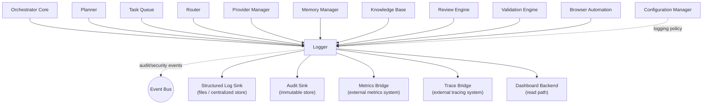

The Logger sits **beside** every other module as a shared, universally depended-upon service — every module calls into it; it calls out to no business module. Its only inbound dependency is the Configuration Manager (for logging policy) and the Security Layer (for masking/access-control rules); its only outbound relationships are to sinks and the Event Bus (for a narrow set of its own lifecycle/audit/security events, Section 9).

---

## 2. Goals

### 2.1 Primary Goals

- Provide structured logging as the platform's only sanctioned logging mechanism — no module writes directly to a file, console, or external logging service; every log passes through the Logger.
- Correlate every log entry with the platform's standard identity context (Section 13), so any log can be traced back to the exact request/task/session/trace it belongs to.
- Support centralized logging with multiple simultaneous sinks, so the same log stream can be routed to, for example, a structured file store, a centralized log aggregation service, and an audit-specific immutable store, concurrently.
- Support asynchronous logging and buffering so that log emission is decoupled from business-operation latency.
- Support log enrichment, filtering, and routing as independently configurable pipeline stages.
- Support audit logging, security logging, performance logging, and operational logging as distinct, purpose-built categories with different retention, immutability, and access-control characteristics.
- Support distributed tracing integration and a path to future OpenTelemetry adoption without requiring a redesign.

### 2.2 Secondary Goals

- Support configurable retention per log category.
- Support dynamic log levels, changeable at runtime without restart.
- Support runtime configuration changes for sinks, filters, and routing rules, sourced from the Configuration Manager's hot-reload mechanism.
- Support plugin logging, so provider plugins and browser automation engine plugins can log through the same pipeline as first-class platform modules, without being granted direct sink access.

### 2.3 Non-Goals

The Logger must never:

- Execute workflows, manage configuration, perform routing, execute providers, manage browser automation, perform validation, or perform review — every one of these belongs to its respective owning module.
- Contain business logic of any kind.
- Analyze logs or generate reports — log *analysis* (anomaly detection, trend reporting) is explicitly a future, external capability (Section 22), never a Logger-internal responsibility; the Logger's job ends at correct, reliable delivery of log data to sinks that other systems can analyze.
- Store business data — it stores log *records*, which may reference business identifiers (Section 13) but never contain business entity content itself (e.g. a log referencing a `taskId` never embeds the full task payload).

### 2.4 Design Constraints

- Must follow Clean Architecture, Hexagonal Architecture, SOLID, Dependency Inversion, and Event-Driven Architecture, consistent with every other module in this platform.
- Must be an Enterprise Modular Monolith component — internally cohesive, externally consumed through stable interfaces, deployable as part of the platform's modular monolith without requiring its own separate service boundary (though its sinks may be external services).
- Must never let logging failure impact business workflows — "best-effort logging without impacting business workflows" is a hard constraint, not an aspiration (Section 12, Section 16).
- Must guarantee flush-on-shutdown — no buffered log entry is silently lost on a graceful shutdown.
- Must never expose sensitive data (secrets, PII) in any log sink without masking (Section 15).

### 2.5 Future Goals

- Full OpenTelemetry integration, superseding the current Trace Bridge/Metrics Bridge abstraction with a standards-compliant implementation behind the same ports.
- Integration with ELK, Grafana Loki, Splunk, CloudWatch, and Azure Monitor as additional sink implementations.
- AI-assisted anomaly detection and real-time dashboards, built as external consumers of the Logger's output, never as Logger-internal logic.
- Multi-region log aggregation.

---

## 3. Responsibilities

### 3.1 Must Have

| # | Responsibility |
|---|---|
| M1 | Accept log requests from every platform module through a single, uniform public interface (Section 6). |
| M2 | Enrich every log entry with standard context (Section 13) automatically, without requiring the calling module to manually attach it. |
| M3 | Correlate log entries using the platform's identity fields (`requestId`, `traceId`, `spanId`, and the full set in Section 13), propagated automatically where the calling context carries them. |
| M4 | Route log entries to one or more registered sinks based on category (operational/audit/security/performance) and configured routing rules. |
| M5 | Buffer and batch log entries for asynchronous, non-blocking dispatch. |
| M6 | Guarantee that audit log entries are immutable once written and are never silently dropped, even under backpressure that may cause operational logs to be dropped (Section 12). |
| M7 | Mask sensitive data (secrets, PII, credentials) before any log entry leaves the Logger's trust boundary toward a sink. |
| M8 | Support runtime log-level changes and sink/filter/routing reconfiguration via the Configuration Manager's hot-reload mechanism, without requiring a Logger restart. |
| M9 | Guarantee flush-on-shutdown: on graceful shutdown, all buffered entries are dispatched (or, for entries that cannot be dispatched in time, handled per the configured shutdown-flush timeout and fallback policy, Section 12) before the process exits. |
| M10 | Publish the Logger's own lifecycle/health events (Section 9) so operators can observe the observability layer itself. |

### 3.2 Should Have

| # | Responsibility |
|---|---|
| S1 | Provide a Metrics Bridge and Trace Bridge so performance-relevant log data can additionally flow to dedicated metrics/tracing systems without duplicating instrumentation code in every module. |
| S2 | Support per-sink independent failure handling, so one failing sink does not block delivery to healthy sinks. |
| S3 | Support configurable log filtering (e.g. suppress `debug`-level logs from a specific module in production) applied before formatting/serialization, to reduce downstream volume. |
| S4 | Support plugin logging through a scoped, capability-limited interface distinct from the full platform-module interface (Section 6.19). |

### 3.3 Future Responsibilities

| # | Responsibility |
|---|---|
| F1 | Native OpenTelemetry span/trace emission. |
| F2 | Multi-region log aggregation and replication. |
| F3 | Structured log schema versioning and migration tooling as the platform's log schema evolves over time. |

---

## 4. Scope

### 4.1 What Logger Owns

Structured Logging · Log Correlation · Context Enrichment · Log Filtering · Log Routing · Log Formatting · Log Serialization · Log Buffering · Log Batching · Asynchronous Dispatch · Sink Management · Audit Logging · Security Logging · Performance Logging · Operational Logging · Log Retention Coordination (per-category retention policy application — not the retention *storage* implementation, which is sink-specific) · Dynamic Log Level Management · Metrics Bridging · Trace Bridging · Logger Health.

### 4.2 What Logger Never Owns

| Concern | Owning Module |
|---|---|
| Workflow execution | Orchestrator Core / Task Queue |
| Configuration lifecycle/storage | Configuration Manager |
| Routing decisions | Router |
| Provider execution | Provider Manager |
| Browser automation execution | Browser Automation |
| Validation logic | Validation Engine |
| Review logic | Review Engine |
| Memory management | Memory Manager |
| Knowledge management | Knowledge Base |
| Business rules of any kind | Respective owning modules |
| Log analysis / anomaly detection / reporting | External systems (future, Section 22) — never Logger-internal |
| Business entity persistence | Respective owning modules |

### 4.3 Other Module Responsibilities (For Context, Not Owned Here)

- **Deciding what to log and at what severity** — every calling module's own responsibility; the Logger provides the mechanism, never the judgment.
- **Sink infrastructure operation** (e.g. keeping a centralized log store healthy and scaled) — an infrastructure/operations concern; the Logger's Sink Manager treats sinks as pluggable adapters (Section 5.7) and reports sink health, but does not operate the sink's own infrastructure.
- **Trace/metrics system operation** — external systems the Trace Bridge/Metrics Bridge connect to, not implemented by the Logger.

---

## 5. Internal Architecture

The Logger is composed of twenty-two internal components, each independently testable and wired via Dependency Injection, consistent with Clean/Hexagonal Architecture.

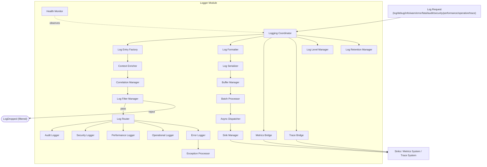

### 5.1 Logging Coordinator

**Purpose:** The single entry point and top-level conductor for every Logger public operation.

**Responsibilities:** Receive a normalized log request, sequence the pipeline (Entry Factory → Enrichment → Correlation → Filtering → Category-specific handling → Formatting → Serialization → Buffering → Batching → Dispatch), and ensure the call returns to the caller quickly regardless of downstream pipeline duration (Section 16.1).

**Interfaces:** Consumed by the public interface layer (Section 6); consumes every other internal component.

**Dependencies:** All other internal components.

**Internal communication:** Direct method calls to sequenced components; the pipeline past the Log Entry Factory always proceeds asynchronously relative to the calling module (Section 7, Section 16.1).

**Lifecycle:** Instantiated once per Logger instance; invoked once per log request.

### 5.2 Log Entry Factory

**Purpose:** Construct the canonical internal `LogEntry` object from a raw public-interface call.

**Responsibilities:** Normalize the caller-supplied message, severity, category, and any explicitly-passed context fields into the standard `LogEntry` shape (Section 13) before enrichment begins.

**Interfaces:** `create(rawLogCall) -> LogEntry`.

**Dependencies:** None (pure construction).

**Internal communication:** First stage invoked by the Logging Coordinator.

**Lifecycle:** Invoked once per log request.

### 5.3 Context Enricher

**Purpose:** Attach the standard platform context fields (Section 13) to a `LogEntry` automatically.

**Responsibilities:** Read ambient context (e.g. the current request/task execution context, if the calling module's runtime carries one via a context-propagation mechanism) and populate fields such as `requestId`, `sessionId`, `taskId`, `organizationId`, `namespaceId` without requiring the caller to pass them explicitly on every call.

**Interfaces:** `enrich(logEntry, ambientContext) -> LogEntry`.

**Dependencies:** A context-propagation port supplied by the platform's execution runtime (not owned by the Logger — Section 10).

**Internal communication:** Invoked immediately after the Log Entry Factory.

**Lifecycle:** Invoked once per log request.

### 5.4 Correlation Manager

**Purpose:** Own trace/span correlation specifically — `traceId`, `spanId`, and their propagation/generation rules — distinct from the broader Context Enricher.

**Responsibilities:** Generate a new `traceId`/`spanId` pair when a log entry originates a new trace context, or propagate an existing one when the calling context already carries one (e.g. a task's execution inherits its request's trace context).

**Interfaces:** `correlate(logEntry, traceContext) -> LogEntry`.

**Dependencies:** Trace Bridge (Section 5.21), for consistency with any external tracing system's ID format.

**Internal communication:** Invoked immediately after the Context Enricher.

**Lifecycle:** Invoked once per log request.

### 5.5 Log Filter Manager

**Purpose:** Apply configured filtering rules (log-level thresholds, module-specific suppression, category-specific rules) before a log entry proceeds further into the pipeline.

**Responsibilities:** Evaluate the entry against the Log Level Manager's current effective level for the entry's module/category, and against any additional configured filter rules, deciding pass/reject.

**Interfaces:** `filter(logEntry) -> FilterResult`.

**Dependencies:** Log Level Manager.

**Internal communication:** A rejected entry short-circuits the pipeline and results in a `LogDropped` event (with `reason: "filtered"`, distinguishing it from a drop due to buffer overflow — Section 9); it is not an error condition.

**Lifecycle:** Invoked once per log request that survives enrichment/correlation.

### 5.6 Log Router

**Purpose:** Determine which sink(s) and which category-specific handler(s) (Audit Logger, Security Logger, Performance Logger, Operational Logger, Error Logger) a given entry should flow to.

**Responsibilities:** Apply routing rules (Section 11, `logging.*` namespace) mapping category/severity/module to one or more destinations, supporting fan-out (a single entry may be both an operational log and, if flagged, also routed to the Security Logger).

**Interfaces:** `route(logEntry) -> RoutingDecision`.

**Dependencies:** Configuration Manager (routing rules).

**Internal communication:** Invoked after filtering; hands the entry to each category handler indicated by the routing decision, and separately to the Formatter/Serializer/Buffer/Dispatch path for sink delivery.

**Lifecycle:** Invoked once per log request.

### 5.7 Sink Manager

**Purpose:** Own the registered sink catalog and the delivery of formatted, serialized log batches to each.

**Responsibilities:** Track registered sinks (`registerSink()`/`removeSink()`, Section 6), their health (via the Health Monitor), and dispatch batches to each sink through its adapter interface, isolating one sink's failure from others (Section 12).

**Interfaces:** `registerSink(sinkConfig)`, `removeSink(sinkId)`, `dispatch(batch, sinkId)`.

**Dependencies:** Sink adapter implementations (infrastructure layer, Section 19).

**Internal communication:** The final stage the Async Dispatcher hands batches to.

**Lifecycle:** Long-lived; sinks are typically registered at startup and may be added/removed at runtime (Section 6.14/6.15).

### 5.8 Audit Logger

**Purpose:** Handle audit-category log entries with the immutability and never-dropped guarantees distinct from ordinary operational logs (Section 3.1, M6).

**Responsibilities:** Route audit entries to the audit-specific sink(s), bypassing any drop-under-backpressure behavior that may apply to operational logs, and ensure audit entries are never mutated after write.

**Interfaces:** Backs the public `audit()` interface (Section 6.7).

**Dependencies:** Sink Manager (audit-specific sink), Buffer Manager (a dedicated, higher-priority buffer lane for audit entries — Section 8.3).

**Internal communication:** Invoked by the Log Router for entries categorized `audit`.

**Lifecycle:** Invoked once per audit log request.

### 5.9 Security Logger

**Purpose:** Handle security-category log entries (authorization decisions, access-control failures, tamper-detection signals).

**Responsibilities:** Route security entries to security-specific sink(s) and, per configuration, additionally publish a corresponding `SecurityEventLogged` platform event (Section 9) for real-time alerting consumers.

**Interfaces:** Backs the public `security()` interface (Section 6.8).

**Dependencies:** Sink Manager, Event Publisher (for the platform-event side-channel).

**Internal communication:** Invoked by the Log Router for entries categorized `security`.

**Lifecycle:** Invoked once per security log request.

### 5.10 Performance Logger

**Purpose:** Handle performance-category log entries (latency measurements, throughput samples) and bridge relevant ones to the Metrics Bridge.

**Responsibilities:** Route performance entries to performance-specific sink(s) and, where the entry represents a metric-shaped value, forward it to the Metrics Bridge.

**Interfaces:** Backs the public `performance()` interface (Section 6.9).

**Dependencies:** Sink Manager, Metrics Bridge.

**Internal communication:** Invoked by the Log Router for entries categorized `performance`.

**Lifecycle:** Invoked once per performance log request.

### 5.11 Operational Logger

**Purpose:** Handle the default, general-purpose operational log category (the `log()`/`debug()`/`info()`/`warn()` family).

**Responsibilities:** Route operational entries to the standard operational sink(s), subject to normal backpressure/drop behavior (Section 12) — the category with the least strict delivery guarantee, appropriately, since it is the highest-volume category.

**Interfaces:** Backs the public `log()`, `debug()`, `info()`, `warn()` interfaces.

**Dependencies:** Sink Manager.

**Internal communication:** Invoked by the Log Router for entries categorized `operational` (the default category when none is explicitly specified).

**Lifecycle:** Invoked once per operational log request.

### 5.12 Error Logger

**Purpose:** Handle `error()`/`fatal()` severity entries with elevated handling (e.g. always flushed promptly rather than waiting for a normal batch interval).

**Responsibilities:** Route error/fatal entries through the Exception Processor for structured exception detail extraction, and prioritize their dispatch.

**Interfaces:** Backs the public `error()`/`fatal()` interfaces.

**Dependencies:** Exception Processor, Sink Manager.

**Internal communication:** Invoked by the Log Router for `error`/`fatal` severity regardless of category.

**Lifecycle:** Invoked once per error/fatal log request.

### 5.13 Exception Processor

**Purpose:** Extract structured detail (stack trace, error type, chained/caused-by relationships) from an error object passed to `error()`/`fatal()`.

**Responsibilities:** Normalize whatever error representation the calling module's runtime uses into the platform's standard structured exception shape within the `LogEntry`.

**Interfaces:** `processException(error) -> StructuredException`.

**Dependencies:** None (pure transformation).

**Internal communication:** Invoked by the Error Logger.

**Lifecycle:** Invoked once per error/fatal log request that includes an exception object.

### 5.14 Log Formatter

**Purpose:** Convert an enriched, correlated, routed `LogEntry` into the target output representation (structured JSON by default, Section 13).

**Responsibilities:** Apply the configured format (per sink, since different sinks may require different formats — Section 11, `format.*`) to the log entry.

**Interfaces:** `format(logEntry, formatSpec) -> FormattedEntry`.

**Dependencies:** Configuration Manager (`format.*` namespace).

**Internal communication:** Invoked by the Logging Coordinator after routing, before serialization.

**Lifecycle:** Invoked once per log request per target sink (a single entry may be formatted differently for different simultaneously-registered sinks).

### 5.15 Log Serializer

**Purpose:** Serialize a formatted entry into the wire/storage representation a given sink adapter expects (e.g. JSON string, protobuf, sink-specific SDK object).

**Responsibilities:** Perform the final encode step, applying masking (Section 15) as a mandatory pre-serialization step so no sensitive value is ever serialized into a sink-bound payload.

**Interfaces:** `serialize(formattedEntry) -> SerializedEntry`.

**Dependencies:** Masking rules (Security Layer, Section 10).

**Internal communication:** Invoked after formatting, before buffering.

**Lifecycle:** Invoked once per log request per target sink.

### 5.16 Buffer Manager

**Purpose:** Hold serialized entries in memory pending batch dispatch, decoupling log-emission latency from sink-dispatch latency.

**Responsibilities:** Maintain one or more buffer lanes (Section 8.3 — a dedicated, higher-priority lane for audit/security entries versus a standard lane for operational/performance entries), enforce configured buffer size limits, and signal the Batch Processor when a batch is ready (by size or time interval, whichever triggers first).

**Interfaces:** `enqueue(serializedEntry, lane)`, `drain(lane) -> SerializedEntry[]`.

**Dependencies:** None beyond its own in-memory structure and configured limits (`buffer.*`, Section 11).

**Internal communication:** Invoked after serialization; the Batch Processor pulls from it.

**Lifecycle:** Long-lived per Logger instance; flushed fully on shutdown (Section 6.16).

### 5.17 Batch Processor

**Purpose:** Group buffered entries into dispatch-ready batches.

**Responsibilities:** Pull entries from the Buffer Manager per configured batch size/interval (`batch.*`, Section 11), and hand completed batches to the Async Dispatcher.

**Interfaces:** `createBatch(lane) -> Batch`.

**Dependencies:** Buffer Manager.

**Internal communication:** Runs on a timer and/or size-threshold trigger, independent of any single log request's call stack.

**Lifecycle:** Continuously active background process.

### 5.18 Async Dispatcher

**Purpose:** Deliver batches to the Sink Manager without blocking the Batch Processor or any upstream component.

**Responsibilities:** Execute dispatch calls to the Sink Manager on a bounded concurrent execution pool, handle per-batch retry (Section 12) within its own retry policy, and report dispatch outcome (success, partial, failure) back through the standard event set (Section 9).

**Interfaces:** `dispatch(batch)`.

**Dependencies:** Sink Manager.

**Internal communication:** Invoked by the Batch Processor; the boundary past which all further work is fully decoupled from any calling module's request path.

**Lifecycle:** Continuously active; processes dispatch requests as they arrive from the Batch Processor.

### 5.19 Log Level Manager

**Purpose:** Own the platform's current effective log level configuration, globally and per-module/per-category override.

**Responsibilities:** Resolve the effective log level for a given entry's module/category (layered: global default → module override → category override, mirroring the layered-override pattern established in the Configuration Manager MDD), and apply runtime changes (`setLogLevel()`, Section 6.11) immediately, without restart.

**Interfaces:** `getEffectiveLevel(module, category) -> LogLevel`, `setLevel(scope, level)`.

**Dependencies:** Configuration Manager (`levels.*` namespace, initial/default values); runtime overrides via `setLogLevel()` take precedence over configuration-sourced defaults until explicitly reset.

**Internal communication:** Consulted by the Log Filter Manager on every log request.

**Lifecycle:** Long-lived; updated on configuration change events and explicit `setLogLevel()` calls.

### 5.20 Log Retention Manager

**Purpose:** Apply per-category retention policy at the orchestration level — instructing sinks on retention where the sink adapter interface supports it, and tracking retention compliance.

**Responsibilities:** Resolve the effective retention window per category (`retention.*`, Section 11) and pass it to sink adapters at registration/dispatch time where the sink's own storage supports retention configuration; the Logger does not implement retention enforcement itself where the sink is the system of record for that.

**Interfaces:** `getRetentionPolicy(category) -> RetentionPolicy`.

**Dependencies:** Configuration Manager.

**Internal communication:** Consulted by the Sink Manager at sink registration and periodically for compliance reporting (Section 14).

**Lifecycle:** Long-lived; updated on configuration change.

### 5.21 Metrics Bridge

**Purpose:** Forward metric-shaped log data (primarily from the Performance Logger) to an external metrics system.

**Responsibilities:** Translate a performance `LogEntry` into the target metrics system's data model (counter, gauge, histogram) and emit it through the metrics system's adapter port.

**Interfaces:** `emitMetric(metricData)`.

**Dependencies:** An external metrics system adapter (infrastructure layer, Section 19).

**Internal communication:** Invoked by the Performance Logger; entirely decoupled from the standard sink-dispatch path (a metric emission failure never affects log delivery, and vice versa).

**Lifecycle:** Invoked once per performance log request that qualifies as metric-shaped.

### 5.22 Trace Bridge

**Purpose:** Forward trace/span data to an external distributed tracing system, and supply trace-ID-format consistency to the Correlation Manager.

**Responsibilities:** Translate `traceId`/`spanId` correlation data into the target tracing system's span representation, and emit it through the tracing system's adapter port; this is the component future OpenTelemetry integration (Section 22) replaces/extends.

**Interfaces:** `emitSpan(spanData)`, `getIdFormat() -> TraceIdFormat`.

**Dependencies:** An external tracing system adapter (infrastructure layer, Section 19).

**Internal communication:** Consulted by the Correlation Manager (ID format); invoked by the Logging Coordinator for entries carrying trace context.

**Lifecycle:** Invoked once per log request carrying trace context that qualifies for span emission.

### 5.23 Health Monitor

**Purpose:** Observe the Logger's own operational health — sink health, buffer utilization, dispatch success rate — independent of the operational request path.

**Responsibilities:** Aggregate sink health signals (via the Sink Manager), buffer/queue depth (via the Buffer Manager), and dispatch outcome rates (via the Async Dispatcher) into the health status backing the public `health()` interface (Section 6.17) and the `ConfigurationHealthChanged`-analogous `LoggerHealthChanged`-class monitoring described in Section 14.

**Interfaces:** Backs the public `health()` interface.

**Dependencies:** Sink Manager, Buffer Manager, Async Dispatcher (all read-only).

**Internal communication:** Read-only observer; never influences the logging pipeline's behavior directly, only reports on it.

**Lifecycle:** Continuously active background aggregation.

---

## 6. Public Interfaces

### 6.1 `log(entry)`

- **Purpose:** Generic entry point equivalent to `info()`-level operational logging, provided for callers that construct a full `LogEntry`-shaped payload directly rather than using a severity-named convenience method.
- **Inputs:** A partial `LogEntry` (message, optional explicit context fields, optional category override).
- **Outputs:** None (fire-and-forget; Section 16.1) — or, for callers that opt into confirmation, a lightweight acknowledgment once the entry has been accepted into the pipeline (not once it has been dispatched to a sink).
- **Validation:** Message presence; category, if specified, must be a recognized category.
- **Error Conditions:** `InvalidLogEntryError` (thrown synchronously, before the async pipeline begins, since a malformed call is a programming error the caller should see immediately — this is the one case where the Logger's "never blocks the caller" principle yields to "never silently accept garbage").
- **Side Effects:** Publishes `LogCreated`; eventually results in `LogBuffered` and `LogDispatched` (or `LogDropped`) asynchronously.

### 6.2 `debug(message, context)`

- **Purpose:** Emit a `debug`-severity operational log entry.
- **Inputs:** `message`, optional `context` fields.
- **Outputs:** None (fire-and-forget).
- **Validation:** Message presence.
- **Error Conditions:** `InvalidLogEntryError`.
- **Side Effects:** Subject to Log Filter Manager suppression if the effective level for the calling module/category is above `debug` — in which case the call is a cheap no-op past the filter check (Section 16.1).

### 6.3 `info(message, context)`

- **Purpose:** Emit an `info`-severity operational log entry.
- **Inputs / Outputs / Validation / Error Conditions / Side Effects:** As `debug()`, at `info` severity.

### 6.4 `warn(message, context)`

- **Purpose:** Emit a `warn`-severity operational log entry.
- **Inputs / Outputs / Validation / Error Conditions / Side Effects:** As `debug()`, at `warn` severity; `warn` entries are never filtered by default level configuration (only explicit suppression rules can filter them), reflecting their operational significance.

### 6.5 `error(message, error, context)`

- **Purpose:** Emit an `error`-severity entry, routed through the Error Logger and Exception Processor.
- **Inputs:** `message`, optional `error` object, optional `context`.
- **Outputs:** None (fire-and-forget), but dispatch is prioritized (Section 5.12).
- **Validation:** Message presence.
- **Error Conditions:** `InvalidLogEntryError`.
- **Side Effects:** Never filtered/dropped due to log-level suppression (error/fatal are always above any configured threshold); may still be dropped under extreme buffer-overflow conditions per Section 12, in which case a `LogDropped` event with `severity: "error"` is itself elevated to a Health Monitor alert condition.

### 6.6 `fatal(message, error, context)`

- **Purpose:** Emit a `fatal`-severity entry, typically preceding process termination in the calling module.
- **Inputs / Outputs / Validation / Error Conditions:** As `error()`.
- **Side Effects:** Triggers an expedited flush of the relevant buffer lane (not a full `flush()`, to avoid delaying the caller further) before returning, since a `fatal` log is frequently the last log a terminating process will emit.

### 6.7 `audit(entry)`

- **Purpose:** Emit an audit-category log entry, routed through the Audit Logger with immutability and never-dropped guarantees.
- **Inputs:** A structured audit `entry` (operation, actor identity, target, outcome — mirroring the shape used by the Configuration Manager MDD's own Audit Manager, generalized here as the platform-wide audit logging mechanism every module's own audit trail is built on).
- **Outputs:** None (fire-and-forget), but backed by the highest-priority buffer lane (Section 8.3).
- **Validation:** Required fields (operation, actor, timestamp — auto-populated if omitted) present.
- **Error Conditions:** `InvalidAuditEntryError`.
- **Side Effects:** Publishes `AuditLogged`; never subject to the drop-under-backpressure behavior that can affect operational logs (Section 12).

### 6.8 `security(entry)`

- **Purpose:** Emit a security-category log entry.
- **Inputs:** A structured security `entry` (event type, actor, resource, outcome).
- **Outputs:** None (fire-and-forget).
- **Validation:** Required fields present.
- **Error Conditions:** `InvalidSecurityEntryError`.
- **Side Effects:** Publishes `SecurityEventLogged`, which may additionally trigger real-time alerting per Section 14.

### 6.9 `performance(entry)`

- **Purpose:** Emit a performance-category log entry, optionally bridged to the Metrics Bridge.
- **Inputs:** A structured performance `entry` (metric name, value, unit, dimensions).
- **Outputs:** None (fire-and-forget).
- **Validation:** Required fields present; value must be numeric where the entry is metric-shaped.
- **Error Conditions:** `InvalidPerformanceEntryError`.
- **Side Effects:** Publishes `PerformanceLogged`; forwards to Metrics Bridge if applicable.

### 6.10 `operation(entry)`

- **Purpose:** Emit an explicitly-categorized operational log entry (functionally similar to `log()`/`info()` but allowing the caller to set operational-specific structured fields, e.g. an operation name/outcome pair, without constructing a raw `LogEntry`).
- **Inputs:** A structured operation `entry` (operation name, outcome, duration).
- **Outputs:** None (fire-and-forget).
- **Validation:** Required fields present.
- **Error Conditions:** `InvalidLogEntryError`.
- **Side Effects:** Standard operational pipeline handling.

### 6.11 `trace(entry)`

- **Purpose:** Emit a trace/span-shaped entry, forwarded to the Trace Bridge.
- **Inputs:** Span data (`traceId`, `spanId`, parent span reference, operation name, duration).
- **Outputs:** None (fire-and-forget).
- **Validation:** `traceId` presence (generated via the Correlation Manager if absent and this is a trace-originating call).
- **Error Conditions:** `InvalidTraceEntryError`.
- **Side Effects:** Forwards to Trace Bridge; may also produce a corresponding operational log entry per configuration (`tracing.*`, Section 11) for platforms not yet running a full external tracing system.

### 6.12 `setLogLevel(scope, level)`

- **Purpose:** Change the effective log level at runtime for a given scope (global, module, or category).
- **Inputs:** `scope` (global / module ID / category), `level`.
- **Outputs:** Confirmation of the new effective level.
- **Validation:** `level` must be a recognized severity; `scope` must resolve to a known module/category or be `global`.
- **Error Conditions:** `InvalidLogLevelError`, `UnknownScopeError`.
- **Side Effects:** Publishes `LogLevelChanged`; takes effect immediately for all subsequent log calls (no restart, no propagation delay beyond the Log Level Manager's own update).

### 6.13 `registerSink(sinkConfig)`

- **Purpose:** Register a new log sink at runtime (or at startup, via the same interface).
- **Inputs:** `sinkConfig` (sink ID, sink type/adapter reference, target categories, format spec, retention reference).
- **Outputs:** Registration confirmation.
- **Validation:** Sink ID uniqueness; sink adapter must be a recognized/registered implementation (Section 19).
- **Error Conditions:** `DuplicateSinkIdError`, `UnknownSinkTypeError`, `InvalidSinkConfigError`.
- **Side Effects:** Publishes `SinkRegistered`; the sink becomes eligible for routing immediately.

### 6.14 `removeSink(sinkId)`

- **Purpose:** Deregister a sink at runtime.
- **Inputs:** `sinkId`.
- **Outputs:** Removal confirmation.
- **Validation:** Sink must exist.
- **Error Conditions:** `SinkNotFoundError`.
- **Side Effects:** Publishes `SinkRemoved`; any in-flight batches already dispatched to that sink are allowed to complete, but no new batches are routed to it after removal.

### 6.15 `flush()`

- **Purpose:** Force immediate dispatch of all currently buffered entries across all lanes, bypassing the normal batch size/interval trigger.
- **Inputs:** Optional `timeout`.
- **Outputs:** Flush completion confirmation, including counts of successfully dispatched vs. any entries that could not be dispatched within the timeout.
- **Validation:** None.
- **Error Conditions:** `FlushTimeoutError` (returned as part of the result, not necessarily thrown — see Section 12).
- **Side Effects:** Publishes `FlushStarted` and `FlushCompleted`.

### 6.16 `shutdown()`

- **Purpose:** Gracefully shut down the Logger, guaranteeing flush-on-shutdown (Section 3.1, M9).
- **Inputs:** Optional `timeout`.
- **Outputs:** Shutdown completion confirmation.
- **Validation:** None.
- **Error Conditions:** None thrown; a shutdown that cannot fully flush within timeout still completes (per the configured fallback strategy, Section 12) rather than hanging the platform's own shutdown sequence indefinitely.
- **Side Effects:** Publishes `LoggerShutdownStarted`, performs an internal `flush()`, publishes `LoggerShutdownCompleted`; after this point, the Logger accepts no further log calls (Section 8.1) — callers attempting to log after shutdown receive a best-effort local fallback (Section 12) rather than an exception, consistent with the "never impact business workflows" constraint.

### 6.17 `health()`

- **Purpose:** Read-only query of the Logger's own operational health.
- **Inputs:** None.
- **Outputs:** `LoggerHealthStatus` (overall status, per-sink health, buffer utilization, recent dispatch success rate).
- **Validation:** None.
- **Error Conditions:** None.
- **Side Effects:** None.

---

## 7. Internal Workflow

### 7.1 Log Creation

A calling module invokes one of the severity/category-named public interfaces (Section 6). The Logging Coordinator immediately constructs the `LogEntry` via the Log Entry Factory and returns control to the caller as soon as the entry has been handed off for asynchronous processing (Section 16.1) — the caller never waits for enrichment, formatting, or dispatch.

### 7.2 Context Enrichment and Correlation

The Context Enricher and Correlation Manager populate the standard field set (Section 13) from ambient execution context. This happens on the async path, not synchronously in the caller's call stack.

### 7.3 Filtering

The Log Filter Manager checks the entry against the Log Level Manager's current effective level and any configured suppression rules. A filtered entry is dropped here with a `LogDropped(reason: "filtered")` event — an expected, non-exceptional outcome, not a failure.

### 7.4 Routing

The Log Router determines category handling (Audit/Security/Performance/Operational/Error Logger) and sink targets.

### 7.5 Formatting and Serialization

The Log Formatter and Log Serializer produce the sink-ready payload, with masking (Section 15) applied during serialization as a mandatory step.

### 7.6 Buffering and Batching

The Buffer Manager enqueues the serialized entry into the appropriate lane (Section 8.3); the Batch Processor groups entries into batches by size/interval trigger.

### 7.7 Dispatch

The Async Dispatcher hands completed batches to the Sink Manager, which delivers to each registered, eligible sink through its adapter, in parallel across sinks, isolating failures per sink (Section 12).

### 7.8 Persistence

Persistence itself is the responsibility of each sink's own backing store (a file store, a centralized log service, an immutable audit store) — the Logger's Sink Manager delivers to the sink's adapter interface and considers its own responsibility discharged once the adapter confirms receipt; it does not implement storage itself, mirroring the Memory Manager MDD's provider-delegation pattern.

### 7.9 Flush

`flush()` (Section 6.15) short-circuits the normal batch-interval trigger, instructing the Batch Processor to immediately form and dispatch batches from all current buffer contents.

### 7.10 Shutdown

`shutdown()` (Section 6.16) performs an internal flush with a bounded timeout, then transitions the Logger to a terminal state that rejects (with local fallback, not exception) further log calls.

### 7.11 Sequence Diagram — Standard Log Entry Flow

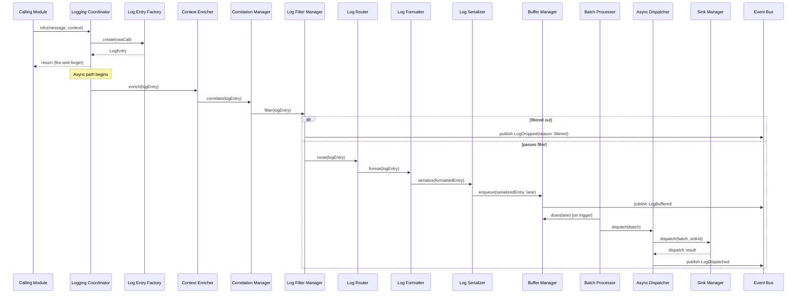

### 7.12 Sequence Diagram — Flush and Shutdown

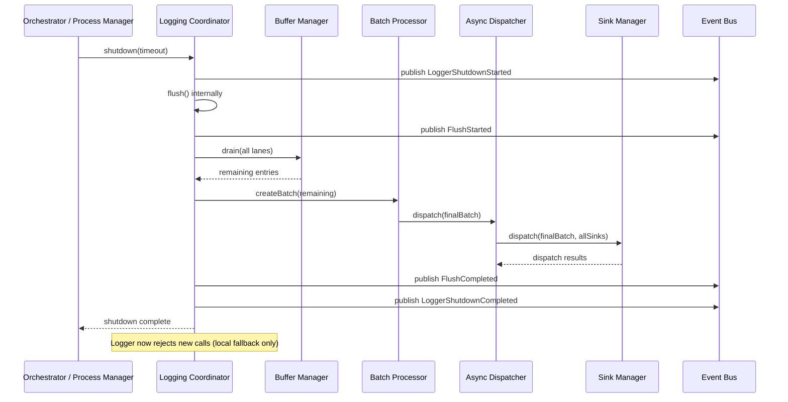

---

## 8. State Management

### 8.1 Logger Lifecycle

The Logger instance itself moves through: `Initializing → Ready → Running → Draining → ShuttingDown → Terminated`. Log calls are accepted throughout `Ready`/`Running`; during `Draining`/`ShuttingDown`, new calls receive local-fallback handling (Section 12) rather than being queued indefinitely; `Terminated` accepts no calls at all.

### 8.2 Sink Lifecycle

A sink moves through: `Registering → Validating → Active → Degraded → Failed → Removed`. `Degraded` reflects intermittent dispatch failures below the threshold that would mark it `Failed` (Section 12); a `Failed` sink is excluded from routing until it self-reports recovery (`SinkRecovered`, Section 9) or is explicitly removed and re-registered.

### 8.3 Buffer Lifecycle

Each buffer lane (at minimum: a `standard` lane for operational/performance/security entries and a `priority` lane for audit and error/fatal entries) moves through: `Empty → Accumulating → Ready-for-Batch → Draining → Empty`. The `priority` lane has a smaller size trigger and shorter time trigger than the `standard` lane, reflecting its stricter delivery guarantee (Section 3.1, M6).

### 8.4 Batch Lifecycle

A batch moves through: `Forming → Ready → Dispatching → Delivered` or `Dispatching → PartiallyDelivered/Failed → Retrying → Delivered/DeadLettered`. A batch that exhausts its dispatch retry budget (Section 12) for a given sink is not silently discarded for `audit`-category content — that content is escalated (Section 12) rather than dead-lettered the way an operational-category batch would be.

### 8.5 Flush Lifecycle

`Idle → Flushing → Complete`, entered either by explicit `flush()`/`shutdown()` calls or by the Batch Processor's own normal size/interval triggers (which are, architecturally, small continuous flushes rather than a fundamentally different mechanism).

### 8.6 Recovery

A `Failed` sink's recovery is detected by the Health Monitor's periodic health-check calls to the sink adapter; on recovery, `SinkRecovered` is published and the sink re-enters `Active` routing eligibility. Entries buffered during the sink's failure window (if retained per the fallback strategy, Section 12) are redelivered on recovery where the sink adapter supports idempotent/replay delivery; otherwise they are considered lost for that sink only (other healthy sinks that received the same entries are unaffected).

### 8.7 Synchronization (Multi-Instance)

In a horizontally scaled deployment (Section 16.7), each Logger instance operates independently — there is no shared in-memory buffer state across instances. Correlation IDs (Section 13) are what allow logs from the same logical request/task to be reassembled downstream (at the sink/aggregation layer) even though they may have been processed by different Logger instances.

### 8.8 Shutdown

See Section 7.10/7.12.

### 8.9 State Diagram

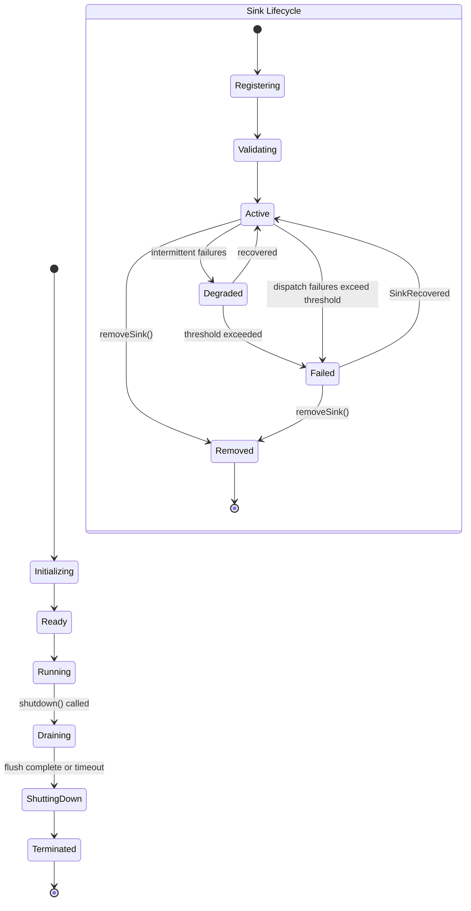

---

## 9. Events

| Event | Publisher | Consumers | Payload | Trigger | Failure Behavior |
|---|---|---|---|---|---|
| `LogCreated` | Log Entry Factory (via Logging Coordinator) | Health Monitor (volume tracking) | `{ entryId, category, severity, module }` | Fired immediately on entry construction. | Not retried; a failure to publish this internal-volume-tracking event never blocks the log pipeline itself. |
| `LogBuffered` | Buffer Manager | Health Monitor | `{ entryId, lane, bufferDepth }` | Fired when an entry is enqueued into a buffer lane. | Not retried. |
| `LogDispatched` | Async Dispatcher | Health Monitor, Dashboard Backend (aggregated) | `{ batchId, sinkId, entryCount, latencyMs }` | Fired on successful batch delivery to a sink. | Not retried (the event itself; the underlying dispatch has its own retry policy, Section 12). |
| `LogDropped` | Log Filter Manager (filtered) or Buffer Manager (overflow) | Health Monitor, Dashboard Backend | `{ entryId, reason: "filtered"|"overflow", category, severity }` | Fired whenever an entry does not reach a sink, for whatever reason. | Not retried; a sustained high drop rate for non-`filtered` reasons triggers a Health Monitor alert (Section 14). |
| `BufferOverflow` | Buffer Manager | Health Monitor, Alerting | `{ lane, capacity, currentDepth }` | Fired when a buffer lane reaches its configured capacity limit and must begin dropping (or, for the `priority` lane, escalating rather than dropping — Section 12). | Not retried. |
| `FlushStarted` | Logging Coordinator | Logger, Dashboard Backend | `{ trigger: "explicit"|"shutdown"|"scheduled" }` | Fired at the start of any flush operation. | Not retried. |
| `FlushCompleted` | Logging Coordinator | Logger, Dashboard Backend | `{ trigger, entriesFlushed, entriesFailed, durationMs }` | Fired at flush completion (success or timeout). | Not retried. |
| `SinkRegistered` | Sink Manager | Logger, Dashboard Backend | `{ sinkId, sinkType, categories }` | Fired on successful `registerSink()`. | Not retried. |
| `SinkRemoved` | Sink Manager | Logger, Dashboard Backend | `{ sinkId }` | Fired on successful `removeSink()`. | Not retried. |
| `SinkFailed` | Sink Manager (via Health Monitor threshold) | Logger, Dashboard Backend, Alerting | `{ sinkId, failureReason, consecutiveFailures }` | Fired when a sink's dispatch failure rate crosses the configured `Degraded → Failed` threshold. | Not retried. |
| `SinkRecovered` | Sink Manager (via Health Monitor) | Logger, Dashboard Backend | `{ sinkId, downtimeDurationMs }` | Fired when a `Failed` sink's health check next succeeds. | Not retried. |
| `LogLevelChanged` | Log Level Manager | Logger, Dashboard Backend | `{ scope, previousLevel, newLevel, changedBy }` | Fired on `setLogLevel()` or a Configuration Manager-sourced `levels.*` change. | Not retried. |
| `AuditLogged` | Audit Logger | Logger, Dashboard Backend, Event Bus subscribers tracking compliance | `{ entryId, operation, actor, outcome }` (masked per Section 15) | Fired on every successful `audit()` call. | Not retried; audit entries are never silently dropped (Section 3.1, M6), so this event's absence for an attempted audit call is itself an alertable condition. |
| `SecurityEventLogged` | Security Logger | Logger, Dashboard Backend, Alerting | `{ entryId, eventType, actor, outcome }` (masked) | Fired on every successful `security()` call. | Not retried. |
| `PerformanceLogged` | Performance Logger | Logger, Dashboard Backend, Metrics Bridge (internal forward) | `{ entryId, metricName, value, unit }` | Fired on every successful `performance()` call. | Not retried. |
| `LoggerShutdownStarted` | Logging Coordinator | Logger, Dashboard Backend, all platform modules (informational) | `{ initiatedBy }` | Fired at the start of `shutdown()`. | Not retried. |
| `LoggerShutdownCompleted` | Logging Coordinator | Logger, Dashboard Backend | `{ entriesFlushed, entriesLost, durationMs }` | Fired at the end of `shutdown()`. | Not retried. |

---

## 10. Dependencies

| Dependency | Nature | Notes |
|---|---|---|
| **Configuration Manager** | Infrastructure/upstream dependency | Supplies `logging.*`, `levels.*`, `sinks.*`, `buffer.*`, `batch.*`, `format.*`, `retention.*`, `correlation.*`, `tracing.*` namespaces (Section 11); the Logger registers as a consumer per the Configuration Manager MDD's standard `registerConsumer()`/`subscribe()` pattern and hot-reloads on change. |
| **Event Bus** | Infrastructure port | Publishes the full event set (Section 9); the Logger does not subscribe to business-module events (it is a universal dependency, not a reactive one), only to Configuration Manager change notifications relevant to its own namespaces. |
| **Security Layer** | Infrastructure port | Supplies masking rules (Section 15) and access-control checks for log-read interfaces (e.g. Dashboard Backend queries against audit/security logs). |
| **Storage Adapter** | Infrastructure port (consumed via sink adapters, Section 5.7) | Not a single fixed dependency — each registered sink has its own storage adapter implementation; the Logger's core depends only on the sink adapter interface (Section 19), never a concrete storage technology. |
| **Metrics System** | Infrastructure port (Metrics Bridge, Section 5.21) | External system; swappable adapter. |
| **Trace System** | Infrastructure port (Trace Bridge, Section 5.22) | External system; swappable adapter, with OpenTelemetry as the planned future default (Section 22). |

**Never depends on business modules.** The Logger does not call, subscribe to, or otherwise depend on the Orchestrator Core, Planner, Task Queue, Router, Provider Manager, Model Registry, Capability Selector, Memory Manager, Knowledge Base, Review Engine, Validation Engine, or Browser Automation. Every one of them depends on the Logger; the dependency direction never reverses.

---

## 11. Configuration

| Namespace | Purpose | Default | Validation | Constraints | Notes |
|---|---|---|---|---|---|
| `logging.*` | General pipeline behavior (default category, routing rules). | Category `operational` for unqualified `log()` calls. | Valid category enum. | Routing rules reference only registered sink IDs. | Consumed by the Log Router. |
| `audit.*` | Audit-specific behavior (dedicated sink reference, escalation policy on delivery failure). | Escalate-never-drop. | Sink reference must exist. | Cannot be configured to allow silent drop (Section 3.1, M6 is enforced as a non-overridable invariant, not merely a default). | Consumed by the Audit Logger. |
| `securityLogging.*` | Security-specific behavior (alerting integration toggle). | Alerting enabled. | Boolean. | — | Consumed by the Security Logger. |
| `performanceLogging.*` | Performance-specific behavior (Metrics Bridge forwarding toggle, sampling rate). | Forwarding enabled, 100% sampling. | Sampling rate 0–1. | — | Consumed by the Performance Logger, Metrics Bridge. |
| `retention.*` | Per-category retention windows. | Operational: 30 days; Audit: per compliance requirement (typically longer, e.g. 1+ years); Security: aligned with Audit. | Positive duration. | Audit/Security retention floor may be platform-enforced (cannot be configured shorter than a compliance minimum). | Consumed by the Log Retention Manager. |
| `sinks.*` | Registered sink definitions (type, target categories, format reference). | Empty (must be explicitly configured per environment). | Schema per sink adapter's declared configuration contract. | — | Consumed by the Sink Manager. |
| `buffer.*` | Buffer lane size limits, overflow behavior. | Standard lane: size-bounded with drop-oldest on overflow; Priority lane: larger headroom, escalate rather than drop. | Positive integer sizes. | Priority lane overflow behavior cannot be set to `drop` (mirrors the `audit.*` invariant). | Consumed by the Buffer Manager. |
| `batch.*` | Batch size and time-interval triggers, per lane. | Standard: 100 entries or 5s, whichever first; Priority: 10 entries or 1s. | Positive integers/durations. | — | Consumed by the Batch Processor. |
| `levels.*` | Global and per-module/category default log levels. | Global `info` in production, `debug` in development (profile-driven, per the Configuration Manager's profile layering). | Valid severity enum. | `error`/`fatal` can never be filtered below their own severity (Section 6.5). | Consumed by the Log Level Manager. |
| `format.*` | Per-sink output format spec. | Structured JSON. | Recognized format identifier. | — | Consumed by the Log Formatter. |
| `correlation.*` | Correlation ID generation/propagation rules. | Auto-generate `traceId` if absent from ambient context. | — | — | Consumed by the Correlation Manager. |
| `tracing.*` | Trace Bridge target and dual-emission (trace + operational log) toggle. | Dual emission enabled until a full external tracing system is configured. | — | — | Consumed by the Trace Bridge. |

---

## 12. Error Handling

| Failure Condition | Detection Point | Recovery Strategy |
|---|---|---|
| **Sink Failure** | Sink Manager (dispatch call fails or times out) | Isolated per sink — other sinks continue receiving batches normally. Consecutive failures beyond a configured threshold transition the sink to `Failed` (Section 8.2), publishing `SinkFailed`; the sink is excluded from routing until `SinkRecovered`. |
| **Buffer Overflow** | Buffer Manager | Standard lane: drop-oldest (or drop-newest, per configuration) with `LogDropped(reason: "overflow")` and `BufferOverflow` published. Priority lane (audit/error): never silently drops — instead applies backpressure to the Batch Processor (accepting a brief queuing delay) or, if truly exhausted, escalates via a dedicated local fallback sink (e.g. local disk write) rather than losing the entry. |
| **Serialization Failure** | Log Serializer | The specific entry is dropped with a structured `LogDropped(reason: "serialization-error")`, logged (about itself) at `error` severity through the Error Logger's own path — a serialization bug must never crash the pipeline for subsequent entries. |
| **Formatting Failure** | Log Formatter | Same handling as Serialization Failure. |
| **Storage Failure** | Sink adapter (reported through the Sink Manager) | Treated identically to Sink Failure — the Logger has no direct storage dependency of its own to fail (Section 10). |
| **Permission Failure** | Sink adapter (e.g. access denied writing to a target) | Treated as a Sink Failure; additionally logged (about itself) at `security`-relevant severity since a permission failure may indicate a misconfiguration or intrusion attempt worth security-log visibility. |
| **Flush Failure** | Logging Coordinator (`flush()`/`shutdown()` timeout) | Returns a result indicating partial completion (entries flushed vs. not) rather than throwing; for `shutdown()` specifically, any entries that could not be flushed within the timeout are recorded in `LoggerShutdownCompleted`'s `entriesLost` count rather than blocking process exit indefinitely. |
| **Shutdown Failure** | Logging Coordinator | Bounded by the same timeout mechanism as Flush Failure; the Logger always completes its shutdown sequence within the configured timeout ceiling, prioritizing platform shutdown liveness over guaranteed zero log loss in a hard-deadline scenario. |

**General Recovery Principle:** The Logger's overriding constraint is "never impact business workflows" (Section 2.4) — every failure mode above is handled by the Logger itself (isolate, retry, drop-with-visibility, or escalate-to-local-fallback), and never by propagating an exception back to a calling module's business logic. The one deliberate exception is `InvalidLogEntryError`-class validation failures (Section 6), which are synchronous, immediate, and intentional — a malformed logging call is a bug in the calling module's own code that should fail loudly during development, not silently succeed and hide the defect.

### 12.1 Retry Strategy

Sink dispatch failures are retried by the Async Dispatcher with exponential backoff up to a configured per-sink retry limit before the sink is marked `Degraded`/`Failed` (Section 8.2); audit-category dispatch retries do not have an upper limit that results in silent drop — exhausting the normal retry budget for an audit entry triggers escalation (local fallback write plus an `error`-severity self-log) rather than abandonment.

### 12.2 Fallback Strategy

A configured **local fallback sink** (e.g. local disk, always registered by default and never removable via `removeSink()`) exists specifically to catch audit/priority-lane entries that cannot be delivered to their primary sink(s), guaranteeing the "never silently lost" invariant even during a total external-sink outage.

---

## 13. Logging (Policy)

This section documents the Logger's own structured logging policy — the shape every log entry conforms to, distinct from Section 12/Section 15's handling of the Logger's *own* internal operational logs about itself.

### 13.1 Structured JSON

Every log entry is represented internally, and by default formatted for sinks, as structured JSON — never unstructured free-text — so that every field is independently queryable/filterable at the sink/aggregation layer.

### 13.2 Standard Context Fields

Every log entry supports the following standardized context fields where applicable to the emitting module's execution context:

| Field | Description |
|---|---|
| `requestId` | The originating platform request, per the Request Manager MDD. |
| `sessionId` | The active session, per the Memory Manager MDD's session model. |
| `projectId` | The owning project. |
| `taskId` | The Task Queue task, if applicable. |
| `planId` | The Planner-produced plan/workflow identifier. |
| `providerId` | The AI provider involved, if applicable. |
| `modelId` | The specific model involved, if applicable. |
| `pluginId` | The plugin involved, if applicable (Provider Plugin System / Browser Automation Engine Plugin System). |
| `browserSessionId` | The Browser Automation session, if applicable. |
| `reviewId` | The Review Engine review instance, if applicable. |
| `validationId` | The Validation Engine validation run, if applicable. |
| `workflowId` | The Task Queue workflow identifier (Task Queue MDD Section 7). |
| `organizationId` | The tenant/organization. |
| `namespaceId` | The resolved namespace path (Memory Manager / Task Queue MDD convention). |
| `correlationId` | A general-purpose correlation identifier for cases not covered by a more specific ID above. |
| `traceId` | Distributed trace identifier. |
| `spanId` | Distributed trace span identifier. |
| `userId` | The acting human user, if applicable (many platform operations are system/agent-initiated with no `userId`). |
| `tenantId` | Synonymous with `organizationId` in single-word form, retained as a distinct field for compatibility with external systems (e.g. multi-tenant SaaS tracing conventions) that expect this exact field name. |

Additionally: `severity`, `timestamp`, `eventCategory` (operational/audit/security/performance), `moduleName`, `componentName` are always present on every entry regardless of the fields above, since they are intrinsic to the entry itself rather than contextual.

### 13.3 Correlation IDs, Request IDs, Session IDs, Trace IDs, Span IDs

Populated automatically by the Context Enricher and Correlation Manager (Sections 5.3, 5.4) from ambient execution context wherever the platform's context-propagation mechanism carries them, requiring no manual attachment by the calling module in the common case.

---

## 14. Monitoring

| Metric | Description |
|---|---|
| **logs/sec** | Log entry throughput, overall and per category/module. |
| **Buffer Utilization** | Current depth vs. capacity, per lane. |
| **Flush Duration** | Latency of flush operations (scheduled and explicit). |
| **Dropped Logs** | Count and rate, broken down by `reason` (filtered vs. overflow vs. serialization-error). |
| **Sink Latency** | Per-sink dispatch latency distribution. |
| **Sink Failures** | Per-sink failure count/rate, current health state. |
| **Queue Depth** | Async Dispatcher's pending-batch queue depth. |
| **Serialization Latency** | Time spent in the Log Formatter/Serializer stages. |
| **Storage Latency** | End-to-end latency as reported by sink adapters, where the underlying storage exposes it. |

Health monitoring aggregates the above into an overall Logger health status (Section 6.17); alerts are configured (via the Configuration Manager, `logging.*`/`securityLogging.*`) for sustained elevated drop rates, sink failure, buffer-overflow events on the priority lane specifically (a stronger signal than standard-lane overflow), and Logger shutdown-with-loss events.

---

## 15. Security

### 15.1 Audit Logging / Immutable Audit Logs

Audit entries (Section 6.7) are never mutated after write; the audit sink's own storage characteristic (append-only, or a write-once backing store) is a requirement the Sink Manager validates at audit-sink registration time (Section 6.13), not merely a convention.

### 15.2 Sensitive Data Masking / PII Masking / Secret Masking / Credential Protection

The Log Serializer applies masking (Section 5.15) as a mandatory pre-serialization step, using masking rules supplied by the Security Layer — the same masking discipline established in the Configuration Manager MDD's Section 15.1/15.6 is applied here to log content specifically: any field matching a configured sensitive-data pattern (secret references, credential-shaped values, declared PII fields) is replaced with a redaction marker before any sink ever receives it.

### 15.3 Access Control

Read access to log data (e.g. via the Dashboard Backend querying audit/security logs) is authorized against the Security Layer, distinct from write access (which every platform module has by design, since logging is universally available); audit/security category reads specifically require elevated authorization beyond general operational-log read access.

### 15.4 Tamper Detection / Log Integrity

Audit sink entries include an integrity mechanism (e.g. a content hash, chained per the Configuration Manager MDD's analogous tamper-detection approach) so out-of-band modification of persisted audit records is detectable, surfaced as a `security`-category self-log and Health Monitor alert condition.

### 15.5 Encryption

Log data at rest is encrypted per each sink's own storage characteristics (a sink-adapter/infrastructure concern, consistent with how the Memory Manager MDD and Configuration Manager MDD both treat encryption-at-rest as delegated to the storage layer rather than implemented by the orchestration module itself); log data in transit to external sinks/metrics/trace systems uses the transport security appropriate to that system's own protocol.

---

## 16. Performance

### 16.1 Asynchronous Processing

Every public interface call (Section 6) returns to the caller as soon as the `LogEntry` has been constructed and handed to the async pipeline — enrichment, filtering, routing, formatting, serialization, buffering, batching, and dispatch all happen off the calling module's call stack. This is the mechanism behind the "never impact business workflows" constraint (Section 2.4): a slow or failing sink can never add latency to a business operation that merely logged something about itself.

### 16.2 Batching

See Section 5.17. Batching amortizes per-dispatch overhead (network round-trips, sink-specific write overhead) across many entries.

### 16.3 Buffering

See Section 5.16/8.3. Buffering decouples log-production rate from log-dispatch rate, smoothing bursts.

### 16.4 Memory Usage

Bounded by configured buffer lane capacities (`buffer.*`, Section 11); the Logger never holds an unbounded in-memory backlog — capacity limits and the overflow policy (Section 12) are the explicit trade-off between memory safety and zero-loss guarantees, with the priority lane's escalate-rather-than-drop behavior representing the platform's judgment that audit/error data is worth a stronger guarantee than operational data.

### 16.5 Throughput

The Async Dispatcher's bounded concurrent execution pool (sized to available cores/configured concurrency, mirroring the pattern established in the Router, Memory Manager, and Task Queue MDDs) allows multiple sinks to receive batches concurrently rather than serially.

### 16.6 Backpressure

Sustained buffer-near-capacity conditions surface through `BufferOverflow`-adjacent health signals (Section 14) before actual overflow occurs, giving operators visibility to intervene (e.g. registering an additional sink, adjusting filtering) before any loss occurs on the standard lane, or before the priority lane's backpressure-then-escalate behavior engages.

### 16.7 Concurrency / Horizontal Scalability

The Logger is designed as a stateless-per-instance service, consistent with the platform-wide pattern established in the Router, Memory Manager, Task Queue, and Configuration Manager MDDs: each Logger instance (typically co-located with, or a shared service consumed by, the modules generating logs) maintains its own buffers and dispatches independently; no cross-instance buffer coordination is required, since correlation IDs (Section 13), not buffer state, are what allow downstream reassembly of a distributed request's full log trail.

---

## 17. Data Flow

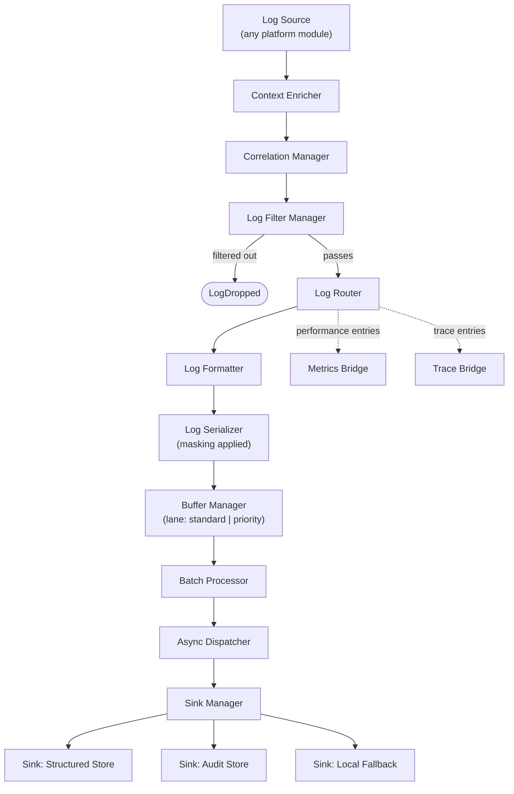

---

## 18. Interaction With Other Modules

### 18.1 Orchestrator Core / Planner / Router / Provider Manager / Memory Manager / Knowledge Base / Review Engine / Validation Engine / Browser Automation

```mermaid
sequenceDiagram
    participant M as Any Platform Module
    participant LG as Logger
    M->>LG: info()/warn()/error()/audit()/security()/performance() [as needed]
    Note over M,LG: Every module interacts with the Logger identically through the public interface; no module receives special-cased treatment
```

### 18.2 Configuration Manager

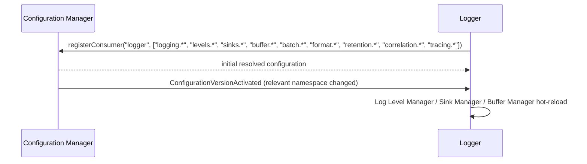

### 18.3 Security Layer

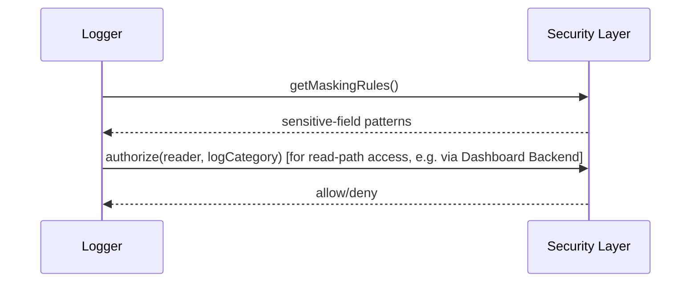

### 18.4 Metrics System / Trace System

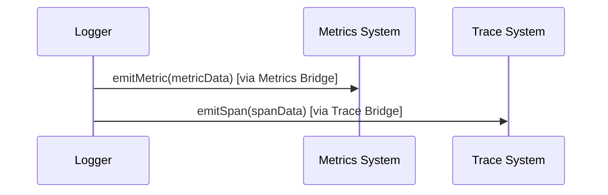

### 18.5 Dashboard Backend

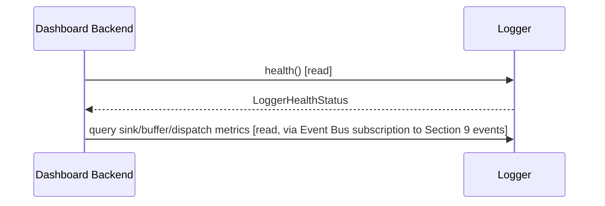

---

## 19. Folder Structure

```
logger/
├── domain/
│   ├── log-entry.ts                    # Canonical LogEntry value object (Section 13)
│   ├── log-category.ts                 # operational | audit | security | performance
│   ├── log-level.ts                    # severity enum + level-resolution model
│   ├── sink-descriptor.ts              # Sink registration contract
│   └── structured-exception.ts         # Exception Processor output model
│
├── application/
│   ├── logging-coordinator/
│   │   └── logging-coordinator.ts      # Section 5.1 — top-level conductor
│   ├── log-entry-factory/
│   │   └── log-entry-factory.ts        # Section 5.2
│   ├── context-enricher/
│   │   └── context-enricher.ts         # Section 5.3
│   ├── correlation-manager/
│   │   └── correlation-manager.ts      # Section 5.4
│   ├── log-filter-manager/
│   │   └── log-filter-manager.ts       # Section 5.5
│   ├── log-router/
│   │   └── log-router.ts               # Section 5.6
│   ├── category-handlers/
│   │   ├── audit-logger.ts             # Section 5.8
│   │   ├── security-logger.ts          # Section 5.9
│   │   ├── performance-logger.ts       # Section 5.10
│   │   ├── operational-logger.ts       # Section 5.11
│   │   └── error-logger.ts             # Section 5.12
│   ├── exception-processor/
│   │   └── exception-processor.ts      # Section 5.13
│   ├── formatter/
│   │   └── log-formatter.ts            # Section 5.14
│   ├── serializer/
│   │   └── log-serializer.ts           # Section 5.15
│   ├── buffer-manager/
│   │   └── buffer-manager.ts           # Section 5.16
│   ├── batch-processor/
│   │   └── batch-processor.ts          # Section 5.17
│   ├── async-dispatcher/
│   │   └── async-dispatcher.ts         # Section 5.18
│   ├── sink-manager/
│   │   └── sink-manager.ts             # Section 5.7
│   ├── log-level-manager/
│   │   └── log-level-manager.ts        # Section 5.19
│   ├── log-retention-manager/
│   │   └── log-retention-manager.ts    # Section 5.20
│   ├── metrics-bridge/
│   │   └── metrics-bridge.ts           # Section 5.21
│   ├── trace-bridge/
│   │   └── trace-bridge.ts             # Section 5.22
│   └── health-monitor/
│       └── health-monitor.ts           # Section 5.23
│
├── infrastructure/
│   ├── sinks/
│   │   ├── file-sink-adapter.ts        # Local/structured file sink
│   │   ├── centralized-sink-adapter.ts # Centralized log aggregation service
│   │   ├── audit-sink-adapter.ts       # Immutable audit store
│   │   └── local-fallback-sink-adapter.ts # Always-registered escalation sink (Section 12.2)
│   ├── metrics/
│   │   └── metrics-system-client.ts    # Port implementation for the external Metrics System
│   ├── tracing/
│   │   └── trace-system-client.ts      # Port implementation for the external Trace System
│   ├── config-client/
│   │   └── config-client.ts            # Read-only adapter to Configuration Manager
│   ├── security-client/
│   │   └── security-layer-client.ts    # Port implementation for masking/access-control
│   └── event-publisher/
│       └── logger-event-publisher.ts   # Adapter to Event Bus (Section 9)
│
├── interfaces/
│   ├── logger.interface.ts             # Public interface contracts (Section 6)
│   ├── log-sink.interface.ts           # Port every sink adapter implements
│   └── plugin-logger.interface.ts      # Scoped, capability-limited interface for plugin logging (Section 3.2, S4)
│
├── plugins/
│   └── custom-sinks/                   # Drop-in directory for organization-specific sink adapters (e.g. Splunk, CloudWatch — Section 22)
│
├── config/
│   └── default-logging-policies.yaml   # Default global level/routing/format/retention configuration
│
└── tests/
    ├── unit/
    ├── integration/
    ├── contract/
    ├── failure/
    ├── performance/
    ├── security/
    ├── stress/
    ├── concurrency/
    └── recovery/
```

**Design rationale for this structure:** mirrors the `domain/ → application/ → infrastructure/ → interfaces/ → plugins/ → config/ → tests/` convention established across every prior MDD in this platform, with `category-handlers/` grouped under `application/` reflecting the five category-specific loggers' shared role as Log Router destinations, and `sinks/` under `infrastructure/` reflecting that concrete sink implementations — like concrete Memory Providers in the Memory Manager MDD — are adapters, never core module logic.

---

## 20. File Responsibilities

| File / Directory | Purpose | Public API | Private Logic | Dependencies |
|---|---|---|---|---|
| `logging-coordinator.ts` | Pipeline sequencing | Backs all of Section 6 | Async hand-off, stage sequencing | Every `application/` component |
| `log-entry-factory.ts` | Entry construction | `create()` | Normalization from raw call shape | None |
| `context-enricher.ts` | Context population | `enrich()` | Ambient-context read | Context-propagation port |
| `correlation-manager.ts` | Trace/span correlation | `correlate()` | ID generation/propagation | Trace Bridge |
| `log-filter-manager.ts` | Level/rule filtering | `filter()` | Threshold comparison | Log Level Manager |
| `log-router.ts` | Category/sink routing | `route()` | Routing-rule evaluation | Configuration Manager |
| `audit-logger.ts` | Audit handling | Backs `audit()` | Never-drop enforcement | Sink Manager, priority buffer lane |
| `security-logger.ts` | Security handling | Backs `security()` | Alert-event publication | Sink Manager, Event Publisher |
| `performance-logger.ts` | Performance handling | Backs `performance()` | Metrics forwarding decision | Sink Manager, Metrics Bridge |
| `operational-logger.ts` | Default handling | Backs `log()`/`debug()`/`info()`/`warn()` | Standard-lane routing | Sink Manager |
| `error-logger.ts` | Error/fatal handling | Backs `error()`/`fatal()` | Priority dispatch | Exception Processor, Sink Manager |
| `exception-processor.ts` | Exception normalization | `processException()` | Stack-trace extraction | None |
| `log-formatter.ts` | Output formatting | `format()` | Per-sink format application | Configuration Manager |
| `log-serializer.ts` | Encoding + masking | `serialize()` | Masking enforcement | Security Layer |
| `buffer-manager.ts` | In-memory buffering | `enqueue()`, `drain()` | Lane management, overflow policy | None (in-memory) |
| `batch-processor.ts` | Batch formation | `createBatch()` | Size/interval trigger logic | Buffer Manager |
| `async-dispatcher.ts` | Non-blocking dispatch | `dispatch()` | Retry, concurrency pool | Sink Manager |
| `sink-manager.ts` | Sink catalog/delivery | `registerSink()`, `removeSink()`, `dispatch()` | Per-sink isolation, health tracking | Sink adapters |
| `log-level-manager.ts` | Level resolution | `getEffectiveLevel()`, `setLevel()` | Layered override resolution | Configuration Manager |
| `log-retention-manager.ts` | Retention policy | `getRetentionPolicy()` | Policy resolution | Configuration Manager |
| `metrics-bridge.ts` | Metrics forwarding | `emitMetric()` | Data-model translation | Metrics System client |
| `trace-bridge.ts` | Trace forwarding | `emitSpan()`, `getIdFormat()` | Data-model translation | Trace System client |
| `health-monitor.ts` | Self-health aggregation | Backs `health()` | Aggregation logic | Sink Manager, Buffer Manager, Async Dispatcher |

---

## 21. Testing Strategy

| Test Category | Coverage |
|---|---|
| **Unit Tests** | Every component in Section 5 tested in isolation with mocked dependencies. |
| **Integration Tests** | Full pipeline (Section 7) exercised end-to-end against realistic multi-sink configurations. |
| **Contract Tests** | Every sink adapter implementation validated against the `log-sink.interface.ts` contract; masking-rule contract tested against representative sensitive-field patterns. |
| **Failure Tests** | Each failure mode in Section 12 exercised explicitly (sink failure, buffer overflow on both lanes, serialization failure, flush timeout, shutdown timeout). |
| **Performance Tests** | Throughput (logs/sec) and dispatch latency measured under representative sink/volume configurations; caller-side latency overhead of a `log()` call measured to confirm near-zero synchronous cost (Section 16.1). |
| **Security Tests** | Masking verified exhaustively — no sensitive value reaches any sink, log, or event payload unmasked; audit immutability verified (write-once enforcement). |
| **Stress Tests** | Sustained high-volume logging across all categories, verifying buffer/batch/dispatch layers hold up without unbounded memory growth and without impacting a simulated business-workflow caller's latency. |
| **Concurrency Tests** | Concurrent log calls from many simulated modules verified for correct interleaving/ordering within a correlation context, and correct isolation across lanes. |
| **Recovery Tests** | Sink failure → `Failed` → `SinkRecovered` transition verified, including redelivery behavior where the sink adapter supports it. |

---

## 22. Future Expansion

| Future Capability | Extension Mechanism |
|---|---|
| **OpenTelemetry** | New Trace Bridge / Metrics Bridge implementations behind the existing ports (Section 5.21/5.22) — no core pipeline change. |
| **Distributed Tracing (full)** | Extension of the Trace Bridge, superseding the current dual-emission fallback (`tracing.*`, Section 11) once a full external tracing system is configured. |
| **ELK / Grafana Loki / Splunk / CloudWatch / Azure Monitor** | Each a new sink adapter in `infrastructure/sinks/` (or `plugins/custom-sinks/` for organization-specific integrations), implementing the existing sink port — no Logger core change. |
| **AI-Assisted Anomaly Detection** | An external consumer of the Logger's sink output (or Event Bus stream) — explicitly never Logger-internal logic, per the Non-Goals (Section 2.3). |
| **Real-Time Dashboards** | Built on the existing Dashboard Backend read path (Section 18.5) and Section 9's event stream — no new Logger capability required. |
| **Log Analytics** | An external system operating on sink-stored data, consistent with the "Logger delivers, does not analyze" boundary (Section 4.1). |
| **Multi-Region Aggregation** | Extension of the Sink Manager to support region-aware sink selection, mirroring the regional-routing extension patterns established in the Router, Memory Manager, and Task Queue MDDs. |

---

## 23. Risks

| Category | Risk | Mitigation |
|---|---|---|
| **High Log Volume** | Very high-throughput modules (e.g. the Task Queue under heavy load) could overwhelm the standard buffer lane. | Configurable sampling (`performanceLogging.*`), drop-oldest overflow policy with visibility (`LogDropped`/`BufferOverflow` events), and the deliberate two-lane design ensuring high-volume operational logging never competes with audit/error delivery guarantees. |
| **Storage Exhaustion** | A sink's own backing store filling up. | A sink-level concern surfaced through `SinkFailed`/health monitoring (Section 14); the Logger's local fallback sink (Section 12.2) has its own bounded capacity and rotation policy to avoid becoming a secondary exhaustion point. |
| **Sensitive Data Leakage** | A masking-rule gap could allow a new, unanticipated sensitive-field pattern through unmasked. | Masking rules are centrally owned by the Security Layer (Section 15.2) rather than duplicated per module, and masking tests (Section 21) are treated as a first-class, continuously-expanded test suite as new field patterns are identified. |
| **Performance Degradation** | Pipeline stages (formatting, serialization, masking) adding meaningful latency at very high volume. | Fully asynchronous design (Section 16.1) ensures pipeline latency is decoupled from calling-module latency regardless of pipeline cost; pipeline-internal performance is itself monitored (Section 14, Serialization Latency) so degradation is visible before it causes buffer pressure. |
| **Dropped Logs** | Any drop, even on the standard lane, represents lost observability data. | `LogDropped` events make every drop visible and attributable to a specific reason, rather than silent — the design explicitly accepts operational-log loss under extreme conditions as a bounded, visible trade-off, while treating audit/error loss as unacceptable (Section 3.1, M6). |
| **Sink Outages** | An external sink (e.g. a centralized log service) becoming unavailable. | Per-sink isolation (Section 12) ensures one sink's outage never affects delivery to other healthy sinks or the local fallback sink. |
| **Configuration Errors** | A misconfigured routing rule or sink reference could silently misroute logs. | Configuration Validator (owned by the Configuration Manager, consumed here) validates `sinks.*`/`logging.*` schema before activation; a routing rule referencing a non-existent sink ID is rejected at configuration-validation time, never discovered only at dispatch time. |

---

## 24. Design Decisions

| Decision | Alternatives Considered | Trade-offs | Why Chosen |
|---|---|---|---|
| Fully asynchronous logging pipeline, with every public interface call returning before dispatch completes | Synchronous logging (caller waits for at least buffer-enqueue confirmation, or even full dispatch) | Synchronous logging is simpler to reason about and guarantees stronger delivery confirmation to the caller, but directly violates the "never impact business workflows" constraint — any sink slowness would propagate into every business operation's latency. | Asynchronous-by-default is the only design consistent with the platform-wide requirement that observability never becomes a reliability or performance liability for the systems it observes. |
| Two-tier buffer lane design (standard vs. priority) with different overflow semantics | A single unified buffer/overflow policy for all log categories | A unified policy is simpler but forces an unacceptable choice: either audit/error logs share operational logging's acceptable-loss-under-pressure behavior (violating M6), or all logs get audit's stricter, more resource-intensive guarantee (unnecessarily expensive for high-volume operational logging). | Two lanes let each category get the delivery guarantee appropriate to its actual criticality, mirroring the same "different guarantees for different purposes" reasoning used in the Task Queue MDD's queue-level vs. provider-level retry separation. |
| The Logger contains zero log-analysis logic — analysis is explicitly external/future | Build basic anomaly detection or pattern-matching directly into the Logger | Embedding analysis logic would blur the "orchestrate without owning the domain" boundary this platform applies consistently (Memory Manager doesn't search, Router doesn't execute, Configuration Manager doesn't evaluate policy) and would make the Logger's own correctness/performance profile dependent on analysis-workload characteristics unrelated to its core delivery responsibility. | Keeping analysis strictly external (Section 22) lets the Logger's design stay optimized for one job — reliable, low-overhead delivery — while analysis systems can evolve independently against the same delivered data. |
| A dedicated, non-removable local fallback sink always registered by default | Rely solely on configured external sinks, with no built-in fallback | Relying only on external sinks means a total external-sink outage during a critical incident (exactly when audit/error visibility matters most) would have no safety net. | A always-on local fallback (Section 12.2) guarantees the platform's strongest delivery guarantee (audit/error) survives even a worst-case total external-infrastructure outage, at the modest cost of local disk capacity management. |
| Category-specific handler components (Audit/Security/Performance/Operational/Error Logger) rather than a single generic handler with category as a parameter | One generic `CategoryHandler` component branching internally on category | A single branching component is less code up front but conflates five behaviorally distinct concerns (immutability guarantees, alerting side-effects, metrics forwarding, default-path handling, exception processing) into one component, working against Single Responsibility and making category-specific changes (e.g. tightening audit guarantees further) riskier to make in isolation. | Separate, narrowly-scoped handler components keep each category's distinct guarantees independently testable and independently evolvable, consistent with the High Cohesion / Loose Coupling principles this platform applies throughout. |

---

## 25. Diagrams

### 25.1 Component Diagram

*(See Section 5 for the full component diagram.)*

### 25.2 Sequence Diagram

*(See Section 7.11 — Standard Log Entry Flow — and Section 7.12 — Flush and Shutdown — for the primary sequence diagrams; see Section 18 for per-module interaction sequence diagrams.)*

### 25.3 State Diagram

*(See Section 8.9 for the full Logger and sink lifecycle state diagram.)*

### 25.4 Data Flow Diagram

*(See Section 17 for the full data flow diagram.)*

### 25.5 Class Diagram

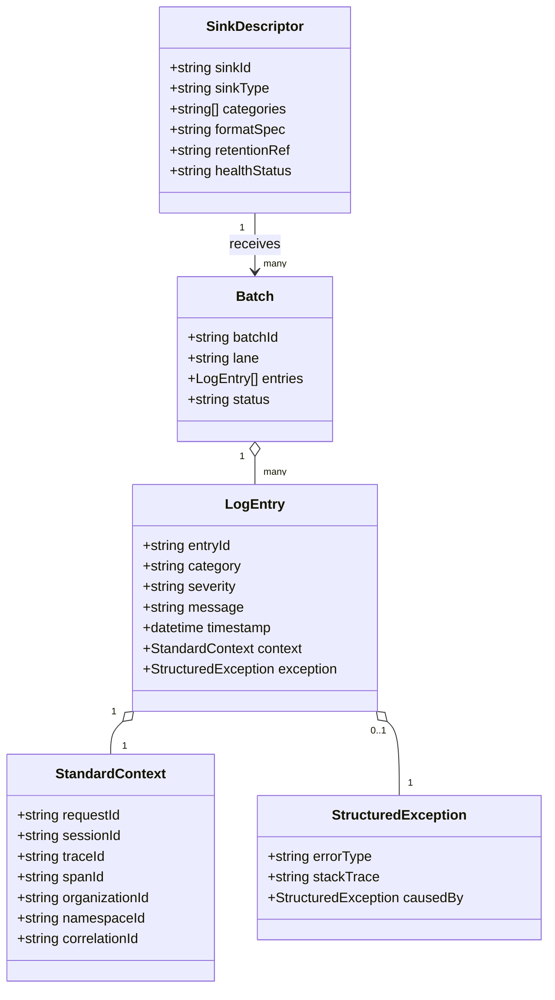

### 25.6 Folder Structure Diagram

*(See Section 19 for the full annotated folder tree.)*

---

*End of Logger Module Design Document.*
