# Memory Manager Module Design Document (MDD)

**Module:** Memory Manager
**Platform:** Hybrid AI Development Platform
**Document Type:** Module Design Document (MDD)
**Status:** Implementation-Ready
**Version:** 1.0
**Date:** July 2026

**Upstream source-of-truth documents:** PRD · Software Architecture & Design Document (SAD) · API Specification · Database Design Document · Orchestrator Core MDD · Event Bus MDD · Request Manager MDD · Provider Manager MDD · Provider Plugin System MDD · Model Registry MDD · Capability Selector MDD · Router MDD

---

## Table of Contents

1. Executive Summary
2. Goals
3. Responsibilities
4. Scope
5. Internal Architecture
6. Memory Lifecycle
7. Memory Model
8. Memory Types
9. Memory Retrieval
10. Memory Policies
11. Memory Provider Abstraction
12. Public Interfaces
13. Events
14. Error Handling
15. Logging
16. Monitoring
17. Security
18. Performance
19. Enterprise Scalability
20. Interaction With Other Modules
21. Folder Structure
22. Testing Strategy
23. Future Expansion
24. Risks
25. Design Decisions
26. Diagrams

---

## 1. Executive Summary

### 1.1 Purpose

The Memory Manager is the centralized orchestration layer for every memory operation on the platform. It gives the rest of the system — the Orchestrator Core, the Planner, the Knowledge Comparison Engine, and ultimately the end user's continuous project experience — a single, stable abstraction for storing, retrieving, updating, indexing, searching, and expiring memories, regardless of which concrete storage technology sits underneath any given memory type at any given time.

It exists so that "what kind of database backs project memory" can change — a Knowledge Base today, a vector database tomorrow, a graph database or a distributed cache alongside them next — without a single caller of the Memory Manager ever knowing or caring. Callers ask for memory by intent (store this, retrieve what's relevant to this context, expire what's stale); the Memory Manager decides how that intent is fulfilled by the correct storage provider.

### 1.2 Responsibilities

At the highest level, the Memory Manager:

- Owns the full memory lifecycle: creation, validation, classification, storage, indexing, retrieval, update, expiration, archival, and deletion.
- Coordinates memory search and context assembly across one or more memory providers, without performing search algorithms or embedding generation itself.
- Enforces memory policies (retention, expiration, priority, visibility, namespace) uniformly regardless of provider.
- Manages memory sessions, namespaces, and multi-tenant isolation boundaries.
- Abstracts every concrete storage technology behind a single Memory Provider interface, so providers can be added, removed, or replaced without modifying Memory Manager source code.
- Publishes a complete lifecycle event stream so other modules can observe memory activity without coupling to internal implementation.

### 1.3 Role

The Memory Manager is an **orchestration layer only**. It never implements a storage engine, never generates embeddings, never runs similarity search, never performs knowledge comparison, and never contains business or planning logic. Every operation that touches actual data is delegated to a registered Memory Provider through an abstract interface; the Memory Manager's own responsibility begins and ends at deciding *which* provider(s) to involve, *how* to combine their results, and *whether* the operation is policy-compliant — never at *how* the data is physically stored or searched.

### 1.4 Architecture Position

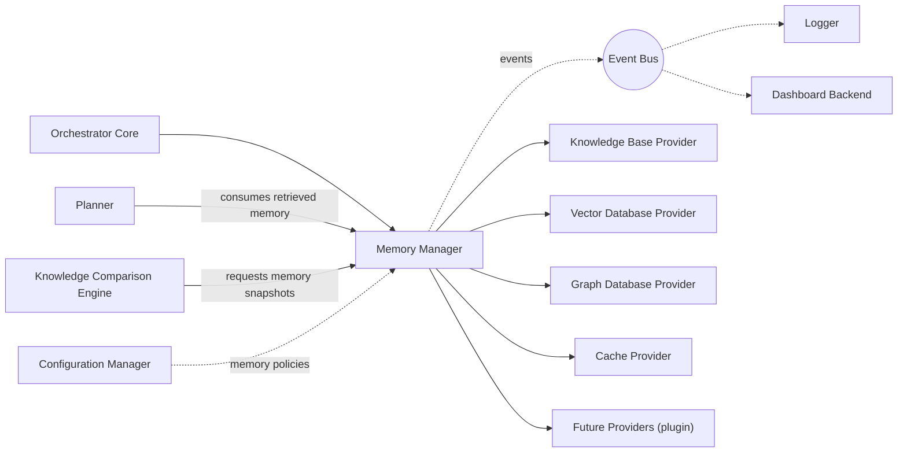

The Memory Manager sits **beside**, not inside, the Orchestrator Core's request pipeline: it is invoked by the Orchestrator Core (and, downstream, the Planner and Knowledge Comparison Engine) whenever project memory needs to be read or written, but it never itself calls the Router, Provider Manager, or any AI provider — it has no direct interaction with model-execution modules, consistent with its purely data-orchestration role.

---

## 2. Goals

### 2.1 Primary Goals

- Provide one uniform API for every memory operation (store, retrieve, update, delete, search, expire, assemble context) regardless of the number or type of underlying storage providers.
- Guarantee that adding, removing, or replacing a storage provider never requires a change to Memory Manager core logic (Open/Closed Principle).
- Enforce memory policies (retention, expiration, priority, visibility, namespace, organization) consistently across all providers and all memory types.
- Support complete multi-tenant isolation (organization, workspace, team, project, user, session, namespace) as a first-class architectural property, not an afterthought.
- Assemble relevant memory context for a given request efficiently, combining results from multiple providers when necessary, without leaking provider-specific result shapes to callers.

### 2.2 Secondary Goals

- Provide tiered caching (in-process + distributed) to minimize latency for frequently retrieved memory.
- Provide full auditability of memory operations for compliance and debugging.
- Provide graceful degradation when a subset of providers is unavailable, rather than failing every memory operation platform-wide.

### 2.3 Future Goals

- Support distributed, multi-region memory federation across independently deployed Memory Manager instances.
- Support hot-pluggable runtime provider registration/removal without restart.
- Support cross-region replication and storage tiering (hot/warm/cold) transparently to callers.

### 2.4 Non-Goals

- The Memory Manager does **not** implement any storage engine (vector database, graph database, SQL/NoSQL store, cache) — these are Memory Provider plugins.
- The Memory Manager does **not** generate embeddings or run similarity/search algorithms — these belong to the relevant Memory Provider.
- The Memory Manager does **not** perform knowledge comparison or regression detection — that is the Knowledge Comparison Engine's responsibility; the Memory Manager only supplies the memory snapshots it compares.
- The Memory Manager does **not** plan, execute, route model requests, or select providers for AI execution — those belong to the Planner, Orchestrator Core, Router, and Provider Manager respectively.
- The Memory Manager does **not** perform browser automation, code review, or any business logic outside memory orchestration.

---

## 3. Responsibilities

### 3.1 Must Have

| # | Responsibility |
|---|---|
| M1 | Provide a single API surface for store, retrieve, update, delete, search, and expire operations across all memory types and providers. |
| M2 | Validate every memory object against the Memory Model (Section 7) before any provider is invoked. |
| M3 | Classify incoming memories (Section 8) to determine applicable policies and provider routing. |
| M4 | Route each operation to the correct registered Memory Provider(s) via the abstract Provider Interface (Section 11) — never via provider-specific code paths. |
| M5 | Coordinate multi-provider search and combine/rank results into a single coherent response, without performing the underlying search itself. |
| M6 | Assemble memory context (a bounded, relevant subset of memory) for a given request, respecting namespace, visibility, and priority rules. |
| M7 | Enforce retention, expiration, and visibility policies uniformly, regardless of which provider physically stores a given memory. |
| M8 | Maintain memory session and namespace boundaries such that no operation can cross a tenant/namespace boundary without explicit authorization. |
| M9 | Publish a complete set of lifecycle events (Section 13) for every memory state transition. |
| M10 | Support registration of new Memory Providers at startup (and, in later phases, at runtime) without any change to Memory Manager core code. |

### 3.2 Should Have

| # | Responsibility |
|---|---|
| S1 | Maintain a tiered cache (L1 in-process, L2 distributed) to reduce retrieval latency for hot memory. |
| S2 | Provide incremental index-update coordination so providers can be kept current without full re-indexing on every write. |
| S3 | Provide provider health-aware routing so a degraded provider does not silently degrade the whole memory subsystem. |
| S4 | Expose structured memory metrics (Section 16) for the Dashboard Backend. |

### 3.3 Future Responsibilities

| # | Responsibility |
|---|---|
| F1 | Coordinate cross-region memory replication and consistency. |
| F2 | Support storage tiering (hot/warm/cold) transparently, moving memories between providers based on access patterns without caller involvement. |
| F3 | Support federated memory across independently deployed Memory Manager clusters. |

---

## 4. Scope

### 4.1 Owns

Memory Orchestration · Memory Lifecycle · Memory Registration · Memory Retrieval Coordination · Memory Updates · Memory Deletion · Memory Expiration · Memory Policies · Memory Classification · Memory Search Coordination · Memory Routing (internal — routing an operation to the correct *provider*, distinct from the platform's Router module, which routes AI execution requests to providers; the two are unrelated and never interact) · Memory Prioritization · Memory Context Assembly · Memory Caching Coordination · Memory Synchronization · Memory Access Control · Memory Provider Abstraction · Memory Metadata · Memory Index Coordination · Memory Session Management · Memory Namespace Management.

### 4.2 Does Not Own

| Concern | Owning Module |
|---|---|
| Vector database implementation | Vector Database Provider (plugin) |
| Knowledge storage / knowledge documents | Knowledge Base (Memory Provider) |
| Embedding generation | Relevant Memory Provider |
| Similarity search algorithms | Relevant Memory Provider |
| Graph database implementation | Graph Database Provider (plugin) |
| SQL / NoSQL storage implementation | Relevant Memory Provider |
| Knowledge extraction | Knowledge Base / Vision Pipeline |
| Knowledge comparison / regression detection | Knowledge Comparison Engine |
| Planning | Planner |
| Execution | Orchestrator Core / Provider Manager |
| Provider (AI model) communication | Provider Manager |
| Business logic | Respective owning modules |
| Browser automation | Browser Agent |
| Review | Review Engine |
| AI-model routing | Router |
| Model selection | Capability Selector / Router |
| Prompt engineering, AI reasoning | Respective AI-facing modules |
| Memory provider implementation | Individual provider plugins |

### 4.3 Collaborates With

- **Knowledge Base** — a Memory Provider; stores and executes storage operations for knowledge-type memory. Never orchestrates memory itself.
- **Knowledge Comparison Engine** — consumes memory snapshots supplied by the Memory Manager to perform comparison; never manages memory lifecycle.
- **Planner** — consumes retrieved memory/context for planning; never stores memory directly (all writes go through the Memory Manager's API).
- **Router** — no direct interaction; the two modules operate on entirely different concerns (AI-execution routing vs. memory-provider orchestration).
- **Provider Manager** — no direct interaction.
- **Configuration Manager** — supplies memory policies, provider configuration, and tenancy rules.
- **Event Bus** — receives every memory lifecycle event.
- **Logger** — receives structured memory logs.
- **Dashboard Backend** — reads memory metrics and provider health for display.

---

## 5. Internal Architecture

The Memory Manager is composed of the following internal components, each independently testable and wired via Dependency Injection, consistent with Clean/Hexagonal Architecture: application-layer orchestration components depend only on interfaces, never on concrete provider implementations.

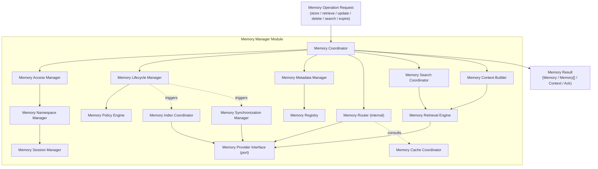

### 5.1 Memory Coordinator

**Purpose:** The single entry point and top-level conductor for every Memory Manager public operation — analogous to the Routing Engine's role in the Router module.

**Responsibilities:** Receive a normalized operation request, sequence the appropriate internal components (Access → Lifecycle/Policy → Metadata/Registry → Routing → Provider Interface), and assemble the final result.

**Inputs:** Normalized `MemoryOperationRequest` (from a public interface call, Section 12).

**Outputs:** `MemoryResult` (success payload or structured error).

**Dependencies:** All other internal components listed below.

**Lifecycle:** Instantiated once per Memory Manager instance (stateless across requests — see Section 19.1); invoked once per operation.

### 5.2 Memory Provider Interface (Port)

**Purpose:** The abstract contract every storage technology must implement to participate in the platform — the sole boundary through which the Memory Manager touches physical storage.

**Responsibilities:** Define the operations a provider must support (persist, fetch, query, delete, index, healthCheck) in provider-agnostic terms; the Memory Manager only ever calls through this interface, never a concrete SDK.

**Inputs:** Provider-agnostic operation payloads from the Memory Router.

**Outputs:** Provider-agnostic result payloads, normalized to the common `ProviderResult` shape.

**Dependencies:** None (pure interface/port, per Hexagonal Architecture).

**Lifecycle:** Defined once; implemented once per registered provider plugin.

### 5.3 Memory Registry

**Purpose:** Tracks every registered Memory Provider, its declared capabilities, and its current health/availability metadata.

**Responsibilities:** Maintain the provider catalog, validate a provider's declared capability set at registration time, and expose lookup by capability, memory type, or provider ID to the Memory Router.

**Inputs:** `registerProvider()` calls (Section 12), provider health updates.

**Outputs:** Provider catalog entries, capability lookup results.

**Dependencies:** Configuration Manager (initial provider configuration).

**Lifecycle:** Long-lived; populated at startup and updated on registration/deregistration/health-change events.

### 5.4 Memory Router (Internal)

**Purpose:** Decide which registered provider(s) should service a given operation, based on memory type, classification, namespace, and provider capability — **not** to be confused with the platform's Router module, which makes AI-execution routing decisions. This component never interacts with the Router module.

**Responsibilities:** Resolve a memory operation to one or more concrete Memory Provider Interface implementations (a single operation may fan out to multiple providers, e.g. a search spanning both a Knowledge Base and a Vector Database), applying provider priority and health-awareness (Section 3.2, S3).

**Inputs:** Classified `MemoryOperationRequest`, Memory Registry lookup results.

**Outputs:** A resolved list of target provider(s) for the operation.

**Dependencies:** Memory Registry, Memory Cache Coordinator (consulted for cache-first read paths).

**Lifecycle:** Invoked once per operation, after classification and policy evaluation.

### 5.5 Memory Search Coordinator

**Purpose:** Coordinate multi-provider search operations, delegating the actual search/similarity execution to providers and combining their results.

**Responsibilities:** Fan a `searchMemory()` request out to every provider resolved by the Memory Router as relevant, apply namespace/tag/time/priority filters (Section 9) to each provider's raw results, and merge/rank the combined result set into a single ordered response.

**Inputs:** Search query, resolved provider list, filter criteria.

**Outputs:** A single ranked `MemorySearchResult[]`.

**Dependencies:** Memory Provider Interface (via Memory Retrieval Engine), Memory Router.

**Lifecycle:** Invoked once per `searchMemory()` call; may invoke multiple providers in parallel (Section 18.3).

### 5.6 Memory Retrieval Engine

**Purpose:** The shared low-level execution component used by both direct lookups and search coordination to actually call out to a provider through the Memory Provider Interface and normalize its response.

**Responsibilities:** Execute a single provider call (direct lookup or search), apply timeout/error handling at the individual-call level, and normalize the provider's raw result into the common `Memory`/`MemorySearchResult` shape.

**Inputs:** Target provider, operation payload.

**Outputs:** Normalized provider result, or a structured provider-level error.

**Dependencies:** Memory Provider Interface.

**Lifecycle:** Invoked once per provider call; may be invoked multiple times per logical operation (fan-out).

### 5.7 Memory Lifecycle Manager

**Purpose:** Own the state machine described in Section 6 — the authoritative tracker of where a given memory is in its lifecycle.

**Responsibilities:** Transition memories through Create → Validate → Classify → Store → Index → Available → (Retrieve/Update)* → Expire → Archive → Delete, enforcing valid transitions and triggering the Memory Policy Engine, Memory Index Coordinator, and Memory Synchronization Manager at the appropriate points.

**Inputs:** Operation requests affecting lifecycle state (create, update, expire, delete).

**Outputs:** Updated lifecycle state, lifecycle transition events (Section 13).

**Dependencies:** Memory Policy Engine, Memory Index Coordinator, Memory Synchronization Manager.

**Lifecycle:** Consulted on every state-changing operation; read-only lifecycle status queries bypass it in favor of direct metadata lookup.

### 5.8 Memory Policy Engine

**Purpose:** Evaluate retention, expiration, priority, visibility, and namespace/organization policies (Section 10) against a given memory and operation.

**Responsibilities:** Determine whether an operation is policy-compliant (e.g. is this memory allowed to be read by this caller, is this memory past its retention window), compute derived policy values (e.g. effective TTL after policy layering), and resolve policy conflicts deterministically.

**Inputs:** Memory object/metadata, operation context (caller identity, namespace, tenant), active policy set.

**Outputs:** Policy evaluation result (allow/deny + reason, or derived values such as effective TTL).

**Dependencies:** Configuration Manager (policy definitions).

**Lifecycle:** Invoked on every operation that reads, writes, or expires a memory.

### 5.9 Memory Cache Coordinator

**Purpose:** Own the tiered cache (Section 18.1) used to accelerate frequent reads without the Memory Manager becoming a stateful bottleneck.

**Responsibilities:** Serve cache-first reads for eligible operations, coordinate L1 (in-process) and L2 (distributed) cache tiers, and invalidate cache entries on write/update/delete/expire events.

**Inputs:** Cache lookup keys (derived from operation parameters), invalidation triggers (lifecycle events).

**Outputs:** Cached result or cache miss signal.

**Dependencies:** Event Bus (invalidation triggers), distributed cache backend (an infrastructure adapter, not a Memory Provider — see Section 19.10).

**Lifecycle:** Consulted by the Memory Router before provider dispatch on every eligible read operation.

### 5.10 Memory Session Manager

**Purpose:** Track and scope memory operations to a Session, one of the core namespace dimensions (Section 7).

**Responsibilities:** Resolve session identity from operation context, enforce session-scoped visibility rules, and support session lifecycle (create, resume, close) as it relates to Session Memory (Section 8).

**Inputs:** Operation context (session ID, caller identity).

**Outputs:** Resolved session scope applied to downstream filtering.

**Dependencies:** Memory Namespace Manager.

**Lifecycle:** Consulted on every operation carrying a session context.

### 5.11 Memory Namespace Manager

**Purpose:** Own namespace resolution and enforcement across the full tenancy hierarchy (organization, workspace, team, project, user, session — Section 19.3).

**Responsibilities:** Resolve the effective namespace for an operation, validate that the caller is authorized for that namespace (in cooperation with the Memory Access Manager), and prevent any operation from silently crossing a namespace boundary.

**Inputs:** Operation context (tenant/org/project/user/session identifiers).

**Outputs:** Resolved, validated namespace path.

**Dependencies:** Memory Access Manager.

**Lifecycle:** Consulted first, on every operation, before any provider interaction is considered.

### 5.12 Memory Metadata Manager

**Purpose:** Own the Memory Model's metadata fields (Section 7) independent of where the memory's content is physically stored.

**Responsibilities:** Validate metadata completeness and correctness on write, maintain the metadata index used for direct lookup and metadata search (Section 9), and serve metadata-only queries without requiring a full provider round-trip.

**Inputs:** Memory object (on write), metadata query (on read).

**Outputs:** Validated metadata, metadata query results.

**Dependencies:** Memory Registry (to know which provider owns a given memory's content).

**Lifecycle:** Invoked on every write (validation) and on every metadata-only read.

### 5.13 Memory Context Builder

**Purpose:** Implement `assembleContext()` — construct a bounded, relevant subset of memory for a given request, combining retrieval and search results into the shape the Planner/Orchestrator Core expects.

**Responsibilities:** Given a context request (e.g. "everything relevant to continuing project X"), invoke the Memory Search Coordinator and Memory Retrieval Engine as needed, apply priority/importance ranking and a size/token budget, and assemble the final ordered context payload. In the evolved cognitive model, the builder also performs intelligent ranking using semantic relevance, graph distance, confidence, planner intent, recency, importance, frequency, project activity, and relationship traversal, while remaining bounded by the caller's token budget.

**Inputs:** Context request (scope, budget, filters).

**Outputs:** Assembled `MemoryContext` object.

**Dependencies:** Memory Search Coordinator, Memory Retrieval Engine, Memory Policy Engine (visibility filtering).

**Lifecycle:** Invoked once per `assembleContext()` call.

### 5.14 Memory Synchronization Manager

**Purpose:** Keep memory consistent across providers and, in future distributed deployments, across regions/clusters (Section 19.13).

**Responsibilities:** Coordinate any necessary cross-provider consistency operations (e.g. a memory that is indexed in both a Vector Database and a Knowledge Base must reflect the same update), and expose synchronization status for monitoring (Section 16).

**Inputs:** Lifecycle transition events affecting synchronized memories.

**Outputs:** Synchronization status, synchronization-failure events.

**Dependencies:** Memory Provider Interface (multiple providers), Event Bus.

**Lifecycle:** Triggered by the Memory Lifecycle Manager on relevant state transitions; runs asynchronously in the background (Section 18.7 background synchronization).

### 5.15 Memory Index Coordinator

**Purpose:** Coordinate index-update operations across providers without performing indexing itself.

**Responsibilities:** On memory creation/update, instruct relevant providers to (re)index the memory via the Memory Provider Interface, and track index-completion status so retrieval can distinguish "stored but not yet indexed" from "available."

**Inputs:** Lifecycle transition events (Store → Index).

**Outputs:** Index-completion status, `MemoryIndexed` events.

**Dependencies:** Memory Provider Interface.

**Lifecycle:** Triggered by the Memory Lifecycle Manager; may run synchronously (small memories) or asynchronously (large/batch) per configuration.

### 5.16 Memory Access Manager

**Purpose:** Enforce access control for every operation, independent of namespace resolution.

**Responsibilities:** Validate the calling context's authorization to perform the requested operation (read/write/delete) on the resolved namespace/memory, in cooperation with the platform's broader identity/access system (consumed, not implemented, by the Memory Manager).

**Inputs:** Operation context (caller identity, requested operation, resolved namespace).

**Outputs:** Authorization result (allow/deny + reason).

**Dependencies:** Memory Namespace Manager, Configuration Manager (access policy source).

**Lifecycle:** Invoked first for every operation, before Namespace Manager resolution completes (the two are evaluated together — see 5.11).

---

## 6. Memory Lifecycle

### 6.1 Lifecycle States

```
Create → Validate → Classify → Store → Index → Available → Retrieve/Update (repeatable) → Expire → Archive → Delete
```

- **Create** — a new memory object is submitted to the Memory Manager.
- **Validate** — the Memory Metadata Manager validates the object against the Memory Model (Section 7); invalid objects are rejected before any provider is touched.
- **Classify** — the memory is classified by type (Section 8), which determines applicable policies and eligible providers.
- **Store** — the Memory Router resolves target provider(s) and the Memory Retrieval Engine persists the memory via the Memory Provider Interface.
- **Index** — the Memory Index Coordinator instructs relevant providers to index the memory for future retrieval/search.
- **Available** — the memory is fully queryable; `MemoryCreated`/`MemoryIndexed` events have been published.
- **Retrieve** — zero or more read operations over the memory's lifetime; does not change lifecycle state.
- **Update** — content or metadata changes; re-enters Validate → Classify → Store → Index for the changed portions, with a version increment (Section 7).
- **Expire** — the Memory Policy Engine determines the memory has passed its effective retention window (TTL or policy-derived).
- **Archive** — an optional intermediate state (policy-dependent) where an expired memory is moved to cold/archival storage rather than deleted outright (Section 19.15).
- **Delete** — the memory and its index entries are removed from all providers that held it.

### 6.2 Lifecycle Diagram

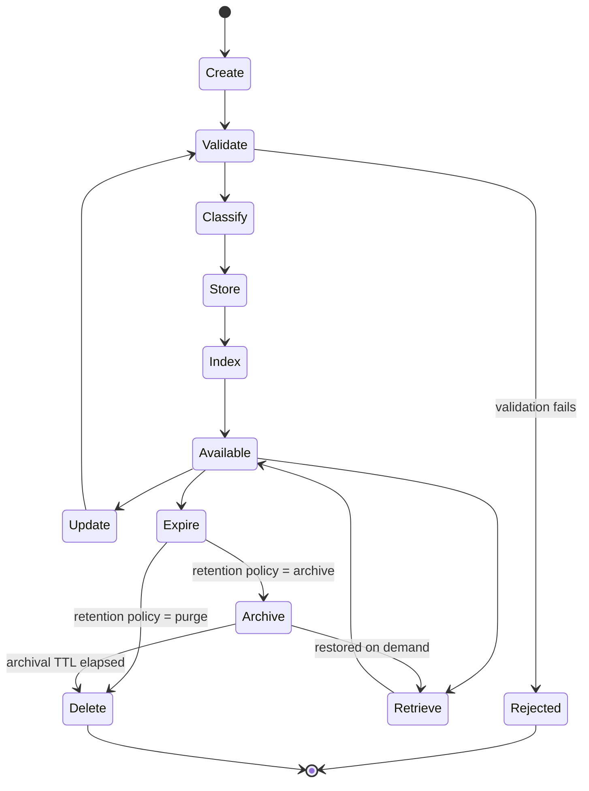

---

## 7. Memory Model

The Memory Manager's model is evolved from a storage-centric representation into a cognitive memory model: each memory remains an orchestrated data object, but it now carries richer intelligence about confidence, provenance, lifecycle, relationships, and retrieval usefulness without changing the module's architectural responsibilities.

| Field | Type | Explanation |
|---|---|---|
| `memoryId` | UUID | Globally unique identifier for the memory object, assigned at Create and immutable thereafter. |
| `namespace` | string (hierarchical path) | The resolved tenancy path (e.g. `org/workspace/project/session`) this memory belongs to; enforced by the Memory Namespace Manager on every operation. |
| `memoryType` | enum | One of the types defined in Section 8; determines default policies and provider eligibility. |
| `owner` | string (identity reference) | The identity (user, service, or agent) that created the memory; used for access control and auditability. |
| `sessionId` | UUID (nullable) | The session this memory is scoped to, if applicable (e.g. Conversation Memory); null for memory types that are not session-scoped (e.g. Project Memory). |
| `projectId` | UUID (nullable) | The project this memory belongs to; null only for organization- or user-level memory not tied to a specific project. |
| `createdAt` | ISO-8601 datetime | Creation timestamp; immutable. |
| `updatedAt` | ISO-8601 datetime | Most recent modification timestamp. |
| `firstSeen` | ISO-8601 datetime | When the memory was first observed or ingested. |
| `lastAccessed` | ISO-8601 datetime | Most recent successful read/access. |
| `validFrom` | ISO-8601 datetime (nullable) | When the memory becomes active for retrieval. |
| `validUntil` | ISO-8601 datetime (nullable) | When the memory should stop being prioritized for active use. |
| `expiresAt` | ISO-8601 datetime (nullable) | Absolute expiration time, if any. |
| `accessCount` | integer | Number of successful access operations. |
| `ttl` | duration (nullable) | Explicit time-to-live for this memory, if set directly; may be overridden by policy-derived expiration (Section 10.2) when policy TTL is stricter. |
| `priority` | integer | Caller- or policy-assigned priority used in context assembly ranking (Section 9.10) and cache-eviction weighting (Section 18.1). |
| `importance` | float (0–1) | A finer-grained relevance signal, distinct from `priority`, intended to be settable by upstream reasoning (e.g. a review flags a decision as highly important) without renegotiating the coarser priority tier. |
| `importanceScore` | float (0–1) | A richer ranking signal derived from recency, usage, graph centrality, review endorsements, and manual pinning. |
| `confidence` | float (0–1) | Estimated reliability of the memory's content or inference. |
| `usageFrequency` | float | A normalized measure of how often the memory is used in active workflows. |
| `contextWeight` | float | Indicates how much the memory should influence context assembly for similar requests. |
| `source` | string | Identifies where this memory originated (e.g. `"planner"`, `"review-engine"`, `"vision-pipeline"`, `"user"`) for provenance and debugging. |
| `provenance` | array\<string\> | Records the origin chain of the memory, including user, planner, review engine, browser, git, vision pipeline, AI, or learning-layer contributions. |
| `verificationStatus` | enum/string | Captures whether the memory is unverified, AI-verified, human-verified, conflicting, or deprecated. |
| `promotionLevel` | enum (`working`, `session`, `project`, `knowledge`, `long-term`, `archive`) | Indicates the memory's current promotion tier in the memory taxonomy. |
| `decayPolicy` | string | References the decay or forgetting policy that governs how quickly the memory should lose prominence over time. |
| `metadata` | map\<string, any\> | Structured, provider-agnostic metadata used for metadata search and filtering (Section 9.2). |
| `embeddingReference` | string (nullable, opaque) | An opaque pointer to an embedding held by a Vector Database Provider, if one exists for this memory; the Memory Manager never interprets or generates the embedding itself, only stores and passes along the reference. |
| `knowledgeReference` | string (nullable, opaque) | An opaque pointer into the Knowledge Base for memories that are derived from or linked to a knowledge document; same non-interpretation principle applies. |
| `relationships` | array\<{ `type`, `targetMemoryId`, `strength`, `evidence` }\> | Declared relationships to other memories (e.g. "supersedes", "derivedFrom", "relatedTo"), used by Graph Database Providers and by context assembly for relationship-aware retrieval. |
| `tags` | array\<string\> | Free-form labels used for tag filtering (Section 9.7). |
| `classification` | enum/string | The outcome of the Classify lifecycle step (Section 6); may be a fixed taxonomy value or an extensible string for custom classification schemes. |
| `visibility` | enum (`private`, `session`, `project`, `organization`, `public`) | Governs which callers may retrieve this memory, enforced by the Memory Access Manager in cooperation with the Memory Policy Engine's visibility rules (Section 10.5). |
| `retentionPolicy` | string (policy reference) | A reference to the named retention policy (Section 10.1) governing this memory's expiration/archival behavior; resolved, not embedded, so policy changes apply retroactively without rewriting every memory. |
| `version` | integer | Incremented on every Update transition; supports optimistic concurrency and historical traceability. |
| `status` | enum (mirrors Section 6.1 states) | The memory's current lifecycle state. |
| `reflectionReference` | string (nullable, opaque) | Reference to an associated reflection memory generated after workflow completion. |
| `decisionReference` | string (nullable, opaque) | Reference to a decision memory if the current memory captures a decision context. |
| `episodeReference` | string (nullable, opaque) | Reference to the episodic memory bundle that contains the broader development episode. |
| `proceduralReference` | string (nullable, opaque) | Reference to a procedural memory describing a workflow or operational playbook. |
| `customMetadata` | map\<string, any\> | Open extension point for provider-specific or organization-specific fields that do not warrant a first-class schema field, consistent with the platform's Open/Closed extensibility approach. |

### 7.1 Field Design Notes

Fields referencing external systems (`embeddingReference`, `knowledgeReference`) are always opaque pointers, never inline content — this is what keeps the Memory Manager from ever needing to understand embeddings or knowledge-document internals, per Section 4.2.

### 7.2 Cognitive Intelligence Extensions

The enriched memory model supports lifecycle intelligence and retrieval intelligence without shifting responsibility away from the Memory Manager. The following capabilities are modeled as metadata and policy-driven attributes rather than implemented as business logic inside the Memory Manager:

- **Confidence and trust** — each memory carries confidence, verification status, source trust, and conflict indicators to support downstream ranking and review workflows.
- **Temporal intelligence** — created/updated/first-seen/last-accessed/valid-from/valid-until/expiry/access-count fields allow the system to reason about freshness, staleness, and eligibility.
- **Cognitive relationships** — relationship metadata, backlinks, decision references, episode references, and procedural references support graph-based retrieval and knowledge-graph navigation.
- **Promotion and decay** — promotion level, decay policy, and importance score allow the Memory Manager to participate in policy-driven memory lifecycle progression without assuming business ownership of the promotion logic itself.
- **Provenance tracking** — provenance records the origin chain so the platform can evaluate whether a memory is user-authored, AI-generated, review-assisted, or derived from another system.

---

## 8. Memory Types

The underlying memory taxonomy is expanded to support cognitive memory categories while preserving the existing lifecycle and provider model. Each category remains a memory type managed by the Memory Manager, but its default characteristics are richer and more intelligence-oriented.

| Type | Purpose | TTL | Promotion Policy | Retrieval Strategy | Decay Policy | Default Provider | Ranking Priority |
|---|---|---|---|---|---|---|---|
| **Working Memory** | Short-lived context for a single in-flight operation or task. | Very short (seconds to minutes) | Never promoted; evicted aggressively | Direct/fast lookup and local context assembly | Fast decay | Cache or ephemeral store | Highest for current task |
| **Scratch Memory** | Temporary intermediate state for multi-step reasoning or experimentation. | Short | Promote to Session after stabilization | Local retrieval and immediate context | Rapid decay | Cache | High |
| **Conversation Memory** | Captures dialogue history relevant to the ongoing interaction. | Session/project-based | Promote to Project or Knowledge when reused | Temporal and semantic retrieval | Moderate decay | Metadata/Vector provider | High |
| **Task Memory** | Stores task-state context, subtasks, and progress markers. | Session/project-based | Promote to Project after completion | Metadata and relationship traversal | Moderate decay | Metadata/Graph provider | High |
| **Project Memory** | Continuity across tasks and workstreams in a project. | Project lifetime | Promote to Knowledge when reused or validated | Hybrid and graph retrieval | Low decay | Metadata/Graph/Vector provider | Very high |
| **Knowledge Memory** | Stable facts, guidance, patterns, and reusable information. | Long-lived | Promote to Long-Term when validated and reused | Hybrid, semantic, and graph retrieval | Low decay | Knowledge/Vector/Graph provider | Very high |
| **Semantic Memory** | Concept-level knowledge that connects entities, ideas, and terminology. | Long-lived | Promote to Long-Term when referenced repeatedly | Semantic and graph retrieval | Low decay | Vector/Graph provider | High |
| **Procedural Memory** | Reusable workflows, operational steps, implementation recipes, and pitfalls. | Medium to long | Promote to Knowledge after repeated success | Decision/procedural retrieval | Low decay | Metadata/Graph provider | High |
| **Episodic Memory** | Full development episodes with conversation, implementation, review, deployment, and outcome. | Medium to long | Promote to Knowledge or Archive after consolidation | Episode and temporal retrieval | Low decay | Graph/Metadata provider | Medium-high |
| **Decision Memory** | Captures rationale, alternatives, trade-offs, impacts, and supersession history. | Medium to long | Promote to Knowledge after validation | Decision and graph retrieval | Low decay | Graph/Metadata provider | Very high |
| **Reflection Memory** | Lessons learned, mistakes, successes, recommendations, and future improvements. | Medium to long | Promote to Knowledge after review | Reflection and temporal retrieval | Moderate decay | Metadata/Graph provider | Medium-high |
| **Learning Memory** | Rules and heuristics derived from observed outcomes or review feedback. | Long | Promote to Long-Term when confirmed | Hybrid retrieval | Low decay | Knowledge/Vector provider | High |
| **User Memory** | Personal preferences, repeated habits, and individual context. | User-scoped | Promote to Organization when shared or generalized | Hybrid and temporal retrieval | Moderate decay | Metadata/Vector provider | Medium |
| **Organization Memory** | Standards, templates, policies, and shared product knowledge. | Organization lifetime | Promote to Archive if deprecated | Hybrid and graph retrieval | Low decay | Knowledge/Graph provider | High |
| **Shared Memory** | Cross-team or cross-user memory that is intentionally shared. | Variable | Promote to Organization when broadly adopted | Hybrid retrieval | Moderate decay | Metadata/Graph provider | Medium-high |
| **Archive Memory** | Retired or superseded memory for historical context. | Long retention | No further promotion | Temporal and relationship traversal | Very low decay | Object/Archive provider | Low |
| **Custom Memory Types** | Any additional type registered via configuration; default policy is resolved through the same lifecycle machinery. | Configurable | Configurable | Configurable | Configurable | Provider-specific | Configurable |

### 8.1 Memory Taxonomy

The memory system is organized into a hierarchical taxonomy spanning short-lived operational memory, session-bound memory, project continuity memory, knowledge memory, and long-term archival memory. The hierarchy is not a replacement for the existing lifecycle; it is an additional cognitive classification layer that helps the Memory Manager reason about how memories should be ranked, promoted, consolidated, and retained.

### 8.2 Memory Promotion Pipeline

A memory may progress through the following lifecycle layers:

```text
Working
↓
Session
↓
Project
↓
Knowledge
↓
Long-Term
```

Promotion is based on usage, confidence, importance, planner feedback, review feedback, and policy-defined thresholds. The Memory Manager orchestrates the promotion process and applies policies, but the underlying decision signals are supplied by upstream reasoning or review systems.

### 8.3 Memory Consolidation

Background consolidation transforms raw memories into more durable knowledge objects. The canonical flow is:

```text
Raw memories
↓
Summaries
↓
Knowledge
↓
Insights
↓
Archive
```

Consolidation may create abstractions, merge duplicates, summarize repetitive episodes, and archive outdated but still historically relevant memories.

### 8.4 Reflection Memory

After a workflow or task is completed, the platform may generate reflection memories containing lessons learned, mistakes, successes, recommendations, and future improvements. These are stored as separate reflection memories and linked back to the original task, decision, or episode.

### 8.5 Decision Memory

Decision Memory captures architecture decisions, rationale, alternatives, trade-offs, impact, and supersession history. Planning and review workflows may retrieve these memories directly rather than relying only on conversational history, improving continuity and long-term reasoning.

### 8.6 Procedural Memory

Procedural Memory stores reusable workflows such as "Create Provider", associated steps, pitfalls, verification checks, and verification outcomes. These memories are especially valuable for repeatable implementation tasks and review-based quality assurance.

### 8.7 Episodic Memory

Episodic Memory stores entire development episodes, including conversation context, files involved, review notes, deployment outcomes, and final results, rather than only isolated atomized memories. This enables richer contextual recall and timeline-based retrieval.

---

## 9. Memory Retrieval

The Memory Manager coordinates every retrieval path below but delegates the actual search/query execution to the relevant Memory Provider(s) — it never implements a search or similarity algorithm itself. The retrieval model is expanded from simple metadata/vector lookup into a cognitive retrieval system that may combine multiple strategies and relationship-aware traversal.

| Retrieval Mode | Explanation |
|---|---|
| **Direct Lookup** | Retrieval by `memoryId`; resolved directly via the Memory Metadata Manager and Memory Registry to the owning provider, bypassing search coordination entirely. |
| **Metadata Search** | Query over `metadata`, `tags`, `classification`, and other structured fields; served primarily by the Memory Metadata Manager's own index, falling through to providers only for fields providers additionally index. |
| **Semantic Search Coordination** | The Memory Manager forwards a semantic query to Vector Database (or other embedding-capable) providers and coordinates the result; it never computes embeddings or similarity scores. |
| **Hybrid Retrieval** | Combines metadata, semantic, temporal, and relationship-aware signals into a unified result set via the Memory Search Coordinator's merge/rank step (Section 5.5); ranking weights are policy-configurable. |
| **Graph Retrieval** | Traverses memory relationships and knowledge graph edges to retrieve connected memories, decisions, episodes, and dependencies. |
| **Temporal Retrieval** | Uses created/updated/first-seen/last-accessed and time-window filters to retrieve recent, recurring, or time-bounded memory. |
| **Decision Retrieval** | Retrieves decision memories directly by decision context, rationale, impact, or supersession relationships. |
| **Reflection Retrieval** | Retrieves reflection memories and derived learning records associated with a workflow, task, or project. |
| **Episode Retrieval** | Retrieves episodic memory bundles or timeline-based memory sets for a completed development cycle. |
| **Multi-hop Retrieval** | Traverses more than one hop through relationships to fetch supporting memories that are not directly matched by the initial query. |
| **Relationship Traversal** | Expands retrieval from an initial memory to connected memories via declared relationships such as `relatedTo`, `derivedFrom`, `supersedes`, or `dependsOn`. |
| **Namespace Filtering** | Every retrieval mode is implicitly scoped by the resolved namespace (Section 5.11) before any provider is queried. |
| **Project Filtering** | Optional narrowing to a specific `projectId`, applied the same way as namespace filtering. |
| **Tag Filtering** | Filters results (pre- or post-provider-query, depending on provider capability) by `tags`. |
| **Time Filtering** | Filters by time-related fields such as `updatedAt`, `lastAccessed`, or `validFrom`/`validUntil`, useful for recent-changes queries feeding the Knowledge Comparison Engine. |
| **Priority Filtering** | Filters/ranks by `priority`/`importance`/`importanceScore`, primarily used by Context Assembly (below) to stay within a budget while favoring high-value memory. |
| **Context Assembly** | The composite operation (Section 5.13) that applies some or all of the above filters, invokes the Memory Search Coordinator and/or direct lookups as needed, and returns a single bounded `MemoryContext` rather than a raw, unranked result set. |

### 9.1 Intelligent Context Assembly

Context assembly remains a Memory Manager responsibility, but its ranking behavior is expanded to include semantic relevance, graph distance, confidence, planner intent, recency, importance, access frequency, active project, and token budget. The final `MemoryContext` is therefore not just a filtered list of memories; it is an ordered, bounded, and task-aware context payload suitable for the Planner and Orchestrator Core.

### 9.2 Retrieval Strategy Extensions

The Memory Manager may coordinate retrieval using a policy-configurable blend of retrieval strategies. In practice, this means a single context request can combine hybrid retrieval, graph traversal, temporal filtering, decision lookup, reflection lookup, episode lookup, and multi-hop expansion while always remaining behind the same public interface and provider abstraction.

---

## 10. Memory Policies

| Policy Category | Explanation |
|---|---|
| **Retention Policies** | Named policies (referenced by `retentionPolicy`, Section 7) defining how long a memory type is retained, whether it archives or purges on expiration, and any archival-tier duration. |
| **Expiration Policies** | The rules the Memory Policy Engine evaluates to compute a memory's *effective* TTL — the stricter of an explicit `ttl` field and the applicable retention policy's default. |
| **Priority Rules** | Rules mapping memory type/classification/source to a default `priority`, overridable per-memory at creation time within policy-defined bounds. |
| **Conflict Resolution** | When multiple policies apply to the same memory (e.g. a namespace policy and an organization policy both governing retention), the more specific scope (namespace > project > organization > global default) wins, mirroring the layered-override approach used elsewhere on the platform (e.g. the Router's policy layering). |
| **Visibility Rules** | Rules governing which `visibility` values are permitted for a given memory type/namespace, and how visibility interacts with namespace-crossing access requests (always deny unless explicitly shared). |
| **Namespace Policies** | Rules scoping which memory types/providers are permitted within a given namespace (e.g. an organization may restrict Vector Database usage to specific projects). |
| **Organization Policies** | Tenant-wide policy overrides layered above project/namespace defaults but below explicit per-memory settings where policy allows overrides at all. |
| **Custom Policies** | Any policy implementing the standard policy evaluation contract (mirroring the Router's Policy interface shape) and registered with the Memory Policy Engine; evaluated identically to built-in policies. |

### 10.1 Memory Governance

The Memory Manager governs the lifecycle of cognitive memory through promotion rules, decay rules, consolidation rules, duplicate handling, conflict resolution, merge policies, archival rules, and deletion strategies. These policies are evaluated by the Memory Policy Engine and applied consistently regardless of provider, while preserving the existing architecture and provider abstraction.

### 10.2 AI Learning Hooks

The policy layer also supports downstream improvement of memory quality without transferring ownership of memory logic to other modules. Planner feedback, review-engine feedback, learning-layer outputs, and knowledge-comparison results can all contribute signals such as confidence, importance, promotion eligibility, and decay behavior while the Memory Manager remains the orchestration authority for applying them.

---

## 11. Memory Provider Abstraction

### 11.1 Provider Interface

Every Memory Provider — Knowledge Base, Vector Database, Graph Database, Cache, or any future storage system — implements the same conceptual contract (described architecturally, not as implementation code):

```
MemoryProvider:
  id: string
  supportedMemoryTypes: MemoryType[]
  capabilities: ProviderCapability[]     // e.g. semanticSearch, exactLookup, graphTraversal
  persist(memory) -> ProviderResult
  fetch(memoryId) -> ProviderResult
  query(criteria) -> ProviderResult[]
  index(memory) -> IndexResult
  delete(memoryId) -> ProviderResult
  healthCheck() -> ProviderHealth
```

### 11.2 Provider Registration

New providers are registered via `registerProvider()` (Section 12) with a declared `id`, `supportedMemoryTypes`, and `capabilities`. Registration is validated by the Memory Registry (Section 5.3) before the provider becomes eligible for routing.

### 11.3 Provider Discovery

The Memory Registry exposes lookup by capability and memory type, which the Memory Router (Section 5.4) uses to resolve eligible providers for a given operation — discovery is always capability-driven, never identity-driven, so routing logic never special-cases a specific provider by name.

### 11.4 Provider Selection

When multiple providers are eligible for an operation (e.g. two Vector Database providers both support semantic search for the same memory type), the Memory Router applies configured provider priority (Section 10) and health status (11.5) to select or fan out appropriately.

### 11.5 Provider Health Metadata

Each provider's `healthCheck()` result is periodically polled and cached by the Memory Registry; a provider reporting degraded/unavailable health is deprioritized or excluded from routing, mirroring the Router module's availability-optimization approach, without the Memory Manager performing active health monitoring logic beyond consuming these results (see Section 16 for what is monitored vs. Section 11.5's consumption of that data).

### 11.6 Capability Validation

At registration, and periodically thereafter, the Memory Registry validates that a provider's declared `capabilities` are consistent with the `supportedMemoryTypes` it claims (e.g. a provider claiming semantic search for a memory type must also declare embedding-reference support) — inconsistent declarations are rejected at registration time with a structured validation error.

### 11.7 Provider Configuration

Provider-specific configuration (connection details, credentials, tuning parameters) is supplied by the Configuration Manager and passed opaquely through the Memory Provider Interface at registration; the Memory Manager never inspects or interprets provider-specific configuration contents.

### 11.8 Adding a New Provider Without Source Changes

Because every internal component (Router, Search Coordinator, Retrieval Engine, Index Coordinator, Synchronization Manager) interacts with providers exclusively through the Memory Provider Interface port, adding a new storage technology requires only: (1) implementing the interface, (2) registering it via `registerProvider()` with accurate capability declarations, and (3) supplying its configuration — no change to any file under `application/` (Section 21) is required.

---

## 12. Public Interfaces

### 12.1 `storeMemory(memory)`

- **Purpose:** Create or update a memory object, running it through Validate → Classify → Store → Index.
- **Inputs:** A `Memory` object (Section 7); partial objects are permitted for updates (merged against the existing version).
- **Outputs:** The stored `Memory` object including assigned `memoryId` (on create) or incremented `version` (on update).
- **Validation:** Full Memory Model validation (Section 7), namespace/access authorization, policy compliance (e.g. visibility value permitted for this namespace).
- **Errors:** `MemoryValidationError`, `NamespaceAccessDeniedError`, `PolicyViolationError`, `ProviderFailureError`.

### 12.2 `retrieveMemory(memoryId)`

- **Purpose:** Direct lookup of a single memory by ID.
- **Inputs:** `memoryId`, operation context (for access control).
- **Outputs:** The `Memory` object, or a not-found result.
- **Validation:** Namespace/access authorization against the memory's resolved namespace and `visibility`.
- **Errors:** `MemoryNotFoundError`, `AccessDeniedError`, `ProviderUnavailableError`.

### 12.3 `updateMemory(memoryId, changes)`

- **Purpose:** Apply a partial update to an existing memory, incrementing its version.
- **Inputs:** `memoryId`, a partial `Memory` payload of changed fields.
- **Outputs:** The updated `Memory` object.
- **Validation:** Same as `storeMemory`, plus optimistic-concurrency version check (Section 7, `version` field).
- **Errors:** `MemoryNotFoundError`, `VersionConflictError`, `MemoryValidationError`, `AccessDeniedError`.

### 12.4 `deleteMemory(memoryId)`

- **Purpose:** Permanently remove a memory and its index entries from all providers holding it.
- **Inputs:** `memoryId`, operation context.
- **Outputs:** Deletion acknowledgment.
- **Validation:** Access authorization; policy check for any retention policy that disallows manual early deletion of a given memory type, if configured.
- **Errors:** `MemoryNotFoundError`, `AccessDeniedError`, `RetentionPolicyViolationError`, `ProviderFailureError`.

### 12.5 `searchMemory(criteria)`

- **Purpose:** Coordinate a (potentially multi-provider, potentially hybrid) search and return a ranked result set.
- **Inputs:** Search `criteria` (query text/vector reference, filters per Section 9, pagination/limit).
- **Outputs:** Ranked `MemorySearchResult[]`.
- **Validation:** Namespace scoping applied to criteria before dispatch; criteria must reference at least one supported search mode.
- **Errors:** `InvalidSearchCriteriaError`, `NoEligibleProviderError`, `PartialProviderFailureWarning` (non-fatal — see Section 14).

### 12.6 `assembleContext(request)`

- **Purpose:** Produce a bounded, ranked `MemoryContext` for a given scope and budget, per Section 5.13/9.10.
- **Inputs:** Context `request` (scope — e.g. project/session, token or item budget, optional filters).
- **Outputs:** `MemoryContext` object (ordered memory items within budget, plus assembly metadata such as truncation indicators).
- **Validation:** Scope resolution and authorization identical to `retrieveMemory`/`searchMemory`.
- **Errors:** `InvalidContextRequestError`, `NoEligibleProviderError`.

### 12.7 `expireMemory(memoryId)`

- **Purpose:** Explicitly trigger the Expire transition for a memory ahead of its natural TTL (administrative/policy-driven use), or invoked internally by the Memory Lifecycle Manager's background TTL sweep.
- **Inputs:** `memoryId` (explicit call) or none (internal sweep, operates over the Memory Registry's tracked expirable memories).
- **Outputs:** Updated `status` (Expired/Archived), `MemoryExpired` event.
- **Validation:** Access authorization for explicit calls; internal sweep calls bypass caller authorization (system-initiated).
- **Errors:** `MemoryNotFoundError`, `AccessDeniedError` (explicit calls only).

### 12.8 `registerProvider(providerDescriptor)`

- **Purpose:** Register a new Memory Provider (Section 11.2).
- **Inputs:** `providerDescriptor` (`id`, `supportedMemoryTypes`, `capabilities`, configuration reference).
- **Outputs:** Registration confirmation, assigned internal provider handle.
- **Validation:** Capability/type consistency (Section 11.6), uniqueness of `id`.
- **Errors:** `DuplicateProviderIdError`, `InvalidCapabilityDeclarationError`.

### 12.9 `listProviders()`

- **Purpose:** Expose the current provider catalog and health status, primarily for the Dashboard Backend and diagnostics.
- **Inputs:** Optional filter (by memory type or capability).
- **Outputs:** `ProviderDescriptor[]` including current health metadata.
- **Validation:** None beyond input shape.
- **Errors:** None beyond standard input validation.

---

## 13. Events

| Event | Publisher | Subscribers | Payload | Trigger | Retry Behaviour |
|---|---|---|---|---|---|
| `MemoryCreated` | Memory Lifecycle Manager | Logger, Dashboard Backend, Memory Synchronization Manager | `{ memoryId, namespace, memoryType, version: 1 }` | Fired when a new memory completes Store successfully. | Not retried; failure to publish is logged but does not roll back the store. |
| `MemoryUpdated` | Memory Lifecycle Manager | Logger, Dashboard Backend, Memory Cache Coordinator (invalidation), Memory Synchronization Manager | `{ memoryId, namespace, version, changedFields }` | Fired on successful `updateMemory()` completion. | Not retried. |
| `MemoryDeleted` | Memory Lifecycle Manager | Logger, Dashboard Backend, Memory Cache Coordinator (invalidation), Memory Index Coordinator | `{ memoryId, namespace, memoryType }` | Fired after successful deletion from all owning providers. | Not retried. |
| `MemoryExpired` | Memory Lifecycle Manager | Logger, Dashboard Backend, Memory Cache Coordinator (invalidation) | `{ memoryId, namespace, retentionPolicy, outcome: "archived"|"deleted" }` | Fired when a memory transitions out of Available via Expire. | Not retried. |
| `MemoryRetrieved` | Memory Retrieval Engine | Logger (sampled, for high-volume paths), Dashboard Backend (aggregated metrics) | `{ memoryId or searchId, namespace, retrievalMode, latencyMs }` | Fired on successful retrieval/search completion. | Not retried; may be sampled/rate-limited at high volume to avoid event-bus overload. |
| `MemoryIndexed` | Memory Index Coordinator | Logger, Dashboard Backend, Memory Lifecycle Manager (Index → Available transition trigger) | `{ memoryId, providerId, indexStatus }` | Fired when a provider confirms indexing completion. | Not retried by the event itself; underlying index operation retry policy is provider-specific and configured separately (Section 14). |
| `MemoryProviderRegistered` | Memory Registry | Logger, Dashboard Backend | `{ providerId, supportedMemoryTypes, capabilities }` | Fired on successful `registerProvider()` completion. | Not retried. |
| `MemoryPolicyUpdated` | (External — Configuration Manager) | Memory Policy Engine (policy reload), Memory Cache Coordinator (invalidation of policy-dependent cache entries) | `{ policyId, changeType }` | Emitted by the Configuration Manager; consumed by the Memory Manager. | N/A — inbound event. |
| `ContextAssembled` | Memory Context Builder | Logger, Dashboard Backend | `{ requestId, scope, itemCount, truncated: boolean, latencyMs }` | Fired on successful `assembleContext()` completion. | Not retried. |

---

## 14. Error Handling

| Failure Condition | Detection Point | Recovery Strategy |
|---|---|---|
| **Storage Failure** | Memory Retrieval Engine (provider call for a write operation) | Surface as `ProviderFailureError` to the caller; the Memory Manager does not retry itself (retry policy, if any, is a caller/Orchestrator Core concern) but does record the failed attempt for audit. If multiple target providers were involved (fan-out write), partial success is reported explicitly rather than silently swallowed. |
| **Provider Failure** | Memory Retrieval Engine / Memory Router (health-aware routing) | A provider marked unhealthy by the Memory Registry (11.5) is excluded from routing for new operations; in-flight operations against it fail explicitly. |
| **Namespace Conflict** | Memory Namespace Manager | Operation is rejected with `NamespaceAccessDeniedError` before any provider is touched — namespace resolution always happens first (Section 5.11), so this failure mode never results in partial provider-level side effects. |
| **Invalid Metadata** | Memory Metadata Manager (validation step) | Operation rejected with `MemoryValidationError` before Classify/Store; no provider call is ever attempted for an invalid object. |
| **Retrieval Failure** | Memory Retrieval Engine (read path) | Direct lookups return `MemoryNotFoundError` or `ProviderUnavailableError`; search operations degrade gracefully — a failing provider is excluded from the merged result set with a `PartialProviderFailureWarning` rather than failing the entire search. |
| **Provider Unavailable** | Memory Registry health metadata | Same handling as Provider Failure; additionally, if *all* providers eligible for an operation are unavailable, the operation fails with `NoEligibleProviderError` rather than hanging. |
| **Policy Violation** | Memory Policy Engine | Operation rejected with `PolicyViolationError`, including the specific policy and rule that was violated, before any provider call. |
| **Consistency Failure** | Memory Synchronization Manager | Logged and surfaced as a `SynchronizationFailure` (monitored per Section 16); does not fail the originating operation (the primary write already succeeded) but flags the affected memory for reconciliation, since synchronization is a background, eventual-consistency concern by design (Section 19.10). |

**General Recovery Principle:** The Memory Manager fails fast and explicitly for anything it can detect before touching a provider (namespace, validation, policy), and degrades gracefully for anything that fails at the provider layer during a multi-provider operation (search, synchronization) rather than letting one provider's failure take down an otherwise-servable request.

---

## 15. Logging

| Log Category | Content | Level |
|---|---|---|
| **Retrieval Logs** | Operation type, namespace, retrieval mode, providers consulted, latency, cache hit/miss. | INFO (sampled at high volume) |
| **Storage Logs** | Operation type, namespace, memory type, providers targeted, outcome. | INFO |
| **Policy Logs** | Policy evaluated, decision, effective values derived (e.g. computed TTL). | DEBUG |
| **Synchronization Logs** | Providers involved, consistency outcome, reconciliation actions taken. | INFO / WARN on failure |
| **Access Logs** | Caller identity, namespace, operation, authorization outcome. | INFO |
| **Audit Logs** | Immutable record of every write/delete/expire operation with full correlation and identity detail, retained per platform audit policy. | AUDIT (separate, non-rotating stream) |

All logs correlate by `requestId` (inherited from the calling module) and `memoryId`/`namespace` where applicable, emitted through the shared Logger interface rather than written directly by the Memory Manager.

---

## 16. Monitoring

| Metric | Description |
|---|---|
| **Memory Count** | Total and per-namespace/per-type memory counts. |
| **Retrieval Performance** | Latency histograms per retrieval mode (direct lookup, metadata search, semantic search coordination, hybrid, context assembly). |
| **Cache Performance** | L1/L2 hit rate, eviction rate (Section 18.1). |
| **Storage Provider Health Metadata** | Per-provider health status history and current state, surfaced from Section 11.5. |
| **Policy Usage** | Count of operations per policy evaluated, and denial rate per policy. |
| **Memory Growth** | Rate of memory creation vs. expiration/deletion, per namespace, used for capacity planning (Section 19.13). |
| **Synchronization Status** | Count of in-sync vs. pending vs. failed synchronization operations tracked by the Memory Synchronization Manager. |

---

## 17. Security

| Concern | Design |
|---|---|
| **Memory Isolation** | Every operation resolves and enforces namespace before any provider interaction (Section 5.11); cross-namespace access is denied by default and only possible through explicit, policy-declared sharing (`visibility` values above `session`). |
| **Namespaces** | Modeled as a first-class hierarchical field (Section 7) and enforced by a dedicated component (Memory Namespace Manager) rather than as an implicit convention in query filters. |
| **Access Control** | Enforced by the Memory Access Manager for every operation, in cooperation with the platform's broader identity system; the Memory Manager itself does not implement authentication, only authorization against resolved namespace/visibility. |
| **Encryption Support** | The Memory Provider Interface treats content as opaque payloads; encryption-at-rest is a provider-level concern, while encryption-in-transit between the Memory Manager and providers is a deployment/infrastructure concern — the Memory Manager's architecture does not preclude either. |
| **Auditability** | Every write/delete/expire operation is captured in the Audit Log stream (Section 15) and the corresponding lifecycle event payloads, sufficient to reconstruct the full history of any memory. |
| **Retention Compliance** | Retention Policies (Section 10.1) are the enforcement mechanism for compliance-driven data lifecycle requirements (e.g. mandatory deletion windows); the Memory Policy Engine's evaluation is the single point where compliance rules are applied, regardless of provider. |
| **Data Integrity** | Optimistic concurrency via the `version` field (Section 7) prevents silent lost-update conflicts; the Memory Synchronization Manager's reconciliation process protects cross-provider integrity for synchronized memories. |

---

## 18. Performance

| Technique | Design |
|---|---|
| **Caching** | Tiered L1 (in-process)/L2 (distributed) cache owned by the Memory Cache Coordinator (Section 5.9); cache-eligible reads check cache before any provider dispatch. |
| **Lazy Loading** | Provider plugin configuration and custom policy definitions are loaded lazily on first use per provider/policy ID, mirroring the Router module's approach, to keep startup cost bounded as the provider/policy catalog grows. |
| **Parallel Retrieval** | Multi-provider search (Memory Search Coordinator) and multi-provider synchronization fan-out execute provider calls concurrently rather than sequentially. |
| **Incremental Index Updates** | The Memory Index Coordinator instructs providers to index only changed fields/content on Update where a provider supports incremental indexing, avoiding full re-index on every write. |
| **Memory Pooling** | Connection/resource pooling to each registered provider is managed at the infrastructure-adapter layer (Section 21), reused across operations rather than established per-call. |
| **Provider Optimization** | Provider health and priority (Section 11.5, Section 10) bias routing toward the fastest/healthiest eligible provider when multiple satisfy a request. |
| **Fast Context Assembly** | The Memory Context Builder applies budget constraints early (before full ranking) where possible, and favors cached/direct-lookup paths over full search when the requested scope is narrow (e.g. "current session" vs. "entire project history"). |

---

## 19. Enterprise Scalability

### 19.1 Horizontal Scaling

The Memory Manager is designed as a **completely stateless service process**. All state that must persist beyond a single operation — memory content, indexes, cache tiers, provider health — lives either in registered Memory Providers or in the distributed L2 cache (itself an external, independently scalable service), never in the Memory Manager process's own memory space beyond the lifetime of a single request.

This statelessness is what makes the following possible:

- **Multiple Memory Manager instances** can run concurrently behind a load balancer with no coordination required between them beyond what the shared Memory Registry state (held in the Configuration Manager / a lightweight shared registry store, not in-process) already provides.
- **Load balancing** is a pure infrastructure concern — any instance can service any request, since no instance holds request-affine state.
- **Auto scaling / elastic scaling** — instances can be added under load or removed when idle purely based on request throughput metrics, with no warm-up beyond re-populating L1 cache (which is expected and non-blocking, since L1 misses fall through to L2/provider).
- **Zero sticky sessions** — a "session" in the Memory Model sense (Section 7, `sessionId`) is a data-scoping concept, not a connection-affinity requirement; any instance can service any session's operations.
- **Distributed coordination** — the only cross-instance coordination needed is around the shared Memory Registry (provider catalog) and shared L2 cache, both of which are external to the Memory Manager process and independently scalable.

New instances join by registering with the load balancer and reading the current provider catalog/configuration from the Configuration Manager on startup; they require no handoff from existing instances. Instances are removed by draining (stop receiving new requests, allow in-flight operations to complete) — since no instance holds unique state, removal never causes data loss or requires migration.

### 19.2 Vertical Scaling

- **CPU optimization** — parallel policy/provider evaluation (Section 18.3) scales with available cores; the Memory Coordinator's sequencing is I/O-bound (provider calls) rather than CPU-bound, so CPU headroom primarily benefits concurrent request throughput rather than single-request latency.
- **Memory optimization** — the process's own memory footprint is dominated by the L1 cache (bounded, evictable, Section 18.1) and in-flight request state (small, short-lived); large-memory deployments primarily benefit L1 cache hit rate, not any per-request working set growth.
- **Thread management** — provider I/O is handled via a bounded async/concurrent execution pool per instance, sized to available cores and expected provider-call concurrency, preventing unbounded thread growth under high fan-out (large multi-provider searches).
- **Resource utilization** — instance-level resource limits (CPU, memory) are configuration-driven (Section 12 of the platform Configuration System) rather than hard-coded, so the same binary runs efficiently on both modest and high-performance servers.
- **High-performance servers** — larger instances primarily increase safe L1 cache size and concurrent-request headroom; they do not change the architecture, only its configured limits.

### 19.3 Multi-Tenancy

Complete tenant isolation is modeled through the namespace hierarchy already defined in the Memory Model (Section 7) and enforced by the Memory Namespace Manager and Memory Access Manager (Sections 5.11, 5.16):

`organization → workspace → team → project → user → session`

- **Tenant isolation** — every operation resolves its full namespace path before any provider interaction; no query can implicitly span tenants.
- **Access boundaries** — enforced at the Memory Access Manager, independent of and in addition to namespace resolution, so isolation does not rely on query-construction discipline alone.
- **Metadata isolation** — the Memory Metadata Manager's index is itself namespace-partitioned (Section 19.9), so metadata search cannot leak across tenants even at the index layer.
- **Policy isolation** — Namespace Policies and Organization Policies (Section 10) allow each tenant's effective policy set to differ without one tenant's configuration affecting another's.
- **Storage isolation** — Namespace Policies may additionally restrict which providers are eligible within a given namespace (Section 10, Namespace Policies), enabling physical storage isolation for tenants that require it (e.g. dedicated provider instances per enterprise customer), without any change to Memory Manager routing logic — this is purely a matter of registry/configuration scoping.

### 19.4 Distributed Deployment

- **Multi-node clusters** — a straightforward consequence of statelessness (19.1); any number of nodes behind a load balancer.
- **Multi-region / multi-cloud / hybrid cloud deployments** — supported by deploying independent Memory Manager instance groups per region/cloud, each pointed at region-appropriate provider instances, with cross-region concerns handled by the Memory Synchronization Manager's federation extension (Section 19.16 / Section 23) rather than by the core routing logic.
- **Edge deployments** — a lightweight Memory Manager instance (e.g. serving primarily Working/Session Memory from a local cache-backed provider) can run at the edge, synchronizing upstream to the primary deployment via the same Synchronization Manager mechanism used for cross-region consistency.
- **Active-Active topology** — supported where the underlying providers support multi-writer consistency; the Memory Manager's statelessness means the orchestration layer itself imposes no additional constraint beyond what providers support.
- **Active-Passive topology** — supported trivially, since a passive region's Memory Manager instances simply route to a passive/read-replica provider set until failover.

### 19.5 High Availability

- **Redundancy** — achieved through horizontal scaling (19.1); no single Memory Manager instance is a single point of failure.
- **Automatic Failover** — handled at the load-balancer/infrastructure layer for the stateless Memory Manager tier itself; provider-level failover (e.g. to a healthy replica) is informed by Memory Registry health metadata (Section 11.5).
- **Service Recovery** — a failed instance is simply replaced (no state to recover), consistent with 19.1.
- **Zero Downtime Deployments / Rolling Upgrades** — new-version instances are brought up alongside old-version instances and old ones are drained, safe because no instance holds unique state and the Memory Provider Interface contract is versioned independently of the Memory Manager's own release cadence.
- **Graceful Shutdown** — an instance receiving a shutdown signal stops accepting new requests, completes in-flight operations, and deregisters from the load balancer before terminating.
- **Recovery Strategies** — for provider-level (not Memory-Manager-level) failures, see Section 14 and 19.6.

### 19.6 Fault Tolerance

| Failure Type | Handling |
|---|---|
| **Provider Failures** | Isolated per-provider via health-aware routing (Section 11.5); a single provider's failure degrades only the memory types/operations exclusively dependent on it. |
| **Storage / Database Failures** | Treated identically to Provider Failures from the Memory Manager's perspective — it has no direct storage dependency of its own to fail. |
| **Cache Failures** | An L2 cache outage degrades to cache-miss behavior (fall through to providers) rather than failing operations; L1 is per-instance and independently resilient to L2 outages. |
| **Network Partitions** | A Memory Manager instance partitioned from a subset of providers continues serving operations for reachable providers and reports the unreachable ones as unavailable (Section 14), rather than failing all operations. |
| **Partial Failures** | Multi-provider operations (search, fan-out write, synchronization) always report partial success/failure explicitly rather than an all-or-nothing outcome (Section 14). |
| **Temporary Unavailability** | Reflected immediately in Memory Registry health metadata and routing decisions; recovery is automatic once health checks report the provider healthy again — no manual re-registration required. |

**Recovery, Isolation, and Failure Containment** are achieved by the combination of: statelessness (nothing to lose on instance failure), the Memory Provider Interface boundary (a provider failure cannot propagate into Memory Manager internals, only into the specific operation's result), and explicit partial-failure reporting (callers always know exactly what succeeded and what didn't).

### 19.7 Storage Federation

The Memory Manager already treats "how many providers, of what kind, exist" as unbounded configuration, not architecture (Section 11). Storage Federation at enterprise scale is therefore not a new capability but a direct consequence of the Provider Interface/Registry/Router design already described: any number of Knowledge Bases, Vector Databases, Graph Databases, SQL/NoSQL databases, object storage systems, distributed caches, cloud storage services, or future storage technologies can be registered simultaneously, each serving the memory types/namespaces it's configured for, orchestrated exclusively through the abstract Memory Provider Interface.

### 19.8 Memory Provider Scaling

- **Runtime Provider Registration / Removal** — `registerProvider()` (Section 12.8) is designed to be safely callable at runtime, not only at startup; a corresponding (future-phase) `deregisterProvider()` follows the same registry-update pattern, draining in-flight operations against that provider before removal.
- **Dynamic Discovery** — the Memory Registry's capability-based lookup (Section 11.3) means newly registered providers are immediately eligible for routing without any restart or redeployment of the Memory Manager itself.
- **Hot-Pluggable Providers** — a direct consequence of Dynamic Discovery plus the Provider Interface boundary.
- **Capability Negotiation** — the Capability Validation step (Section 11.6) is the mechanism by which the Memory Manager confirms what a newly registered provider can actually do before trusting it with routing.
- **Version Compatibility** — providers declare the Memory Provider Interface version they implement at registration; the Memory Registry rejects providers implementing an incompatible interface major version, and the interface itself follows semantic versioning to allow additive (minor) changes without breaking existing providers.
- **Provider Priorities / Metadata / Health Metadata** — as defined in Sections 10, 7, and 11.5 respectively; all are registry-tracked, configuration-driven values, never hard-coded.

### 19.9 Partitioning Strategy

| Partition Dimension | Explanation |
|---|---|
| **Tenant Partitioning** | The top level of the namespace hierarchy (19.3); providers may be physically partitioned per-tenant where storage isolation is required. |
| **Namespace Partitioning** | Finer-grained partitioning within a tenant (workspace/team/project/user/session), used primarily for index and cache partitioning rather than physical storage separation. |
| **Project Partitioning** | A commonly used partition key for Project Memory, aligning with the platform's per-project continuity model. |
| **Time Partitioning** | Used for time-series-heavy memory types (e.g. Conversation Memory) to keep indexes bounded and support efficient time-filtered retrieval (Section 9). |
| **Region Partitioning** | Aligns physical provider deployment with the Distributed Deployment model (19.4); a namespace's effective region is resolved and used to prefer region-local providers. |
| **Metadata Partitioning** | The Memory Metadata Manager's own index (Section 5.12) is partitioned along namespace boundaries to keep per-tenant metadata search bounded and isolated, independent of how underlying content providers partition their own data. |

Partition management (creation, rebalancing, retirement of partitions) is a provider- and infrastructure-level concern for content storage; for the Memory Manager's own metadata index and cache, partition boundaries are namespace-derived and require no manual rebalancing — they scale naturally as namespaces are created.

### 19.10 Distributed Caching

- **L1 Cache** — in-process, per-instance, smallest and fastest tier; holds the most recently/frequently accessed items for that instance.
- **L2 Distributed Cache** — a shared, external cache service (e.g. a distributed key-value cache) consulted on L1 miss before falling through to providers; shared across all Memory Manager instances.
- **Cache Replication** — an L2 concern (handled by the distributed cache service's own replication), not implemented by the Memory Manager.
- **Cache Synchronization** — L1 caches are not synchronized with each other directly; consistency across instances is achieved by all instances sharing the same L2 tier and by event-driven invalidation (below) propagating to all instances via the Event Bus.
- **Cache Invalidation** — write/update/delete/expire lifecycle events (Section 13) trigger invalidation of the corresponding L1 (all instances, via Event Bus subscription) and L2 (single shared invalidation) entries; invalidation is targeted by `memoryId`/namespace, never a full flush.
- **Cache Warming** — optional, policy-configurable pre-population of L1/L2 for high-priority namespaces (e.g. an actively resumed project) on context-assembly requests, rather than a blanket startup warm-up.
- **Cache Eviction Policies** — L1 uses a priority-and-recency-aware eviction policy informed by the Memory Model's `priority`/`importance` fields (Section 7), not pure LRU, so high-importance memory survives eviction preferentially.

**Cache consistency** is deliberately eventual, not strict: a brief window where a stale L1 entry is served after a write on another instance (before the invalidation event propagates) is an accepted trade-off, mitigated by short L1 TTLs and the Route/Context Builder's willingness to bypass cache entirely for operations explicitly marked consistency-sensitive (e.g. immediately after a related write within the same logical operation).

### 19.11 Performance at Scale

- **Asynchronous Writes** — non-critical-path writes (e.g. background reindexing triggers) are dispatched asynchronously; the caller receives acknowledgment once the primary provider write succeeds, without blocking on secondary/synchronization providers.
- **Batch Writes** — the Memory Manager supports batched `storeMemory` submissions (a batch-shaped variant of the same interface) to amortize per-call overhead for bulk memory creation (e.g. Vision Pipeline extraction results).
- **Parallel Retrieval** — as in Section 18.3, extended to large fan-out scenarios at scale via the bounded concurrent execution pool (19.2).
- **Background Synchronization** — the Memory Synchronization Manager's cross-provider consistency work (Section 5.14) always runs off the request-critical path.
- **Background Indexing** — large/batch indexing operations run asynchronously (Section 5.15), with `MemoryIndexed` marking availability once complete, so large writes do not block on full-index completion.
- **Incremental Updates** — as in Section 18.4, essential at scale to avoid re-indexing large memory objects on every minor update.
- **Streaming Retrieval** — for very large context-assembly or search results, the Memory Context Builder supports streaming the ranked result set incrementally rather than materializing the full set before returning, when the calling interface (Section 12.6) supports streamed consumption.
- **Large Dataset Processing** — bulk operations (e.g. namespace-wide retention sweeps) are processed in bounded batches with checkpointing, never as a single unbounded operation.

### 19.12 Capacity Planning

The architecture imposes no structural ceiling on:

- Billions of memory records (bounded only by registered providers' own capacity — a Memory Manager scaling concern, not a Memory Manager architectural limit).
- Millions of active sessions (session state is namespace-scoped data, not Memory Manager process state — Section 19.1).
- Thousands of concurrent users (bounded by horizontal scaling of stateless instances, Section 19.1).
- Thousands of registered Memory Providers (the Registry's lookup is capability-indexed, not linear-scan, keeping discovery performant regardless of catalog size).
- Unlimited Projects / Organizations / Namespaces / Memory Types (all are data values within the namespace hierarchy and `memoryType` enum-or-string, never hard-coded architectural constructs).

Capacity planning in practice is therefore a matter of provider capacity, cache tier sizing, and instance-count scaling — never a Memory Manager source-code change.

### 19.13 Disaster Recovery

- **Cross-Region Replication** — a provider- and infrastructure-level capability (each Memory Provider is responsible for its own replication strategy); the Memory Manager's role is limited to being replication-topology-agnostic in its routing (it routes to "the provider for this namespace/region," never assuming a single physical location) and to the Memory Synchronization Manager's role in reconciling any provider-level replication lag it can detect via its consistency checks.
- **Backup Strategies / Restore Procedures** — owned by each Memory Provider for its own content; the Memory Manager's contribution is ensuring its own configuration (Registry contents, policy definitions) is itself backed up via the Configuration Manager's standard configuration persistence.
- **Recovery Objectives (RPO/RTO)** — determined per-provider based on the provider's own replication/backup cadence; the Memory Manager's stateless architecture means its own RTO is effectively "time to start a new instance," independent of data recovery time.
- **Data Integrity** post-recovery is validated the same way ongoing integrity is protected: `version`-based optimistic concurrency (Section 7) and Memory Synchronization Manager reconciliation (Section 5.14) detect and flag inconsistencies after a provider restore, the same mechanism used for routine eventual-consistency reconciliation.
- **Replication Consistency** expectations (strong vs. eventual) are a per-provider declared characteristic (part of `capabilities`, Section 11.1), which the Memory Policy Engine and callers can factor into which providers are eligible for consistency-sensitive memory types.

### 19.14 Future Scalability

Explicitly designed for without requiring Memory Manager source-code modification, via the extension points already established in this document:

| Capability | Extension Mechanism |
|---|---|
| **Distributed Memory Clusters** | Horizontal scaling (19.1) plus shared Registry/L2 cache infrastructure already generalizes to clustered deployment. |
| **Memory Federation** | An extension of Storage Federation (19.7) and Synchronization Manager (5.14) to span independently deployed Memory Manager clusters, exposed through the same Provider Interface abstraction at a coarser grain (a remote cluster presented as a provider). |
| **Cross-Region Synchronization** | The Memory Synchronization Manager's existing responsibility, extended in scope, not in kind. |
| **Edge Memory Nodes** | Already supported structurally (19.4); future work is deployment topology, not Memory Manager logic. |
| **Storage Tiering (Hot/Warm/Cold)** | Modeled as Retention Policy outcomes (Section 10.1, Archive state in Section 6) routing to different provider tiers — a policy/configuration extension, not a new architectural mechanism. |
| **Cloud Bursting / Auto Scaling** | Direct consequence of statelessness (19.1); no new mechanism required. |
| **Plugin-Based Storage Providers** | Already the default and only way providers are added (Section 11). |
| **Future Storage Technologies** | Any technology capable of implementing the Memory Provider Interface (Section 11.1) is supportable without modification, by design. |

---

## 20. Interaction With Other Modules

### 20.1 Knowledge Base (as Memory Provider)

```mermaid
sequenceDiagram
    participant MM as Memory Manager
    participant KB as Knowledge Base (Provider)
    MM->>KB: persist(memory) / fetch(memoryId) / query(criteria)
    KB-->>MM: ProviderResult
    Note over MM,KB: Knowledge Base executes storage; Memory Manager never orchestrates knowledge internals
```

### 20.2 Knowledge Comparison Engine

```mermaid
sequenceDiagram
    participant KCE as Knowledge Comparison Engine
    participant MM as Memory Manager
    KCE->>MM: assembleContext(scope: project, filters: recent-changes)
    MM-->>KCE: MemoryContext (expected vs. current state inputs)
    Note over KCE: KCE performs the comparison itself; Memory Manager only supplies snapshots
```

### 20.3 Planner

```mermaid
sequenceDiagram
    participant PL as Planner
    participant MM as Memory Manager
    PL->>MM: retrieveMemory(memoryId) / searchMemory(criteria)
    MM-->>PL: Memory / MemorySearchResult[]
    Note over PL,MM: Planner never calls storeMemory directly on its own authority; writes flow through the Orchestrator Core / Task Manager per platform conventions
```

### 20.4 Configuration Manager

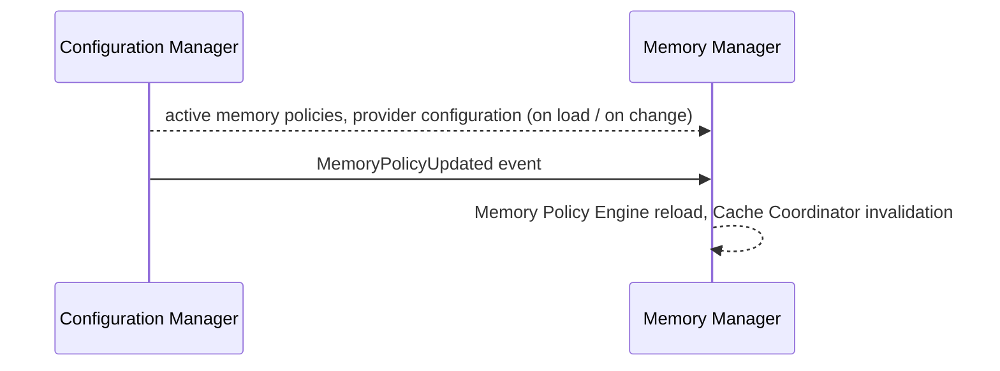

### 20.5 Event Bus

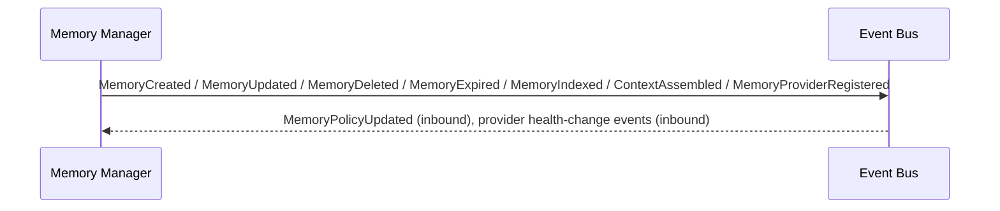

### 20.6 Logger

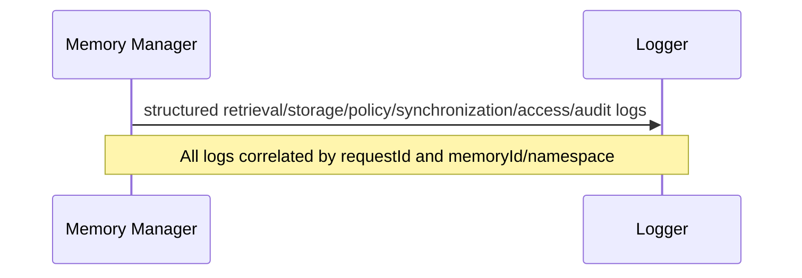

### 20.7 Dashboard Backend

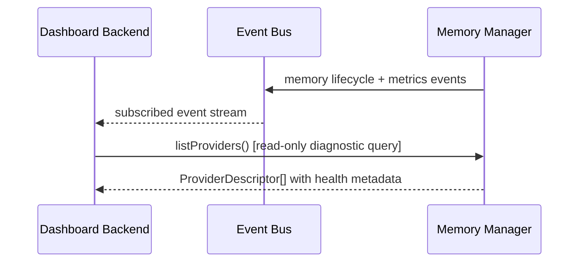

---

## 21. Folder Structure

```
memory-manager/
├── domain/
│   ├── memory.ts                     # Memory Model value object (Section 7)
│   ├── memory-type.ts                # Memory Type enum/registry (Section 8)
│   ├── memory-context.ts             # MemoryContext output model
│   ├── memory-policy.ts              # Policy interface/contract (Section 10)
│   └── provider-descriptor.ts        # Provider capability/metadata contract (Section 11)
│
├── application/
│   ├── memory-coordinator/
│   │   └── memory-coordinator.ts     # Section 5.1 — top-level conductor
│   ├── lifecycle-manager/
│   │   └── memory-lifecycle-manager.ts # Section 5.7 / Section 6 state machine
│   ├── policy-engine/
│   │   ├── memory-policy-engine.ts   # Section 5.8
│   │   └── policies/                 # Built-in policy implementations
│   │       ├── retention.policy.ts
│   │       ├── expiration.policy.ts
│   │       ├── priority.policy.ts
│   │       ├── visibility.policy.ts
│   │       └── namespace.policy.ts
│   ├── namespace-manager/
│   │   └── memory-namespace-manager.ts # Section 5.11
│   ├── session-manager/
│   │   └── memory-session-manager.ts # Section 5.10
│   ├── access-manager/
│   │   └── memory-access-manager.ts  # Section 5.16
│   ├── metadata-manager/
│   │   └── memory-metadata-manager.ts # Section 5.12
│   ├── memory-router/
│   │   └── memory-router.ts          # Section 5.4 — internal provider routing
│   ├── search-coordinator/
│   │   └── memory-search-coordinator.ts # Section 5.5
│   ├── retrieval-engine/
│   │   └── memory-retrieval-engine.ts # Section 5.6
│   ├── context-builder/
│   │   └── memory-context-builder.ts # Section 5.13
│   ├── synchronization-manager/
│   │   └── memory-synchronization-manager.ts # Section 5.14
│   └── index-coordinator/
│       └── memory-index-coordinator.ts # Section 5.15
│
├── infrastructure/
│   ├── memory-registry/
│   │   └── memory-registry.ts        # Section 5.3
│   ├── cache/
│   │   ├── l1-cache-adapter.ts       # In-process cache tier
│   │   └── l2-cache-adapter.ts       # Distributed cache tier client (Section 19.10)
│   ├── config-client/
│   │   └── config-client.ts          # Read-only adapter to Configuration Manager
│   └── event-publisher/
│       └── memory-event-publisher.ts # Adapter to Event Bus (Section 13)
│
├── interfaces/
│   ├── memory-manager.interface.ts   # Public interface contracts (Section 12)
│   ├── memory-provider.interface.ts  # Provider port (Section 11.1)
│   └── memory-policy-plugin.interface.ts # Extension contract for custom policies
│
├── plugins/
│   └── custom-policies/              # Drop-in directory for organization-specific policies
│
├── providers/                        # NOTE: concrete provider implementations live OUTSIDE this module
│   └── (registered externally via registerProvider(); not part of Memory Manager source)
│
├── config/
│   └── default-memory-policies.yaml  # Default global policy/weight/retention configuration
│
└── tests/
    ├── unit/
    ├── provider/
    ├── policy/
    ├── lifecycle/
    ├── retrieval/
    ├── performance/
    ├── stress/
    └── regression/
```

**Design rationale for this structure:**

- `domain/` holds pure data contracts (Memory Model, Memory Type, Context, Policy contract, Provider Descriptor) with no dependency on any other layer, per Clean/Hexagonal Architecture.
- `application/` contains one directory per internal component from Section 5, each independently unit-testable and swappable via Dependency Injection — mirroring the same structural pattern used in the Router MDD for consistency across the codebase.
- `infrastructure/` isolates every outbound dependency (Registry storage, cache tiers, Configuration Manager, Event Bus) behind adapters; core `application/` logic never imports a concrete infrastructure client directly.
- `interfaces/` is the Hexagonal "ports" layer: the public API the rest of the platform calls, the Provider port every storage technology implements, and the policy-plugin port.
- `providers/` is intentionally empty/external — concrete Memory Provider implementations (Knowledge Base, Vector Database, etc.) are separate modules/plugins registered at runtime, never bundled into Memory Manager source, which is the structural guarantee behind "unlimited providers without source modification."
- `plugins/custom-policies/` is the Open/Closed extension point for policy strategy, matching the Router MDD's `plugins/custom-policies/` convention.
- `tests/` mirrors the functional breakdown in Section 22 rather than the folder structure 1:1, keeping cross-cutting test types easy to locate.

---

## 22. Testing Strategy

| Test Category | Coverage |
|---|---|
| **Unit Tests** | Every component in Section 5 tested in isolation with mocked dependencies. |
| **Provider Tests** | Conformance test suite every Memory Provider implementation must pass (interface contract compliance, capability declaration accuracy) — runnable against any provider, built-in or third-party. |
| **Policy Tests** | Each built-in policy tested for correct evaluation in isolation, plus layered-override tests verifying namespace > project > organization > global precedence (Section 10). |
| **Lifecycle Tests** | Full state-machine coverage (Section 6.2), including invalid-transition rejection and Archive/restore paths. |
| **Retrieval Tests** | Each retrieval mode (Section 9) tested independently and in hybrid combination, including partial-provider-failure degradation. |
| **Performance Tests** | Latency/throughput measured against targets for each retrieval mode and for `assembleContext()` under varying budget/scope sizes. |
| **Stress Tests** | Sustained high-throughput operation across all public interfaces, validating cache tiers and concurrent execution pool behavior hold up without degradation. |
| **Regression Tests** | A fixed corpus of (operation input → expected result) cases re-run on every change, especially around policy precedence and lifecycle transitions. |

---

## 23. Future Expansion

| Future Capability | Extension Mechanism |
|---|---|
| **Multiple Knowledge Bases** | Multiple provider registrations sharing the `knowledgeBase`-capable capability tag; Memory Router fans out or selects per configuration, no code change. |
| **Vector Databases** | New provider registration declaring `semanticSearch`/embedding-reference capabilities. |
| **Graph Databases** | New provider registration declaring graph-traversal capabilities, consumed naturally by the existing `relationships` field (Section 7). |
| **Cloud Memory Providers** | Any cloud-hosted storage service implementing the Memory Provider Interface. |
| **Distributed Memory** | Supported via Section 19.1/19.4's stateless, cluster-friendly design. |
| **Memory Federation** | Section 19.14 — remote clusters presented as providers at a coarser grain. |
| **Plugin-Based Memory Providers** | The default mechanism (Section 11) for every provider, built-in or future. |
| **Cross-Region Replication** | Provider-declared capability plus Synchronization Manager reconciliation (Section 19.13). |

---

## 24. Risks

| Category | Risk | Mitigation |
|---|---|---|
| **Architecture** | The Memory Provider Interface (Section 11.1) proves too narrow for a future storage paradigm (e.g. a provider needing bidirectional streaming rather than request/response). | Interface is explicitly versioned (Section 19.8); additive minor-version extensions are expected, and a major-version bump is an accepted, planned escape hatch rather than a design failure. |
| **Consistency** | Eventual-consistency cache invalidation (Section 19.10) and cross-provider synchronization (Section 5.14) could surface a brief stale-read window under specific timing. | Explicitly accepted trade-off for latency/availability; consistency-sensitive callers can bypass cache (19.10) and the Synchronization Manager's reconciliation bounds the window for cross-provider drift. |
| **Performance** | Very large `assembleContext()` requests (large project history) could exceed latency budgets if ranking/merging is not properly bounded. | Budget constraints applied early (Section 18.7), streaming retrieval (19.11) for large result sets, and performance tests specifically target worst-case scope sizes. |
| **Scalability** | A very large number of registered providers or custom policies could linearly increase per-operation evaluation cost. | Capability-indexed Registry lookup (not linear scan) and lazy policy loading (Section 18.2) bound marginal cost; policies are contractually required to be side-effect-free and fast (no I/O inside evaluation). |
| **Maintenance** | As namespace/policy layering (Section 10.4) accumulates organization-specific overrides, precedence can become hard to reason about, mirroring the analogous risk in the Router MDD. | Audit Logs (Section 15) and `listProviders()`/policy-inspection tooling give operators a way to inspect effective policy for a given namespace without code inspection. |

---

## 25. Design Decisions

| Decision | Alternatives Considered | Trade-off Discussion | Why Chosen |
|---|---|---|---|
| Memory Manager is a pure orchestration layer with zero storage implementation | Merge Memory Manager and Knowledge Base into one module | Conflating orchestration with a specific storage technology would make every future provider (Vector DB, Graph DB) a second-class citizen bolted onto Knowledge-Base-shaped assumptions, defeating the "unlimited providers" requirement. | Strict separation keeps the orchestration layer provider-agnostic from day one, matching the same reasoning applied to the Router/Provider Manager split in this platform's architecture. |
| Internal "Memory Router" component, distinct from the platform Router module | Reuse or extend the platform Router module for memory-provider selection | The platform Router selects AI execution targets based on capability/cost/latency policy; memory-provider selection is a structurally similar but semantically unrelated concern (no model execution, no AI capability scoring). Sharing the module would create an inappropriate coupling between AI-execution routing and data-storage routing. | A separate, internally-scoped Memory Router component reuses the *pattern* (candidate resolution + policy-aware selection) without coupling the two domains, keeping both modules independently evolvable. |
| Stateless service design (Section 19.1) over a stateful, sharded design | A stateful Memory Manager owning its own partitioned storage directly | A stateful design would simplify some read-path latency but would reintroduce exactly the storage-technology coupling this module is designed to avoid, and would complicate horizontal scaling and failover significantly. | Statelessness plus provider delegation gets both goals — provider-agnosticism and trivial horizontal scaling — at the cost of an extra network hop to providers, judged acceptable given caching (Section 18.1/19.10). |
| Tiered L1/L2 cache with eventual-consistency invalidation | Strict-consistency cache (synchronous invalidation across all instances before acknowledging a write) | Strict consistency would materially increase write latency and cross-instance coordination complexity for a benefit (avoiding a sub-second stale-read window) that most memory operations do not require. | Eventual consistency with short TTLs and explicit cache-bypass for consistency-sensitive callers matches the actual risk profile of project-memory workloads. |
| Fixed namespace hierarchy (org → workspace → team → project → user → session) as a first-class schema field | Fully free-form tenant-scoping left to caller convention | Free-form scoping is more flexible on paper but makes isolation guarantees unverifiable by the Memory Manager itself — exactly the failure mode multi-tenant isolation requirements (Section 19.3) cannot tolerate. | A fixed, enforced hierarchy lets the Namespace Manager guarantee isolation structurally, not by convention, mirroring the Router MDD's preference for fixed structure over unconstrained flexibility where correctness-critical guarantees are involved. |
| Providers are entirely external plugins, never bundled in Memory Manager source (`providers/` folder intentionally empty) | Ship built-in provider implementations (e.g. a default Knowledge Base implementation) inside the Memory Manager module | Bundling even a "default" provider risks the same coupling this module exists to avoid, and blurs the line for future contributors about where provider logic belongs. | Keeping the module's own source free of any concrete provider implementation makes the "add a provider without modifying Memory Manager source" requirement structurally true, not just aspirationally true. |

---

## 26. Diagrams

### 26.1 Component Diagram

*(See Section 5 for the full component diagram.)*

### 26.2 Memory Architecture Diagram

*(See Section 1.4 for the platform-level architecture position diagram.)*

### 26.3 Memory Lifecycle Diagram

*(See Section 6.2 for the full lifecycle state diagram.)*

### 26.4 Provider Architecture Diagram

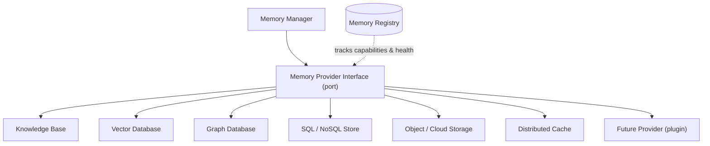

### 26.5 Retrieval Flow Diagram

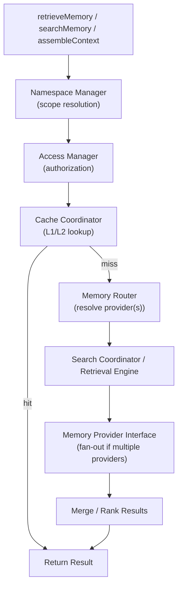

### 26.6 Context Assembly Diagram

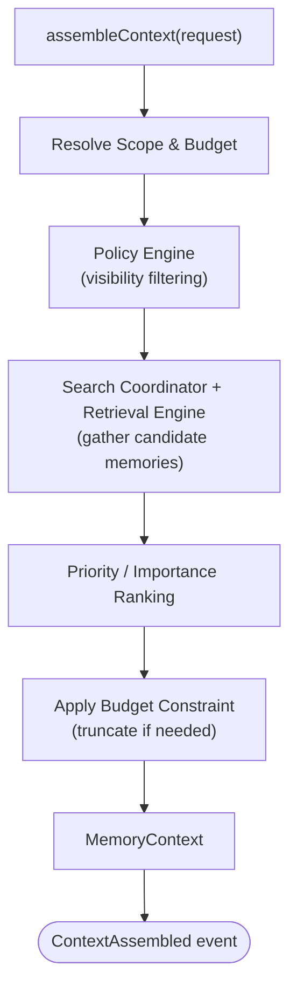

### 26.7 Sequence Diagram — Full Store-to-Available Flow

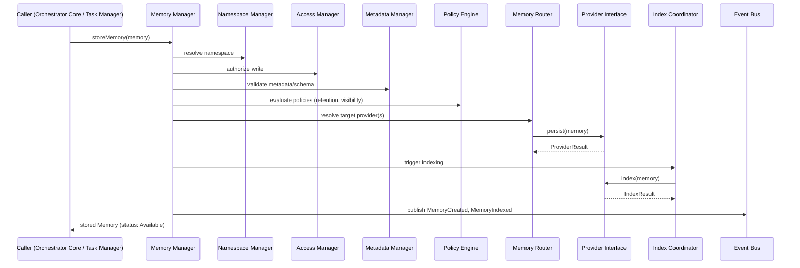

### 26.8 Folder Structure Diagram

*(See Section 21 for the full annotated folder tree.)*

---

*End of Memory Manager Module Design Document.*
