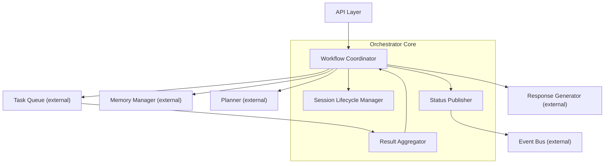
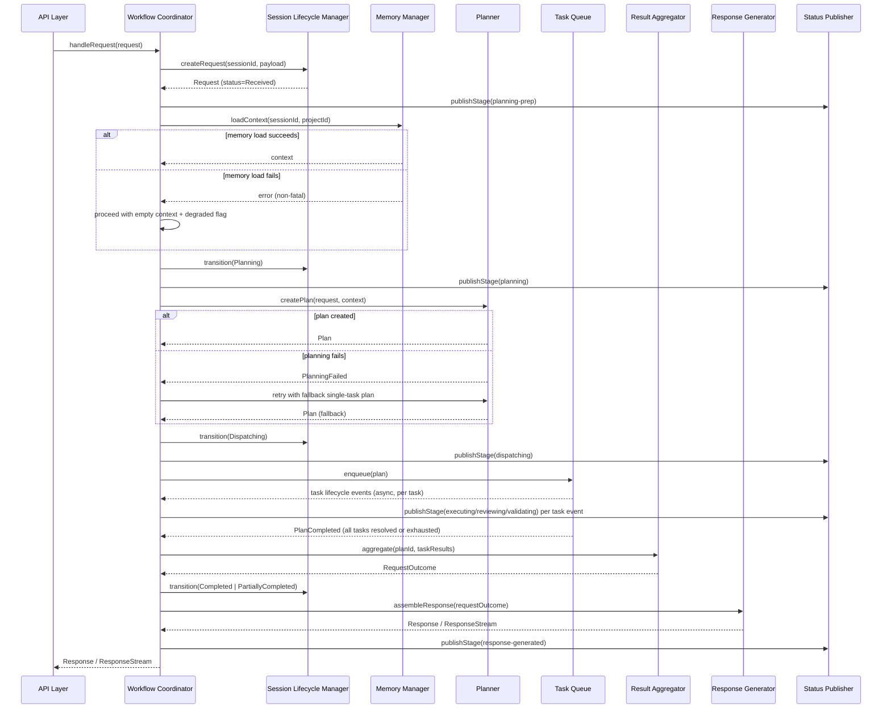
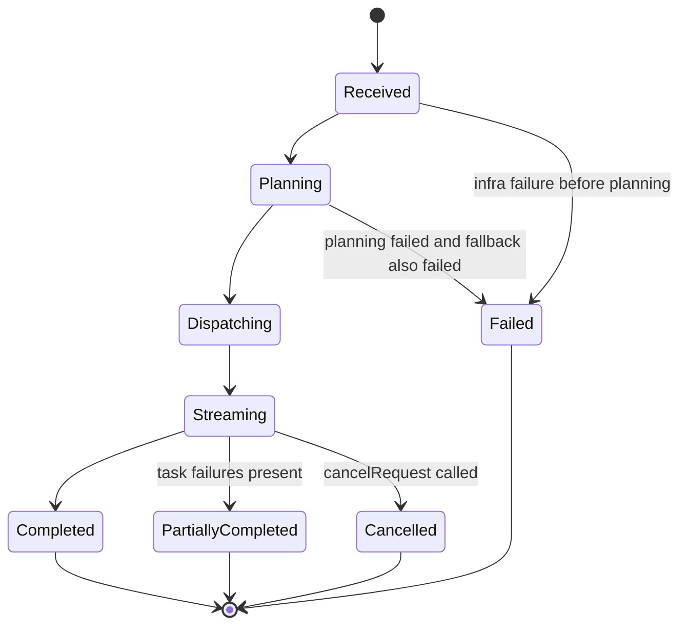
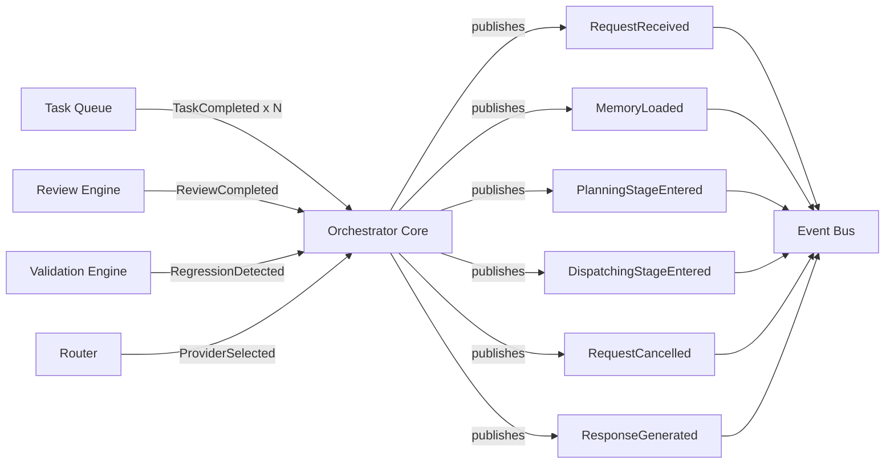
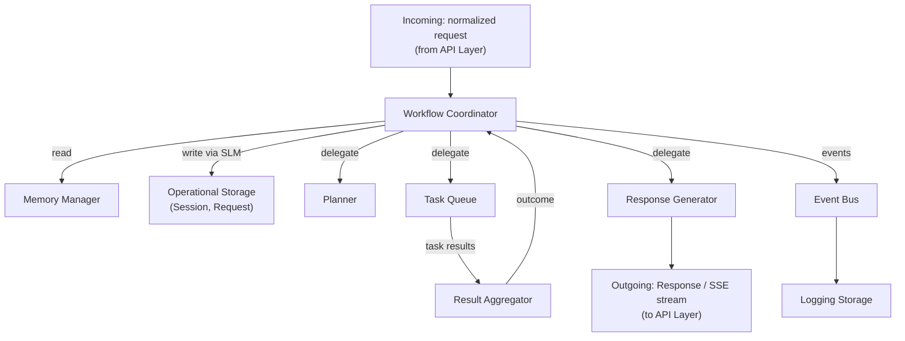
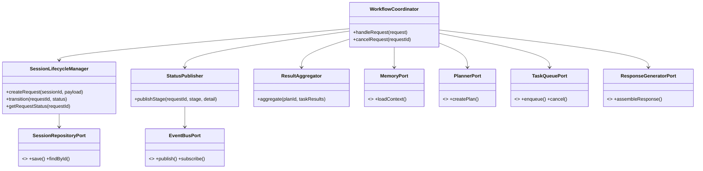

# Module Design Document (MDD)
## Orchestrator Core

**Version:** 1.0
**Status:** Draft for engineering review
**Companion to:** SDD v1.0, API Specification v1.0, Database Design Document v1.0

---

## 1. Executive Summary

The Orchestrator Core is the **central coordinator** of the Hybrid AI Development Platform. It is not the Router, not the Planner, not the Provider Manager, and not the Task Queue — it is the conductor that receives an incoming request from the API Layer and drives it through the full orchestration lifecycle by calling those modules in the correct sequence, at the correct time, with the correct data.

It exists because someone has to own the *end-to-end workflow shape* — request received → context hydrated → plan created → tasks executed → reviewed → validated → response assembled — without any single downstream module (Planner, Router, Provider Manager, Review Engine) needing to know about the others or about its position in the larger sequence. Without this module, every other module would need to know who to call next, producing exactly the tight coupling the platform's architecture is designed to avoid.

Within the complete architecture, the Orchestrator Core sits directly behind the API Layer and in front of every other orchestration module (Memory Manager, Planner, Task Queue, Router, Provider Manager, Review Engine, Validation Engine, Response Generator, Event Bus). All other modules are treated in this document as **already-existing, externally-owned dependencies** injected into the Orchestrator Core via their public interfaces — this document designs only the coordination logic that ties them together.

---

## 2. Goals

### Primary Goals
- Own the canonical **request-to-response workflow sequence** for the entire platform.
- Provide a single, stable entry point (`handleRequest`) that the API Layer calls, regardless of how complex the underlying orchestration becomes.
- Guarantee that every request produces either a `Completed`, `PartiallyCompleted`, or `Failed` outcome — no request is ever silently dropped.
- Emit a complete, correlated event trail for every request so the full lifecycle is observable and replayable.

### Secondary Goals
- Keep the coordination logic thin — it delegates all actual work (planning, routing, execution, reviewing, validating) to the appropriate module and contains no business logic belonging to those modules.
- Support graceful degradation at every step (missing memory, planning failure, provider failure) so a failure downstream never crashes the session.
- Support cancellation of an in-flight request at any stage.

### Non-Goals
- The Orchestrator Core does **not** decide which model or provider executes a task (Router's job).
- The Orchestrator Core does **not** decompose a request into a task graph (Planner's job).
- The Orchestrator Core does **not** schedule or manage task concurrency (Task Queue's job).
- The Orchestrator Core does **not** talk to any provider SDK directly (Provider Manager's job).
- The Orchestrator Core does **not** persist domain entities directly — it calls the owning module's interface (e.g., Memory Manager), never a raw repository.

### Design Constraints
- Must depend only on the public interfaces (ports) of other modules — never on their internals.
- Must be stateless with respect to business data between requests; all durable state is owned by the modules it coordinates (Memory Manager, Task Queue, etc.) or by the Session/Request entities in Operational Storage (per the DDD).
- Must support both streaming (`stream:true`) and buffered (`stream:false`) response modes without two divergent code paths (per ASD §4).

### Future Goals
- Support multi-request pipelining within a single session (concurrent independent requests).
- Support mid-flight re-planning (a running Plan being revised without restarting the whole request).

---

## 3. Responsibilities

### Must Have
- Accept a normalized request from the API Layer and create/attach a `Session`/`Request` record.
- Trigger context hydration via the Memory Manager before planning.
- Invoke the Planner to obtain a `Plan`.
- Hand the `Plan` to the Task Queue for execution and await/observe its results.
- Coordinate the per-task Review/Validation pass sequencing (calling Review Engine and Validation Engine at the correct point relative to task execution, as dictated by each task's policy).
- Assemble the final response via the Response Generator once all tasks resolve (or the request is cancelled/timed out).
- Publish lifecycle events (`RequestReceived`, `ResponseGenerated`, etc.) to the Event Bus at each major transition.
- Enforce the overall session timeout ceiling (SDD §4).
- Support request cancellation, propagating cancellation to the Task Queue.

### Should Have
- Emit intermediate status information (for streaming status tokens) as the workflow progresses through stages.
- Apply per-request routing preference overrides (from the request payload) by passing them through to the Planner/Router without interpreting them itself.
- Track and expose whether a request degraded (e.g., memory hydration failed) via `orchestrator_metadata`.

### Future Responsibilities
- Coordinate multi-request pipelining within a session.
- Support mid-flight plan revision triggered by a Task Queue escalation (SDD §6.5 Router escalation path).

---

## 4. Scope

### What this module owns
- The **workflow sequence** itself (the order of calls: memory → plan → execute → review/validate → respond).
- Session/Request lifecycle state transitions (`Received → Planning → Dispatching → Streaming → Completed/PartiallyCompleted`, per SDD §25).
- Top-level error classification for the request as a whole (did the request as a whole succeed, partially succeed, or fail).
- The `orchestrator_metadata` block returned to the client (ASD §4).

### What it never owns
- Task-level state machine internals (owned by Task Queue).
- Model/provider selection logic (owned by Router).
- Actual provider execution (owned by Provider Manager).
- Memory storage/retrieval mechanics (owned by Memory Manager).
- Review/validation criteria and scoring logic (owned by Review Engine / Validation Engine).
- Response formatting details for specific client shapes (owned by Response Generator).

### What other modules are responsible for
| Module | Responsibility |
|---|---|
| Memory Manager | Loading and updating Live/Project/Long-Term Memory |
| Planner | Task decomposition into a Plan |
| Task Queue | Scheduling, dependency resolution, task execution lifecycle |
| Router | Capability-based provider/model selection |
| Provider Manager | Actual provider invocation, retries, failover |
| Review Engine | Quality review of task output |
| Validation Engine | Regression/behavioral validation |
| Response Generator | Formatting the final client-facing response |
| Event Bus | Event delivery to subscribers |

The Orchestrator Core calls each of these through its public interface and never duplicates or bypasses their logic — this boundary is the primary safeguard against overlapping responsibilities across the platform.

---

## 5. Internal Architecture

The Orchestrator Core is internally composed of four cohesive sub-components, each with a single responsibility, all instantiated via dependency injection at the composition root.



### 5.1 Workflow Coordinator
- **Purpose**: The single orchestration state machine driving a request from receipt to response.
- **Responsibilities**: Sequence the calls to Memory Manager, Planner, Task Queue, Response Generator; enforce the session timeout; handle cancellation propagation.
- **Interfaces**: `run(request): ResponseStream` (internal), consumed only by the Orchestrator Core's own public `handleRequest`.
- **Dependencies**: Session Lifecycle Manager, Memory Manager port, Planner port, Task Queue port, Response Generator port, Status Publisher.
- **Internal communication**: direct synchronous/async calls to injected ports; delegates all event emission to the Status Publisher rather than calling the Event Bus directly, keeping event-formatting concerns out of the coordination logic.
- **Lifecycle**: instantiated once (stateless service); a fresh execution context is created per request, not per instance.

### 5.2 Session Lifecycle Manager
- **Purpose**: Owns Session/Request state transitions and persistence calls.
- **Responsibilities**: Create/attach Session and Request records; transition status per the state machine in §8; persist transitions through the Operational Storage repository port (per the DDD).
- **Interfaces**: `createRequest(sessionId, payload): Request`, `transition(requestId, newStatus)`.
- **Dependencies**: Operational Storage repository port (Session/Request repositories, per DDD §6.2/§6.3).
- **Internal communication**: called synchronously by the Workflow Coordinator at each transition point.
- **Lifecycle**: stateless service, one call per transition.

### 5.3 Status Publisher
- **Purpose**: Translate internal workflow stage changes into both Event Bus events and status-token stream deltas (ASD §5).
- **Responsibilities**: Map a workflow stage (`planning`, `routing`, `executing`, `reviewing`, `validating`) to the correct outgoing event type and, if the request is streaming, an `orchestrator_status` SSE delta.
- **Interfaces**: `publishStage(requestId, stage, detail)`.
- **Dependencies**: Event Bus port, API Layer's streaming sink (injected per-request, not held as module state).
- **Internal communication**: invoked by the Workflow Coordinator at every stage boundary.
- **Lifecycle**: stateless service.

### 5.4 Result Aggregator
- **Purpose**: Collect Task Queue results (per-task outcomes across a Plan) into a single request-level outcome.
- **Responsibilities**: Determine overall request status (`Completed` if all tasks completed; `PartiallyCompleted` if any task ended `Failed`/`CompletedWithWarnings`; `Failed` if the Plan itself could not be created or no tasks could execute); build the `orchestrator_metadata` summary.
- **Interfaces**: `aggregate(planId, taskResults[]): RequestOutcome`.
- **Dependencies**: none beyond the data passed to it (pure aggregation logic).
- **Internal communication**: invoked by the Workflow Coordinator once the Task Queue signals plan completion (via event subscription or await, per §7).
- **Lifecycle**: stateless, pure function-like service.

---

## 6. Public Interfaces

### 6.1 `handleRequest(request): ResponseStream | Response`
- **Purpose**: The sole entry point called by the API Layer for every `/v1/chat/completions` call.
- **Inputs**: normalized internal request object — `{ messages[], tools?, stream, sessionId?, projectId?, routingPreferences?, metadata? }` (per ASD §4).
- **Outputs**: if `stream:true`, a `ResponseStream` handle the API Layer consumes to emit SSE frames; if `stream:false`, a fully assembled `Response` object (internally still executed as a stream and buffered, per ASD §4 design decision).
- **Validation**: delegates schema validation to the API Layer (already validated by the time this is called); performs only cross-cutting checks it owns — session/project existence, timeout budget sanity.
- **Error Conditions**: `MemoryNotFound` (invalid sessionId/projectId reference), `SessionTimeout`, propagated `PlanningFailed`/`NoCandidateAvailable`/`ProviderTimeout` from downstream modules, wrapped into the standard error taxonomy (§12).
- **Side Effects**: creates/updates Session and Request records; publishes the full request-lifecycle event sequence; triggers Memory/Knowledge writes indirectly via downstream modules.

### 6.2 `cancelRequest(requestId)`
- **Purpose**: Cancel an in-flight request.
- **Inputs**: `requestId`.
- **Outputs**: none (fire-and-forget acknowledgment).
- **Validation**: `requestId` must reference an active (non-terminal) Request.
- **Error Conditions**: `RequestNotFound`, `RequestAlreadyTerminal` (no-op, not an error, if already completed).
- **Side Effects**: propagates cancellation to the Task Queue; transitions Request status to `PartiallyCompleted` (or a dedicated `Cancelled` status if adopted); publishes a cancellation event.

### 6.3 `getRequestStatus(requestId): RequestStatus`
- **Purpose**: Poll-based status query, backing `GET /v1/status/{sessionId}` (ASD §15) for clients that don't support SSE.
- **Inputs**: `requestId`.
- **Outputs**: current stage, per-task summary, `orchestrator_metadata` if terminal.
- **Validation**: `requestId` must exist.
- **Error Conditions**: `RequestNotFound`.
- **Side Effects**: none (read-only).

---

## 7. Internal Workflow



**Decision points**:
- Memory load failure → degrade, never blocks (SDD §18).
- Planning failure → fallback single-task plan (SDD §6.3, §18).
- Any task in the Plan ending `Failed` → does not fail the whole request; the Result Aggregator marks the request `PartiallyCompleted`.
- Session timeout ceiling reached mid-execution → Workflow Coordinator triggers `cancelRequest` internally and proceeds to aggregate whatever task results exist so far.

**Retries**: retries at the task/provider level are entirely owned by the Task Queue/Provider Manager (SDD §18); the Orchestrator Core's only retry concern is the single Planner fallback described above — it does not implement its own retry loop around Task Queue or Provider calls.

**Fallback behavior**: if the Task Queue itself is unavailable (infrastructure-level failure, not a task-level failure), the Workflow Coordinator fails the request as `Failed` immediately rather than attempting a workaround — this is a Terminal error class (§12), since there is no meaningful degraded path without a functioning Task Queue.

---

## 8. State Management

### State Model
The Orchestrator Core's own state is limited to the **Request** entity's lifecycle (the Session entity's broader lifecycle is owned jointly with the Memory Manager per DDD §6.2). It holds no other durable state — all business data (Plan, Task, Review, Validation) belongs to the modules that own those entities.

### State Transitions

(Matches SDD §25 Request/Session state diagram, with `Cancelled` and `Failed` made explicit for this module's error-handling completeness.)

### Lifecycle
A Request's state object is created at `handleRequest` entry and reaches a terminal state (`Completed`/`PartiallyCompleted`/`Cancelled`/`Failed`) before `handleRequest` returns (for `stream:false`) or before the SSE stream closes (for `stream:true`).

### Persistence
Every transition is persisted via the Session Lifecycle Manager to Operational Storage (DDD §6.3, §8) — the Orchestrator Core never holds the authoritative state only in memory; a process restart mid-request should be recoverable by reading the last persisted Request state and its associated Event history (DDD §16 replay).

### Recovery
On restart, any Request left in a non-terminal state is reconciled by checking the Task Queue for its Plan's actual task states; if the Task Queue confirms the Plan completed while the Orchestrator Core was down, the Result Aggregator runs retroactively; otherwise the Request is marked `Failed` with a `orchestratorRestart` reason and the client (if still connected) receives a terminal error.

### Synchronization
Because a single Request is handled by a single Workflow Coordinator execution context, no cross-request locking is needed; concurrency across *different* requests is naturally isolated. Within a single request, the Workflow Coordinator awaits the Task Queue's completion signal (event-driven, per §9) rather than polling, avoiding busy-wait synchronization overhead.

---

## 9. Events

| Event | Publisher | Subscribers | Payload | Purpose | Trigger | Failure Behaviour |
|---|---|---|---|---|---|---|
| `RequestReceived` | Orchestrator Core (Status Publisher) | Logger, API status stream, Learning Layer | `{ requestId, sessionId, projectId, timestamp }` | Marks the start of orchestration | `handleRequest` entry, after Request record created | Publish failure is logged and swallowed — never blocks the workflow (SDD §18 Event Bus policy) |
| `MemoryLoaded` | Orchestrator Core (relays Memory Manager's own event, or emits its own if Memory Manager doesn't) | Planner, Logger | `{ requestId, degraded: bool }` | Signals context is ready (or degraded) for planning | After `loadContext` call returns/fails | Same as above |
| `PlanningStageEntered` | Orchestrator Core | API status stream, Logger | `{ requestId, stage: "planning" }` | Status-token support (ASD §5) | Before invoking Planner | Non-blocking |
| `DispatchingStageEntered` | Orchestrator Core | API status stream, Logger | `{ requestId, planId }` | Status-token support | Before `enqueue(plan)` | Non-blocking |
| `RequestCancelled` | Orchestrator Core | Task Queue, Logger, Learning Layer | `{ requestId, reason }` | Propagates cancellation | `cancelRequest` called, or session timeout ceiling reached | Non-blocking |
| `ResponseGenerated` | Orchestrator Core | API Layer, Logger, Learning Layer | `{ requestId, status, orchestratorMetadata }` | Marks orchestration complete | After Response Generator returns | Non-blocking |

**Consumed (not published) by this module**: `TaskCreated`, `ProviderSelected`, `LocalExecutionStarted`/`CloudReviewStarted`, `ReviewCompleted`, `BrowserValidationStarted`, `RegressionDetected`, `TaskCompleted` — these are subscribed to purely to drive the Status Publisher's stage mapping (§5.3) and to let the Result Aggregator know when a Plan has fully resolved; the Orchestrator Core does not act on their business content, only their occurrence.



---

## 10. Dependencies

| Dependency | Type | Why it exists |
|---|---|---|
| Memory Manager | Internal module (port) | Context hydration before planning; the only source of Live/Project/Long-Term context |
| Planner | Internal module (port) | Task decomposition; Orchestrator Core has no decomposition logic of its own |
| Task Queue | Internal module (port) | Execution scheduling; Orchestrator Core never executes tasks directly |
| Response Generator | Internal module (port) | Final response shaping; keeps client-format concerns out of the coordination logic |
| Event Bus | Internal module (port) | Lifecycle event publication and consumption for status tracking |
| Configuration Manager | Internal module (port) | Reads session timeout ceiling, streaming defaults, degradation policy flags |
| Logger | Internal module (port) | Structured, correlated logging at every stage transition |
| Operational Storage (via Session Lifecycle Manager) | Infrastructure (repository port) | Durable Request/Session state persistence |
| Router, Provider Manager, Review Engine, Validation Engine | **Not direct dependencies** | These are called *by the Task Queue*, not by the Orchestrator Core — the Orchestrator Core only observes their outcomes via events, preserving the scope boundary in §4 |

No dependency on any provider SDK, browser engine, or vector store exists at this module's boundary — all of that is behind the modules it depends on.

---

## 11. Configuration

| Option | Default | Validation | Notes |
|---|---|---|---|
| `orchestrator.sessionTimeoutMs` | 600000 (10 min) | positive integer | Overall session ceiling (SDD §4) |
| `orchestrator.streamingDefault` | `true` | boolean | Applied when a request omits `stream` |
| `orchestrator.degradationPolicy` | `"lenient"` | enum: `strict`/`lenient` | `strict` fails the request on memory-load failure instead of degrading; `lenient` proceeds with empty context |
| `orchestrator.planningFallbackEnabled` | `true` | boolean | Whether the single-task fallback plan is attempted on planning failure |
| `orchestrator.statusTokenGranularity` | `"stage"` | enum: `stage`/`task` | `task` emits a status token per individual task transition, not just per workflow stage, for more granular UI feedback |

**Profiles**: `development` enables verbose per-task status tokens and a shorter session timeout for faster failure feedback during testing; `production` uses `stage`-level granularity and the full timeout.

**Environment variables**: `ORCH_SESSION_TIMEOUT_MS`, `ORCH_STREAMING_DEFAULT`, `ORCH_DEGRADATION_POLICY` — override file-based config at boot, consistent with the Configuration Manager's layering (SDD §13).

**Future Dashboard Integration**: all options above are already scoped under the `orchestrator.*` config namespace, so the future dashboard (DDD §10) can read/write them through the existing Configuration Manager `PATCH /v1/config` path with zero new plumbing.

---

## 12. Error Handling

| Failure | Classification | Handling |
|---|---|---|
| Invalid Data (malformed request reaching this module despite API-layer validation) | Recoverable at API boundary, Terminal here | Returns `400`-mapped error immediately, no workflow started |
| Memory Manager timeout | Recoverable | Degrade to empty context (per `degradationPolicy`) |
| Planner failure | Recoverable | Fallback single-task plan; if fallback also fails, Terminal |
| Task Queue unavailable (infra) | Terminal | Immediate `Failed` classification, no partial workaround |
| Provider Failure (surfaced from Task Queue as a task-level `Failed`) | Recoverable at request level | Does not fail the request; contributes to `PartiallyCompleted` |
| Review/Validation failure exhaustion | Recoverable at request level | Task marked `CompletedWithWarnings`; request proceeds |
| Retry Failure (Planner fallback also fails) | Terminal | Request marked `Failed`, error surfaced to client |
| Unexpected Exception (any uncaught error in the Workflow Coordinator) | Terminal | Caught at the `handleRequest` boundary, logged with full stack + correlation ID, mapped to a generic `500`-class error — never leaks internal exception detail to the client |
| Configuration Error (invalid `orchestrator.*` values at boot) | Terminal (boot-time) | Fails fast at process startup, per Configuration Manager's fail-fast policy (SDD §18) |
| Network Failure (client disconnect mid-stream) | Recoverable | Treated as an implicit `cancelRequest` (§6.2) |

**Recovery Strategy**: outlined in §8 (Recovery) — reconciliation against Task Queue state on restart.

**Rollback Strategy**: the Orchestrator Core does not perform data rollback itself (no domain data is mutated at this layer); any code-level rollback (e.g., reverting a file edit) is the Git Manager's responsibility, triggered independently, not by this module.

**Retry Policy**: exactly one retry path exists at this module's level — the Planner fallback (§7). All other retry/backoff/failover behavior belongs to downstream modules (SDD §18); the Orchestrator Core deliberately does not implement a second retry layer on top of theirs, to avoid compounding retry storms.

---

## 13. Logging

| Log type | Content | When emitted |
|---|---|---|
| Info | Stage transitions (`Received→Planning→Dispatching→...`) | Every transition |
| Warning | Degraded context, fallback plan used, task-level failures folded into `PartiallyCompleted` | On occurrence |
| Debug | Full request payload (redacted), intermediate context size, plan shape | Debug mode only |
| Error | Terminal failures, uncaught exceptions | On occurrence, includes stack trace |
| Performance | Stage durations (`planningDurationMs`, `dispatchDurationMs`, `totalDurationMs`) | On each stage completion and at request end |
| Audit | Cancellation events (who/when), configuration reads at boot | On occurrence |

Every log line carries `requestId`, `sessionId`, and `correlationId` (DDD §17), so the full request lifecycle can be reconstructed by a single correlated query regardless of which downstream module produced a given line.

---

## 14. Monitoring

- **Health Checks**: `handleRequest` readiness is reported via the platform `GET /health` (ASD §2), gated on the Orchestrator Core successfully resolving its injected dependencies (Memory Manager, Planner, Task Queue, Response Generator, Event Bus) at boot.
- **Metrics**: request throughput (requests/min), stage-duration histograms (planning/dispatch/total), `PartiallyCompleted` rate, fallback-plan usage rate, cancellation rate.
- **Performance Monitoring**: total request duration tracked end-to-end from `RequestReceived` to `ResponseGenerated`, exposed for the dashboard's future performance view (DDD §17 Performance Metrics category).
- **Latency**: per-stage latency breakdown (how much time is spent in memory load vs. planning vs. execution vs. response assembly) — critical for diagnosing whether slowness originates in this module or a downstream one.
- **Resource Usage**: concurrent in-flight request count against the Task Queue's configured concurrency ceiling (SDD §21), to detect Orchestrator-level backpressure.
- **Alerts**: sustained elevated `Failed`/`PartiallyCompleted` rate, sustained session-timeout-ceiling hits, Task Queue unavailability.

---

## 15. Security

- **Authentication**: not this module's concern directly — the API Layer authenticates before `handleRequest` is ever called (ASD §6); the Orchestrator Core trusts the `AuthContext` passed through.
- **Authorization**: session/project ownership checks (a request must reference a session/project the authenticated caller may access) are enforced by the Session Lifecycle Manager before proceeding, using the `AuthContext`.
- **Input Validation**: the module performs defense-in-depth re-validation of critical fields (non-empty `messages[]`, valid `sessionId`/`projectId` format) even though the API Layer already validated, since this module must also be safely callable by other future internal callers (e.g., a scheduled/background trigger) that might bypass the API Layer.
- **Secrets**: none handled directly by this module — no provider credentials, no raw API keys ever reach the Orchestrator Core's scope (SDD §20, DDD §19).
- **Data Protection**: request payloads are never logged unredacted (§13); the `metadata` field on requests is treated as untrusted free text and never interpolated into any downstream call in a way that could enable injection.
- **Attack Prevention**: session timeout ceiling (§11) doubles as a resource-exhaustion guard against runaway or maliciously long-running requests; per-request cancellation (§6.2) allows immediate termination of abusive sessions.

---

## 16. Performance

- **Caching**: the Orchestrator Core itself caches nothing durable — it relies on the Memory Manager's and Model Registry's own caching (SDD §4.6); this keeps the module free of cache-invalidation complexity.
- **Lazy Loading**: memory context is only hydrated once per request, sized to the Planner's needed budget (DDD §9 retrieval strategy) — the Orchestrator Core does not pre-fetch anything speculative.
- **Concurrency**: multiple `handleRequest` calls execute concurrently, each in an isolated execution context; the module itself holds no shared mutable state across requests, so no locking is required at this layer (concurrency limits are enforced downstream by the Task Queue).
- **Async Processing**: the entire workflow after `enqueue(plan)` is event-driven/async — the Workflow Coordinator does not block a thread waiting on task execution, it resumes on the Task Queue's completion signal.
- **Optimization**: stage transitions are lightweight (state update + event publish); no heavy computation occurs in this module — all CPU/IO-heavy work is delegated, keeping the Orchestrator Core's own footprint minimal and its latency contribution to the overall request small and predictable.
- **Memory Usage**: only the current request's in-progress context (bounded by the Memory Manager's budget) is held in this module's execution scope; nothing request-scoped persists beyond `handleRequest`'s return.
- **Scalability**: because this module holds no cross-request state, horizontal scaling (SDD §21 — multiple Orchestrator process instances behind a load balancer) requires no special handling here beyond the shared session store already assumed by the Session Lifecycle Manager.

---

## 17. Data Flow



No storage domain is written to directly by the Orchestrator Core except through the Session Lifecycle Manager's calls into the Operational Storage repository port (DDD §6.2/§6.3) — all other storage (Knowledge, Artifact, Configuration) is touched only indirectly via the modules it coordinates.

---

## 18. Interaction With Other Modules

| Module | Who calls whom | Nature of interaction |
|---|---|---|
| API Layer | API Layer → Orchestrator Core | Synchronous entry (`handleRequest`); Orchestrator Core streams back via the handle it returns |
| Router | Task Queue → Router (not Orchestrator Core) | Orchestrator Core only observes `ProviderSelected` events, never calls Router directly |
| Provider Manager | Task Queue → Provider Manager (not Orchestrator Core) | Same as above — observed via events only |
| Memory Manager | Orchestrator Core → Memory Manager | Synchronous call at request start (`loadContext`); Memory Manager itself writes back on `TaskCompleted` independently |
| Planner | Orchestrator Core → Planner | Synchronous call (`createPlan`), with fallback retry owned here |
| Task Queue | Orchestrator Core → Task Queue (`enqueue`), Task Queue → Orchestrator Core (events) | Bidirectional: command to start, events to report progress/completion |
| Review Engine | Task Queue → Review Engine (not Orchestrator Core) | Observed via `ReviewCompleted` event only |
| Logger | Orchestrator Core → Logger | One-way, every stage transition |
| Configuration Manager | Orchestrator Core → Configuration Manager | Read-only at boot and on config hot-reload notification |
| Event Bus | Orchestrator Core → Event Bus (publish), Event Bus → Orchestrator Core (subscribed task/review/validation events) | Bidirectional pub/sub |

This table is the concrete enforcement mechanism for the scope boundary in §4: any interaction not listed here (e.g., Orchestrator Core calling Router directly) would be a scope violation.

---

## 19. Folder Structure

```
orchestrator-core/
  application/
    workflow-coordinator/     # §5.1 — the core state machine driving a request
    session-lifecycle/         # §5.2 — Request/Session state transitions + persistence calls
    status-publisher/          # §5.3 — stage-to-event/status-token translation
    result-aggregator/         # §5.4 — task results → request-level outcome
  domain/
    entities/                  # Request, RequestOutcome (module-local value objects)
    ports/                     # MemoryPort, PlannerPort, TaskQueuePort, ResponseGeneratorPort,
                                # EventBusPort, ConfigPort, LoggerPort, SessionRepositoryPort
  infrastructure/
    event-subscriptions/        # wiring for consumed events (TaskCompleted, ReviewCompleted, etc.)
  config/
    schema.*                    # orchestrator.* config schema definition (§11)
  tests/
    unit/
    integration/
    contract/
```

Each folder maps directly to a section of this document: `application/` holds the four sub-components from §5, `domain/ports/` holds the dependency contracts from §10, `infrastructure/event-subscriptions/` implements the consumption side of §9.

---

## 20. File Responsibilities

| File (conceptual) | Purpose | Public API | Private Logic | Dependencies |
|---|---|---|---|---|
| `workflow-coordinator.*` | Drives the full request sequence | `handleRequest`, `cancelRequest` | Stage sequencing, fallback-plan trigger, timeout enforcement | SessionLifecycle, MemoryPort, PlannerPort, TaskQueuePort, ResponseGeneratorPort, StatusPublisher |
| `session-lifecycle.*` | Request/Session state transitions | `createRequest`, `transition`, `getRequestStatus` | State machine validation (§8) | SessionRepositoryPort |
| `status-publisher.*` | Stage → event/status-token mapping | `publishStage` | Event payload construction | EventBusPort |
| `result-aggregator.*` | Task results → request outcome | `aggregate` | Outcome classification rules (§7 decision points) | none (pure) |
| `ports/memory-port.*` | Contract for Memory Manager calls | `loadContext` | — (interface only) | — |
| `ports/planner-port.*` | Contract for Planner calls | `createPlan` | — | — |
| `ports/task-queue-port.*` | Contract for Task Queue calls | `enqueue`, `cancel` | — | — |
| `ports/response-generator-port.*` | Contract for Response Generator calls | `assembleResponse` | — | — |
| `ports/session-repository-port.*` | Contract for Operational Storage Session/Request persistence | `save`, `findById` | — | — |
| `event-subscriptions/task-events.*` | Subscribes to `TaskCompleted` etc. | — (internal wiring only) | Maps incoming events to Result Aggregator/Status Publisher calls | EventBusPort, ResultAggregator, StatusPublisher |

---

## 21. Testing Strategy

- **Unit Tests**: Workflow Coordinator's stage-sequencing logic with all four downstream ports mocked; Result Aggregator's classification rules against every combination of task outcomes; Session Lifecycle Manager's state-transition validation (illegal transitions rejected).
- **Integration Tests**: full `handleRequest` flow against real (or in-memory test-double) Memory Manager, Planner, Task Queue, Response Generator, verifying the correct sequence of events is published and the correct final response shape is produced for both `stream:true` and `stream:false`.
- **Contract Tests**: verify every port (`MemoryPort`, `PlannerPort`, `TaskQueuePort`, `ResponseGeneratorPort`) is called with the exact input shape and interprets the exact output shape the owning module's own contract test suite guarantees — run against the same shared contract fixtures the Memory Manager/Planner/Task Queue MDDs will define.
- **Failure Tests**: memory load failure → degraded context path; planning failure → fallback plan path; fallback also fails → Terminal `Failed`; Task Queue unavailable → immediate `Failed`; simulated client disconnect mid-stream → implicit cancellation.
- **Performance Tests**: stage-duration overhead added by the Orchestrator Core itself (isolated from downstream module latency, using instant-return test doubles) to ensure the coordination layer's own overhead stays within a defined budget (e.g., single-digit milliseconds).
- **Mock Strategy**: every downstream module is mocked behind its port interface for unit tests; integration tests use lightweight in-memory fakes (not full real implementations) that honor the same port contracts, keeping integration tests fast while still exercising real sequencing logic.

---

## 22. Future Expansion

- **Multi-request pipelining** (§2 Future Goals): adding concurrent independent request handling within one session requires only extending the Session Lifecycle Manager's model to track multiple active Requests per Session — the Workflow Coordinator's per-request logic is already isolated per execution context and needs no change.
- **Mid-flight re-planning**: a new `TaskQueuePort.onEscalation` subscription can be added to trigger a Planner re-invocation without touching the existing linear workflow — additive, not a restructure.
- **New workflow stages** (e.g., a future "compliance check" stage): added as a new call in the Workflow Coordinator sequence plus a new `Status Publisher` stage mapping — since stages are already modeled as a mapped enum rather than hardcoded branching, this is additive.
- **New downstream modules**: any new module the Orchestrator Core needs to coordinate is added as a new injected port (§10) — existing ports and their call sites are never modified, only extended alongside.

This satisfies the Open/Closed Principle at the module level: every anticipated extension is additive to the port list, the stage enum, or the event catalog — never a modification of existing sequencing logic.

---

## 23. Risks

| Risk | Category | Mitigation |
|---|---|---|
| Workflow Coordinator becomes a "god object" accreting business logic over time | Complexity | Strict scope enforcement (§4, §18 table) in code review; any logic beyond sequencing/state-transition is a signal to move it to the owning module |
| Event-driven completion signaling (awaiting `TaskCompleted`/Plan-completion) introduces subtle race conditions if the Task Queue's completion signal is ambiguous for partially-failed plans | Technical | Precise, tested contract with Task Queue on what constitutes "Plan resolved" (all terminal states reached, not just all `Completed`) |
| Session timeout ceiling firing while a task is mid-execution could leave orphaned provider calls | Technical / Resource | Cancellation must propagate all the way to Provider Manager (owned by Task Queue's own cancellation contract); Orchestrator Core's responsibility ends at calling `cancel`, but this dependency must be verified via contract tests |
| High-cardinality logging (every stage × every request) could become a performance/cost concern at scale | Performance | Stage-level (not task-level) granularity by default in production (§11); task-level granularity opt-in only |
| Incorrect `PartiallyCompleted` vs `Failed` classification could mask real failures as partial successes | Maintenance / Correctness | Result Aggregator's classification rules are the single most test-covered piece of logic in this module (§21) |
| Tight coupling risk if a future engineer calls Router/Provider Manager directly from this module "just this once" | Maintenance | §18 interaction table serves as an explicit, reviewable contract boundary |

---

## 24. Design Decisions

| Decision | Rationale | Alternatives Considered | Trade-off |
|---|---|---|---|
| Orchestrator Core observes Router/Provider Manager/Review Engine only via events, never calls them directly | Preserves the strict layering where Task Queue owns task-level execution entirely | Orchestrator Core directly calling Router per task | Direct calls would give tighter control but recreate the god-object risk (§23) and duplicate Task Queue's own responsibility |
| Single Planner-fallback retry owned here, all other retries owned downstream | Avoids compounding retry storms across layers | Orchestrator-level retry wrapper around every downstream call | Simpler mental model at the cost of the Orchestrator Core not being able to "rescue" a downstream module that gives up early — acceptable since each downstream module already owns its own retry policy per its own MDD |
| `stream:false` is internally still a stream, buffered at the Response Generator boundary | One code path instead of two (ASD §4 decision) | Fully separate synchronous execution path for non-streaming | Marginally higher internal complexity in the Response Generator, but eliminates an entire parallel workflow that would need independent testing/maintenance in this module |
| Result Aggregator is a pure, stateless component with no dependencies | Keeps outcome-classification logic maximally testable and reviewable in isolation | Folding aggregation logic directly into the Workflow Coordinator | Slightly more indirection, but isolates the single highest-risk piece of logic (§23) for focused testing |
| Session Lifecycle Manager persists through a repository port rather than the Workflow Coordinator holding an in-memory Request object as the source of truth | Enables the recovery/reconciliation strategy in §8 | In-memory-only Request tracking with periodic snapshotting | Slightly higher latency per transition (a persistence call per stage) in exchange for restart-safety, judged worth it given the platform's multi-minute long-running orchestration runs |

---

## 25. Governance and Operational Standards

### 25.1 Architectural Constraints
- Orchestrator Core never performs provider execution.
- Orchestrator Core never performs routing.
- Orchestrator Core never performs planning.
- Orchestrator Core never performs persistence except through repository ports.
- Orchestrator Core never bypasses module interfaces.
- Any future logic that crosses these boundaries must be moved to the owning module rather than embedded in the Orchestrator Core.

### 25.2 Architecture Decision Records (ADRs)
The following decisions should be captured and maintained as ADRs so the architectural intent remains stable over time:
- Thin orchestration layer with no business execution ownership.
- Event-driven coordination across internal services and downstream modules.
- Stateless orchestration with state persisted through repository ports.
- Planner fallback strategy when planning fails or degrades.
- Task Queue ownership of task execution and cancellation semantics.

### 25.3 Identity Model
Standard identifiers must be propagated consistently across the stack:
- `requestId` — identifies the inbound user request.
- `sessionId` — identifies the logical conversation or execution session.
- `projectId` — identifies the owning project or workspace.
- `planId` — identifies the plan generated for the request.
- `taskId` — identifies a specific unit of work.
- `workflowId` — identifies the orchestration workflow instance.
- `correlationId` — links related events and messages.
- `traceId` / `spanId` — support distributed tracing and diagnostics.

Ownership and lifecycle must be explicit: the Orchestrator Core creates and propagates correlation identifiers, but downstream modules own the semantics of their own identifiers.

### 25.4 Processing Guarantees
The module must provide the following operational guarantees:
- Every request reaches a terminal state: `Completed`, `PartiallyCompleted`, `Failed`, or `Cancelled`.
- Cancellation propagates to downstream execution paths when requested.
- Lifecycle transitions are deterministic and must not drift into invalid states.
- Request correlation remains intact across retries, recovery, and replay.
- Event ordering is preserved where ordering is required for correctness.
- Restart recovery must restore a consistent state from persisted session data.

### 25.5 Operational Limits
The following limits should be configurable and enforced by policy:
- Maximum concurrent requests per tenant or workload profile.
- Maximum request duration before timeout.
- Maximum workflow depth for nested or recursive orchestration.
- Maximum event backlog before backpressure or degradation.
- Maximum retry window for planner fallback and recovery.
- Maximum streamed response duration before disconnect handling is triggered.

### 25.6 Observability Standards
Standard metrics and signals must be emitted for operations and reliability:
- Request latency.
- Planning latency.
- Execution latency.
- Response generation latency.
- Completion rate.
- Partial completion rate.
- Failure rate.
- Cancellation rate.
- Recovery rate.
- Event backlog and queue depth.

### 25.7 Security Governance
Security expectations must remain explicit:
- Trust boundaries are enforced between coordination logic and downstream execution modules.
- Authorization is expected to be handled by the caller or owning service boundary, not by this module.
- Auditability is required for state transitions, cancellations, and failures.
- Request isolation must be preserved for concurrent execution paths.
- Tenant isolation is a future requirement and must be designed into the state model from the outset.

### 25.8 Ownership Matrix
The ownership boundaries below must remain authoritative:
- Planning — owned by the Planner module.
- Routing — owned by the Router / Task Queue boundary.
- Execution — owned by the Task Queue and downstream provider execution layers.
- Memory — owned by the Memory Manager.
- Validation — owned by the Validation Engine.
- Review — owned by the Review Engine.
- Response generation — owned by the Response Generator.
- Persistence — owned by repository ports and the module that owns the entity lifecycle.

### 25.9 Versioning Governance
Public contracts and internal contracts must evolve carefully:
- Public interfaces must remain versioned or backward compatible.
- Events must be versioned where schema changes could affect subscribers.
- Request and response schemas must evolve through explicit compatibility checks.
- Breaking changes must be treated as architecture changes and reviewed with the owning module owners.

### 25.10 Future Scalability Governance
The module should remain ready for future scale and deployment patterns:
- Distributed orchestrators with shared state and event propagation.
- Active-active deployment patterns.
- Horizontal scaling with stateless coordination logic.
- Multi-region operation with deterministic recovery semantics.
- Multi-tenant operation with strong request isolation.

---

## 26. Diagrams

**Component Diagram** — see §5.
**Sequence Diagram** — see §7.
**State Diagram** — see §8.
**Data Flow Diagram** — see §17.

**Class Relationship Diagram (conceptual)**


**Folder Structure Diagram** — see §19.

---

*End of document.*
