# Module Design Document (MDD)
## Review Engine

**Version:** 1.0
**Status:** Draft for engineering review
**Companion to:** SDD v1.0, API Specification v1.0, Database Design Document v1.0, and all prior module MDDs (Orchestrator Core, Event Bus, Request Manager, Provider Manager, Provider Plugin System, Model Registry, Capability Selector, Router, Memory Manager, Knowledge Base, Knowledge Comparison Engine, Planner, Task Queue)

---

## 1. Executive Summary

### Purpose
The Review Engine is a **post-execution assessment service**. Once a task has produced an execution result (via Provider Manager, reported through Task Queue), the Review Engine evaluates that result against the task's original objectives, configured review criteria, quality standards, and organizational policies — producing a structured Review Report with quality/confidence/success scores and actionable recommendations.

### Responsibilities
Review Coordination, criteria/objective/policy evaluation, evidence collection, scoring, recommendation generation, review report generation, review history — and nothing execution-, validation-, or orchestration-shaped. It reads what it needs (objectives from Planner, results from Task Queue/Provider Manager, policies from Configuration Manager) and writes only review artifacts.

### Role
The Review Engine is the platform's **quality judgment layer**, distinct from the Validation Engine's **structural/behavioral correctness layer** (SDD §6.9 vs §6.10). Where Validation Engine asks "does the actual state match the expected state" (regression-style, often via Knowledge Comparison Engine), the Review Engine asks "is this a *good* result relative to what was asked for and what quality bar applies" — a qualitative/policy judgment, not a structural diff. Both feed the same downstream quality gate (SDD §17), but they are independently owned, independently testable modules with no overlapping logic.

### Architecture Position
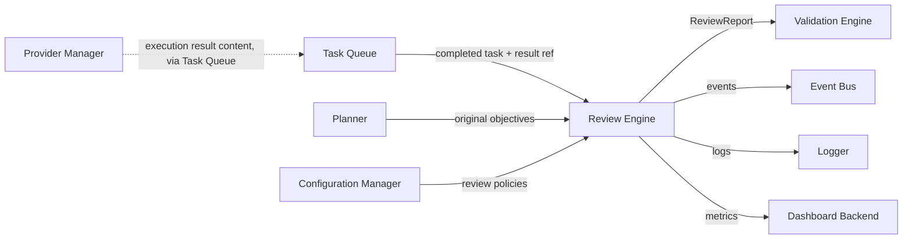

---

## 2. Goals

### Primary Goals
- Evaluate every completed task's output against its originating objectives (from Planner), configured review criteria, and applicable policies (from Configuration Manager).
- Produce a structured, versioned, auditable Review Report with quality, confidence, and success scores plus actionable recommendations.
- Remain entirely policy/criteria-driven and metadata-configurable — new criteria, policies, and templates require no source-code change.

### Secondary Goals
- Support both fully-automated scoring and a future human-in-the-loop review path without structural rework (§23).
- Provide transparent, explainable scoring (evidence + reasoning attached to every score component), never a black-box verdict.
- Maintain a complete, immutable review history per task for audit and trend analysis.

### Non-Goals
- This module never executes tasks, schedules work, plans, routes, communicates with providers/SDKs, modifies execution results, performs schema/structural validation, performs business validation, stores knowledge, manages memory, retries, falls back, automates browsers, or selects AI models. All of these belong to other modules named in §4.

### Future Goals
- AI-assisted review (an LLM-based reviewer as a pluggable Criteria Engine strategy).
- Plugin-based review engines (third-party scoring algorithms).
- Human-in-the-loop review workflows.
- Distributed review clusters at hyperscale (§19).

---

## 3. Responsibilities

### Must Have
- Receive a completed task reference (from Task Queue) and load the associated execution result reference, original objectives (from Planner), and applicable review policies (from Configuration Manager).
- Evaluate configured review criteria (§8) against the result, collecting supporting evidence for every criterion evaluated.
- Calculate quality, confidence, and success scores using a transparent, weighted, explainable algorithm.
- Generate recommendations (pass, improve, reject, escalate — per configured categories) based on scores and policy thresholds.
- Generate a structured, versioned Review Report and persist it to Review History.
- Publish review lifecycle events for every stage of the process.

### Should Have
- Support parallel evaluation of independent criteria within a single review (§18).
- Support review templates (reusable, named bundles of criteria + policy references) to reduce configuration duplication across similar task types.
- Provide review-result caching for identical/near-identical result+criteria combinations, where legitimate (e.g., idempotent re-review requests).

### Future Responsibilities
- AI-assisted criteria evaluation as a pluggable strategy.
- Human-in-the-loop review escalation workflow.
- Cross-review aggregation/trend analysis for a project or organization.

---

## 4. Scope

### Owns
Review Coordination, Quality Assessment, Objective Evaluation, Policy Evaluation, Review Rules, Review Criteria, Success Criteria Evaluation, Review Scoring, Review Reports, Review Metadata, Review History, Review Templates, Review Workflows, Review Recommendations, Confidence Assessment, Evidence Collection, Review Aggregation, Review Policies.

### Does Not Own
Execution, Task Scheduling, Planning, Routing, Provider Communication, Provider SDKs, Result Modification (the Review Engine reads execution results, it never alters them), Schema Validation, Business Validation, Knowledge Storage, Memory Management, Retry Logic, Fallback Logic, Browser Automation, AI Model Selection.

### Collaborates With
| Module | Nature of collaboration |
|---|---|
| Provider Manager | Indirect — Provider Manager produces the execution result; the Review Engine never calls it directly, only reads the result reference via Task Queue |
| Task Queue | Provides completed task information (task ID, execution result reference, workflow ID) that triggers a review |
| Validation Engine | Downstream consumer — reads the Review Report as one input to its own quality-gate decision (SDD §17); no reverse dependency |
| Planner | Read-only source of the task's original objectives |
| Configuration Manager | Read-only source of review policies, criteria definitions, templates |
| Event Bus | Publishes review lifecycle events |
| Logger | Receives structured logs |
| Dashboard Backend | Consumes review metrics (read-only) |

---

## 5. Internal Architecture

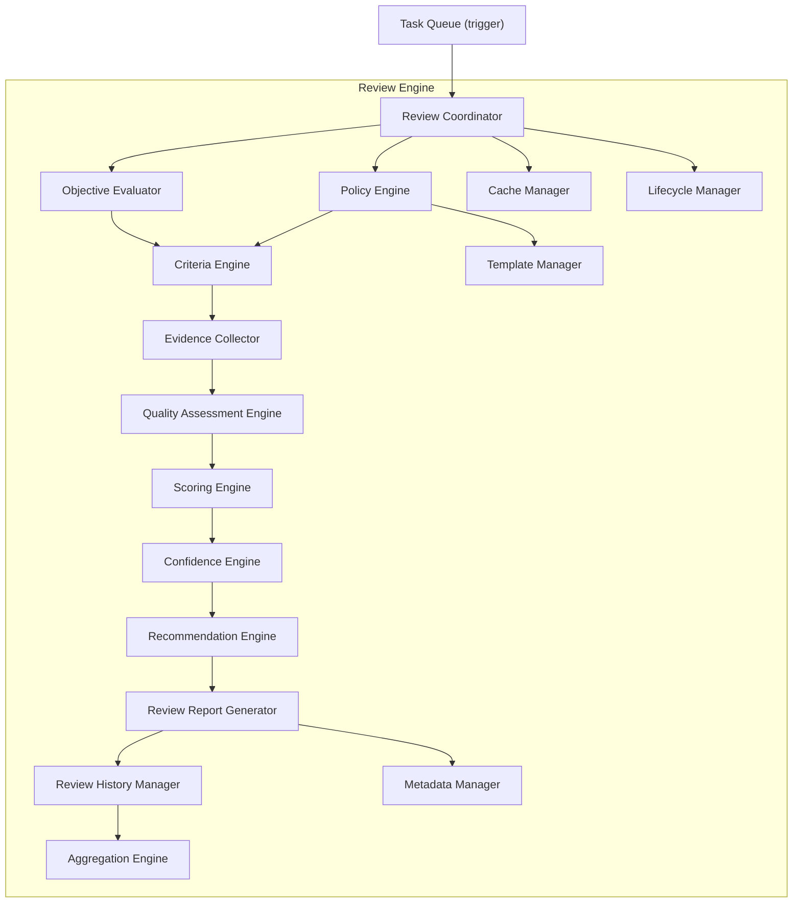

### 5.1 Review Coordinator
- **Purpose**: Single orchestration point for one review's end-to-end lifecycle (§6).
- **Responsibilities**: sequence calls to every other component in the correct order; enforce the Lifecycle Manager's state machine at each stage.
- **Inputs**: `{ taskId, executionResultRef, workflowId }` from Task Queue.
- **Outputs**: completed `ReviewReport` (or a structured failure result, §14).
- **Dependencies**: all other components in this module (composition root).
- **Lifecycle**: stateless, one execution context per review.

### 5.2 Objective Evaluator
- **Purpose**: Load and interpret the task's original objectives.
- **Responsibilities**: fetch objectives from Planner (read-only); normalize them into an internal `ObjectiveSet` shape the Criteria Engine can evaluate against.
- **Inputs**: `taskId`/`planId`.
- **Outputs**: `ObjectiveSet`.
- **Dependencies**: Planner port (read-only).
- **Lifecycle**: stateless.

### 5.3 Criteria Engine
- **Purpose**: Evaluate every configured review criterion (§8) against the execution result and objectives.
- **Responsibilities**: run each criterion's evaluation logic (objective satisfaction, completeness, accuracy, consistency, relevance, quality, policy compliance, business/organization rules, custom criteria); support weighted criteria per policy configuration.
- **Inputs**: `ObjectiveSet`, execution result content (read-only), applicable criteria definitions (from Policy Engine/Template Manager).
- **Outputs**: `CriteriaEvaluationResult[] { criterionId, satisfied: bool|score, weight, evidenceRefs[] }`.
- **Dependencies**: Evidence Collector.
- **Lifecycle**: stateless, criteria evaluated in parallel where independent (§18).

### 5.4 Policy Engine
- **Purpose**: Resolve which policies (organization, quality, compliance, custom, override) apply to this review and merge them into an effective policy set.
- **Responsibilities**: load policies from Configuration Manager; apply precedence rules (§11); resolve named Review Templates into their constituent criteria/policy set.
- **Inputs**: `taskId`, project/namespace scope.
- **Outputs**: effective `ReviewPolicySet` (criteria list + weights + thresholds + template references).
- **Dependencies**: Configuration Manager port, Template Manager.
- **Lifecycle**: stateless per call; policy cache refreshed on `ReviewPolicyUpdated`.

### 5.5 Quality Assessment Engine
- **Purpose**: Translate raw `CriteriaEvaluationResult[]` into a coherent quality judgment prior to numeric scoring.
- **Responsibilities**: apply qualitative rules (e.g., "any failed mandatory criterion caps the maximum quality tier regardless of weighted score") ahead of the Scoring Engine's numeric computation.
- **Inputs**: `CriteriaEvaluationResult[]`.
- **Outputs**: `QualityAssessment { tier, cappedBy?, contributingCriteria[] }`.
- **Dependencies**: none external.
- **Lifecycle**: stateless.

### 5.6 Evidence Collector
- **Purpose**: Gather and attach concrete supporting evidence for every criterion evaluation, ensuring every score is explainable.
- **Responsibilities**: capture the specific result excerpt, comparison basis, or reasoning trace that justified a criterion's satisfied/unsatisfied determination; store evidence references (large evidence bodies go to Artifact Storage per DDD §15, not inline).
- **Inputs**: raw execution result content, criterion evaluation logic's intermediate output.
- **Outputs**: `Evidence[] { criterionId, summary, artifactRef? }`.
- **Dependencies**: Artifact Storage port (for large evidence bodies).
- **Lifecycle**: stateless.

### 5.7 Scoring Engine
- **Purpose**: Compute the numeric Quality Score and Success Score from criteria results and the Quality Assessment tier (§10).
- **Responsibilities**: apply weighted-sum scoring per the effective `ReviewPolicySet`; apply pass/fail thresholds.
- **Inputs**: `CriteriaEvaluationResult[]`, `QualityAssessment`, policy weights/thresholds.
- **Outputs**: `{ qualityScore, successScore, thresholdResult: pass|fail }`.
- **Dependencies**: none external.
- **Lifecycle**: stateless.

### 5.8 Confidence Engine
- **Purpose**: Compute a Confidence Score reflecting how certain the review process itself is about its own scores.
- **Responsibilities**: assess evidence completeness/strength, criteria-evaluation ambiguity, and (for future AI-assisted criteria, §23) model-reported confidence — combine into a single confidence figure distinct from the quality/success scores themselves.
- **Inputs**: `Evidence[]`, `CriteriaEvaluationResult[]`.
- **Outputs**: `confidenceScore`.
- **Dependencies**: none external.
- **Lifecycle**: stateless.

### 5.9 Recommendation Engine
- **Purpose**: Translate scores into actionable recommendation categories (§10).
- **Responsibilities**: apply policy-defined thresholds to select a recommendation category (pass / improve / reject / escalate); generate specific improvement suggestions tied to unsatisfied or low-scoring criteria.
- **Inputs**: `{ qualityScore, successScore, confidenceScore, thresholdResult }`, `CriteriaEvaluationResult[]`.
- **Outputs**: `Recommendation[] { category, suggestions[], relatedCriteria[] }`.
- **Dependencies**: none external.
- **Lifecycle**: stateless.

### 5.10 Review Report Generator
- **Purpose**: Assemble the final, complete `ReviewReport` entity (§7).
- **Responsibilities**: compose all prior stage outputs into the versioned report shape; attach metadata.
- **Inputs**: all prior component outputs for this review.
- **Outputs**: `ReviewReport`.
- **Dependencies**: Metadata Manager.
- **Lifecycle**: stateless.

### 5.11 Template Manager
- **Purpose**: Own Review Template definitions — named, reusable bundles of criteria + policy references.
- **Responsibilities**: CRUD (via Configuration Manager, not direct storage — templates are configuration data, not review-history data) and resolution of a template into its constituent criteria/policy set for the Policy Engine.
- **Inputs**: `templateId`.
- **Outputs**: resolved template contents.
- **Dependencies**: Configuration Manager port.
- **Lifecycle**: stateless per call; cached (§18).

### 5.12 Review History Manager
- **Purpose**: Persist and retrieve immutable Review Report history.
- **Responsibilities**: write completed `ReviewReport`s to durable storage (append-only, never mutated post-creation — §17); provide retrieval by `taskId`, `reviewId`, or query criteria.
- **Inputs**: completed `ReviewReport`.
- **Outputs**: persisted record confirmation; on retrieval, `ReviewReport`/`ReviewReport[]`.
- **Dependencies**: Operational Storage repository port (Review entity, DDD §6.12, extended per §7 of this document).
- **Lifecycle**: stateless per call.

### 5.13 Aggregation Engine
- **Purpose**: Compute cross-review rollups (e.g., average quality score for a project over time, per §16 monitoring needs).
- **Responsibilities**: read from Review History Manager; compute aggregate statistics on demand or on a scheduled basis.
- **Inputs**: query scope (project/namespace/time range).
- **Outputs**: aggregate statistics.
- **Dependencies**: Review History Manager.
- **Lifecycle**: stateless per call (or a scheduled background job for pre-computed rollups, §18).

### 5.14 Metadata Manager
- **Purpose**: Own the structured metadata fields of a `ReviewReport` (§7) independent of scoring content.
- **Responsibilities**: validate/normalize metadata fields, merge custom metadata.
- **Inputs**: raw metadata.
- **Outputs**: normalized metadata object.
- **Dependencies**: none external.
- **Lifecycle**: stateless.

### 5.15 Cache Manager
- **Purpose**: Cache policy sets, resolved templates, and (optionally) recent review results for performance (§18).
- **Responsibilities**: TTL/invalidation-driven caching, invalidated on `ReviewPolicyUpdated`.
- **Inputs/Outputs**: internal only.
- **Dependencies**: Cache storage domain (DDD §4.6).
- **Lifecycle**: always reconstructable from source data.

### 5.16 Lifecycle Manager
- **Purpose**: Enforce the legal review state machine (§6).
- **Responsibilities**: validate transitions; reject illegal ones.
- **Inputs**: review ID, current status, requested transition.
- **Outputs**: updated status or `IllegalLifecycleTransition`.
- **Dependencies**: none external.
- **Lifecycle**: stateless.

---

## 6. Review Lifecycle

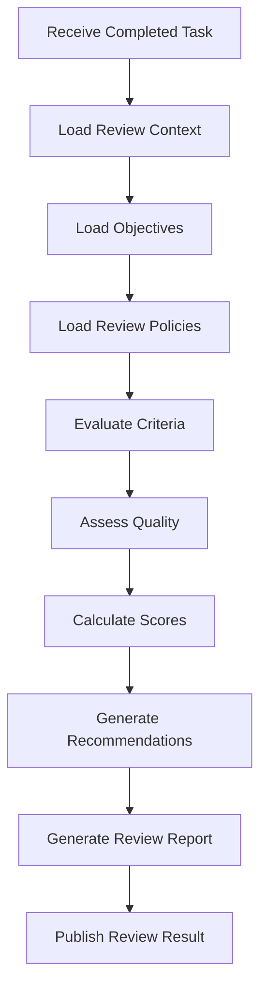

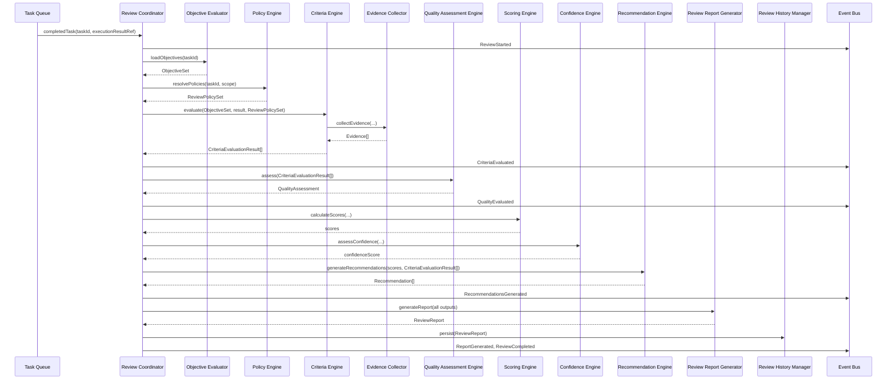

### State Diagram
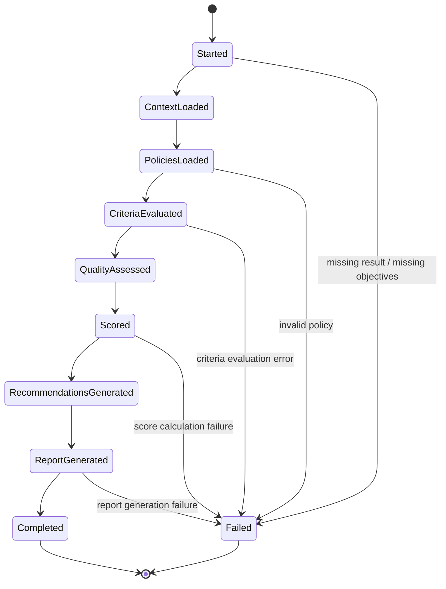

---

## 7. Review Model

| Field | Explanation |
|---|---|
| `reviewId` | Opaque UUID primary key |
| `taskId` | Reference to the reviewed Task (DDD §6.5) |
| `workflowId` | Reference to the owning Plan/workflow (DDD §6.4), for cross-task review aggregation |
| `executionResultRef` | Pointer to the execution result content (owned/stored elsewhere — Provider Manager's output surfaced via Task Queue; the Review Engine never stores result content itself) |
| `objectives` | Snapshot of the `ObjectiveSet` evaluated against, captured at review time (immutable even if the source Plan later changes) |
| `criteria` | The resolved list of criteria actually evaluated (post-template/policy resolution), snapshotted for auditability |
| `policies` | References to the specific policy versions applied (so a later policy change never retroactively alters a historical review's meaning) |
| `qualityScore` | Numeric quality score (§10) |
| `confidenceScore` | Numeric confidence score (§10) |
| `successScore` | Numeric success/objective-satisfaction score (§10) |
| `evidence` | `Evidence[]` (§5.6) supporting the criteria evaluations |
| `recommendations` | `Recommendation[]` (§5.9) |
| `reviewer` | Identity of the evaluating agent — `system` for automated review, a specific model/strategy identifier if AI-assisted (§23), or a human identifier for future human-in-the-loop review |
| `reviewTimestamp` | Immutable creation timestamp |
| `reviewVersion` | Version of the Review Engine's scoring/criteria logic used (distinct from the review record's own immutability — this tracks which *algorithm version* produced the review, critical for explaining score drift across a Review Engine upgrade) |
| `status` | Lifecycle status per §6 |
| `metadata` | Structured fields (e.g., `durationMs`, `criteriaCount`) |
| `customMetadata` | Open-ended extension point, mirroring the Knowledge Base's `customMetadata` pattern (Knowledge Base MDD §7) |

**Immutability**: once a `ReviewReport` reaches `Completed`, none of its fields are ever mutated — a re-review produces a new `ReviewReport` record with its own `reviewId`, linked to the same `taskId` (§11, §17).

---

## 8. Review Criteria

| Criterion | Explanation |
|---|---|
| **Objective Satisfaction** | Does the result address every stated objective from the Planner's `ObjectiveSet`? |
| **Completeness** | Are all expected components of the result present (no partial/truncated output)? |
| **Accuracy** | Is the result factually/technically correct relative to the task's domain — evaluated via configured criterion logic, not the Review Engine inventing correctness rules itself |
| **Consistency** | Is the result internally consistent and consistent with related prior task outputs in the same workflow? |
| **Relevance** | Does the result stay within the scope of what was asked, avoiding unrelated additions? |
| **Quality** | General fitness/craftsmanship criteria (configurable per task type — e.g., code style for a coding task) |
| **Policy Compliance** | Does the result comply with applicable organization/compliance policies (§11)? |
| **Business Rules** | Domain-specific rules supplied by Configuration Manager, evaluated generically by the Criteria Engine (never hardcoded) |
| **Organization Rules** | Organization-scoped rules, layered above project-level criteria per the same precedence model as Capability Selector policies (Capability Selector MDD §12) |
| **Custom Criteria** | Any `custom:*` namespaced criterion defined in configuration — flows through the same evaluation pipeline unchanged |
| **Weighted Criteria** | Every criterion carries a configurable weight (default 1.0) used by the Scoring Engine's weighted-sum computation (§10) |

All criteria are **data-driven definitions** (evaluation logic parameters, not hardcoded per-criterion source code) resolved from Configuration Manager, consistent with the Open/Closed mandate.

---

## 9. Review Process

- **Rule Evaluation**: the Criteria Engine evaluates each criterion's underlying rule expression (declarative, config-driven) against the execution result and `ObjectiveSet`.
- **Criteria Evaluation**: each criterion produces a `satisfied`/score result plus a weight; independent criteria are evaluated in parallel (§18).
- **Evidence Collection**: the Evidence Collector runs alongside each criterion evaluation, capturing the specific basis for its determination.
- **Score Calculation**: the Scoring Engine combines weighted criteria results into quality/success scores (§10).
- **Confidence Assessment**: the Confidence Engine independently evaluates how much to trust the review's own conclusions, based on evidence strength and criteria-evaluation certainty.
- **Recommendation Generation**: the Recommendation Engine maps final scores + threshold rules to a recommendation category and specific suggestions.
- **Review Aggregation**: the Aggregation Engine (§5.13) is invoked separately from the per-review pipeline — it operates across many completed reviews, not as a stage within a single review's lifecycle.

---

## 10. Scoring & Recommendations

- **Quality Score**: weighted sum of criteria satisfaction, normalized to `[0,1]` or `[0,100]` (configurable), capped by any Quality Assessment Engine tier ceiling (§5.5) — e.g., a failed mandatory criterion caps the maximum achievable quality tier regardless of how well other criteria scored.
- **Confidence Score**: independent `[0,1]` figure reflecting the review process's own certainty, never blended into the Quality Score — a low-confidence high-quality-score review is a meaningful, distinct signal (worth flagging for human review under future §23 workflows) from a high-confidence high-quality-score review.
- **Success Score**: specifically the Objective Satisfaction criterion's weighted contribution, surfaced as its own top-level score since "did this achieve what was asked" is a distinct question from general quality — feeds directly into the Orchestrator Core's Review Engine outcome consumption (`ReviewResult.approved`, per Orchestrator Core MDD §6.9 equivalent contract).
- **Weighted Scoring**: `score = Σ(criterionResult_i × weight_i) / Σ(weight_i)` — a normalized weighted average, with the Quality Assessment Engine's tier-cap rule applied as a post-processing ceiling, not folded into the weighted sum itself (keeping the two mechanisms independently auditable).
- **Thresholds**: policy-defined minimum Quality/Success/Confidence scores for a `pass` recommendation; configurable per project/template.
- **Pass/Fail Rules**: `pass` requires all mandatory criteria satisfied AND all scores at/above their respective thresholds; anything else is `fail`, further categorized by the Recommendation Engine.
- **Recommendation Categories**: `pass` (meets bar), `improve` (close, with specific fixable gaps), `reject` (fundamentally unmet objectives or mandatory criteria failures), `escalate` (low confidence or ambiguous result warranting human/AI-assisted secondary review, §23).
- **Improvement Suggestions**: generated per unsatisfied or low-scoring criterion, referencing the specific criterion and its evidence — never generic boilerplate advice.

---

## 11. Review Policies

- **Organization Policies**: system/organization-wide review rules, evaluated with highest precedence (mirrors Capability Selector MDD §12's precedence model exactly, for platform-wide consistency).
- **Quality Policies**: define which criteria apply and their weights/thresholds for a given task type or project.
- **Compliance Policies**: mandatory criteria that cannot be excluded or down-weighted by lower-precedence policies (e.g., a regulated industry's mandatory accuracy/audit criteria).
- **Review Templates**: named bundles resolving to a concrete criteria + policy set (§5.11) — reduces per-request configuration duplication.
- **Custom Policies**: project- or organization-specific rules in the same declarative schema as built-in policies.
- **Override Rules**: a narrowly-scoped, elevated-access mechanism to loosen an otherwise-applicable policy for a specific review — always audit-logged (§15, §17), mirroring the Capability Selector's override-rule design exactly.

**Precedence**: Organization Policies (mandatory) → Compliance Policies (mandatory, cannot be loosened by anything but an audited Override) → Project/Template Quality Policies (can add, never remove, mandatory criteria) → request-specific weighting hints (optional-criteria emphasis only).

---

## 12. Public Interfaces

### 12.1 `reviewResult(taskId, executionResultRef): ReviewReport`
- **Purpose**: The primary entry point — runs the full review lifecycle (§6) end to end.
- **Inputs**: `taskId`, `executionResultRef`.
- **Outputs**: completed `ReviewReport`.
- **Validation**: `taskId` must reference a completed Task; `executionResultRef` must be resolvable.
- **Errors**: `TaskNotFound`, `MissingResult`, `MissingObjectives`, propagated stage-specific failures (§14).
- **Side Effects**: full event sequence published; `ReviewReport` persisted to Review History.

### 12.2 `evaluateCriteria(objectiveSet, result, policySet): CriteriaEvaluationResult[]`
- **Purpose**: Standalone criteria evaluation, for testing/introspection or advanced callers.
- **Inputs**: `ObjectiveSet`, execution result, `ReviewPolicySet`.
- **Outputs**: `CriteriaEvaluationResult[]`.
- **Validation**: well-formed inputs.
- **Errors**: `CriteriaEvaluationFailure`.

### 12.3 `calculateScores(criteriaResults, policySet): ScoreResult`
- **Purpose**: Standalone scoring, for testing/introspection.
- **Inputs**: `CriteriaEvaluationResult[]`, `ReviewPolicySet`.
- **Outputs**: `{ qualityScore, successScore, thresholdResult }`.
- **Validation**: well-formed criteria results.
- **Errors**: `ScoreCalculationFailure`.

### 12.4 `generateRecommendations(scores, criteriaResults): Recommendation[]`
- **Purpose**: Standalone recommendation generation, for testing/introspection.
- **Inputs**: score result, `CriteriaEvaluationResult[]`.
- **Outputs**: `Recommendation[]`.
- **Validation**: well-formed inputs.
- **Errors**: none thrown — always produces at least a generic recommendation if inputs are minimal.

### 12.5 `generateReport(reviewContext): ReviewReport`
- **Purpose**: Standalone report assembly, for testing/introspection or re-generation from already-computed stage outputs.
- **Inputs**: full set of prior-stage outputs.
- **Outputs**: `ReviewReport`.
- **Validation**: completeness of `reviewContext`.
- **Errors**: `ReportGenerationFailure`.

---

## 13. Events

| Event | Publisher | Subscribers | Payload | Trigger | Retry Behaviour |
|---|---|---|---|---|---|
| `ReviewStarted` | Review Coordinator | Logger, Dashboard Backend | `{ reviewId, taskId }` | `reviewResult` entry | Non-blocking |
| `ReviewCompleted` | Review Coordinator | Task Queue (correlation, per Orchestrator Core MDD §9 consumption pattern), Validation Engine, Logger, Dashboard Backend, Learning Layer | `{ reviewId, taskId, qualityScore, successScore, confidenceScore, recommendation }` | Full lifecycle success | Non-blocking |
| `ReviewFailed` | Review Coordinator | Task Queue, Logger, Dashboard Backend | `{ reviewId, taskId, failureStage, reason }` | Any Failed transition (§6 state diagram) | Non-blocking |
| `QualityEvaluated` | Quality Assessment Engine | Logger | `{ reviewId, tier, cappedBy? }` | Quality Assessment Engine completes | Non-blocking |
| `CriteriaEvaluated` | Criteria Engine | Logger, Dashboard Backend | `{ reviewId, criteriaCount, satisfiedCount }` | Criteria Engine completes | Non-blocking |
| `RecommendationsGenerated` | Recommendation Engine | Logger, Dashboard Backend | `{ reviewId, category, suggestionCount }` | Recommendation Engine completes | Non-blocking |
| `ReportGenerated` | Review Report Generator | Logger, Review History Manager (internal, but also event-visible for audit consistency) | `{ reviewId }` | Report assembled | Non-blocking |
| `ReviewPolicyUpdated` | Policy Engine (relaying Configuration Manager's change notification) | Cache Manager (self, cache invalidation), Logger, Dashboard Backend | `{ policyId, scope, changeType }` | Configuration Manager policy change | Non-blocking |

All events fire-and-forget, isolated per subscriber, consistent with platform-wide Event Bus policy (SDD §18).

---

## 14. Error Handling

| Failure | Handling |
|---|---|
| Missing Result | `executionResultRef` unresolvable → `MissingResult`, review transitions to `Failed`, `ReviewFailed` published — no partial review generated |
| Invalid Review Policy | Malformed policy from Configuration Manager → fall back to the last successfully cached policy set with a `degraded` flag on the resulting report; if no cache exists, fail with `PolicyUnavailable` (mirrors Capability Selector MDD §15's identical policy-failure handling for platform consistency) |
| Criteria Failure | A single criterion's evaluation logic throws → that criterion is recorded as `Inconclusive` (not silently dropped, not treated as either satisfied or failed) with the error captured as its evidence; the review continues with remaining criteria rather than aborting entirely, unless the failed criterion was itself mandatory-and-blocking per policy configuration |
| Evidence Failure | Evidence Collector unable to capture/store evidence for a criterion → the criterion result is retained but flagged `evidenceIncomplete`, directly lowering the Confidence Score for that criterion's contribution (§5.8) rather than failing the review |
| Score Calculation Failure | Malformed weight/threshold configuration → `ScoreCalculationFailure`, review transitions to `Failed` — this is treated as a configuration error requiring operator attention, not something to silently work around |
| Report Generation Failure | Assembly-stage error (e.g., Metadata Manager rejection) → `ReportGenerationFailure`, review transitions to `Failed`; all upstream computed data (scores, recommendations) is still available in logs/events for diagnosis even though no persisted `ReviewReport` exists |
| Recovery Strategy | This module holds no durable state beyond the immutable Review History (§5.12) and its caches (§5.15); a crash mid-review simply results in that specific review being marked `Failed` (if partially recorded) or never having started (if not) — Task Queue's own retry/re-trigger logic (not this module's) determines whether a failed review is re-attempted |

---

## 15. Logging

| Log type | Content |
|---|---|
| Review Logs | Every review's stage-by-stage progress, `reviewId`/`taskId` correlated |
| Criteria Logs | Per-criterion evaluation results at debug granularity |
| Policy Logs | Which policies/templates were resolved and applied, including override-rule usage |
| Scoring Logs | Score computation detail (weights, raw vs. capped quality tier) |
| Report Logs | Report generation outcome and persistence confirmation |
| Audit Logs | Override-rule invocations, policy-compliance criterion failures (compliance-relevant events are never suppressed regardless of debug mode) |

All log lines carry `reviewId`, `taskId`, and `correlationId` per the platform-wide convention.

---

## 16. Monitoring

- **Review Throughput**: reviews completed per minute.
- **Review Latency**: end-to-end `reviewResult` duration, broken down by pipeline stage (§6).
- **Average Quality Score**: rolling average per project/namespace, via the Aggregation Engine (§5.13).
- **Policy Usage**: count of policy/template applications, with override-rule frequency specifically surfaced (mirrors Capability Selector MDD §17's identical concern for platform consistency).
- **Review Success Rate**: proportion of reviews reaching `Completed` vs. `Failed`.
- **Report Generation Performance**: Review Report Generator + Review History Manager persistence latency.

---

## 17. Security

- **Review Integrity**: `ReviewReport`s are immutable once `Completed` (§7) — no update path exists; a correction is always a new review record, never an edit.
- **Policy Protection**: policies are read-only from this module's perspective; all mutation happens through Configuration Manager's authorized write path.
- **Access Control**: override-rule application requires elevated `authContext` privilege, checked before the Policy Engine honors it (mirrors Capability Selector MDD §18 exactly).
- **Auditability**: override-rule invocations and compliance-criterion outcomes are unconditionally audit-logged.
- **Immutable Review History**: enforced structurally by the Review History Manager (§5.12) — it exposes no update operation at all, only create and read, making immutability a property of the interface, not just a policy.

---

## 18. Performance

- **Parallel Review**: independent criteria evaluated concurrently by the Criteria Engine (§5.3, §9), up to a configured concurrency ceiling.
- **Batch Review**: `reviewResult` supports a batch variant for reviewing multiple completed tasks in one call (e.g., end-of-workflow bulk review), processed as independent parallel review pipelines sharing a single resolved policy cache lookup.
- **Incremental Review**: for a re-review triggered by a minor result correction, the Policy Engine and Template Manager's cached resolution is reused rather than re-fetched, though criteria are always fully re-evaluated (never incrementally diffed) to guarantee correctness.
- **Distributed Review**: stateless component design (§5) allows any number of Review Engine instances to process reviews concurrently, coordinated only by Task Queue's dispatch, not by this module holding any cross-instance state.
- **Caching**: Cache Manager (§5.15) caches resolved policy sets and templates; review results themselves are not cached long-term (each review is a fresh, timestamped judgment) except for short-lived idempotency-window caching of identical duplicate `reviewResult` calls.
- **Lazy Evaluation**: optional (non-mandatory) criteria may be skipped entirely if a mandatory criterion has already failed and policy configuration marks the review as `failFast` — configurable, defaulting to full evaluation for complete evidence/recommendations even on failure.
- **Memory Optimization**: large execution result content is never fully loaded into this module's memory at once where avoidable — the Criteria Engine and Evidence Collector operate on streamed/referenced content where the underlying result type supports it (e.g., large generated documents).

---

## 19. Enterprise Scalability

| Dimension | Strategy |
|---|---|
| **Horizontal Scaling** | Every component (§5) is stateless; any number of Review Engine instances run concurrently, each processing independently-dispatched reviews from Task Queue |
| **Vertical Scaling** | No component assumes a fixed compute ceiling; criteria evaluation concurrency (§18) scales with available resources per instance |
| **Distributed Review Workers** | Task Queue's dispatch model (Task Queue MDD) naturally distributes review triggers across available Review Engine instances/workers — this module has no instance-affinity requirement |
| **Parallel Review Processing** | §18 Parallel Review + Distributed Review Workers combine for both intra-review and inter-review parallelism |
| **Review Clusters** | A deployment may run a dedicated pool of Review Engine instances as a logical cluster behind Task Queue's dispatch, with no code awareness of cluster topology required |
| **Task Partitioning** | Reviews naturally partition by `taskId`/`projectId`/`namespace`, enabling sharded Review History storage (mirrors Knowledge Base MDD §19's identical sharding rationale) |
| **Distributed Cache** | Cache Manager (§5.15) is specified against a distributed cache backend from the outset, avoiding a single-node caching ceiling |
| **Load Balancing** | Handled by Task Queue's dispatch layer, not this module — Review Engine instances are interchangeable, stateless workers |
| **High Availability** | Stateless design means any instance can fail and be replaced without data loss, given a durable Review History backend |
| **Fault Tolerance** | A failed review (§14) leaves no partial/corrupt Review History record — either a complete `ReviewReport` is persisted or none is |
| **Elastic Scaling** | Instance count scales purely with Task Queue's review-dispatch backlog, with no warm-up state requirement beyond optional cache pre-population |
| **Cross-Region Deployment** | Review History persistence follows the DDD's domain-independent replication/cross-region strategy (DDD §19, §21); this module's own components make no region-locality assumption |
| **Capacity Planning** | Review Throughput and Review Latency monitoring (§16) feed directly into capacity dashboards |

**Explicit scale targets supported without source-code modification**: millions of reviews, millions of review reports, thousands of concurrent review workers (via the stateless/distributed design above), unlimited review policies and templates (both are Configuration Manager-owned data, per §11), unlimited organizations (via the same namespace-scoping pattern established in the Knowledge Base MDD §19).

---

## 20. Interaction With Other Modules

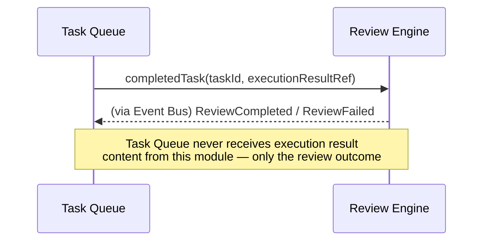

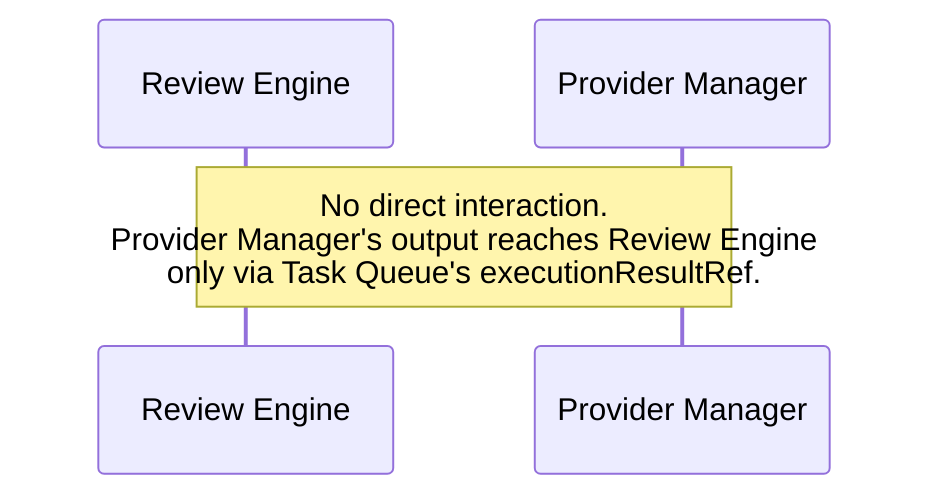

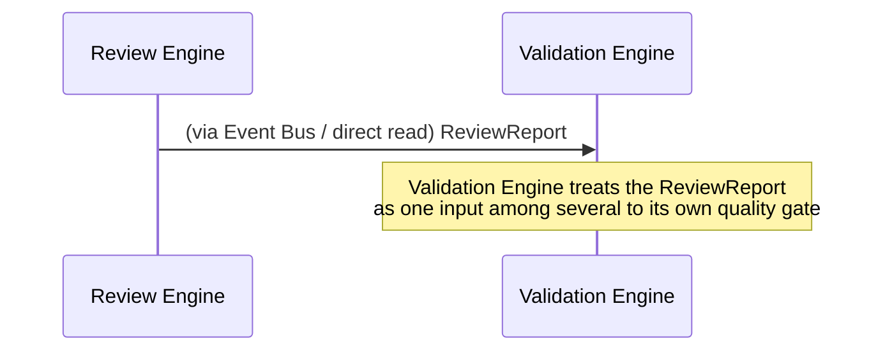

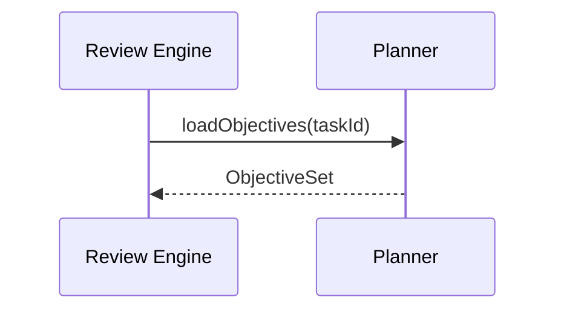

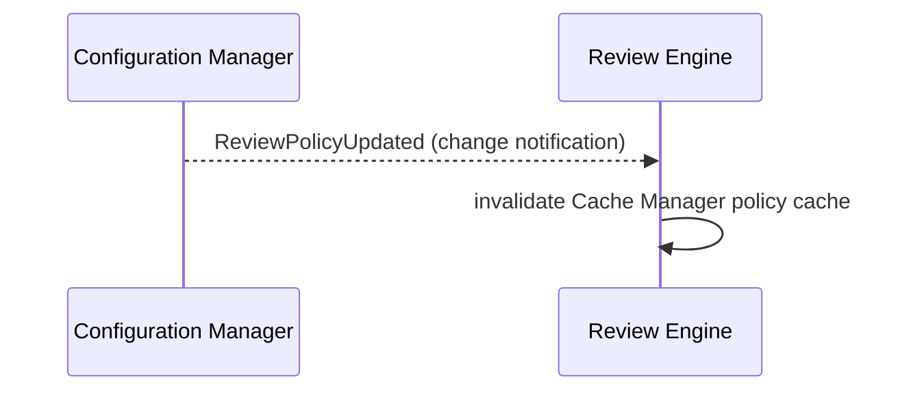

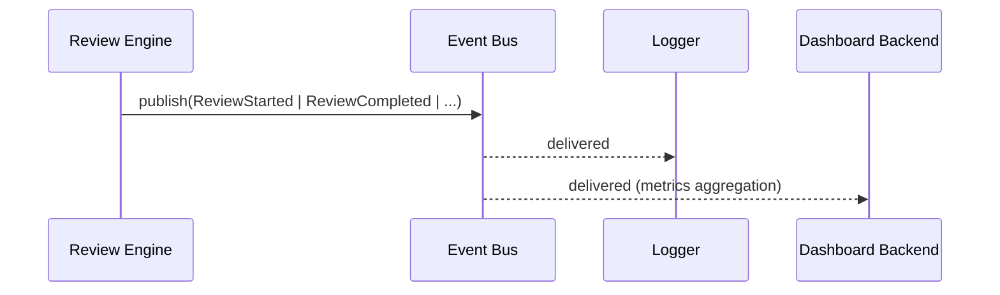

---

## 21. Folder Structure

```
review-engine/
  application/
    review-coordinator/          # §5.1
    objective-evaluator/          # §5.2
    criteria-engine/               # §5.3
    policy-engine/                 # §5.4
    quality-assessment-engine/     # §5.5
    evidence-collector/            # §5.6
    scoring-engine/                 # §5.7
    confidence-engine/              # §5.8
    recommendation-engine/          # §5.9
    review-report-generator/        # §5.10
    template-manager/               # §5.11
    review-history-manager/          # §5.12
    aggregation-engine/              # §5.13
    metadata-manager/                # §5.14
    cache-manager/                    # §5.15
    lifecycle-manager/                # §5.16
  domain/
    entities/                    # ReviewReport, Evidence, Recommendation, CriteriaEvaluationResult (§7)
    criteria-catalog/             # versioned criteria definitions (§8), config-loaded
    ports/
      task-queue-port/            # read-only, completed task info
      planner-port/                 # read-only, objectives
      config-port/
      event-bus-port/
      logger-port/
      review-repository-port/       # Operational Storage, Review History persistence
      artifact-storage-port/        # large evidence bodies (DDD §15)
      cache-port/
  infrastructure/
    policy-change-listener/       # subscribes to Configuration Manager change notifications
  config/
    schema.*                       # reviewEngine.* config schema (criteria, policies, templates, thresholds)
  tests/
    unit/
    integration/
    criteria/
    scoring/
    policy/
    report/
    performance/
    stress/
    regression/
    chaos/
```

---

## 22. File Responsibilities

| File (conceptual) | Purpose | Public API | Private Logic | Dependencies |
|---|---|---|---|---|
| `review-coordinator.*` | §5.1 | `reviewResult` | Lifecycle sequencing | all components below |
| `objective-evaluator.*` | §5.2 | (internal) | Objective normalization | PlannerPort |
| `criteria-engine.*` | §5.3 | `evaluateCriteria` | Rule evaluation, parallel dispatch | criteria-catalog, EvidenceCollector |
| `policy-engine.*` | §5.4 | (internal) | Precedence resolution (§11) | ConfigPort, TemplateManager |
| `quality-assessment-engine.*` | §5.5 | (internal) | Tier-cap rules | — |
| `evidence-collector.*` | §5.6 | (internal) | Evidence capture | ArtifactStoragePort |
| `scoring-engine.*` | §5.7 | `calculateScores` | Weighted-sum algorithm (§10) | — |
| `confidence-engine.*` | §5.8 | (internal) | Confidence computation | — |
| `recommendation-engine.*` | §5.9 | `generateRecommendations` | Threshold-to-category mapping | — |
| `review-report-generator.*` | §5.10 | `generateReport` | Report assembly | MetadataManager |
| `template-manager.*` | §5.11 | (internal) | Template resolution | ConfigPort |
| `review-history-manager.*` | §5.12 | (internal, retrieval exposed separately) | Append-only persistence | ReviewRepositoryPort |
| `aggregation-engine.*` | §5.13 | (internal / Dashboard-facing read API) | Rollup computation | ReviewHistoryManager |
| `metadata-manager.*` | §5.14 | (internal) | Metadata normalization | — |
| `cache-manager.*` | §5.15 | (internal) | TTL/invalidation | CachePort |
| `lifecycle-manager.*` | §5.16 | (internal) | State machine enforcement | — |
| `ports/review-repository-port.*` | Contract | `create`, `findById`, `query` (no `update`, per §17 immutability) | — | — |

---

## 23. Testing Strategy

- **Unit Tests**: each §5 component in isolation — Scoring Engine's weighted-sum math, Recommendation Engine's threshold-to-category mapping, Lifecycle Manager's transition legality.
- **Criteria Tests**: exhaustive coverage of the base criteria vocabulary (§8) plus representative `custom:*` criteria.
- **Scoring Tests**: determinism (same inputs → same scores), tier-capping interaction with weighted scoring, threshold boundary conditions.
- **Policy Tests**: precedence rule correctness (§11), override-rule audit logging, template resolution correctness.
- **Report Tests**: `ReviewReport` schema completeness and immutability enforcement (no update path exists — verified by absence, not just by test).
- **Performance Tests**: pipeline latency under large criteria sets and large execution results.
- **Stress Tests**: high-concurrency `reviewResult` calls across many distinct tasks, verifying stateless-design correctness under load.
- **Regression Tests**: golden-file tests locking in scoring output for a fixed representative set of results/criteria, catching unintended scoring-algorithm drift (mirrors Capability Selector MDD §23's identical regression-testing rationale).
- **Chaos Tests**: simulated Configuration Manager unavailability, Planner unavailability, Artifact Storage failures mid-review — verifying the degraded/failed handling in §14 behaves exactly as specified rather than producing an inconsistent partial state.

---

## 24. Future Expansion

- **AI-assisted review**: introduced as an alternate Criteria Engine evaluation strategy (an LLM-based criterion evaluator implementing the same `CriteriaEvaluationResult` contract) — selected via configuration, no change to Review Coordinator or downstream components.
- **Plugin-based review engines**: third-party scoring/criteria logic follows the same `custom:*` namespacing pattern already established for criteria and policies (§8, §11).
- **Industry-specific review policies**: additive Compliance Policy records (§11) — no structural change.
- **Custom scoring engines**: the Scoring Engine's weighted-sum algorithm is a default, swappable strategy behind the same `calculateScores` interface, mirroring the Capability Selector's Custom Ranking Algorithms extension pattern (Capability Selector MDD §24) for platform-wide consistency.
- **Human-in-the-loop review**: the `escalate` recommendation category (§10) and the `reviewer` field (§7, already supporting non-`system` values) are the structural hooks — a human review workflow is a new caller/consumer of `escalate`-flagged reviews, not a change to this module's core pipeline.
- **Distributed review clusters**: already the default assumption per §19 — no further architectural change needed, only deployment configuration.
- **Streaming review**: for very large execution results, criteria evaluation could operate on a streamed result rather than a fully-materialized one — the Criteria Engine's port-based dependency on result content (§5.3) is already abstracted enough to support a streaming adapter without changing its own interface.
- **Future review algorithms**: any new scoring/criteria/recommendation strategy is introduced as a new implementation behind the existing stable interfaces (§12) — never a modification of the pipeline sequencing in §5–§10.

---

## 25. Risks

| Risk | Category | Mitigation |
|---|---|---|
| Criteria evaluation logic becoming inconsistent across a large, data-driven criteria catalog (different criteria authored by different teams behaving unpredictably together) | Architecture / Consistency | Criteria Tests (§23) run a conformance suite against every criterion definition; Quality Assessment Engine's tier-cap rule (§5.5) provides a single, centrally-owned safety net independent of individual criterion authorship quality |
| Confidence Score being ignored downstream, undermining its purpose as a distinct signal | Maintenance / Correctness | `escalate` recommendation category (§10) structurally forces low-confidence results into a distinct, visible path rather than relying on downstream consumers to remember to check the score |
| Immutable Review History growing unbounded at hyperscale volume (millions of reviews) | Scalability | Time/project-partitioned storage (§19, mirroring DDD §18 partitioning) keeps query performance bounded; archival/retention policy (mirroring Knowledge Base MDD §17) can be layered on without violating immutability (archiving, not deleting or mutating) |
| Policy precedence misconfiguration allowing a lower-scope policy to weaken a Compliance Policy | Security / Compliance | Structurally enforced intersection-only precedence for mandatory/compliance criteria (§11), identical in design to the Capability Selector's proven precedence model |
| Parallel criteria evaluation introducing nondeterministic evidence ordering, complicating report reproducibility | Consistency | Review Report Generator sorts evidence/criteria results deterministically (by `criterionId`) at assembly time, independent of evaluation execution order |
| Review Engine becoming a bottleneck if criteria sets grow very large per task type | Performance | Parallel Review (§18) plus Lazy Evaluation's optional `failFast` mode (§18) bound worst-case latency; Performance Tests (§23) validate this explicitly |

---

## 26. Design Decisions

| Decision | Rationale | Alternatives Considered | Trade-off |
|---|---|---|---|
| Quality Score, Confidence Score, and Success Score kept as three independent figures rather than one blended score | Each answers a genuinely different question (craftsmanship, review-process certainty, objective achievement); blending would hide exactly the "low-confidence high-quality" signal that motivates the `escalate` recommendation category | Single blended score | A single score is simpler to consume downstream but loses the ability to distinguish "confidently good," "confidently bad," and "uncertain," which the platform's future human-in-the-loop path (§23) explicitly needs |
| `ReviewReport`s are immutable, with re-review producing a new record rather than an update | Preserves a complete, honest audit trail (§17) and mirrors the platform-wide version-append convention already established for Configuration and Knowledge entities (DDD §8) | Mutable review record with an internal history log | An internal history log reconstructs history indirectly; a naturally immutable primary record makes history the default, not an afterthought |
| Tier-cap rule (Quality Assessment Engine) applied as a post-processing ceiling rather than folded into the weighted-sum formula | Keeps two genuinely different mechanisms — "how good, on average" vs. "was there a disqualifying failure" — independently auditable and independently testable | A single formula encoding both effects | A combined formula is harder to explain in a `scoreBreakdown`-style output and harder to test each mechanism's correctness in isolation |
| Review Engine and Validation Engine kept as fully separate modules with no shared logic, despite both feeding the same downstream quality gate | Reflects a genuine conceptual split (qualitative/policy judgment vs. structural/behavioral correctness) mandated by the platform's module boundaries (SDD §6.9/§6.10) and this document's explicit non-goals | Merging both into a single "Quality Gate" module | Merging would create a large module owning two distinct reasoning styles, reducing testability and reintroducing the coupling the platform architecture is designed to avoid |
| Criteria, policies, and templates entirely data-driven via Configuration Manager, mirroring the Capability Selector's proven pattern | Directly satisfies the "unlimited templates/policies without code change" requirement, and reuses an already-validated architectural pattern from an existing module rather than inventing a new one | Hardcoded criteria enum | A data-driven catalog costs validation complexity (Criteria Tests, §23) but is the only design meeting the stated extensibility goal, and precedent from the Capability Selector MDD de-risks the approach |

---

## 27. Diagrams (Consolidated Reference)

**Component Diagram** — see §5.
**Review Architecture Diagram** — see §1 (Architecture Position) and §5.
**Review Lifecycle Diagram** — see §6.
**Review Workflow Diagram** — see §6 sequence diagram.
**Scoring Flow** — see §10 and §9.
**Recommendation Flow** — see §10 and §5.9.
**Sequence Diagrams** — see §6, §20.
**Folder Structure Diagram** — see §21.

---

## 28. Enterprise Governance and Operational Architecture

This appendix documents governance controls and operational constraints for the already-frozen Review Engine architecture. It does not redefine responsibilities, lifecycle states, evaluation flow, scoring logic, confidence calculations, recommendation generation, policy precedence, evidence collection, or immutable report behavior described in prior sections.

### 28.1 Architectural Constraints

The Review Engine shall be governed by the following non-negotiable architectural constraints:

- Review Engine never executes tasks.
- Review Engine never schedules work.
- Review Engine never routes requests.
- Review Engine never communicates directly with provider SDKs.
- Review Engine never selects providers.
- Review Engine never selects AI models.
- Review Engine never generates plans.
- Review Engine never modifies execution results.
- Review Engine never performs schema validation.
- Review Engine never performs business validation.
- Review Engine never owns knowledge.
- Review Engine never manages memory.
- Review Engine never retries execution.
- Review Engine never performs orchestration outside the review lifecycle.
- Review Engine only consumes execution results and produces immutable review artifacts.

### 28.2 Architecture Decision Records (ADRs)

#### ADR-01: Separation of Review Engine from Validation Engine
- **Decision**: Review Engine and Validation Engine remain separate modules with distinct responsibilities.
- **Context**: Both modules contribute to downstream quality decisions but operate on different concerns.
- **Alternatives Considered**: Unified quality gate module; shared validation/review pipeline.
- **Rationale**: Separation preserves explainability, independent ownership, and clear audit boundaries.
- **Consequences**: Each module remains independently testable and governable.

#### ADR-02: Independent Quality, Success, and Confidence Scores
- **Decision**: Quality, Success, and Confidence are maintained as distinct score domains.
- **Context**: The platform requires both objective satisfaction and review-process certainty to be visible independently.
- **Alternatives Considered**: A single blended score.
- **Rationale**: Independent scores prevent critical signals from being hidden by aggregation.
- **Consequences**: Downstream consumers can make more precise and auditable decisions.

#### ADR-03: Explainable Evidence-First Review Architecture
- **Decision**: Every review determination is supported by evidence and traceable reasoning.
- **Context**: Governance and auditability require explainable decisions rather than opaque judgments.
- **Alternatives Considered**: Black-box scoring; summary-only assessment.
- **Rationale**: Evidence-first review ensures reproducibility, accountability, and human review readiness.
- **Consequences**: Review Reports are larger and more operationally expensive but significantly more trustworthy.

#### ADR-04: Policy-Driven Evaluation
- **Decision**: Review behavior is governed by policy and configuration rather than hardcoded rules.
- **Context**: The platform requires configurable criteria, thresholds, and overrides across organizations.
- **Alternatives Considered**: Hardcoded evaluation logic per task type.
- **Rationale**: Policy-driven behavior enables enterprise governance without code changes.
- **Consequences**: Configuration quality becomes a critical operational dependency.

#### ADR-05: Data-Driven Criteria Model
- **Decision**: Criteria are defined as versioned, configuration-driven catalog entries.
- **Context**: Criteria must scale across domains and teams without changing core code.
- **Alternatives Considered**: Enum-driven or hardcoded criteria.
- **Rationale**: Data-driven criteria support extensibility and controlled governance.
- **Consequences**: Governance and testing complexity increases but platform flexibility improves.

#### ADR-06: Immutable Review Reports
- **Decision**: Review Reports are immutable after completion and are never updated in place.
- **Context**: Auditability and historical correctness require append-only review history.
- **Alternatives Considered**: Mutable review records with revision history.
- **Rationale**: Immutability preserves a truthful and reproducible decision record.
- **Consequences**: Corrections and re-reviews create new records rather than modifying prior state.

#### ADR-07: Stateless Processing
- **Decision**: Review processing remains stateless at the component level.
- **Context**: The platform requires horizontal scalability and recovery from node failure.
- **Alternatives Considered**: Stateful in-memory review sessions.
- **Rationale**: Stateless processing simplifies deployment, restart, and scaling.
- **Consequences**: Durable history and configuration are required for correctness.

#### ADR-08: Event-Driven Lifecycle
- **Decision**: Review lifecycle transitions are emitted through the event bus.
- **Context**: Multiple downstream systems need visibility into review progress and completion.
- **Alternatives Considered**: Direct point-to-point callbacks.
- **Rationale**: Event-driven integration decouples the Review Engine from downstream consumers.
- **Consequences**: The system gains flexibility at the cost of more explicit event contracts.

#### ADR-09: Append-Only Review History
- **Decision**: Review History is append-only and retrieval-oriented.
- **Context**: Historical review records must remain trustworthy and tamper-resistant.
- **Alternatives Considered**: Mutable history tables with update operations.
- **Rationale**: Append-only design aligns with immutable reports and regulatory audit expectations.
- **Consequences**: Storage growth must be managed through retention and archival policies.

#### ADR-10: Clean Architecture
- **Decision**: Review Engine internals are separated into domain, application, and infrastructure concerns.
- **Context**: The platform needs maintainability and clear dependency management.
- **Alternatives Considered**: Monolithic implementation with direct database and event coupling.
- **Rationale**: Clean architecture supports change isolation and governance enforcement.
- **Consequences**: More explicit boundaries and additional abstractions are required.

#### ADR-11: Hexagonal Architecture
- **Decision**: Review Engine dependencies are expressed through ports and adapters.
- **Context**: The module must interact with Planner, Task Queue, Configuration Manager, Event Bus, and storage without hard coupling.
- **Alternatives Considered**: Direct integration with every dependency.
- **Rationale**: Hexagonal architecture preserves testability, replacement flexibility, and governance boundaries.
- **Consequences**: The interface surface becomes more deliberate and must be maintained as part of change control.

### 28.3 Review Versioning Governance

The Review Engine shall version its governance artifacts and runtime inputs as follows:

- **Review schema versioning**: every Review Report schema change requires a new schema version and migration compatibility review.
- **Criteria definition versioning**: each criterion definition is versioned, approved, and tied to the review context in which it was applied.
- **Policy versioning**: policies are versioned and resolved by explicit policyId with full lineage.
- **Template versioning**: review templates are versioned and resolved with reproducible template references.
- **Scoring algorithm versioning**: scoring logic is versioned independently from the review report entity to preserve interpretability across engine upgrades.
- **Recommendation strategy versioning**: recommendation generation strategies must be versioned and auditable.
- **Backward compatibility**: older review versions must remain readable and reproducible for the configured retention window.
- **Historical reproducibility**: a historical review must be reproducible from the captured criteria, policy versions, template versions, and scoring algorithm version.
- **Audit requirements**: every version change and compatibility decision must be logged and attributable to an authorized change process.

### 28.4 Ownership Matrix

| Governance Area | Primary Owner | Supporting Owners |
|---|---|---|
| Review lifecycle | Review Engine | Task Queue, Event Bus |
| Objective evaluation | Planner | Review Engine |
| Criteria evaluation | Review Engine | Configuration Manager |
| Policy evaluation | Review Engine | Configuration Manager |
| Evidence collection | Review Engine | Artifact Storage |
| Quality assessment | Review Engine | Validation Engine (downstream consumer) |
| Scoring | Review Engine | Configuration Manager |
| Confidence assessment | Review Engine | Review Engine |
| Recommendation generation | Review Engine | Configuration Manager |
| Review reports | Review Engine | Review History Manager |
| Review history | Review Engine | Operational Storage |
| Review metadata | Review Engine | Metadata Manager |
| Review aggregation | Review Engine | Dashboard Backend |
| Review templates | Configuration Manager | Review Engine |

### 28.5 Processing Guarantees

The Review Engine shall provide the following guarantees:

- Deterministic review execution for a fixed input set and policy set.
- Immutable Review Reports.
- Immutable Review History.
- Deterministic score calculation.
- Deterministic recommendation generation.
- Explainable scoring.
- Evidence traceability.
- Policy reproducibility.
- Stateless processing.
- Complete audit history.

### 28.6 Review Identity Model

| Identifier | Purpose | Ownership | Uniqueness | Lifecycle |
|---|---|---|---|---|
| `reviewId` | Primary review artifact identity | Review Engine | Unique per Review Report | Created at review start; persists for history |
| `taskId` | Reviewed task identity | Task Queue | Unique per task | Stable for task lifetime |
| `workflowId` | Review aggregation context | Planner / Orchestrator | Unique per workflow | Stable for workflow lifetime |
| `planId` | Source objective plan identity | Planner | Unique per plan | Stable for plan lifetime |
| `criteriaId` | Specific criterion definition identity | Configuration Manager | Unique per criterion definition | Versioned over time |
| `policyId` | Policy identity | Configuration Manager | Unique per policy definition | Versioned over time |
| `templateId` | Review template identity | Configuration Manager | Unique per template definition | Versioned over time |
| `recommendationId` | Recommendation artifact identity | Review Engine | Unique per generated recommendation | Short-lived or report-bound |
| `evidenceId` | Evidence artifact identity | Review Engine | Unique per evidence item | Report-bound |
| `organizationId` | Enterprise tenant scope | Platform | Unique per organization | Stable |
| `namespaceId` | Partitioned scope within organization | Platform | Unique per namespace | Stable |
| `requestId` | Request correlation identifier | Caller / gateway | Unique per request | Short-lived |
| `correlationId` | Cross-component correlation | Event Bus / logging | Unique per operation chain | Short-lived |
| `traceId` | Distributed trace identity | Observability stack | Unique per trace | Short-lived |
| `spanId` | Per-component trace span | Observability stack | Unique per span | Short-lived |

### 28.7 Operational Limits

The following limits shall be configurable and enforced by policy and runtime configuration:

| Limit | Governance Requirement |
|---|---|
| Maximum criteria per review | Configurable upper bound to prevent excessive latency and cost |
| Maximum policy count | Bound the effective policy set size for deterministic evaluation |
| Maximum template complexity | Prevent unbounded template expansion |
| Maximum evidence size | Limit evidence footprint and storage cost |
| Maximum recommendation count | Keep report size and downstream processing bounded |
| Maximum metadata size | Prevent oversized metadata payloads |
| Maximum report size | Preserve storage and transport efficiency |
| Maximum concurrent reviews | Cap parallelism to protect shared resources |
| Cache limits | Bound TTL and storage consumption |
| Aggregation limits | Limit cross-review rollups and historical window size |
| Retention periods | Define archival and purge windows for immutable history |

### 28.8 Observability Standards

The Review Engine shall emit and retain the following operational signals:

- `reviewId`
- `taskId`
- `workflowId`
- `requestId`
- Review duration
- Criteria evaluation latency
- Scoring latency
- Recommendation latency
- Report generation latency
- Review throughput
- Review failures
- Confidence distribution
- Quality score distribution
- Policy usage
- Cache utilization
- Degraded mode indicators

All observability data must be correlated by `reviewId`, `correlationId`, and `traceId` and retained in a format suitable for audit and performance analysis.

### 28.9 Criteria Governance

Criteria governance shall cover:

- Criteria ownership: each criterion has a designated owner and approval authority.
- Criteria lifecycle: criteria definitions move through draft, approved, deprecated, and retired states.
- Versioning: each criterion definition change is versioned and traceable.
- Deprecation policy: deprecated criteria remain readable for historical reviews but are not used for new approvals without explicit override.
- Approval workflow: new or changed criteria must pass governance review before activation.
- Mandatory criteria governance: mandatory criteria must be protected from unauthorized weakening or removal.
- Custom criteria governance: custom criteria are subject to the same ownership and lifecycle rules as built-in criteria.
- Weight governance: weight changes require approval and are version-pinned per review.
- Rule validation requirements: criteria rules must pass structural validation and policy consistency checks before publication.

### 28.10 Policy Governance

Policy governance shall define:

- Policy ownership: each policy has an accountable owner and approver.
- Precedence enforcement: policy precedence is enforced and cannot be bypassed by lower-scope configuration.
- Override authorization: override capability is restricted to authorized principals and audit-logged.
- Template governance: templates are versioned and approved before use in production.
- Compliance policy protection: compliance policies cannot be weakened by ordinary configuration changes.
- Policy publication workflow: policies follow a formal publication path from draft to approved to active.
- Version lineage: every active policy references its predecessor lineage for auditability.
- Audit requirements: policy changes and effective policy resolutions are retained for review.

### 28.11 Failure Recovery Guarantees

The Review Engine shall guarantee the following recovery behavior:

- Review failures never corrupt history.
- Failed reviews never produce partial reports.
- Cache failures never compromise correctness.
- Policy resolution fallback behavior is deterministic and governed by policy precedence.
- Stateless restart guarantees enable safe reprocessing after process failure.
- Graceful degradation is supported when optional components are unavailable.
- Safe rolling upgrades preserve review correctness during deployment changes.
- Distributed recovery behavior ensures a node failure does not invalidate the review system.
- Recovery after node failures preserves the ability to replay or reprocess reviews from durable history.

### 28.12 Security Governance

Security governance for the Review Engine shall include:

- Review integrity: review artifacts are immutable and signed or hash-protected where required by policy.
- Evidence integrity: evidence references and stored evidence bodies must be protected from unauthorized modification.
- Policy integrity: policy definitions and effective policy resolutions must be protected from unauthorized change.
- Multi-tenant isolation: review data and policy resolution must remain isolated per organization and namespace.
- Authorization governance: only authorized callers may trigger reviews or access restricted review metadata.
- Override authorization: override actions require explicit privilege and are logged.
- Immutable audit logs: review lifecycle, policy decisions, and override events are retained as immutable records.
- Compliance logging: regulatory and audit-relevant events are never suppressed from the audit stream.
- Historical reproducibility: historical reviews must remain reproducible under the same governing policy and criteria versions.
- Operational audit requirements: all operational actions affecting review correctness or compliance must be attributable.

### 28.13 Future Scalability Governance

The Review Engine architecture shall remain governance-ready for:

- Distributed review clusters.
- AI-assisted review strategies.
- Plugin-based review engines.
- Human-in-the-loop workflows.
- Streaming review.
- Multi-region deployments.
- Active-active deployments.
- Massive review history.
- Distributed aggregation.
- Hyperscale enterprise operation.

This readiness shall be preserved through stateless processing, versioned policies, immutable history, explicit identities, and configurable operational limits.

---

*End of document.*
