# Router Module Design Document (MDD)

**Module:** Router
**Platform:** Hybrid AI Development Platform
**Document Type:** Module Design Document (MDD)
**Status:** Implementation-Ready
**Version:** 1.1
**Date:** July 2026

**Upstream source-of-truth documents:** PRD · Software Architecture & Design Document (SAD) · API Specification · Database Design Document · Orchestrator Core MDD · Event Bus MDD · Request Manager MDD · Provider Manager MDD · Provider Plugin System MDD · Model Registry MDD · Capability Selector MDD

---

## Table of Contents

1. Executive Summary
2. Goals
3. Responsibilities
4. Scope
5. Internal Architecture
6. Routing Lifecycle
7. Routing Model
8. Routing Policies
9. Route Resolution
10. Route Optimization
11. Public Interfaces
12. Events
13. Error Handling
14. Logging
15. Monitoring
16. Security
17. Performance
18. Interaction With Other Modules
19. Folder Structure
20. Testing Strategy
21. Future Expansion
22. Risks
23. Design Decisions
24. Diagrams
25. Governance and Operational Standards

---

## 1. Executive Summary

### 1.1 Purpose

The Router is the decision engine that selects the single optimal execution target — a specific **Provider + Model** pair — from a set of capability-compatible candidates supplied by the Capability Selector. It is the last decision-making step before the Orchestrator Core hands a unit of work to the Provider Manager for execution.

The Router exists to isolate **"which candidate should run this, given policy and runtime conditions"** as a distinct, independently testable concern from **"which candidates are even capable of running this"** (Capability Selector's job) and **"how do we actually run it"** (Provider Manager's job). This separation is what allows routing strategy — cost optimization, latency optimization, compliance rules, organizational preferences — to evolve continuously without ever touching capability-matching logic or execution logic.

### 1.2 Responsibilities

At the highest level, the Router:

- Accepts a ranked candidate list, an Execution Request, runtime provider status, and the active Routing Policy set.
- Applies constraints (hard filters) and policies (weighted scoring) to the candidate list.
- Resolves conflicts between competing policies deterministically.
- Optimizes the remaining candidate set against configured objectives (latency, cost, reliability, availability, region, priority).
- Validates the resulting route against constraint and policy correctness before returning it.
- Produces a single, final **Execution Route** and publishes routing lifecycle events.

### 1.3 Role

The Router is a **pure decision engine**. It reads inputs, applies deterministic and configurable decision logic, and returns a decision. It holds no execution responsibility, no provider connectivity, no capability-evaluation logic, and no persistent model metadata. Everything the Router needs to reason about a candidate is handed to it — it does not go looking for it beyond reading the active policy configuration and (optionally) consulting a short-lived route cache of its own prior decisions.

### 1.4 Architecture Position

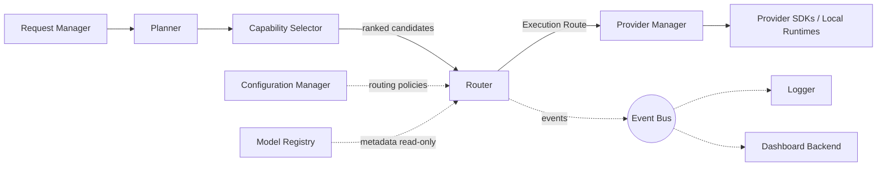

The Router sits **between** the Capability Selector and the Provider Manager in the request pipeline. It is invoked once per executable unit of work (typically once per Planner-produced task, or once for a single-step request that bypassed planning). It never sits in the same call path twice for the same unit of work except when explicitly re-invoked after a routing failure is escalated back to it by the Orchestrator Core with an updated candidate list.

---

## 2. Goals

### 2.1 Primary Goals

- Deterministically select the best available Provider/Model pair from a pre-validated candidate list, given current routing policies and runtime provider status.
- Support an arbitrary number of simultaneously active routing policies (latency, cost, quality, balanced, region, compliance, custom) with a well-defined precedence and conflict-resolution model.
- Guarantee that every routing decision is explainable: the returned Execution Route must carry enough metadata to reconstruct *why* that candidate won.
- Remain fully stateless with respect to execution — the Router never knows whether its decision was actually carried out successfully.
- Be extensible to new routing strategies and policies purely through configuration and plugin registration, with zero modification to existing routing logic (Open/Closed Principle).

### 2.2 Secondary Goals

- Provide sub-millisecond-to-low-millisecond decision latency for the common case via caching and parallel policy evaluation.
- Provide a route cache keyed on a normalized decision context, safely invalidated on policy or provider-status change.
- Expose sufficient routing telemetry (Section 15) for operators to understand routing behavior in aggregate, not just per-request.

### 2.3 Future Goals

- Adaptive routing informed by historical outcome data (fed back in from outside the Router, e.g. from a future Learning Layer — the Router only *consumes* such signals as an additional policy input, it does not compute them).
- Pluggable AI-assisted routing strategies registered the same way as any other routing strategy plugin.
- Multi-cluster and multi-region routing topologies.
- Dynamic, hot-reloadable organizational policy sets managed via the Dashboard Backend.

### 2.4 Non-Goals

- The Router does **not** determine whether a candidate is capable of handling a request (Capability Selector).
- The Router does **not** store, own, or update model metadata (Model Registry).
- The Router does **not** execute, retry, or fall back to another provider on failure (Provider Manager / Orchestrator Core).
- The Router does **not** normalize provider responses.
- The Router does **not** perform health monitoring — it *consumes* health/availability status as input.
- The Router does **not** implement business workflows, memory, review, or browser automation.

---

## 3. Responsibilities

### 3.1 Must Have

| # | Responsibility |
|---|---|
| M1 | Accept an Execution Request, ranked candidate list, runtime provider status snapshot, and active Routing Policy set as a single Routing Context. |
| M2 | Apply hard constraints (e.g. region restriction, compliance requirement, explicit exclusion) to eliminate ineligible candidates before scoring. |
| M3 | Evaluate remaining candidates against all applicable routing policies, producing a per-candidate Policy Score. |
| M4 | Resolve conflicts between policies using a deterministic precedence model (Section 9.4). |
| M5 | Optimize the final candidate ranking against configured objectives (Section 10). |
| M6 | Validate the selected route (non-empty, constraint-satisfying, internally consistent) before returning it. |
| M7 | Return a single, final Execution Route describing the selected Provider, Model, and routing rationale. |
| M8 | Publish routing lifecycle events (Section 12) for every decision, success or failure. |
| M9 | Fail explicitly and informatively (RoutingFailed) when no valid route can be resolved, rather than guessing. |
| M10 | Operate identically regardless of how many providers/models/policies are registered — no hard-coded provider or model names anywhere in routing logic. |

### 3.2 Should Have

| # | Responsibility |
|---|---|
| S1 | Cache recent routing decisions keyed on a normalized context hash, with explicit invalidation on policy/status change. |
| S2 | Evaluate independent policies in parallel to minimize decision latency. |
| S3 | Expose routing decision rationale in a structured, machine-readable form (not just a log line) for the Dashboard Backend. |
| S4 | Support per-organization and per-project policy overrides layered on top of global defaults. |

### 3.3 Future Responsibilities

| # | Responsibility |
|---|---|
| F1 | Consume externally computed adaptive-routing signals (e.g. observed historical success rate per provider/model) as an additional policy input. |
| F2 | Support pluggable custom routing strategies registered at runtime without redeploying the Router. |
| F3 | Support routing across multiple geographically distributed orchestrator clusters. |

---

## 4. Scope

### 4.1 Owns

- Routing decisions and the Execution Route data structure.
- Routing policy evaluation logic and policy precedence/conflict resolution.
- Candidate selection **among already-capability-validated candidates** (not capability validation itself).
- Routing constraints (hard filters) and routing rules.
- Routing strategy implementations (latency-optimized, cost-optimized, quality-optimized, balanced, custom).
- Provider preference and priority evaluation, as an input to scoring — not as a source of provider metadata.
- Route validation and route optimization logic.
- Its own short-lived route decision cache.
- Routing Context construction and lifecycle for the duration of a single decision.

### 4.2 Does Not Own

| Concern | Owning Module |
|---|---|
| Capability matching / capability scoring | Capability Selector |
| Model metadata (context window, pricing, region, capability tags) | Model Registry |
| Execution, provider SDK calls | Provider Manager |
| Retries, fallback execution | Orchestrator Core / Provider Manager |
| Response normalization | Provider Manager |
| Health monitoring / availability computation | Provider Manager (publishes status the Router consumes) |
| Planning / task decomposition | Planner |
| Memory, knowledge, review, browser automation | Memory Manager / Knowledge Manager / Review Engine / Browser Agent |
| Cost calculation, usage tracking | Provider Manager / Usage/Billing subsystem |
| Configuration storage | Configuration Manager |

### 4.3 Collaborates With

- **Capability Selector** — upstream; supplies the ranked, capability-compatible candidate list the Router operates on.
- **Model Registry** — read-only metadata source consulted during scoring (e.g. pricing, latency history, region).
- **Provider Manager** — downstream consumer of the Execution Route; the Router never calls it, only returns a decision the Orchestrator Core hands off.
- **Planner** — supplies executable tasks, one routing decision per task.
- **Configuration Manager** — supplies the active Routing Policy set and constraint definitions.
- **Event Bus** — receives all routing lifecycle events.
- **Logger** — receives structured routing/decision/policy/validation logs.
- **Dashboard Backend** — reads routing telemetry and decision rationale for display (via Event Bus / query interface, never via direct internal access).

---

## 5. Internal Architecture

The Router is internally composed of eleven collaborating components, each with a single, narrow responsibility, wired together through interfaces (Section 9, Clean/Hexagonal Architecture) and constructed via Dependency Injection so that any component can be swapped (e.g. a different Route Optimizer strategy) without touching the others.

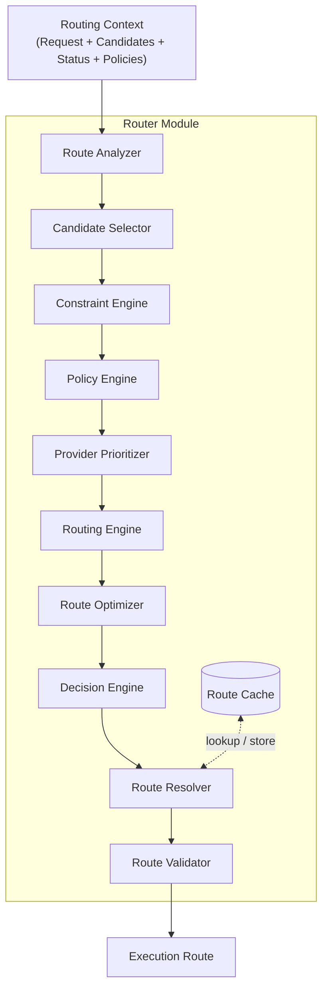

### 5.1 Routing Context

**Purpose:** An immutable, per-decision value object that carries everything the Router needs to make one decision, and nothing it needs to fetch itself.

**Responsibilities:** Bundle the Execution Request, the candidate list from the Capability Selector, the runtime provider status snapshot, the resolved Routing Policy set (global + org + project overrides already merged by the Configuration Manager), and correlation identifiers (request ID, task ID).

**Inputs:** Constructed by the Request Manager / Orchestrator Core before invoking `resolveRoute()`.

**Outputs:** Passed by reference through every internal component; never mutated in place — each stage produces a new derived context/result rather than mutating the input.

**Dependencies:** None (pure data).

**Lifecycle:** Created at the start of a single routing decision; discarded once the Execution Route is returned. Never persisted beyond the optional Route Cache entry (which stores a decision, not the context itself).

### 5.2 Route Analyzer

**Purpose:** First-pass inspection of the Routing Context to determine which routing strategy and policy subset apply.

**Responsibilities:** Classify the request (e.g. "interactive/low-latency-sensitive" vs. "batch/cost-sensitive"), determine which policies are relevant given request metadata and organizational configuration, and detect early-exit conditions (e.g. exactly one candidate and no conflicting policy — see 17.5).

**Inputs:** Routing Context.

**Outputs:** An Analysis Result: applicable policy set reference, request classification tags, early-exit eligibility flag.

**Dependencies:** Configuration Manager (policy set), none else.

**Lifecycle:** Runs once per decision, first in the pipeline.

### 5.3 Candidate Selector

**Purpose:** Normalize and prepare the incoming candidate list for constraint and policy evaluation. This is distinct from — and downstream of — the Capability Selector; it does not evaluate capability, it structures already-qualified candidates for routing.

**Responsibilities:** Deduplicate candidates, attach Model Registry metadata needed for scoring (read-only lookup), and produce the internal `RoutableCandidate` collection used by all downstream components.

**Inputs:** Raw candidate list (from Capability Selector, via Routing Context), Model Registry metadata.

**Outputs:** `RoutableCandidate[]` — each entry carrying provider ID, model ID, capability score (as supplied, not recomputed), and registry metadata fields listed in Section 7.

**Dependencies:** Model Registry (read-only).

**Lifecycle:** Runs once per decision, immediately after the Route Analyzer.

### 5.4 Constraint Engine

**Purpose:** Apply hard, non-negotiable filters that eliminate candidates outright.

**Responsibilities:** Evaluate constraints such as region restriction, compliance requirements, explicit provider exclusion lists, and organizational hard limits. A candidate that fails any constraint is removed from consideration entirely — constraints are not scored, they are pass/fail.

**Inputs:** `RoutableCandidate[]`, active constraint set (part of Routing Policies, Section 8).

**Outputs:** Filtered `RoutableCandidate[]`, plus a `RejectedCandidate[]` list carrying rejection reasons (used for RouteRejected events and diagnostics).

**Dependencies:** Configuration Manager.

**Lifecycle:** Runs once per decision; short-circuits to a `RoutingFailed` outcome if the filtered list becomes empty (Section 13).

### 5.5 Policy Engine

**Purpose:** Score each surviving candidate against every applicable, weighted (non-hard) routing policy.

**Responsibilities:** For each policy (latency optimization, cost optimization, quality optimization, balanced, provider preference, priority rules, custom policies), compute a normalized Policy Score per candidate, and combine per-policy scores into a single weighted score per candidate using configured policy weights.

**Inputs:** Filtered `RoutableCandidate[]`, applicable policy set, policy weight configuration.

**Outputs:** `ScoredCandidate[]` — each candidate annotated with per-policy scores and a combined Policy Score.

**Dependencies:** Configuration Manager (policy definitions and weights); may evaluate independent policies in parallel (Section 17.3).

**Lifecycle:** Runs once per decision, after constraint filtering.

### 5.6 Provider Prioritizer

**Purpose:** Apply explicit provider/model priority and preference ordering as a distinct, higher-precedence input than general policy scoring.

**Responsibilities:** Apply organization-declared provider priority tiers (e.g. "prefer Provider A over Provider B when scores are within X% of each other") and explicit pinning rules (e.g. "always prefer local runtime for this task type if capable").

**Inputs:** `ScoredCandidate[]`, provider priority/preference configuration.

**Outputs:** `PrioritizedCandidate[]` — the same candidates, re-ordered/adjusted per priority rules, with priority influence recorded for explainability.

**Dependencies:** Configuration Manager.

**Lifecycle:** Runs once per decision, after policy scoring.

### 5.7 Routing Engine

**Purpose:** The coordinating component that sequences Constraint Engine → Policy Engine → Provider Prioritizer and hands the result to optimization. It is the internal "conductor" — it contains no scoring logic itself.

**Responsibilities:** Own the internal pipeline sequencing, handle early-exit short-circuits from the Route Analyzer, and assemble the pre-optimization candidate ranking.

**Inputs:** Analysis Result, `RoutableCandidate[]`.

**Outputs:** Pre-optimization ranked candidate list.

**Dependencies:** Constraint Engine, Policy Engine, Provider Prioritizer.

**Lifecycle:** Runs once per decision; effectively the internal orchestrator-of-orchestration for this module only.

### 5.8 Route Optimizer

**Purpose:** Apply optimization objectives (Section 10) across the ranked candidate list to refine final ordering — this is distinct from policy scoring in that it operates on runtime/operational dimensions (current load distribution metadata, live latency metadata) rather than static policy weights.

**Responsibilities:** Adjust ranking for load distribution (avoid always picking the same top candidate when several are near-equivalent, to support even distribution), incorporate live latency/reliability metadata snapshots, and apply regional/priority optimization.

**Inputs:** Pre-optimization ranked candidate list, runtime provider status.

**Outputs:** Optimized ranked candidate list.

**Dependencies:** Provider status snapshot (input only — Route Optimizer does not fetch it).

**Lifecycle:** Runs once per decision, after the Routing Engine produces its ranking.

### 5.9 Decision Engine

**Purpose:** Select the single winning candidate from the optimized ranking and construct the preliminary Execution Route.

**Responsibilities:** Pick the top-ranked candidate, capture the full scoring/priority/optimization rationale that led to its selection, and construct the `ExecutionRoute` draft object.

**Inputs:** Optimized ranked candidate list.

**Outputs:** Draft `ExecutionRoute`.

**Dependencies:** None beyond its input.

**Lifecycle:** Runs once per decision.

### 5.10 Route Resolver

**Purpose:** Finalize the draft Execution Route, consulting the Route Cache first when a cache lookup is eligible (Section 17.1).

**Responsibilities:** Check the Route Cache for a valid cached decision matching the current context hash; if absent, accept the Decision Engine's draft; store the resolved route in the cache when caching is eligible (Section 17.1 conditions).

**Inputs:** Draft `ExecutionRoute`, Route Cache.

**Outputs:** Resolved `ExecutionRoute` (pre-validation).

**Dependencies:** Route Cache.

**Lifecycle:** Runs once per decision.

### 5.11 Route Validator

**Purpose:** Final correctness gate before returning a route to the caller.

**Responsibilities:** Verify the resolved route references a candidate that survived constraint filtering, verify all required fields are populated, verify the route does not violate any hard constraint (defense-in-depth check), and reject with a structured validation error if any check fails.

**Inputs:** Resolved `ExecutionRoute`.

**Outputs:** Validated `ExecutionRoute`, or a `RouteValidationError`.

**Dependencies:** None beyond its input and the original constraint set (passed through Routing Context for the final check).

**Lifecycle:** Runs once per decision, last in the pipeline.

### 5.12 Route Cache

**Purpose:** Reduce decision latency for repeated/near-identical routing contexts.

**Responsibilities:** Store recent `(context hash → ExecutionRoute)` entries with a short TTL; invalidate entries on routing policy change, provider status change affecting a cached candidate, or Model Registry metadata change relevant to a cached candidate.

**Inputs:** Context hash, resolved route (write path); context hash (read path).

**Outputs:** Cached `ExecutionRoute` or cache miss.

**Dependencies:** Subscribes to Event Bus for invalidation triggers (`RoutingPolicyUpdated`, provider status change events, Model Registry update events).

**Lifecycle:** Long-lived relative to a single decision; entries expire by TTL or explicit invalidation.

---

## 6. Routing Lifecycle

### 6.1 Step-by-Step Lifecycle

1. **Receive Request** — Orchestrator Core / Request Manager invokes `resolveRoute()` with a Routing Context.
2. **Receive Candidate List** — the candidate list embedded in the Routing Context (from the Capability Selector) is normalized by the Candidate Selector.
3. **Load Routing Policies** — the Route Analyzer determines the applicable policy subset from the Configuration Manager-supplied policy set.
4. **Apply Constraints** — the Constraint Engine removes ineligible candidates; if none remain, the lifecycle short-circuits to `RoutingFailed`.
5. **Evaluate Providers** — the Policy Engine scores remaining candidates against applicable policies; the Provider Prioritizer applies priority/preference adjustments.
6. **Optimize Route** — the Route Optimizer refines ranking using runtime/operational metadata.
7. **Validate Route** — an intermediate consistency check occurs implicitly via the Routing Engine's assembly; the authoritative validation occurs at step 9.
8. **Select Provider** — the Decision Engine picks the top candidate and drafts the Execution Route; the Route Resolver checks/updates the Route Cache.
9. **Return Execution Route** — the Route Validator performs the final validation pass and the validated route is returned to the caller; a `RoutingCompleted` event is published (or `RoutingFailed` if validation fails).

### 6.2 Lifecycle Diagram

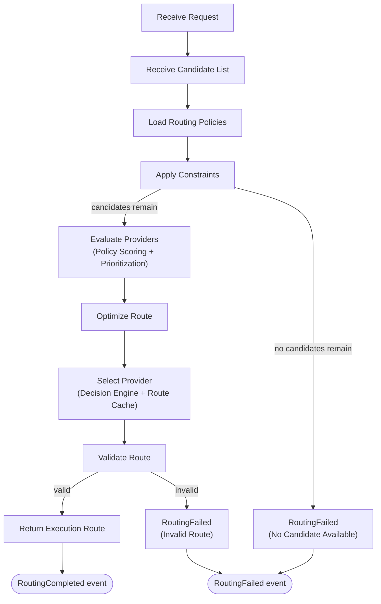

---

## 7. Routing Model

The Routing Model defines the metadata structure the Router reasons over. All fields except `capabilityScore` (supplied by the Capability Selector) and `provider`/`model` identity are either read from the Model Registry or computed within the Router during a single decision — the Router never writes any of these fields back to persistent storage.

| Field | Type | Owner / Source | Explanation |
|---|---|---|---|
| `provider` | string (ID) | Provider Manager / Model Registry (identity) | Identifies which registered provider plugin this candidate belongs to. The Router treats this as an opaque identifier, never special-cased. |
| `model` | string (ID) | Model Registry | Identifies the specific model within the provider. Opaque to routing logic beyond metadata lookups. |
| `priority` | integer | Configuration Manager (Provider Prioritizer input) | Organization-declared preference tier; lower tiers are preferred when scores are within the configured tie-break threshold. |
| `availability` | enum (`available`, `degraded`, `unavailable`) | Provider Manager (runtime status, read-only input) | Current operational status; `unavailable` acts as a hard constraint, `degraded` reduces optimization score. |
| `region` | string | Model Registry | Deployment/data-residency region; used by Region Policies and Compliance Policies. |
| `latencyMetadata` | object (`p50`, `p95`, `p99`) | Model Registry / Provider Manager telemetry (read-only) | Recent observed latency distribution; input to Latency Optimization. |
| `reliabilityMetadata` | object (`successRate`, `errorRate`, `recentIncidents`) | Model Registry / Provider Manager telemetry (read-only) | Recent observed reliability; input to Quality/Reliability Optimization. |
| `pricingMetadata` | object (`inputCostPerToken`, `outputCostPerToken`, `currency`) | Model Registry | Input to Cost Optimization; the Router computes a relative cost score, it does not compute actual billed cost. |
| `capabilityScore` | float (0–1) | Capability Selector | Passed through unchanged; the Router uses it as one scoring input but never recomputes or challenges it. |
| `routingScore` | float (0–1) | Computed by Policy Engine + Route Optimizer | The Router's own combined output score for this candidate in this decision; not persisted beyond the decision/cache entry. |
| `policyScore` | float (0–1) | Computed by Policy Engine | The weighted combination of all applicable per-policy scores, prior to optimization adjustments. |
| `contextWindow` | integer (tokens) | Model Registry | Used only as a constraint check (does the model's window satisfy the request's declared minimum) — the adequacy determination itself belongs to the Capability Selector; the Router treats a Capability-Selector-approved candidate as already satisfying this, and re-reads the field only for tie-break/optimization scoring. |
| `customMetadata` | map\<string, any\> | Model Registry / Configuration Manager | Extension point for organization- or plugin-specific fields consumed by Custom Policies (Section 8) without requiring schema changes to the Routing Model. |

---

## 8. Routing Policies

Routing Policies are the configurable, weighted scoring strategies evaluated by the Policy Engine. Constraints (Section 5.4) are hard filters; Policies are soft, weighted, and combinable.

| Policy | Explanation |
|---|---|
| **Latency Optimization** | Scores candidates favoring lower `latencyMetadata.p95`/`p99`. Weight increases for requests classified as interactive by the Route Analyzer. |
| **Cost Optimization** | Scores candidates favoring lower `pricingMetadata` relative to estimated request size. Weight increases for requests classified as batch/bulk. |
| **Quality Optimization** | Scores candidates favoring higher `capabilityScore` and `reliabilityMetadata.successRate`. Used when the request is flagged as quality-sensitive (e.g. architecture/review tasks per platform routing rules). |
| **Balanced Routing** | A default composite policy combining Latency, Cost, and Quality with configured default weights when no more specific policy dominates. |
| **Region Policies** | Constraint- or policy-level rules requiring/preferring candidates whose `region` matches request or organizational data-residency requirements. |
| **Compliance Policies** | Hard constraints (evaluated by the Constraint Engine, not scored) that exclude candidates failing declared compliance requirements (e.g. data processing agreements, certification tags in `customMetadata`). |
| **Provider Preferences** | Declarative preference ordering (e.g. "prefer local runtime when capable") consumed by the Provider Prioritizer. |
| **Priority Rules** | Numeric `priority` tiers applied as tie-breakers when combined scores fall within a configured threshold of each other. |
| **Business Rules** | Organization-specific policies expressed through the same policy interface (Section 9.6) — e.g. "route all customer-facing tasks to Tier-1 providers only." |
| **Organization Rules** | Multi-tenant overrides layered by the Configuration Manager on top of global defaults before the Routing Context is constructed. |
| **Custom Policies** | Any policy implementing the standard Policy interface (Section 9.6) and registered with the Policy Engine; evaluated identically to built-in policies — this is the primary Open/Closed extension point for routing strategy. |

Policies are combined via configured weights (summing to 1.0 within a policy group) into the `policyScore`; Provider Prioritizer adjustments and Route Optimizer adjustments are applied afterward as documented in Sections 5.6 and 5.8.

---

## 9. Route Resolution

### 9.1 Policy Evaluation

Each applicable policy independently scores every surviving candidate on a normalized 0–1 scale. Policies with no relevant data for a candidate (e.g. missing `latencyMetadata`) score that dimension as neutral (0.5) rather than penalizing or favoring by default, unless a policy explicitly defines a "missing data" penalty.

### 9.2 Constraint Resolution

Constraints are evaluated before any scoring. A candidate failing any single constraint is removed and recorded as a `RejectedCandidate` with the specific constraint ID that caused rejection. Constraint evaluation order does not affect the outcome — constraints are pure conjunction (AND).

### 9.3 Provider Prioritization

Priority tiers and explicit preferences are applied after policy scoring, as a re-ranking pass with a configured **tie-break threshold** (e.g. 3% score delta) — a lower-priority-tier candidate only overtakes a higher combined score if the score difference is within threshold; priority never overrides a decisively higher score outright, which keeps priority a *tie-breaker* rather than a silent override of quality/cost/latency policy outcomes.

### 9.4 Conflict Resolution

When policies disagree (e.g. Cost Optimization favors Candidate A, Quality Optimization favors Candidate B), resolution follows this deterministic precedence:

1. Constraints (hard, already resolved in 9.2 — never in conflict with policies by definition).
2. Explicit Business/Organization Rules (highest-precedence policies, configurable weight override).
3. Weighted combination of remaining active policies (Latency/Cost/Quality/Balanced/Custom), per configured weights.
4. Provider Prioritizer tie-break threshold applied to the combined result.
5. Route Optimizer runtime adjustments (Section 10) applied last.

This precedence order is itself configuration-driven (the *existence* of five precedence bands is fixed by this design; the *policies within each band and their weights* are fully configurable).

### 9.5 Decision Rules

The Decision Engine always selects the single highest-scoring candidate after all bands in 9.4 have been applied. Deterministic tie-break on exact score equality falls back to `priority` field, then to candidate list order as a final, stable tie-break (never random) to keep decisions reproducible for the same input.

### 9.6 Optimization

See Section 10.

### 9.7 Validation

See Section 5.11 / Section 13.

### 9.8 Policy Interface Shape (Architectural, Non-Implementation)

To support unlimited custom policies without modifying the Policy Engine, every policy — built-in or custom — conforms to the same conceptual contract:

```
Policy:
  id: string
  appliesTo(context) -> boolean
  score(candidate, context) -> float [0..1]
  weight(context) -> float
```

This shape is described here purely to establish the extensibility contract (Section 21); it is not an implementation.

---

## 10. Route Optimization

Route Optimization is the final adjustment pass applied by the Route Optimizer, distinct from Policy Engine scoring in that it reasons over **live/runtime** data rather than static policy weights. The Router only *decides* the optimized ranking — it never executes, load-balances traffic, or enforces the decision; that remains the Provider Manager's responsibility once it receives the Execution Route.

| Optimization Dimension | Explanation |
|---|---|
| **Latency Optimization** | Re-weights near-tied candidates using the freshest available latency snapshot (may be more recent than the metadata used in Policy Engine scoring if runtime status was updated mid-decision). |
| **Cost Optimization** | Applies any last-mile cost adjustment known only at runtime (e.g. a currently active promotional rate flagged in provider status), distinct from the static `pricingMetadata` used earlier. |
| **Reliability Optimization** | Down-weights candidates whose runtime status is `degraded` even if they were not hard-excluded by constraints. |
| **Availability Optimization** | Confirms the top candidate's `availability` is `available` at decision time; if it has flipped to `unavailable` since candidate list construction, the Route Optimizer drops it and promotes the next-ranked candidate, recording this as an optimization-stage rejection. |
| **Load Distribution Metadata** | Consumes an externally supplied distribution hint (e.g. recent selection frequency per candidate, computed and supplied by the Provider Manager or Monitoring subsystem) to mildly favor under-selected near-tied candidates, avoiding decision herding without the Router itself tracking execution history. |
| **Regional Optimization** | Among near-tied candidates, prefers the region closest to the declared request origin, when such metadata is present. |
| **Priority Optimization** | Final application of `priority` as the last tie-break, consistent with 9.5. |

---

## 11. Public Interfaces

All interfaces below are described architecturally — purpose, inputs, outputs, validation, and error conditions — without implementation code, consistent with the Hexagonal Architecture boundary the Router exposes to the Orchestrator Core (its only caller) and the Configuration Manager (policy provider).

### 11.1 `resolveRoute(routingContext)`

- **Purpose:** The primary entry point. Runs the full lifecycle (Section 6) and returns a validated Execution Route.
- **Inputs:** A fully constructed Routing Context (Execution Request, candidate list, provider status snapshot, resolved policy set).
- **Outputs:** A validated `ExecutionRoute` object containing selected provider, selected model, routing score, and decision rationale (which policies/constraints/priorities contributed).
- **Validation:** Rejects malformed Routing Context (missing candidate list, missing policy set) before entering the lifecycle.
- **Errors:** `RoutingFailed` (no viable candidate), `RouteValidationError` (internal consistency failure), `InvalidRoutingContextError` (malformed input).

### 11.2 `selectProvider(candidates, policies)`

- **Purpose:** A narrower entry point exposing only the selection stage (Policy Engine → Provider Prioritizer → Route Optimizer → Decision Engine), for callers that have already performed constraint filtering themselves (rare; primarily used internally and in testing).
- **Inputs:** Pre-filtered `RoutableCandidate[]`, policy set.
- **Outputs:** Draft `ExecutionRoute` (pre-validation).
- **Validation:** Requires a non-empty candidate list.
- **Errors:** `RoutingFailed` (empty candidate list).

### 11.3 `evaluateCandidates(candidates, context)`

- **Purpose:** Exposes constraint filtering and policy scoring as an inspectable step, primarily for diagnostics, testing, and Dashboard Backend "explain this decision" tooling.
- **Inputs:** `RoutableCandidate[]`, Routing Context.
- **Outputs:** `ScoredCandidate[]` with full per-policy score breakdown and any rejection reasons.
- **Validation:** None beyond input shape.
- **Errors:** None beyond standard input validation errors.

### 11.4 `validateRoute(route, context)`

- **Purpose:** Exposes the Route Validator as an independently callable check, used both at the end of `resolveRoute()` and by the Route Cache read path to re-validate a cached entry against current constraints before returning it.
- **Inputs:** An `ExecutionRoute` (draft or cached), Routing Context.
- **Outputs:** Boolean validity plus a structured list of violated checks, if any.
- **Validation:** N/A (this *is* the validation step).
- **Errors:** Does not throw; returns a validity result so callers (including the cache path) can decide whether to fall through to full re-resolution.

### 11.5 `applyRoutingPolicy(policy, candidates, context)`

- **Purpose:** Exposes single-policy application, primarily as the extension seam custom policy plugins are exercised through, and for isolated policy unit testing.
- **Inputs:** A single Policy (built-in or custom, conforming to the shape in 9.8), `RoutableCandidate[]`, Routing Context.
- **Outputs:** `RoutableCandidate[]` annotated with that policy's score.
- **Validation:** Confirms the policy declares itself applicable (`appliesTo(context)`) before scoring; otherwise returns candidates unmodified.
- **Errors:** `PolicyEvaluationError` if a policy implementation throws during scoring — isolated per policy so one broken custom policy cannot fail the entire Policy Engine pass (the offending policy's contribution is dropped and logged, not propagated as a fatal error, unless it is a Business/Organization Rule marked as `critical`, in which case it does propagate as `RoutingFailed`).

---

## 12. Events

All events are published to the Event Bus using the platform's standard event envelope (correlation ID, timestamp, source module = `"router"`), per the Event Bus MDD.

| Event | Publisher | Subscribers | Payload | Trigger | Retry Behaviour |
|---|---|---|---|---|---|
| `RouteResolved` | Route Resolver | Logger, Dashboard Backend | `{ requestId, taskId, provider, model, routingScore, cacheHit }` | Emitted the moment the Route Resolver produces a resolved (pre-validation) route. | Not retried — informational; if the subsequent validation fails, `RoutingFailed` follows and consumers reconcile via correlation ID. |
| `RouteSelected` | Decision Engine | Logger, Dashboard Backend, Learning Layer (future) | `{ requestId, taskId, provider, model, policyScore, priorityAdjustment, optimizationAdjustment }` | Emitted when the Decision Engine selects the winning candidate, before caching/validation. | Not retried. |
| `RouteRejected` | Constraint Engine, Route Optimizer | Logger, Dashboard Backend | `{ requestId, candidate, reason, stage }` | Emitted once per candidate removed by a hard constraint or an optimization-stage availability drop. | Not retried; may fire multiple times per decision (once per rejected candidate). |
| `PolicyApplied` | Policy Engine | Logger, Dashboard Backend | `{ requestId, policyId, candidateCount, weight }` | Emitted once per policy evaluated during a decision. | Not retried. |
| `ProviderSelected` | Route Validator | Provider Manager (via Orchestrator Core handoff), Logger, Dashboard Backend | `{ requestId, taskId, provider, model, executionRoute }` | Emitted after successful validation, immediately before the Execution Route is returned to the caller. | Not retried — this is the authoritative "decision made" signal. |
| `RoutingCompleted` | Router (top-level) | Orchestrator Core, Logger, Dashboard Backend, Event Bus subscribers tracking request lifecycle | `{ requestId, taskId, executionRoute, decisionLatencyMs }` | Emitted at the very end of a successful `resolveRoute()` call. | Not retried. |
| `RoutingFailed` | Router (top-level, any failure stage) | Orchestrator Core, Logger, Dashboard Backend, Alerting | `{ requestId, taskId, failureStage, reason, rejectedCandidates }` | Emitted whenever the lifecycle cannot produce a valid route (Section 13). | Not retried by the Router itself — the Orchestrator Core decides whether to re-invoke Routing with adjusted input (e.g. after Capability Selector supplies a broader candidate list). |
| `RoutingPolicyUpdated` | (External — Configuration Manager) | Router (Route Cache invalidation), Logger | `{ policyId, changeType }` | Emitted by the Configuration Manager, consumed by the Router to invalidate affected Route Cache entries. | N/A — inbound event, not published by the Router. |

---

## 13. Error Handling

| Failure Condition | Detection Point | Recovery Strategy |
|---|---|---|
| **No Candidate Available** | Constraint Engine (post-filter list empty), or Route Optimizer (last candidate drops due to runtime unavailability) | Publish `RoutingFailed` with `failureStage` and the full `RejectedCandidate[]` list with reasons. The Router does **not** retry or fall back — it returns control to the Orchestrator Core, which may re-invoke the Capability Selector for a broader candidate set or escalate to the user. |
| **Policy Conflict** | Policy Engine / precedence resolution (9.4) | Not an error condition by design — conflicts are resolved deterministically via the precedence model. If precedence itself is ambiguously configured (e.g. two Business Rules with identical precedence and no tie-break), this is treated as a **Configuration Error**, surfaced at policy-load time by the Configuration Manager, not at decision time. |
| **Constraint Conflict** | Constraint Engine (e.g. two mutually exclusive hard constraints both required) | Treated as a Configuration Error; the Constraint Engine fails closed (rejects all candidates) rather than guessing, and publishes `RoutingFailed` with `failureStage: "constraint-conflict"`. |
| **Unavailable Provider** | Route Optimizer (Availability Optimization) or Constraint Engine (if `availability: unavailable` is treated as a hard constraint per configuration) | Candidate is dropped (`RouteRejected`); routing continues with remaining candidates. Only escalates to `RoutingFailed` if this empties the candidate list. |
| **Invalid Route** | Route Validator | `RouteValidationError` is raised internally; the Router publishes `RoutingFailed` with `failureStage: "validation"` rather than returning a route that failed its own consistency check. |
| **Metadata Failure** (Model Registry lookup fails/times out for a candidate) | Candidate Selector | That candidate is excluded from the routable set (treated as incomplete, not eligible for scoring) and recorded as `RouteRejected` with `reason: "metadata-unavailable"`; does not fail the whole decision unless it empties the candidate list. |
| **Registry Failure** (Model Registry unreachable entirely) | Candidate Selector | Router-wide fallback to whatever metadata was included directly on the candidate objects from the Capability Selector (degraded-mode scoring using fewer fields); if insufficient fields remain to evaluate applicable policies, publish `RoutingFailed` with `failureStage: "registry-unavailable"`. |

**General Recovery Principle:** The Router never retries and never falls back to executing anything itself — "recovery" for the Router always means either (a) continuing the decision with a reduced but still-valid candidate set, or (b) failing fast and explicitly with enough structured detail for the Orchestrator Core to decide the next step. This preserves the module boundary: retry/fallback *execution* strategy belongs to the Orchestrator Core and Provider Manager.

---

## 14. Logging

| Log Category | Content | Level |
|---|---|---|
| **Routing Logs** | One structured entry per `resolveRoute()` invocation: requestId, taskId, candidate count in/out, selected provider/model, total decision latency. | INFO |
| **Policy Logs** | One entry per policy evaluated: policyId, weight, candidate count scored, score distribution summary. | DEBUG |
| **Decision Logs** | Full rationale for the winning candidate: constraint pass/fail summary, policy score breakdown, priority adjustment, optimization adjustment. | INFO |
| **Optimization Logs** | Per-optimization-dimension adjustments applied by the Route Optimizer, including any last-mile candidate drops. | DEBUG |
| **Validation Logs** | Result of the Route Validator's checks, including any violated checks on failure. | INFO (pass) / WARN (fail) |
| **Audit Logs** | Immutable record of every routing decision's final outcome (route selected or routing failed) with full correlation IDs, retained per the platform's audit retention policy — used for compliance and post-hoc "why did we route here" review. | AUDIT (separate, non-rotating stream) |

All logs are correlated by `requestId` and `taskId` and emitted through the shared Logger interface (per the platform Logging System design) rather than written directly to disk by the Router.

---

## 15. Monitoring

| Metric | Description |
|---|---|
| **Routing Requests** | Count of `resolveRoute()` invocations, tagged by request classification (interactive/batch). |
| **Route Success** | Ratio of `RoutingCompleted` to total invocations (i.e. inverse of `RoutingFailed` rate). |
| **Policy Usage** | Count of invocations per policy ID, and average weight contribution. |
| **Provider Distribution** | Count of `RouteSelected` events per provider/model pair — used to detect unintended concentration and to feed Load Distribution Metadata (Section 10). |
| **Decision Latency** | Histogram of end-to-end `resolveRoute()` duration, broken down by pipeline stage (constraint filtering, policy scoring, optimization, validation). |
| **Routing Performance** | Aggregate throughput (decisions/sec) under load, tracked against the performance targets in Section 17. |
| **Cache Performance** | Route Cache hit rate, eviction rate, and average age of served entries. |

Metrics are emitted through the platform's standard metrics interface (consumed by the Dashboard Backend and any external monitoring integration) rather than the Router maintaining its own metrics store.

---

## 16. Security

| Concern | Design |
|---|---|
| **Policy Integrity** | Routing Policies are loaded exclusively from the Configuration Manager, which is responsible for authenticated, validated configuration sources. The Router treats the supplied policy set as trusted input for a given decision but does not accept ad-hoc policy overrides embedded in an Execution Request — request-level "hints" are treated as request classification input to the Route Analyzer, never as a way to inject arbitrary policy logic. |
| **Route Integrity** | The Route Validator's final pass exists specifically to prevent a manipulated or corrupted intermediate state from producing a route that violates a hard constraint — this is a defense-in-depth check independent of the Constraint Engine's earlier pass. |
| **Configuration Protection** | The Router has read-only access to policy/constraint configuration; it has no write path to the Configuration Manager, so a compromised Router instance cannot alter routing policy for future decisions. |
| **Access Control** | `resolveRoute()` and related public interfaces are callable only by the Orchestrator Core within the platform's internal trust boundary; the Router is never exposed on any external-facing API surface (consistent with Section 4 — it is an internal decision engine, not an edge component). |
| **Auditability** | Every decision is fully reconstructable from the Audit Log stream (Section 14) and the `ProviderSelected`/`RoutingFailed` event payloads, satisfying compliance requirements without the Router needing to be a system of record itself (the Database Design Document's audit store, not the Router, is the durable owner of this history). |

---

## 17. Performance

| Technique | Design |
|---|---|
| **Route Cache** | Caches resolved decisions keyed on a hash of (normalized candidate set, applicable policy set version, provider status version). Cache eligibility requires: no `critical` Business Rule policy in play (those are always freshly evaluated), and a TTL short enough that stale availability data cannot meaningfully affect correctness (configurable, default low-single-digit seconds). |
| **Metadata Cache** | The Candidate Selector caches recent Model Registry lookups per model ID with its own short TTL, independent of the Route Cache, to avoid a registry round-trip on every decision even on a cache-miss for the overall route. |
| **Parallel Evaluation** | Independent policies (those whose `appliesTo()` do not share mutable evaluation state) are evaluated concurrently by the Policy Engine; Business/Organization Rules marked as order-sensitive are evaluated sequentially per the precedence model. |
| **Lazy Loading** | Custom policy plugins and their configuration are loaded lazily on first use per policy ID rather than eagerly at Router startup, reducing cold-start cost as the policy catalog grows. |
| **Fast Selection** | The Route Analyzer's early-exit path (Section 5.2) bypasses full policy scoring when only one capability-qualified candidate exists and no constraint/policy conflict is possible, reducing decision latency for the common single-candidate case to constraint validation plus route validation only. |
| **Memory Optimization** | Routing Context and all intermediate candidate collections are scoped to the lifetime of a single decision and are not retained; only the compact `ExecutionRoute` (and, optionally, a cache entry) outlives the decision. |
| **Incremental Updates** | Route Cache invalidation is targeted (only entries referencing an affected policy/provider/model are invalidated on `RoutingPolicyUpdated` or provider-status-change events) rather than a full cache flush, to preserve cache effectiveness under frequent, narrow configuration changes. |

---

## 18. Interaction With Other Modules

### 18.1 Capability Selector → Router

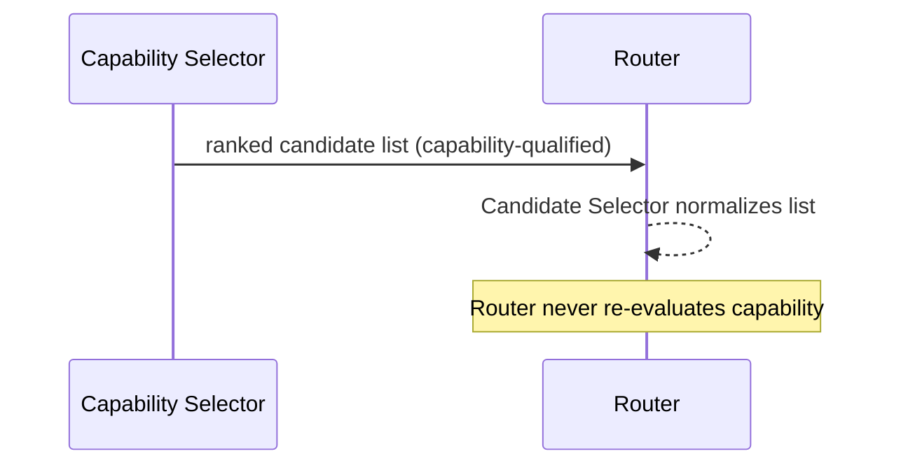

### 18.2 Model Registry → Router

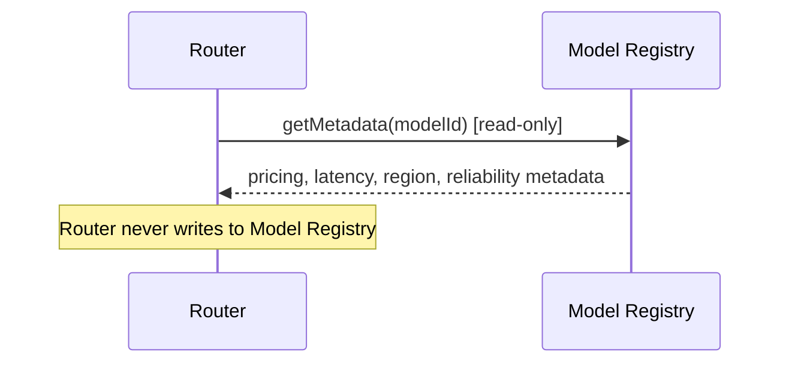

### 18.3 Planner → Router

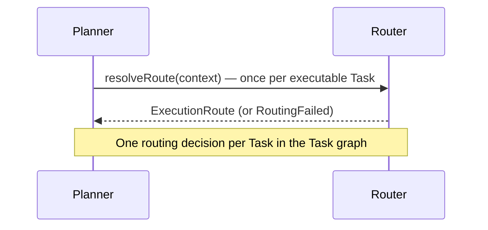

### 18.4 Router → Provider Manager (via Orchestrator Core)

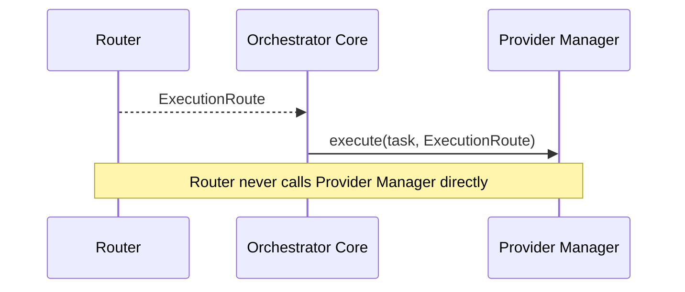

### 18.5 Configuration Manager → Router

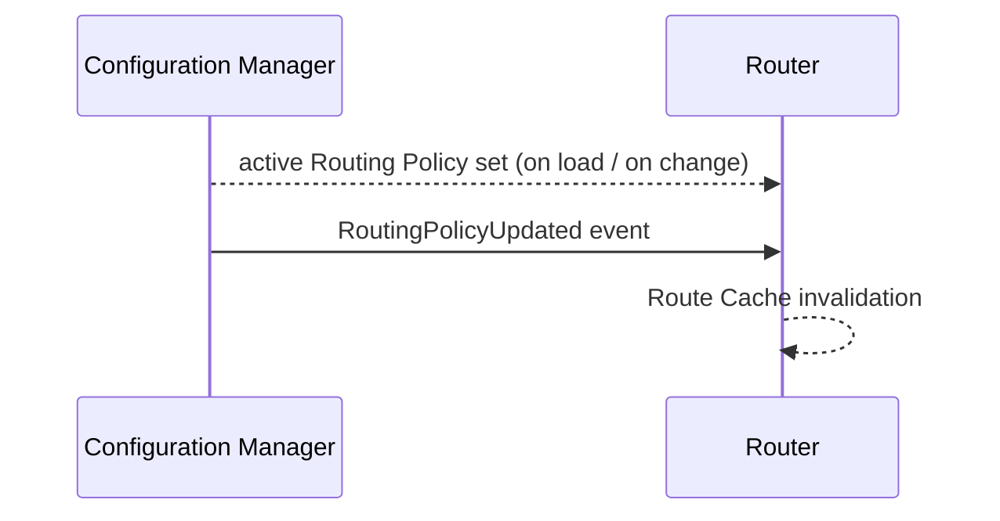

### 18.6 Router → Dashboard Backend (via Event Bus)

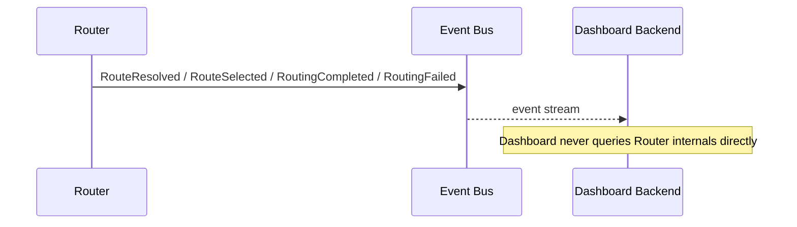

### 18.7 Router → Event Bus → Logger

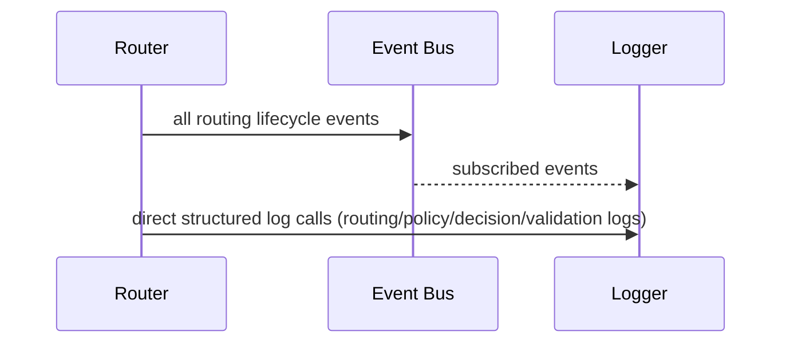

---

## 19. Folder Structure

```
router/
├── domain/
│   ├── routing-context.ts        # Routing Context value object (Section 5.1)
│   ├── routable-candidate.ts     # RoutableCandidate, ScoredCandidate, PrioritizedCandidate models
│   ├── execution-route.ts        # ExecutionRoute output model
│   ├── routing-policy.ts         # Policy interface/contract (Section 9.8)
│   └── routing-constraint.ts     # Constraint contract
│
├── application/
│   ├── route-analyzer/
│   │   └── route-analyzer.ts     # Section 5.2
│   ├── candidate-selector/
│   │   └── candidate-selector.ts # Section 5.3
│   ├── constraint-engine/
│   │   └── constraint-engine.ts  # Section 5.4
│   ├── policy-engine/
│   │   ├── policy-engine.ts      # Section 5.5
│   │   └── policies/             # Built-in policy implementations (one file per policy)
│   │       ├── latency-optimization.policy.ts
│   │       ├── cost-optimization.policy.ts
│   │       ├── quality-optimization.policy.ts
│   │       ├── balanced-routing.policy.ts
│   │       ├── region.policy.ts
│   │       ├── compliance.policy.ts
│   │       └── priority.policy.ts
│   ├── provider-prioritizer/
│   │   └── provider-prioritizer.ts # Section 5.6
│   ├── routing-engine/
│   │   └── routing-engine.ts     # Section 5.7 — internal pipeline conductor
│   ├── route-optimizer/
│   │   └── route-optimizer.ts    # Section 5.8 / Section 10
│   ├── decision-engine/
│   │   └── decision-engine.ts    # Section 5.9
│   ├── route-resolver/
│   │   └── route-resolver.ts     # Section 5.10
│   └── route-validator/
│       └── route-validator.ts    # Section 5.11
│
├── infrastructure/
│   ├── route-cache/
│   │   └── route-cache.ts        # Section 5.12 — cache adapter (pluggable backend: in-memory / distributed)
│   ├── model-registry-client/
│   │   └── model-registry-client.ts # Read-only adapter to Model Registry module
│   ├── config-client/
│   │   └── config-client.ts      # Read-only adapter to Configuration Manager
│   └── event-publisher/
│       └── router-event-publisher.ts # Adapter to Event Bus (Section 12)
│
├── interfaces/
│   ├── router.interface.ts       # Public interface contracts (Section 11)
│   └── policy-plugin.interface.ts # Extension contract for custom policies (Section 21)
│
├── plugins/
│   └── custom-policies/          # Drop-in directory for organization-specific / future custom policies
│
├── config/
│   └── default-routing-policies.yaml # Default global policy/weight/precedence configuration
│
└── tests/
    ├── unit/
    ├── policy/
    ├── constraint/
    ├── optimization/
    ├── integration/
    ├── performance/
    └── regression/
```

**Design rationale for this structure:**

- `domain/` holds pure data contracts with no dependencies on any other layer — consistent with Clean/Hexagonal Architecture, this layer is what everything else depends on, never the reverse.
- `application/` contains one directory per internal component from Section 5, each independently unit-testable and independently swappable via Dependency Injection.
- `infrastructure/` isolates every outbound dependency (Model Registry, Configuration Manager, Event Bus, cache backend) behind adapters implementing interfaces defined in `domain/` or `interfaces/`, so the Router's core logic never imports a concrete infrastructure client directly.
- `interfaces/` is the Hexagonal "ports" layer — both the public API the Orchestrator Core calls and the plugin contract external policies implement.
- `plugins/custom-policies/` is the concrete Open/Closed extension point described throughout this document: new routing strategies are added here without modifying `application/policy-engine/`.
- `tests/` mirrors the functional breakdown requested in Section 20, rather than mirroring the folder structure 1:1, so that cross-cutting test types (e.g. performance, regression) remain easy to locate.

---

## 20. Testing Strategy

| Test Category | Coverage |
|---|---|
| **Unit Tests** | Every component in Section 5 tested in isolation with mocked dependencies (Constraint Engine, Policy Engine, Provider Prioritizer, Route Optimizer, Decision Engine, Route Resolver, Route Validator each independently). |
| **Routing Tests** | End-to-end `resolveRoute()` behavior across representative scenarios: single candidate, multiple near-tied candidates, no eligible candidates, degraded provider mid-decision. |
| **Policy Tests** | Each built-in policy tested for correct scoring behavior in isolation, plus combined-weight tests verifying the Policy Engine's aggregation math. |
| **Constraint Tests** | Each constraint type (region, compliance, exclusion) tested for correct hard-filter behavior, including conflicting-constraint configuration detection. |
| **Optimization Tests** | Route Optimizer behavior under simulated runtime status changes (availability flip mid-decision, degraded reliability), verifying correct candidate promotion/demotion. |
| **Integration Tests** | Router exercised against real (or realistic test-double) Capability Selector output, Model Registry responses, and Configuration Manager policy sets, verifying the full module boundary contract. |
| **Performance Tests** | Decision latency measured against the targets implied by Section 17 under varying candidate-list sizes and policy-set sizes. |
| **Stress Tests** | Sustained high-throughput `resolveRoute()` invocation to validate Route Cache and parallel policy evaluation hold up without degradation or memory growth. |
| **Regression Tests** | A fixed corpus of previously observed routing decisions (input context → expected route) re-run on every change to catch unintended routing behavior shifts, especially after policy or precedence-model changes. |

---

## 21. Future Expansion

The following capabilities are explicitly designed for, without requiring modification to existing Router source code, via the extension points already defined in this document:

| Future Capability | Extension Mechanism |
|---|---|
| **Adaptive Routing** | Consumed as an additional Custom Policy or Load Distribution Metadata input (Section 10) — the Router's scoring pipeline already accepts externally computed signals without structural change. |
| **AI-Based Routing** | Implemented as a Custom Policy (Section 9.8) registered in `plugins/custom-policies/`; the Policy Engine treats it identically to any built-in policy. |
| **Dynamic Policies** | Already supported structurally via `RoutingPolicyUpdated` events and Route Cache invalidation (Section 12, Section 17.7); a future Dashboard Backend can push policy changes at runtime with no Router code changes. |
| **Plugin-Based Routing Strategies** | The Policy interface (9.8) and `interfaces/policy-plugin.interface.ts` are the stable contract; new strategies are new plugin files, never edits to `policy-engine.ts`. |
| **Regional Routing** | Extends the existing Region Policy and `region`/`customMetadata` fields (Section 7); multi-region topology awareness is additional metadata, not new routing logic. |
| **Multi-Cluster Routing** | The Routing Context's provider status snapshot can be extended to include cluster identity as `customMetadata`; the Route Optimizer's Regional Optimization dimension generalizes to cluster-aware optimization without interface changes. |
| **Enterprise Policies** | Organization Rules (Section 8) are already a first-class policy category with tenant-scoped configuration layering; enterprise-specific rule sets are additional configuration, not code. |

---

## 22. Risks

| Category | Risk | Mitigation |
|---|---|---|
| **Architecture** | Policy precedence model (Section 9.4) becomes too rigid for a future business need that doesn't fit the five-band structure. | The band structure is fixed by design for determinism and auditability; new needs are expected to be expressed as weight/configuration changes within a band, or as a new Custom Policy — validated during initial policy design review before implementation. |
| **Performance** | Large candidate lists combined with many active custom policies could push decision latency above interactive-request budgets. | Route Analyzer early-exit path, parallel policy evaluation, and Route Cache are specifically designed to bound this; performance tests (Section 20) must include worst-case candidate/policy counts, not just typical ones. |
| **Consistency** | Route Cache serving a slightly stale decision after a provider status change could route to a now-unavailable candidate. | Cache TTL is intentionally short and event-driven invalidation is targeted and immediate on `RoutingPolicyUpdated`/status-change events; the Route Validator's defense-in-depth check catches most residual staleness before a route is returned. |
| **Scalability** | Unlimited custom policies (Section 21) could degrade Policy Engine performance linearly with policy count. | Lazy loading (17.5) and parallel evaluation bound the marginal cost per policy; policies are expected to be narrow and fast by contract (no I/O inside `score()`, metadata must already be present on the candidate). |
| **Maintenance** | As more Business/Organization Rules accumulate, precedence and interaction between them can become hard to reason about. | Audit Logs (Section 14) and the `evaluateCandidates()` diagnostic interface (Section 11.3) are specifically provided so operators can inspect exactly how a given decision was reached, rather than relying on code inspection. |

---

## 23. Design Decisions

| Decision | Alternatives Considered | Trade-off Discussion | Why Chosen |
|---|---|---|---|
| Router is a pure decision engine with zero execution responsibility | Merge Router and Provider Manager into one "routing + execution" module | A merged module is simpler to call but conflates two very different concerns (deciding vs. doing), makes both harder to test in isolation, and prevents independent scaling/failure-isolation of decision logic vs. provider connectivity. | Strict separation keeps the Router trivially unit-testable (no network/SDK dependencies at all) and keeps execution concerns (retry, fallback, streaming) entirely out of routing logic, per the explicit module boundaries in this platform's architecture. |
| Constraints (hard filter) and Policies (weighted score) are modeled as separate mechanisms | A single unified "scoring" model where hard requirements are just very-high-weight policies | A unified model is more elegant on paper but makes it possible for a compliance/region requirement to be "outvoted" by other policy weights if misconfigured — an unacceptable risk for compliance constraints. | Explicit separation guarantees hard requirements can never be weighted away, which matters most for compliance and region policies. |
| Five-band deterministic precedence model (Section 9.4) | Fully configurable arbitrary precedence graph per policy | An arbitrary graph is maximally flexible but makes conflict resolution non-deterministic-feeling to operators and much harder to audit/explain. | A fixed band structure with configurable contents inside each band gives most of the flexibility organizations need while keeping decisions explainable and reproducible (Section 9.5's stable tie-break design follows the same reasoning). |
| Route Cache is short-TTL and event-invalidated rather than long-lived | No caching at all; or long-TTL cache with periodic refresh | No caching under-uses the fact that many decisions in a short window share context; long-TTL caching risks serving meaningfully stale availability/policy data. | Short TTL plus targeted event-driven invalidation gets most of the latency benefit of caching with minimal staleness risk, and keeps invalidation logic simple (Section 17.7). |
| Provider Prioritizer applies priority as a tie-break, not an override | Priority as a hard override (always pick the highest-priority capable candidate) | A hard override is simpler but defeats the purpose of Cost/Latency/Quality optimization policies whenever priority is set, making those policies effectively decorative. | Tie-break-with-threshold preserves the intent of both priority preference and optimization policies, letting priority matter without silently discarding the rest of the scoring pipeline. |
| Custom policies conform to a fixed interface shape (9.8) evaluated identically to built-ins | Separate code path for "custom" vs. "built-in" policy evaluation | A separate path is tempting for isolation but violates Open/Closed — it would mean custom policies are inherently second-class and require Policy Engine changes to fully support. | Treating every policy identically through one interface is what actually delivers the "unlimited routing policies... without source-code modification" requirement. |

---

## 24. Diagrams

### 24.1 Component Diagram

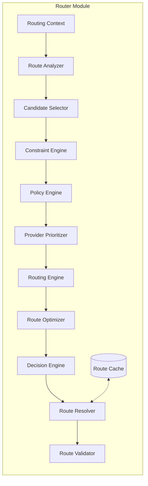

### 24.2 Routing Architecture Diagram

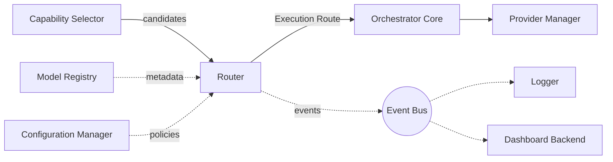

### 24.3 Routing Lifecycle Diagram

*(See Section 6.2 for the full lifecycle flowchart.)*

### 24.4 Route Resolution Diagram

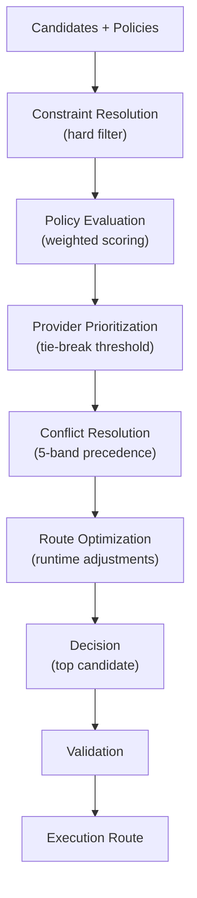

### 24.5 Sequence Diagram — Full Request-to-Route Flow

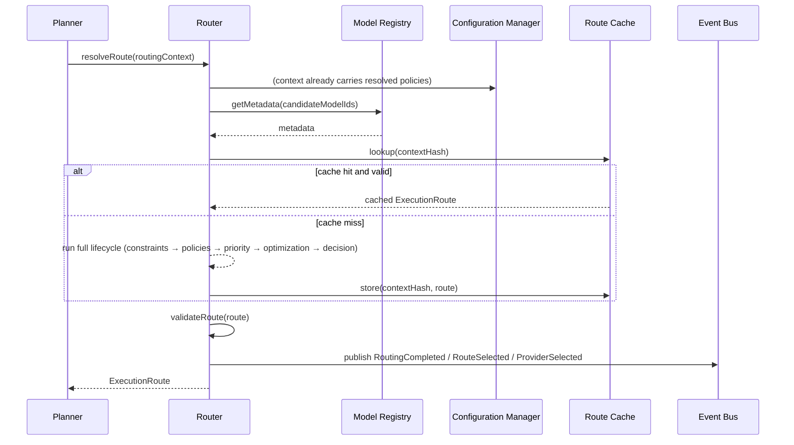

### 24.6 Folder Structure Diagram

*(See Section 19 for the full annotated folder tree.)*

---

## 25. Governance and Operational Standards

This section extends the Router architecture with the governance, control, and operational expectations needed for enterprise-grade rollout and long-term maintainability. These additions do not change the core routing architecture; they define how the Router is governed, observed, operated, and evolved safely.

### 25.1 Architectural Constraints

The Router must remain a pure decision engine and must not absorb execution responsibilities. The following constraints are non-negotiable:

- The Router may evaluate candidates and produce an Execution Route, but it must not execute provider calls, manage retries, or perform fallback logic.
- Routing decisions must remain policy-driven and configuration-driven; no hard-coded provider/model selection logic is permitted.
- All custom routing policies must implement the standard policy interface and remain read-only with respect to provider execution state.
- The Router may consume runtime status and metadata, but it must not become the authoritative system of record for provider health, pricing, or usage history.

### 25.2 ADR References

| ADR | Topic | Relevance to Router |
|---|---|---|
| ADR-001 | Module ownership boundaries | Preserves the Router as a decision-only module between Capability Selector and Provider Manager |
| ADR-002 | Policy-driven architecture | Governs policy precedence, weighting, and explainability |
| ADR-003 | Event-driven observability | Defines how routing events are surfaced for telemetry and auditing |
| ADR-004 | Configuration governance | Governs routing policy versioning, ownership, and approval |
| ADR-005 | Security and audit boundaries | Defines how route decisions are protected and retained |

### 25.3 Routing Decision Versioning

Every routing decision must be versioned so that it can be reconstructed, audited, and compared over time.

- Each resolved route should carry a `routeVersion` and a `policySetVersion`.
- The route version must change whenever the routing algorithm, precedence model, optimization logic, or validation rules change materially.
- A routing decision must be immutable once emitted into the event stream or audit store.
- Regression tests must be updated whenever a route version changes.

### 25.4 Policy Version Governance

Routing policies must be governed like any other platform-critical configuration artifact.

- Every policy must have a stable `policyId`, version, owner, effective-from date, and effective-to date where applicable.
- Policy updates require approval from the owning team and must include a rollback plan.
- Critical business rules must be rolled out incrementally, preferably through staged enablement or canary evaluation.
- Policy changes must trigger Route Cache invalidation and must be accompanied by regression coverage.

### 25.5 Ownership Matrix

| Area | Primary Owner | Secondary Owner | Review Cadence |
|---|---|---|---|
| Routing logic and router internals | Router Team | Platform Architecture | Per release |
| Policy definitions and precedence | Platform Engineering | Business Operations | Weekly / per change |
| Security and compliance implications | Security & Compliance | Router Team | Per policy change |
| Telemetry, dashboards, and alerts | SRE / Observability | Router Team | Continuous |
| Custom policy extension review | Platform Engineering | Security & Compliance | Per plugin submission |

### 25.6 Route Identity Model

A route identity must be used for tracing, debugging, and audit correlation.

- A route ID should be derived from the request context, task context, policy set version, route version, and selected provider/model identity.
- The same logical request must not reuse a route ID if any routing-relevant input has changed.
- Route identity must be included in logs, events, and audit records to support full reconstruction of the decision.

### 25.7 Processing Guarantees

The Router must provide deterministic and explicit behavior under all normal and failure conditions.

- For a deterministic context and policy set, the Router must return the same winning candidate, subject to identical precedence and tie-break rules.
- The Router must either return a validated route or publish an explicit `RoutingFailed` outcome; it must never silently produce an invalid route.
- Validation is a mandatory final guard and must be treated as a correctness boundary, not merely a diagnostic step.
- The Router must never guess when candidate eligibility is unclear; it must fail explicitly.

### 25.8 Observability Standards

All routing decisions must be observable in a structured, machine-usable form.

Required fields for every decision include:

- `requestId`
- `taskId`
- `routeId`
- `policySetVersion`
- `routeVersion`
- `selectedProvider`
- `selectedModel`
- `decisionLatencyMs`
- `cacheHit`
- `decisionOutcome` (`completed` or `failed`)

The Router must emit structured events and logs for:

- route selection
- policy evaluation
- constraint rejection
- validation outcome
- cache hit/miss
- routing failure

### 25.9 SLO / SLA Targets

| Target | Recommended Baseline |
|---|---:|
| P95 decision latency for simple routing contexts | < 20 ms |
| P95 decision latency for complex routing contexts | < 100 ms |
| Route success rate for valid contexts | > 99.5% |
| Validation failure rate | < 0.1% |
| Cache hit rate for repeated contexts | > 40% |
| Policy evaluation error rate | < 0.01% |

### 25.10 Operational Limits

The Router must operate within documented limits to preserve stability and predictability.

- Maximum candidates per decision should be bounded by configuration and validated upstream.
- Maximum active policies per decision should remain configurable and should be capped to avoid runaway evaluation cost.
- Custom policies must be bounded by execution time and should fail closed if they exceed the configured budget.
- Route Cache TTL should remain short and explicitly bounded to avoid stale routing decisions.

### 25.11 Capacity Planning

Capacity planning for the Router should be based on expected routing volume, average candidate list size, and policy complexity.

- Capacity estimates should consider requests per second, average candidate count, and policy count per decision.
- The Router should be deployed as a stateless component with horizontal scaling for peak load.
- Cache and policy evaluation overhead should be included in capacity models, especially for high-volume interactive workloads.
- Load testing should include both typical and worst-case policy compositions.

### 25.12 Audit and Compliance Governance

Routing decisions must be suitable for audit and post-incident review.

- All final routing outcomes must be retained in the platform audit stream according to the retention policy.
- Audit evidence must include the policy version, route version, selected candidate, and rationale summary.
- Compliance-sensitive routing decisions must be reconstructable from event logs and configuration snapshots without requiring access to transient in-memory state.
- Policy changes affecting regulated workloads must be reviewed and approved before rollout.

### 25.13 Security Governance

The Router must enforce strong security boundaries around policy and decision handling.

- Routing policies must be loaded from trusted configuration sources only.
- The Router must never accept ad-hoc policy overrides from the request payload as a mechanism to alter routing behavior.
- Custom policies must be reviewed for safety, sandboxed where appropriate, and restricted from making network or external state changes.
- Sensitive data must never be included in routing logs or route metadata beyond what is required for decision explainability.

### 25.14 Extension Governance for Custom Routing Policies

Custom routing policies are an important extension mechanism, but they must be governed to preserve platform stability.

- Custom policies must conform to the standard policy contract and be registered through the supported extension mechanism.
- Each custom policy must declare its identity, version, owner, and whether it is critical.
- A custom policy must be tested for correctness, performance, and compatibility before promotion to production.
- Non-critical custom policies should degrade gracefully; critical policies should block routing if invalid or misconfigured.

### 25.15 Documentation and Change Management

The Router documentation must remain current and change-managed.

- The Router MDD, runbooks, policy definitions, and operational dashboards must be updated together whenever routing behavior changes.
- Every significant change must include an ADR reference, test impact summary, rollback plan, and release note.
- Breaking changes must trigger a version increment and must be reviewed by architecture and operations stakeholders before rollout.
- The documentation set should include troubleshooting guidance for cache misses, policy drift, validation failures, and routing regressions.

---

*End of Router Module Design Document.*
