# Task Queue Module Design Document (MDD)

**Module:** Task Queue
**Platform:** Hybrid AI Development Platform
**Document Type:** Module Design Document (MDD)
**Status:** Implementation-Ready
**Version:** 1.0
**Date:** July 2026

**Upstream source-of-truth documents:** PRD · Software Architecture & Design Document (SAD) · API Specification · Database Design Document · Orchestrator Core MDD · Event Bus MDD · Request Manager MDD · Provider Manager MDD · Provider Plugin System MDD · Model Registry MDD · Capability Selector MDD · Router MDD · Memory Manager MDD · Knowledge Base MDD · Knowledge Comparison Engine MDD · Planner MDD

---

## Table of Contents

1. Executive Summary
2. Goals
3. Responsibilities
4. Scope
5. Internal Architecture
6. Task Lifecycle
7. Task Model
8. Scheduling
9. Dependency Management
10. Dispatching
11. Retry & Recovery
12. Public Interfaces
13. Events
14. Error Handling
15. Logging
16. Monitoring
17. Security
18. Performance
19. Enterprise Scalability
20. Interaction With Other Modules
21. Folder Structure
22. Testing Strategy
23. Future Expansion
24. Risks
25. Design Decisions
26. Diagrams

---

## 1. Executive Summary

### 1.1 Purpose

The Task Queue is the workflow execution coordinator sitting between the Planner and the Router. The Planner decides *what* work needs to happen and in what order; the Task Queue owns making that work actually happen reliably — scheduling each task at the right time, respecting dependencies, dispatching ready tasks to the Router for a routing decision, tracking execution state, and handling queue-level failure, timeout, and recovery — without ever itself deciding *how* a task is routed or *executing* anything.

It exists so that workflow reliability (nothing is lost, nothing is dispatched before its dependencies are satisfied, failures are retried or escalated predictably, cancelled work stops promptly) is a property of the platform's task infrastructure, not something the Planner, Router, or Provider Manager each have to reimplement.

### 1.2 Responsibilities

At the highest level, the Task Queue:

- Accepts executable tasks produced by the Planner and owns their full lifecycle from Create through Completed/Archived or Failed/Dead-Letter.
- Schedules tasks according to priority, dependency state, and configured scheduling policy.
- Resolves task dependencies and manages workflow progression, including parallel execution and barrier synchronization.
- Dispatches ready tasks to the Router — and only to the Router — for a routing decision, then hands off to the Provider Manager's execution path once routed.
- Tracks execution state (queued, leased, dispatched, executing, completed, failed) for every task, and persists that state durably.
- Owns queue-level retry policy (distinct from provider-level execution retries), timeout detection, task cancellation, and the Dead Letter Queue.
- Manages concurrency via leasing/locking so a task is never double-dispatched.
- Publishes a complete lifecycle event stream for every task and workflow state transition.

### 1.3 Role

The Task Queue is a **workflow execution coordinator**, not an execution engine. It never runs AI models, never talks to a provider SDK, never makes a routing decision, and never generates a plan. Every task it manages arrives already fully formed from the Planner; every task it dispatches leaves through the Router, which decides where it actually runs. The Task Queue's entire responsibility is the reliable, ordered, observable *movement* of tasks through their lifecycle — not their content or their destination.

### 1.4 Architecture Position

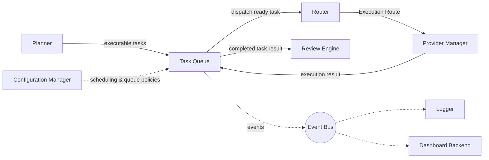

The Task Queue sits **between** the Planner and the Router in the execution pipeline, and receives execution results back from the Provider Manager (relayed through the Orchestrator Core / Provider Manager's standard result-handoff, per the Provider Manager MDD) to close the loop on each task's lifecycle. It has no direct relationship with Memory, Knowledge, or AI-provider modules — those are reached only by the modules that own them (Planner, Router, Provider Manager, Review Engine), never by the Task Queue itself.

---

## 2. Goals

### 2.1 Primary Goals

- Guarantee that every executable task produced by the Planner is durably tracked from creation to a terminal state (Completed, Archived, or Dead-Lettered), with no task silently lost.
- Guarantee that a task is dispatched only when all of its declared dependencies are satisfied, and never dispatched more than once concurrently (via leasing/locking).
- Support configurable, pluggable scheduling and retry policies without modifying core queue logic (Open/Closed Principle).
- Provide full workflow progression tracking — parallel branches, barrier synchronization, conditional continuation — as a first-class capability, not an emergent side effect of individual task tracking.
- Remain strictly execution-agnostic: dispatch only to the Router, never directly to a provider, and never make a routing or model-selection decision itself.

### 2.2 Secondary Goals

- Provide low-latency dispatch for ready tasks under normal load, and graceful backpressure under overload.
- Provide a Dead Letter Queue and both automatic and manual recovery paths for tasks that exhaust queue-level retries.
- Expose sufficient queue and workflow telemetry for operators to understand throughput, latency, and failure patterns in aggregate.

### 2.3 Future Goals

- Support distributed, sharded queue clusters spanning multiple regions with active-active dispatch.
- Support pluggable, AI-assisted scheduling strategies registered the same way as any other scheduling policy.
- Support cross-cluster dispatch and edge/serverless worker topologies.

### 2.4 Non-Goals

- The Task Queue does **not** execute AI models or communicate with any provider SDK — that is the Provider Manager's responsibility.
- The Task Queue does **not** make routing decisions — that is the Router's responsibility; the Task Queue only dispatches to it.
- The Task Queue does **not** generate execution plans or decompose goals into tasks — that is the Planner's responsibility.
- The Task Queue does **not** manage memory, knowledge storage, or knowledge comparison.
- The Task Queue does **not** validate or normalize execution results, and does **not** implement provider-level retry logic (e.g. retrying a single failed API call to a provider) — both belong to the Provider Manager. The Task Queue's retries are queue-level: re-dispatching a task that failed, not re-attempting a specific provider call.
- The Task Queue does **not** perform capability analysis, model selection, prompt engineering, or browser automation.

---

## 3. Responsibilities

### 3.1 Must Have

| # | Responsibility |
|---|---|
| M1 | Accept executable tasks from the Planner and persist them durably before acknowledging receipt. |
| M2 | Track every task through the full lifecycle state machine (Section 6), never allowing an invalid state transition. |
| M3 | Resolve task dependencies (Section 9) and only mark a task Ready once all declared dependencies are satisfied. |
| M4 | Schedule and prioritize Ready tasks according to configured policy (Section 8). |
| M5 | Dispatch Ready/Leased tasks exclusively to the Router — never directly to a provider or the Provider Manager. |
| M6 | Prevent duplicate/concurrent dispatch of the same task via task leasing and locking (Section 10.1, Section 17.4). |
| M7 | Detect and act on task timeouts (lease expiration, execution timeout) per configured policy. |
| M8 | Apply queue-level retry policy on task failure, up to a configured limit, then route to the Dead Letter Queue. |
| M9 | Support explicit task cancellation, propagating cancellation to dependent tasks and workflow state as configured. |
| M10 | Track workflow-level progression (a workflow being the set of tasks produced by one Planner invocation) and publish `WorkflowCompleted`/`WorkflowFailed` accordingly. |
| M11 | Publish a complete lifecycle event stream for every task and workflow state transition. |
| M12 | Support registration of new scheduling, retry, and queue policies via configuration without modifying core module code. |

### 3.2 Should Have

| # | Responsibility |
|---|---|
| S1 | Support batch and parallel dispatch to maximize throughput under normal load. |
| S2 | Provide backpressure signaling to the Planner/Orchestrator Core when queue depth or dispatch capacity is constrained. |
| S3 | Support both automatic recovery (e.g. re-leasing an orphaned task after a worker crash) and manual recovery (operator-triggered) for Dead-Lettered tasks. |
| S4 | Detect poison tasks (tasks that repeatedly fail in a way that suggests the task itself, not transient conditions, is at fault) and short-circuit further automatic retries for them. |

### 3.3 Future Responsibilities

| # | Responsibility |
|---|---|
| F1 | Support distributed scheduling and leader election across a sharded, multi-node queue cluster. |
| F2 | Support cross-region queue replication and active-active dispatch. |
| F3 | Support pluggable AI-assisted scheduling strategies and workflow templates. |

---

## 4. Scope

### 4.1 Owns

Task Lifecycle · Task Scheduling · Task Prioritization · Task Dependencies · Workflow Progression · Task Dispatching (to the Router only) · Queue Management · Execution State Tracking · Queue-Level Retry Policies · Task Timeouts · Task Cancellation · Dead Letter Queue · Task Leasing · Task Locking · Concurrency Control · Task Persistence · Task Metadata · Task Queue Policies · Workflow State · Task Recovery.

### 4.2 Does Not Own

| Concern | Owning Module |
|---|---|
| AI execution | Provider Manager |
| Provider communication / SDKs | Provider Manager / Provider Plugin System |
| Routing decisions | Router |
| Capability analysis | Capability Selector |
| Planning / plan generation | Planner |
| Memory | Memory Manager |
| Knowledge storage | Knowledge Base |
| Knowledge comparison | Knowledge Comparison Engine |
| Business logic | Respective owning modules |
| Prompt engineering | Provider Manager / AI-facing modules |
| Browser automation | Browser Agent |
| Model selection | Capability Selector / Router |
| Execution result validation | Review Engine |
| Response normalization | Provider Manager |
| Provider-level retry logic | Provider Manager |

### 4.3 Collaborates With

- **Planner** — upstream; produces execution plans and the executable tasks the Task Queue manages. The Task Queue never generates or modifies plan structure, only executes the task graph it is given.
- **Router** — downstream; the Task Queue's only dispatch target. Receives an Execution Route back per the Router MDD's contract; the Task Queue does not interpret routing rationale, only the route outcome (success/failure).
- **Provider Manager** — executes dispatched tasks once routed; returns execution results to the Task Queue to close the lifecycle loop. The Task Queue never calls the Provider Manager directly — the Router's resolved route is handed to the Orchestrator Core's execution path per platform convention (see the Router MDD, Section 18.4).
- **Review Engine** — consumes completed task results for review; the Task Queue hands off a Completed task's result and does not participate in the review loop itself beyond tracking the task's terminal state.
- **Configuration Manager** — supplies scheduling policies, retry policies, and queue configuration.
- **Event Bus** — receives every queue and workflow lifecycle event.
- **Logger** — receives structured queue, dispatch, retry, workflow, and recovery logs.
- **Dashboard Backend** — reads queue metrics and workflow status for display.

---

## 5. Internal Architecture

The Task Queue is composed of the following internal components, each independently testable and wired via Dependency Injection, consistent with Clean/Hexagonal Architecture.

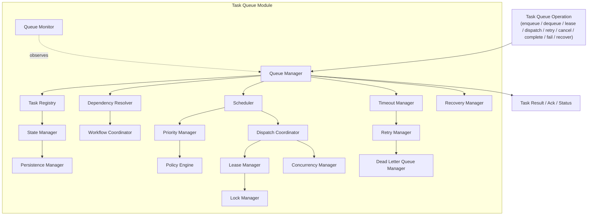

### 5.1 Queue Manager

**Purpose:** The single entry point and top-level conductor for every Task Queue public operation, analogous to the Memory Coordinator in the Memory Manager MDD and the Routing Engine in the Router MDD.

**Responsibilities:** Receive a normalized operation request, sequence the appropriate internal components, and assemble the final result/acknowledgment.

**Inputs:** Normalized `TaskQueueOperationRequest` (from a public interface call, Section 12).

**Outputs:** Operation result (task record, status, or structured error).

**Dependencies:** All other internal components listed below.

**Lifecycle:** Instantiated once per Task Queue instance (stateless across requests — see Section 19.1); invoked once per operation.

### 5.2 Task Registry

**Purpose:** The authoritative catalog of every task known to the Task Queue, indexed for fast lookup by task ID, workflow ID, queue, status, and namespace.

**Responsibilities:** Register newly enqueued tasks, serve lookups for dependency resolution and status queries, and maintain the parent/child task relationships (Section 7).

**Inputs:** New task records (on enqueue), lookup queries.

**Outputs:** Task records, lookup results.

**Dependencies:** Persistence Manager (durable backing store).

**Lifecycle:** Long-lived; entries persist for the task's full lifecycle plus the configured audit/archive retention window.

### 5.3 Workflow Coordinator

**Purpose:** Track workflow-level progression across the set of tasks belonging to a single Planner-produced plan.

**Responsibilities:** Maintain the workflow's aggregate state (in-progress, completed, failed), detect when all tasks in a workflow have reached a terminal state, evaluate barrier synchronization points (Section 9.5), and publish `WorkflowCompleted`/`WorkflowFailed`.

**Inputs:** Task state transition events (from the State Manager), the workflow's task graph (from the Dependency Resolver).

**Outputs:** Workflow status, `WorkflowCompleted`/`WorkflowFailed` events.

**Dependencies:** State Manager, Dependency Resolver.

**Lifecycle:** One active instance-scoped tracking context per in-progress workflow; retired once the workflow reaches a terminal state (state persists via the Persistence Manager, not in-process).

### 5.4 Scheduler

**Purpose:** Decide *when* a task becomes eligible for dispatch, applying scheduling mode (Section 8) and coordinating with the Priority Manager and Dependency Resolver.

**Responsibilities:** Transition a task from Waiting to Ready once its schedule condition (immediate, delayed, time-based, dependency-satisfied) is met, and hand Ready tasks to the Dispatch Coordinator in priority order.

**Inputs:** Task records in Waiting state, dependency-satisfaction signals, schedule-time triggers.

**Outputs:** Tasks transitioned to Ready, ordered dispatch candidates.

**Dependencies:** Priority Manager, Dependency Resolver, Policy Engine (scheduling policy).

**Lifecycle:** Continuously active (polling or event-driven per configuration) for as long as Waiting tasks exist.

### 5.5 Priority Manager

**Purpose:** Compute and apply task priority ordering among Ready tasks.

**Responsibilities:** Resolve a task's effective priority (explicit `priority` field, Section 7, adjusted by policy — e.g. fair scheduling or weighted scheduling, Section 8), and provide the ordering the Scheduler uses to select the next tasks for dispatch.

**Inputs:** Ready task set, priority/fairness/weighting policy.

**Outputs:** Priority-ordered task sequence.

**Dependencies:** Policy Engine.

**Lifecycle:** Invoked whenever the Scheduler needs an ordering decision (on each dispatch cycle).

### 5.6 Dependency Resolver

**Purpose:** Own the task dependency graph and determine when a task's dependencies are satisfied.

**Responsibilities:** Maintain the graph of task-to-task dependencies (Section 9.1) for each workflow, evaluate blocking/parallel/conditional relationships, and signal the Scheduler when a Waiting task becomes dependency-satisfied.

**Inputs:** Task graph (from the Planner, embedded in enqueued tasks' `dependencies` field), task completion/failure/cancellation events.

**Outputs:** Dependency-satisfaction signals, blocked-task status, dependency-failure propagation.

**Dependencies:** Task Registry (to resolve dependency task IDs to current status).

**Lifecycle:** Consulted on every task state transition that could unblock a dependent task (Completed, Failed, Cancelled).

### 5.7 Dispatch Coordinator

**Purpose:** Own the act of handing a Ready/Leased task to the Router (Section 10), the Task Queue's single external dispatch target.

**Responsibilities:** Request a lease from the Lease Manager for the next task(s) to dispatch, apply concurrency limits (via the Concurrency Manager) and dispatch validation, and invoke the Router's `resolveRoute()`-triggering handoff (the actual call pattern is owned by the Orchestrator Core's execution path per the Router MDD; the Dispatch Coordinator's responsibility ends at producing a validated `DispatchRequest`).

**Inputs:** Priority-ordered Ready tasks, concurrency/backpressure state.

**Outputs:** `DispatchRequest` handed to the Router path, `TaskDispatched` event.

**Dependencies:** Lease Manager, Concurrency Manager, Policy Engine (dispatch policy).

**Lifecycle:** Invoked on every dispatch cycle for each task selected by the Scheduler/Priority Manager.

### 5.8 Lease Manager

**Purpose:** Grant time-bounded, exclusive leases on tasks to prevent duplicate concurrent dispatch.

**Responsibilities:** Issue a lease (owner identity + expiry) when a task moves to Leased, renew leases for long-running dispatch/execution when supported, and release/expire leases appropriately.

**Inputs:** Lease requests (task ID, requesting instance identity).

**Outputs:** Lease grant (owner, expiry) or lease-denied result.

**Dependencies:** Lock Manager (underlying mutual-exclusion primitive), Persistence Manager (lease durability across instance restarts).

**Lifecycle:** A lease is created at Leased-state entry and released at Dispatched/Completed/Failed/Cancelled, or reclaimed by the Timeout Manager on expiration.

### 5.9 Lock Manager

**Purpose:** Provide the underlying distributed mutual-exclusion primitive the Lease Manager and Concurrency Manager build on.

**Responsibilities:** Acquire and release locks scoped to a task ID (or a broader scope, e.g. a queue partition, for coordination operations), safe for concurrent use across multiple Task Queue instances (Section 19.6).

**Inputs:** Lock acquisition/release requests.

**Outputs:** Lock acquired/denied, lock released.

**Dependencies:** A distributed locking backend (infrastructure adapter, Section 21).

**Lifecycle:** Locks are short-lived, scoped to the specific coordination operation (e.g. the lease-issuance step), never held for the duration of task execution itself.

### 5.10 Timeout Manager

**Purpose:** Detect and act on lease expiration and execution timeouts.

**Responsibilities:** Track the expiry of every active lease and every Executing task's configured `timeout` (Section 7), and trigger the appropriate recovery action (re-queue for retry, or escalate to failure handling) when a timeout fires.

**Inputs:** Active lease/execution records with expiry timestamps.

**Outputs:** `TaskTimedOut`-triggered transitions (surfaced through the standard failure/retry path — see Section 13), timeout-expiration signals to the Retry Manager.

**Dependencies:** Lease Manager, Retry Manager.

**Lifecycle:** Continuously active background process, independent of any single task's dispatch.

### 5.11 Retry Manager

**Purpose:** Own queue-level retry policy evaluation and re-scheduling of failed tasks — explicitly distinct from any provider-level retry the Provider Manager may perform on a single execution attempt.

**Responsibilities:** On task failure or timeout, consult the task's `retryPolicy` (Section 7) and the Policy Engine's active retry policy, decide whether to re-queue (with backoff) or route to the Dead Letter Queue, and increment `retryCount`.

**Inputs:** Failed/timed-out task record, retry policy.

**Outputs:** Re-queued task (Retry Scheduled state) or handoff to the Dead Letter Queue Manager.

**Dependencies:** Policy Engine, Dead Letter Queue Manager, Scheduler (for backoff-delayed re-scheduling).

**Lifecycle:** Invoked on every task failure/timeout event.

### 5.12 Dead Letter Queue Manager

**Purpose:** Own the Dead Letter Queue — the terminal holding area for tasks that have exhausted queue-level retries or been identified as poison tasks.

**Responsibilities:** Accept tasks routed from the Retry Manager, retain them with full failure history for inspection, and expose them to both automatic recovery policies (Section 11.6) and manual (operator-triggered) recovery (Section 12).

**Inputs:** Tasks exceeding retry limits or flagged as poison.

**Outputs:** `DeadLetterQueued` events, recovery-eligible task listings.

**Dependencies:** Persistence Manager.

**Lifecycle:** A task remains in the Dead Letter Queue until explicitly recovered or purged per retention policy.

### 5.13 State Manager

**Purpose:** The authoritative owner of the task lifecycle state machine (Section 6) — every state transition, for every task, is validated and recorded here.

**Responsibilities:** Validate that a requested transition is legal from the task's current state, apply the transition, and notify the Workflow Coordinator and Event Bus of the change.

**Inputs:** Transition requests from any other internal component (Scheduler, Dispatch Coordinator, Retry Manager, etc.).

**Outputs:** Updated task state, transition-rejected error for invalid transitions.

**Dependencies:** Persistence Manager, Task Registry.

**Lifecycle:** Consulted on every state-changing operation across the module.

### 5.14 Recovery Manager

**Purpose:** Own both automatic and manual recovery of tasks from the Dead Letter Queue or from an orphaned (lease-expired-without-completion) state.

**Responsibilities:** Detect orphaned tasks (e.g. a worker/instance crashed mid-execution without releasing its lease) and automatically re-queue them if within policy limits; expose `recoverTask()` for operator-triggered recovery of Dead-Lettered tasks.

**Inputs:** Orphaned-task detection signals (from the Timeout Manager), explicit `recoverTask()` calls.

**Outputs:** Recovered task (re-queued or reset to a recoverable state), `TaskRecovered` event.

**Dependencies:** Dead Letter Queue Manager, Timeout Manager, State Manager.

**Lifecycle:** Background process for automatic detection; on-demand for explicit calls.

### 5.15 Concurrency Manager

**Purpose:** Enforce configured concurrency limits (per queue, per namespace, per organization) on simultaneous dispatch/execution.

**Responsibilities:** Track current in-flight (Leased/Dispatched/Executing) task counts against configured limits, and signal backpressure (Section 10.7) to the Dispatch Coordinator when limits are reached.

**Inputs:** Current in-flight counts, configured concurrency limits.

**Outputs:** Dispatch-permit grant/deny, backpressure signal.

**Dependencies:** Policy Engine (limit configuration).

**Lifecycle:** Consulted on every dispatch attempt.

### 5.16 Persistence Manager

**Purpose:** The sole component with a durable-storage dependency — every other component reaches persistent state through it, never directly.

**Responsibilities:** Persist task records, lease records, and workflow state durably (Section 17.4 defense-in-depth, Section 19.1 statelessness of the Task Queue *process* itself), and serve reads for the Task Registry and State Manager.

**Inputs:** Task/lease/workflow records to persist; read queries.

**Outputs:** Persisted confirmation; read results.

**Dependencies:** A durable storage backend (infrastructure adapter, Section 21) — per the Database Design Document.

**Lifecycle:** Long-lived; the only component whose backing store outlives any single Task Queue process instance.

### 5.17 Policy Engine

**Purpose:** Evaluate scheduling, retry, dispatch, and concurrency policies (Sections 8, 10, 11) against a given task/operation.

**Responsibilities:** Resolve the effective policy (global default, layered by namespace/organization override, mirroring the layering approach used in the Router and Memory Manager MDDs) for a given task, and expose policy evaluation results to the Scheduler, Priority Manager, Dispatch Coordinator, Retry Manager, and Concurrency Manager.

**Inputs:** Task record, operation context, active policy set (from the Configuration Manager).

**Outputs:** Resolved policy values (e.g. effective priority weight, effective retry limit, effective concurrency limit).

**Dependencies:** Configuration Manager.

**Lifecycle:** Consulted by multiple other components on essentially every operation; itself stateless per evaluation.

### 5.18 Queue Monitor

**Purpose:** Observe queue and workflow health for monitoring (Section 16) without participating in the operational request path.

**Responsibilities:** Aggregate queue depth, throughput, dispatch rate, retry rate, and Dead Letter Queue size into the metrics exposed to the Dashboard Backend.

**Inputs:** Task/queue/workflow state (read-only, via the Task Registry and State Manager).

**Outputs:** Aggregated metrics (Section 16).

**Dependencies:** Task Registry, State Manager, Dead Letter Queue Manager.

**Lifecycle:** Continuously active background aggregation, fully decoupled from the operational request path (read-only, never blocks or influences dispatch decisions).

---

## 6. Task Lifecycle

### 6.1 Lifecycle States

```
Create → Queued → Waiting → Ready → Leased → Dispatched → Executing → Completed → Archived

Executing → Failed → Retry Scheduled → Ready (retry loop)
Failed → Dead Letter Queue → Manual Recovery → Ready
```

- **Create** — a task arrives from the Planner and is validated by the Queue Manager/Task Registry before entering the queue.
- **Queued** — the task is durably persisted and registered; not yet eligible for dispatch.
- **Waiting** — the task is queued but blocked on one or more unmet dependencies (Section 9) or a future schedule time (Section 8).
- **Ready** — all dependencies are satisfied and any schedule condition is met; eligible for the Scheduler's priority ordering.
- **Leased** — the Lease Manager has granted exclusive, time-bounded ownership of the task to a dispatch cycle, preventing duplicate dispatch.
- **Dispatched** — the task has been handed to the Router for a routing decision; the Task Queue awaits the routed execution outcome.
- **Executing** — the Provider Manager has begun executing the task against the routed provider (signaled back to the Task Queue per the Provider Manager MDD's result-handoff contract).
- **Completed** — execution succeeded; the result is handed to the Review Engine (if required) or considered final.
- **Archived** — a Completed task's record is moved to long-term/cold storage per retention policy, after which it is no longer part of active queue state (Section 17.4, 19.14).
- **Failed** — execution did not succeed (provider failure, timeout, or explicit failure signal).
- **Retry Scheduled** — the Retry Manager has determined the task is eligible for another attempt and has re-queued it with backoff, returning it to Ready once the backoff elapses.
- **Dead Letter Queue** — queue-level retries are exhausted (or the task was flagged as poison); held for recovery or purge.
- **Manual Recovery** — an operator (or an automatic recovery policy, Section 11.6) explicitly re-queues a Dead-Lettered task, returning it to Ready.

A task may also transition to **Cancelled** from any non-terminal state (Section 12.6), which is treated as a terminal state equivalent to Failed for workflow-progression purposes but distinct for reporting (Section 13).

### 6.2 Lifecycle Diagram

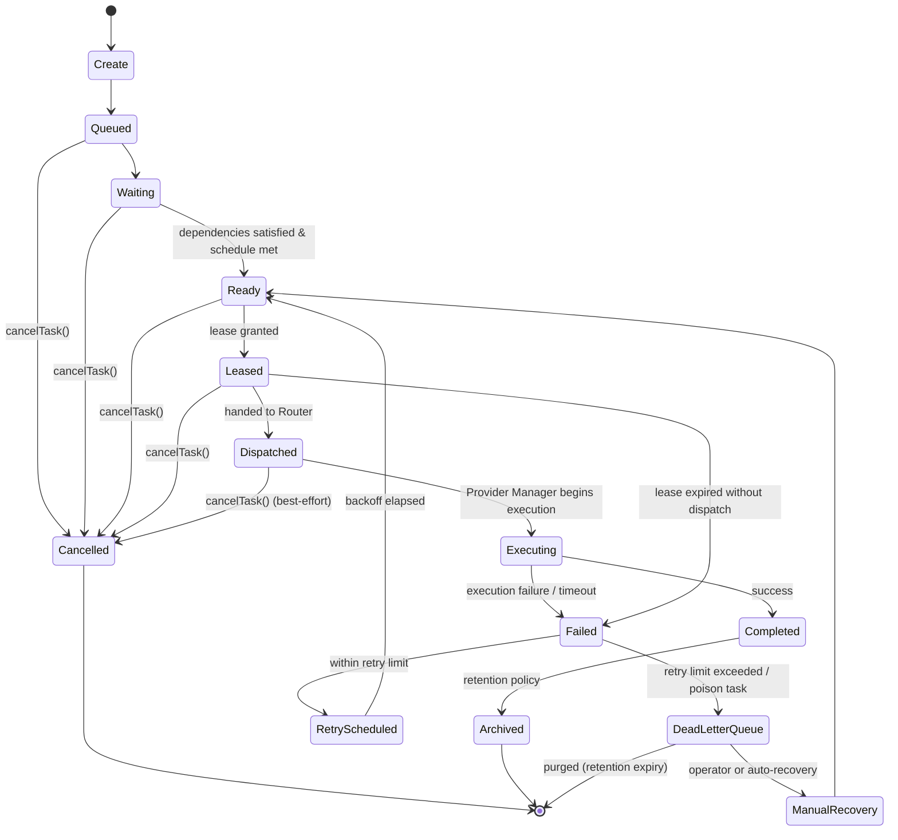

---

## 7. Task Model

| Field | Type | Explanation |
|---|---|---|
| `taskId` | UUID | Globally unique identifier for the task, assigned at Create and immutable thereafter. |
| `workflowId` | UUID | Identifies the workflow (the set of tasks produced by one Planner invocation) this task belongs to; used by the Workflow Coordinator for progression tracking. |
| `parentTask` | UUID (nullable) | The task that produced or logically contains this task, if the Planner's plan is hierarchical (e.g. a sub-task of a larger step). |
| `childTasks` | array\<UUID\> | Tasks that were spawned as children of this task, if any; maintained by the Task Registry as children are enqueued. |
| `dependencies` | array\<{ `taskId`, `type` }\> | Declares the tasks this task is blocked on, and the dependency type (`blocking`, `conditional` — Section 9) evaluated by the Dependency Resolver. |
| `priority` | integer | Caller/Planner-assigned base priority; adjusted by the Priority Manager per active fairness/weighting policy (Section 8) to produce the effective dispatch order. |
| `queue` | string | The named queue this task belongs to (Section 8, Section 19.4 partitioning); allows workload segregation (e.g. `interactive` vs. `batch`) with independent scheduling/concurrency policy per queue. |
| `leaseOwner` | string (nullable) | The identity of the Task Queue instance (or dispatch worker) currently holding the task's lease, set by the Lease Manager while Leased/Dispatched/Executing. |
| `assignedWorker` | string (nullable) | Identifies the downstream execution context handling this task once dispatched (populated from the Router/Provider Manager handoff, opaque to the Task Queue beyond tracking it). |
| `executionState` | enum (mirrors Section 6.1) | The task's current lifecycle state. |
| `retryCount` | integer | Number of queue-level retry attempts made so far; compared against the effective retry limit by the Retry Manager. |
| `retryPolicy` | string (policy reference) | A reference to the named retry policy (Section 11.2) governing this task's backoff/limit behavior; resolved, not embedded, so policy changes apply without rewriting queued tasks. |
| `timeout` | duration | The maximum time this task may remain Leased/Dispatched/Executing before the Timeout Manager acts on it. |
| `scheduleTime` | ISO-8601 datetime (nullable) | For delayed/time-based scheduling (Section 8.2/8.5); the earliest time the task may transition Waiting → Ready. |
| `createdTime` | ISO-8601 datetime | Set at Create; immutable. |
| `startedTime` | ISO-8601 datetime (nullable) | Set when the task first enters Executing. |
| `completedTime` | ISO-8601 datetime (nullable) | Set when the task reaches Completed or a terminal Failed/Cancelled/DeadLetterQueue state. |
| `failureReason` | string (nullable, structured) | Populated on Failed transitions with the failure category and detail supplied by the Router/Provider Manager handoff (the Task Queue records this but does not interpret or validate execution-result content, per Section 4.2). |
| `metadata` | map\<string, any\> | Structured, task-specific metadata supplied by the Planner (e.g. the underlying request context reference). |
| `tags` | array\<string\> | Free-form labels for filtering/search in monitoring and dashboard views. |
| `status` | enum | A caller-facing summary status (e.g. `pending`, `in-progress`, `completed`, `failed`) derived from `executionState`, provided for API ergonomics distinct from the internal lifecycle state name. |
| `version` | integer | Incremented on every persisted update; supports optimistic concurrency in the Persistence Manager. |
| `namespace` | string (hierarchical path) | The resolved tenancy path this task belongs to, mirroring the namespace model established in the Memory Manager MDD, used for multi-tenant isolation (Section 19.5). |
| `organization` | string | The owning organization/tenant identifier; the top level of `namespace`, surfaced as its own field for direct filtering/quota enforcement. |
| `project` | string (nullable) | The owning project identifier, if applicable. |
| `customMetadata` | map\<string, any\> | Open extension point for organization- or plugin-specific fields, consistent with the platform's Open/Closed extensibility approach. |

---

## 8. Scheduling

| Scheduling Mode | Explanation |
|---|---|
| **Immediate Scheduling** | A task with no dependencies and no `scheduleTime` transitions Waiting → Ready as soon as it is Queued. |
| **Delayed Scheduling** | A task with a future `scheduleTime` remains Waiting until that time elapses, regardless of dependency state. |
| **Priority Scheduling** | Among all Ready tasks, the Priority Manager orders dispatch candidates by effective `priority`. |
| **Dependency Scheduling** | A task with unmet `dependencies` remains Waiting until the Dependency Resolver signals satisfaction (Section 9). |
| **Time-Based Scheduling** | A generalization of Delayed Scheduling supporting recurring or cron-like schedule expressions for workflow templates (Section 23), evaluated by the Scheduler against the current time. |
| **Policy-Based Scheduling** | The Policy Engine may impose additional scheduling constraints (e.g. "no more than N tasks per minute for queue X"), layered on top of priority/dependency/time scheduling. |
| **Fair Scheduling** | A Priority Manager mode that prevents a single workflow/namespace from starving others by capping the proportion of dispatch slots any one source may consume per cycle. |
| **Weighted Scheduling** | A Priority Manager mode that assigns configurable weights per queue/namespace/organization, biasing dispatch order proportionally rather than strictly by raw `priority` value. |

Scheduling modes are not mutually exclusive — a task's actual transition to Ready and its position in dispatch order is the composite result of dependency satisfaction (gate), schedule time (gate), and priority/fairness/weighting (ordering), evaluated in that sequence by the Scheduler and Priority Manager.

---

## 9. Dependency Management

### 9.1 Task Graph

Each workflow's tasks form a directed graph, with edges defined by each task's `dependencies` field (Section 7). The Dependency Resolver maintains this graph per workflow, built incrementally as tasks are enqueued by the Planner.

### 9.2 Dependency Resolution

On every relevant task state transition (Completed, Failed, Cancelled), the Dependency Resolver re-evaluates all tasks that declared a dependency on the transitioned task, signaling the Scheduler for any that are now fully satisfied.

### 9.3 Blocking Tasks

A `blocking` dependency type means the dependent task cannot become Ready until the referenced task reaches Completed. If the referenced task instead reaches a terminal Failed/Cancelled/DeadLetterQueue state, the dependent task's fate is governed by Dependency Failure handling (Section 14).

### 9.4 Parallel Tasks

Tasks with no dependency relationship to one another (siblings in the graph) are eligible for concurrent Ready/dispatch, subject only to the Concurrency Manager's limits (Section 5.15) — the Task Queue does not artificially serialize independent tasks.

### 9.5 Barrier Synchronization

A task may declare a special `barrier` dependency type against a *set* of prior tasks (rather than a single task), which the Workflow Coordinator evaluates as satisfied only once every task in the set reaches a terminal state — used for "join" points in the workflow graph (e.g. "proceed only once all N implementation sub-tasks are done").

### 9.6 Conditional Tasks

A `conditional` dependency type is satisfied based on the *outcome* of the referenced task (e.g. only proceed if the referenced task Completed successfully, or specifically only if it Failed, for compensating/fallback tasks) rather than purely on the referenced task reaching a terminal state — the condition predicate itself is supplied by the Planner as part of the task's `metadata` and evaluated by the Dependency Resolver without the Task Queue interpreting its business meaning.

### 9.7 Workflow Continuation

Once every task in a workflow has reached a terminal state, the Workflow Coordinator determines overall workflow outcome (`WorkflowCompleted` if all required tasks Completed per the workflow's declared success criteria, `WorkflowFailed` otherwise) and publishes the corresponding event (Section 13).

---

## 10. Dispatching

### 10.1 Task Leasing

Before a Ready task is dispatched, the Dispatch Coordinator requests a lease from the Lease Manager (Section 5.8), guaranteeing that no other Task Queue instance can concurrently dispatch the same task — the foundational concurrency-safety mechanism for a horizontally scaled deployment (Section 19.1).

### 10.2 Worker Assignment

"Worker" in this module's context refers to the downstream execution context (ultimately, a Provider Manager execution slot) the task is handed to once routed — the Task Queue does not itself own or manage a worker pool; `assignedWorker` (Section 7) is populated from the handoff response for tracking purposes only.

### 10.3 Dispatch Policies

The Policy Engine may impose dispatch-time constraints (e.g. "queue X may not exceed Y concurrent dispatches", "tasks tagged `compliance-sensitive` require synchronous dispatch confirmation") evaluated by the Dispatch Coordinator immediately before handoff.

### 10.4 Concurrency Limits

Enforced by the Concurrency Manager (Section 5.15) at the queue, namespace, and organization level simultaneously; a dispatch is denied if any applicable limit is currently exhausted, and the task remains Ready for the next dispatch cycle.

### 10.5 Backpressure

When the Concurrency Manager or downstream signals (e.g. the Router/Provider Manager reporting saturation) indicate the platform cannot absorb further dispatch, the Dispatch Coordinator reduces its dispatch rate and the Task Queue publishes backpressure status (consumed by the Planner/Orchestrator Core to slow task production if sustained — Section 3.2, S2).

### 10.6 Queue Draining

An operational mode (triggered for maintenance or scale-down, Section 19.5) in which the Dispatch Coordinator stops accepting new dispatch cycles for a given queue/instance while allowing already-Dispatched/Executing tasks to complete normally.

### 10.7 Load Distribution

Across multiple Task Queue instances (Section 19.1), dispatch load is distributed naturally by each instance independently leasing and dispatching from the shared persisted queue state — no central dispatcher or single point of coordination is required beyond the Lock/Lease Manager's distributed primitives.

### 10.8 Dispatch Validation

Immediately before handoff, the Dispatch Coordinator validates that the task is still in a dispatchable state (its lease is still valid, it has not been concurrently cancelled) — a final consistency check mirroring the Router MDD's Route Validator pattern.

**The Task Queue dispatches tasks to the Router only.** No internal component holds a reference to any provider SDK, execution client, or the Provider Manager's internals; the dispatch boundary is a hard architectural constraint, not merely a convention.

---

## 11. Retry & Recovery

### 11.1 Queue-Level Retries

When a Dispatched/Executing task reaches Failed (whether from an execution failure signaled back through the Router/Provider Manager handoff, or from a Timeout Manager-detected expiration), the Retry Manager evaluates whether to re-attempt the task **at the queue level** — i.e., re-dispatch the same task through the full Ready → Leased → Dispatched cycle again. This is categorically distinct from any retry the Provider Manager performs *within* a single execution attempt (e.g. retrying one API call to a flaky provider) — the Task Queue has no visibility into and no responsibility for that inner retry behavior.

### 11.2 Retry Policies

Named policies (referenced by `retryPolicy`, Section 7) define the maximum retry count, backoff strategy, and whether a given failure category is retryable at all (e.g. a validation-type failure may be marked non-retryable, routing directly to the Dead Letter Queue).

### 11.3 Exponential Backoff

The default built-in backoff strategy: each successive retry's re-scheduled `scheduleTime` is delayed by an exponentially increasing interval (with configurable base, multiplier, and cap), reducing load on a struggling downstream system rather than immediately re-dispatching.

### 11.4 Retry Limits

The effective retry limit is resolved by the Policy Engine (global default, layered by namespace/organization/queue override); once `retryCount` reaches the effective limit, the Retry Manager hands the task to the Dead Letter Queue Manager instead of re-scheduling.

### 11.5 Dead Letter Queue

See Section 5.12. Tasks here are neither actively retried nor discarded — they are held, with full failure history, pending recovery or retention-policy purge (Section 19.14).

### 11.6 Manual Recovery

An operator (via the Dashboard Backend, or directly via `recoverTask()`, Section 12) explicitly re-queues a Dead-Lettered task, typically after addressing the underlying cause (e.g. a policy or configuration fix); this resets `retryCount` per policy-configurable rules (full reset vs. continued count) and returns the task to Ready.

### 11.7 Automatic Recovery

The Recovery Manager's background process (Section 5.14) automatically re-queues *orphaned* tasks — tasks whose lease expired without a corresponding terminal transition, typically indicating an instance/worker crash rather than a task-level failure — distinct from Manual Recovery, which addresses Dead-Lettered tasks. Automatic recovery of orphaned tasks does not consult the Dead Letter Queue at all; it is a lease-expiration correction, not a retry-exhaustion outcome.

### 11.8 Poison Task Detection

The Retry Manager tracks failure *pattern*, not just count: a task that fails identically across multiple retries with no variation attributable to transient conditions (e.g. the same structured `failureReason` category every time) is flagged as a poison task and routed to the Dead Letter Queue immediately, bypassing remaining retry budget, to avoid wasting dispatch cycles on a task that is deterministically going to fail again.

**Clarification:** Provider execution retries (a single provider call failing and being retried against the same or a fallback provider within one execution attempt) belong exclusively to the Provider Manager. The Task Queue's retry machinery operates one level up — deciding whether to re-run the *task* from Ready again — and never inspects or influences the Provider Manager's internal retry behavior for a given attempt.

---

## 12. Public Interfaces

### 12.1 `enqueueTask(task)`

- **Purpose:** Accept a new executable task from the Planner and begin its lifecycle.
- **Inputs:** A `Task` object (Section 7) with all required fields populated by the Planner.
- **Outputs:** The persisted `Task` including assigned `taskId` and initial `executionState: Queued`.
- **Validation:** Full Task Model validation, dependency-reference existence check (referenced `dependencies` must resolve to known tasks or be explicitly marked external/pending), namespace authorization.
- **Errors:** `TaskValidationError`, `DuplicateTaskError` (if an idempotency key match is detected — Section 14.4), `NamespaceAccessDeniedError`.

### 12.2 `dequeueTask(queue, filter)`

- **Purpose:** Retrieve the next dispatchable task(s) from a given queue without leasing them — primarily used internally by the Scheduler/Dispatch Coordinator, exposed publicly for diagnostic/administrative use.
- **Inputs:** `queue` name, optional `filter` (namespace, tags, priority range).
- **Outputs:** Ordered candidate `Task[]` (Ready state, not yet leased).
- **Validation:** Queue existence, authorization.
- **Errors:** `QueueNotFoundError`, `AccessDeniedError`.

### 12.3 `leaseTask(taskId, leaseOwner, duration)`

- **Purpose:** Acquire an exclusive lease on a specific task ahead of dispatch.
- **Inputs:** `taskId`, `leaseOwner` identity, requested lease `duration`.
- **Outputs:** Lease grant (owner, expiry) or denial.
- **Validation:** Task must be in Ready state; no existing valid lease held by another owner.
- **Errors:** `TaskNotFoundError`, `TaskNotReadyError`, `LeaseConflictError`.

### 12.4 `dispatchTask(taskId)`

- **Purpose:** Hand a Leased task to the Router, transitioning it to Dispatched.
- **Inputs:** `taskId` (must hold a valid lease for the calling context).
- **Outputs:** Dispatch confirmation, `TaskDispatched` event.
- **Validation:** Lease validity (Section 10.8 dispatch validation), concurrency limit check (Section 5.15).
- **Errors:** `LeaseExpiredError`, `ConcurrencyLimitExceededError`, `TaskNotLeasedError`.

### 12.5 `retryTask(taskId, reason)`

- **Purpose:** Explicitly trigger the queue-level retry path for a task (in addition to automatic invocation by the Retry Manager on failure).
- **Inputs:** `taskId`, `reason` (structured failure context, or `"manual"` for operator-triggered retry).
- **Outputs:** Updated task (`Retry Scheduled` or `Dead Letter Queue`, per policy evaluation), `TaskRetried` event.
- **Validation:** Task must be in Failed state (or an operator override flag for manual retry of a non-Failed task, gated by elevated authorization).
- **Errors:** `TaskNotFoundError`, `InvalidStateTransitionError`, `RetryLimitExceededError` (surfaces as informational — the task is routed to DLQ, not rejected outright).

### 12.6 `cancelTask(taskId, reason)`

- **Purpose:** Terminate a task before it reaches a terminal state, propagating cancellation to dependents per workflow policy.
- **Inputs:** `taskId`, `reason`.
- **Outputs:** Updated task (`Cancelled`), `TaskCancelled` event; dependent tasks blocked solely on this task are also evaluated for cascade cancellation per the workflow's configured cancellation propagation policy.
- **Validation:** Task must be in a non-terminal state; authorization to cancel (namespace/ownership check).
- **Errors:** `TaskNotFoundError`, `TaskAlreadyTerminalError`, `AccessDeniedError`.

### 12.7 `completeTask(taskId, result)`

- **Purpose:** Record successful execution completion, invoked by the execution-result handoff path (originating from the Provider Manager, relayed per platform convention — Section 4.3).
- **Inputs:** `taskId`, `result` reference (an opaque pointer/summary, not the full execution payload — the Task Queue does not store or interpret execution content, per Section 4.2).
- **Outputs:** Updated task (`Completed`), `TaskCompleted` event, dependency-resolution trigger for dependents.
- **Validation:** Task must be in Executing state; lease ownership check.
- **Errors:** `TaskNotFoundError`, `InvalidStateTransitionError`, `LeaseOwnershipMismatchError`.

### 12.8 `failTask(taskId, failureReason)`

- **Purpose:** Record execution failure, invoked by the execution-result handoff path.
- **Inputs:** `taskId`, structured `failureReason`.
- **Outputs:** Updated task (`Failed`), `TaskFailed` event, handoff to the Retry Manager for policy evaluation.
- **Validation:** Task must be in Executing/Dispatched state; lease ownership check.
- **Errors:** `TaskNotFoundError`, `InvalidStateTransitionError`, `LeaseOwnershipMismatchError`.

### 12.9 `recoverTask(taskId)`

- **Purpose:** Manually recover a Dead-Lettered task (Section 11.6), or administratively force-recover an orphaned task ahead of the Recovery Manager's automatic detection cycle.
- **Inputs:** `taskId`.
- **Outputs:** Updated task (`Ready`), `TaskRecovered` event.
- **Validation:** Task must be in `DeadLetterQueue` state (or orphaned-Leased state for the administrative override path); authorization (elevated, operator-level).
- **Errors:** `TaskNotFoundError`, `TaskNotRecoverableError`, `AccessDeniedError`.

### 12.10 `getTaskStatus(taskId)`

- **Purpose:** Read-only status query.
- **Inputs:** `taskId`.
- **Outputs:** Current `Task` record (or a projected summary view).
- **Validation:** Authorization (namespace-scoped read access).
- **Errors:** `TaskNotFoundError`, `AccessDeniedError`.

---

## 13. Events

| Event | Publisher | Subscribers | Payload | Trigger | Retry Behaviour |
|---|---|---|---|---|---|
| `TaskQueued` | Queue Manager / Task Registry | Logger, Dashboard Backend, Workflow Coordinator | `{ taskId, workflowId, queue, priority }` | Fired on successful `enqueueTask()` completion. | Not retried. |
| `TaskLeased` | Lease Manager | Logger, Dashboard Backend | `{ taskId, leaseOwner, expiry }` | Fired when a lease is granted. | Not retried. |
| `TaskDispatched` | Dispatch Coordinator | Logger, Dashboard Backend, Router (handoff trigger) | `{ taskId, workflowId, dispatchedAt }` | Fired when a task is handed to the Router. | Not retried by the Task Queue; dispatch-handoff failure is handled per Section 14. |
| `TaskStarted` | State Manager (on Executing transition, driven by execution-result handoff signal) | Logger, Dashboard Backend, Workflow Coordinator | `{ taskId, startedTime, assignedWorker }` | Fired when the Provider Manager signals execution has begun. | Not retried. |
| `TaskCompleted` | State Manager (via `completeTask()`) | Logger, Dashboard Backend, Workflow Coordinator, Review Engine, Dependency Resolver | `{ taskId, workflowId, completedTime, resultRef }` | Fired on successful `completeTask()`. | Not retried. |
| `TaskFailed` | State Manager (via `failTask()`) | Logger, Dashboard Backend, Workflow Coordinator, Retry Manager | `{ taskId, workflowId, failureReason, retryCount }` | Fired on `failTask()` or Timeout Manager-detected timeout. | Not retried. |
| `TaskRetried` | Retry Manager | Logger, Dashboard Backend, Workflow Coordinator | `{ taskId, retryCount, backoffUntil }` | Fired when a Failed task is re-scheduled rather than dead-lettered. | Not retried. |
| `TaskCancelled` | State Manager (via `cancelTask()`) | Logger, Dashboard Backend, Workflow Coordinator, Dependency Resolver | `{ taskId, workflowId, reason }` | Fired on successful `cancelTask()`. | Not retried. |
| `WorkflowCompleted` | Workflow Coordinator | Logger, Dashboard Backend, Planner (closure signal), Orchestrator Core | `{ workflowId, taskCount, duration }` | Fired when all tasks in a workflow reach a success-consistent terminal state per the workflow's success criteria. | Not retried. |
| `WorkflowFailed` | Workflow Coordinator | Logger, Dashboard Backend, Planner, Orchestrator Core | `{ workflowId, failedTaskIds, reason }` | Fired when a workflow's terminal state does not satisfy its success criteria. | Not retried. |
| `TaskRecovered` | Recovery Manager | Logger, Dashboard Backend, Workflow Coordinator | `{ taskId, recoveryType: "automatic"|"manual", previousState }` | Fired on successful `recoverTask()` or automatic orphan recovery. | Not retried. |
| `DeadLetterQueued` | Dead Letter Queue Manager | Logger, Dashboard Backend, Alerting | `{ taskId, workflowId, retryCount, lastFailureReason }` | Fired when a task's retries are exhausted or it is flagged poison. | Not retried. |

---

## 14. Error Handling

| Failure Condition | Detection Point | Recovery Strategy |
|---|---|---|
| **Queue Overflow** | Queue Manager (on `enqueueTask()`, against configured max-depth policy) | Reject the enqueue with `QueueOverflowError` and surface backpressure (Section 10.5) to the Planner/Orchestrator Core rather than silently accepting unbounded growth. |
| **Lease Expiration** | Timeout Manager | If the task never reached Dispatched, it is treated as an orphan and handled by automatic recovery (Section 11.7); if it reached Executing and then the lease expired without a completion/failure signal, it is treated as a timeout failure and handed to the Retry Manager. |
| **Worker Failure** | Timeout Manager (absence of expected completion/failure signal within `timeout`) | Same handling as Lease Expiration during Executing — treated as a timeout-triggered Failed transition, entering the standard Retry Manager evaluation. |
| **Timeout** | Timeout Manager | As above; the specific `failureReason` category is set to `timeout` so the Retry Manager and Poison Task Detection can distinguish it from execution-content failures. |
| **Duplicate Task** | Task Registry (on `enqueueTask()`, via idempotency-key check if the Planner supplies one) | Reject with `DuplicateTaskError` and return the existing task's ID rather than creating a second record, keeping enqueue idempotent under Planner retry. |
| **Poison Task** | Retry Manager (pattern detection, Section 11.8) | Route directly to the Dead Letter Queue, bypassing remaining retry budget. |
| **Deadlock** | Dependency Resolver (cycle detection at workflow-graph construction time) | A dependency cycle is rejected at `enqueueTask()` time for the task that would complete the cycle, with `DependencyCycleError` — the Task Queue never allows a cyclic graph to be persisted, preventing runtime deadlock entirely rather than detecting it after the fact. |
| **Dependency Failure** | Dependency Resolver (on a referenced task reaching Failed/Cancelled/DeadLetterQueue) | Governed by the dependency's declared behavior: a `blocking` dependency on a task that terminally failed propagates failure to the dependent (dependent transitions directly to Failed with `failureReason: "dependency-failed"`), unless a `conditional` dependency explicitly permits proceeding on failure (Section 9.6). |
| **Persistence Failure** | Persistence Manager | Any operation requiring a durable write fails closed — the operation is rejected with `PersistenceUnavailableError` rather than proceeding with an unpersisted (and therefore unsafe-to-lease) task state; this is the one failure mode the Task Queue cannot gracefully degrade around, since durability is the module's core guarantee. |

**General Recovery Principle:** The Task Queue fails fast and explicitly for anything that would compromise durability or dependency correctness (queue overflow, persistence failure, dependency cycles), and applies its own retry/recovery machinery uniformly for anything downstream of dispatch (timeouts, worker failures, execution failures) — treating "the task didn't complete" the same way regardless of the specific downstream cause, since the Task Queue has no visibility into *why* the Router/Provider Manager path failed beyond the structured `failureReason` it's handed.

---

## 15. Logging

| Log Category | Content | Level |
|---|---|---|
| **Queue Logs** | Enqueue/dequeue operations, queue depth at time of operation, queue name. | INFO |
| **Dispatch Logs** | Lease grants, dispatch handoffs, concurrency/backpressure decisions. | INFO |
| **Retry Logs** | Retry evaluations, backoff computed, retry-vs-DLQ decisions, poison detection triggers. | INFO |
| **Workflow Logs** | Workflow progression milestones, barrier synchronization evaluations, `WorkflowCompleted`/`WorkflowFailed` outcomes. | INFO |
| **Recovery Logs** | Automatic orphan recovery events, manual recovery invocations, DLQ entry/exit. | INFO / WARN on DLQ entry |
| **Audit Logs** | Immutable record of every state-changing operation (enqueue, dispatch, complete, fail, cancel, recover) with full correlation and identity detail. | AUDIT (separate, non-rotating stream) |

All logs correlate by `taskId` and `workflowId`, and inherit the originating `requestId` where available (propagated from the Planner via task `metadata`), emitted through the shared Logger interface.

---

## 16. Monitoring

| Metric | Description |
|---|---|
| **Queue Depth** | Current count of tasks per state (Queued, Waiting, Ready, Leased, Dispatched, Executing) per queue. |
| **Task Throughput** | Tasks completed per unit time, per queue/namespace. |
| **Dispatch Rate** | Tasks dispatched per unit time, versus configured concurrency limits, to surface headroom/saturation. |
| **Worker Utilization** | Proportion of concurrency-limit capacity currently in use (Leased/Dispatched/Executing vs. configured limit). |
| **Retry Rate** | Proportion of tasks requiring at least one retry, and average retries per task. |
| **Dead Letter Queue Size** | Current count of Dead-Lettered tasks, alertable above a configured threshold. |
| **Workflow Duration** | End-to-end latency from a workflow's first task Queued to `WorkflowCompleted`/`WorkflowFailed`. |
| **Queue Latency** | Time spent in Waiting/Ready before dispatch (scheduling latency), distinct from execution duration (which the Task Queue does not own measuring beyond Dispatched → Completed/Failed timestamps). |

---

## 17. Security

| Concern | Design |
|---|---|
| **Queue Isolation** | Each `queue` (Section 7) is a distinct scheduling/concurrency domain; cross-queue interference is prevented by the Concurrency Manager evaluating limits per-queue, not globally. |
| **Task Isolation** | Enforced via the `namespace`/`organization`/`project` fields, mirroring the Memory Manager's namespace model; every operation resolves and validates namespace before touching task state. |
| **Access Control** | Public interface calls (Section 12) are authorized against the caller's identity and the resolved namespace; elevated operations (`recoverTask()`, manual retry override) require operator-level authorization. |
| **Lease Integrity** | Leases are owner-scoped and time-bounded (Section 5.8); a lease can only be released or renewed by its holder, and the Lock Manager's distributed primitive prevents any two instances from believing they simultaneously hold the same lease. |
| **Workflow Integrity** | The Dependency Resolver's cycle-rejection at enqueue time (Section 14) and the State Manager's strict transition validation (Section 5.13) together guarantee a workflow's task graph and each task's state history are always internally consistent. |
| **Auditability** | Every state-changing operation is captured in the Audit Log stream (Section 15) and the corresponding lifecycle event payloads (Section 13), sufficient to reconstruct the full history of any task or workflow. |

---

## 18. Performance

| Technique | Design |
|---|---|
| **Batch Dispatch** | The Dispatch Coordinator supports dispatching a batch of leased tasks in a single handoff cycle where the Router/Provider Manager path supports batched intake, reducing per-task coordination overhead. |
| **Parallel Dispatch** | Independent Ready tasks (no shared dependency/queue-limit contention) are leased and dispatched concurrently, bounded by the Concurrency Manager. |
| **Queue Partitioning** | Queues can be partitioned (Section 19.4) to allow independent Scheduler/Dispatch Coordinator cycles to operate without contending on a single global ordering structure. |
| **Lazy Loading** | Retry/scheduling policy definitions are loaded lazily per policy ID on first use, mirroring the approach established in the Router and Memory Manager MDDs. |
| **Task Persistence Optimization** | The Persistence Manager batches/pipelines writes where the durability guarantee permits (e.g. non-critical metadata updates), while state-transition writes remain synchronous and immediately durable. |
| **Distributed Locking** | The Lock Manager's primitive is scoped as narrowly as possible (single task ID for lease issuance) and held for the shortest possible duration, to minimize contention under high dispatch throughput (Section 19.6). |
| **Memory Optimization** | In-process working state (the Scheduler's current candidate set, the Dependency Resolver's active graph slice) is bounded and evictable; the Task Queue process itself holds no unbounded in-memory structure — durable state always lives in the Persistence Manager's backing store. |
| **Queue Compaction** | Archived/terminal task records are periodically compacted out of the hot query path (moved to cold storage per retention policy, Section 19.14) so active-queue queries remain fast regardless of historical volume. |

---

## 19. Enterprise Scalability

### 19.1 Horizontal Scaling

The Task Queue is designed as a **completely stateless service process**, mirroring the architectural pattern established in the Memory Manager MDD. All durable state — task records, lease state, workflow progression — lives in the Persistence Manager's backing store and the distributed locking backend, never in any single instance's process memory beyond the lifetime of one operation.

- **Multiple Task Queue instances** run concurrently behind a load balancer (for the public interface surface) and independently poll/dispatch from the shared persisted queue state.
- **Load balancing / auto scaling / elastic scaling** are pure infrastructure concerns, since no instance holds request-affine or task-affine state.
- **Distributed coordination** is limited to the Lock Manager's distributed primitive (Section 5.9) and the shared Persistence Manager backend — both external, independently scalable services.
- **Zero sticky sessions** — any instance can service any task's lease, dispatch, or status operations.

New instances join by connecting to the shared Persistence Manager backend and Lock Manager backend and beginning normal Scheduler/Dispatch Coordinator cycles immediately — no handoff from existing instances is required. Instances are removed via queue draining (Section 10.6): stop leasing new tasks, allow in-flight (Leased/Dispatched/Executing) tasks to either complete or have their leases expire naturally for pickup by a remaining instance.

### 19.2 Vertical Scaling

- **CPU optimization** — Dependency Resolver graph evaluation and Priority Manager ordering scale with available cores for parallel evaluation across queues/workflows.
- **Memory optimization** — bounded working-set design (Section 18) means larger instances primarily benefit concurrent dispatch-cycle throughput, not any per-task memory requirement.
- **Thread management** — dispatch and background (Timeout Manager, Recovery Manager, Queue Monitor) processes run on a bounded concurrent execution pool sized to available cores.
- **Resource utilization / high-performance servers** — configuration-driven limits (via the Configuration Manager) rather than hard-coded, so the same binary scales from modest to high-performance deployments.

### 19.3 Multi-Tenancy

Tenant isolation is modeled through the `namespace`/`organization`/`project` fields (Section 7), mirroring the Memory Manager MDD's hierarchy, and enforced identically:

- **Organizations, Workspaces, Teams, Projects, Users, Sessions, Namespaces** — each a level or attribute within the resolved namespace path.
- **Tenant isolation / access boundaries** — every operation resolves and validates namespace before any state-changing action, consistent with Section 17.
- **Metadata isolation** — the Task Registry's index is namespace-partitioned, keeping per-tenant queries bounded and isolated.
- **Policy isolation** — the Policy Engine's layered override model (global → organization → namespace → queue) allows each tenant's effective scheduling/retry/concurrency policy to differ independently.
- **Storage isolation** — queue partitioning (Section 19.4) can be configured to physically segregate tenants at the persistence layer where required, without any change to core dispatch logic.

### 19.4 Distributed Deployment

- **Multi-node clusters** — a direct consequence of statelessness (19.1).
- **Multi-region / multi-cloud / hybrid cloud deployments** — supported by deploying independent Task Queue instance groups per region, each pointed at region-appropriate persistence/locking backends, with cross-region concerns (19.13) handled as an explicit extension rather than assumed by default.
- **Edge deployments** — a lightweight instance group can serve latency-sensitive queues locally, synchronizing to the primary deployment per the same federation approach used for cross-region replication.
- **Active-Active topology** — supported where the persistence/locking backends support multi-writer consistency; the Task Queue's stateless design imposes no additional constraint.
- **Active-Passive topology** — supported trivially via a passive region's instances remaining idle (or in read-only/monitoring mode) until failover.

### 19.5 High Availability

- **Redundancy** — achieved through horizontal scaling; no single instance is a point of failure for the *queue* (the Persistence/Locking backends' own HA characteristics govern the durable-state tier).
- **Automatic Failover** — infrastructure-layer for the stateless Task Queue tier; backend (persistence/locking) failover is a dependency of, not implemented by, this module.
- **Service Recovery** — a failed instance is simply replaced; any task it was mid-dispatching becomes an orphan, caught by the Recovery Manager's automatic detection (Section 11.7) once its lease expires.
- **Zero Downtime Deployments / Rolling Upgrades** — new-version instances join alongside old-version instances; queue draining (Section 10.6) retires old-version instances safely.
- **Graceful Shutdown** — a draining instance stops leasing, completes/hands off in-flight work, and deregisters before terminating.
- **Recovery Strategies** — see Section 11 and Section 14.

### 19.6 Fault Tolerance

| Failure Type | Handling |
|---|---|
| **Provider Failures** | Outside this module's boundary — surfaced to the Task Queue only as a `failTask()` call with a structured `failureReason`, handled via the standard Retry Manager path. |
| **Storage / Database Failures** | The Persistence Manager's backend failing causes the Task Queue to fail closed on writes (Section 14) rather than risk an inconsistent lease/state; reads may continue in a degraded read-only mode if the backend supports it. |
| **Cache Failures** | Where a distributed cache is used to accelerate Task Registry lookups (an optimization, not a durability layer — Section 18), a cache outage degrades to backend reads directly, never to stale/incorrect dispatch decisions. |
| **Network Partitions** | An instance partitioned from the Lock Manager backend cannot safely acquire new leases and must stop dispatching (fail closed) until connectivity is restored, preventing split-brain double-dispatch. |
| **Partial Failures** | Batch dispatch operations (18.1) report per-task outcome explicitly, never an all-or-nothing result for the batch. |
| **Temporary Unavailability** | Reflected in Timeout Manager and Recovery Manager behavior — a temporarily unreachable downstream simply results in tasks accumulating in Dispatched/Executing until they time out and re-enter the retry path, rather than any special-cased handling. |

### 19.7 Storage Federation

Not directly applicable to the Task Queue in the way it is to the Memory Manager (the Task Queue has one durable backing store role, the Persistence Manager, rather than orchestrating unlimited heterogeneous storage providers) — however, the Persistence Manager itself is an infrastructure adapter (Section 21) and can be backed by any durable store meeting the Database Design Document's requirements without core Task Queue logic changing, achieving the same "swap the backend without touching orchestration logic" property by a simpler mechanism appropriate to this module's narrower storage need.

### 19.8 Memory Provider Scaling

Not applicable in the Memory Manager sense (the Task Queue does not orchestrate multiple content-storage providers); the analogous concern for this module is **Queue Provider Scaling** — the ability to add new named queues (Section 7, `queue` field) purely as configuration, with independent scheduling/concurrency/retry policy, at any time, without a Task Queue deployment or code change.

### 19.9 Partitioning Strategy

| Partition Dimension | Explanation |
|---|---|
| **Tenant Partitioning** | Physical or logical segregation of persisted task state per organization, where storage isolation is required (Section 19.3). |
| **Namespace Partitioning** | Finer-grained partitioning within a tenant, primarily benefiting Task Registry query performance. |
| **Project Partitioning** | A common partition key aligning with the platform's per-project workflow model. |
| **Time Partitioning** | Archived/terminal task records are time-partitioned to keep active-queue queries fast regardless of historical volume (Section 18.8). |
| **Region Partitioning** | Aligns queue-instance deployment with Section 19.4; a task's effective region is resolved from its namespace and used to prefer region-local dispatch/persistence. |
| **Metadata Partitioning** | The Task Registry's index is partitioned along namespace boundaries, consistent with the Memory Manager MDD's equivalent design. |

### 19.10 Distributed Locking

The Lock Manager's underlying primitive (Section 5.9) is itself a distributed service, chosen for the Database Design Document's specified backend (e.g. a distributed lock service or the persistence backend's native conditional-write support). The Task Queue's architecture treats this as a swappable infrastructure adapter, consistent with the Provider Interface pattern used throughout this platform's other modules.

### 19.11 Leader Election

For coordination operations that must not run concurrently across instances (e.g. a periodic global compaction/archival sweep, Section 18.8), a subset of background responsibilities use leader election (built on the same distributed locking primitive) so exactly one instance performs the sweep at a time — this is distinct from and does not affect the fully distributed, leaderless dispatch path (Section 19.1), which requires no leader by design.

### 19.12 Work Stealing

Where queue partitioning (19.9) creates per-partition dispatch cycles, an optional work-stealing mode allows an instance whose assigned partition is currently idle to lease and dispatch from another partition's backlog, improving overall throughput under uneven load distribution without requiring manual rebalancing.

### 19.13 Backpressure Management

Extends Section 10.5 to cluster scale: aggregate backpressure signals (from the Concurrency Manager across all instances, via shared state in the Persistence Manager) inform not just per-instance dispatch throttling but platform-wide signaling back to the Planner/Orchestrator Core to slow task production when the entire cluster — not just one instance — is saturated.

### 19.14 Capacity Planning

The architecture imposes no structural ceiling on:

- Billions of queued tasks (bounded by the Persistence Manager's backend capacity, a deployment/infrastructure scaling concern, not a Task Queue architectural limit).
- Millions of concurrent workflows (workflow state is namespace-scoped data tracked via the Workflow Coordinator against persisted task state, not held as unbounded in-process state).
- Hundreds of thousands of workers (the Task Queue does not itself manage a worker pool — Section 10.2 — so this scales entirely with the Router/Provider Manager's own capacity, which the Task Queue is agnostic to).
- Unlimited organizations, queues, and workflow templates (all are data values within the namespace/queue model, never hard-coded architectural constructs).

Time/state partitioning (19.9) and archival compaction (18.8) keep active-path query performance stable independent of total historical volume.

### 19.15 Disaster Recovery

- **Cross-Region Queue Replication** — an extension of the Persistence Manager's backend replication characteristics (declared per the Database Design Document); the Task Queue's own contribution is remaining fully stateless so its own recovery is "start new instances," while data recovery time is governed by the backend's replication/backup cadence.
- **Backup Strategies / Restore Procedures** — owned by the Persistence Manager's backend; the Task Queue's Recovery Manager (Section 5.14) provides the *application-level* reconciliation needed after a restore (detecting and correcting any tasks left in an inconsistent lease/state as a result of the backup/restore boundary), using the same orphan-detection mechanism used for routine instance-crash recovery.
- **Recovery Objectives (RPO/RTO)** — determined by the persistence/locking backend's own characteristics; the Task Queue's stateless RTO is effectively "time to start a new instance."
- **Data Integrity** — the `version` field (Section 7) and strict state-transition validation (Section 5.13) protect against silent inconsistency; post-recovery reconciliation uses the same mechanisms as ongoing operation.
- **Replication Consistency** — a declared characteristic of the chosen persistence/locking backend, factored into deployment topology choices (e.g. strong consistency required for the locking backend to prevent split-brain double-dispatch across regions in an active-active topology) rather than something the Task Queue implements itself.

### 19.16 Future Scalability

| Capability | Extension Mechanism |
|---|---|
| **Distributed Memory Clusters (queue analogue: Distributed Queue Clusters)** | Direct consequence of horizontal scaling (19.1) plus shared persistence/locking infrastructure. |
| **Cross-Region Synchronization** | Extension of Section 19.15's replication approach. |
| **Edge Workers / Serverless Workers** | The Task Queue is agnostic to what executes a dispatched task (Section 10.2) — new worker topologies are a Router/Provider Manager concern, requiring no Task Queue change. |
| **Cross-Cluster Dispatch** | An extension of the Router handoff (Section 10) to span independently deployed Task Queue/Router clusters, presented at the dispatch boundary rather than requiring new Task Queue internals. |
| **Plugin-Based Schedulers / Custom Queue Policies / Priority Algorithms** | Already the default mechanism via the Policy Engine (Section 5.17) and its layered, pluggable policy model. |
| **Future Queue Technologies** | Any backend meeting the Persistence Manager's and Lock Manager's adapter contracts is supportable without core module modification. |

---

## 20. Interaction With Other Modules

### 20.1 Planner

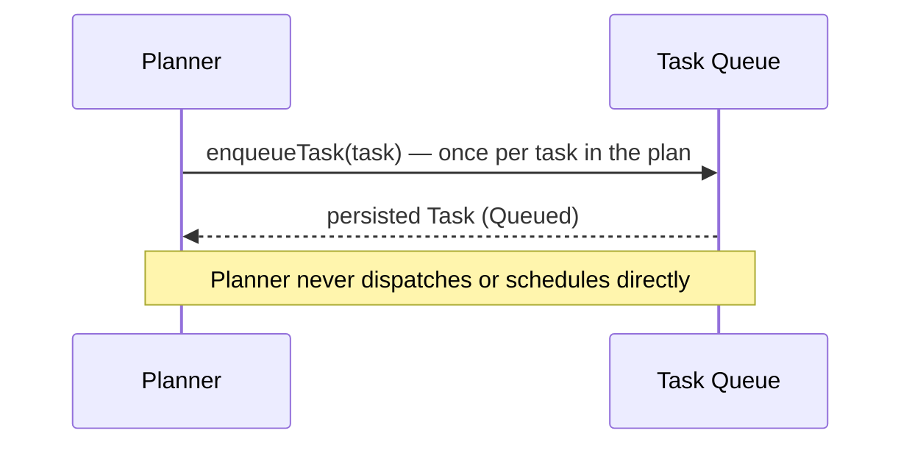

### 20.2 Router

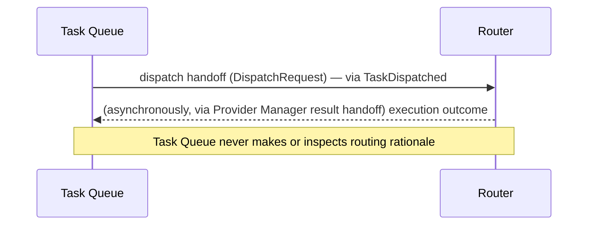

### 20.3 Provider Manager

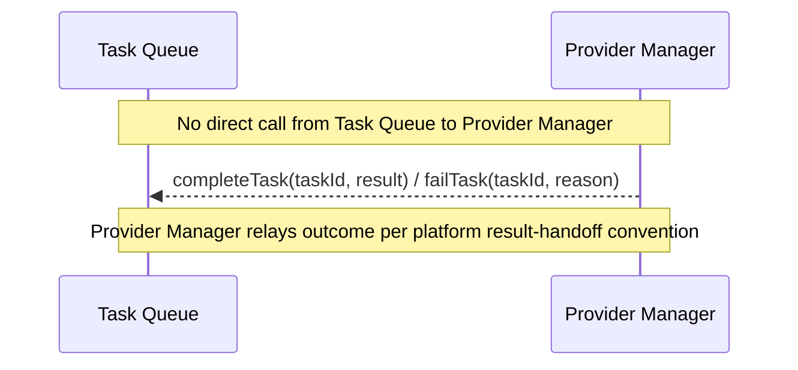

### 20.4 Review Engine

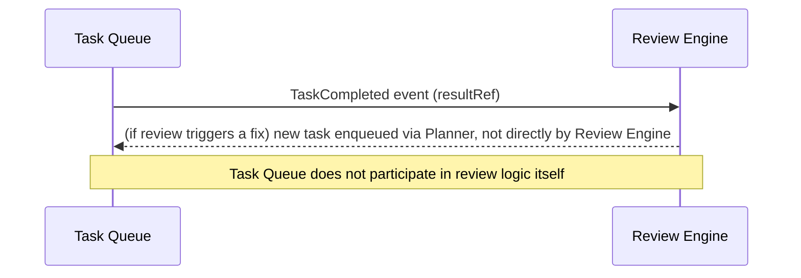

### 20.5 Configuration Manager

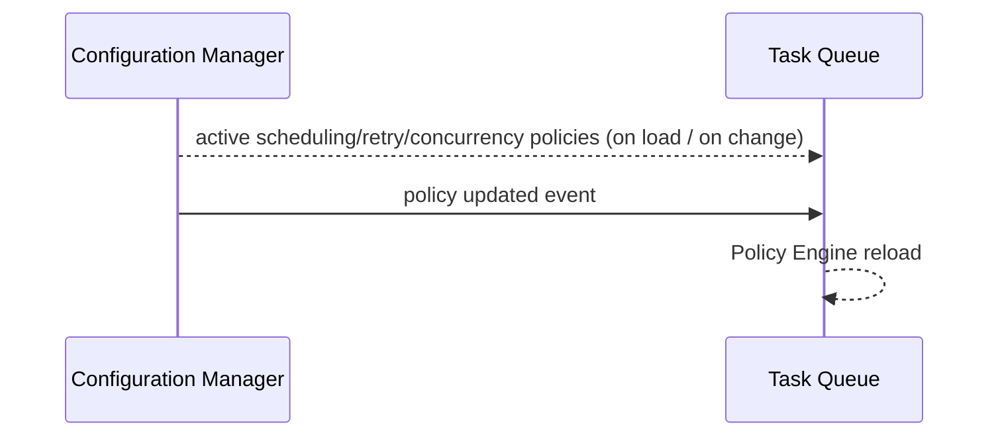

### 20.6 Event Bus

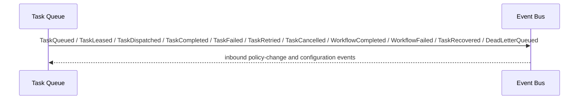

### 20.7 Logger

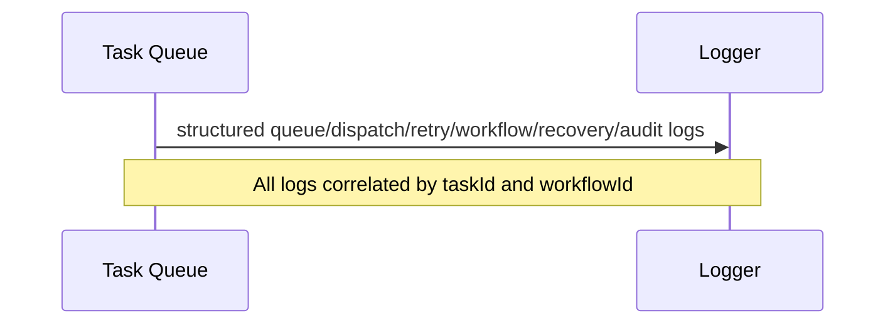

### 20.8 Dashboard Backend

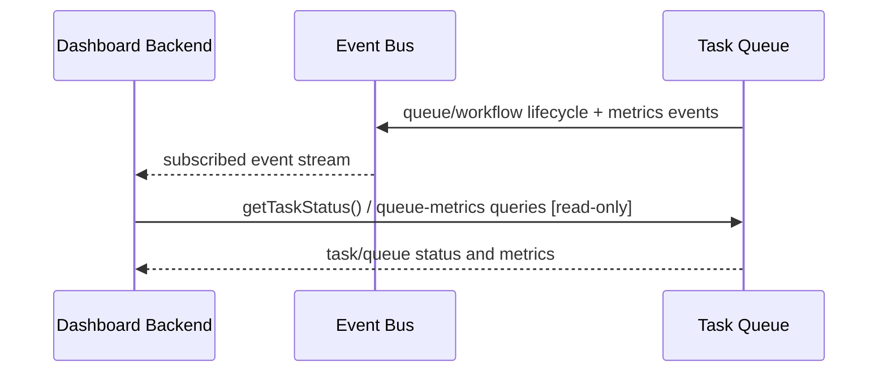

---

## 21. Folder Structure

```
task-queue/
├── domain/
│   ├── task.ts                        # Task Model value object (Section 7)
│   ├── workflow.ts                     # Workflow aggregate state model
│   ├── task-dependency.ts              # Dependency contract (Section 9)
│   ├── task-lease.ts                   # Lease value object
│   └── queue-policy.ts                 # Policy interface/contract (Section 8, 11)
│
├── application/
│   ├── queue-manager/
│   │   └── queue-manager.ts            # Section 5.1 — top-level conductor
│   ├── task-registry/
│   │   └── task-registry.ts            # Section 5.2
│   ├── workflow-coordinator/
│   │   └── workflow-coordinator.ts     # Section 5.3
│   ├── scheduler/
│   │   └── scheduler.ts                # Section 5.4
│   ├── priority-manager/
│   │   └── priority-manager.ts         # Section 5.5
│   ├── dependency-resolver/
│   │   └── dependency-resolver.ts      # Section 5.6
│   ├── dispatch-coordinator/
│   │   └── dispatch-coordinator.ts     # Section 5.7
│   ├── lease-manager/
│   │   └── lease-manager.ts            # Section 5.8
│   ├── lock-manager/
│   │   └── lock-manager.ts             # Section 5.9
│   ├── timeout-manager/
│   │   └── timeout-manager.ts          # Section 5.10
│   ├── retry-manager/
│   │   └── retry-manager.ts            # Section 5.11
│   ├── dead-letter-queue-manager/
│   │   └── dead-letter-queue-manager.ts # Section 5.12
│   ├── state-manager/
│   │   └── state-manager.ts            # Section 5.13 — lifecycle state machine authority
│   ├── recovery-manager/
│   │   └── recovery-manager.ts         # Section 5.14
│   ├── concurrency-manager/
│   │   └── concurrency-manager.ts      # Section 5.15
│   ├── policy-engine/
│   │   ├── policy-engine.ts            # Section 5.17
│   │   └── policies/                   # Built-in policy implementations
│   │       ├── exponential-backoff.policy.ts
│   │       ├── fair-scheduling.policy.ts
│   │       ├── weighted-scheduling.policy.ts
│   │       └── concurrency-limit.policy.ts
│   └── queue-monitor/
│       └── queue-monitor.ts            # Section 5.18
│
├── infrastructure/
│   ├── persistence/
│   │   └── persistence-manager.ts      # Section 5.16 — durable backend adapter
│   ├── locking/
│   │   └── distributed-lock-adapter.ts # Section 19.10
│   ├── config-client/
│   │   └── config-client.ts            # Read-only adapter to Configuration Manager
│   └── event-publisher/
│       └── task-queue-event-publisher.ts # Adapter to Event Bus (Section 13)
│
├── interfaces/
│   ├── task-queue.interface.ts         # Public interface contracts (Section 12)
│   └── queue-policy-plugin.interface.ts # Extension contract for custom scheduling/retry policies
│
├── plugins/
│   └── custom-policies/                # Drop-in directory for organization-specific scheduling/retry/priority strategies
│
├── config/
│   └── default-queue-policies.yaml     # Default global scheduling/retry/concurrency configuration
│
└── tests/
    ├── unit/
    ├── scheduling/
    ├── dependency/
    ├── dispatch/
    ├── retry/
    ├── recovery/
    ├── performance/
    ├── stress/
    ├── chaos/
    └── regression/
```

**Design rationale for this structure:**

- `domain/` holds pure data contracts (Task, Workflow, Dependency, Lease, Policy contract) with no dependency on any other layer, per Clean/Hexagonal Architecture, consistent with the pattern established in the Router and Memory Manager MDDs.
- `application/` contains one directory per internal component from Section 5, each independently unit-testable and swappable via Dependency Injection.
- `infrastructure/` isolates the two genuinely external dependencies this module has — durable persistence and distributed locking — plus the standard Configuration Manager and Event Bus adapters; core `application/` logic never imports a concrete infrastructure client directly.
- `interfaces/` is the Hexagonal "ports" layer: the public API the Planner/Router/Provider Manager path calls, and the policy-plugin port.
- `plugins/custom-policies/` is the Open/Closed extension point for scheduling, retry, and priority strategy, matching the convention established in the Router MDD (`plugins/custom-policies/`) and Memory Manager MDD.
- `tests/` mirrors the functional breakdown in Section 22 (including the addition of `chaos/`, reflecting this module's stronger emphasis on fault-tolerance verification given its coordination responsibilities) rather than the folder structure 1:1.

---

## 22. Testing Strategy

| Test Category | Coverage |
|---|---|
| **Unit Tests** | Every component in Section 5 tested in isolation with mocked dependencies. |
| **Scheduling Tests** | Each scheduling mode (Section 8) tested independently and in combination (e.g. delayed + priority interaction). |
| **Dependency Tests** | Dependency graph resolution, blocking/parallel/barrier/conditional behavior, and cycle-rejection at enqueue time (Section 14). |
| **Dispatch Tests** | Leasing, concurrency-limit enforcement, backpressure signaling, and dispatch validation (Section 10.8) under concurrent multi-instance simulation. |
| **Retry Tests** | Backoff computation, retry-limit enforcement, poison-task detection, and DLQ routing. |
| **Recovery Tests** | Automatic orphan recovery and manual `recoverTask()` paths, including retry-count reset behavior per policy. |
| **Performance Tests** | Dispatch latency and throughput under varying queue depth and concurrency configuration. |
| **Stress Tests** | Sustained high-throughput enqueue/dispatch/complete cycles validating persistence and locking layers hold up without degradation. |
| **Chaos Tests** | Simulated instance crashes mid-lease, network partition from the locking backend, and persistence backend unavailability, verifying fail-closed behavior (Section 14) and correct orphan recovery. |
| **Regression Tests** | A fixed corpus of (task graph input → expected lifecycle outcome) cases re-run on every change, especially around dependency and retry-policy logic. |

---

## 23. Future Expansion

| Future Capability | Extension Mechanism |
|---|---|
| **Distributed Workflow Engines** | Cross-cluster dispatch extension (Section 19.16) presented at the existing dispatch boundary. |
| **Plugin-Based Schedulers** | Already the default mechanism via the Policy Engine's pluggable scheduling policies (Section 5.17, 21). |
| **Custom Queue Policies** | Registered in `plugins/custom-policies/`, evaluated identically to built-in policies. |
| **Priority Algorithms** | New Priority Manager strategies registered the same way as scheduling policies. |
| **Workflow Templates** | Time-Based Scheduling (Section 8) generalizes naturally to recurring/templated workflow instantiation, driven by Planner-side template expansion into standard `enqueueTask()` calls — no Task Queue core change required. |
| **AI-Assisted Scheduling** | Implemented as a custom Priority Manager / Scheduler policy, consuming externally computed signals the same way the Router MDD's adaptive-routing extension does. |
| **Cross-Cluster Dispatch** | Section 19.16. |
| **Edge Workers / Serverless Workers** | The Task Queue's agnosticism to what executes a task (Section 10.2) means new worker topologies require no Task Queue change. |
| **Future Queue Technologies** | Any backend meeting the Persistence Manager/Lock Manager adapter contracts (Section 21). |

---

## 24. Risks

| Category | Risk | Mitigation |
|---|---|---|
| **Architecture** | The hard dispatch-to-Router-only constraint (Section 10) could become awkward if a future execution topology needs the Task Queue to dispatch to something Router-adjacent but distinct. | The dispatch boundary is intentionally the Router's public interface, not a Router-specific code path — any future execution-target abstraction can sit behind the same interface the Router currently implements, without the Task Queue needing to know the difference. |
| **Queue** | Unbounded queue growth under sustained overload before backpressure takes effect. | Queue Overflow handling (Section 14) fails closed on enqueue past configured max-depth, and backpressure signaling (Section 10.5/19.13) is designed to propagate upstream before overflow is reached under normal operation. |
| **Consistency** | A network partition between a Task Queue instance and the Lock Manager backend could risk double-dispatch if not handled correctly. | Explicit fail-closed behavior on lock-acquisition failure (Section 19.6) — an instance that cannot confirm exclusive lease ownership never dispatches, prioritizing correctness over availability for this specific operation. |
| **Performance** | Dependency Resolver graph evaluation could become a bottleneck for very large, highly interconnected workflows. | Graph evaluation is scoped per-workflow (Section 9.1), not global, and re-evaluation is triggered incrementally (only for tasks dependent on a just-transitioned task, Section 9.2) rather than full-graph re-scan. |
| **Scalability** | A very large number of registered custom scheduling/retry policies could linearly increase per-task evaluation cost, mirroring the analogous risk noted in the Router MDD. | Lazy policy loading (Section 18.4) and the same "policies must be fast, side-effect-free" contract established in the Router/Memory Manager MDDs. |
| **Maintenance** | As namespace/queue/organization policy layering accumulates overrides, effective policy for a given task can become hard to reason about. | Audit Logs (Section 15) and `getTaskStatus()`/dashboard tooling expose effective policy application per task without requiring code inspection, mirroring the Router MDD's `evaluateCandidates()` diagnostic pattern. |

---

## 25. Design Decisions

| Decision | Alternatives Considered | Trade-off Discussion | Why Chosen |
|---|---|---|---|
| Task Queue dispatches exclusively to the Router, never to the Provider Manager or a provider directly | Allow the Task Queue to call the Provider Manager directly once a route is known, skipping a hop | A direct call would save one hop but would require the Task Queue to understand execution-result shapes and provider-level failure semantics, re-introducing exactly the coupling the Router/Provider Manager split exists to avoid. | Keeping the dispatch boundary strictly at the Router preserves the platform's layered separation of concerns (decide where vs. execute) and keeps the Task Queue's failure model uniform (Section 14) regardless of what happens downstream of routing. |
| Queue-level retries are structurally distinct from provider-level retries, with no shared code path | A single unified retry mechanism spanning both provider-call-level and task-level retry | A unified mechanism sounds simpler but would force the Task Queue to understand provider-specific failure modes (rate limits, transient network errors) that are the Provider Manager's domain, and would make the two retry loops' interaction (should a provider retry count against the task retry limit?) implicit and confusing. | Explicit separation — the Task Queue only ever sees "the task failed" with a structured reason, never *why* at the provider-call level — keeps both retry mechanisms independently correct and independently tunable. |
| Stateless service design with all durable state in the Persistence Manager | A stateful, in-memory queue (e.g. an in-process priority queue) with periodic snapshotting | An in-memory design would be lower-latency for dispatch decisions but would reintroduce exactly the horizontal-scaling and failover complexity the platform's other modules (Memory Manager, Router) deliberately avoid via statelessness. | Consistency with the platform-wide stateless-service pattern, at the cost of a persistence round-trip per state transition, judged acceptable given the durability guarantee (no task ever silently lost) this module must provide. |
| Dependency cycles are rejected at `enqueueTask()` time rather than detected at runtime | Allow cycles to be enqueued and detect/break deadlock reactively (e.g. via a periodic deadlock-detection sweep) | Reactive detection is more permissive but means a cyclic workflow can occupy queue capacity indefinitely before being caught, and requires an entire additional detection subsystem. | Rejecting cycles at the single point where the graph is being constructed (enqueue time) is strictly simpler and prevents the failure mode from ever occurring, at the cost of requiring the full dependency set to be knowable at enqueue time (an acceptable constraint given the Planner always supplies complete task graphs, per the Planner MDD). |
| Leader election used only for specific background sweeps (Section 19.11), not for the core dispatch path | A single elected leader instance responsible for all scheduling/dispatch decisions | A leader-based dispatch model is simpler to reason about but reintroduces a single point of contention/failure for the platform's highest-throughput path, directly undermining the horizontal-scaling goal (Section 19.1). | Leaderless, lease-based dispatch scales dispatch throughput linearly with instance count; leader election is reserved only for the narrow set of operations that must not run concurrently (e.g. global compaction), keeping the blast radius of that coordination mechanism minimal. |

---

## 26. Diagrams

### 26.1 Component Diagram

*(See Section 5 for the full component diagram.)*

### 26.2 Queue Architecture Diagram

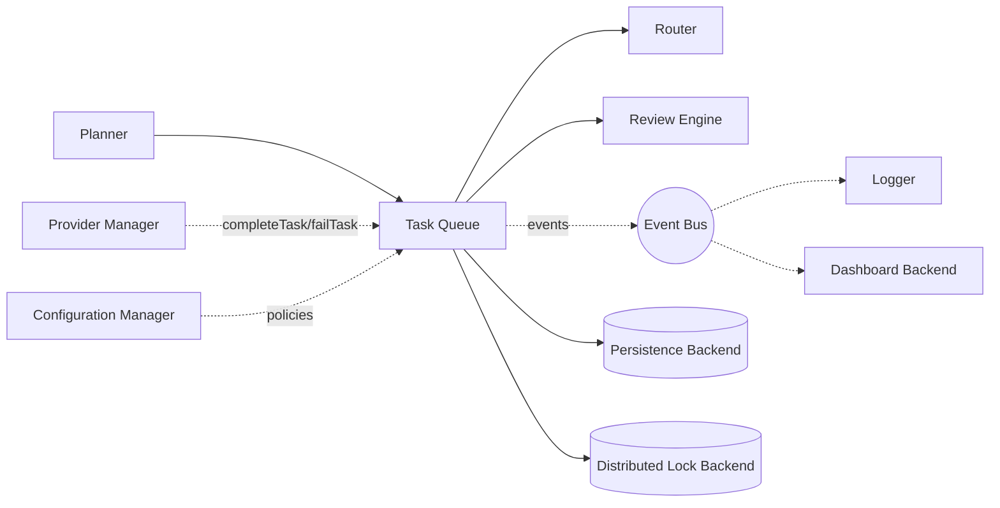

### 26.3 Task Lifecycle Diagram

*(See Section 6.2 for the full lifecycle state diagram.)*

### 26.4 Workflow Diagram

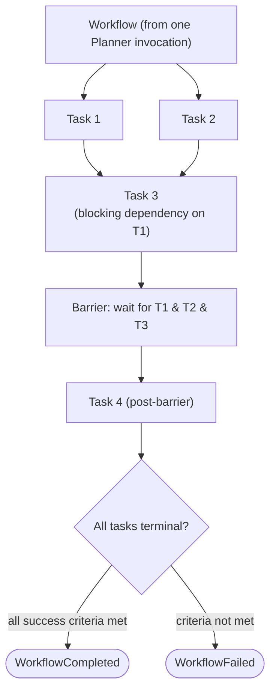

### 26.5 Dependency Graph

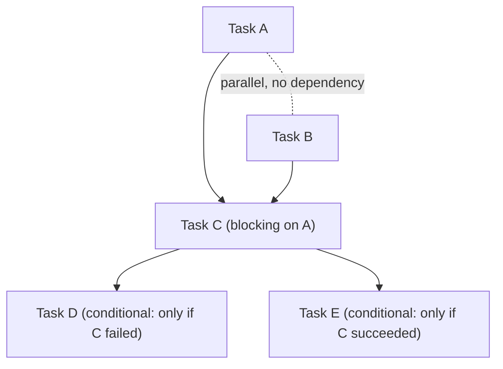

### 26.6 Dispatch Flow

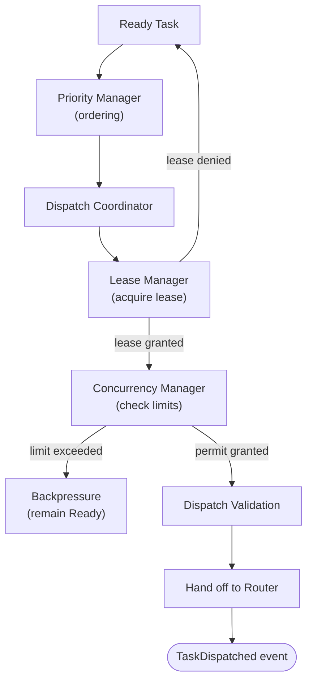

### 26.7 Retry Flow

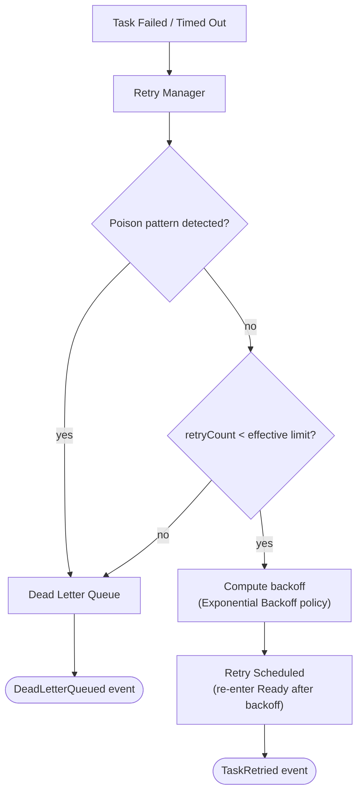

### 26.8 Sequence Diagram — Full Enqueue-to-Completion Flow

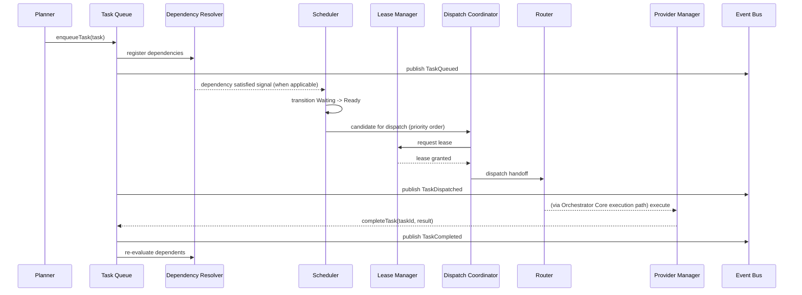

### 26.9 Folder Structure Diagram

*(See Section 21 for the full annotated folder tree.)*

---

## 27. Architectural Constraints

These constraints are normative architectural rules for the Task Queue Module and are not subject to redesign or reinterpretation by implementation teams.

### 27.1 Invariant Boundaries

- The Task Queue never executes AI models.
- The Task Queue never communicates with provider SDKs.
- The Task Queue never performs routing.
- The Task Queue never selects providers.
- The Task Queue never selects models.
- The Task Queue never generates plans.
- The Task Queue never modifies Planner output.
- The Task Queue never performs capability analysis.
- The Task Queue never manages memory.
- The Task Queue never manages knowledge.
- The Task Queue never validates AI responses.
- The Task Queue never reviews execution results.
- The Task Queue dispatches exclusively to the Router.
- Queue-level retries remain distinct from provider-level retries.
- The Queue remains stateless between requests.
- Durable state exists only through the Persistence Manager.

### 27.2 Governance Rule

Any proposed change that would cause the Task Queue to own routing, provider execution, plan generation, capability analysis, memory management, knowledge management, result validation, or provider-level retry logic is considered an architecture violation and must be rejected or re-scoped to the appropriate owning module.

---

## 28. Architecture Decision Records (ADRs)

### 28.1 ADR-01 — Task Queue as Workflow Execution Coordinator

- **Decision:** The Task Queue is the platform's workflow execution coordinator.
- **Context:** The platform requires a module that can ensure durable workflow progression, dependency satisfaction, queueing, retry, and dispatch coordination without owning planning or execution semantics.
- **Alternatives Considered:** Embedding execution logic in the Planner, embedding queue logic directly in the Router, or making the Provider Manager responsible for workflow progression.
- **Rationale:** The existing architecture maintains a clear bounded context: the Task Queue coordinates execution movement while other modules own the semantics of planning, routing, and execution.
- **Consequences:** The Task Queue gains a strong and stable responsibility boundary, but it must rely on the Planner, Router, and Provider Manager for upstream/downstream semantics.

### 28.2 ADR-02 — Separation of Planning from Execution

- **Decision:** Planning remains the responsibility of the Planner; execution coordination remains the responsibility of the Task Queue.
- **Context:** A unified module would blur responsibility and create architectural coupling between plan structure and runtime execution.
- **Alternatives Considered:** Letting the Task Queue infer or rewrite plan structure, or having the Planner participate in dispatch logic.
- **Rationale:** The architecture remains easier to reason about when the Planner creates executable intent and the Task Queue ensures reliable progression of that intent.
- **Consequences:** The system becomes more modular and easier to extend, but task semantics remain intentionally opaque to the Task Queue.

### 28.3 ADR-03 — Queue-Level Retry versus Provider-Level Retry

- **Decision:** The Task Queue owns queue-level retry only; provider-level retries remain owned by the Provider Manager.
- **Context:** The platform needs both a task re-dispatch policy and a provider-call resiliency loop without conflating their semantics.
- **Alternatives Considered:** A single unified retry engine or direct provider retry logic inside the Task Queue.
- **Rationale:** Separation of concerns prevents the queue from needing to understand provider-specific failure mechanics while preserving clear operational semantics.
- **Consequences:** Retries are easier to reason about, but the Task Queue must treat downstream failures as opaque structured failure reasons.

### 28.4 ADR-04 — Lease-Based Distributed Coordination

- **Decision:** The Task Queue uses leases and distributed locking to ensure only one instance can dispatch a given task at a time.
- **Context:** The module must scale horizontally without double-dispatching the same task.
- **Alternatives Considered:** Centralized dispatcher, in-memory leader-based dispatch, or optimistic locking without lease expiry.
- **Rationale:** lease-based coordination provides correctness under distributed conditions while preserving stateless service operation.
- **Consequences:** The design is scalable and consistent, but it requires a reliable locking/lease backend and explicit timeout recovery.

### 28.5 ADR-05 — Dependency-Driven Scheduling

- **Decision:** Task readiness is driven primarily by dependency satisfaction and scheduling policy.
- **Context:** Workflow correctness requires that tasks only become dispatchable when their upstream dependencies have reached the correct states.
- **Alternatives Considered:** Eager dispatching with manual dependency checks or runtime dependency resolution in the Router.
- **Rationale:** Dependency-driven scheduling centralizes correctness and prevents premature execution.
- **Consequences:** The system becomes more correct and deterministic, at the cost of additional dependency state tracking.

### 28.6 ADR-06 — Workflow State Machine

- **Decision:** Every task follows a strict lifecycle state machine and every workflow is tracked by aggregate progression rules.
- **Context:** A coordination module must avoid invalid transitions and preserve auditability.
- **Alternatives Considered:** Ad hoc status flags or loosely typed workflow state.
- **Rationale:** A formal state machine makes lifecycle correctness, recovery, and observability predictable.
- **Consequences:** The implementation is more structured, but state transition validation becomes mandatory.

### 28.7 ADR-07 — Stateless Service Architecture

- **Decision:** The Task Queue process remains stateless between requests; durable state resides in the Persistence Manager.
- **Context:** The platform requires horizontal scalability and elastic recovery.
- **Alternatives Considered:** Stateful in-memory queues with periodic snapshots.
- **Rationale:** Statelessness simplifies scaling, failover, and rolling upgrades.
- **Consequences:** The architecture is highly scalable, but every state-changing operation must be durably persisted.

### 28.8 ADR-08 — Event-Driven Lifecycle Tracking

- **Decision:** Lifecycle transitions emit events through the Event Bus for observability and integration.
- **Context:** Operators and downstream modules need a consistent lifecycle record.
- **Alternatives Considered:** Pull-based polling-only monitoring or private in-module logging only.
- **Rationale:** Event-driven tracking decouples operational visibility from core coordination logic.
- **Consequences:** The module becomes more observable, but event contracts must remain stable.

### 28.9 ADR-09 — Persistence-First Durability

- **Decision:** Durability is treated as a first-class architectural guarantee; no task is acknowledged as accepted without durable persistence.
- **Context:** Queue correctness depends on ensuring accepted work is never silently lost.
- **Alternatives Considered:** Best-effort persistence or asynchronous write-behind durability.
- **Rationale:** The Task Queue's primary contract is safety and recoverability.
- **Consequences:** Throughput may be reduced under strict persistence requirements, but correctness is stronger.

### 28.10 ADR-10 — Dead Letter Queue Architecture

- **Decision:** The Task Queue retains exhausted or poison tasks in a Dead Letter Queue rather than silently discarding them.
- **Context:** Some failures are terminal, and operators need deliberate recovery or purge paths.
- **Alternatives Considered:** Immediate discard or unbounded retry loops.
- **Rationale:** A DLQ provides governance, auditability, and operational control.
- **Consequences:** The design is more operationally robust, but DLQ retention and purge policy must be managed.

### 28.11 ADR-11 — Clean Architecture

- **Decision:** The module uses Clean/Hexagonal Architecture boundaries between domain, application, infrastructure, and interfaces.
- **Context:** The module must remain independently testable and swappable across persistence, locking, and policy backends.
- **Alternatives Considered:** Monolithic implementation with direct infrastructure dependencies.
- **Rationale:** The architecture is easier to evolve and verify with clear seams.
- **Consequences:** The implementation is more modular and maintainable, though it requires explicit interfaces and adapters.

### 28.12 ADR-12 — Hexagonal Architecture

- **Decision:** The Task Queue exposes ports and adapters for persistence, locking, policy evaluation, and event propagation.
- **Context:** The platform requires the queue to integrate with varying infrastructure while preserving internal logic independence.
- **Alternatives Considered:** Hard-coded infrastructure access inside the application logic.
- **Rationale:** Hexagonal boundaries reduce coupling and support safe evolution.
- **Consequences:** The module remains adaptable, but interface contracts must be maintained as part of governance.

---

## 29. Queue Versioning Governance

### 29.1 Versioning Principles

- Queue schema versioning is mandatory for every persisted task, workflow, lease, and policy schema.
- Task model versioning is mandatory whenever a task field is added, removed, or materially changed.
- Workflow versioning is mandatory whenever workflow progression semantics, dependency semantics, or success criteria change.
- Retry policy versioning is mandatory whenever retry limit, backoff, or retryability semantics change.
- Scheduling policy versioning is mandatory whenever fair scheduling, weighting, urgency, or dispatch gating behavior changes.

### 29.2 Compatibility Rules

- Backward compatibility is required for all read operations and for all previously accepted task versions.
- Forward compatibility is required where practical; unknown fields must be ignored rather than cause corruption.
- Version lineage must be preserved for all task, workflow, and policy artifacts so operators can audit which policy version governed a given execution.
- Audit requirements require that version changes be recordable in immutable logs, including the version before/after and the policy or schema that triggered the change.

### 29.3 Governance Expectations

Any version change must be reviewed for compatibility impact, migration path, and rollback strategy before deployment. The Task Queue must never silently reinterpret an older task model as a newer one.

---

## 30. Ownership Matrix

| Concern | Owning Module | Notes |
|---|---|---|
| Task lifecycle | Task Queue | Owns creation, progression, terminalization, and archival policy coordination. |
| Scheduling | Task Queue | Owns when a task becomes ready and eligible for dispatch. |
| Dependencies | Task Queue | Owns dependency satisfaction and barrier evaluation. |
| Dispatch coordination | Task Queue | Owns lease acquisition, dispatch validation, and handoff sequencing. |
| Queue retries | Task Queue | Owns queue-level retry decisions and re-queueing. |
| Timeout detection | Task Queue | Owns detection of lease and execution timeout conditions. |
| Leasing | Task Queue | Owns lease creation, renewal, expiry, and release semantics. |
| Locking | Task Queue | Owns coordination primitives used to prevent duplicate dispatch. |
| Workflow progression | Task Queue | Owns workflow completion/failure state aggregation. |
| Dead Letter Queue | Task Queue | Owns DLQ retention and recovery eligibility. |
| Recovery | Task Queue | Owns orphan recovery and manual recovery orchestration. |
| Concurrency | Task Queue | Owns concurrency enforcement and backpressure behavior. |
| Persistence coordination | Task Queue | Owns the durable-state contract via the Persistence Manager. |
| Plan generation | Planner | Owns plan structure and task graph construction. |
| Routing | Router | Owns routing decisions and route selection. |
| Execution | Provider Manager | Owns actual provider execution. |
| Result validation | Review Engine | Owns execution-result validation and review outcomes. |
| Queue policies | Configuration Manager | Owns queue policy definitions and policy distribution. |
| Event transport | Event Bus | Owns event transport and delivery semantics. |

---

## 31. Processing Guarantees

### 31.1 Core Guarantees

- Every accepted task is durably persisted before acknowledgement.
- No duplicate dispatch occurs for the same task under normal or failure conditions.
- Lifecycle transitions are deterministic and validated by the State Manager.
- No invalid state transition is permitted.
- Dependency correctness is preserved by the Dependency Resolver and workflow state rules.
- Queue-level retry guarantees are bounded by policy and observable in audit history.
- Audit history is immutable once recorded.
- Workflow completion consistency is enforced by workflow-level terminal-state evaluation.
- Request processing remains stateless between invocations.

### 31.2 Operational Guarantee

If a task cannot be durably persisted, leased safely, or transitioned by a valid state machine rule, the operation must fail closed rather than continue in a potentially inconsistent state.

---

## 32. Queue Identity Model

| Identifier | Purpose | Uniqueness | Ownership | Lifecycle |
|---|---|---|---|---|
| `taskId` | Unique identity of a single task | Globally unique within the platform scope | Task Queue | Created at enqueue; persists through archival |
| `workflowId` | Identity of the workflow containing the task | Globally unique | Task Queue / Planner collaboration | Created at workflow initiation; persists through terminal state |
| `planId` | Identity of the originating plan | Globally unique | Planner | Created by Planner; referenced by task metadata |
| `leaseId` | Identity of a specific lease grant | Unique per active lease | Task Queue | Created on lease issuance; expires or is released |
| `queueId` | Identity of a named queue instance or queue partition | Unique per queue scope | Task Queue | Persistent for queue definition and configuration |
| `namespaceId` | Identity of the tenant namespace | Unique within the namespace hierarchy | Configuration / Task Queue | Persistent |
| `organizationId` | Identity of the owning organization | Unique within the platform | Configuration / Task Queue | Persistent |
| `projectId` | Identity of the owning project | Unique within the project domain | Configuration / Task Queue | Persistent |
| `policyId` | Identity of a policy definition | Unique per policy version | Configuration Manager | Persistent with version lineage |
| `retryId` | Identity of a specific retry attempt | Unique per retry event | Task Queue | Created on each retry scheduling event |
| `dispatchId` | Identity of a dispatch operation | Unique per dispatch handoff | Task Queue | Created on dispatch; recorded in audit log |
| `requestId` | Identity of an inbound operation request | Unique per request | Originating caller / Task Queue | Short-lived but correlated to lifecycle |
| `correlationId` | Cross-module correlation key | Unique per operation flow | Platform-wide convention | Propagated through lifecycle |
| `traceId` | Distributed tracing identifier | Unique per distributed trace | Platform-wide convention | Propagated through lifecycle |
| `spanId` | Per-hop tracing identifier | Unique per span | Platform-wide convention | Short-lived |

All identifiers must be preserved in audit and telemetry records where applicable.

---

## 33. Operational Limits

| Limit | Governance Rule |
|---|---|
| Maximum queue depth | Configurable per queue; must be enforced by the Queue Manager and surfaced as backpressure. |
| Maximum workflow size | Configurable per namespace or policy; enforcement is required at enqueue time. |
| Maximum tasks per workflow | Configurable and enforced by the Planner/Task Queue contract. |
| Maximum dependency edges | Configurable and enforced to prevent unbounded graph growth. |
| Maximum concurrent leases | Configurable per queue/namespace/organization with enforcement by the Concurrency Manager. |
| Maximum retries | Configurable by retry policy and enforced by the Retry Manager. |
| Maximum dispatch batch size | Configurable per dispatch policy and enforced by the Dispatch Coordinator. |
| Maximum timeout | Configurable and enforced by the Timeout Manager. |
| Maximum recovery attempts | Configurable and bounded by the Recovery Manager. |
| Maximum concurrent dispatches | Configurable and enforced by the Concurrency Manager. |
| Maximum DLQ size | Configurable with alerting once the threshold is approached. |
| Retention periods | Configurable per workflow/task/archive policy and enforced by the Persistence Manager / archival process. |

---

## 34. Observability Standards

The Task Queue must emit and retain the following operational signals for every task and workflow:

- `taskId`
- `workflowId`
- `queueId`
- `requestId`
- Queue latency
- Dispatch latency
- Execution wait time
- Retry count
- Timeout count
- DLQ size
- Concurrency utilization
- Queue depth
- Throughput
- Workflow duration
- Recovery statistics
- Lease contention
- Degraded mode indicators

These signals must be exposed through metrics, structured logs, and lifecycle events without changing the Task Queue's architectural responsibilities.

---

## 35. Scheduling Governance

### 35.1 Ownership

Scheduling policy ownership resides with the Configuration Manager, while the Task Queue owns evaluation and enforcement. The Task Queue may not modify scheduling semantics outside of the approved policy contract.

### 35.2 Rules

- Scheduling evaluation order is dependency satisfaction first, schedule-time readiness second, then priority/fairness weighting.
- Fair scheduling rules must prevent starvation across workflows, namespaces, and queues.
- Priority calculation governance must remain policy-driven and auditable.
- Queue weighting must be versioned and explicitly approved for policy changes.
- Starvation prevention is mandatory under normal operation.
- Administrative approval is required for changes to global scheduling policy defaults.

---

## 36. Retry & Recovery Governance

### 36.1 Ownership

- Retry ownership remains with the Task Queue.
- Provider-level retry remains with the Provider Manager.
- Recovery ownership remains with the Task Queue Recovery Manager.

### 36.2 Governance Rules

- Queue-level retries must remain distinct from provider-level retries.
- Retry escalation must be policy-driven and observable.
- Poison tasks must be handled through the DLQ path rather than being endlessly retried.
- DLQ governance must include retention, review, and recovery authorization rules.
- Manual recovery requires explicit authorization and audit logging.
- Automatic recovery is limited to orphaned or lease-expired tasks and is distinct from DLQ recovery.

---

## 37. Failure Recovery Guarantees

### 37.1 Failure Handling Rules

- Persistence failures fail closed.
- Lease recovery guarantees must be preserved through timeout-based recovery and orphan detection.
- Cache failures must never compromise correctness; they may degrade performance but not dispatch safety.
- Network partition protection must prevent split-brain double-dispatch by failing closed on lease acquisition uncertainty.
- Graceful degradation is permitted only for non-durability concerns.
- Stateless restart is supported without data loss as long as persistence remains available.
- Safe rolling upgrades must preserve correctness via queue draining and lease expiry.
- Queue draining guarantees must allow in-flight work to complete or recover safely.
- Recovery after node failures must rely on durable state and the existing lease/recovery mechanics.
- Distributed coordination guarantees must preserve single-dispatch semantics under failure.

---

## 38. Security Governance

### 38.1 Core Security Principles

- Queue integrity must be preserved by state machine validation and lease ownership rules.
- Lease integrity must be preserved by bounded lease expiry and owner-scoped operations.
- Workflow integrity must be preserved by dependency validation and transition enforcement.
- Policy integrity must be preserved by versioned, auditable policy evaluation.
- Multi-tenant isolation must be enforced via namespace, organization, and project boundaries.
- Authorization governance must be enforced for both operational and administrative actions.
- Administrative overrides must be logged and auditable.
- Immutable audit logs are mandatory for security review and compliance.
- Compliance logging requirements must be satisfied by the existing audit and event streams.

---

## 39. Future Scalability Governance

### 39.1 Architectural Readiness

The Task Queue is considered architecturally ready for:

- Distributed queue clusters.
- Regional queue federation.
- Cross-region dispatch.
- Distributed schedulers.
- AI-assisted scheduling.
- Plugin-based scheduling strategies.
- Massive workflow orchestration.
- Multi-cloud deployments.
- Active-active deployments.
- Hyperscale task processing.

### 39.2 Governance Rule

Future scalability extensions must preserve the existing architectural boundaries, especially the Router-only dispatch boundary, the stateless service model, the persistence-first durability rule, and the separation of queue-level retries from provider-level retries.

---

*End of Task Queue Module Design Document.*
