# Module Design Document (MDD)
## Validation Engine

**Version:** 1.0
**Status:** Draft for engineering review
**Companion to:** SDD v1.0, API Specification v1.0, Database Design Document v1.0, and all prior module MDDs (Orchestrator Core, Event Bus, Request Manager, Provider Manager, Provider Plugin System, Model Registry, Capability Selector, Router, Memory Manager, Knowledge Base, Knowledge Comparison Engine, Planner, Task Queue, Review Engine)

---

## 1. Executive Summary

### Purpose
The Validation Engine is a **correctness verification service**. Given a completed task's execution result, it determines whether that result is structurally and logically *valid* — conforms to the expected schema, satisfies its execution contract, complies with business rules, security constraints, and organizational/compliance policies. It answers "is this well-formed and permitted," never "is this good."

### Responsibilities
Validation Coordination, schema/contract/business-rule/security/compliance/policy validation, validation report generation, validation history — nothing quality-, execution-, or orchestration-shaped. It reads execution results, contracts (from Planner), and policies (from Configuration Manager); it writes only validation artifacts.

### Role
The Validation Engine is the platform's **correctness layer**, sitting alongside — never overlapping — the Review Engine's **quality layer** (Review Engine MDD §1, §26). The distinction is exact and load-bearing: Review Engine asks "is this a good result relative to objectives and quality bar" (a qualitative judgment); Validation Engine asks "is this a structurally and logically *valid* result relative to schema, contract, and policy" (a correctness/compliance verification). Neither module evaluates the other's dimension, and both feed independently into the platform's downstream quality gate (SDD §17) as parallel, non-overlapping inputs.

### Architecture Position
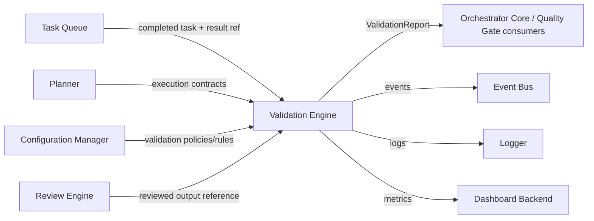

---

## 2. Goals

### Primary Goals
- Determine, deterministically and reproducibly, whether a completed execution result is structurally valid (schema conformance), contractually valid (satisfies the Planner-defined execution contract), and policy-compliant (business rules, security constraints, compliance requirements).
- Produce a structured, versioned, auditable Validation Report enumerating every rule evaluated, its outcome, and any errors/warnings/violations.
- Remain entirely rule/policy-driven and metadata-configurable — new schemas, contracts, business rules, and compliance frameworks require no source-code change.

### Secondary Goals
- Support short-circuit validation for expensive rule chains where an early hard failure makes further evaluation pointless, while still supporting full-evaluation mode for complete diagnostic reporting.
- Provide transparent, explainable validation results (every violation traceable to a specific rule and the exact data that failed it).
- Maintain a complete, immutable validation history per execution result for audit and compliance purposes.

### Non-Goals
- This module never evaluates quality, scores responses, executes tasks, modifies execution results, plans, schedules, routes, communicates with providers/SDKs, manages memory, stores knowledge, compares knowledge, retries, falls back, or automates browsers. Quality assessment belongs exclusively to the Review Engine; this module owns correctness verification only.

### Future Goals
- Plugin-based validators for third-party/industry-specific rule packs (§22).
- AI-assisted validation for semantically-ambiguous business rules.
- Streaming validation for very large execution results.
- Dynamic, hot-reloadable rule loading without a Configuration Manager restart cycle.

---

## 3. Responsibilities

### Must Have
- Receive a completed task reference (from Task Queue) and load the associated execution result, execution contract (from Planner), and applicable validation policies/rules (from Configuration Manager).
- Execute the full validation pipeline: schema validation, contract validation, business rule validation, security validation, compliance validation.
- Produce a structured, versioned Validation Report with pass/fail status, errors, warnings, and violations, each traceable to the specific rule that produced them.
- Persist the Validation Report to immutable Validation History.
- Publish validation lifecycle events for every stage of the process.

### Should Have
- Support short-circuit ("fail fast") and full-evaluation validation modes, configurable per policy.
- Support validation templates (reusable, named bundles of schema/contract/rule references) to reduce configuration duplication across similar task/result types.
- Support parallel execution of independent validation stages (schema and security validation, for instance, have no data dependency on each other).

### Future Responsibilities
- Plugin-based validator registration for third-party rule packs.
- AI-assisted validation for rules requiring semantic (not purely structural) judgment, kept strictly within the correctness domain (e.g., "does this output satisfy a natural-language-specified contract clause") rather than drifting into quality assessment.
- Streaming validation for large execution results.

---

## 4. Scope

### Owns
Validation Coordination, Schema Validation, Business Rule Validation, Contract Validation, Constraint Validation, Policy Validation, Security Validation, Compliance Validation, Input Validation, Output Validation, Metadata Validation, Validation Rules, Validation Policies, Validation Reports, Validation Results, Validation Templates, Validation History, Validation Pipelines.

### Does Not Own
Execution, Quality Review (Review Engine), Task Scheduling, Planning, Routing, Provider Communication, Provider SDKs, Response Modification, Memory Management, Knowledge Storage, Knowledge Comparison (Knowledge Comparison Engine), Retry Logic, Fallback Logic, Browser Automation, AI Model Selection.

### Collaborates With
| Module | Nature of collaboration |
|---|---|
| Review Engine | Provides a reference to the reviewed output; the Validation Engine reads this as *additional context*, never as an input it validates the correctness of, and never re-derives or second-guesses Review Engine's quality scores |
| Provider Manager | Indirect — produces the execution result; the Validation Engine never calls it directly, only reads the result reference via Task Queue |
| Task Queue | Provides completed task information (task ID, execution result reference, workflow ID) that triggers validation |
| Planner | Read-only source of the execution contract (the formal, structural specification of what a valid result must satisfy — distinct from the Review Engine's "objectives," which are evaluative, not structural) |
| Configuration Manager | Read-only source of validation policies, rules, schemas, templates |
| Event Bus | Publishes validation lifecycle events |
| Logger | Receives structured logs |
| Dashboard Backend | Consumes validation metrics (read-only) |

---

## 5. Internal Architecture

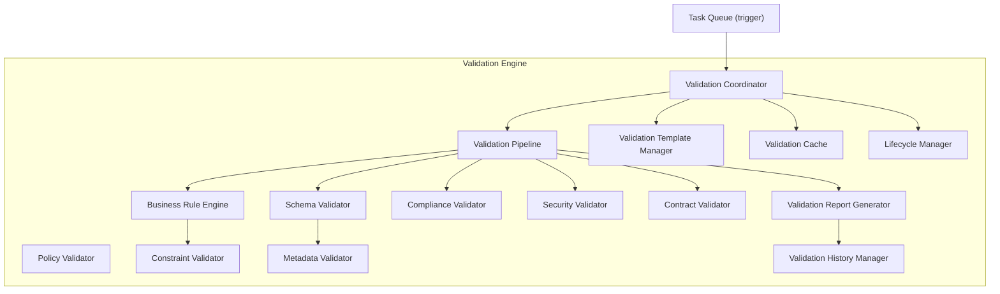

### 5.1 Validation Coordinator
- **Purpose**: Single orchestration point for one validation's end-to-end lifecycle (§6).
- **Responsibilities**: load context (execution result, contract, policies), invoke the Validation Pipeline, enforce the Lifecycle Manager's state machine, trigger report generation and persistence.
- **Inputs**: `{ taskId, executionResultRef, workflowId }` from Task Queue.
- **Outputs**: completed `ValidationReport` (or a structured failure result, §13).
- **Dependencies**: all other components in this module (composition root).
- **Lifecycle**: stateless, one execution context per validation.

### 5.2 Schema Validator
- **Purpose**: Verify the execution result conforms to its declared structural schema (JSON Schema, XML Schema, or a platform-defined schema format, §8).
- **Responsibilities**: parse the result against the applicable schema; produce field-level errors for every non-conformance.
- **Inputs**: execution result content, schema reference (from contract or policy).
- **Outputs**: `SchemaValidationResult { valid: bool, errors[] }`.
- **Dependencies**: none external beyond the schema definition source (Configuration Manager, via Validation Coordinator's loaded context).
- **Lifecycle**: stateless.

### 5.3 Business Rule Engine
- **Purpose**: Evaluate declarative business rules (§9) against the execution result.
- **Responsibilities**: execute each configured rule (required fields, data types, formats, ranges, regex, relationships, dependencies, cross-field validation, organization/custom rules); aggregate per-rule results.
- **Inputs**: execution result, rule set (from Policy Validator/Template Manager).
- **Outputs**: `BusinessRuleResult[] { ruleId, satisfied: bool, violation? }`.
- **Dependencies**: Constraint Validator (for range/format/cross-field sub-evaluations).
- **Lifecycle**: stateless, rules evaluated in parallel where independent (§10, §17).

### 5.4 Policy Validator
- **Purpose**: Resolve which validation policies apply to this result and merge them into an effective policy set — the correctness-domain analog of the Review Engine's Policy Engine.
- **Responsibilities**: load policies from Configuration Manager; apply precedence rules (mirrors Review Engine MDD §11 and Capability Selector MDD §12 exactly, for platform-wide consistency); resolve named Validation Templates.
- **Inputs**: `taskId`, project/namespace scope.
- **Outputs**: effective `ValidationPolicySet` (schemas + rules + thresholds + template references).
- **Dependencies**: Configuration Manager port, Validation Template Manager.
- **Lifecycle**: stateless per call; policy cache refreshed on policy-change notification.

### 5.5 Compliance Validator
- **Purpose**: Evaluate mandatory compliance-framework rules (e.g., regulatory retention/format/redaction requirements) — always highest-precedence, never overridable except via an audited override (§16).
- **Responsibilities**: execute compliance-specific rule sets distinct from general business rules, since compliance failures typically carry stricter non-negotiability and distinct audit requirements.
- **Inputs**: execution result, compliance policy set.
- **Outputs**: `ComplianceValidationResult[] { requirementId, satisfied: bool, violation? }`.
- **Dependencies**: none external.
- **Lifecycle**: stateless.

### 5.6 Security Validator
- **Purpose**: Evaluate security-relevant structural constraints — e.g., absence of disallowed content patterns, adherence to output sanitization contracts, no leaked credentials/secrets patterns in the result.
- **Responsibilities**: execute security-specific rule sets; flag violations distinctly from general business-rule violations given their typically higher severity.
- **Inputs**: execution result, security policy set.
- **Outputs**: `SecurityValidationResult[] { checkId, satisfied: bool, violation? }`.
- **Dependencies**: none external.
- **Lifecycle**: stateless.

### 5.7 Contract Validator
- **Purpose**: Verify the execution result satisfies the formal execution contract supplied by the Planner (distinct from — and evaluated independently of — the Review Engine's objectives).
- **Responsibilities**: compare declared contract clauses (expected output shape, required capabilities exercised, expected side effects declared by the task) against what the result actually contains.
- **Inputs**: execution result, `ExecutionContract` (from Planner).
- **Outputs**: `ContractValidationResult { satisfied: bool, unmetClauses[] }`.
- **Dependencies**: Planner port (read-only, via Validation Coordinator's loaded context).
- **Lifecycle**: stateless.

### 5.8 Constraint Validator
- **Purpose**: Shared low-level evaluation logic for ranges, formats, regex, and cross-field constraints, used by both the Business Rule Engine and (where applicable) Compliance/Security Validators, avoiding duplicated constraint-evaluation logic across those components.
- **Responsibilities**: evaluate a single declarative constraint expression against provided data; is intentionally the *only* component in this module containing generic constraint-evaluation logic.
- **Inputs**: constraint expression, data to evaluate.
- **Outputs**: `bool` + violation detail.
- **Dependencies**: none.
- **Lifecycle**: stateless, invoked as a shared utility by other components (not independently orchestrated by the Validation Coordinator).

### 5.9 Metadata Validator
- **Purpose**: Validate the structural metadata of the execution result itself (distinct from the result's content) — e.g., required metadata fields present, timestamp formats correct, reference IDs well-formed.
- **Responsibilities**: schema-check the metadata envelope surrounding the result content.
- **Inputs**: result metadata.
- **Outputs**: `MetadataValidationResult { valid: bool, errors[] }`.
- **Dependencies**: none external.
- **Lifecycle**: stateless.

### 5.10 Validation Pipeline
- **Purpose**: Own pipeline-stage sequencing, ordering, short-circuit logic, and parallelization policy (§10).
- **Responsibilities**: execute Schema → Contract → Business Rule → Security → Compliance validation (or a policy-configured alternate order); apply short-circuit rules; run independent stages in parallel where policy allows.
- **Inputs**: execution result, contract, policy set, effective pipeline configuration.
- **Outputs**: aggregated results from every executed stage.
- **Dependencies**: Schema Validator, Contract Validator, Business Rule Engine, Security Validator, Compliance Validator, Metadata Validator.
- **Lifecycle**: stateless per call.

### 5.11 Validation Report Generator
- **Purpose**: Assemble the final, complete `ValidationReport` entity (§7).
- **Responsibilities**: compose every stage's results into the versioned report shape; compute overall pass/fail from stage results per policy rules (e.g., "compliance failure always yields overall fail, regardless of other stages").
- **Inputs**: all Validation Pipeline stage outputs.
- **Outputs**: `ValidationReport`.
- **Dependencies**: none external beyond its inputs.
- **Lifecycle**: stateless.

### 5.12 Validation History Manager
- **Purpose**: Persist and retrieve immutable Validation Report history — mirrors the Review Engine's Review History Manager (Review Engine MDD §5.12) exactly, for platform-wide consistency of the audit-history pattern.
- **Responsibilities**: append-only write of completed `ValidationReport`s; retrieval by `taskId`, `validationId`, or query criteria.
- **Inputs**: completed `ValidationReport`.
- **Outputs**: persisted record confirmation; on retrieval, `ValidationReport`/`ValidationReport[]`.
- **Dependencies**: Operational Storage repository port (Validation Report entity, DDD §6.13).
- **Lifecycle**: stateless per call.

### 5.13 Validation Template Manager
- **Purpose**: Own Validation Template definitions — named, reusable bundles of schema/contract/rule references.
- **Responsibilities**: resolve a template into its constituent schema/rule set for the Policy Validator.
- **Inputs**: `templateId`.
- **Outputs**: resolved template contents.
- **Dependencies**: Configuration Manager port.
- **Lifecycle**: stateless per call; cached (§17).

### 5.14 Validation Cache
- **Purpose**: Cache resolved policy sets, templates, and compiled schema/rule definitions for performance (§17).
- **Responsibilities**: TTL/invalidation-driven caching, invalidated on validation-policy-change notification.
- **Inputs/Outputs**: internal only.
- **Dependencies**: Cache storage domain (DDD §4.6).
- **Lifecycle**: always reconstructable from source data.

### 5.15 Lifecycle Manager
- **Purpose**: Enforce the legal validation state machine (§6).
- **Responsibilities**: validate transitions; reject illegal ones.
- **Inputs**: validation ID, current status, requested transition.
- **Outputs**: updated status or `IllegalLifecycleTransition`.
- **Dependencies**: none external.
- **Lifecycle**: stateless.

---

## 6. Validation Lifecycle

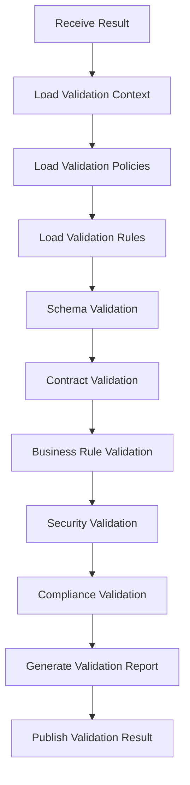

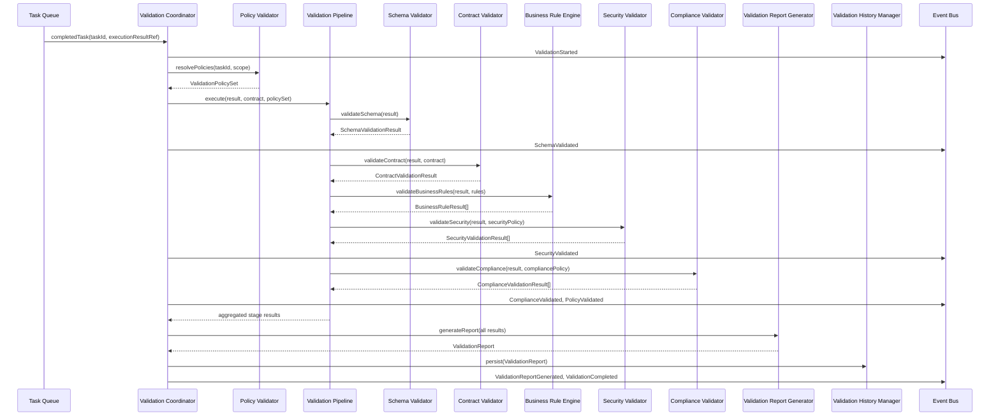

### State Diagram
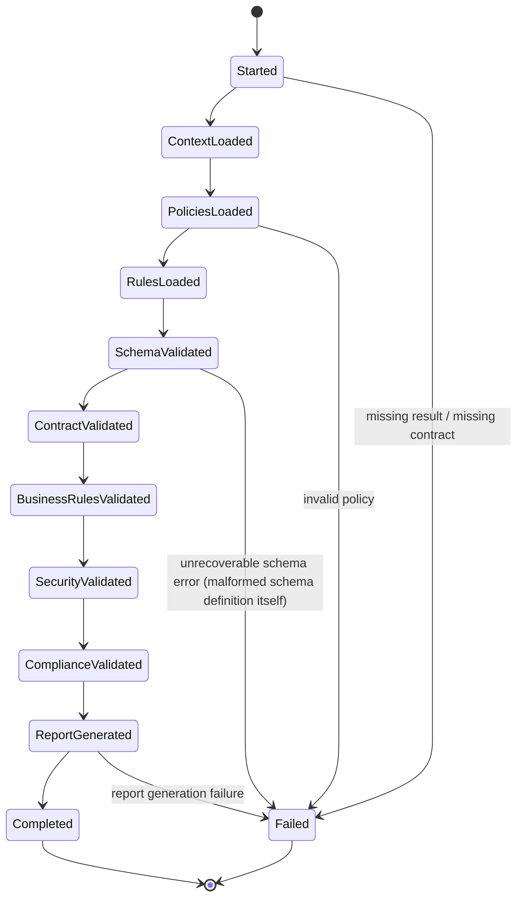
**Note on short-circuit**: the state diagram shows the full-evaluation path; in short-circuit mode (§10), a hard-failing stage transitions directly to `ReportGenerated` (report reflects only stages actually executed, with remaining stages marked `Skipped`, not `Failed` — an important distinction preserved in the Validation Model, §7).

---

## 7. Validation Model

| Field | Explanation |
|---|---|
| `validationId` | Opaque UUID primary key |
| `executionId` | Reference to the specific execution result validated (distinct from `taskId` — a task may be re-executed, producing multiple executions, each independently validatable) |
| `workflowId` | Reference to the owning Plan/workflow, for cross-task validation aggregation |
| `schemaVersion` | The specific schema version applied (schemas are versioned; a historical `ValidationReport` always records exactly which version was used, so later schema evolution never retroactively reinterprets a past validation) |
| `validationRules` | Snapshot of the specific rule set actually evaluated (post-template/policy resolution), captured for auditability — mirrors the Review Engine's `criteria` snapshot field (Review Engine MDD §7) |
| `policies` | References to the specific policy versions applied |
| `constraints` | Snapshot of constraint expressions evaluated (ranges, formats, regex, cross-field) |
| `validationStatus` | Lifecycle status per §6 |
| `passFail` | Overall boolean outcome, computed by the Validation Report Generator per policy-defined aggregation rules (e.g., "any compliance failure ⇒ overall fail") |
| `errors[]` | Hard failures — rule violations that constitute an invalid result |
| `warnings[]` | Soft findings — non-blocking issues surfaced for visibility without failing the overall result |
| `violations[]` | Structured, rule-attributed detail underlying both `errors[]` and `warnings[]` — `{ ruleId, stage, severity, description, dataRef }` |
| `complianceResults` | Compliance Validator's per-requirement outcomes, kept as a distinct top-level field given their elevated audit significance (§16) |
| `securityResults` | Security Validator's per-check outcomes, similarly elevated |
| `metadata` | Structured fields (e.g., `durationMs`, `stagesExecuted[]`, `stagesSkipped[]`) |
| `timestamp` | Immutable creation timestamp |
| `version` | Version of the Validation Engine's rule/pipeline logic used — the correctness-domain analog of the Review Engine's `reviewVersion` (Review Engine MDD §7), for identical reasons (explaining result drift across an engine upgrade) |
| `customMetadata` | Open-ended extension point, mirroring the identical pattern in Knowledge Base MDD §7 and Review Engine MDD §7 |

**Immutability**: once a `ValidationReport` reaches `Completed` (or `Failed`), none of its fields are ever mutated — a re-validation produces a new `ValidationReport` record with its own `validationId`, linked to the same `executionId` (§16), mirroring the Review Engine's immutability guarantee exactly.

---

## 8. Validation Types

| Type | Explanation |
|---|---|
| **Schema Validation** | Structural conformance to a declared schema — the result's shape, required fields, and data types match what is expected |
| **JSON Validation** | Schema Validation specialized for JSON-shaped results (JSON Schema-based), the most common case for structured tool/API outputs |
| **XML Validation** | Schema Validation specialized for XML-shaped results (XML Schema/DTD-based), for providers/tasks producing XML output |
| **Business Rules** | Declarative domain rules beyond pure structural schema (§9), evaluated by the Business Rule Engine |
| **Contract Validation** | Verification against the Planner-supplied `ExecutionContract` — did the execution do what it was contractually specified to do, structurally speaking |
| **Output Validation** | Validation of the result content itself (schema + business rules + contract, combined view) |
| **Input Validation** | Where applicable, validation that the inputs originally supplied to the execution were well-formed — primarily useful for diagnosing whether a validation failure originated from bad input vs. bad execution; this module validates results, but retains the ability to reference/replay input validation context for diagnostic completeness, without owning input validation as a standalone triggered operation (that responsibility sits earlier in the pipeline, at the API Layer/Request Manager boundary) |
| **Metadata Validation** | Structural correctness of the result's metadata envelope (§5.9), independent of content |
| **Compliance Validation** | Mandatory regulatory/organizational compliance requirement checks (§5.5) |
| **Security Validation** | Security-relevant structural checks (§5.6) |
| **Custom Validation** | Any `custom:*` namespaced validator, flowing through the same pipeline unchanged — the extensibility mechanism satisfying the "unlimited validation rules" requirement |

---

## 9. Validation Rules

| Rule category | Explanation |
|---|---|
| **Required Fields** | A field must be present and non-null in the result |
| **Data Types** | A field's value must match a declared primitive/structured type |
| **Formats** | A field must match a named format (e.g., ISO-8601 date, email, UUID) |
| **Ranges** | Numeric/length values must fall within a declared min/max |
| **Regex** | String values must match a declared pattern |
| **Relationships** | A field's value must correctly reference another entity (e.g., a declared `taskId` reference must exist) |
| **Dependencies** | A field is required only if another field/condition is present ("if X then Y is required") |
| **Cross-field Validation** | A rule spanning multiple fields simultaneously (e.g., `endDate >= startDate`) |
| **Organization Rules** | Organization-scoped rules layered above project-level rules, following the identical precedence model established in Review Engine MDD §11 / Capability Selector MDD §12 |
| **Custom Rules** | `custom:*` namespaced rule definitions, evaluated generically by the Business Rule Engine / Constraint Validator without any rule-specific source code |

All rule categories are evaluated via the shared Constraint Validator (§5.8) where the category reduces to a generic constraint expression (ranges, formats, regex, cross-field, dependencies), and via the Business Rule Engine's own coordination logic for rule-set assembly and aggregation — keeping the actual expression-evaluation logic centralized in exactly one place (§5.8), avoiding duplicated validation-primitive implementations across Schema/Business Rule/Compliance/Security validators.

---

## 10. Validation Pipeline

- **Pipeline Stages**: Schema → Contract → Business Rule → Security → Compliance (default order, per §6), each producing an independent result set consumed by the Validation Report Generator.
- **Pipeline Ordering**: the default order above is itself a policy-configurable sequence (via Configuration Manager), not hardcoded — an organization may, for example, prioritize Compliance validation first if compliance failures should short-circuit before spending time on other stages.
- **Rule Execution**: individual rules within a stage (e.g., every Business Rule) are evaluated by the shared Constraint Validator utility (§5.8); the Business Rule Engine aggregates their results.
- **Short Circuit Validation**: policy-configurable — if enabled, a stage-level hard failure (not a warning) halts remaining stages, with unexecuted stages marked `Skipped` in the report (§7 `metadata.stagesSkipped`); disabled by default so a single `validate()` call produces the most complete diagnostic picture unless the caller/policy explicitly opts into fail-fast behavior for latency-sensitive contexts.
- **Parallel Validation**: stages with no data dependency on one another (e.g., Security Validation does not depend on Business Rule Engine output) are executed concurrently by the Validation Pipeline where short-circuit mode is disabled (§17); Contract Validation depends on the same result content as Schema Validation but not on Schema Validation's *output*, so it too can run in parallel rather than strictly sequentially, despite the lifecycle diagram (§6) presenting a logical/reporting order.
- **Conditional Validation**: a stage or individual rule may be policy-configured to apply only when a declared condition holds (e.g., Compliance Validation's specific requirement set varies by `namespace`/industry) — evaluated generically, not via stage-specific conditional code.
- **Rule Priorities**: each rule carries a `severity` (§7 `violations[]`) — `error` (contributes to `passFail`) vs. `warning` (does not) — set by policy configuration, not fixed per rule type; the same rule could be a hard error in one project's policy and a warning in another's.
- **Pipeline Customization**: the entire pipeline shape (stage order, inclusion/exclusion, short-circuit mode, parallelism) is a Configuration Manager-owned `ValidationPolicySet` property, making pipeline customization a data change, never a code change.

---

## 11. Public Interfaces

### 11.1 `validate(taskId, executionResultRef): ValidationReport`
- **Purpose**: The primary entry point — runs the full validation pipeline (§6) end to end.
- **Inputs**: `taskId`, `executionResultRef`.
- **Outputs**: completed `ValidationReport`.
- **Validation**: `taskId` must reference a completed Task; `executionResultRef` must be resolvable; a contract must be resolvable from Planner.
- **Errors**: `TaskNotFound`, `MissingResult`, `MissingContract`, propagated stage-specific failures (§13).
- **Side Effects**: full event sequence published; `ValidationReport` persisted to Validation History.

### 11.2 `validateSchema(result, schemaRef): SchemaValidationResult`
- **Purpose**: Standalone schema validation, for testing/introspection or advanced callers needing only structural conformance checking.
- **Inputs**: result content, `schemaRef`.
- **Outputs**: `SchemaValidationResult`.
- **Validation**: `schemaRef` must resolve to a known schema definition.
- **Errors**: `SchemaNotFound`, `SchemaValidationFailure` (malformed schema definition itself, not a result-conformance failure — that is a normal `valid: false` outcome, not an error).

### 11.3 `validateBusinessRules(result, ruleSetRef): BusinessRuleResult[]`
- **Purpose**: Standalone business rule validation.
- **Inputs**: result content, `ruleSetRef`.
- **Outputs**: `BusinessRuleResult[]`.
- **Validation**: `ruleSetRef` must resolve.
- **Errors**: `RuleSetNotFound`.

### 11.4 `validateCompliance(result, complianceScope): ComplianceValidationResult[]`
- **Purpose**: Standalone compliance validation.
- **Inputs**: result content, compliance scope (project/namespace/framework).
- **Outputs**: `ComplianceValidationResult[]`.
- **Validation**: compliance scope must resolve to a known framework configuration.
- **Errors**: `ComplianceFrameworkNotFound`.

### 11.5 `validateSecurity(result, securityPolicyRef): SecurityValidationResult[]`
- **Purpose**: Standalone security validation.
- **Inputs**: result content, `securityPolicyRef`.
- **Outputs**: `SecurityValidationResult[]`.
- **Validation**: `securityPolicyRef` must resolve.
- **Errors**: `SecurityPolicyNotFound`.

### 11.6 `generateValidationReport(pipelineResults): ValidationReport`
- **Purpose**: Standalone report assembly, for testing/introspection or re-generation from already-computed stage outputs.
- **Inputs**: full set of pipeline stage results.
- **Outputs**: `ValidationReport`.
- **Validation**: completeness of `pipelineResults`.
- **Errors**: `ReportGenerationFailure`.

---

## 12. Events

| Event | Publisher | Subscribers | Payload | Trigger | Retry Behaviour |
|---|---|---|---|---|---|
| `ValidationStarted` | Validation Coordinator | Logger, Dashboard Backend | `{ validationId, taskId }` | `validate` entry | Non-blocking |
| `ValidationCompleted` | Validation Coordinator | Task Queue, Logger, Dashboard Backend, Learning Layer | `{ validationId, taskId, passFail, errorCount, warningCount }` | Full lifecycle success | Non-blocking |
| `ValidationFailed` | Validation Coordinator | Task Queue, Logger, Dashboard Backend | `{ validationId, taskId, failureStage, reason }` | Any Failed transition (§6 state diagram — infra/config failure, distinct from a normal `passFail: false` result) | Non-blocking |
| `SchemaValidated` | Validation Coordinator (relaying Schema Validator completion) | Logger | `{ validationId, valid, errorCount }` | Schema Validator stage completes | Non-blocking |
| `PolicyValidated` | Validation Coordinator (relaying Policy Validator resolution) | Logger, Dashboard Backend | `{ validationId, policySetResolved }` | Policy Validator completes | Non-blocking |
| `ComplianceValidated` | Validation Coordinator (relaying Compliance Validator completion) | Logger, Dashboard Backend | `{ validationId, satisfiedCount, violationCount }` | Compliance Validator stage completes | Non-blocking |
| `SecurityValidated` | Validation Coordinator (relaying Security Validator completion) | Logger, Dashboard Backend | `{ validationId, satisfiedCount, violationCount }` | Security Validator stage completes | Non-blocking |
| `ValidationReportGenerated` | Validation Report Generator | Logger, Validation History Manager (event-visible for audit consistency) | `{ validationId }` | Report assembled | Non-blocking |

All events fire-and-forget, isolated per subscriber, consistent with platform-wide Event Bus policy (SDD §18) and identical to the Review Engine's event-handling model (Review Engine MDD §13).

---

## 13. Error Handling

| Failure | Handling |
|---|---|
| Schema Errors | Two distinct cases: (a) the *result* fails schema conformance — a normal, expected `valid: false` outcome recorded in `SchemaValidationResult.errors[]`, not a module-level error; (b) the *schema definition itself* is malformed/unresolvable — a genuine `SchemaNotFound`/configuration error, transitioning the validation to `Failed` |
| Validation Errors | Rule-level violations (Business Rule Engine, Constraint Validator) are recorded as `violations[]` entries, not thrown exceptions — a rule failing is an expected, first-class outcome of this module's purpose, never an error condition |
| Policy Errors | Malformed policy from Configuration Manager → fall back to last successfully cached policy set with a `degraded` flag; if no cache exists, fail with `PolicyUnavailable` (identical handling to Review Engine MDD §14 / Capability Selector MDD §15, for platform-wide consistency) |
| Compliance Errors | A Compliance Validator rule execution throwing (as opposed to failing) is treated with maximum caution: the affected requirement is recorded as `Inconclusive` and the *overall* `passFail` defaults to `false` for that validation (compliance ambiguity must never silently resolve to a pass) |
| Security Errors | Same fail-safe posture as Compliance Errors — a Security Validator execution error defaults the affected check to `Inconclusive` with `passFail` forced to `false`, never silently treated as satisfied |
| Pipeline Errors | An unexpected exception within the Validation Pipeline's own sequencing logic (not a specific validator) → `PipelineError`, validation transitions to `Failed`, treated as a module-level bug requiring operator attention, not a normal validation outcome |
| Recovery Strategy | This module holds no durable state beyond immutable Validation History (§5.12) and its caches (§5.14); a crash mid-validation results in that specific validation being marked `Failed` (if partially recorded) or never having started — Task Queue's own retry/re-trigger logic determines whether a failed validation is re-attempted, mirroring the Review Engine's identical recovery posture (Review Engine MDD §14) |

**Fail-safe principle** (specific to this module, given its correctness/compliance role): unlike the Review Engine's degraded-mode tolerance for stale caches, this module treats **Compliance and Security ambiguity as a hard `false`**, never an optimistic pass-through — correctness verification must never silently assume validity in the face of an evaluation error.

---

## 14. Logging

| Log type | Content |
|---|---|
| Validation Logs | Every validation's stage-by-stage progress, `validationId`/`taskId` correlated |
| Schema Logs | Schema resolution and conformance-check detail at debug granularity |
| Compliance Logs | Every compliance requirement's outcome, always logged regardless of debug mode given its audit significance |
| Security Logs | Every security check's outcome, always logged regardless of debug mode |
| Policy Logs | Which policies/templates were resolved and applied, including override-rule usage |
| Audit Logs | Override-rule invocations, compliance/security failures specifically (never suppressed) |

All log lines carry `validationId`, `taskId`, and `correlationId` per the platform-wide convention.

---

## 15. Monitoring

- **Validation Throughput**: validations completed per minute.
- **Validation Latency**: end-to-end `validate` duration, broken down by pipeline stage (§6, §10).
- **Validation Success Rate**: proportion of validations reaching `Completed` with `passFail: true`.
- **Failure Rate**: proportion reaching `Failed` (infra/config-level failure) vs. `Completed` with `passFail: false` (normal validation-rejection outcome) — tracked as two distinct metrics, since conflating them would hide genuine module health issues behind expected business-rule rejections.
- **Policy Usage**: count of policy/template applications, override-rule frequency specifically surfaced.
- **Pipeline Performance**: per-stage latency and parallelism efficiency (actual vs. theoretical speedup from parallel stage execution, §10/§17).

---

## 16. Security

- **Rule Integrity**: `ValidationReport`s are immutable once `Completed`/`Failed` (§7) — no update path exists; a correction is always a new validation record.
- **Policy Protection**: policies/rules/schemas are read-only from this module's perspective; all mutation happens through Configuration Manager's authorized write path.
- **Access Control**: override-rule application (loosening a Compliance/Security requirement for a specific validation) requires elevated `authContext` privilege, mirroring Review Engine MDD §17 / Capability Selector MDD §18 exactly.
- **Auditability**: override-rule invocations and compliance/security outcomes are unconditionally audit-logged (§14).
- **Immutable Validation History**: enforced structurally by the Validation History Manager (§5.12) exposing no update operation, only create and read — identical mechanism to the Review Engine's Review History Manager.

---

## 17. Performance

- **Parallel Validation**: independent pipeline stages (Schema, Contract, Security — those without inter-stage data dependency) execute concurrently (§10); Business Rule Engine's internal rules similarly parallelize where independent.
- **Pipeline Optimization**: short-circuit mode (§10) bounds worst-case latency for latency-sensitive callers, at the cost of incomplete diagnostic detail — a policy-level trade-off, not a fixed architectural one.
- **Rule Caching**: compiled schema/rule/constraint-expression representations are cached (Validation Cache, §5.14) to avoid re-parsing declarative rule definitions on every call.
- **Incremental Validation**: for a re-validation triggered by a minor, targeted correction, policy/template resolution is reused from cache, though rule evaluation itself is always run in full (never incrementally diffed) to guarantee correctness — mirrors the Review Engine's identical incremental-review posture (Review Engine MDD §18).
- **Batch Validation**: `validate` supports a batch variant for validating multiple completed tasks in one call, processed as independent parallel pipelines sharing a single resolved policy cache lookup.
- **Lazy Evaluation**: warning-severity rules may be skipped entirely under a policy-configured `errorsOnly` fast mode, when only the pass/fail determination matters and full diagnostic detail is not needed.
- **Memory Optimization**: large execution result content is streamed/referenced rather than fully materialized where the underlying result type supports it, mirroring Review Engine MDD §18's identical approach.

---

## 18. Enterprise Scalability

| Dimension | Strategy |
|---|---|
| **Horizontal Scaling** | Every component (§5) is stateless; any number of Validation Engine instances run concurrently |
| **Vertical Scaling** | No component assumes a fixed compute ceiling; parallel stage/rule execution (§17) scales with available resources per instance |
| **Distributed Validation Workers** | Task Queue's dispatch model naturally distributes validation triggers across available Validation Engine instances — no instance-affinity requirement |
| **Validation Clusters** | A dedicated pool of Validation Engine instances behind Task Queue's dispatch, with no code awareness of cluster topology required |
| **Rule Partitioning** | Large rule sets partition naturally by `namespace`/project/compliance-framework, enabling sharded rule-cache distribution |
| **Parallel Validation** | §17 combines with distributed workers for both intra-validation and inter-validation parallelism |
| **Distributed Cache** | Validation Cache (§5.14) specified against a distributed cache backend from the outset |
| **Load Balancing** | Handled by Task Queue's dispatch layer, not this module |
| **High Availability** | Stateless design means any instance can fail and be replaced without data loss, given a durable Validation History backend |
| **Fault Tolerance** | A failed validation (§13) leaves no partial/corrupt Validation History record — either a complete `ValidationReport` is persisted or none is |
| **Elastic Scaling** | Instance count scales purely with Task Queue's validation-dispatch backlog |
| **Cross-Region Deployment** | Validation History persistence follows the DDD's domain-independent replication/cross-region strategy (DDD §19, §21) |
| **Capacity Planning** | Validation Throughput and Validation Latency monitoring (§15) feed directly into capacity dashboards |

**Explicit scale targets supported without source-code modification**: millions of validations, millions of validation reports, thousands of concurrent validation workers (stateless/distributed design), unlimited validation rules and templates (both Configuration Manager-owned data, §9/§13), unlimited organizations (namespace-scoping pattern, identical to Knowledge Base MDD §19 and Review Engine MDD §19).

This entire scalability model is architecturally identical in shape to the Review Engine's (Review Engine MDD §19) — deliberately so, since both modules share the same stateless, policy-driven, Task-Queue-dispatched design pattern, and platform-wide consistency between sibling correctness/quality modules reduces operational complexity.

---

## 19. Interaction With Other Modules

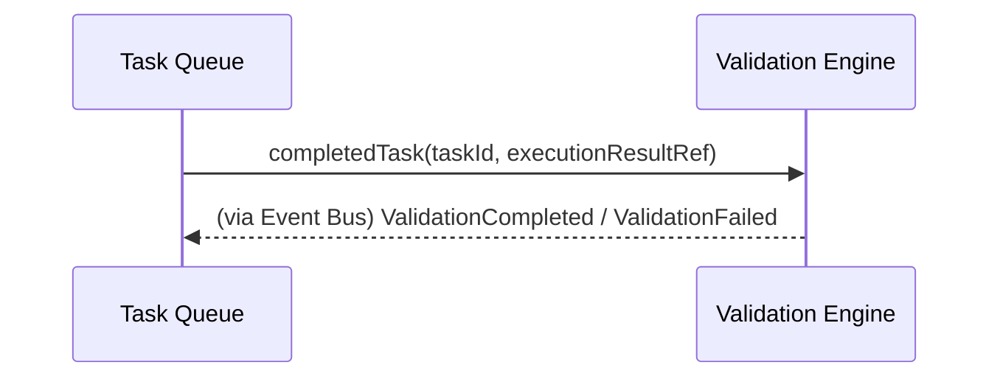

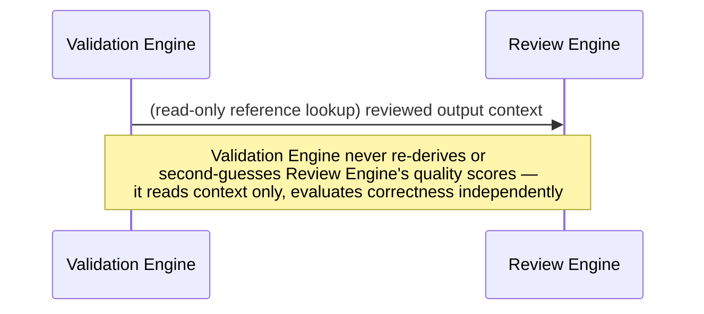

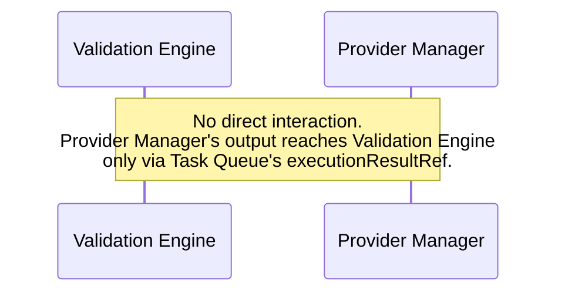

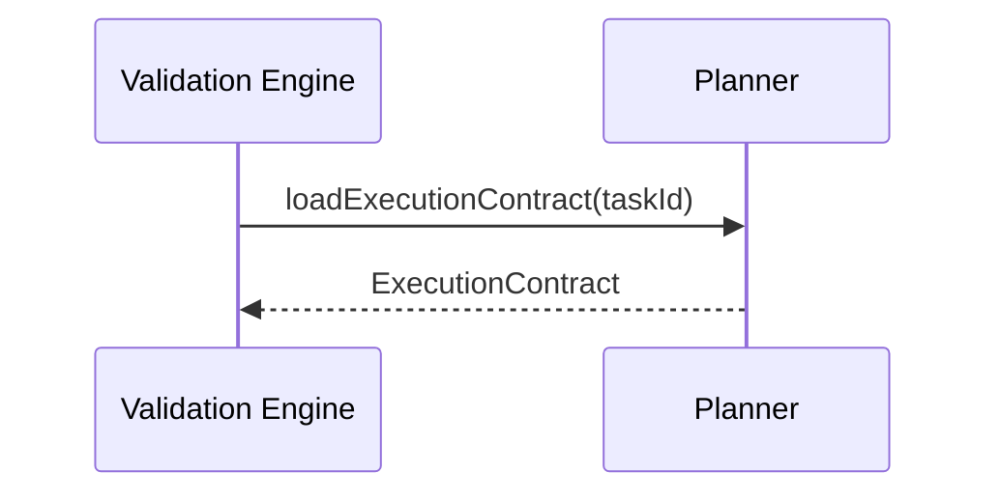

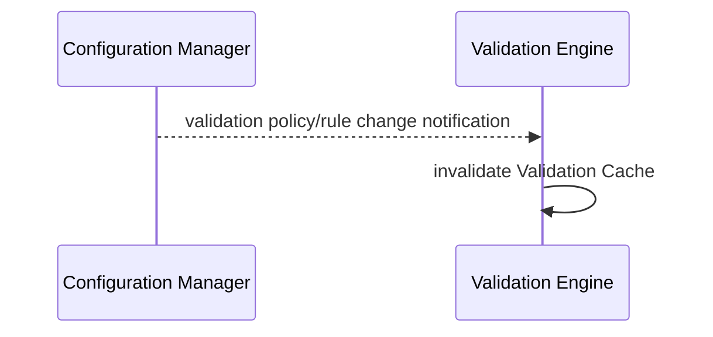

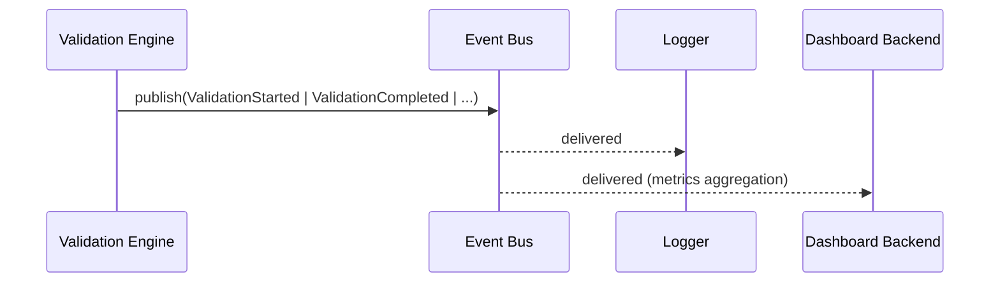

---

## 20. Folder Structure

```
validation-engine/
  application/
    validation-coordinator/        # §5.1
    schema-validator/                # §5.2
    business-rule-engine/             # §5.3
    policy-validator/                  # §5.4
    compliance-validator/               # §5.5
    security-validator/                  # §5.6
    contract-validator/                   # §5.7
    constraint-validator/                  # §5.8 — shared utility
    metadata-validator/                     # §5.9
    validation-pipeline/                     # §5.10
    validation-report-generator/              # §5.11
    validation-history-manager/                # §5.12
    validation-template-manager/                # §5.13
    validation-cache/                            # §5.14
    lifecycle-manager/                            # §5.15
  domain/
    entities/                      # ValidationReport, violations, results per stage (§7)
    rule-catalog/                   # versioned schema/rule/constraint definitions (§8, §9), config-loaded
    ports/
      task-queue-port/              # read-only, completed task info
      planner-port/                  # read-only, execution contracts
      config-port/
      event-bus-port/
      logger-port/
      validation-repository-port/     # Operational Storage, Validation History persistence
      cache-port/
  infrastructure/
    policy-change-listener/          # subscribes to Configuration Manager change notifications
  config/
    schema.*                          # validationEngine.* config schema (rules, policies, templates, pipeline order)
  tests/
    unit/
    integration/
    schema/
    business-rule/
    policy/
    compliance/
    security/
    performance/
    stress/
    chaos/
    regression/
```

Structurally mirrors the Review Engine's folder layout (Review Engine MDD §21) component-for-component wherever the two modules share an equivalent concern (Coordinator, Policy/Template management, History Manager, Cache, Lifecycle Manager), with validation-specific stage components replacing review-specific scoring components.

---

## 21. File Responsibilities

| File (conceptual) | Purpose | Public API | Private Logic | Dependencies |
|---|---|---|---|---|
| `validation-coordinator.*` | §5.1 | `validate` | Lifecycle sequencing | all components below |
| `schema-validator.*` | §5.2 | `validateSchema` | Schema conformance checking | rule-catalog |
| `business-rule-engine.*` | §5.3 | `validateBusinessRules` | Rule-set aggregation | ConstraintValidator |
| `policy-validator.*` | §5.4 | (internal) | Precedence resolution (§9) | ConfigPort, ValidationTemplateManager |
| `compliance-validator.*` | §5.5 | `validateCompliance` | Compliance-specific rule execution | ConstraintValidator |
| `security-validator.*` | §5.6 | `validateSecurity` | Security-specific rule execution | ConstraintValidator |
| `contract-validator.*` | §5.7 | (internal) | Contract-clause comparison | PlannerPort |
| `constraint-validator.*` | §5.8 | (internal, shared utility) | Generic constraint expression evaluation | — |
| `metadata-validator.*` | §5.9 | (internal) | Metadata envelope schema checking | — |
| `validation-pipeline.*` | §5.10 | (internal) | Stage sequencing, short-circuit, parallelism | Schema/Contract/BusinessRule/Security/ComplianceValidator |
| `validation-report-generator.*` | §5.11 | `generateValidationReport` | Report assembly, overall pass/fail computation | — |
| `validation-history-manager.*` | §5.12 | (internal, retrieval exposed separately) | Append-only persistence | ValidationRepositoryPort |
| `validation-template-manager.*` | §5.13 | (internal) | Template resolution | ConfigPort |
| `validation-cache.*` | §5.14 | (internal) | TTL/invalidation | CachePort |
| `lifecycle-manager.*` | §5.15 | (internal) | State machine enforcement | — |
| `ports/validation-repository-port.*` | Contract | `create`, `findById`, `query` (no `update`, per §16 immutability) | — | — |

---

## 22. Testing Strategy

- **Unit Tests**: each §5 component in isolation — Constraint Validator's expression evaluation correctness, Validation Report Generator's overall pass/fail aggregation rules, Lifecycle Manager's transition legality.
- **Schema Tests**: exhaustive coverage of JSON/XML schema conformance checking, including malformed-schema-definition error handling (§13).
- **Business Rule Tests**: coverage of every rule category (§9) — required fields, types, formats, ranges, regex, relationships, dependencies, cross-field, custom.
- **Policy Tests**: precedence rule correctness, override-rule audit logging, template resolution correctness — mirrors Review Engine MDD §23's identical policy-testing rationale.
- **Compliance Tests**: fail-safe behavior verification (§13) — a Compliance Validator execution error must always yield `passFail: false`, never a silent pass, tested explicitly as a first-class scenario.
- **Security Tests**: identical fail-safe verification for the Security Validator.
- **Performance Tests**: pipeline latency under large rule sets and large execution results, parallel-vs-sequential stage execution speedup measurement.
- **Stress Tests**: high-concurrency `validate` calls across many distinct tasks, verifying stateless-design correctness under load.
- **Chaos Tests**: simulated Configuration Manager unavailability, Planner unavailability, mid-pipeline component failures — verifying the fail-safe/degraded handling in §13 behaves exactly as specified.
- **Regression Tests**: golden-file tests locking in validation output for a fixed representative set of results/rules, catching unintended pipeline-logic drift.

---

## 23. Future Expansion

- **Plugin-based validators**: third-party validator logic follows the same `custom:*` namespacing pattern already established for rules (§9) — a new validator type implements the same stage-result contract (`{ satisfied, violation? }` shape) as any built-in validator.
- **Industry-specific validation packs**: additive Compliance Validator rule-set records (§5.5, §9) — no structural change.
- **Compliance frameworks**: new frameworks are new named rule-set configurations resolved by the Policy Validator (§5.4) — the Compliance Validator's execution logic is already generic over whatever framework configuration is supplied.
- **Dynamic rule loading**: hot-reload of rule/schema definitions without a restart is achievable by extending the existing policy-change-notification/cache-invalidation mechanism (§5.14, §19) already in place — no new architectural component needed, only a faster notification path.
- **AI-assisted validation**: introduced as an alternate Business Rule Engine or Contract Validator evaluation strategy for rules requiring semantic (not purely structural) judgment — explicitly bounded to stay within the correctness domain (e.g., "does this satisfy contract clause X," never "is this good"), selected via configuration, no change to Validation Coordinator or downstream components.
- **Streaming validation**: for very large execution results, validators could operate on streamed content rather than fully-materialized content — the port-based dependency on result content (§5.2, §5.3, etc.) is already abstracted enough to support a streaming adapter without changing validator interfaces.
- **Distributed validation clusters**: already the default assumption per §18 — no further architectural change needed, only deployment configuration.
- **Future validation engines**: any new validation strategy/algorithm is introduced as a new implementation behind the existing stable interfaces (§11) — never a modification of the pipeline sequencing in §5/§10.

---

## 24. Risks

| Risk | Category | Mitigation |
|---|---|---|
| Validation Engine and Review Engine logic drifting toward overlap over time (e.g., a "quality-flavored" business rule creeping into this module) | Architecture / Consistency | §1/§4's explicit boundary statement, reinforced in code review; any rule judging *goodness* rather than *conformance* is a signal to move it to Review Engine |
| Fail-safe compliance/security posture (§13) producing a high false-negative-to-`Inconclusive` rate if underlying evaluation logic is fragile | Correctness / Operational | Compliance/Security Tests (§22) specifically exercise the fail-safe path; monitoring (§15) tracks `Inconclusive` rate as a first-class signal distinct from genuine rule violations |
| Large, data-driven rule catalog (§9) authored by multiple teams producing inconsistent constraint expressions | Architecture / Consistency | Centralizing all generic expression evaluation in the single shared Constraint Validator (§5.8) rather than letting each validator reimplement range/format/regex logic independently |
| Immutable Validation History growing unbounded at hyperscale volume | Scalability | Time/project-partitioned storage (§18), archival/retention policy layered on without violating immutability — identical mitigation to Review Engine MDD §25 |
| Short-circuit mode configuration inconsistency across environments producing different diagnostic completeness between, e.g., staging and production | Maintenance | Pipeline configuration (§10) is itself audited/logged (Policy Logs, §14), making any environment discrepancy visible rather than silent |
| Parallel stage execution (§17) introducing nondeterministic ordering of `violations[]` in the report | Consistency | Validation Report Generator sorts violations deterministically (by stage, then `ruleId`) at assembly time, independent of execution order — identical approach to Review Engine MDD §25's evidence-ordering mitigation |

---

## 25. Design Decisions

| Decision | Rationale | Alternatives Considered | Trade-off |
|---|---|---|---|
| Validation Engine and Review Engine kept as fully separate modules with zero shared logic beyond the shared platform-wide patterns (policy precedence, immutable history) | Reflects a genuine conceptual split (structural/compliance correctness vs. qualitative/policy judgment) mandated by SDD §6.9/§6.10 and this document's explicit non-goals | Merging both into a single "Quality Gate" module | Merging would recreate the coupling the platform architecture explicitly avoids; kept separate for identical reasons already established in Review Engine MDD §26 |
| Compliance and Security evaluation errors fail-safe to `false`/`Inconclusive`, never an optimistic pass | Correctness verification (this module's entire purpose) must never silently assume validity when it cannot actually confirm it | Optimistic pass-through on evaluation error (matching Review Engine's/Capability Selector's degraded-but-proceeding posture) | This module deliberately diverges from the platform's general "degrade gracefully" pattern specifically for compliance/security, since the cost of a false pass in this domain (a non-compliant or insecure result reaching downstream consumers) is categorically worse than the cost of an unnecessary `Failed`/`Inconclusive` result requiring investigation |
| A single shared Constraint Validator (§5.8) used by Business Rule Engine, Compliance Validator, and Security Validator, rather than each owning independent constraint-evaluation logic | Avoids duplicated, potentially inconsistent implementations of the same fundamental operations (range/format/regex/cross-field checks) across validators that otherwise have very different domain purposes | Independent constraint logic per validator | A shared utility is a slightly larger, more general component to design well up front, but eliminates an entire class of "works in Business Rules but not in Compliance" inconsistency bugs |
| Short-circuit validation is opt-in (disabled by default), favoring complete diagnostic reports over fastest-possible-fail latency | A validation report's value as a diagnostic artifact (for the caller and for audit) is generally higher than the latency savings of stopping early, for the platform's typical (non-latency-critical) validation triggers | Short-circuit by default | Latency-sensitive contexts remain fully supported via explicit policy configuration, so no capability is lost — only the default posture favors completeness |
| `errorId`-level immutability and audit-history pattern deliberately copied verbatim from the Review Engine's design (Review Engine MDD §17, §26) rather than independently redesigned | Two sibling modules performing structurally analogous "assess a completed result, produce an immutable report" work should behave identically at the platform-integration level, reducing cognitive and operational overhead for engineers and operators working across both | Independently-designed immutability/history mechanisms per module | None significant — this is a case where consistency has no meaningful cost and clear benefit, given the modules' structural similarity |

---

## 26. Diagrams (Consolidated Reference)

**Component Diagram** — see §5.
**Validation Architecture Diagram** — see §1 (Architecture Position) and §5.
**Validation Lifecycle Diagram** — see §6.
**Validation Pipeline Diagram** — see §6 sequence diagram and §10.
**Rule Execution Flow** — see §9 and §5.8 (Constraint Validator).
**Sequence Diagrams** — see §6, §19.
**Folder Structure Diagram** — see §20.

---

## 27. Architectural Constraints

The Validation Engine is a correctness-only subsystem and must remain constrained to that role.

### 27.1 Invariant Boundaries
The Validation Engine must never:
- evaluate quality
- perform scoring
- generate recommendations
- execute tasks
- schedule work
- route requests
- communicate directly with provider SDKs
- select providers
- select AI models
- generate plans
- modify execution results
- manage memory
- store knowledge
- perform knowledge comparison
- retry execution

### 27.2 Allowed Behavior
The Validation Engine only:
- validates correctness
- evaluates structural and logical conformance
- evaluates policy and compliance adherence
- produces immutable validation artifacts
- publishes lifecycle events and audit evidence

### 27.3 Architectural Rule of Separation
Validation and Review remain separate by design. Validation answers "is this valid?"; Review answers "is this good?". The two systems must never substitute for each other.

---

## 28. Architecture Decision Records (ADRs)

### ADR-VE-01: Separation of Validation Engine from Review Engine
- **Decision**: Keep Validation Engine and Review Engine as separate modules with distinct responsibilities.
- **Context**: The platform requires a strict correctness layer and a separate quality layer.
- **Alternatives Considered**: Unified quality gate module; merged validation/review engine.
- **Rationale**: Correctness and quality are fundamentally different concerns and require different evidence models.
- **Consequences**: Clear ownership, simpler governance, and lower architectural coupling.

### ADR-VE-02: Policy-Driven Validation
- **Decision**: Validation behavior is governed by policies, templates, and rule catalogs rather than hardcoded logic.
- **Context**: Validation requirements vary by organization, namespace, compliance framework, and task type.
- **Alternatives Considered**: Hardcoded validation rules per task type; embedded policy logic in the coordinator.
- **Rationale**: Policy-driven validation supports extensibility and enterprise configurability without code changes.
- **Consequences**: Greater flexibility, but greater dependence on Configuration Manager-owned data integrity.

### ADR-VE-03: Data-Driven Rule Model
- **Decision**: Rules, constraints, policies, and templates are configuration-driven artifacts.
- **Context**: The platform requires scalable rule evolution without source-code churn.
- **Alternatives Considered**: Code-defined rule implementations.
- **Rationale**: Data-driven models make validation portable, versioned, and governable.
- **Consequences**: Operational complexity shifts to configuration governance.

### ADR-VE-04: Validation Pipeline Architecture
- **Decision**: Use a staged validation pipeline with configurable ordering, short-circuit behavior, and optional parallelism.
- **Context**: Different validation concerns must execute consistently while allowing policy-level optimization.
- **Alternatives Considered**: Single monolithic validator; ad hoc stage execution.
- **Rationale**: A pipeline structure supports determinism, explainability, and extensibility.
- **Consequences**: More explicit stage boundaries and stronger auditability.

### ADR-VE-05: Shared Constraint Validator
- **Decision**: Centralize generic constraint evaluation in one shared validator used across rule, compliance, and security paths.
- **Context**: The platform must avoid duplicated range/format/regex/cross-field logic.
- **Alternatives Considered**: Per-validator constraint implementations.
- **Rationale**: A single implementation improves consistency and reduces drift.
- **Consequences**: Shared utility becomes a critical compatibility dependency.

### ADR-VE-06: Immutable Validation Reports
- **Decision**: Validation Reports are immutable once created.
- **Context**: Validation results must be auditable, reproducible, and legally defensible.
- **Alternatives Considered**: Mutable reports with update semantics.
- **Rationale**: Immutability prevents tampering and preserves historical evidence.
- **Consequences**: Corrections become new records rather than updates.

### ADR-VE-07: Stateless Processing
- **Decision**: Validation execution is stateless per invocation and reconstructable from configuration and input context.
- **Context**: The platform requires scale-out and resilience.
- **Alternatives Considered**: Stateful in-memory validation sessions.
- **Rationale**: Stateless design enables horizontal scaling and disaster recovery.
- **Consequences**: All durable state must be persisted externally.

### ADR-VE-08: Event-Driven Lifecycle
- **Decision**: Validation lifecycle progress is broadcast as events through the Event Bus.
- **Context**: Platform-level observability and operational integration require decoupled notifications.
- **Alternatives Considered**: Direct synchronous callbacks.
- **Rationale**: Events decouple validation execution from downstream consumers.
- **Consequences**: A more extensible but asynchronous operational model.

### ADR-VE-09: Append-Only Validation History
- **Decision**: Validation History accepts only append operations.
- **Context**: Auditability and historical reproducibility require non-destructive persistence.
- **Alternatives Considered**: Updatable report history.
- **Rationale**: Append-only storage preserves lineage and avoids accidental history corruption.
- **Consequences**: Stronger audit guarantees and simpler compliance posture.

### ADR-VE-10: Clean Architecture
- **Decision**: Keep the module structured around explicit application, domain, and infrastructure concerns.
- **Context**: The design must support changing policies and validators without modifying core behavior.
- **Alternatives Considered**: Tightly coupled service-oriented implementation.
- **Rationale**: Clean architecture improves maintainability and future extension.
- **Consequences**: Slightly more modular structure, but lower long-term maintenance cost.

### ADR-VE-11: Hexagonal Architecture
- **Decision**: Expose stable ports to external systems while keeping the domain logic independent of transport details.
- **Context**: Validation must integrate with Task Queue, Planner, Configuration Manager, and storage in a stable, replaceable manner.
- **Alternatives Considered**: Direct dependency on concrete infrastructure components.
- **Rationale**: Hexagonal boundaries protect the validation domain from change.
- **Consequences**: Better testability, stronger isolation, and easier platform evolution.

---

## 29. Validation Versioning Governance

### 29.1 Versioning Principles
Validation artifacts must be versioned explicitly and treated as immutable evidence.

### 29.2 Versioned Entities
- **Validation schema versioning**: every schema revision is assigned a version and recorded in the Validation Report.
- **Rule versioning**: each rule has a version, ownership metadata, and change history.
- **Constraint versioning**: each constraint expression is versioned independently from the parent rule.
- **Policy versioning**: each effective policy set is versioned and tied to the validation execution context.
- **Template versioning**: templates are versioned so that policy resolution remains reproducible.
- **Validation pipeline versioning**: the stage ordering and execution model is versioned as part of the validation engine configuration.
- **Validation engine versioning**: the engine implementation version is recorded to explain behavior drift across upgrades.

### 29.3 Compatibility and Reproducibility
- Backward compatibility is required for all published schema, rule, and policy versions.
- Historical reproducibility must be preserved for every completed validation report.
- Audit requirements mandate that a historical validation must be reconstructible using the same schema, rule, policy, template, and engine versions that were originally applied.

---

## 30. Ownership Matrix

| Concern | Owner | Notes |
|---|---|---|
| Validation lifecycle | Validation Engine | Owns start, progression, completion, and failure handling |
| Schema validation | Validation Engine | Owns structural conformance evaluation |
| Contract validation | Validation Engine | Owns correctness against Planner-issued execution contracts |
| Business rule validation | Validation Engine | Owns declarative domain-rule evaluation |
| Constraint validation | Validation Engine | Owns shared low-level constraint execution |
| Metadata validation | Validation Engine | Owns metadata envelope correctness |
| Security validation | Validation Engine | Owns security correctness checks |
| Compliance validation | Validation Engine | Owns mandatory compliance correctness checks |
| Validation pipeline | Validation Engine | Owns stage ordering and execution policy |
| Validation reports | Validation Engine | Owns report assembly and publication |
| Validation history | Validation Engine | Owns append-only persistence and retrieval |
| Validation templates | Validation Engine | Owns template definitions and resolution |
| Execution contracts | Planner | Owns the contract specification itself |
| Validation rules, templates, and policies | Configuration Manager | Owns source-of-truth data definitions |
| Execution coordination | Task Queue | Owns execution scheduling and dispatch |
| Execution | Provider Manager | Owns provider-side execution behavior |
| Event transport | Event Bus | Owns event delivery semantics |
| Quality assessment | Review Engine | Owns quality scoring and subjective evaluation |

---

## 31. Processing Guarantees

The Validation Engine provides the following guarantees:
- Deterministic validation execution for a given input, policy set, and engine version.
- Deterministic pipeline behavior for the same effective configuration.
- Immutable Validation Reports and immutable Validation History.
- Reproducible rule and policy execution.
- Traceable validation outcomes through rule identifiers, stage identifiers, and report lineage.
- Stateless execution that can be restarted without losing correctness evidence.
- Complete audit history for each validation.
- Fail-safe compliance and security behavior in which ambiguity defaults to a non-passing outcome.

---

## 32. Validation Identity Model

| Identifier | Ownership | Uniqueness | Lifecycle |
|---|---|---|---|
| `validationId` | Validation Engine | Unique per Validation Report | Created once per validation attempt |
| `executionId` | Task/Execution domain | Unique per execution instance | Persistent for the underlying execution |
| `taskId` | Task Queue | Unique per task record | Persistent across retries and re-executions |
| `workflowId` | Planner/Orchestrator | Unique per workflow instance | Persistent across task execution |
| `contractId` | Planner | Unique per execution contract | Persistent with the associated workflow/task |
| `schemaId` | Configuration Manager | Unique per schema version | Versioned and retained for history |
| `ruleId` | Configuration Manager | Unique per rule definition | Versioned and governable |
| `constraintId` | Validation Engine / Configuration Manager | Unique per constraint expression | Versioned and retained |
| `templateId` | Configuration Manager | Unique per template definition | Versioned and governable |
| `policyId` | Configuration Manager | Unique per policy definition | Versioned and governable |
| `organizationId` | Platform tenancy model | Unique per organization | Persistent |
| `namespaceId` | Platform tenancy model | Unique per namespace scope | Persistent |
| `requestId` | Request Manager | Unique per inbound request | Short-lived to long-lived depending on system |
| `correlationId` | Platform middleware | Unique per correlated request chain | Propagated across services |
| `traceId` | Observability platform | Unique per end-to-end trace | Propagated across services |
| `spanId` | Observability platform | Unique per local operation | Short-lived |

All identifiers must be preserved in logs, events, and reports so that validation evidence remains traceable end to end.

---

## 33. Operational Limits

| Limit | Default / Recommended Range | Governance |
|---|---|---|
| Maximum schema size | Configurable, enterprise default based on payload profile | Enforced by policy |
| Maximum rule count | Policy-defined upper bound | Must remain within configured capacity |
| Maximum constraint count | Policy-defined upper bound | Must remain within configured capacity |
| Maximum validation stages | Fixed by pipeline model, configurable by policy | Must not exceed supported engine capabilities |
| Maximum template complexity | Policy-defined upper bound | Enforced during template load |
| Maximum metadata size | Policy-defined upper bound | Enforced at ingestion |
| Maximum report size | Policy-defined upper bound | Prevents unbounded audit growth |
| Maximum concurrent validations | Capacity-based, environment-specific | Bounded by resource policy |
| Cache limits | Configurable per environment | Must prevent memory exhaustion |
| Retention periods | Policy-defined and auditable | Enforced by storage lifecycle policy |

---

## 34. Observability Standards

Every validation execution must emit observability data sufficient for operational diagnosis and audit review.

### 34.1 Required Correlation Fields
- `validationId`
- `executionId`
- `taskId`
- `requestId`
- `correlationId`
- `traceId`
- `spanId`

### 34.2 Required Metrics
- validation duration
- schema validation latency
- contract validation latency
- business rule latency
- compliance latency
- security latency
- throughput
- validation failures
- rule execution counts
- cache utilization
- degraded mode indicators

### 34.3 Operational Reporting
Observability output must be emitted to logs, metrics, and dashboard systems in a consistent format so that validation health can be monitored independently from review health.

---

## 35. Rule Governance

### 35.1 Rule Ownership
Each rule must have a named owner and an explicit domain of responsibility.

### 35.2 Rule Lifecycle
Rules must move through defined lifecycle states: draft, approved, active, deprecated, retired.

### 35.3 Rule Approval
No rule becomes active until it has been approved by the owning governance authority and associated with a versioned policy context.

### 35.4 Rule Versioning
Rule changes must create a new version and never silently alter the behavior of an existing active rule version.

### 35.5 Rule Deprecation
Deprecated rules must remain available for historical reproducibility but must not be used for new validations unless explicitly re-enabled.

### 35.6 Constraint Governance
All constraints used by rules must be reviewed for consistency, clarity, and compatibility with the shared Constraint Validator.

### 35.7 Severity Governance
Severity assignments must be policy-governed and auditable, not implicitly determined by implementation details.

### 35.8 Custom Rule Governance
Custom rules must be namespaced, versioned, and reviewed before use in enterprise environments.

### 35.9 Validation Consistency Requirements
The same rule definition must produce the same result for the same data under the same policy and engine version.

---

## 36. Policy Governance

### 36.1 Policy Ownership
Policies are owned by Configuration Manager and must be governed through the platform's change-management workflow.

### 36.2 Policy Precedence
Policy precedence remains explicit and deterministically ordered. Higher-precedence policies override lower-precedence policies only where permitted by the precedence model.

### 36.3 Override Authorization
Overrides that relax compliance or security validation must require authorized approval and must be logged as privileged actions.

### 36.4 Compliance Protection
Compliance-related policies must be protected from unauthorized weakening and must retain a complete lineage of authorizations.

### 36.5 Security Policy Governance
Security policies must follow the same versioning, ownership, and audit rules as validation rules.

### 36.6 Template Governance
Validation templates must be versioned, approved, and governed through the same release process as policies.

### 36.7 Publication Workflow
New policies, templates, and rule packs are published via an auditable workflow before activation in production environments.

### 36.8 Version Lineage
Policy lineage must preserve the relationship between parent policy, derived policy, and effective policy set used by each validation.

### 36.9 Audit Requirements
Policy changes and policy application outcomes must be recorded for audit and reproducibility.

---

## 37. Failure Recovery Guarantees

The Validation Engine must preserve correctness and audit evidence even in the presence of failures.

- Validation failures never corrupt Validation History.
- Failed validations never produce partial reports.
- Cache failures never compromise correctness; the system degrades safely and preserves evidence of the failure condition.
- Stateless restart guarantees allow validations to be retried or re-executed without inconsistent state.
- Graceful degradation is permitted only when the system can preserve a truthful, non-optimistic outcome.
- Safe rolling upgrades must preserve compatibility with existing policies, templates, and report schemas.
- Distributed recovery behavior must ensure a node failure does not lose the ability to reproduce a validation result.
- Compliance fail-safe guarantees require that ambiguity or infrastructure failure cannot silently produce a pass.

---

## 38. Security Governance

### 38.1 Validation Integrity
Validation results must remain trustworthy and unaltered after publication.

### 38.2 Rule Integrity
Rules and constraint logic must be protected from unauthorized modification and must be versioned and audited.

### 38.3 Policy Integrity
Policies must be enforced as authored and published, with full lineage and approval evidence.

### 38.4 Compliance Integrity
Compliance validations must preserve their fail-safe semantics and audit trail.

### 38.5 Multi-Tenant Isolation
Validation data and policy resolution must remain isolated by organization and namespace boundaries.

### 38.6 Authorization Governance
Privileged overrides and policy changes require explicit authorization and traceable audit evidence.

### 38.7 Immutable Audit Logs
Validation outcomes, policy application, and override events must be emitted to immutable audit logs.

### 38.8 Historical Reproducibility
Security and compliance evidence must remain reproducible from the stored report and version lineage.

---

## 39. Future Scalability Governance

The Validation Engine is architecturally prepared for enterprise-scale evolution.

### 39.1 Distributed Validation Clusters
The module is compatible with distributed validation clusters and does not require hardcoded instance affinity.

### 39.2 Plugin-Based Validators
New validator implementations may be introduced through configuration and plugin registration patterns without changing the core validation contract.

### 39.3 Industry-Specific Validation Packs
The validation model supports domain-specific rule packs and compliance packs as additive content.

### 39.4 Dynamic Rule Loading
Rule loading can be expanded to support hot reload and dynamic policy propagation through the existing cache invalidation model.

### 39.5 AI-Assisted Validation
AI-assisted validation can be introduced as a bounded extension inside the correctness domain, without changing the module's architectural boundaries.

### 39.6 Streaming Validation
Validation can evolve to support streaming large payloads while preserving the same report and history contract.

### 39.7 Multi-Region and Active-Active Deployment
The module remains compatible with multi-region deployment and active-active operation when storage and event transport are configured accordingly.

### 39.8 Hyperscale Enterprise Operation
All governance mechanisms above support hyperscale enterprise operation through policy-driven scaling, versioned rule catalogs, immutable evidence, and distributed observability.

---

*End of document.*
