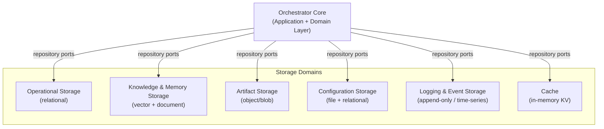
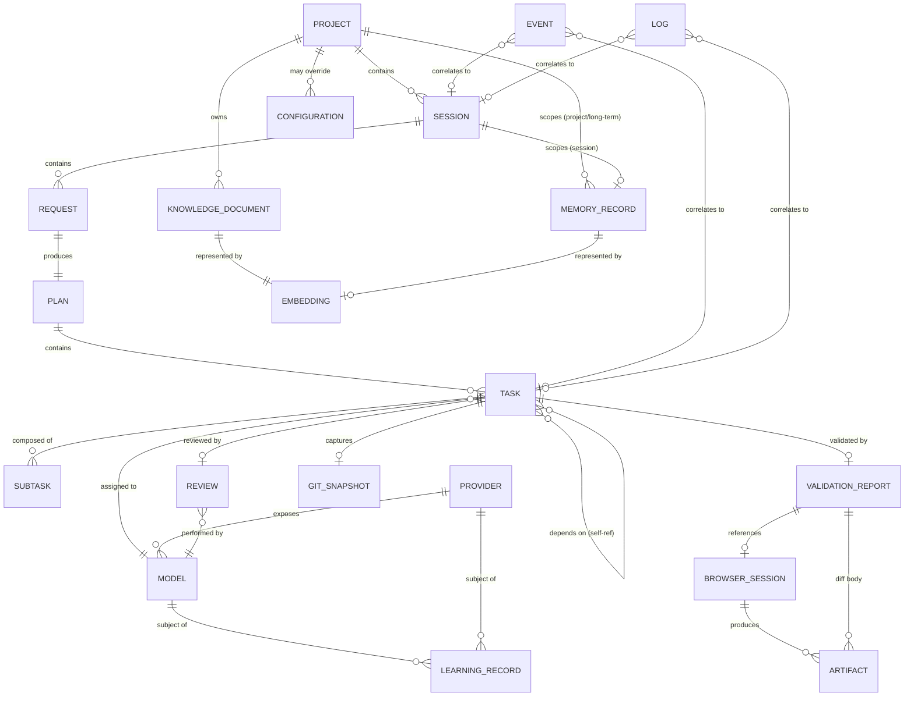
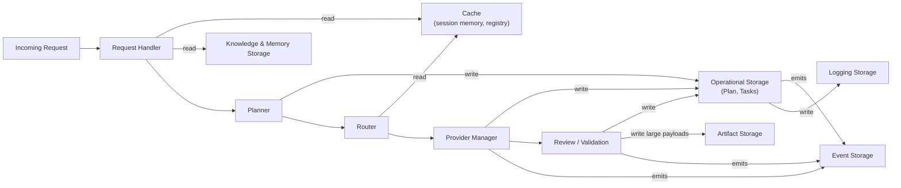
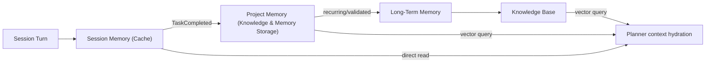
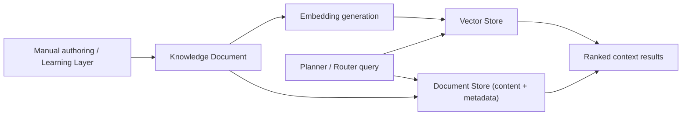
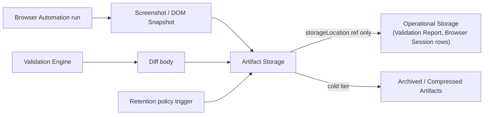

# Database Design Document (DDD)
## Hybrid AI Development Platform — Storage Layer

**Version:** 1.1
**Status:** Draft for engineering review
**Companion to:** Orchestrator SDD v1.0, API Specification Document v1.0

---

## 1. Executive Summary

This document defines the complete storage architecture for the Orchestrator: what data exists, why it exists, where it lives, how it relates, how it moves through its lifecycle, and how the system scales, secures, backs up, and recovers it.

The storage layer is deliberately **polyglot and domain-separated**: no single database serves every need. Operational state (tasks, sessions, providers), knowledge/memory (durable project understanding, embeddings), artifacts (screenshots, reports, logs), and configuration are each stored in the technology best suited to their access pattern, behind a common set of repository ports so the Domain Layer (per the SDD) never depends on a specific storage technology. This mirrors the Orchestrator Core's own Clean/Hexagonal Architecture: storage is an adapter, never a dependency of core logic.

No SQL or implementation code is included — this document specifies entities, relationships, lifecycles, and storage-domain placement so an implementation team can build the storage layer without making architectural decisions of their own.

---

## 2. Database Design Goals

| Goal | Rationale |
|---|---|
| **Technology-agnostic domain model** | Core entities are defined independent of any specific database product; storage adapters implement repository ports (mirrors SDD §3 Dependency Inversion). |
| **Domain-separated storage** | Operational, knowledge, artifact, config, and log data have fundamentally different access patterns and must not share a single store. |
| **Provider independence** | No schema encodes a specific vendor; providers/models are data rows, never table names or enum-hardcoded types. |
| **Multi-project readiness** | Every entity is project-scoped from day one, even though the current deployment target is single-user, single-machine. |
| **Auditable and replayable** | Every state-changing action is traceable to an event and a correlation ID, enabling full replay/debugging. |
| **Performance at scale** | Indexing, caching, and partitioning strategy defined up front for thousands of tasks and millions of events. |
| **Security and data isolation by design** | Secrets, project data, and logs are isolated at the storage layer, not just the application layer. |
| **Backup/recoverable by construction** | Every store has an explicit backup and recovery story from day one, not bolted on later. |
| **Extensible without migration pain** | New entity types, providers, or plugins are additive rows/documents, not schema rewrites. |

---

## 3. Data Architecture Overview

The storage layer is organized into **six logical domains**, each owned by a distinct part of the Orchestrator Core and backed by the storage technology best matched to its access pattern:

**Domain-to-technology mapping (recommended, not mandated):**

| Domain | Recommended technology class | Why |
|---|---|---|
| Operational Storage | Relational (e.g., PostgreSQL/SQLite) | Strong consistency, relational integrity for tasks/sessions/providers |
| Knowledge & Memory Storage | Vector store + document store | Similarity search for embeddings, flexible schema for knowledge documents |
| Artifact Storage | Object/blob storage (filesystem or S3-compatible) | Large binary payloads (screenshots, reports) don't belong in a relational row |
| Configuration Storage | Versioned files + relational overlay | Config-first per SDD §13, with relational storage for dashboard-managed overrides |
| Logging & Event Storage | Append-only / time-series store | High write volume, sequential access, retention-policy-driven |
| Cache | In-memory KV (e.g., Redis-class) | Ephemeral, high-frequency reads (registry lookups, session state) |

This is a **logical** separation — a small deployment may collapse several of these into one physical database engine (e.g., SQLite for both Operational and Configuration in a single-user local install), provided the repository port boundaries are respected so a later split requires no core changes.

---

## 4. Storage Architecture (Logical Domains, Detailed)

### 4.1 Operational Storage
- **Purpose**: System-of-record for everything the Orchestrator needs to execute and track a request — Projects, Sessions, Requests, Tasks, Plans, Subtasks, Provider/Model registries, Reviews, Validation Reports (metadata), Git snapshots (metadata).
- **Access pattern**: Frequent reads/writes, strong consistency required (a task must not be double-executed), relational integrity between Task → Plan → Session → Project.
- **Lifetime**: Persistent, project-scoped, retained per configured retention policy.

### 4.2 Knowledge & Memory Storage
- **Purpose**: Durable project understanding — Knowledge Documents, Memory Records, Embeddings, Context Snapshots, Knowledge Comparison History.
- **Access pattern**: Similarity search (vector), tag/metadata filtering (document), moderate write volume, high read volume during planning/context-hydration.
- **Lifetime**: Persistent, promotable (session → project → long-term, per SDD §16).

### 4.3 Artifact Storage
- **Purpose**: Large binary or semi-structured outputs — Screenshots, DOM snapshots, console logs, browser reports, generated documents/code reports, validation report bodies.
- **Access pattern**: Write-once-read-occasionally, large payloads, referenced by ID from Operational Storage rather than embedded.
- **Lifetime**: Persistent but subject to aggressive archiving/compression (§18) since volume grows fastest here.

### 4.4 Configuration Storage
- **Purpose**: Providers, routing rules, model preferences, runtime profiles, dashboard settings, feature flags, environment mode.
- **Access pattern**: Infrequent writes, frequent reads (cached), hot-reload on change.
- **Lifetime**: Persistent, versioned (every change is a new version, not an overwrite — enables rollback).

### 4.5 Logging Storage
- **Purpose**: Application logs, provider logs, API logs, performance metrics, audit logs, security logs, debug logs, and the full Event Bus history.
- **Access pattern**: Very high write volume, append-only, time-ordered, queried by correlation ID or time range.
- **Lifetime**: Tiered — hot (recent, fast query) → cold (archived, compressed) → purged per retention policy.

### 4.6 Cache
- **Purpose**: Ephemeral acceleration layer — Model Registry snapshot, Live Memory for active sessions, hot Knowledge Base query results, provider health status.
- **Access pattern**: Very high read frequency, short TTL, never the source of truth.
- **Lifetime**: Transient — always reconstructable from Operational/Knowledge storage; a cache flush must never lose data.

---

## 5. Data Classification

| Class | Definition | Examples | Storage domain |
|---|---|---|---|
| **Persistent Data** | Survives restarts, is the system of record | Projects, Tasks, Knowledge Documents, Provider config | Operational, Knowledge, Configuration |
| **Temporary Data** | Exists only for the duration of an operation | In-flight task execution buffers, streaming chunk assembly | Cache / in-process (not persisted) |
| **Runtime State** | Reconstructable operational status | Provider health, queue depth, active session pointers | Cache (backed by Operational for durability) |
| **Session Data** | Scoped to one user interaction session | Live Memory, session-scoped context | Cache + Operational (session record) |
| **Cached Data** | Derived/duplicated for performance, never authoritative | Model Registry snapshot, hot KB query results | Cache |
| **Historical Data** | Retained for audit/analysis, rarely queried live | Completed task history, past reviews, past events | Operational / Logging (cold tier) |
| **Archive Data** | Compressed, moved to cheap storage, retrieval is deliberate/slow | Old artifacts, purged-tier logs | Artifact/Logging (archive tier) |

---

## 6. Core Entities

Each entity below specifies Purpose, Attributes (conceptual, not typed schema), Relationships, Lifecycle, Validation Rules, Ownership, and Future Expansion. Full field-level schema (keys, indexes) is in §8.

### 6.1 Project
- **Purpose**: Top-level namespace for all work — the multi-project boundary.
- **Attributes**: name, repo path (optional), default routing profile, created/updated timestamps, status (active/archived).
- **Relationships**: 1-to-many with Sessions, Tasks, Knowledge Documents, Memory Records, Configurations (overrides).
- **Lifecycle**: created explicitly (`POST /v1/projects`) → active → optionally archived (soft-delete, retains history).
- **Validation**: unique name per install; repo path, if present, must be a valid accessible path at creation time (soft-validated, not blocking).
- **Ownership**: Application Layer (Project Manager use case, not separately defined as a component but implied by `/v1/projects` per ASD §2.4).
- **Future expansion**: multi-user ownership/ACL field, org/team namespace.

### 6.2 Session
- **Purpose**: A bounded interaction window (roughly: one VS Code chat conversation).
- **Attributes**: projectId, startedAt, lastActivityAt, status (active/idle/closed), client metadata.
- **Relationships**: belongs to one Project; 1-to-many with Requests; 1-to-one with a Live Memory record.
- **Lifecycle**: created on first request → active while requests flow → idle after timeout → closed (memory demoted/promoted per SDD §16).
- **Validation**: must reference a valid, non-archived Project.
- **Ownership**: Request Handler / Memory Manager.
- **Future expansion**: multi-client sessions (same session across devices).

### 6.3 Request
- **Purpose**: One inbound chat-completion call.
- **Attributes**: sessionId, receivedAt, rawMessagesRef (artifact or inline), routingPreferences, status.
- **Relationships**: belongs to one Session; produces exactly one Plan.
- **Lifecycle**: Received → Planning → Dispatched → Completed/PartiallyCompleted (mirrors SDD §25 session state machine).
- **Validation**: must contain at least one message; session must be active.
- **Ownership**: Request Handler.
- **Future expansion**: request replay/simulation support.

### 6.4 Plan
- **Purpose**: The task DAG produced by the Planner for one Request.
- **Attributes**: requestId, strategyUsed, createdAt, status.
- **Relationships**: belongs to one Request; 1-to-many with Tasks (DAG edges modeled via Task.dependsOn).
- **Lifecycle**: created → all tasks resolve → Plan marked Completed/Failed/PartiallyCompleted.
- **Validation**: DAG must be acyclic (enforced at Planner level, verified at persistence).
- **Ownership**: Planner.
- **Future expansion**: plan versioning for re-planning mid-execution.

### 6.5 Task
- **Purpose**: A single unit of orchestrated work (routing → execution → review → validation).
- **Attributes**: planId, requiredCapabilities[], dependsOn[] (other taskIds), status (mirrors SDD §25 Task state machine: Pending/Routing/Executing/Reviewing/Validating/Completed/Failed/CompletedWithWarnings), retryCount, assignedProviderId, assignedModelId.
- **Relationships**: belongs to one Plan; may depend on other Tasks (many-to-many self-referential); produces zero-or-one Review, zero-or-one Validation Report.
- **Lifecycle**: full state machine per SDD §25.
- **Validation**: `dependsOn` tasks must belong to the same Plan; retryCount bounded by configured max.
- **Ownership**: Task Queue.
- **Future expansion**: sub-plans (a Task spawning its own nested Plan) for deeply hierarchical work.

### 6.6 Subtask
- **Purpose**: Optional finer-grained breakdown within a Task for complex multi-step execution (e.g., a coding task broken into "read file", "edit", "verify").
- **Attributes**: taskId, order, description, status.
- **Relationships**: belongs to one Task (composition — a Subtask has no independent lifecycle outside its Task).
- **Lifecycle**: created with the Task, resolved before the Task can transition out of `Executing`.
- **Validation**: order must be unique within a Task.
- **Ownership**: Task Queue / Provider Manager during execution.
- **Future expansion**: subtask-level provider assignment for hybrid single-task multi-model execution.

### 6.7 Provider
- **Purpose**: A registered provider plugin instance (see §11 for full registry design).
- **Attributes**: providerId, type (cloud/local), enabled, credentialRef (never the raw secret — see §19), healthStatus, lastCheckedAt.
- **Relationships**: 1-to-many with Model entries.
- **Lifecycle**: registered at boot/config load → health-monitored continuously → disabled/removed via config change.
- **Validation**: providerId globally unique; credentialRef must resolve in the Secret Store if enabled.
- **Ownership**: Provider Manager / Configuration Manager.
- **Future expansion**: per-project provider allow/deny lists.

### 6.8 Model
- **Purpose**: A specific model exposed by a Provider (see §12).
- **Attributes**: modelId, providerId, capabilities[], contextWindow, costPerToken, latencyEstimateMs, priorityWeight, availability, health.
- **Relationships**: belongs to one Provider; referenced by many Tasks (as assignedModelId).
- **Lifecycle**: populated from provider `listModels()` or manual config → refreshed periodically → deprecated/removed.
- **Validation**: capabilities must be from the controlled capability-tag vocabulary (SDD §11).
- **Ownership**: Provider Manager (writer), Router (reader).
- **Future expansion**: per-model fine-tuning/version lineage tracking.

### 6.9 Configuration
- **Purpose**: A versioned snapshot of system/routing/provider settings (§10).
- **Attributes**: scope (system/project/profile), version, effectiveAt, payload (schema-validated), changedBy.
- **Relationships**: optionally scoped to a Project; supersedes a prior Configuration version (self-referential "previous version" link).
- **Lifecycle**: new version created on every change (§20 Versioning); never overwritten in place.
- **Validation**: payload must pass Configuration Manager schema validation before persistence.
- **Ownership**: Configuration Manager.
- **Future expansion**: per-user config overlays for multi-user mode.

### 6.10 Event
- **Purpose**: Immutable record of every domain occurrence (§16).
- **Attributes**: eventType, sessionId, taskId, timestamp, payload, correlationId.
- **Relationships**: loosely references Session/Task/Plan by ID (no hard foreign key, since events must persist even if the referenced entity is later purged).
- **Lifecycle**: append-only, never updated, retained/archived/purged per policy.
- **Validation**: eventType must be from the known catalog (SDD §8); unknown types are still stored but flagged for schema review.
- **Ownership**: Event Bus.
- **Future expansion**: event schema versioning as new event types are added.

### 6.11 Log
- **Purpose**: Structured, correlated diagnostic output (§17).
- **Attributes**: level, component, message, correlationId, timestamp.
- **Relationships**: correlates to Session/Task via correlationId (soft reference, like Event).
- **Lifecycle**: append-only, tiered retention.
- **Validation**: secrets must be redacted before persistence (Security Layer responsibility, enforced at write boundary).
- **Ownership**: Logger.
- **Future expansion**: structured log schema per component for richer dashboard filtering.

### 6.12 Review
- **Purpose**: Result of a Review Engine pass on a Task's output.
- **Attributes**: taskId, reviewerModelId, approved, notes, createdAt.
- **Relationships**: belongs to one Task (0-or-1 per execution attempt, many across retries).
- **Lifecycle**: created on `ReviewCompleted`; immutable once written (a new attempt creates a new Review, not an edit).
- **Validation**: reviewerModelId must reference a valid Model.
- **Ownership**: Review Engine.
- **Future expansion**: multi-reviewer consensus records.

### 6.13 Validation Report
- **Purpose**: Result of the Validation Engine / Knowledge Comparison for a Task.
- **Attributes**: taskId, pass, severity, diffRef (pointer to Artifact Storage for the full diff body), createdAt.
- **Relationships**: belongs to one Task; may reference a Browser Session.
- **Lifecycle**: created on validation completion; immutable.
- **Validation**: diffRef must resolve in Artifact Storage.
- **Ownership**: Validation Engine / Knowledge Comparison Engine.
- **Future expansion**: severity taxonomy expansion (currently pass/fail/inconclusive + severity level).

### 6.14 Browser Session
- **Purpose**: Record of one Browser Automation run.
- **Attributes**: taskId (optional, may be standalone via `/v1/browser/run`), targetUrl, startedAt, durationMs, screenshotRefs[], domSnapshotRef.
- **Relationships**: optionally belongs to a Task; owns many Artifact references.
- **Lifecycle**: created at run start, finalized at completion or timeout.
- **Validation**: targetUrl must be well-formed.
- **Ownership**: Browser Automation / Vision Pipeline.
- **Future expansion**: multi-page session traces for complex validation flows.

### 6.15 Git Snapshot
- **Purpose**: Metadata about repository state relevant to a Task or Session (not a full git mirror).
- **Attributes**: taskId/sessionId, commitHash, branch, dirtyFiles[], capturedAt.
- **Relationships**: soft reference to Task/Session.
- **Lifecycle**: captured before/after task execution for diff-aware context and rollback reference.
- **Validation**: commitHash must be a valid hash format (not verified against the actual repo at write time — advisory metadata).
- **Ownership**: Git Manager.
- **Future expansion**: full commit-graph tracking for auto-commit workflows.

### 6.16 Learning Record
- **Purpose**: Aggregated outcome signal feeding Model Registry priority and Knowledge Base promotion (SDD §6.20).
- **Attributes**: subjectType (model/provider/pattern), subjectId, signalType (success/failure/regression), weight, observedAt.
- **Relationships**: soft reference to Model/Provider/Task.
- **Lifecycle**: append-only observations; periodically aggregated into rollup statistics (not overwritten, aggregation is a derived read).
- **Validation**: signalType from a controlled vocabulary.
- **Ownership**: Learning Layer.
- **Future expansion**: per-project learning isolation vs. global learning.

### 6.17 Knowledge Document
- **Purpose**: Durable project knowledge — architecture docs, PRDs, coding standards, business rules, decisions, learned rules, design patterns (§14).
- **Attributes**: projectId, type, title, content (or artifact ref for large documents), tags[], embeddingRef, createdAt, updatedAt, sourceType (manual/derived).
- **Relationships**: belongs to one Project; 1-to-one with an Embedding record; may supersede a prior Knowledge Document version.
- **Lifecycle**: created (manual or derived from Learning Layer) → updated (new version) → optionally deprecated.
- **Validation**: type must be from controlled vocabulary; content or artifact ref required.
- **Ownership**: Knowledge Base.
- **Future expansion**: cross-project shared knowledge documents (org-level pattern libraries).

### 6.18 Memory Record
- **Purpose**: Working or promoted context — session-scoped or project-scoped facts (§9).
- **Attributes**: scope (session/project/long-term), sessionId or projectId, content, importance, createdAt, expiresAt (nullable for durable scopes).
- **Relationships**: belongs to Session or Project depending on scope; may be promoted (creates a new record at a broader scope, original retained for audit).
- **Lifecycle**: session-scoped records expire with the session unless promoted; project/long-term records persist until explicitly pruned.
- **Validation**: expiresAt required for session scope, forbidden for long-term scope.
- **Ownership**: Memory Manager.
- **Future expansion**: importance-decay scoring for automatic pruning.

### 6.19 Embedding
- **Purpose**: Vector representation of a Knowledge Document or Memory Record for similarity search.
- **Attributes**: sourceType (knowledgeDocument/memoryRecord), sourceId, vector, model (embedding model used), createdAt.
- **Relationships**: 1-to-1 with its source entity.
- **Lifecycle**: regenerated whenever the source content changes (old vector superseded, not blended).
- **Validation**: vector dimensionality must match the configured embedding model's output.
- **Ownership**: Knowledge Base (write), Router/Planner (read, indirectly via retrieval).
- **Future expansion**: multi-embedding-model support (storing vectors from more than one embedding model per source for migration/comparison).

### 6.20 Artifact
- **Purpose**: Generic large-binary/semi-structured payload container (§15).
- **Attributes**: artifactType (screenshot/domSnapshot/report/document/log), ownerRef (Task/BrowserSession/Review/etc.), storageLocation, sizeBytes, contentHash, createdAt, retentionTier.
- **Relationships**: referenced by many other entities (Validation Report, Browser Session, Review) rather than owning them.
- **Lifecycle**: created on write → hot tier → archived → purged per retention policy (§18).
- **Validation**: contentHash verified on write for integrity.
- **Ownership**: Artifact Storage subsystem (a thin storage-domain service, not a component in the SDD's orchestration path).
- **Future expansion**: content-addressable dedup across projects.

---

## 7. Entity Relationship Design

**Relationship types explained:**

| Type | Example | Notes |
|---|---|---|
| One-to-One | Task ↔ (current) Git Snapshot at capture point; Knowledge Document ↔ Embedding | Enforced by unique foreign key |
| One-to-Many | Project → Sessions; Plan → Tasks; Provider → Models | Standard parent/child, parent owns lifecycle |
| Many-to-Many | Task ↔ Task (dependency DAG) | Resolved via a join table (`task_dependencies`), not a direct FK, since a Task can depend on multiple Tasks and be depended on by multiple |
| Composition | Task → Subtask | Subtask has no lifecycle independent of its Task; deleting a Task cascades to its Subtasks |
| Aggregation | Validation Report → Artifact | Artifact can outlive/be referenced beyond a single Validation Report (e.g., shared screenshot referenced by both a Browser Session and a Validation Report) |
| Soft Reference (no hard FK) | Event/Log → Session/Task | Deliberately loose so historical logs/events survive purging of their originating operational records |
| Inheritance (conceptual) | Model capability flags act as a discriminated-shape pattern (vision/tool/streaming) rather than table-per-subtype | Avoids rigid subtype tables as capabilities evolve; see §12 |

---

## 8. Schema Design (Conceptual, Non-SQL)

For every entity, the following schema conventions apply uniformly:

| Convention | Rule |
|---|---|
| **Primary Keys** | Every entity has an opaque UUID primary key (`id`), never a natural/business key, to keep entities provider/vendor-agnostic and mergeable across future multi-instance deployments |
| **Unique Constraints** | Declared per entity where noted in §6 (e.g., Project.name unique, Provider.providerId unique) |
| **Foreign Keys** | Hard FKs for entities within the same lifecycle-ownership chain (Task → Plan); soft/logical references (string ID, no cascade) for cross-domain links (Event → Session) |
| **Indexes** | Every foreign key column is indexed; every entity's `(status, updatedAt)` pair is indexed to support queue/dashboard queries; Knowledge/Memory embeddings are indexed via the vector store's native ANN index |
| **Metadata** | Every entity carries `createdAt`, `updatedAt`; mutable entities additionally carry `version` (optimistic concurrency) |
| **Versioning** | Configuration and Knowledge Document entities are append-versioned (new row per version, `supersedes` self-reference) rather than mutated in place; all other entities use in-place update with `version` increment for optimistic locking |
| **Status Fields** | Every entity with a lifecycle (§6) carries a `status` enum matching the state machine defined for it in the SDD or this document |
| **Timestamps** | UTC, ISO-8601 semantics; `createdAt` immutable, `updatedAt` bumped on every write |
| **Soft Delete** | Project, Provider, Model, Knowledge Document use soft-delete (`status: archived/deprecated`) rather than hard delete, preserving referential integrity for historical Tasks/Events that reference them |

---

## 9. Memory Storage Design

| Layer | Storage domain | Retrieval strategy | Update strategy |
|---|---|---|---|
| Session Memory | Cache (backed by Operational for durability across restarts) | Direct key lookup by sessionId | Overwritten/appended on every turn; expires with session TTL |
| Project Memory | Knowledge & Memory Storage (document) | Tag/metadata filter + recency | Appended on `TaskCompleted`/`ReviewCompleted` events (SDD §16); pruned by importance-decay policy |
| Long-Term Memory | Knowledge & Memory Storage (document + vector) | Vector similarity search (top-k) + tag filter | Promoted from Project Memory by the Learning Layer on recurrence/validation; rarely pruned |
| Knowledge Base | Knowledge & Memory Storage (document + vector) | Vector similarity search, filtered by Project + type | Manual authoring or derived from Learning Layer; versioned (§8) |
| Context Snapshots | Cache (transient) or Artifact Storage (if persisted for debugging) | Direct key lookup by requestId | Write-once per request, short retention |
| Embeddings | Vector store, co-located with Knowledge & Memory Storage | ANN (approximate nearest neighbor) index query | Regenerated on source content change (§6.19) |
| Memory Metadata | Same store as the owning Memory Record (embedded fields, not a separate store) | Included in the record read | Updated alongside the record |
| Knowledge Comparison History | Operational Storage (Validation Report entity) + Artifact Storage (diff bodies) | Query by Task/Project + time range | Append-only, one record per comparison run |

**Retrieval strategy for context hydration** (feeds Request Handler / Planner per SDD §16): a bounded-budget merge of (a) full current Session Memory, (b) top-k Project Memory by recency, (c) top-k Long-Term Memory + Knowledge Base by vector similarity to the current request — merged and truncated to the target model's context window budget before being handed to the Planner.

---

## 10. Configuration Storage

| Config category | Storage form | Scope |
|---|---|---|
| Providers | File (base) + Configuration entity overlay (dashboard-edited) | System, optionally Project override |
| Routing Rules | File (base) + Configuration entity overlay | System, optionally Project override |
| Model Preferences | Configuration entity | System / Project |
| Runtime Profiles (dev/prod/debug) | File, selected via environment at boot | System |
| Dashboard Settings | Configuration entity | System |
| Feature Flags | Configuration entity, low-latency cached | System, optionally Project override |
| Development/Production Mode | File-based profile selection (not runtime-editable for safety) | System |

Every write to a dashboard-editable category creates a new `Configuration` version (§6.9/§8) rather than mutating in place, so rollback is always a read of a prior version, not a reconstruction.

---

## 11. Provider Registry

Storage domain: **Operational Storage**, cached in the **Cache** domain for hot-path Router reads.

| Field group | Contents |
|---|---|
| Identity | providerId, display name, type (cloud/local), plugin version |
| Authentication | credentialRef pointer only (raw secret lives in the Secret Store, §19) |
| Capabilities | declared capability tags from the plugin manifest (SDD §9) |
| Health | current status (healthy/degraded/unreachable/unknown), lastCheckedAt |
| Latency | rolling average response time, updated from telemetry |
| Availability | enabled/disabled flag (config-controlled) |
| Rate Limits | configured or provider-reported limits, used by Router/Provider Manager for throttling |
| Priority | operator-configured weight for ranking (SDD §11) |
| Version | plugin adapter version, for compatibility tracking across upgrades |

Health/latency fields are **write-heavy, read-hot** — the canonical record lives in Operational Storage, but the Router always reads the Cache-layer snapshot (refreshed on every health check) to avoid hitting the primary store on every routing decision.

---

## 12. Model Registry

Storage domain: **Operational Storage**, cached identically to the Provider Registry.

| Field | Notes |
|---|---|
| Model Name / ID | Unique per provider |
| Provider | FK to Provider entity |
| Capabilities[] | Controlled vocabulary tags (reasoning, coding, vision, tool_use, long_context, low_cost, low_latency, local_execution, privacy, streaming, structured_output) |
| Context Window | Integer, tokens |
| Vision / Tool Calling / Structured Output / Streaming | Boolean capability flags (also represented redundantly in `capabilities[]` for uniform tag-based querying; boolean fields exist for fast filtering) |
| Reasoning Score / Coding Score | Numeric, populated from benchmark config or Learning Layer aggregation — advisory ranking inputs, not hard gates |
| Cost | Per-token or per-request, used by cost-aware routing |
| Latency | Rolling average, same telemetry source as Provider latency |
| Availability | Derived from Provider availability + model-specific enable flag |
| Local or Cloud | Derived from owning Provider.type |
| Health | Derived from Provider health unless the model has independent health signals (e.g., a specific model deprecated while others on the same provider remain healthy) |
| Version | Model version/snapshot string as reported by the provider, tracked for reproducibility |

This entity is the single source the Router queries (SDD §12); Reasoning/Coding scores and Learning-derived priority adjustments are the bridge between the Learning Layer (§6.16) and routing decisions, kept as **advisory numeric fields**, never as routing hard-gates, preserving the Router's deterministic capability-filter-then-rank algorithm.

---

## 13. Task Storage

Storage domain: **Operational Storage** (system of record), **Cache** (active queue state for low-latency scheduling).

| Concern | Design |
|---|---|
| Task Queue | Operational Task rows filtered by status=`Pending`/`Routing`; active in-memory queue state cached for scheduling, always reconstructable from the Operational table on restart |
| Dependencies | `task_dependencies` join table (taskId, dependsOnTaskId) — enables the DAG topology described in §7 |
| Execution History | Every status transition appended to the Event store (§16), not overwritten on the Task row itself — the Task row holds *current* state, the Event log holds *history* |
| Retry State | `retryCount`, `lastError`, `nextRetryAt` fields on the Task row |
| Progress | `status` + optional `progressDetail` free-text/structured field, updated from status-token events (ASD §5) |
| Assignments | `assignedProviderId`, `assignedModelId` fields, updated on `ProviderSelected` |
| Review Status | Derived from latest linked Review record (§6.12) |
| Validation Status | Derived from latest linked Validation Report (§6.13) |
| Rollback Status | `rollbackState` field referencing the pre-execution Git Snapshot (§6.15) if a rollback was performed |

---

## 14. Knowledge Base Storage

Storage domain: **Knowledge & Memory Storage** (document store for content, vector store for embeddings).

Covers: Architecture Documents, PRDs, Coding Standards, Business Rules, Project Decisions, Learned Rules, Design Patterns, Documentation — all modeled as `Knowledge Document` (§6.17) differentiated by `type`.

**Indexing**: two parallel indexes are maintained —
1. **Vector index** (embedding-based) for semantic similarity retrieval during context hydration.
2. **Metadata/tag index** (type, project, recency) for structured filtering (e.g., "all coding standards for this project").

**Retrieval**: queries combine both — a tag/type pre-filter narrows the candidate set, then vector similarity ranks within it, bounded by a top-k and a context-window token budget (same pattern as §9 Long-Term Memory retrieval, since Knowledge Base and Long-Term Memory share the same underlying storage mechanics and differ mainly in `type` and authorship — manual vs. derived).

---

## 15. Artifact Storage

Storage domain: **Artifact Storage** (object/blob), referenced by ID from Operational entities — never embedded inline in relational rows.

Covers: Screenshots, DOM Snapshots, Console Logs, Browser Reports, Generated Code Reports, Validation Report bodies (the full diff, as opposed to the Validation Report's summary metadata which lives in Operational Storage), Generated Documents, Git Metadata (large diffs, if any).

**Design principle**: Operational Storage never stores large payloads directly — every large-artifact field is a `storageLocation` reference (§6.20) to the Artifact domain, keeping the Operational store fast and small regardless of artifact volume growth.

---

## 16. Event Storage

Storage domain: **Logging & Event Storage** (append-only).

- **Event Schema**: `{ eventType, sessionId, taskId, timestamp, correlationId, payload }` — matches the Event Bus catalog in SDD §8, stored uniformly regardless of event type (schema-on-read for `payload`, since event payload shapes vary by type).
- **Event History**: fully append-only; no event is ever updated or deleted except by retention-policy purge.
- **Replay Strategy**: events can be re-streamed in timestamp order filtered by `sessionId`/`correlationId` to reconstruct the full causal chain of a request for debugging — this is the primary reason events are never mutated or summarized-in-place.
- **Retention Policy**: hot tier (fast query) for a configurable recent window (e.g., 30 days), then migrated to a cold/archive tier (compressed, slower query) per §18, then purged per configured maximum retention.
- **Event Correlation**: every event carries the same `correlationId` used across Logs (§17), enabling a single query to reconstruct the full story of one request across both event and log stores.

---

## 17. Logging Architecture

Storage domain: **Logging & Event Storage**, same technology class as Events but a distinct stream (logs are free-text/structured diagnostic detail; events are domain-meaningful state transitions).

| Log category | Source | Notes |
|---|---|---|
| Application Logs | All internal components | General operational trace |
| Provider Logs | Provider Manager / Plugins | Request/response metadata (never raw secrets) per provider call |
| API Logs | API Layer | Every inbound request/outbound response, with latency |
| Performance Metrics | All components (timing instrumentation) | Feeds §21 scalability monitoring; may additionally mirror into a metrics-specific time-series store if operational scale demands it |
| Audit Logs | Configuration Manager, Security Layer | Every config change, every auth event — retained longer than standard logs per compliance posture |
| Security Logs | Security Layer | Auth failures, credential access, redaction events |
| Debug Logs | All components, only when debug mode enabled (SDD §19) | Shortest retention, highest volume, never enabled by default in production |

All log writes pass through the Security Layer's redaction step (§19) before persistence — this is enforced at the storage write boundary, not left to each component to remember.

---

## 18. Performance Strategy

| Technique | Application |
|---|---|
| **Indexing** | FK columns, `(status, updatedAt)` composite indexes on Task/Session/Request for queue and dashboard queries; ANN vector index for Knowledge/Memory embeddings |
| **Caching** | Model/Provider Registry snapshots, active Session Memory, hot Knowledge Base query results — all in the Cache domain, always reconstructable from source-of-truth stores |
| **Partitioning** | Event and Log stores partitioned by time (e.g., daily/weekly shards) to keep hot-tier queries fast and make cold-tier archival a cheap partition-move rather than a row-by-row migration; Operational Task/Event tables additionally partitionable by Project for large multi-project deployments |
| **Lazy Loading** | Artifact bodies (screenshots, full diffs) are never eagerly joined into Task/Validation Report reads — only the reference is loaded; the body is fetched on explicit access |
| **Archiving** | Cold-tier migration for Events, Logs, and Artifacts past their hot-retention window (§16, §17), compressed at rest |
| **Compression** | Applied to archived Artifact and Log/Event data; embeddings are stored uncompressed (compression would harm ANN index performance) |
| **Read/Write Optimization** | Operational Storage tuned for write-heavy Task/Event paths (short transactions, minimal locking scope); Knowledge/Memory store tuned for read-heavy similarity search; Cache absorbs the highest-frequency reads entirely off the primary stores |

---

## 19. Security Architecture

- **Encryption**: at-rest encryption for all persistent domains (Operational, Knowledge, Artifact, Configuration, Logging); in-transit encryption (TLS) for any networked storage backend.
- **Access Control**: storage-layer access is mediated exclusively through repository ports used by the Orchestrator process — no direct external access to the underlying database/object store is exposed; future multi-user mode adds row-level project-scoped access control at the repository-port layer.
- **Secret Storage**: a dedicated **Secret Store** (logically separate from Configuration Storage) holds raw provider credentials; Configuration/Provider entities hold only opaque `credentialRef` pointers, never raw secret values, so a Configuration Storage backup/export never carries live credentials.
- **API Keys**: orchestrator-issued API keys (for external clients, ASD §6) are stored hashed, never in plaintext, matching standard credential-storage practice.
- **Audit Trail**: every Configuration change and every credential access is written to the Audit Log category (§17) with correlation to the acting session/request.
- **Data Isolation**: every entity is Project-scoped (directly or transitively); the repository layer enforces Project-scope filtering on every query as a structural rule, not an optional application-level check — this is the foundation multi-user isolation (§21) will build on.

---

## 20. Backup & Disaster Recovery

| Concern | Strategy |
|---|---|
| **Backup Strategy** | Domain-appropriate: relational Operational/Configuration stores use periodic full + incremental snapshots; Knowledge/Vector store uses its native replication/snapshot mechanism; Artifact Storage relies on the underlying object-store's durability/replication (or filesystem-level snapshotting for local deployments); Event/Log cold tier is inherently backup-friendly (append-only, compressible). |
| **Recovery** | Each domain is independently restorable — a Knowledge store restore does not require restoring Operational storage, and vice versa, since cross-domain references are ID-based (not transactional foreign keys across engines). |
| **Migration** | Schema changes follow expand/contract migration discipline: add new fields/tables additively, backfill, cut over readers, then remove deprecated fields in a later release — never a single destructive in-place migration. |
| **Versioning** | Configuration and Knowledge Document entities are natively version-append (§8), giving point-in-time recovery "for free" at the entity level, independent of full-database restore. |
| **Data Repair** | Event history (§16) provides a replay mechanism to reconstruct/validate Operational state after a partial corruption — Task/Session state can be cross-checked against its event trail and repaired if drift is detected. |

---

## 21. Scalability

| Dimension | Strategy |
|---|---|
| **Large Projects** | All entities Project-scoped with indexed `projectId`; partitioning (§18) applied per-Project for the largest deployments. |
| **Thousands of Tasks** | Operational Storage's Task table is indexed on `(status, updatedAt)` and `planId`; Cache absorbs active-queue read pressure so the Task table itself only needs to handle durable writes and cold reads. |
| **Millions of Events** | Time-partitioned append-only storage (§16, §18) with tiered hot/cold retention keeps query performance bounded regardless of total historical volume. |
| **Large Memory Stores** | Vector store scaling is handled by the chosen ANN index's native sharding; Knowledge Document metadata scales via standard document-store partitioning by Project. |
| **Multiple Providers/Models** | Provider/Model Registry is a small, cache-resident table by design — this dimension scales trivially (hundreds, not millions, of rows) and is not a scaling bottleneck. |
| **Plugin Expansion** | New plugin types (new provider, validator, memory engine) introduce no schema change — they populate existing Provider/Model/Configuration entities with new data, per the Open/Closed principle carried over from the SDD. |
| **Future Multi-user Support** | The Project-scoping-everywhere rule (§19 Data Isolation) is the structural seam multi-user support will attach to — adding a `userId`/ACL layer on top of existing Project scoping, without re-architecting entity relationships. |

---

## 22. Future Expansion

Because every storage domain is accessed exclusively through repository ports (mirroring the SDD's port/adapter discipline):

- **New entity types** (e.g., a future "Deployment Record" for CI/CD integration) are added as new tables/collections within the appropriate existing domain — no cross-cutting redesign required.
- **New storage technology** for any one domain (e.g., swapping the vector store implementation) is an adapter change behind the existing repository port, invisible to the Orchestrator Core.
- **Multi-instance/distributed deployment** is enabled by the domain separation itself — Operational Storage can move to a clustered relational engine, Cache to a distributed KV store, without touching Knowledge or Artifact domains.
- **Dashboard-driven configuration** (SDD §22) requires no new storage design — it is purely a new writer against the existing Configuration Storage version-append model (§10).
- **Org/team multi-project** requires only the additive ACL layer described in §21, since Project-scoping is already the universal isolation boundary.

---

## 23. Diagrams

### Storage Architecture Diagram
(See §3 for the primary diagram.)

### Entity Relationship Diagram (ERD)
(See §7.)

### Data Flow Diagram

### Memory Flow Diagram

### Knowledge Flow Diagram

### Artifact Flow Diagram

---

## 24. Risks & Trade-offs

| Decision | Benefit | Trade-off / Risk | Mitigation |
|---|---|---|---|
| Polyglot storage (six domains, potentially six technologies) | Each data shape gets its ideal storage engine | Higher operational complexity than a single database | Logical domain separation allows collapsing to fewer physical engines for small/local deployments (e.g., SQLite covering Operational + Configuration) without changing the port contracts |
| Soft references for Events/Logs (no hard FK to Session/Task) | Historical data survives purging of operational records | Referential integrity must be enforced at the application layer, not the database | Correlation IDs + Event replay (§16, §20) provide a repair mechanism if drift occurs |
| Version-append for Configuration/Knowledge (never overwrite in place) | Free point-in-time recovery, natural audit trail | Storage grows monotonically for frequently-edited config/knowledge | Old versions eligible for the same archive/compression tiering as other historical data (§18) |
| Artifacts always stored out-of-line (never embedded) | Keeps Operational Storage small and fast regardless of artifact volume | Every artifact read is an extra lookup hop | Lazy loading (§18) means this cost is only paid when the artifact body is actually needed, not on every Task/Report read |
| Advisory (non-gating) Reasoning/Coding scores in Model Registry | Keeps Router's core capability-filter algorithm simple and deterministic (per SDD) | Learning Layer's influence on routing is softer/slower than a hard rule system | Acceptable trade-off given the SDD's explicit goal of predictable, debuggable routing over aggressive self-optimization |
| Project-scoping-everywhere from day one, despite single-user current scope | Multi-user/multi-project future requires no re-architecture | Some added indirection/indexing overhead for a currently single-project reality | Negligible cost at current scale; avoids a costly retrofit later, consistent with the SDD's stated future-compatibility goals |

---

## 25. Governance, Operations, and Architectural Constraints

This section formalizes the enterprise governance layer that complements the storage architecture. It is intended to make the design auditable, governable, and operationally safe without changing the underlying domain boundaries or repository model.

### 25.1 Data Governance

#### Data Ownership Matrix

| Storage domain | Primary owner | Data steward | Notes |
|---|---|---|---|
| Operational Storage | Orchestrator Core / Task Lifecycle | Platform Engineering | System-of-record for projects, sessions, requests, tasks, plans, reviews, validation metadata |
| Knowledge & Memory Storage | Knowledge Base / Memory Manager | Product Engineering | Durable project understanding, memory, embeddings, and knowledge documents |
| Artifact Storage | Artifact Storage subsystem | Platform Engineering | Large binaries and semi-structured payloads |
| Configuration Storage | Configuration Manager | Platform Engineering / Operations | Versioned runtime and routing configuration |
| Logging & Event Storage | Event Bus / Logger | SRE / Platform Engineering | Audit, diagnostics, telemetry, and replay history |
| Cache | Runtime Infrastructure | Platform Engineering | Ephemeral acceleration layer; never authoritative |

#### Governance Rules
- Every data domain must have a named owner and backup/restore owner.
- Data stewardship includes quality, retention, classification, and access review.
- Sensitive data must be classified and handled according to the security controls in §25.8.
- Master-data ownership is assigned to canonical entities such as Project, Provider, Model, and Configuration.
- Cross-domain ownership must be explicitly documented when one record is referenced across multiple storage domains.

### 25.2 Identity Governance

All entities must use opaque, globally unique identifiers. Natural keys are never used as primary identifiers for persistence or cross-domain correlation.

| Identifier | Uniqueness rule | Lifecycle rule | Propagation rule |
|---|---|---|---|
| projectId | Unique within installation; globally unique across multi-instance deployments if UUID-based | Created at project creation; retained through archive | Propagated to all child entities and used for authorization scoping |
| sessionId | Unique per session lifecycle | Created on session start; retained through close/archive | Propagated to requests, events, logs, and memory records |
| requestId | Unique per request | Created on receive; retained through completion or failure | Propagated to plan, tasks, events, logs, and traces |
| planId | Unique per plan | Created when a plan is produced; retained through completion | Propagated to all tasks and associated reviews/reports |
| taskId | Unique per task | Created when a task is materialized; retained through archive | Propagated to subtasks, events, reviews, artifacts, and validation records |
| subtaskId | Unique per subtask | Created with task breakdown; removed with parent task if task is deleted | Propagated only within the owning task context |
| providerId | Unique globally among registered providers | Created at registration; soft-deprecated on removal | Propagated to model records and routing decisions |
| modelId | Unique per provider context; globally unique if UUID-based | Created when model is discovered/configured; deprecated on removal | Propagated to task assignments and learning records |
| configurationId | Unique per versioned configuration record | Created for each new version; old versions remain readable | Propagated to project/profile overrides and rollback operations |
| eventId | Unique per event record | Created on emission; immutable | Propagated through event replay and correlation workflows |
| logId | Unique per log record | Created on write; immutable | Propagated through correlation and trace pipelines |
| reviewId | Unique per review record | Created when review completes; immutable once written | Propagated to task-level history and audit views |
| validationReportId | Unique per validation report | Created on validation completion; immutable | Propagated to task and artifact references |
| browserSessionId | Unique per browser automation session | Created on run start; finalized on completion/timeout | Propagated to artifacts and validation report references |
| artifactId | Unique per artifact object | Created at write time; retained through archive/purge lifecycle | Propagated to operational metadata and audit references |
| learningRecordId | Unique per learning observation | Created on signal emission; append-only | Propagated to model/provider ranking and aggregation pipelines |
| knowledgeDocumentId | Unique per knowledge document | Created at authoring or derivation; versioned on update | Propagated to embeddings and project memory references |
| memoryRecordId | Unique per memory record | Created on memory write; retained or expired per scope | Propagated to project/session context hydration |
| embeddingId | Unique per embedding vector | Created when embedding is generated; superseded on regeneration | Propagated to the owning source entity and retrieval workflows |
| correlationId | Unique per causal chain/request | Created at request entry; retained across spans and events | Propagated to events, logs, traces, and artifacts |
| traceId | Unique per distributed execution trace | Created at trace start; retained through completion | Propagated to all correlated spans and logs |
| spanId | Unique per trace segment | Unique within a trace | Propagated only within the owning trace context |

#### Identity Rules
- UUIDv7 or equivalent sortable opaque IDs are preferred for new records.
- Identifier propagation must be explicit and validated at write boundaries.
- Identifier mismatch between a parent and child record is treated as a data-integrity incident.
- Correlation IDs, trace IDs, and span IDs must survive entity deletion or purging to preserve audit continuity.

### 25.3 Schema Evolution Governance

#### Compatibility Policy
- Backward compatibility is required for all additive changes.
- Forward compatibility is required for readers of existing payloads.
- New fields must be nullable or defaulted unless the change is explicitly approved as a breaking change.
- Destructive changes require a versioned migration plan and a documented rollback strategy.

#### Migration Policy
- Schema changes must follow an additive-first approach: add, backfill, cut over, then remove.
- Deprecated fields must remain readable for at least one full release cycle.
- Migration approval requires review from platform engineering, the owning domain steward, and the security/audit representative.
- Rollback must be possible via previous configuration/version snapshots and prior schema versions.

### 25.4 Data Retention Governance

| Data class | Default retention | Archive window | Purge policy | Compliance exceptions |
|---|---:|---:|---|---|
| Operational records | 365 days | 90 days | Soft-delete then purge after retention expiry | Legal hold and security incident hold override |
| Events | 180 days hot, 2 years cold | 90 days | Archive then delete after maximum retention | Audit and fraud investigations may extend retention |
| Logs | 30-90 days | 14 days | Purge by severity and age | Security and compliance logs retain longer |
| Artifacts | 180 days | 30 days | Archive/compress then purge if unreferenced | Evidence artifacts may be preserved longer |
| Knowledge documents | Indefinite unless explicitly deprecated | N/A | Retain until manual archival or project deletion | Sensitive knowledge may require stricter controls |
| Configuration versions | 2 years | 90 days | Retain latest N versions and archive older versions | Rollback and audit may require longer retention |
| Memory records | Session-scoped expiry or project retention policy | N/A | Automatic expiry or prune by importance and age | User-initiated legal holds may override |

#### Retention Controls
- Retention must be configurable per deployment and per data class.
- Purge operations must be auditable and logged.
- Legal hold support must prevent deletion until the hold is released.
- Recovery guarantees must be preserved even when data is archived or compressed.

### 25.5 Observability Standards

| Metric | Source | Purpose |
|---|---|---|
| Query latency | Repository and storage adapters | Detect slow reads and hot spots |
| Transaction latency | Operational storage | Detect contention and locking issues |
| Repository latency | Repository ports | Measure adapter overhead and abstraction cost |
| Cache hit ratio | Cache layer | Evaluate effectiveness of registry and memory caching |
| Vector search latency | Knowledge & Memory storage | Track retrieval efficiency and ANN performance |
| Artifact retrieval latency | Artifact storage | Measure cold-read and archive-read performance |
| Replication lag | Replicated storage backends | Detect asynchronous consistency drift |
| Backup duration | Backup jobs | Track backup window and SLA adherence |
| Restore duration | Recovery tests | Ensure RTO targets are realistic |
| Storage utilization | All storage domains | Detect capacity pressure and growth trends |

Operational dashboards must expose these metrics per domain and per project scope where applicable.

### 25.6 Operational Limits

| Entity / resource | Recommended default limit | Notes |
|---|---:|---|
| Projects per installation | 1000 | Configurable per deployment |
| Sessions per project | 10,000 active/idle | Retention and cleanup policy applies |
| Requests per session | 10,000 | Soft limit; archived history remains accessible |
| Tasks per plan | 10,000 | Larger values require partitioning and queue tuning |
| Subtasks per task | 100 | Prevents runaway decomposition |
| Events per request | 10,000 | Higher volumes should be summarized or archived |
| Logs per hour per component | 100,000 | Debug logs may be rate-limited |
| Knowledge documents per project | 50,000 | Configurable by storage tier |
| Memory records per project | 100,000 | Subject to pruning and importance decay |
| Embeddings per source | 3 | Versioned supersession, not unlimited growth |
| Artifacts per task/session | 1000 | Large artifact sets require archive policies |
| Browser sessions per task | 50 | Configurable by automation profile |
| Configuration versions per entity | 1000 | Older versions archived |
| Maximum artifact size | 200 MB | Configurable by deployment |
| Vector dimensions | 1536 or 3072 | Must match embedding model contract |
| Cache size | Deployment-defined | Must remain reclaimable and non-authoritative |

### 25.7 Data Integrity Guarantees

- Referential integrity is enforced where ownership is local and transactional, such as Task → Plan and Project → Session.
- Optimistic concurrency is used for mutable records via version checks.
- Transactional consistency is preserved within a single domain boundary; cross-domain consistency is achieved through event replay and idempotent reconciliation.
- Event history is append-only and immutable once written.
- Audit records are immutable and retained independently of their originating operational record.
- Artifact checksum validation is required before publication and on restore.
- Cache coherence is maintained by invalidation or TTL-based refresh and never by trusting cache state as the source of truth.
- Backup consistency is validated by restore verification and checksum-based comparison.

### 25.8 Security Governance

- Encryption keys must be rotated on a defined cadence and never embedded in application code.
- Secret lifecycle management must include creation, rotation, revocation, and destruction.
- Credential rotation must be automated where supported by the provider or secret manager.
- Database and storage access must be audited and retained for compliance review.
- Sensitive fields must be masked in logs, traces, diagnostics, and user-visible outputs.
- Tenant or project isolation must be enforced at the repository-port boundary, not only in the application layer.
- Secure deletion must be implemented for data that is physically removed from persistent storage.
- Compliance mappings must be documented for GDPR, SOC 2, ISO 27001, and any sector-specific requirements applicable to the deployment.

### 25.9 Disaster Recovery Governance

| Control | Requirement |
|---|---|
| RPO target | Determined per deployment; default target is 15 minutes for operationally critical data |
| RTO target | Determined per deployment; default target is 1 hour for core services |
| Backup verification cadence | Weekly restore verification for critical domains; daily checksum validation for incremental backups |
| Restore testing cadence | Quarterly full restore drill for production-like environments |
| Failover procedure | Documented runbook covering storage failover, cache rebuild, and repository rebind |
| Regional recovery | Required for production deployments with cross-region replication or equivalent backup strategy |
| Corruption detection | Hash-based validation, replication checks, and event replay validation |
| Recovery ownership | Platform Engineering owns technical recovery; Business/Product owner approves recovery priorities |

### 25.10 Architectural Constraints

The following constraints are mandatory and must be preserved in all future changes:
- The storage layer never contains business logic.
- Storage adapters never orchestrate workflows.
- Repository ports are the only access path to persistent storage.
- No module bypasses repository abstractions.
- Storage technologies remain replaceable behind adapters.
- Domain ownership boundaries must not be crossed.
- Persistent state must remain recoverable without requiring business logic to be reimplemented.
- All new storage features must be additive, observable, and reversible.

---

*End of document.*
