# Software Architecture & Design Document (SAD/SDD)
## Hybrid AI Development Platform — Orchestrator Core

**Version:** 1.0
**Status:** Draft for engineering review
**Audience:** Senior engineering team (no implementation code included)

---

## 1. Executive Summary

The Orchestrator Core is the central orchestration layer of a Hybrid AI Development Platform. It sits between a single VS Code chat surface (Roo Code / Continue, speaking an OpenAI-compatible `/v1/chat/completions` protocol) and a heterogeneous set of AI providers — cloud and local.

The user never selects a model. Every request enters the Orchestrator, which coordinates memory loading, knowledge retrieval, planning, routing, execution, validation, and response streaming through the appropriate modules. The Orchestrator does not perform business execution directly; it coordinates the workflow across Provider Manager, Browser Automation, Planner, Router, Capability Selector, Review Engine, Validation Engine, Memory Manager, and Knowledge Base.

The system is built as a **modular monolith with plugin boundaries**: a single deployable process internally organized using Clean/Hexagonal Architecture, so that providers, tools, memory engines, validators, and planners are all swappable plugins behind stable ports. This gives the simplicity of one codebase today with the extensibility of a plugin ecosystem for tomorrow — new providers, languages, or frameworks can be added without touching orchestration logic.

---

## 2. Architectural Goals

| Goal | Why |
|---|---|
| **Provider independence** | The market for AI providers changes monthly. No core logic may import a provider SDK directly. |
| **Zero manual model switching** | The user experience is a single chat. Routing intelligence must be internal. |
| **Deterministic, debuggable orchestration** | Multi-step AI workflows fail silently by default; the architecture must make every step observable and replayable. |
| **Extensibility without core edits** | New capabilities (a provider, a validator, a memory engine) must be addable via plugin registration, not core modification (Open/Closed Principle). |
| **Local + Cloud symmetry** | Local runtimes (Ollama, vLLM, llama.cpp) must be first-class citizens, not an afterthought — enabling privacy-sensitive or offline workflows. |
| **Fail-safe degradation** | A provider outage, timeout, or malformed response must degrade gracefully (retry/fallback), never crash the session. |
| **Streaming-first UX** | Long orchestration runs must emit incremental status/tokens so the editor never appears frozen. |
| **Enterprise Scalability** | The platform must support horizontal scaling, vertical scaling, distributed deployment, multi-tenancy, high availability, active-active clusters, fault tolerance, and disaster recovery without architectural redesign. |
| **Config-first, dashboard-later** | All behavior is externally configurable from day one, so a future GUI dashboard is just a new writer of the same config schema. |

---

## 3. Architectural Principles

- **SOLID**
 - *SRP*: each component (Router, Planner, Memory Manager…) owns exactly one responsibility.
 - *OCP*: new providers/tools/validators are added via plugin registration, never by editing existing classes.
 - *LSP*: any Provider Plugin, Validator Plugin, or Memory Engine is substitutable behind its port interface.
 - *ISP*: ports are narrow (e.g., `ChatCompletionPort`, `EmbeddingPort`) rather than one giant `ProviderPort`.
 - *DIP*: the Orchestrator Core depends only on abstract ports; adapters implement them at the edges.
- **Clean / Hexagonal Architecture (Ports & Adapters)**: domain and application logic have zero knowledge of HTTP, SDKs, file systems, or databases. All I/O happens through adapters implementing core-defined ports.
- **Event-Driven Architecture**: components communicate observable state changes via an internal Event Bus rather than deep call chains, enabling loose coupling, replay, and audit trails.
- **Plugin Architecture**: providers, tools, validators, planners, memory/browser engines are discovered and loaded via a manifest + registry pattern.
- **Dependency Injection**: all cross-cutting dependencies (logger, config, event bus, registries) are injected at composition-root startup, never constructed inline.
- **High Cohesion / Loose Coupling**: modules group related logic tightly; cross-module communication happens only through ports and events.
- **Separation of Concerns**: request handling, planning, routing, execution, validation, memory, and logging are distinct layers with distinct owners.
- **Stateless Orchestration**: the Orchestrator should remain stateless; state belongs to Memory Manager and other persistent stores.
- **Eventual Consistency**: distributed workflows may converge asynchronously across queues, memory, and knowledge stores without blocking the user experience.
- **Domain-Driven Design (selective)**: core concepts — `Task`, `Plan`, `Session`, `Capability`, `Provider`, `MemoryRecord` — are modeled as explicit domain entities/value objects with a shared ubiquitous language across the document.

---

## 4. High-Level System Architecture

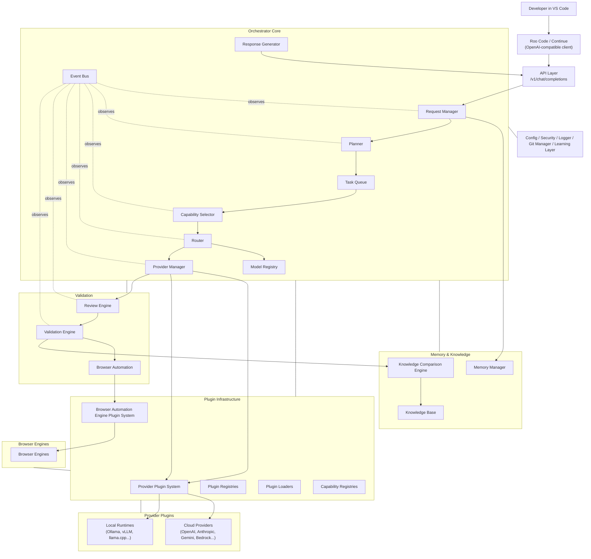

---

## 5. Layered Architecture

| Layer | Contains | Depends on |
|---|---|---|
| **Presentation Layer** | VS Code extension (Roo Code/Continue) — external, not owned by this system | API Layer only |
| **API Layer** | `/v1/chat/completions`-compatible HTTP surface, SSE streaming, auth middleware | Application Layer |
| **Application Layer** | Request Manager, Planner, Task Queue, Capability Selector, Router, Response Generator — orchestration use cases | Domain Layer |
| **Domain Layer** | Entities/value objects (`Task`, `Plan`, `Session`, `Capability`, `MemoryRecord`), ports (interfaces) | Nothing (pure) |
| **Infrastructure Layer** | Config Manager, Logger, Security, Event Bus implementation, Git Manager, persistence | Domain ports |
| **Plugin Infrastructure Layer** | Provider Plugin System, Browser Automation Engine Plugin System, Plugin Registries, Plugin Loaders, Capability Registries | Domain ports |
| **Plugin Layer** | Provider Plugins, Validator Plugins, Memory Engines, Browser Engines, Planner strategies | Domain ports |
| **Storage Layer** | Vector store, KB store, session store, config files | Infrastructure |

Dependency direction always points **inward**: Presentation → API → Application → Domain. Infrastructure and Plugin layers implement Domain ports but are never depended upon by Domain or Application code (Dependency Inversion).

---

## 6. Component Design

Each component below follows the same template: Purpose, Responsibilities, Inputs/Outputs, Dependencies, Internal Workflow, Public Interface, Error Handling, Extensibility.

### 6.1 API Layer

- **Purpose**: Single OpenAI-compatible ingress/egress point for the editor.
- **Responsibilities**: Auth, request validation, SSE/streaming transport, status-token multiplexing, response shaping to `/v1/chat/completions` schema.
- **Inputs**: HTTP POST with OpenAI-style `messages[]`, `tools[]`, `stream` flag.
- **Outputs**: SSE stream of `delta` chunks (tokens + status events) or a single JSON completion.
- **Dependencies**: Request Manager (Application Layer), Security Layer.
- **Internal Workflow**: authenticate → validate schema → normalize into internal `Task` request → hand to Request Manager → stream back normalized chunks.
- **Public Interface**: `POST /v1/chat/completions`, `GET /v1/models`, `GET /health`.
- **Error Handling**: malformed request → 400 with OpenAI-style error body; internal fault → 500 with correlation ID; provider fault surfaces as a normal streamed error delta, not a connection drop.
- **Extensibility**: new endpoints (e.g., `/v1/embeddings`) added without touching orchestration internals.

### 6.2 Request Manager

- **Purpose**: Entry point of the Application Layer; owns request lifecycle and dispatch coordination.
- **Responsibilities**: Load/attach `Session`, trigger memory hydration, hand off to Planner, emit `RequestReceived`.
- **Inputs**: Normalized internal request object.
- **Outputs**: `Task` graph handed to Task Queue.
- **Dependencies**: Memory Manager, Planner, Event Bus.
- **Internal Workflow**: resolve session → load live memory context → invoke Planner → publish lifecycle events.
- **Public Interface**: `handleRequest(request): Session`.
- **Error Handling**: memory load failure → proceed with degraded (empty) context + warning event, never blocks the request.
- **Extensibility**: session resolution strategy (single-user today, multi-tenant later) is a pluggable strategy.

### 6.3 Planner

- **Purpose**: Generate an execution plan without directly selecting or executing providers.
- **Responsibilities**: Intent classification, task decomposition, dependency graph construction, capability annotation.
- **Inputs**: Request + hydrated memory/knowledge context.
- **Outputs**: `Plan` (DAG of `Task` objects).
- **Dependencies**: Knowledge Base (context), Memory Manager (context).
- **Internal Workflow**: classify intent → decompose into subtasks → assign required capabilities per task → emit `PlannerStarted`/`TaskCreated`.
- **Public Interface**: `createPlan(request, context): Plan`.
- **Error Handling**: decomposition failure falls back to a single-task "direct passthrough" plan.
- **Extensibility**: planning strategy is a plugin (`PlannerStrategy` port) — e.g., swap a rule-based planner for an LLM-based planner.

### 6.4 Task Queue

- **Purpose**: Ordered/parallel execution scheduler for a Plan's tasks.
- **Responsibilities**: Respect task dependencies, concurrency limits, cancellation, retries, task leasing, distributed locking, dead-letter queue, recovery, concurrency management, and poison task detection.
- **Inputs**: `Plan`.
- **Outputs**: Task execution results, in-order or fan-in.
- **Dependencies**: Capability Selector, Router, Event Bus.
- **Internal Workflow**: topologically sort DAG → dispatch ready tasks via leasing/locking → collect results → unblock dependents.
- **Public Interface**: `enqueue(plan)`, `cancel(sessionId)`, `leaseTask()`, `recoverDeadLetterQueue()`.
- **Error Handling**: task failure marks node `Failed`; dependents either skip, fallback, or halt per task policy.
- **Extensibility**: scheduling policy (FIFO, priority, cost-aware) is swappable.

### 6.5 Capability Selector and Router

- **Purpose**: Separate capability assessment from execution routing. The Capability Selector evaluates task requirements; the Router decides the execution path.
- **Responsibilities**: The Capability Selector matches required capabilities against registry entries and produces candidate capability sets; the Router applies policy weightings (cost, latency, privacy, tenancy) to select a concrete execution path.
- **Inputs**: `Task` (with required capabilities), Model Registry snapshot.
- **Outputs**: Routing decision and selected execution path.
- **Dependencies**: Model Registry, Provider Manager (for live health), Event Bus.
- **Internal Workflow**: Capability Selector filters candidates by required capabilities → Router ranks by configured weights → check health/availability → select → emit `ProviderSelected`.
- **Public Interface**: `selectCapabilities(task): CapabilityMatchSet`, `route(task): RoutingDecision`.
- **Error Handling**: no candidate matches → escalate to Planner for task re-scoping, or fail task with explicit reason.
- **Extensibility**: ranking function and capability evaluation rules are pluggable strategies; new capability tags require no code change, only registry data.

### 6.6 Model Registry

- **Purpose**: Source of truth for what every known model can do and how it should be discovered at runtime.
- **Responsibilities**: Store per-model metadata; expose runtime discovery and health/availability.
- **Data fields**: provider, capabilities[], context window, tool support, vision support, streaming support, cost/token, latency estimate, priority weight, availability, health status.
- **Dependencies**: Provider Plugin System supplies metadata; Provider Manager updates runtime health.
- **Internal Workflow**: loaded from config at boot → discovered dynamically via provider plugin metadata → periodically refreshed by health checks → queried synchronously by the Capability Selector/Router.
- **Public Interface**: `getCandidates(capabilities[]): ModelEntry[]`, `updateHealth(modelId, status)`, `discoverRuntimeModels()`.
- **Error Handling**: stale entries are marked `unknown` health and deprioritized, not deleted.
- **Extensibility**: adding a model is a config entry or plugin registration, not a code change.

### 6.7 Provider Manager

- **Purpose**: Uniform execution gateway across all Provider Plugin System implementations.
- **Responsibilities**: Instantiate/pool provider plugins, enforce timeouts, normalize streaming/tool-call formats, manage retries/fallback chains, and publish runtime health.
- **Inputs**: `(Provider, Model, Task payload)`.
- **Outputs**: Normalized `ProviderResponse` (text, tool calls, usage, health status).
- **Dependencies**: Provider Plugin System (via Provider Interfaces).
- **Internal Workflow**: resolve plugin → invoke through Provider Interfaces → normalize streamed deltas and tool-call schema → emit `LocalExecutionStarted`/`CloudReviewStarted` as relevant → return.
- **Public Interface**: `execute(providerModel, payload): Stream<NormalizedChunk>`.
- **Error Handling**: timeout/error → retry with backoff per policy → fallback to next-ranked candidate from Router → surface final failure as task error if all exhausted.
- **Extensibility**: new provider = new plugin implementing the Provider Interfaces; zero core changes.

### 6.8 Provider Plugin System

- **Purpose**: Runtime plugin framework for provider integrations.
- **Responsibilities**: Discover provider plugins, register manifests, enforce version compatibility, load plugin implementations, and expose Provider Interfaces.
- **Inputs**: plugin manifests, configuration, runtime health signals.
- **Outputs**: registered provider implementations and lifecycle events.
- **Dependencies**: Plugin Registries, Plugin Loaders, Capability Registries.
- **Internal Workflow**: load manifests → validate compatibility → register capabilities → instantiate plugin → expose to Provider Manager via Provider Interfaces.
- **Public Interface**: `registerPlugin(manifest)`, `reloadPlugin(id)`, `getPlugin(id)`, `listPlugins()`.
- **Error Handling**: plugin load failure → mark plugin unhealthy and exclude it from routing until repaired.
- **Extensibility**: new provider families are added by manifest and plugin implementation only; no core editing.

### 6.9 Review Engine

- **Purpose**: Post-execution quality gate for task outputs.
- **Responsibilities**: Run configurable review passes, produce structured review results, and surface pass/fail plus suggested fixes.
- **Inputs**: Task output + original intent.
- **Outputs**: `ReviewResult` (approved / needs-revision + notes + confidence + evidence).
- **Dependencies**: Router (to select a reviewer model), Provider Manager.
- **Internal Workflow**: evaluate task output → emit `ReviewCompleted` after scoring → return structured `ReviewResult`; it never controls retries directly.
- **Error Handling**: reviewer unavailable → skip review with warning (configurable strict/lenient mode).
- **Extensibility**: review criteria and reviewer selection are configurable/pluggable.

### 6.10 Validation Engine

- **Purpose**: Ground-truth verification beyond text review — regression/behavioral checks.
- **Responsibilities**: Perform schema validation, contract validation, business rule validation, security validation, and compliance validation; orchestrate Browser Automation and Knowledge Comparison to confirm expected vs. actual state.
- **Inputs**: Task output, expected-state definition (from Knowledge Base), validation policies.
- **Outputs**: `ValidationResult` (pass/fail, diff report, compliance status).
- **Dependencies**: Browser Automation, Knowledge Comparison Engine.
- **Internal Workflow**: emit `BrowserValidationStarted` → capture actual state → diff vs. expected → emit `RegressionDetected` if mismatched.
- **Error Handling**: validation tool crash → mark result `Inconclusive`, does not block delivery but flags for user review.
- **Extensibility**: new validators register as additional validator plugins.

### 6.11 Browser Automation

- **Purpose**: Drive a real browser through the Browser Automation Engine Plugin System to observe actual application state and capture visual evidence.
- **Responsibilities**: Navigate, screenshot, DOM-extract, and feed browser state into validation flows.
- **Dependencies**: Browser Automation Engine Plugin System and Browser Engine Interfaces, plus a vision-capable provider (via Router).
- **Error Handling**: navigation timeout → retry once → mark `Inconclusive`.
- **Extensibility**: browser engine implementations (Playwright/Puppeteer/etc.) are swappable plugins behind Browser Engine Interfaces.

### 6.12 Memory Manager (Live Memory)

- **Purpose**: Short-lived, session-scoped working context.
- **Responsibilities**: Track recent turns, active file context, in-flight task state.
- **Dependencies**: none externally; feeds Request Manager and Planner.
- **Error Handling**: corrupted session state resets to a fresh session with a logged warning.
- **Extensibility**: storage backend (in-memory, Redis, SQLite) is swappable behind a `MemoryStorePort`.

### 6.13 Knowledge Base

- **Purpose**: Durable, cross-session project knowledge (architecture facts, decisions, prior fixes).
- **Responsibilities**: Store/retrieve structured + embedded knowledge records.
- **Dependencies**: vector store adapter.
- **Error Handling**: retrieval failure → proceed with reduced context, never blocks.
- **Extensibility**: embedding model and vector store are both swappable via ports.

### 6.14 Knowledge Comparison Engine

- **Purpose**: Compute "expected vs. actual" state diffs — the regression-detection core.
- **Responsibilities**: Normalize both states, diff, classify severity of divergence.
- **Dependencies**: Knowledge Base (expected state), Validation Engine (actual state).
- **Error Handling**: unparseable state → flagged `Inconclusive`, not treated as automatic pass.
- **Extensibility**: comparison strategy pluggable per artifact type (UI screenshot, API response, code diff).

### 6.15 Response Generator

- **Purpose**: Assemble final normalized OpenAI-compatible response/stream back to the editor.
- **Responsibilities**: Merge task outputs, attach status-token trail, format tool calls per the target client's expected schema.
- **Dependencies**: Task Queue results, API Layer.
- **Error Handling**: partial completion → returns best-effort response with an explicit `incomplete` flag in metadata.
- **Extensibility**: response formatting adapters per target client (Roo Code vs. Continue may expect slightly different tool-call framing).

### 6.16 Event Bus

- **Purpose**: Decouple all components via publish/subscribe.
- **Responsibilities**: Deliver events reliably in-process; optionally persist an event log for replay/audit.
- **Error Handling**: subscriber exceptions are isolated — one failing listener never blocks publishing to others.
- **Extensibility**: new event types are additive; consumers subscribe by type without core changes.

### 6.17 Configuration Manager

- **Purpose**: Single source of runtime configuration.
- **Responsibilities**: Load, validate, hot-reload config files; later, serve/persist dashboard edits to the same schema.
- **Error Handling**: invalid config fails fast at boot with a clear schema-violation message.
- **Extensibility**: schema-versioned so old configs migrate forward.

### 6.18 Security Layer

- **Purpose**: Protect the API surface and secrets.
- **Responsibilities**: API key/auth validation, secret storage/redaction in logs, provider credential isolation per plugin.
- **Error Handling**: auth failure → 401, no partial processing.

### 6.19 Git Manager

- **Purpose**: Optional integration for commit-aware workflows (diff-aware context, auto-commit of validated changes).
- **Responsibilities**: Read repo state for context; stage/commit only on explicit policy.
- **Error Handling**: git operation failure never blocks the orchestration response — logged and surfaced as a warning.

### 6.20 Learning Layer

- **Purpose**: Feed outcomes (review results, regressions, user corrections) back into Knowledge Base and Model Registry priority weights.
- **Responsibilities**: Aggregate `ReviewCompleted`/`RegressionDetected`/`TaskCompleted` events into longer-term signal (e.g., "local model X fails vision tasks often → deprioritize").
- **Error Handling**: purely additive/advisory — never a hard gate on request completion.

### 6.21 Logger / Monitoring

- **Purpose**: Structured, correlated observability across the whole event-driven pipeline.
- **Responsibilities**: Correlate every log line to a `sessionId`/`taskId`; redact secrets; expose metrics.

---

## 7. Component Interaction (Primary Sequence)

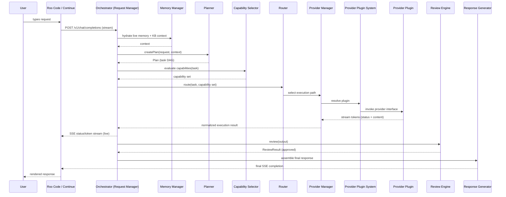

---

## 8. Event-Driven Design

All inter-component signals flow through the Event Bus as immutable, timestamped, `sessionId`-correlated events. Components never call each other's internals directly for cross-cutting notifications — only the Task Queue/Router/Provider Manager chain uses direct port calls for the execution path itself; everything else (logging, learning, UI status streaming) subscribes to events.

**Core event catalog:**

| Event | Emitted by | Consumed by |
|---|---|---|
| `RequestReceived` | Request Manager | Logger, API (status stream) |
| `MemoryLoaded` | Memory Manager | Planner, Logger |
| `PlannerStarted` / `TaskCreated` | Planner | Task Queue, API (status stream) |
| `ProviderSelected` | Router | Provider Manager, Logger, Learning Layer |
| `LocalExecutionStarted` / `CloudReviewStarted` | Provider Manager | API (status stream), Logger |
| `PluginLoaded` / `PluginFailed` / `PluginHealthChanged` | Provider Plugin System / Plugin Loaders | Provider Manager, Logger, Health Events |
| `BrowserActionStarted` / `BrowserActionCompleted` | Browser Automation | Validation Engine, Logger |
| `RecoveryTriggered` / `RecoveryCompleted` | Task Queue / Provider Manager | Logger, API |
| `ConfigurationReloaded` / `ConfigurationChanged` | Configuration Manager | Orchestrator, Logger |
| `HealthChanged` | Provider Manager / Browser Automation | Router, Logger |
| `PluginLifecycleStarted` / `PluginLifecycleCompleted` | Provider Plugin System | Logger, Health Events |
| `ReviewCompleted` | Review Engine | Task Queue, Learning Layer, Logger |
| `BrowserValidationStarted` | Validation Engine | API (status stream) |
| `RegressionDetected` | Knowledge Comparison Engine | Task Queue (trigger fix loop), Learning Layer |
| `KnowledgeUpdated` | Knowledge Base | Logger |
| `MemoryUpdated` | Memory Manager | Logger |
| `TaskCompleted` | Task Queue | Response Generator, Learning Layer |
| `ResponseGenerated` | Response Generator | API Layer, Logger |

The API Layer subscribes to the "status stream" subset of these events to emit **status tokens** interleaved with content tokens during long orchestration runs, so the editor shows live progress ("Planning…", "Routing to local model…", "Reviewing…") rather than a silent wait.

---

## 9. Plugin Architecture

Every extension point (Provider, Tool, Memory Engine, Review Engine, Browser Engine, Validator, Planner strategy) follows the same pattern:

1. **Port (interface)** defined in the Domain Layer — e.g., `ChatCompletionPort`, `ValidatorPort`, `MemoryStorePort`.
2. **Manifest** — a small metadata file/object declaring plugin id, version, declared capabilities, and required config keys.
3. **Registry** — loads manifests at boot (or hot-reloads), validates against the port contract, and registers the plugin instance under its declared capability tags.
4. **Isolation** — plugin failures are caught at the adapter boundary and normalized into domain error types; a broken plugin never crashes the core.

Additional architectural constraints:
- **Capability Negotiation**: plugins advertise supported capability sets and negotiate compatibility with task requirements at runtime.
- **Plugin Compatibility Matrix**: compatibility is validated against the port contract, plugin version, and required capability set before activation.
- **Plugin Versioning**: semantic versioning and compatibility policy govern safe upgrades and rollback.
- **Plugin Dependencies**: optional and required plugin dependencies are modeled explicitly so registries can validate activation order.
- **Plugin Health**: registries publish health state, heartbeat status, and readiness so routing decisions can avoid unhealthy plugins.
- **Rolling Plugin Upgrade**: upgrades can be staged incrementally without full-system downtime.
- **Blue/Green Deployment**: plugin release can be validated in parallel before promotion.
- **Hot Reload**: manifests and plugin implementations can be reloaded without restarting the orchestrator process.
- **Hot Rollback**: a previously healthy plugin version can be reactivated immediately if a new release fails.

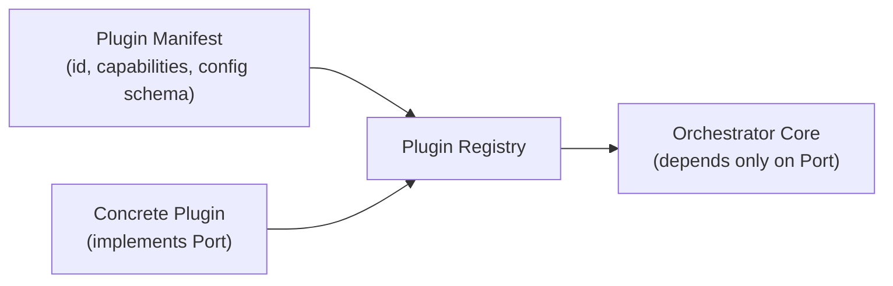

Installing a plugin means: drop it in the plugins directory (or install via package manager), declare it in config, restart or hot-reload — **no core file is ever edited**.

---

## 10. Provider Architecture

The core never imports a provider SDK. All providers — OpenAI, Anthropic, Gemini, OpenRouter, Cloudflare, NVIDIA, Azure OpenAI, AWS Bedrock, Vertex AI, Groq, Together AI, Fireworks AI, DeepInfra, Ollama, LM Studio, vLLM, llama.cpp, LocalAI, or any OpenAI-compatible/custom endpoint — are implemented as Provider Plugin System modules exposing Provider Interfaces (for example `ChatCompletionPort`, `EmbeddingPort`, `VisionPort`, or `ToolCallPort`).

Because many of these are already OpenAI-compatible at the wire level, a **generic OpenAI-compatible provider plugin** can cover most cloud and local runtimes out of the box; providers with divergent schemas (Anthropic's message format, Bedrock's request signing, Vertex's auth) get dedicated plugins. This keeps the *marginal cost of a new provider* close to zero for the common case while preserving a consistent plugin lifecycle.

---

## 11. Capability-Based Routing

The Router never asks "which provider?" — it asks "which capabilities does this task need?" Each `Task` produced by the Planner is annotated with required capabilities, e.g.:

`reasoning`, `coding`, `vision`, `tool_use`, `long_context`, `low_cost`, `low_latency`, `local_execution`, `privacy`, `streaming`, `structured_output`.

**Routing algorithm (conceptual):**
1. Query Model Registry for all models whose capability set is a superset of the task's required capabilities.
2. Filter out unhealthy/unavailable candidates.
3. Score remaining candidates against configured routing preferences (weighted sum of cost, latency, quality-priority).
4. Select highest score; hand `(Provider, Model)` to Provider Manager.
5. On execution failure, re-enter at step 2 excluding the failed candidate (fallback chain).

This means a privacy-sensitive task can be constrained to `local_execution` + `privacy` capabilities and will **never** be routed to a cloud provider, purely through registry data — no special-case code.

---

## 12. Model Registry (Schema)

| Field | Description |
|---|---|
| `modelId` | Unique identifier |
| `providerId` | Owning provider plugin |
| `capabilities[]` | Tag list (see §11) |
| `contextWindow` | Max tokens |
| `toolSupport` | bool |
| `visionSupport` | bool |
| `streamingSupport` | bool |
| `costPerToken` | For cost-aware ranking |
| `latencyEstimateMs` | Rolling average, updated from telemetry |
| `priorityWeight` | Operator-configured preference bias |
| `availability` | enabled/disabled |
| `health` | healthy / degraded / unreachable / unknown |

The Capability Selector and Router read this registry synchronously per routing decision; the Provider Plugin System supplies model metadata at runtime, and the Provider Manager updates runtime status and health information, keeping reads cheap and writes centralized (single-writer principle avoids race conditions).

---

## 13. Configuration System

- **Phase 1 (current)**: YAML/JSON config files, hot-reloadable, schema-validated at load.
- **Phase 2 (future)**: local web dashboard that reads/writes the *same* schema via the Configuration Manager's API — no parallel config path is ever introduced.

**Structure (conceptual):**
```
config/
  system.yaml        # global: log level, ports, timeouts
  providers.yaml      # provider credentials, enabled/disabled, priority
  models.yaml         # Model Registry seed data
  routing.yaml         # capability weighting preferences
  profiles/
    development.yaml
    production.yaml
  plugins.yaml         # enabled plugin manifests
```

Profiles (`development`, `production`, `debug`) override base `system.yaml` values; the active profile is chosen via environment variable at boot, with all values still overridable without redeploying code.

---

## 14. Folder Structure

```
orchestrator/
  api/                  # API Layer: routes, streaming, auth middleware
  application/          # Request Manager, Planner, Task Queue, Capability Selector, Router, Response Generator
  domain/                # Entities, value objects, port interfaces (pure, no I/O)
  infrastructure/
    eventbus/
    logger/
    config/
    security/
    git/
  plugins/
    provider-plugin-system/
    browser-plugin-system/
    providers/
    validators/
    memory-engines/
    browser-engines/
    planners/
  browser-automation/    # Browser Automation orchestration and browser lifecycle
  memory/                # Memory Manager + Knowledge Base storage adapters
  validation/            # Review Engine, Validation Engine, Knowledge Comparison
  learning-layer/        # Learning Layer aggregation logic
  configuration-manager/ # Configuration Manager and schema/runtime config
  dashboard-backend/     # Optional dashboard API for configuration and observability
  config/                # runtime config files (see §13)
  tests/
```

Each top-level folder maps 1:1 to a layer or plugin category from §5/§9, so the folder structure *is* the architecture diagram.

---

## 15. API Architecture

**Endpoints:**

| Endpoint | Purpose |
|---|---|
| `POST /v1/chat/completions` | Primary orchestration entry (OpenAI-compatible), supports `stream: true` |
| `GET /v1/models` | Lists registry-exposed models (satisfies client model-list expectations) |
| `GET /health` | Liveness/readiness |
| `GET /v1/status/{sessionId}` | Poll fallback for clients that don't support SSE |

**Request flow**: Auth middleware → schema validation → normalize to internal request → Request Manager → (async) Task Queue execution → Response Generator streams back.

**Streaming/status-token handling**: the SSE stream carries two interleaved delta types — `content` deltas (actual model tokens) and `status` deltas (`{"type":"status","stage":"planning|routing|reviewing|validating","detail":"..."}`), both wrapped in OpenAI-compatible `choices[0].delta` extensions so non-status-aware clients can safely ignore the `status` field while status-aware UIs surface live progress.

**Tool-call schema normalization**: regardless of provider-native tool-call format (OpenAI function-calling, Anthropic tool_use, Gemini function-calling), the Provider Manager normalizes all tool calls into the OpenAI `tool_calls[]` schema before they leave the orchestrator, so Roo Code/Continue never need provider-specific parsing.

**Authentication**: local API key (bearer token) validated by the Security Layer; provider-side credentials are stored server-side only and never exposed to the client.

---

## 16. Memory Architecture

| Component | Scope | Lifetime | Storage |
|---|---|---|---|
| Live Memory | Single session | Session duration | In-memory / Redis |
| Session State | Single session | Session duration | In-memory / Redis |
| Project Memory | Per-repo/project | Persistent | Local DB / vector store |
| Knowledge Base | Cross-session, cross-project (taggable) | Persistent | Vector store + structured store |
| Long-term Memory | Curated, promoted from project memory | Persistent | Vector store |

**Context injection**: the Request Manager assembles a bounded context window from Live Memory + top-k Knowledge Base retrieval before invoking the Planner, so token budgets are respected per task's target model context window.

**Memory updates**: `TaskCompleted` and `ReviewCompleted` events trigger the Memory Manager to write session deltas to Project Memory; the Learning Layer periodically promotes recurring/validated facts into Long-term Memory.

---

## 17. Validation Architecture

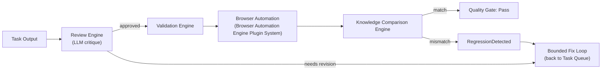

- **Quality Gates**: configurable minimum bar (review score threshold + validation pass) before a task is marked `Completed`.
- **Automatic Fix Loop**: bounded retry count (configurable, default small e.g. 2–3) to avoid infinite loops; on exhaustion, task is marked `CompletedWithWarnings` and surfaced to the user rather than silently failing.

---

## 18. Error Handling (Cross-Subsystem)

**General policy**: fail *narrow*, never fail *wide*. A failure in one task, provider, or plugin degrades that unit of work, not the whole session.

| Subsystem | Failure Mode | Handling |
|---|---|---|
| API Layer | Malformed request | 400 + OpenAI-style error body |
| Request Manager | Memory hydration failure | Continue with empty context + warning |
| Planner | Decomposition failure | Fallback to single-task direct plan |
| Capability Selector / Router | No capable candidate | Escalate to Planner for re-scoping, or explicit task failure |
| Provider Manager | Timeout/error | Retry with backoff → fallback to next candidate → final task error |
| Review Engine | Reviewer unavailable | Skip (configurable strict/lenient) |
| Validation Engine | Tool crash | Mark `Inconclusive`, non-blocking |
| Knowledge Comparison | Unparseable state | `Inconclusive`, never auto-pass |
| Memory/KB | Read/write failure | Degrade gracefully, log, never block response |
| Plugin (any) | Uncaught exception | Isolated at adapter boundary → normalized `PluginError` → excluded from registry until healthy |
| Plugin (any) | Plugin version conflict | Disable incompatible plugin version and surface compatibility error |
| Plugin (any) | Plugin compatibility failure | Reject activation and log compatibility matrix mismatch |
| Task Queue | Distributed lock failure | Retry with lease refresh or requeue task |
| Task Queue | Leader election failure | Fall back to single-node scheduling with warning |
| Browser Automation | Browser engine failure | Mark validation inconclusive and requeue if policy allows |
| Task Queue | Queue partition failure | Route to alternate partition or fail task with explicit reason |
| Event Bus | Subscriber exception | Isolated per-subscriber, does not block other subscribers or the publisher |

All errors carry a `correlationId` (session/task) for cross-log tracing, and are classified as `Recoverable` (auto-retry/fallback) or `Terminal` (surfaced to user) at the point of origin.

---

## 19. Logging & Monitoring

- **Structured logs**: JSON, one line per event, always including `sessionId`, `taskId`, `component`, `event`, `timestamp`, `durationMs`.
- **Correlation**: every log line for a request traces back through the full event chain (`RequestReceived` → … → `ResponseGenerated`).
- **Secret redaction**: Security Layer scrubs API keys/tokens before any log write.
- **Metrics** (exposed for scraping): request latency, per-provider success/failure rate, per-provider average latency/cost, review pass-rate, regression rate, fix-loop iteration counts, distributed metrics, cluster metrics, plugin metrics, browser pool metrics, and queue metrics.
- **Debug mode**: verbose event payload logging, enabled per `system.yaml` profile — never on by default in `production`.

---

## 20. Security Architecture

- **API key authentication** on the local orchestrator API surface.
- **Credential isolation**: each Provider Plugin holds only its own credentials, injected at boot from a secrets store — never shared across plugins, never logged.
- **Plugin signing**: plugin artifacts are signed and verified before activation.
- **Plugin integrity verification**: manifests and package hashes are validated prior to registration.
- **Zero trust plugin loading**: plugins are loaded with least privilege and isolated execution boundaries.
- **Least privilege for Git Manager**: read-only by default; write/commit only under explicit opt-in policy.
- **Sandboxed Browser Automation**: runs in an isolated headless context, no access to host secrets.
- **Browser sandbox isolation**: browser engines execute in isolated containers or sandboxes to prevent host compromise.
- **Multi-tenant isolation**: workspace and tenant state are isolated at the session, memory, and plugin layers.
- **Input validation** at the API boundary to prevent prompt/schema injection from reaching internal planning logic unsanitized.
- **Audit trail**: the persisted Event Bus log doubles as a security audit trail of every routing/execution decision.

---

## 21. Scalability

- **Horizontal Scaling**: because the Task Queue, Capability Selector, and Router are stateless with respect to individual tasks (state lives in Memory/Session store), multiple Orchestrator process instances can run behind a load balancer sharing a common session store (e.g., Redis) for multi-instance deployments.
- **Vertical Scaling**: local model execution (Ollama/vLLM) can be scaled by adding local runtime capacity, discovered automatically via Provider Manager health checks and reflected in the Model Registry.
- **Distributed Clustering**: active-active clusters can host orchestration workers, queue consumers, and plugin registries behind shared infrastructure services.
- **Leader Election**: distributed orchestration components can elect a leader for coordination-sensitive operations while remaining fault tolerant.
- **Distributed Locking**: queue leasing and task ownership use distributed locks so concurrent workers do not double-execute the same task.
- **Elastic Scaling**: worker pools and browser pools can scale up or down in response to queue depth and latency signals.
- **Work Stealing**: idle workers can absorb queued tasks from overloaded partitions to improve throughput.
- **Sharding**: session and task state can be sharded by tenant, workspace, or key space to reduce contention.
- **Partitioning**: the Task Queue and plugin registries can be partitioned to isolate hot workloads and improve fault domain boundaries.
- **Capacity Planning**: provider and browser pool sizing is driven by quantified concurrency, latency, and throughput targets.
- **Cross-Region Deployment**: orchestration services can be deployed across regions to improve resilience and reduce latency for distributed users.
- **Disaster Recovery**: state snapshots, replica stores, and replayable event logs support restoration from regional or infrastructure failure.
- **Fault Tolerance**: degraded provider or browser failures are isolated and do not collapse the full orchestration pipeline.
- **Distributed Browser Pools**: browser automation can fan out across distributed browser pools for parallel validation and regression checks.
- **Distributed Plugin Registry**: plugin metadata and health can be synchronized across nodes for consistent routing and hot reload behavior.
- **Multi-Tenant Deployment**: tenant-aware routing, quotas, and isolation support safe shared infrastructure deployment.
- **High Availability**: redundant workers, queues, and registries ensure the platform remains available under partial failure.
- **Backpressure**: Task Queue enforces per-session and global concurrency limits, queuing overflow rather than overwhelming providers.
- **Caching**: Model Registry and Knowledge Base support read-through caching to reduce redundant provider/vector-store calls for repeated context.

---

## 22. Future Expansion

Because every extension point in §9 is a plugin behind a port:

- **New AI provider** → new plugin implementing Provider Interfaces + manifest + registry config entry. Zero core edits.
- **New language/framework support** → additional Planner strategies and Knowledge Base entries tagged by language; routing capabilities gain a `language:*` tag dimension.
- **New validators** (unit test execution, API contract testing, static analysis) → new `ValidatorPort` plugins registered into the Validation Engine's pipeline.
- **New memory engines** (e.g., graph-based memory) → new `MemoryStorePort` implementation, swapped via config.
- **New browser engines** → new Browser Automation Engine Plugin System implementation with Browser Engine Interfaces.
- **Browser Use** → support for browser-driven agent tasks through plugin-backed browser engines.
- **OpenAI Computer Use** → provider and browser integrations that expose computer-use capabilities through the same plugin framework.
- **Anthropic Computer Use** → equivalent capability integration for Anthropic-managed browser and tool workflows.
- **MCP Browser Engines** → support for Model Context Protocol (MCP)-compatible browser engines via the plugin layer.
- **Remote Browser Providers** → cloud-hosted browser execution environments exposed through the browser plugin system.
- **AI-native Browser Engines** → future browser execution engines optimized for AI-driven interaction patterns.
- **Future Browser Technologies** → new browser backends can be introduced without changing orchestration logic.
- **Dashboard** → a new consumer of the existing Configuration Manager API; no new config path.

The Open/Closed guarantee across the document (§3) is what makes all of the above additive rather than structural changes.

---

## 23. C4 Architecture Diagrams

**Context Diagram**
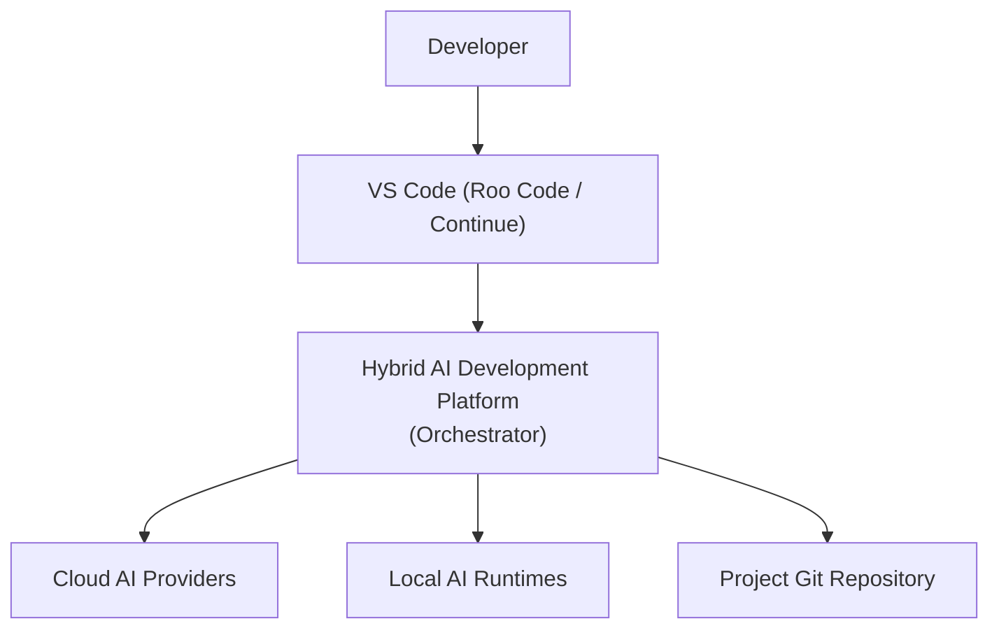

**Container Diagram**
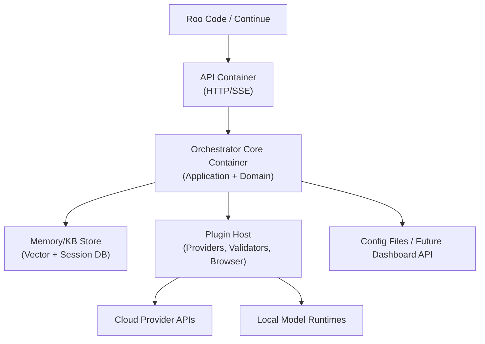

**Component Diagram** (Orchestrator Core container)
Covered in full in §4 (High-Level System Architecture diagram).

**Deployment Diagram**
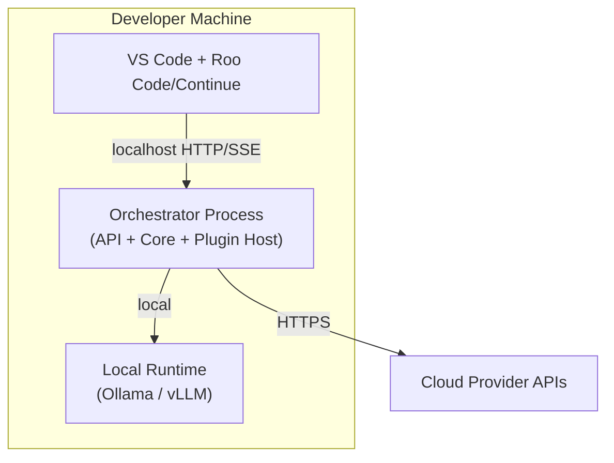

---

## 24. Sequence Diagrams

**Normal Request** — see §7.

**Planning**
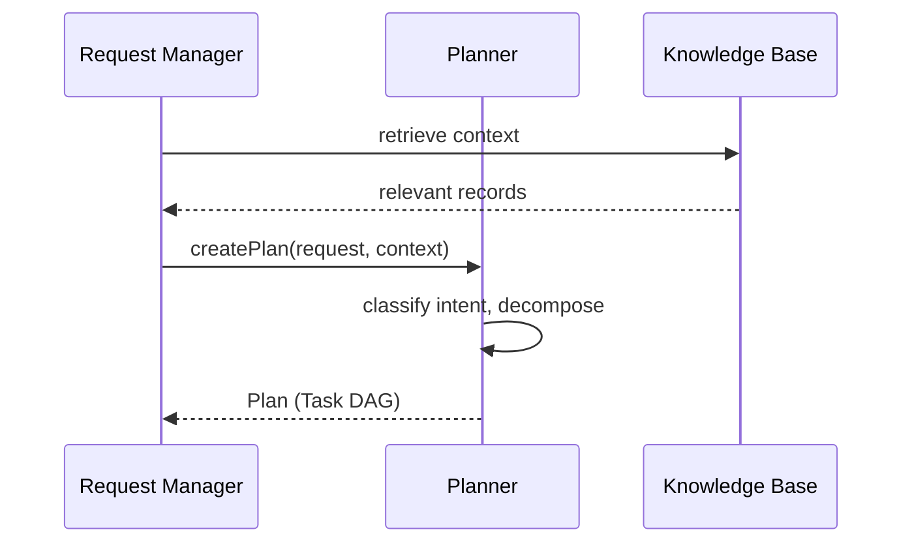

**Review Loop**
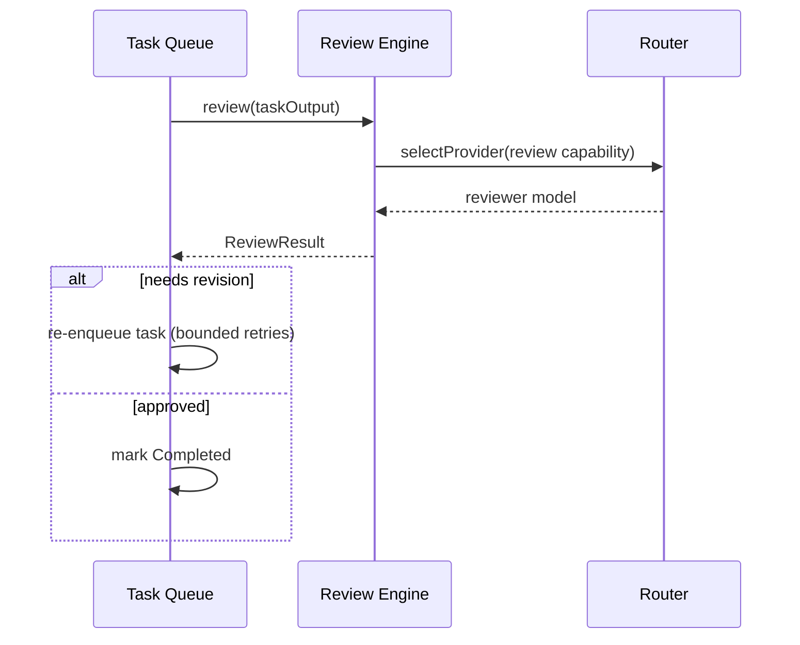

**Memory Update**
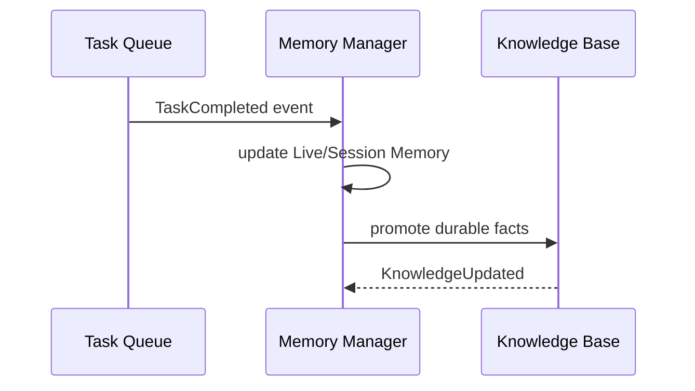

**Provider Selection** — see §11 (routing algorithm) + §7 sequence.

**Browser Validation**
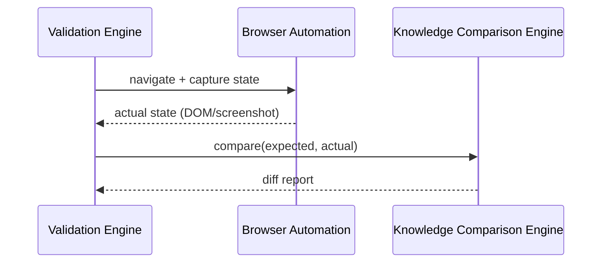

**Regression Detection**
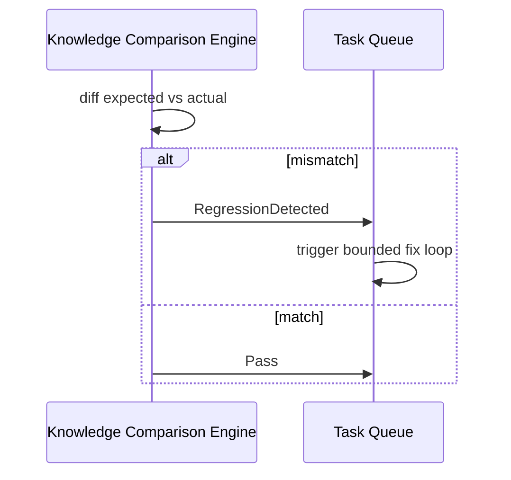

---

## 25. State Diagrams

**Task**
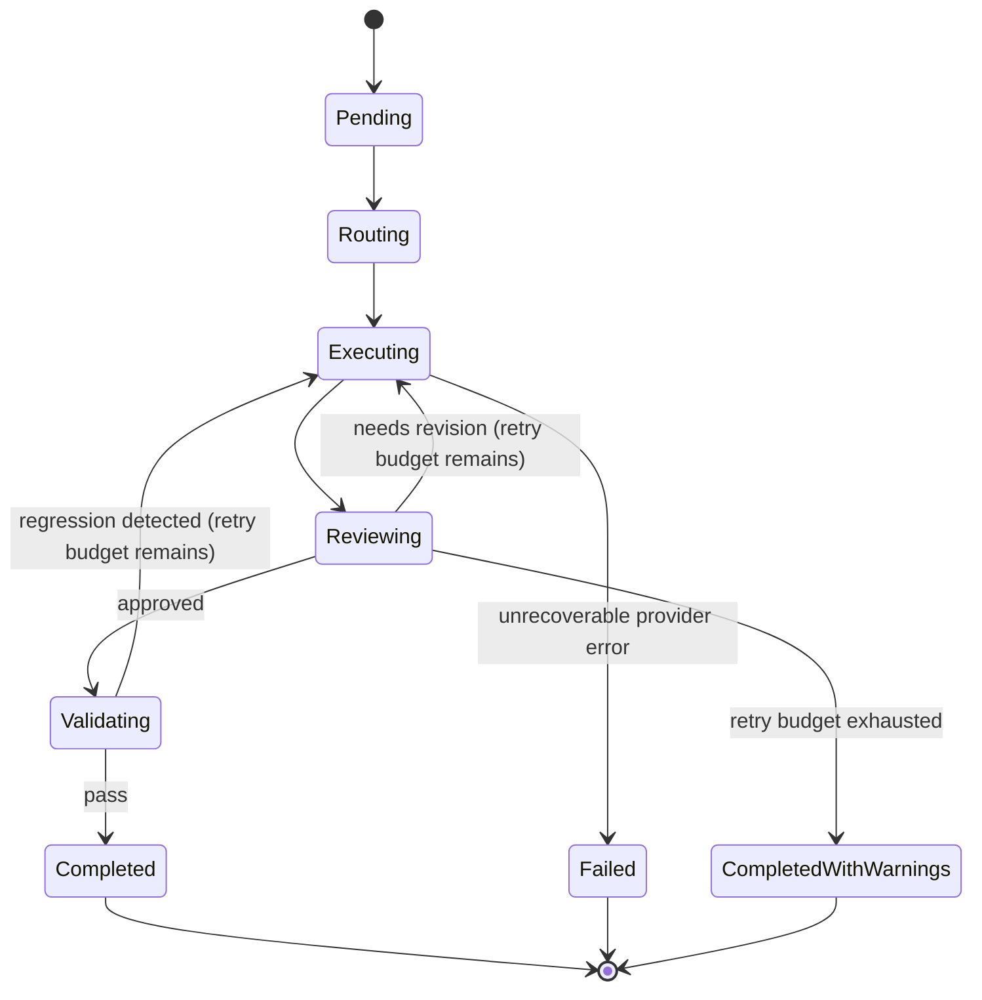

**Request/Session**
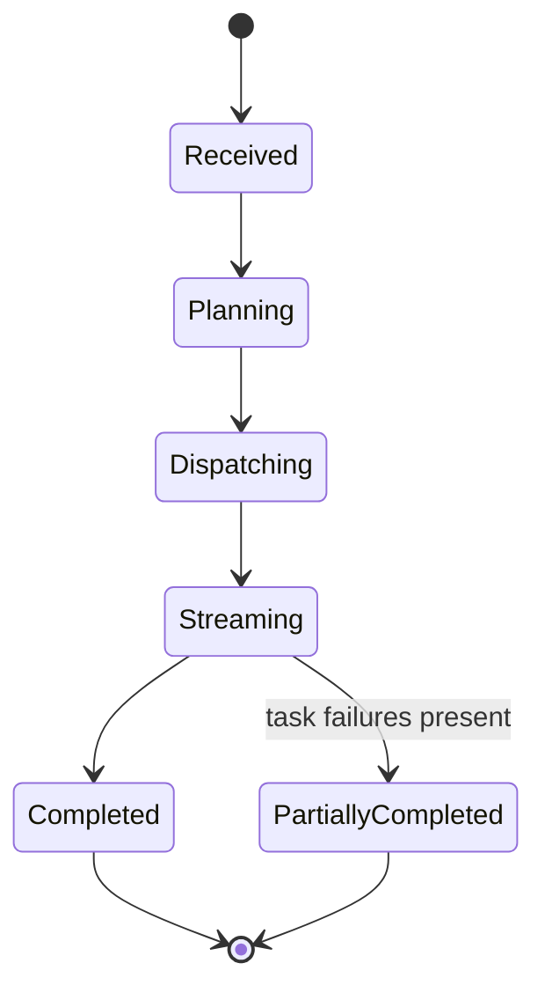

**Review Loop**
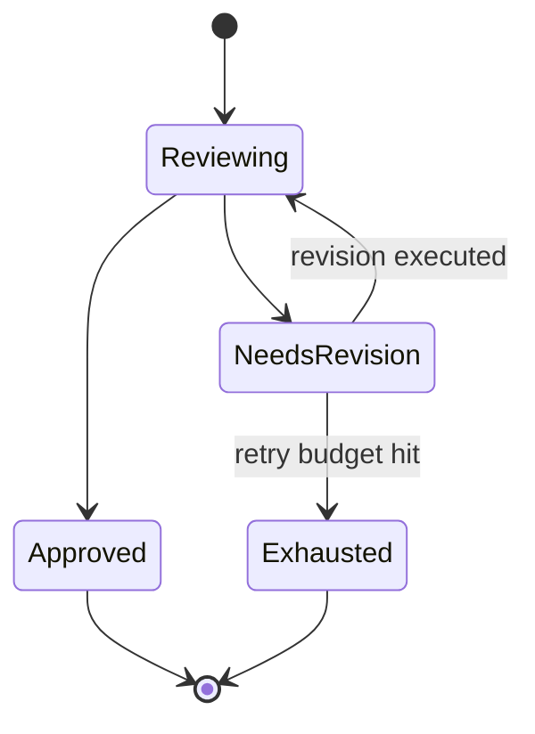

**Memory**
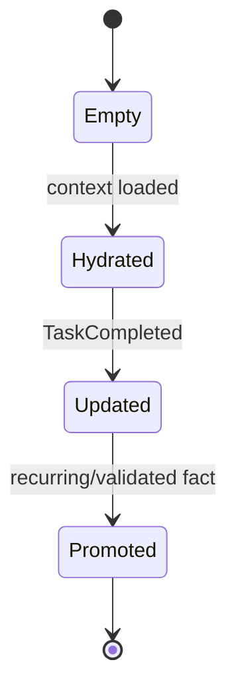

**Provider Selection**
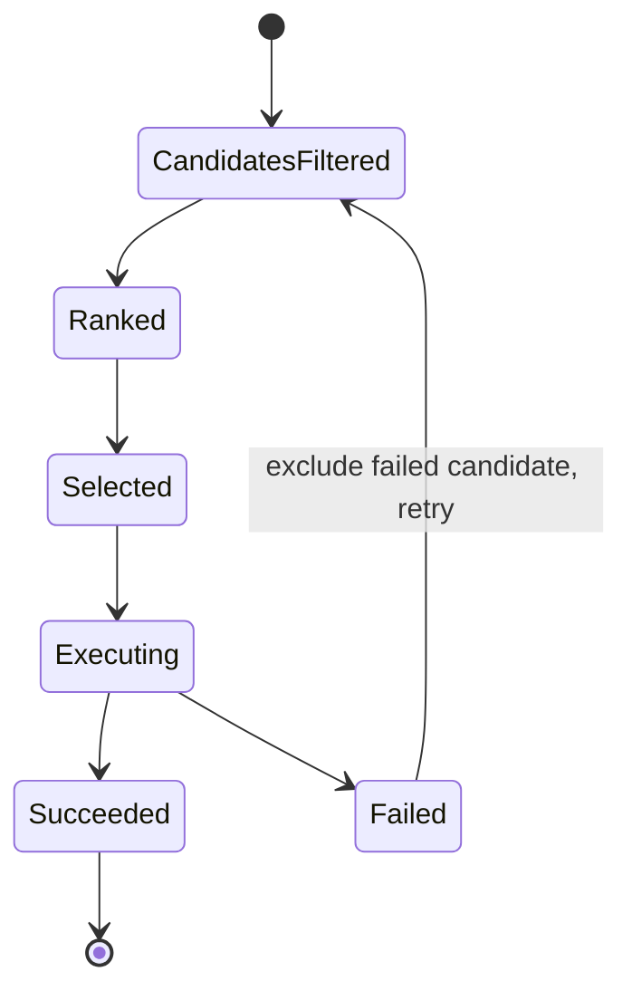

---

## 26. Risks & Trade-offs

| Decision | Benefit | Trade-off / Risk | Mitigation |
|---|---|---|---|
| Modular monolith (not microservices) | Simpler ops, lower latency between components | Less independent scalability per component | Ports/adapters keep it splittable later if needed |
| Capability-based routing (data-driven, not rule-hardcoded) | Zero-code provider onboarding | Requires accurate, well-maintained registry data | Health checks + Learning Layer keep data honest over time |
| Event-driven internals | Loose coupling, replayable audit trail | Slightly harder to trace a single causal chain manually | Correlation IDs + structured logging (§19) |
| Bounded automatic fix loops | Prevents infinite retry storms | May surface a task as "completed with warnings" rather than perfect | Explicit surfacing to user rather than silent failure |
| Config-first (no dashboard yet) | Fast to ship, fully scriptable | Manual YAML editing is less friendly short-term | Schema-first design makes dashboard purely additive later |
| Generic OpenAI-compatible adapter for many providers | Minimal code for most integrations | Edge-case providers with divergent schemas still need custom adapters | Dedicated adapters isolated per provider, core untouched |
| Local + Cloud symmetry | Privacy/offline capability, cost control | Local model quality varies, requiring the Review Engine safety net | Review Engine + capability tagging route quality-critical tasks to stronger models |

---

## Architectural Constraints

These constraints are mandatory architectural rules and form the governing constitution of the platform. They are intended to preserve separation of concerns, enforce module boundaries, and keep the architecture production-ready for implementation.

**Orchestrator**
- Never executes AI providers.
- Never performs planning.
- Never performs routing.
- Never performs browser automation.

**Planner**
- Never selects providers.
- Never executes providers.

**Capability Selector**
- Never performs routing.
- Never executes providers.

**Router**
- Never performs planning.
- Never evaluates user intent.
- Never executes providers.

**Provider Manager**
- Never performs routing.
- Never performs provider discovery.
- Never owns model metadata.

**Provider Plugin System**
- Never executes business logic.
- Never performs orchestration.

**Browser Automation**
- Never executes browser engines directly.

**Browser Automation Engine Plugin System**
- Never owns browser workflows.

**Review Engine**
- Never validates correctness.

**Validation Engine**
- Never evaluates quality.

**Memory Manager**
- Never performs planning.

**Knowledge Base**
- Never performs orchestration.

## Architectural Decision Records

The following architectural decisions capture the governance basis of the platform and should be treated as the authoritative rationale for future implementation decisions.

### ADR-001 — Modular Monolith
- **Decision**: Adopt a modular monolith with plugin boundaries.
- **Context**: The platform requires rapid development, predictable operations, and future extensibility without the cost of distributed service ownership.
- **Alternatives Considered**: Microservices, service-oriented architecture, and a tightly coupled monolith.
- **Rationale**: A modular monolith provides implementation simplicity while preserving clear extensibility boundaries.
- **Consequences**: The architecture remains deployable as a single system while supporting plugin-based evolution.

### ADR-002 — Capability-Based Routing
- **Decision**: Route work using declared capabilities rather than hardcoded provider names.
- **Context**: Provider availability and quality vary across environments and vendors.
- **Alternatives Considered**: Vendor-specific routing and static provider selection.
- **Rationale**: Capability-based routing supports portability, resilience, and policy-driven execution.
- **Consequences**: Routing behavior becomes data-driven and extensible.

### ADR-003 — Provider Plugin Architecture
- **Decision**: Implement providers through a provider plugin architecture.
- **Context**: The platform must support cloud and local providers without embedding vendor-specific logic into the core.
- **Alternatives Considered**: Direct SDK integration and provider-specific adapters embedded in orchestration logic.
- **Rationale**: A plugin architecture isolates provider complexity and preserves core stability.
- **Consequences**: New providers can be introduced without changing orchestration logic.

### ADR-004 — Browser Automation Plugin Architecture
- **Decision**: Implement browser automation through a dedicated plugin architecture.
- **Context**: Browser execution must remain interchangeable across engine implementations and environments.
- **Alternatives Considered**: Hardwired browser engine integration and direct engine-specific orchestration.
- **Rationale**: Plugin-based browser automation enables engine substitution and future compatibility.
- **Consequences**: Browser automation remains extensible without changing the core validation flow.

### ADR-005 — Event-Driven Architecture
- **Decision**: Use an event-driven internal architecture for cross-cutting coordination.
- **Context**: The platform requires loose coupling, observability, and replayable workflow state.
- **Alternatives Considered**: Deep direct calls and synchronous orchestration chains.
- **Rationale**: Events improve decoupling, traceability, and auditability.
- **Consequences**: Components communicate through structured events while preserving execution clarity.

### ADR-006 — Clean Architecture
- **Decision**: Structure the system using Clean Architecture.
- **Context**: The platform must separate domain logic from infrastructure and plugin implementations.
- **Alternatives Considered**: Layered architecture without explicit ports and adapters.
- **Rationale**: Clean Architecture preserves maintainability and supports swap-in replacement of implementations.
- **Consequences**: Domain and application logic remain stable as infrastructure changes.

### ADR-007 — Hexagonal Architecture
- **Decision**: Apply hexagonal architecture boundaries around the core orchestration domain.
- **Context**: The platform must integrate with diverse providers, memory systems, browsers, and storage technologies.
- **Alternatives Considered**: Monolithic implementation with direct dependencies on every external system.
- **Rationale**: Ports and adapters provide stable boundaries for external integrations.
- **Consequences**: Core orchestration remains insulated from integration details.

### ADR-008 — Stateless Orchestrator
- **Decision**: Keep the Orchestrator stateless.
- **Context**: The platform requires high availability, scaling, and resilience in distributed environments.
- **Alternatives Considered**: Stateful orchestration and embedded in-memory workflow state.
- **Rationale**: Stateless orchestration simplifies scaling and improves fault tolerance.
- **Consequences**: Session and workflow state are delegated to dedicated managers and persistent stores.

### ADR-009 — Review Before Validation
- **Decision**: Apply review as a quality gate before validation completes the task outcome.
- **Context**: The platform must balance speed with correctness and avoid false confidence in generated output.
- **Alternatives Considered**: Validation-first execution and direct completion without review.
- **Rationale**: Review provides an explicit quality checkpoint before validation concludes the workflow.
- **Consequences**: The system supports bounded refinement and clearer quality handling.

### ADR-010 — Plugin-First Extensibility
- **Decision**: Make extensibility plugin-first across providers, browsers, validators, and memory systems.
- **Context**: The platform must evolve without frequent core changes.
- **Alternatives Considered**: Hardcoded feature implementations and direct core edits.
- **Rationale**: Plugin-first extensibility supports long-term maintainability and operational flexibility.
- **Consequences**: New capabilities can be introduced through registration and configuration rather than code changes.

*End of document.*
